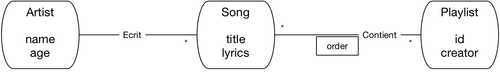
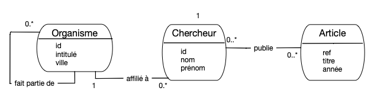

.. _chap-annales:
   
.. |nbsp| unicode:: 0xA0 
   :trim:

###################
Annales des examens
###################

Les examens de NFE204 durent 3 heures, les documents et autres soutiens
ne sont pas autorisés, à l'exception d'une calculatrice. 

Le but de l'examen est de vérifier la bonne compréhension des concepts
et techniques vus en cours. Dans les rares cas où un langage informatique
est impliqué, nous n'évaluons pas les réponses par la syntaxe mais par la clarté,
la concision et la précision. 

************************
Examen du 3 février 2015 
************************

Première partie : recherche d'information (8 pts)
==================================================

Voici quelques extraits d'un discours politique célèbre (un peu modifié pour les besoins de la cause). 
Chaque extrait correspond à un document, numéroté :math:`a_i`.

  #. (a1) Moi, président de la République, je ne serai pas le chef de la majorité, 
     je ne recevrai pas les parlementaires de la majorité à l’Elysée.

  #. (a2) Moi, président de la République, je ne traiterai pas mon Premier ministre de collaborateur.

  #. (a3) Moi, président de la République,  les ministres de la majorité
     ne pourraient pas cumuler  leurs fonctions avec un mandat parlementaire ou local.

  #. (a4) Moi, président de la République, il y aura un code de déontologie  pour les ministres 
     et parlementaires qui ne pourraient pas rentrer dans un conflit d’intérêt.

**Questions**.

  * Rappeler la notion de *stop word* (ou "mot vide") et donner la liste
    de ceux que vous choisiriez dans les textes ci-dessus.
  * Outre ces mots vides, pouvez-vous identifier certains mots dont l'idf tend vers 0 
    (en appliquant le logarithme)? Lesquels?  
  * Présentez la matrice d'incidence pour le vocabulaire suivant:  
    *majorité*, *ministre*, *déontologie*, *parlementaire*.
    Vous indiquerez  l'idf pour chaque terme (sans logarithme), 
    et le tf pour chaque paire (terme, document). Bien entendu, on suppose que les
    termes ont été fait l'objet d'une normalisation syntaxique au préalable.

  * Donner les résultats classés par similarité cosinus basée sur les tf (on ignore l'idf) pour les requêtes suivantes.
  
     * ``majorité``; expliquez le classement;
     * ``ministre``; expliquez le classement du premier document;
     * ``déontologie et ministre``;  qu'est-ce
       qui changerait si on prenait en compte l'idf?
     * ``majorité et ministre``; qu'obtiendrait-t-on avec une requête Booléenne? Commentaire?

  * Calculez la similarité cosinus entre a3 et a4; puis entre a3 et a1. Qui est le plus proche de a3?
   

Seconde partie : Pig et MapReduce (6 pts)
=========================================

Un système d'observation spatiale capte des signaux en provenance de planètes
situées dans de lointaines galaxies.  Ces signaux sont stockés dans une 
collection *Signaux* de la forme  *Signaux (idPlanète, date, contenu)*.

*Le but est de déterminer si ces signaux peuvent être émis par une intelligence extra-terrestre*.
Pour cela les scientifiques ont mis au point les fonctions suivantes:

 #. *Fonction de structure*: :math:`f_S(c): Bool`, prend un contenu en entrée, et renvoie  ``true``
    si le contenu présente une certaine structure, ``false`` sinon.
 #. *Fonction de détecteur d'Aliens*: :math:`f_D(<c>): real`, prend une liste de contenus 
    *structurés* en entrée, et renvoie 
    un indicateur entre 0 et 1 indiquant la probabilité que ces contenus 
    soient écrits en  langage extra-terrrestre, et donc la *présence d'Aliens*!
  
Bien entendu, il y a beaucoup de signaux: c'est du Big Data.

**Questions**.

 #. Ecrire un programme Pig latin qui produit, pour chaque planète, l'indicateur de présence d'Aliens
    par analyse des contenus provenant de la planète.
 #. Donnez un programme MapReduce qui permettrait d'exécuter ce programme Pig en distribué
    (indiquez la fonction de Map, la fonction de Reduce, dans le langage ou pseudo-code qui vous convient).
 #. Ecrire un programme Pig latin qui produit, pour chaque planète et pour chaque jour, 
    le rapport entre  contenus structurés et non structurés reçus de cette planète. 

Troisième partie : questions de cours (6 pts)
=============================================

Concision et précision s'il vous plaît.

 * En recherche d'information, qu'est-ce que le rappel? qu'est-ce que la précision?
 * Deux techniques fondamentales vues en cours sont la réplication et le partitionnement.
   Rappelez brièvement leur définition, et indiquez leurs rôles respectifs. 
   Sont-elles complémentaires? Redondantes?
 * Qu'est-ce qu'une architecture multi-nœuds, quels sont ses avantages et inconvénients?
 * Vous avez 500 TOs de données, et vous pouvez acheter des serveurs pour votre *cloud*
   avec chacun 32 GO de mémoire et 
   10 TOs de disque. Le coût unitaire d'un serveur eest de 500 Euros.
      
   Quelle est la configuration de votre grappe de serveurs la moins coûteuse (financièrement) et combien de temps prend
   au minimum la lecture complète de la collection avec cette solution?
      
 * Même situation:   quelle est la configuration qui assure le maximum d'efficacité, et quel est son coût financier?
       
 * Rappelez le principe de l'éclatement d'un fragment dans le partitionnement par intervalle.
 
 
 
 
***********************
Examen du 14 avril 2015 
***********************

Première partie : recherche d'information (8 pts)
==================================================

Voici notre base documentaire:

  - *d1*: Le loup et les trois petits cochons.
  - *d2*: Spider Cochon, Spider Cochon, il peut marcher au plafond. Est-ce qu'il
    peut faire une toile? Bien sûr que non, c'est un cochon.
  - *d3*: Un loup a mangé un mouton, les autres moutons sont restés dans la bergerie.
  - *d4*: Il y a trois moutons dans le pré, et un autre dans la gueule du loup.
  - *d5*: L'histoire extraordinaire des trois petits loups et du grand méchant cochon.

On va se limiter au vocabulaire ``loup``, ``mouton``, ``cochon``.

 - Donnez la matrice d'incidence *booléenne* (seulement 0 ou 1)
   avec les termes en ligne (NB: on suppose
   une phase préalable de normalisation qui élimine les pluriels, majuscules, etc.)
 - Expliquez par quelle technique, avec cette matrice d'incidence, on peut 
   répondre à la requête booléenne "loup et cochon mais pas mouton".
   Quel est le résultat?
 - Maintenant donnez une matrice d'incidence contenant les tf, 
   et un tableau donnant les idf (sans le *log*), pour les trois termes précédents.
 - Donner les résultats classés par similarité cosinus basée sur les tf 
   (on ignore l'idf) pour les requêtes suivantes.

    * cochon;
    * loup et mouton;
    * loup et cochon.
    
 - On ajoute le document *d6*: "Shaun le mouton: une nuit
   de cochon".
   
   Quel est son score pour la requête "loup et mouton", 
   quel autre document a le même score et qu'est-ce qui change
   si on prend en compte l'idf?
   
 - Pour la requête "loup et cochon" et les documents d1 et d5, 
   qu'est-ce qui change si on ne met pas de restriction 
   sur le vocabulaire (tous les mots sont indexés)?

Seconde partie : Pig et MapReduce (6 pts)
=========================================

Une organisation terroriste, le Spectre, envisage de commettre un attentat
dans une station de métro. Heureusement, le MI5 dispose d'une base de données d'échanges
téléphoniques et ses experts ont mis au point un décryptage qui identifie
la probabilité qu'un message provienne du Spectre d'une part, et fasse
référence à une station de métro d'autre part.

Après décryptage, les messages obtenus ont la forme suivante:

.. code-block:: javascript

   {
    "id": "x1970897",
    "émetteur": "Joe Shark", 
    "contenu": "Hmm hmm hmmm",
    "probaSpectre": 0.6,
    "station": "Covent Garden"
    
    
Il y en a des milliards: vous avez quelques heures pour trouver la solution.

 #. Spécifier les deux fonctions du programme MapReduce qui
    va identifier la station-cible la plus probable. Ce programme doit sélectionner
    les messages émis par le Spectre avec une probabilité de plus de 70%,  et produire, 
    pour chaque station le nombre de tels messages où elle est mentionnée.
 #. Quel est le programme Pig qui exprime ce traitement MapReduce?
 #. On veut connaître les 5 mots les plus couramment employés par 
    chaque émetteur dans le contenu de ses messages. Expliquez, avec la formalisation 
    de votre choix, comment obtenir cette information (vous avez le droit 
    d'utiliser un opérateur de tri).

Troisième partie : questions de cours (6 pts)
=============================================

 - En recherche d'information, que signifient les termes "faux positifs"
   et "faux négatifs"?
 - Je soumets une requête :math:`t_1, t_2, \cdots, t_n`. 
   Quel est le poids de chaque terme dans le vecteur représentant cette requête? 
   La normalisation de ce vecteur est elle importante pour le classement (justifier)?
 - Donnez trois bonnes raisons de choisir un système relationnel plutôt
   qu'un système NoSQL pour gérer vos données.
 - Donnez trois bonnes raisons de choisir un système NoSQL plutôt
   qu'un système relationnel pour gérer vos données.
 - Rappeler la règle du quorum 
   (majorité des votants) en cas de partitionnement de réseau, et justifiez-la.
 - Dans un traitement MapReduce, peut-on toujours se contenter d'un seul
   *reducer*? Avantages? Inconvénients?

**********************
Examen du 15 juin 2015 
**********************

Première partie : documents structurés (6 pts)
==============================================

Une application s'abonne à un flux de nouvelles dont voici un échantillon. 

.. code-block:: xml

    <myrss version="2.0">
      <channel>
        <item>
            <title>Angela et nous</title>
            <description>Un nouveau sommet entre la France et l'Allemagne
                est prévu en Allemagne la semaine prochaine pour relancer l'UE.
            </description>
            <links>
                <link>lemonde.fr</link>
                <link>lesechos.fr</link>
            </links>
        </item>
        <item>
            <title>L'Union en crise</title>
            <description> L'Allemagne, la France, l'Italie doivent à nouveau se
                réunir pour étudier les demandes de la Grèce.
            </description>
            <links>
                <link>lefigaro.fr</link>
            </links>
        </item>
        <item>
            <title>Alexis à l'action</title>
            <description>Le nouveau premier ministre de la Grèce
                a prononcé son discours d'investiture.
            </description>
            <links>
                <link>libe.fr</link>
            </links>
        </item>
        <item>
            <title>Nos cousins transalpins</title>
            <description>La France et l'Italie partagent plus qu'une frontière
                commune: le point de vue de l'Italie.
            </description>
            <links>
                <link>courrier.org</link>
            </links>
        </item>
      </channel>
    </myrss>

Chaque nouvelle (``item``) résume donc un sujet et propose des liens
vers des médias où le sujet est développé. Les quatre éléments 
``item`` seront désignés respectivement par
d1, d2, d3 et d4.

 #. Donnez la forme arborescente de ce document (ne recopiez
    pas tous les textes: la structure du document suffit).
 #. Proposez un format JSON pour représenter le même contenu (idem: la structure suffit).
 #. Dans une base relationnelle, comment modéliser
    l'information contenue dans ce document?
 #. Quelle est l'expression XPath pour obtenir tous les éléments ``link``?
 #. Quelle est l'expression XPath pour obtenir
    les titres des items dont l'un des ``link`` est ``lemonde.fr``?

Deuxième partie : recherche d'information (6 pts)
=================================================
   
On veut indexer les nouvelles reçues de manière à pouvoir les rechercher
en fonction d'un pays. Le vocabulaire auquel on se restreint est donc celui
des noms de pays (Allemagne, France, Grèce, Italie).

 #. Donnez une matrice d'incidence contenant les tf pour les quatre pays,
    et un tableau donnant les idf (sans appliquer le *log*). Mettez les noms de pays
    en ligne, et les documents en colonne.
 #. Donner les résultats classés par similarité cosinus basée sur les tf 
    (on ignore l'idf) pour les requêtes suivantes. Expliquez brièvement le classement.
  
     * Italie;
     * Allemagne et France ;
     * France et Grèce.
 
 #. Reprenons la dernière requête, "France et Grèce" et les documents d2 et d3.
    Qu'est-ce que la prise en compte de l'idf changerait au classement?
    

Troisième partie : MapReduce (4 pts)
====================================

Voici quelques analyses à exprimer avec MapReduce et Pig.

 #. On veut  compter le nombre de nouvelles consacrées
    à la Grèce publiées par chaque média. Décrivez le programme MapReduce
    (fonctions de Map et de Reduce) qui produit le résultat souhaité. 
    Donnez le pseudo-code de chaque
    fonction, ou indiquez par un texte clair son déroulement.

    Vous disposez d'une fonction *contains(:math:`texte, :math:`mot)* qui renvoie vrai
    si ``:math:`texte`` contient ``:math:`mot``. 

 #. Quel est le programme Pig qui exprime ce traitement MapReduce?
  

Quatrième partie : questions de cours (6 pts)
=============================================

Questions reprises des Quiz.

********************************
Examen du 1er juillet 2016 (FOD)
********************************

Exercice corrigé: documents structurés et MapReduce (8 pts)
===========================================================

.. note:: Ce premier exercice (légèrement modifié et étendu)
   est corrigé entièrement. Les autres exercices
   consistaient en un énoncé classique de recherche d'information (8 points)
   et 4 brèves questions de cours (4 points).
   

Le service informatique du Cnam a décidé de représenter ses données sous forme de documents
structurés pour faciliter les processus analytiques. Voici un exemple de documents
centrés sur les étudiant.e.s et incluant les Unités d'Enseignement (UE) suivies
par chacun.e.

.. code-block:: json

   [{
      "_id": 978,
      "nom": "Jean Dujardin",
      "annee": "2016",
        "UE": [{"ue":11, "note": 12,
                {"ue":27, "note": 17,
                 {"ue":37,  "note": 14 
                ]
     ,
    {
    "_id": 476,
    "nom": "Vanessa Paradis",
    "annee": "2016",
    "UE": [{"ue": 13, "note": 17,
            {"ue":27, "note": 10,
            {"ue":76,  "note": 11 
         ]
    
  ]

Question 1: documents et base relationnelle
==============================================

.. admonition:: Question

    Sachant que ces documents sont produits à partir d'une base relationnelle, 
    reconstituez le schéma de cette base et indiquez le contenu des tables correspondant
    aux documents ci-dessus.

Il y a clairement une table ``Inscription (id, nom année)`` et une table ``Note (idInscription, ue, note)``.
Il y a probablement aussi une table ``UE`` mais elle n'est pas strictement nécessaire pour produire 
le document ci-dessus.

Question 2: restructuration de documents
=========================================

.. admonition:: Question

    Proposez une autre représentation  des mêmes données, centrée cette fois, non plus sur les étudiants, mais sur les UEs. 

Voilà, à compléter avec les UEs 13 et 37.

.. code-block:: json

   [
    {
      "_id": 387,
      "UE": 11,
      "inscrits": [
         {"nom": "Jean Dujardin", "annee": "2016", "note": 12
       ]
      ,
      {
      "_id": 3809,
      "UE": 27,
      "inscrits": [
         {"nom": "Jean Dujardin", "annee": "2016", "note": 17,
         {"nom": "Vanessa Paradis", "annee": "2016", "note": 10,
       ]
      ,
      {
      "_id": 987,
      "UE": 76,
      "inscrits": [
         {"nom": "Vanessa Paradis", "annee": "2016", "note": 11
       ]
      
  ]
  
Question 3: MapReduce et la notion de document "autonome"
=========================================================

.. admonition:: Question

    On veut implanter, par un processus MapReduce, le calcul de la moyenne des notes d'un étudiant.
    Quelle est la représentation la plus appropriée parmi les trois précédentes
    (une en relationnel, deux en documents structurés), et pourquoi?
       
La première représentation est très bien adaptée à MapReduce, puisque chaque document
contient l'intégralité des informations nécessaires au calcul. Si on prend
le document pour Jean Dujardin par exemple, il suffit de prendre le
tableau des UE et de calculer la moyenne. Donc, pas besoin de jointure, pas
besoin de regroupement. Le calcul peut se faire intégralement dans la
fonction de Map, et la fonction de Reduce n'a rien à faire.

C'est l'iiustration de la notion de *document autonome*: pas besoin d'utiliser
des références à d'autres documents (ce qui mène à des jointures en relationnel) ou de distribuer
l'information nécsesaire dans plusieurs documents (ce qui mène à des regroupements en MapReduce).

Si on a choisit de construire les documents structurés en les centrant sur le UEs,
il y a beaucoup plus de travail, comme le montre la question suivante.

Question 4: MapReduce, outil de restructuration/regroupement
============================================================

.. admonition:: Question

    Spécifiez le calcul du nombre d'étudiants par UE, en MapReduce, 
    en prenant en entrée des documents centrés sur les étudiants (exemple donné ci-dessus).
   
Cette fois, il va falloir utiliser toutes les capacités du modèle MapReduce
pour obtenir le résultat voulu. Comme suggéré par la question précédente,
la représentation centrée sur les UE serait beaucoup plus appropriée
pour disposer d'un document *autonome* contenant toutes les informations
nécessaires. C'est exactement ce que l'on va faire avec MapReduce:
transformer la représentation centrée sur les étudiants en représentation
centrée sur les UEs, le reste est un jeu d'enfant.

La fonction de Map
------------------

Une fonction de Map produit des paires (clé, valeur). La première
question à se poser c'est: quelle est la clé que je choisis de produire?
Rappelons que la clé est une sorte d'étiquette que l'on pose sur 
chaque valeur et qui va permettre de les regrouper.

Ici, on veut regrouper par UE pour pouvoir compter tous les étudiants inscrits.
On va donc émettre une paire intermédiaire pour chaque UE mentionnée dans
un document en entrée. Voici le pseudo-code.

.. code-block:: bash

    function fonctionMap (:math:`doc) # doc est un document centré étudiant 
    {
      # On parcourt les UEs du tableau UEs
      for    [:math:`ue in :math:`doc.UEs] do 
         emit (:math:`ue.id, :math:`doc.nom)
      done 
    

Quand on traite le premier document de notre exemple, on obtient donc
trois paires intermédiaires:

.. code-block:: javascript

    {"ue:11", "Jean Dujardin"
    {"ue:27", "Jean Dujardin"
    {"ue:37", "Jean Dujardin"

Et quand on traite le second document, on obtient:

.. code-block:: javascript

    {"ue:13", "Vanessa Paradis"
    {"ue:27", "Vanessa Paradis"
    {"ue:76", "Vanessa Paradis"

Toutes ces paires sont alors transmises à "l'atelier d'assemblage" qui
les regroupe sur la clé. Voici la liste des groupes (un par UE).

.. code-block:: javascript

    {"ue:11", ["Jean Dujardin"]
    {"ue:13", "Vanessa Paradis"
    {"ue:27", ["Jean Dujardin", "Vanessa Paradis"]
    {"ue:37", "Jean Dujardin"
    {"ue:76", "Vanessa Paradis"

Il reste à appliquer la fonction de Reduce à chaque groupe. 

.. code-block:: bash

    function fonctionReduce (:math:`clé, :math:`tableau) 
    {
      return (:math:`clé, count(:math:`tableau)
    

Et voilà.

    
Question 5: MapReduce = group-by SQL
====================================

.. admonition:: Question

     Quelle serait la requête SQL correspondant à ce dernier calcul sur la base relationnelle ?
   
Avec SQL, c'est direct, à condition d'accepter de faire des jointures.

.. code-block:: sql

    select u.id, u.titre, count(*) 
    from Etudiant as e, Inscription as i, UE as u
    where e.id = i.idEtudiant
    and   u.id = i.idUE
    group by u.id, u.titre
    
    

***************************************
Examen du 1er février 2017 (Présentiel)
***************************************

Première partie : documents structurés (5 pts)
==============================================

Un institut chargé d'analyser l'opinion publique collecte des articles parus dans 
la presse en ligne, ainsi que les commentaires déposés par les internautes sur ces articles.
Ces informations sont stockées dans une base relationnelle, puis
mises à disposition des analystes sous la forme de documents JSON dont voici
deux exemples.

.. code-block:: json

    {
     "_id": 978,
    "_source": "lemonde.fr",
    "date": "07/02/2017",
    "titre": "Le président Trump décide d'interdire l'entrée de tout étranger aux USA",
    "contenu": "Suite à un décret paru ....",
    "commentaires": [
         {"internaute": "chocho@monsite.com",
        "note": 5,
        "commentaire": "Les décisions du nouveau président sont inquiétantes ..."
        ,
        {"internaute": "alain@dugenou.com",
        "note": 2,
        "commentaire": "Arrêtons de critiquer ce grand homme..."
        
      ]
    
    {
    "_id": 54,
    "source": "nimportequoi.fr",
    "date": "07/02/2017",
    "titre": "La consommation de pétrole aide à lutter contre le réchauffement",
    "contenu": "Contrairement à ce qu'affirment les media officiels ....",
    "commentaires": [
        {"internaute": "alain@dugenou.com",
         "note": 5,
        "commentaire": "Enfin un site qui n'a pas peur de dire la vérité ..."
        
     ]
    

Les notes vont de 1 à 5, 1 exprimant un fort désacord avec le contenu de l'article, et 5 un accord complet.

   A) À votre avis, quel est le schéma de la base relationnelle d'où proviennent
      ces documents? Montrez comment les informations des documents ci-dessus
      peuvent être représentés avec ce schéma (ne recopiez pas tous les textes, donnez
      les tables avec quelques lignes montrant la répartition des données).
   #) On collecte des informations sur les internautes (année de naissance, adresse). Où
      les placer dans la base relationnelle? Dans le document JSON?
   #) On veut maintenant obtenir une représentation JSON centrée sur les internautes
      et pas sur les sources d'information. Décrivez le processus Map/Reduce qui transforme
      une collection de documents formatés comme les exemples ci-dessus, en une
      collection de documents dont chacun donne les commentaires déposés
      par un internaute particulier.

Deuxième partie : recherche d'information (4 pts)
=================================================

On veut indexer les articles pour pouvoir les analyser en fonction des candidats qu'ils
mentionnent. On s'intéresse en particulier à 4 candidats: 
Clinton, Trump, Sanders et Bush.
Voici 4 extraits d'articles (ce sont nos documents :math:`d_1`, :math:`d_2`, :math:`d_3`, :math:`d_4`).

  - L'affrontement entre Trump et Clinton bat son plein. Clinton a-t-elle encore une chance?
  - Tous ces candidats, Clinton, Trump, Sanders et Bush, semblent encore en mesure de l'emporter.
  - La surprise, c'est Sanders, personne ne l'attendait à ce niveau.
  - Ce que Bush pense de Trump? A peu de choses près ce que ce dernier pense de Bush.

Questions:

  A) Donnez une matrice d'incidence contenant les tf pour les quatre candidats,
     et un tableau donnant les idf (sans appliquer le :math:`\log`). Mettez les noms de candidats
     en ligne, et les documents en colonne.

     **Réponse**:
     
     .. csv-table:: 
        :header:  " ",  "d1", "d2",  "d3",  "d4" 
        :widths: 10, 6, 6, 6, 6
            
        Clinton  (2)   , 2          , 1           , 0           , 0   
        Trump    (4/3)  , 1           , 1           , 0          , 1  
        Sanders    (2)  , 0           , 1          , 1           , 0  
        Bush    (2)  , 0           , 1           , 0          , 2  

  #)  Donner les résultats classés par similarité cosinus basée sur les tf 
      (on ignore l'idf) pour les requêtes suivantes. Expliquez brièvement le classement.

      -  Bush
      - Trump et Clinton
      - Trump et Sanders
      
      **Réponse**:
      
      Les normes

       -  :math:`||d_1|| = \sqrt{4+ 1} = \sqrt{5}`
       - :math:`||d_2|| = \sqrt{1+1+1+1} = 2`
       -  :math:`||d_3|| = \sqrt{1}`
       - :math:`||d_4|| = \sqrt{1+4}=\sqrt{5}`

      Les cosinus (requête non normalisée).

        -  Bush: d2 : :math:`\frac{1}{2}=0,5` ;  d4 : :math:`\frac{2}{\sqrt{5}} \simeq 0,89` ; d4 est premier car il mentionne deux fois Bush.
        - Trump et Clinton:  d1 : :math:`\frac{2+1}{\sqrt{5}}`; d2 : :math:`\frac{1+1}{2}`; d4 : :math:`\frac{1}{\sqrt{5}}`; 
    
          d1 est premier comme on pouvait s'y attendre: il parle exclusivement 
          de Trump et Clinton. Viennent ensuite d2 puis d4.
    
        - Trump et Sanders
  
            - d1 : :math:`\frac{1}{\sqrt{5}}`
            - d2 : :math:`\frac{2}{2}`
            - d3 :  :math:`\frac{1}{1}`  
            - d4 :  :math:`\frac{1}{\sqrt{5}}` 
    
         d2 et d3 arrivent à égalité. Intuitivement, il parlent tous les deux "à moitié"
         de Trump et Sanders.  d1 et d4 parlent de Trump *ou* de Sanders et aussi des autres
         candidats.
    
  #) Reprenons la  requête, "Trump et Clinton" et le premier document du classement.
     Quelle légère modification de ce document lui donnerait une mesure cosinus encore plus
     élevée? Expliquez pourquoi.
    
    **Réponse**: Il suffit d'ajouter une fois la mention de Trump.
    
  #) Je fais une recherche sur "Sanders". Pouvez-vous indiquer le classement sans faire aucun calcul?
     Expliquez.
     
     **Réponse**: Sanders apparaît dans les documents d2 et d3, et d3 ne parle que de lui alors que d@
     parle de tous les candidats. D'où le classement.
     
Troisième partie : systèmes distribués (3 pts)
==============================================

On considère un système Cassandra avec un facteur de réplication *F= 3* (donc, 3 copies
d'un même document).
Appelons *W* le nombre d'acquittements reçus pour une écriture, *R* le
nombre d'acquittements reçus pour une lecture.

  A) Décrivez brièvement les caractéristiques des configurations suivantes:

      - R=1, W=3
      - R=1,W=1

     **Réponse**: La première configuration assure des écritures synchrones, et se contente d'une lecture 
     qui va prendre indifféremment l'une des trois versions. La lecture est cohérente.
     
     La seconde privilégie l'efficacité. On aquitte après une seule écriture, on lit une seule copie
     (peut-être pas la plus récente).
     

  #)  Quelle est la formule sur *R, W* et *F* qui assure la cohérence immédiate (par opposition
      à la cohérence à terme) du système? Expliquez brièvement.

     **Réponse**: *W+R = F+1*. Voir le cours.

Quatrième partie : MapReduce (4 pts)
====================================

Toujours sur nos documents donnés en début d'énoncé (première partie): on veut analyser, pour la
source "lemonde.fr", le nombre de commentaires ayant obtenus respectivement 1, 2, 3, 4 ou 5.

  - Décrivez la modélisation MapReduce de ce calcul. Donnez le pseudo-code de chaque fonction, ou 
    indiquez par un texte clair son déroulement.
  - Donnez la forme de la chaîne de traitement (workflow), avec des opérateurs Pig ou Spark,
    qui implante ce calcul.

Cinquième partie : questions de cours (4 pts)
=============================================

 - Qu'entend-on par "bag of words" pour le modèle des documents textuels en
   recherche d'information? 
 - Expliquez la notion de noeud virtuel dans la distribution par *consistent hashing*.
 - Que signifie, pour  une structure de partitionnement, être *dynamique*. Avons-nous
   étudié un système où le partitionnement n'était pas dynamique?
 - Donnez une définition de la scalabilité.
 

*************************************
Examen du 6 février 2018 (Présentiel)
*************************************

Première partie : modélisation NoSQL (7 pts)
============================================

Pour cette partie, nous allons nous pencher sur le petit tutoriel proposé par la documentation en ligne de
Cassandra, et consacré à la modélisation des données dans un contexte BigData. L'application (très simplifiée)
est un service de musique en ligne, avec le modèle de données de la figure :numref:`musicservice`.

.. _musicservice:

   
        Le cas d'école Cassandra

On a donc des chansons, chacune écrite par un artiste, et des *playlists*, qui consistent
en une liste ordonnée de chansons.

  - Commencer par proposer le schéma relationnel correspondant à ce modèle. Il est sans
    doute nécessaire d'ajouter des identifiants. Donnez les commandes SQL de création des tables. (1 pt).
    
    
     **Réponse**:
 
    .. code-block:: sql
    
        create table Artiste (id int not null, name varchar(50), age int, primary key(id))
        create table Song (id int not null, title varchar(50), lyrics text, primary key(id))
        create table Playlist (id int not null, creator varchar(50), primary key(id))
        create table SongInPlaylist (id_playlist int not null, 
           id_song int not null, position int, primary key(id_playlist, id_song))
        
  - Le tutoriel Cassandra nous explique qu'il faut concevoir le schéma Cassandra en fonction
    des *access patterns*, autrement dit des requêtes que l'on s'attend à devoir effectuer. Voici
    les deux *access patterns* envisagés:
    
      - *Find all song titles*
      - *Find all songs titles of a particular playlist*
   
    Lesquels  de ces *access patterns* posent potentiellement problème avec un système relationnel
    dans un contexte *BigData* et pourquoi ? Vous pouvez donner les requêtes SQL correspondantes
    pour clarifier votre réponse (1 pt).
   
     **Réponse**: le premier implique un parcours séquentiel de la table ``Song``: à priori
     un système relationnel peut faire ça très bien. La seconde implique une jointure: les
     systèmes relationnels font ça très bien aussi mais ça ne passe pas forcément à très grande
     échelle. C'est en tout cas l'argument des systèmes NoSQL.
  
   
 - Le tutoriel Cassandra nous propose alors de créer une unique table
   
   .. code-block:: sql

        CREATE TABLE playlists (
          id_playlist int,
        creator text,
        song_order int,
        song_id int,
        title text,
        lyrics text,
        name text,
        age int,
        PRIMARY KEY  (id_playlist, song_order ) );
        
   Discutez des avantages et inconvénients en répondant aux questions suivantes: combien faut-il d'insertions
   (au pire) pour ajouter une chanson à une *playlist*, en relationnel et dans Cassandra? Que peut-on dire
   des requêtes qui affichent une  *playlist*, respectivement en relationnel et dans Cassandra (donnez
   la requête si nécessaire)? Combien de  lignes  dois-je mettre à jour quand l'âge d'un artiste change,
   en relationnel et en Cassandra? Conclusion? (2 pts)
 
      **Réponse**: Il faut (au pire, c'est à dire si la chanson, l'artiste, la playlist
      n'existent pas au préalable) 4 insertions en relationnel, une seule avec Cassandra. 
      Pour la recherche, jointures indispensables en relationnel. Pour les mises à jour en revanche,
      en relationnel, il suffit juste de mettre à jour la ligne de l’artiste dans la table Artist.
      En Cassandra il faudra mettre à jour toutes les lignes contenant l’artiste dans la table ``Playlists``.
 
 
 - Vous remarquez que l'identifiant de la table est composite (*compound* en anglais): 
   ``(id_playlist, song_order )``. Voici
   ce que nous dit le tutoriel: 
       
   "*A compound primary key consists of the partition key and the clustering key. 
   The partition key determines which node stores the data. Rows for a partition key are stored in order based 
   on the clustering key.*"
       
   Sur la base de cette explication, quelles affirmations sont vraies parmi les suivantes:
 
         - Une chanson est stockée sur un seul serveur (vrai/faux)?
         - Les chansons d'une même *playlist* sont toutes sur un seul serveur (vrai/faux)?
         - Les chansons stockées sur un serveur sont triées sur leur identifiant (vrai/faux)?
         - Les chansons d'une même *playlist* sont stockées les unes après les autres (vrai/faux)?
  
      **Réponse**: réponses 2 et 4. L'identifiant de la *playlist* définit le serveur
      de stockage. De plus, les chansons d'une même *playlist* sont stockées dans l'ordre
      et contigument. Cf. :numref:`stockage-cassandra`.
  
   Faites un petit dessin illustrant les caractéristiques du stockage des *playlists* 
   dans un système Cassandra distribué (2 pts).
   
   .. _stockage-cassandra:
   .. figure:: ../figures/correction-exam-0218.jpg       
        :width: 50%
        :align: center
   
        Le stockage optimal d'une *playlist* dans Cassandra
   
   
 - Pour finir, reprenez les *access patterns* donnés initialement. Lesquels
   vont pouvoir être évalués très efficacement avec cette organisation des données, lesquels
   posent des problèmes potentiels de cohérence (1 pt)?

   **Réponse**: réponses 2 et 4. L’*access patterns* qui peut être évalué facilement est 
   "*find all songs titles of a particular playlist*" car il suffit  d’avoir
   ``id_playlist`` pour afficher les chansons. L’évaluation de l’autre pattern 
   est plus difficile et surtout plus longue car il faut parcourir 
   tous les enregistrements et ensuite retirer les doublons pour 
   pouvoir afficher toutes les chansons de la base

Deuxième partie : recherche d'information (5 pts)
=================================================

On veut maintenant équiper notre système d'une fonction de recherche plein texte. 

- Un premier essai avec le langage CQL de Cassandra est évalué à partir d'un jeu de tests. On obtient les indicateurs 
  du tableau suivant:

  .. csv-table:: 
     :header: " ", Pertinent, Non pertinent
     :widths: 10, 20, 20             
     
     **Positif**, 200, 50
     **Négatif**, 100, 1800

  Sur 250 chansons ramenées dans le résultat, 200 sont pertinentes, 50 ne le sont pas, et il en manque en revanche 100 qui
  seraient pertinentes. 

  Quel est le rappel de votre système? Quelle est sa précision? (1 pt)
   
  
.. ifconfig:: annales18 in ('public')

   .. admonition:: Correction
  
      Précision : proportion de vrais positifs. Rappel : proportion de documents pertinents dans le résultat

       - Précision = 200 / (200 + 50)
       - Rappel = 200 / (200 + 100)

 - Essayons de faire mieux en associant Cassandra à ElasticSearch pour pouvoir faire de la recherche avec classement.
   Voici quelques extraits de  grandes chansons françaises.

    - *Y a vraiment qu'l'amour qui vaille la peine*
    - *Que je t'aime, que je t'aime, que je t'aime*
    - *Dix ans de chaînes sans voir le jour, c'était ma peine forçat de l'amour*
    - *C'est (c'est) pas la peine c'est (c'est) (c'est) pas la peine*

  On va considérer que la phase d'indexation unifie les termes "amour" et "aime". Sans faire de calcul,
  expliquez le résultat attendu (classement compris) pour les recherches suivantes (2 pts)

    - amour
    - peine
    - peine et aime

.. ifconfig:: annales18 in ('public')

   .. admonition:: Correction
  
      Avec l'hypothèse que la fréquence des termes (Term frequency) possède un poids pour 
      la similarité de la requête. Les phrases dont aucun mot ne correspond à la requête 
      ne sont pas concernés par le classement.

        - Requête "Amour" : Classement proposé - Phrase 2 car "Amour" est présent 3 fois, suivi du même score pour Phrase 1 et Phrase 3
        - Requête "Peine" : Classement proposé - Phrase 4 car "Peine" 
          est présent 2 fois, suivi de Phrase 1 et Phrase 3. La phrase 3 est
          plus longue donc moins spécifique au mot "peine": elle sera certainement
          classée en dernier.
        - Requête "Amour" et "Peine" : Classement proposé - Phrase 1 et phrase 3 car 
          possèdent les 2 mots de la requête; puis Phrase 2 car possède 2 fois le terme "Amour", et enfin Phrase 4 car possède 2 fois "Peine".

 - Un de vos collègues n'a pas suivi le cours NFE204 et vous affirme que la similarité cosinus entre un vecteur-document *v* 
   et un vecteur-requête *q* est  définie par la formule suivante:
 
   .. math::
   
         cos {\theta}   = \sum_{i=1}^n v[i] \times q[i]

   Où :math:`x[i]` désigne le nombre d'occurrences du *i*ème terme dans un vecteur *x*. 
   Expliquez pourquoi 
   votre collègue  a tort, et prouvez en prenant un des exemples de recherche ci-dessus que le résultat avec cette formule serait 
   différent de celui attendu (2 pts).

.. ifconfig:: annales18 in ('public')

   .. admonition:: Correction
   
       Le calcul de la similarité cosinus correspond à la valeur de la projection des 
       vecteurs "normalisé". C'est donc la proximité des vecteurs qui est recherché 
       avec le calcul de la similarité Cosinus. Plus les vecteurs sont proches, 
       plus la similarité calculé sera importante. 
       
       Le nombre d'occurences de chaque terme (fréquence dans un document et dans 
       l'ensemble des documents) permet de construire les vecteurs descripteurs. 
       
       Dans le cas de la présence multiple d'un terme, celui-ci aurait un poids plus important.
       Avec l'exemple de la requête "Amour" et "Peine", la phrase 2 obtiendrait le plus 
       le poids dans le classement avec la formule, car "Amour" est présent 3 fois.

Troisième partie : Comprendre MapReduce tu devras (5 pts)
=========================================================

À une époque très lointaine, en pleine guerre intergalactique, deux Jedis 
isolés ne peuvent communiquer que par des messages cryptés. Le protocole de cryptage est le suivant: 
le  **vrai**  message est mélangé à *N* **faux** messages, *N* étant très très grand pour déjouer
des services de décryptage de l'Empire.
Les messages sont tous découpés en mots, 
et l'ensemble est 
transmis en vrac sous la forme suivante:

.. code-block:: json

     {"idMessage": "Xh9788&&", "mot": "force"

Les Jedi disposent d'une fonction secrète :math:`f()` qui prend l'identifiant d'un message et 
renvoie **vrai** ou **faux**.

 - Vous devez fournir à Maître Y. le programme MapReduce qui reconstituera le contenu 
   des **vrais**  messages envoyés par 
   Obiwan K. à partir d'un flux massifs de documents ayant la forme précédente. On accepte
   pour l'instant que les mots d'un message ne soient pas dans l'ordre.
   Donnez ce programme sous la forme que vous voulez, pourvu que ce soit clair (1 pt).

.. ifconfig:: annales18 in ('public')

   .. admonition:: Correction
   
       Le programme "fonction secrète", va donc prendre tous les couples (clé, mots) 
       ``{"idMessage": "Xh9788&&", "mot": "force"`` en entrée, afin de concaténer 
       les paires(k,[v]) par une fonction reducer. Le reducer va concatener 
       les mots sans ordre particulier.
       
       La fonction Map réalise le filtrage :
       
       .. code-block:: text

            Fmap(d)

               si ffiltre(d.idMessage) alors emit(‘motsDuMessage’,d.mot)
               
       La fonction Reduce réassemble le message :

       .. code-block:: text

            Fred(clé,<mots>)

                message = freorder(<d>)
                return message
       
 - Quel est à votre avis (expliquez) le degré maximal
   de parallélisme que l'on peut obtenir pour ce traitement (2 pts)?

.. ifconfig:: annales18 in ('public')

   .. admonition:: Correction
     
        Le degré maximal de parallélisme est limité par le nombre de groupes
        transmis à la phase de  Reduce.  Ici il n'y a qu'un seul groupe
        donc aucun parallélisme possible.

 - Notez que, même après reconstitution, les mots d'un message sont dans n'importe quel ordre. 
   Maître Y. a la faculté unique de lire et d'écrire des messages dans n'importe quel ordre, 
   mais comment remettre dans l'ordre les mots des 
   messages reçus par Obiwan K.? Proposez une extension de la forme des messages et
   du programme MapReduce pour que chaque message soit reconstitué dans l'ordre (2 pts).

.. ifconfig:: annales18 in ('public')

   .. admonition:: Correction

        Les paires ainsi créés seront de type : 
        
        .. code-block:: json
        
            [{"idMessage": "Xh9788&&", "pos": {"indice": "1", "mot": "la",  
             {"idMessage": "Xh9788&&", "pos": {"indice": "3", "mot": "force",  
             {"idMessage": "Xh9788&&", "pos": {"indice": "9", "mot": "avec",  
             {"idMessage": "Xh9788&&", "pos": {"indice": "14", "mot": "toi"
            ]
            
        Puis le reducer va recevoir les paires : 
        {"idMessage": "Xh9788&&", {"place": "1", "mot": "la", 
        puis va les ordonner en fonction de leur "place", pour 
        enfin reconstrituer la phrase. Le reducer devra également 
        combiner plusieurs fonctions. Ordonner les valeurs, puis concaténer les mots.

Quatrième partie : questions de cours (3 pts)

  - Dans quelle architecture distribuée peut-on aboutir à des écritures conflictuelles? Donnez un exemple.
  - Que signifie, pour  une structure de partitionnement, être *dynamique*. Avons-nous
    étudié un système où le partitionnement n'était pas dynamique?
  - Quel est le principe de la reprise sur panne dans Spark?

**********************
Examen du 30 juin 2020
**********************

En raison du COVID19, cet examen s'est tenu à distance. Les documents étaient donc implicitement autorisés.

Première partie : modélisation NoSQL (8 pts)
============================================

En période d'épidémie, nous voulons construire un système de prévention. Ce système
doit être informé rapidement des nouvelles infections détectées, retrouver 
et informer rapidement les personnes ayant rencontré récemment une personne
infectée, et détecter enfin les foyers infectieux (*clusters*). 
On s'appuie sur une application installée sur les téléphones mobiles. Elle fonctionne
par *bluetooth*: quand deux personnes équipées de l'application sont proches 
l'une de l'autre, l'une d'entre elles (suivant un protocole d'accord)
envoie au serveur un *message  de contact* dont voici  trois exemples:

.. code-block:: json

        {"_id": "7ytGy", "pseudo1": "xuyh57", "pseudo2": "jojoXYZ", "date": "30/06/2020"
        {"_id": "ui9xiuu", "pseudo1": "jojoXYZ", "pseudo2": "tat37HG", "date": "30/06/2020"
        {"_id": "Iuuu76", "pseudo1": "jojoXYZ", "pseudo2": "xuyh57", "date": "30/06/2020"

Ce message contient donc un identifiant unique, les pseudonymes
des deux personnes et la date de la rencontre. Un pseudonyme
est une clé chiffrée identifiant une unique personne. Pour des raisons
de sécurité, un nouveau pseudo est généré régulièrement et chaque application
conserve *localement* la liste des pseudos engendrés. 
Les messages de contact (mais pas les listes de pseudos) sont stockés sur un serveur central
dans une base :math:`DB_1`.

**Questions**

  - :math:`DB_1` est   asymétrique (un pseudo est stocké parfois dans le champ
    ``pseudo1``, parfois dans le champ ``pseudo2``) et redondante
    puisque chaque contact apparaît plusieurs fois si deux personnes se sont
    rencontrées souvent dans la journée (cf. les exemples ci-dessus).    
    Proposez un traitement de type MapReduce qui produit, à partir
    de la base :math:`DB_1`, une base :math:`DB_2` des *rencontres quotidiennes*
    contenant un document par pseudo et par jour, avec la liste
    des contacts effectués ce jour-là. Pour les 
    exemples précédents, on devrait obtenir en ce qui concerne ``jojoXYZ``:
     
    .. code-block:: json

         { "pseudo": "jojoXYZ",
            "date": "30/06/2020",
            "contacts": [{"pseudo": "tat37HG", "count": 1,
                         {"pseudo": "xuyh57", "count": 2
                        ]
           
    
    Vous disposez d'une fonction *groupby()* qui prend un ensemble de valeurs et produit
    une liste contenant chaque valeur et son nombre d'occurrences. 
    Par  exemple :math:`groupby (x, y, x, z, y, x) = [(x,3), (y,2), (z,1)]`.
    Attention à l'asymétrie de représentation des pseudos dans les messages. 
    
    Voici quatre documents. les deux premiers sont stockés sur le serveur :math:`S_1`, 
    le troisième sur le serveur :math:`S_2`, et le dernier sur le serveur :math:`S_3`.
    
       - :math:`d_1`: ``{"_id", "pseudo1": "X1", "pseudo2": "X2", "date": "30/06/2020"}``
       - :math:`d_2`: : ``{"_id", "pseudo1": "X3", "pseudo2": "X2", "date": "30/06/2020"}``
       - :math:`d_3`: : ``{"_id", "pseudo1": "X2", "pseudo2": "X4", "date": "30/06/2020"}``
       - :math:`d_4`: : ``{"_id", "pseudo1": "X1", "pseudo2": "X4", "date": "30/06/2020"}``

    Inspirez-vous de la figure :numref:`mr-execution-ex`.
    pour montrer le déroulement du traitement MapReduce avec deux *reducers*. 
     
    Initialement la base :math:`DB_2` est relationnelle: quel est son schéma pour pouvoir
    représenter correctement le contenu des documents des rencontres quotidiennes?
    
    Vérifiez que votre schéma est correct en donnant le contenu 
    des tables pour la rencontre du pseudo "jojoXYZ" le 30 juin (document ci-dessus).
 
    Maintenant :math:`DB_2` est une base NoSQL documentaire 
    et les rencontres sont stockées dans une collection ``Rencontres``. 
    Quand une personne est infectée, elle transmet au
    serveur la liste de ses pseudos. Voici par exemple la liste
    des pseudos conservés sur mon application mobile:

    .. code-block:: json

          {"mesPseudos": ["jojoXYZ", "johj0N", "fjhukij87", "kodhvy"]

    Tous les jours on stocke les listes dans une collection ``Infections``.
    Donnez la chaîne de traitement qui construit la collection de tous les pseudos qui ont
    été en contact avec une personne infectée. 

    Pour spécifier les chaînes de traitement,  donner les fonctions de Map et de 
    Reduce, en javascript, en Pig,  en pseudo-code, au pire en langage naturel en étant le plus précis possible.
        

.. ifconfig:: annales20 in ('public')

   .. admonition:: Correction
   
        - Appelons ce traitement ``Rencontres``. Voici la fonction de Map. La clé
          est constituée de deux champs, et il faut bien penser à emettre deux messages
          pour corriger l'asymétrie des messages de rencontre.
          
          .. code-block:: javascript

             function mapRencontre (doc)
                {
                    emit ([doc.pseudo1, doc.date], "pseudo": doc.pseudo2)
                    emit ([doc.pseudo2, doc.date], "pseudo": doc.pseudo1)
                
            
          La fonction de Reduce se contente de renvoyer la
          liste obtenue après élimination des doublons.

          .. code-block:: javascript
 
                function reduceRencontre ([pseudo, date], listeContacts)
                {
                    return ([pseudo, date], groupby (listeContacts))
                

          Pour la base relationnelle, il faut une table des rencontres quotidiennes :
           
          .. code-block:: sql

                create table Rencontre (
                    id: int not null,
                    pseudo: int no null,
                    dateRencontre: date not null,
                    primary key (id)
                    unique (pseudo, dateRencontre)
                 )
            
          NB: on peut aussi prendre comme clé primaire la paire ``(pseudo, dateRencontre)``
          Et une table représentant les contacts 

          .. code-block:: sql

                create table Contacts (
                    idRencontre: int not null,
                    pseudo: int no null,
                    count: varchar,
                    primary key (idRencontre, pseudo),
                    foreign key (idRencontre) references Rencontre
                    )
                    
          Prenons Pig. Il faut commencer par un ``flatten`` sur les listes
          de pseudos pour obtenir une collection donnant tous les pseudos des personnes
          infectées.
            
          .. code-block:: pig
            
                    pseudosInfectés = foreach Infection generate "pseudoInfecté" , flatten(mesPseudos);
                    
          En effectuant la jointure entre  ``pseudosInfectés`` et ``Rencontre``
          on obtient les contacts à prévenir.

          .. code-block:: pig
            
                    contactsAPrevenir = join Rencontre by "pseudo" , pseudosInfectés by "pseudoInfecté";
                    

Deuxième partie : recherche d'information (5 pts)
=================================================

La base des rencontres peut être représentée
comme une matrice dans laquelle chaque vecteur horizontal représente les
rencontres effectuées par une personne dans le passé avec ses contacts.
Nous considérons la matrice suivante. Notez qu'elle est symétrique
et que nous plaçons sur la diagonale le nombre total de contacts 
effectués par une personne.

.. csv-table:: 
   :header:  " ",  tat37HG, xuyh57, jojoXYZ, Ubbdyu
   :widths: 10, 6, 6, 6, 6
   
      tat37HG , 5,  1,    1,    3  
      xuyh57,   1, 3,  2, 0 
     jojoXYZ, 1, 2,   3,  0  
      Ubbdyu,    3,  0, 0, 3  

      
On veut étudier les foyers infectieux en appliquant des méthodes vues en cours NFE204,
et une ébauche de classification *kMeans*. 

  - Donnez les normes des vecteurs.
  - On soupçonne que ``jojoXYZ`` et ``Ubbdyu`` sont à l'origine de 
    deux foyers :math:`C_1` et :math:`C_2`. Donnez une mesure de distance basée
    sur la similarité cosinus entre ces deux pseudos, entre 
    ``jojoXYZ`` et ``xuyh57`` et finalement entre
    ``Ubbdyu`` et ``tat37HG``.
    En déduire la composition des deux foyers.

  - Outre la fonction cosinus, on dispose d'une fonction *centroid(G)* qui calcule le centroïde
    d'un ensemble de vecteurs *G*.
 
    Quelle chaîne de traitement scalable permet de produire la classification
    de tous les pseudos dans l'un des deux foyers et d'obtenir
    les nouveaux centroïdes? 

  - La chaîne de traitement précédente doit être répétée
    jusqu'à convergence pour obtenir un *kMeans*  complet. Si  on travaille
    avec Spark, quelles informations devraient être conservées dans
    un RDD persistant selon vous?

.. ifconfig:: annales20 in ('public')

   .. admonition:: Correction

        - Normes: :math:`\sqrt{36}=6 ; \sqrt{14}=3,74 ; \sqrt{14}=3,74; \sqrt{18}=4,25`.
        - Calculons la similarité cosinus
        
            - :math:`cos(\rm{tat37HG, xuyh57}) =\frac{5+3+2}{6} \times 3,74 \approx 0,44`
            - :math:`cos(\rm{tat37HG, jojoXYZ}) =\frac{5+2+3}{6} \times 3,74 \approx 0,44`
            - :math:`cos(\rm{tat37HG, Ubbdyu}) =\frac{15+9}{6} \times 4,25 \approx  0,95`
            - :math:`cos(\rm{xuyh57, jojoXYZ}) =\frac{1+6+6}{14} \approx 0,92`
            - :math:`cos(\rm{xuyh57, Ubbdyu}) =\frac{3}{3,74} \times 4,25 \approx 0,18`
            - :math:`cos(\rm{jojoXYZ, Ubbdyu}) =\frac{3}{3,74} \times 4,25 \approx 0,18`

          On distingue donc bien deux groupes: ``jojoXYZ`` est très proche 
          de ``xuyh57``, et ``tat37HG`` est très proche 
          de ``Ubbdyu``.
        
        - La fonction de map calcule *cosinus()* pour les deux centroïdes
          :math:`C1.centre` et  :math:`C2.centre` et affecte le vecteur au foyer le plus proche.

          .. code-block:: javascript
          
                function mapKmeans (vecteur)
                {
                  if ( cosinus (C1.centre, vecteur) > cosinus (C2.centre, vecteur)) then
                         emit ("C1", vecteur)
                  else
                        emit ("C2", vecteur)
                  end;
                
            

          La fonction de reduce calcule le centroide.
          
          .. code-block:: javascript
          
              function reduceKmeans (key, L: liste(vecteurs))
              {
                return (key, centroid(L));
              
        
        - La matrice doit être dans un RDD persistant. À chaque étape il  
          faut également conserver les centroïdes en mémoire RAM.

Troisième partie : analyse à grande échelle (5 pts)
===================================================

On veut maintenant contrôler la propagation du virus grâce aux informations
recueillies. On prend la  matrice des rencontres suivantes (la même
que précédemment mais
cette fois  la diagonale est à 0 puisqu'on s'intéresse à la transmission
d'une personne à l'autre).

.. csv-table:: 
   :header:  " ",  tat37HG, xuyh57, jojoXYZ, Ubbdyu
   :widths: 10, 6, 6, 6, 6
   
      tat37HG , 0,  1,    1,    3  
      xuyh57,   1, 0,  2, 0 
     jojoXYZ, 1, 2,   0,  0  
      Ubbdyu,    3,  0, 0, 0  

Faisons quelques hypothèses simplificatrices:

  - le nombre de rencontres de chaque pseudo avec un contact
    représente la probabilité de rencontrer chacun des contacts. 
    Par exemple, le premier document ci-dessus nous dit que ``jojoXYZ`` 
    a deux fois plus de chances de rencontrer ``xuyh57`` que 
    de rencontrer ``tat37HG``.
  - La liste des  contacts  est fixe. 
  - Chaque personne  fait exactement une rencontre par jour.

En résumé, chaque personne rencontre exactement un de ses 3 contacts, chaque jour,
avec une probabilité proportionnelle à la fréquence antérieure des rencontres avec
ces mêmes contacts.

  - Donnez la matrice des probabilités de contact obtenue à partir de la
    matrice des rencontres 
  - Dessinez le graphe en étiquetant les arêtes par leur probabilité.
  - On reçoit l'information que ``jojoXYZ`` est infecté: quelle
    est la probabilité que ``Ubbdyu`` le soit également deux jours plus tard?
  - Si l'une des personnes de notre groupe est infectée,
    expliquez comment on calcule les probabilités d'infection de chaque personne *n* jours plus tard. Donnez
    l'exemple de la première étape.

.. ifconfig:: annales20 in ('public')

   .. admonition:: Correction

        - Voici la matrice de transition. La somme des termes sur 
          chaque ligne doit être égale à 1.

          .. csv-table:: 
             :header:  " ",  tat37HG, xuyh57, jojoXYZ, Ubbdyu
             :widths: 10, 6, 6, 6, 6
   
                tat37HG , 0,  1/5,    1/5,    3/5  
                xuyh57,   1/3, 0,  2/3, 0 
                jojoXYZ, 1/3, 2/3,   0,  0  
                Ubbdyu,    1,  0, 0, 0  

        - Voir figure :numref:`reseausocial`

          .. _reseausocial:
          .. figure:: ../figures/reseau-social.png       
             :width: 70%
             :align: center

        - On part avec le vecteur :math:`(0, 0, 1, 0)` représentant 
          le fait que ``jojoXYZ`` est infecté. On multiplie
          par chaque vecteur de transition et on obtient la
          probabilité :math:`\frac{1}{3}` d'infecter  ``tat37HG``,  :math:`\frac{2}{3}` 
          d'infecter ``xuyh57``
      
          Seconde étape : le vecteur est :math:`(1/3, 2/3, 0, 0)`. Si on part
          de ``tat37HG``, ça nous laisse  une probabilité :math:`\frac{3}{15}`
          d'infecter ``Ubbdyu``.

        - C'est exactement PageRank: on multiplie le vecteur et la matrice
          jusqu'à convergence (garantie). 

          
**************************
Examen du 5 septembre 2020
**************************

En raison du COVID19, cet examen s'est tenu à distance. Les documents étaient donc implicitement autorisés.

Première partie : modélisation NoSQL (8 pts)
============================================

Nous créons une base généalogique dont voici l'unique table relationnelle
(avec l'essentiel).

.. code-block:: sql

    create table Personne
           (id integer not null,
            nom varchar not null,
            idPère integer,
            idMère integer,
            primary key (id),
            foreign key (idPère) references Personne,
            foreign key (idMère) references Personne
        )

Voici également un tout petit échantillon de la base.

     
     .. csv-table:: 
        :header:  "id",  "nom", "idPère",  "idMère"
        :widths: 6, 12, 4, 4
            
        102, Charles IX, 87, 41
        65, Laurent de Médicis, , 
        87, Henri II, 34, 
        34, François Ier,,
        97, Marguerite de Valois, 87, 41
        41, Catherine de Médicis,, 65 
        43, François II, 87, 41
        
  - Proposez une représentation sous forme de document structuré (JSON ou XML)
    de l'entité Charles IX et de ses *ascendants*.
  - Que proposeriez-vous pour ajouter dans cette représentation la fratrie de Charles IX? 
    Discutez brièvement des avantages et inconvénients de votre solution.
  - Proposez une représentation sous forme de document structuré (JSON ou XML)
    de l'entité François 1er  et de ses *descendants*.
  - Conclusion: Vers quel type de base NoSQL vous tourneriez-vous et pour quelle raison?

Seconde partie : MapReduce (10 pts)
===================================

Nous disposons d'une matrice *M* de dimension :math:`N \times N`
représentant les liens entres les :math:`N`  pages du Web, chaque lien étant
qualifié par un facteur d'importance (ou "poids"). La matrice est représentée par une
collection math:`C`  dans laquelle chaque document est de la forme 
{"id": \&23, "lig": *i*, "col": *j*, "poids": :math:`m_{ij}`, et
représente un lien entre la page :math:`P_i` et la page :math:`P_j` de poids :math:`m_{ij}`

Exemple: voici une matrice :math:`M` avec :math:`N=4`. La première cellule de la seconde ligne
est donc représentée par
un document {"id": \&t5x, "lig": 2, "col": 1, "poids": 7

.. math::

       M= \left[ \begin{array}{cccc}
        1 & 2  & 3 & 4 \\
        7 & 6 & 5 & 4 \\
        6 & 7  & 8 & 9 \\
         3 & 3  & 3 & 3 \\
        \end{array}  \right] 

**Questions**

  - On estime qu'il y a environ :math:`N=10^{10}` pages sur le Web, avec 15 liens par
    page en moyenne. Quelle est la taille de la collection :math:`C`, en TO,  en supposant que chaque document
    a une taille de 16 octets?
  - Nos serveurs ont 2 disques de 1 TO chacun et chaque document est répliqué  2 fois (donc trois versions en tout).
    Combien affectez-vous de serveurs au système de stokage?
       
  - Chaque ligne :math:`L_i` de :math:`M` peut être vue comme un vecteur décrivant la page :math:`P_i`. Spécifiez le
    traitement MapReduce qui calcule la norme de ces vecteurs à partir des documents de la collection :math:`C`. 

  - Nous voulons calculer le produit de la matrice avec un vecteur :math:`V(v_1, v_2, \cdots v_N)` de dimension :math:`N`. 
    Le résultat est un autre vecteur :math:`W` tel que:
    
    .. math::
        
        w_i = \Sigma_{j=1}^N  m_{ij} \times v_j
        
    On suppose pour le moment que :math:`V` tient en mémoire RAM
    et est accessible comme variable statique par toutes les fonctions de Map ou de Reduce.
    Spécifiez le traitement MapReduce qui implante ce calcul.
        
  - Maintenant, on suppose que :math:`V` ne tient plus en mémoire RAM. Proposez
    une méthode de partitionnement de la collection :math:`C` et de :math:`V` qui permette d'effectuer 
    le calcul distribué de :math:`M \times V` avec MapReduce sans jamais avoir à lire
    le vecteur sur le disque. 
             
    Donnez le critère de partitionnement et la technique (par intervalle ou par hachage).
        
  - Supposons qu'on puisse stocker *au plus* deux (2) coordonnées d'un vecteur  
    dans la mémoire d'un serveur. Inspirez-vous de la figure http://b3d.bdpedia.fr/calculdistr.html#mr-execution-ex
    pour montrer le déroulement du traitement distribué précédent en choisissant le nombre minimal de serveurs
    permettant de conserver le vecteur en mémoire RAM. 
    
    Pour illustrer le calcul, prenez la matrice :math:`4\times4` donnée en exemple, et le vecteur :math:`V = [4,3,2,1]`.
      
  - Expliquez pour finir comment calculer  la similarité cosinus entre :math:`V` et les :math:`L_i`. 

**********************
Examen du 28 juin 2023
**********************

Première partie : modélisation NoSQL (7 pts)
============================================

Les articles de recherche universitaires sont maintenant gérés dans des dépôts
d'archive, comme HAL en France. Posons-nous quelques questions sur le fonctionnement
d'une telle archive.
Un modèle très sommaire du dépôt est donné dans la figure ci-dessous. 
Les chercheurs
publient des articles (qui peuvent avoir plusieurs co-auteurs) et sont \emph{affiliés à des organismes
de recherche. Ces organismes sont hiérarchiquement structurés : un chercheur peut être
attaché à une équipe (organisme de base), qui fait partie d'un laboratoire (organisme
parent) qui lui-même fait partie d'un établissement (par exemple le Cnam), etc.

.. _depothal:

   
        Modèle (sommaire) du dépôt

Voici également un tout petit échantillon de la base relationnelle.

.. csv-table:: 
	:header: "ref", "titre", "année"
	:widths: 10, 20, 20             
	
	hal-875, Music modeling, 2018
	hal-293, Recommendations on Twitter, 2019
	
La table ``Article``

.. csv-table:: 
	:header: "id", "nom", "affiliation"
	:widths: 10, 20, 20
	
	nt,   Travers,  DVRC
	pr,  Rigaux,  Vertigo 
	rfs,  Fournier-S'niehotta,  Vertigo 
	cdm,  du Mouza,  ISID 
	
La table ``Chercheur``

.. csv-table:: 
	:header: "refArticle", "idAuteur"
	:widths: 20, 20          
	
	hal-875,  nt 
	hal-293,  nt 
	hal-875,  pr 
	hal-875,  rfs 
	hal-293,  cdm 

La table ``Auteur``

 - Proposez un format de document JSON représentant toutes les informations
   relatives à l'article hal-875 présentes dans les trois tables ci-dessus (représentation A).

   .. ifconfig:: annales23 in ('public')

		.. admonition:: Correction

			On part de la ligne relationnelle ``hal-875`` puis on
			"navigue" dans la base pour trouver les informations
			liées à l'article, soit les auteurs. 
			
			.. code-block:: json
			
				{
				  "ref": 'hal-875',
				  "titre": "Music modeling",
				  "année": 2018,
				  "auteurs": [
				    {"id": "nt",
				      "nom": "Travers",
				      "affiliation": "DVRC"
				    ,
				    {"id": "pr",
				      "nom": "Rigaux",
				      "affiliation": "Vertigo"
				    ,
				    {"id": "rfs",
				      "nom": " Fournier-S'niehotta",
				      "affiliation": "Vertigo"
				    ,				    
				  ]
				

 - Proposez un document JSON représentant toutes les
   informations relatives à l'organisme Vertigo présentes dans 3 tables ci-dessus
   (représentation B).

   .. ifconfig:: annales23 in ('public')

		.. admonition:: Correction

			On sait peu de choses sur Vertigo, à part son intitulé.
			On développe donc la liste des chercheurs, puis,
			pour chaque chercheur, de ses articles, ce qui introduit
			une redondance importante.
			
			.. code-block:: json
			
				{
				  "organisme": 'Vertigo',
				  "chercheurs": [
				    {"id": "pr",
				      "nom": "Rigaux",
				      "articles": [
						{
						  "ref": 'hal-875',
						  "titre": "Music modeling",
				  		  "année": 2018,
				   		]
				    ,
				    {"id": "rfs",
				      "nom": " Fournier-S'niehotta",
				      "articles": [
						{
						  "ref": 'hal-875',
						  "titre": "Music modeling",
				  		  "année": 2018,
				   		]
				    		    
				  ]
				

 - Expliquez le calcul MapReduce permettant de produire les documents
   B à partir des documents A.
   **Important** : pour spécifier les calculs MapReduce, donner les fonctions de Map 
   et de Reduce, en javascript,
   en pseudo-code, au pire en langage naturel en étant le plus précis possible.

   .. ifconfig:: annales23 in ('public')

		.. admonition:: Correction

			Dans un document de type A, reçu par la fonction de Map,
			on doit aller chercher dans les auteurs de l'article
			l'affiliation, et émettre une paire dont
			cette affiliation est la clé.
			
			.. code-block:: bash
			
				function fonctionMap ($doc) # doc est un document de type Article
				{
					# On parcourt les auteurs
					for    [$c in $doc.auteurs] do 
						emit ($c.affiliation, $doc)
					done 
				 
                     
             Remarques: on va faire autant de ``emit``  qu'il
             y a d'auteurs dans l'article. Et pour chaque
             ``emit`` on va envoyer comme valeur de la
             paire intermédiaire l'ensemble de l'article, à charge
             pour la fonction de reduce d'en extraire les informations
             nécessaires aux documents de type B. C'est un choix paresseux:
             ces articles vont transiter sur le réseau pendant le
             *shuffle*, avec un coût important. 
             
             La fonction de Reduce reçoit donc un nom d'organisme,
             et la liste des articles dont l'un des auteurs 
             est affilié à l'organisme. Il reste à reconstituer
             le document B. Le schéma est donné ci-dessous
             (on n'en demande pas plus)

			.. code-block:: bash
			
				function fonctionReduce ($organisme, $articles) 
				{
					# On parcourt les articles et leurs auteurs 
					# pour ne garder que ceux affiliés
					document = {"organisme": $organisme
					for    [$a in $articles] do 
  					  for [$c in $a.auteurs] do 
  					    if $c.affiliation == $organisme then
						 # On a trouvé un chercheur de l'organisme
						 document.ajout ($c)
					  done 
					done
					return $document
				 

 - Maintenant on prend en compte la table décrivant la hiérarchie des organismes,
   dont voici un échantillon.
   
   .. csv-table:: 
		:header: "id", "intitulé", "ville", "idParent"
		:widths: 10, 20, 10, 10
	
		Vertigo ,  Données et apprentissage ,  Paris ,  cedric 
		DVRC ,  Systèmes intelligents ,  Nanterre ,  De Vinci 
		ISID ,  Systèmes d'information ,  Paris ,   cedric
		cedric ,  Centre informatique  ,  Paris ,   Cnam

   Dessinez cette hiérarchie, et proposez une modélisation JSON pour ajouter l'information
   sur les organismes dans la représentation B. Illustrez cette modélisation
   sur le document "Vertigo" de la seconde question.

   .. ifconfig:: annales23 in ('public')

		.. admonition:: Correction
		
		   La modélisation JSON se prête bien aux structures
		   hiérarchiques. Ici, on obtiendrait des documents de la 
		   forme suivante:
		   
			.. code-block:: json
			
				{
				  "organisme": 'Cédric',
				  "composantes": [
				  	{
				  		"organisme": 'Vertigo',
				  		"composantes": []
				  	,
				  	{
				  		"organisme": 'ISID',
				  		"composantes": []
				  		
				  ]		 
				

 - Les références bibliographiques sont gérées depuis des dizaines d'années dans
   un format texte dit Bibtex. Voici par exemple
   un document Bibtex représentant un article.

   .. code-block:: text

		@article{frt-02435620,
		  TITLE = {{Modeling Music as Synchronized Time Series,
			AUTHOR = {Fournier-S'niehotta, Raphael and Rigaux, Philippe and Travers, Nicolas,
			URL = {https://hal-cnam.archives-ouvertes.fr/hal-02435620,
			JOURNAL = {{Information Systems,
			PUBLISHER = {{Elsevier,
			VOLUME = {73,
			PAGES = {35-49,
			YEAR = {2018,
		
   
   
   Comment qualifieriez-vous ce format par rapport à JSON ? Voyez-vous
   des inconvénients, des avantages, à cette représentation ?

   .. ifconfig:: annales23 in ('public')

		.. admonition:: Correction
		
		   On voit que Bibtex est un version un peu primitive de JSON
		   ou XML, avec notamment une gestion peu robuste
		   des structures imbriquées. Les auteurs par exemple
		   seraient modélisés comme un tableau dans JSON,
		   et sont ici dans une chaîne de caractères, 
		   les éléments étant conventionnellement séparés par des
		   ``and``. Mais on retrouve quelques idées 
		   importantes comme la flexibilité du schéma
		   et la sérialisation textuelle qui facilite les échanges.

Deuxième partie : recherche d'information (7 pts)
=================================================

Les articles ont des résumés, et on va construire un index sur ces résumés à des fins
de classification et d'analyse. Voici un extrait des résumés de 5 articles
:math:`A_1, ..., A_5`.

	- :math:`A_1` : Cet article compare les stratégies d'optimisation des échanges réseaux entre processeurs
	- :math:`A_2` : Un orchestre moderne doit savoir maîtriser une harmonie atonale
	- :math:`A_3` : Comparaison entre les propriétés des réseaux filaires et des réseaux optiques
	- :math:`A_4` : Pourquoi un processeur quantique ne peut surmonter un processeur standard qu'en présence d'un réseau performant
	- :math:`A_5`   Mozart est-il mieux servi par un orchestre de chambre ou un orchestre philarmonique?

On va se limiter au vocabulaire (``harmonie``, ``processeur``, ``réseau``, ``orchestre``).
(NB: on suppose
une phase préalable de normalisation qui élimine les pluriels, majuscules, etc.)

 - Donnez une matrice d'incidence contenant les tf,
   et un tableau donnant les idf (sans le :math:`\log`), pour les  termes précédents. Placez
   les termes en ligne, les résumés en colonne.

   .. ifconfig:: annales23 in ('public')

		.. admonition:: Correction

			.. csv-table:: 
				:header: " ", "A1", "A2", "A3", "A4", "A5"
				:widths: 25, 10, 10, 10, 10, 10

				harmonie 5/1   , 0           , 1           , 0          , 0         , 0
				processeur  5/2  , 1           , 0           , 0           , 2        , 0
				réseau  5/3  , 1           , 0           , 2          , 1         , 0
				orchestre 5/2  , 0           , 1           , 0           , 0        , 2

   Donnez les normes des vecteurs représentant ces résumés.
      
   .. ifconfig:: annales23 in ('public')

		.. admonition:: Correction

			- :math:`||A_1|| = \sqrt{2}`; 
			- :math:`||A_2|| = \sqrt{2}`; 
			- :math:`||A_3|| = \sqrt{2}`;
			- :math:`||A_4|| = \sqrt{5}` 
			- :math:`||A_5|| = \sqrt{4}`

 - Dans un espace vectoriel à deux dimensions avec "processeur" en abcisse
   et "réseau" en ordonnée, placez les vecteurs représentant nos documents.

 - Donner les résultats classés par similarité cosinus basée sur les tf
   (on ignore l'idf) pour les requêtes suivantes. Detaillez les calculs.

	- processeur et réseau
	- harmonie et orchestre
  
   .. ifconfig:: annales23 in ('public')

		.. admonition:: Correction
		
		   Calculs cosinus standards.
		   
 - Sans calcul, indiquez quel document est classé en tête pour la requête
   avec le seul mot "réseau", et expliquez pourquoi.

   .. ifconfig:: annales23 in ('public')

		.. admonition:: Correction
		
		   C'est bien sûr le A3. Comme la requête, il parle de réseau
		   ET uniquement de réseaux. Les deux vecteurs sont
		   donc co linéaires.

Troisième partie : systèmes distribués (5 pts)
==============================================

Voici quelques aspects d'Elastic Search qui devraient vous être familiers, 
et d'autres qui n'ont pas été abordés en cours

La documentation nous dit :
*When you index a document, it is stored on a single 
primary shard determined by a simple formula* : :math:`shard = hash(id) \%\ \rm{number\_of\_primary\_shards}`
    
Voici la configuration initiale de votre *cluster* 
ElasticSearch pour les questions qui suivent 
(rappel: réplica = :math:`n` signifie :math:`n+1` copies d'un document).

	- Nombre de fragments (*{shards*) : 3
	- Nombre de réplicas : 2

Et je crée un index. Chacune des questions ci-dessous vaut 
1 point. Une brève explication sera appréciée.

 - Est-ce que mon *cluster* peut être constitué d'un seul nœud (un seul serveur) ?

   .. ifconfig:: annales23 in ('public')

		.. admonition:: Correction

			Oui, mais l'index sera en situation périlleuse puisqu'il manquera deux serveurs pour 
			héberger les réplicas. Autre réponse : non car il faut stocker les réplicas 
			sur des serveurs distincts.

 - Est-ce que je peux augmenter le nombre de *shards* sans récréer l'index ?

   .. ifconfig:: annales23 in ('public')

		.. admonition:: Correction

			Non, c'est du hachage statique, toute affectation à un fragment est définitive, sauf à reconstituer l'index.

 - Est-ce que je peux augmenter le nombre de réplicas ?

   .. ifconfig:: annales23 in ('public')

		.. admonition:: Correction

			Oui, aucun problème, à condition d'avoir assez de serveurs sinon ça n'a pas vraiment de sens.

 - Est-ce que je peux ajouter des nœuds à mon *cluster* ?

   .. ifconfig:: annales23 in ('public')

		.. admonition:: Correction
		
			Oui, ça peut améliorer la distribution des fragments.

 - Si oui, à partir de quand est-ce que ça ne sert plus à rien d'ajouter des 
   nœuds, en prenant  en compte la configuration initiale ?

   .. ifconfig:: annales23 in ('public')

		.. admonition:: Correction

			Quand on a un fragment par serveur, ça ne sert à rien d'en ajouter. 
			Donc :math:`3*(2+1)=9` serveurs.

Un dernier point à gagner. Un de vos collègues vous affirme qu'il vaut mieux
créer un index avec beaucoup de *shards*, pour anticiper la croissance future. Voici
un argument contre ce choix, issu de la documentation.
*Term statistics, used to calculate relevance, are per shard. Having a small amount of 
data in many shards leads to poor relevance.*

Que répondez-vous à votre collègue?

Quatrième partie : questions de cours (2 pts)
=============================================

Nous avons vu que dans un système comme cassandra, on pouvait régler des paramètres
:math:`W `(acquittements en écriture) et :math:`R` (acquittements en lecture). 

Ce réglage correspond à la recherche d'un compromis, mais entre quelles propriétés ?  
Reprenez le théorème CAP et donnez des réponses argumentées aux questions suivantes :

 - Si :math:`W `est fixé à :math:`1`, quelle(s) propriété(s) est/sont sacrifiée(s) avec une faible valeur de :math:`R` ? 
   Et avec la valeur de :math:`R` maximale ?

   .. ifconfig:: annales23 in ('public')

		.. admonition:: Correction

			Si :math:`R` est faible, on sacrifie la cohérence car on augmente la probabilité de lire une valeur obsolète.
			En augmentant :math:`R` on améliore la cohérence, mais on diminue la disponibilité et la tolérance.

 - Si :math:`W` est fixé à la valeur maximale, le choix de :math:`R` 
   influe-t-il sur les propriétés CAP ? 

   .. ifconfig:: annales23 in ('public')

		.. admonition:: Correction

			Non, si on a réussi à faire l'écriture aevc tous les acquittements, toute lecture ramène une valeur cohérente,
			la disponibilité et la tolérance sont aussi maximales.

**********************
Examen du 22 juin 2024
**********************

Première partie : documents structurés (6 pts)
==============================================

Nous approchons des jeux olympiques de Paris 2024, événement majeur,
mais source probable de désordres importants. Les organisateurs 
décident de mettre en place un système de co-voiturage à destination
des sites, afin d'éviter les encombrements.
 
On pense au départ qu'une base relationnelle sera suffisante, et on
adopte le modèle suivant (très simplifié bien sûr). Les clés
primaires sont en **gras**, les clés étrangères en 
*italiques*.

  - Personne   (**id**, nom, domicile)
  - Site (**id**, nom)
  - Trajet (**id**, *idConducteur, *idSite*, date)
  - Passager (**idTrajet, idPassager**)

Voici également un tout petit échantillon de la base.

.. csv-table:: La table Personne
   :header:  "id",  "nom", "domicile"
   :widths: 6, 10, 20
   
   1, Albert, Melun
   2, Aline, Versailles
   3, Ktie, Créteil

.. csv-table:: La table des sites
   :header:  "id",  "nom"
   :widths: 6, 20
   
   100, Stade de France
   101, Parc de Versailles
   102, Grand Palais

.. csv-table:: La table des trajets
   :header:  "id",  "idConducteur", "idSite", "date"
   :widths: 6, 15, 10, 10
   
   A , 1 , 100 , 30/07
   B , 3 , 100 , 4/08
   C , 1 , 101 , 31/07

.. csv-table:: La table des passagers
   :header:  "id",  "idPassager"
   :widths: 6, 15
   
   A , 2 
   A , 3 
   B , 1 
   C , 2

On s'aperçoit rapidement que cette représentation impose 
beaucoup de jointures et ne passe pas à l'échelle. 
On décide de remplacer la base relationnelle par une base Cassandra. 

  - Voici une première table Cassandra pour représenter les trajets.
  
    .. code-block:: sql

		create table Trajet1 (idTrajet text, 
                    date date, 
                    site frozen<Site>, 
                    conducteur frozen<Personne>, 
                    passagers set< frozen<Personne>>,
          	       primary key idTrajet );

    Donnez l'exemple d'un  document JSON correspondant à la structure,
    de la table  ``Trajet1``, avec les informations du trajet A de la base relationnelle ci-dessus.

    .. ifconfig:: annales24 in ('public')

	   .. admonition:: Correction
    
            Rappelons que la modélisation structurée (ici avec sérialisation
            JSON) a pour but d'éviter autant que possible des références
            à d'autres documents qui entraineraient la nécessité
            de faire des jointures. On inclut donc comme objets
            le conducteur, le site, et comme *liste* d'objets les passagers.
            
            .. code-block:: json
           
               {
                "id": "A",
                "conducteur": {"nom": "Albert", "ville": "Melun"},
                "site": {"nom": "Stade de France"},
                "date": "30/07",
                "passagers": [
                   {"nom": "Aline", "ville": "Versailles"},
                   {"nom": "Ktie", "ville": "Créteil"}
                 ]
               }
                
            On a bien sûr une représentation redondante puisqu'il faudra (entre
            autres) reproduire la représentation des passagers pour chacun de leurs trajets.
               
                     
  - Voici la proposition d'une autre modélisation, avec une
    table ``Trajet2`` et une table ``Passager`` dont la clé est
    *composite*

    .. code-block:: sql
    
		create table Trajet2 (idTrajet text, 
                    date date, 
                    site frozen<Site>, 
                    conducteur frozen<Personne>
                 primary key (idTrajet);

		create table Passager (idTrajet text, 
                     idPassager text,
                    passager frozen<Personne>,
                 primary key (idTrajet, idPassager );

    Rappelons ce qu'est une clé composite en Cassandra, d'après la documentation: 
    *A compound primary key consists of the partition key and the clustering key. 
    The partition key determines which node stores the data. Rows 
    for a partition key are stored in order based on the clustering key*. 
    Quelles affirmations sont vraies?

      - Les lignes de ``Trajet2`` et de ``Passager`` sont sur le même serveur
      - Les passagers d'un même trajet sont tous sur un seul serveur 
      - Les passagers stockés sur un serveur sont triés sur leur identifiant
      - Les passagers d'un même trajet sont stockés contiguement

    .. ifconfig:: annales24 in ('public')
    
        .. admonition:: Correction
    
         
          - Le placement des documents de ``Trajet2`` et de ``Passager`` 
            est déterminé par ``idTrajet``. Les trajets
            et les passagers seront donc distribués sur tous les serveurs.          
          - Les passagers d'un même trajet partagent la même 
            clé de patitionnement et on les trouve donc sur le même serveur 
          - Les passagers d'un même trajet sont  stockés contiguement et
            dans l'ordre de leur identifiant (question 4); mais les passagers
            apparaissent autant de fois qu'ils font de trajet, et on 
            peut donc trouver un passager plusieurs fois sur un serveur,
            à des emplacements qui dépendent de l'identifiant d'un trajet particulier (question 3).
            
  - Est-il possible de convertir la table ``Trajet1`` vers la table ``Passager`` 
    avec un traitement Map Reduce? Expliquez comment, en indiquant ce que font 
    les fonctions de Map et de Reduce.
    
    .. ifconfig:: annales24 in ('public')
    
        .. admonition:: Correction

            Oui, c'est possible, avec une fonction de Map qui émet une
            paire intermédiaire par passager. La clé de cette paire est 
            celle de la table ``Passager``, et sa valeur le passager.
            
            .. code-block:: javascript
            
               function mapTrajet (trajet) {
                 for p in trajet.passagers {
                   emit ({"key": {"idTrajet": trajet.id, "idPassager": p.id}, "value": p})
                 }
               } 
               
            La fonction de reduce n'a rien de spécial à faire. 
            
            
Deuxième partie : recherche d'information (6 pts)
=================================================

L'application enregistre des commentaires déposés par les clients sur les conducteurs, et réciproquement. 
Voici un échantillon.

   -  :math:`c_1`: Conduite dangereuse, et conducteur bavard. À éviter.
   - :math:`c_2`: Pour la conduite ça ne va pas: le conducteur (sympa par ailleurs)
     réussit à être à la fois lent et dangereux
   - :math:`c_3`: Trop dangereux! Je veux bien payer pour un co-voiturage, mais
     pas avec un conducteur dangereux.
   - :math:`c_4`: Sympa, mais le conducteur est très bavard et lent.
   - :math:`c_5` : Il est vraiment bavard de chez bavard. Heureusement, sympa et rien
     de dangereux dans sa conduite. 
             
On va se limiter au vocabulaire (``dangereux``, ``bavard``, ``lent``, ``sympa``).
(NB: on suppose une phase préalable de normalisation qui élimine les pluriels,
majuscules, trouve     que  "sympa" et "sympathique", "dangereux" et "dangereuse",  
sont les mêmes mots, etc.)

  - Donnez une matrice d'incidence contenant les tf, et un tableau donnant les idf (sans le *log*), pour les  termes précédents. Placez
    les termes en ligne, les commentaires en colonne.

   .. ifconfig:: annales24 in ('public')

		.. admonition:: Correction

			.. csv-table:: 
			   :header:  ,  :math:`c_1`,  :math:`c_2`,  :math:`c_3`,  :math:`c_4`,  :math:`c_5`
			   :widths: 10, 4, 4, 4, 4, 4
   
			   dangereux  5/4   , 1           , 1           , 2           , 0         , 1
			   bavard 5/3  , 1           , 0           , 0           , 1         , 2
			   lent 5/2  , 0           , 1           , 0           , 1         , 0
			   sympa 5/3  , 0           , 1           , 0           , 1         , 1

  - Donnez les normes des vecteurs représentant ces commentaires.

   .. ifconfig:: annales24 in ('public')

		.. admonition:: Correction

			Les normes: :math:`||c_1|| = \sqrt{1+ 1}`; :math:`||c_2|| = \sqrt{3}`; 
			:math:`||c_3|| = \sqrt{4}`;  :math:`||c_4|| = \sqrt{3}`, 
			:math:`||c_5|| = \sqrt{6}`
 
  - Donner les résultats classés par similarité cosinus basée sur les tf 
    (on ignore l'idf) pour les requêtes suivantes. Expliquez brièvement la raison
    du classement pour le premier document.
  
      - bavard;
      - lent et sympa;
      - dangereux et bavard.

   .. ifconfig:: annales24 in ('public')

		.. admonition:: Correction
  
			Il n'est pas nécessaire de diviser par la norme de la requête
			puisque cela ne change pas la classement. On obtient donc les calculs:

			  - bavard: c1 : :math:`\frac{1}{\sqrt{2}}`;    c4 : :math:`\frac{1}{\sqrt{3}}`;        c5 : :math:`\frac{2}{\sqrt{6}}`; le document
			    c5 arrive en tête car il contient 2 fois le terme, même si d'un autre côté
			    il est pénalisé par le fait d'en contenir deux autres (dangereux et sympa)
			  - lent et sympa:  c2 : :math:`\frac{1+1}{\sqrt{3}}`;     c4 :  :math:`\frac{1+1}{\sqrt{3}}`      c5 : :math:`\frac{1}{\sqrt{6}}`;
			    c2 et C4 sont à égalité puisqu'ils contiennent chacun une occurrence de chaque terme,
			    et une occurrence d'un autre. 
			  - dangereux et bavard: c1 : :math:`\frac{1+1}{\sqrt{2}}`; c2 : :math:`\frac{1}{\sqrt{3}}`;
			    c3 :  :math:`\frac{2}{\sqrt{4}}`, c4 :  :math:`\frac{1}{\sqrt{3}}`, c5 : :math:`\frac{1+2}{\sqrt{6}}`; 
			    C'est évidemment c1 qui l'emporte puisqu'il correspond exactement
			    à la requête en termes de représentation vectorielle.
    
 
  - Pour la dernière requête, ``dangereux`` et ``bavard``, on constate que deux
    documents sont à égalité. Est-ce que cela change 
    si on prend en compte l'idf, comment et pourquoi?
   
  .. ifconfig:: annales24 in ('public')

		.. admonition:: Correction

			``bavard`` est un peu moins présent que ``dangereux`` dans 
			la collection, ce qui amène à classer c4 avant c2.

   - Pour la requête ``lent et sympa``, et les documents c2 et c4,
     qu'est-ce qui change si on ne met pas de restriction 
     sur le vocabulaire (tous les mots sont indexés)?
   
     .. ifconfig:: annales24 in ('public')

		.. admonition:: Correction

			Dans ce cas le plus petit document (c4) l'emporte car sa norme est
			plus petite. Intuititvement: il parle plus *spécifiquement* de
			lent et de sympa que c2.
   
    
Troisième partie : MapReduce (3 pts)
====================================

Nous recevons un flux de commentaires dans
un fichier ``trajets.csv``. Il contient l'identifiant
du conducteur, du client, et le commentaire. Voici le début.

.. code-block:: text

		1, 101, "Voiture bruyante"
		1, 103, "Une vraie épave"
		2, 101, "La voiture est propre, plus que le conducteur..."
		..

Utilisant Pig latin, on charge cette collection avec la commande suivante:

.. code-block:: text

		trajets = LOAD 'trajets.csv' as (idConducteur, idClient, commentaire);

Et on exécute le script Pig suivant:

.. code-block:: text

	coll1 = filter trajets by contains(commentaire, "voiture")
	coll2 = group coll1 by idConducteur;
	coll3  = foreach coll2 generate group, COUNT(coll1.commentaire);

Répondez aux questions suivantes

  - Expliquez le résultat produit par ce script.
  - Comment ce script peut-il être traduit en MapReduce? Donnez la fonction
    de Map et la fonction de Reduce, sous la forme de votre choix.
  - Quelle serait la requête SQL correspondant à ce script Pig?

.. ifconfig:: annales24 in ('public')

    .. admonition:: Correction

       - On compte, par conducteur, le nombre de commentaires contenant
         le mot "voiture"
       - Oui, bien sûr, on peut le transcrire en MapReduce. La fonction
         de Map filtre les trajets sur le commentaire, et émet
         une aire intermédiaire avec pour clé l'identifiant du conducteur.
         La fonction de Reduce compte le nombre d'élements dans le groupe reçu.
       - C'est du SQL basique:
       
         .. code-block:: sql
         
            select idConducteur, count(*) 
            from Trajet
            where commentaire like '%voiture%'
            group by idConducteur

Quatrième partie : systèmes distribués (3 pts)
==============================================

  - Sachant que Cassandra organise la distribution des données 
    selon la technique du hachage cohérent, expliquez l'algorithme qui
    place un document de la table ``Passager`` sur un serveur.
  
  - Parmi les requêtes ci-dessous, lesquelles peuvent être 
    routées vers un seul serveur?
  
     - Les trajets vers Versailles  
     - Les passagers du trajet  ``t12`` (c'est son identifiant)
     - Les sites visités par le passager ``p988`` (c'est son identifiant) 

  - À l'instant :math:`t`, les valeurs de hachage de deux trajets
    :math:`T_1` et :math:`T_2` sont identiques.  Peuvent-ils être placés sur deux
    serveurs différents à un instant :math:`t+\Delta`, sachant qu'entretemps 
    plusieurs nœuds ont été ajoutés au système Cassandra?

.. ifconfig:: annales24 in ('public')

    .. admonition:: Correction

        - Le placement sur un serveur est déterminé par ``idTrajet``. La
          valeur de cet attribut est hachée, et le serveur 
          dont l'intervalle de responsabilité sur l'anneau 
          contient la valeur de hachage reçoit le trajet.
        - Réponses:
           
            - La recherche sur un attribut autre que l'identifiant
              de placement implique un recherche sur tous les serveurs
            - Une recherche sur l'identifiant de trajet peut se faire sur un seul serveur
            - Un passager est stocké autant de fois qu'il a effectué de trajets,
              et sur des serveurs différents.
        - La fonction de hachage est *immuable*. Donc deux trajets
          dont les valeurs de hachage sont identiques seront *toujours*
          sur le même serveur. 
  
Cinquième partie : question de cours (2 pts)
============================================

  - Comment expliquer l'expression "index inversé" dans  
    la terminologie des moteurs de recherche?
  - Rappeler le principe de *data locality*

