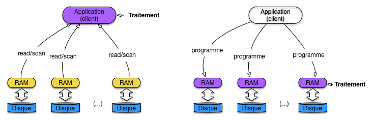
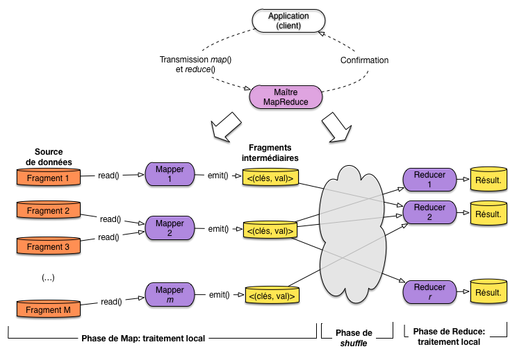

.. _chap-calcdistr:
   
###################################
Calcul distribué: de Hadoop à Spark
###################################

Nous abordons maintenant le domaine des *traitements analytiques à grande
échelle* qui, contrairement à des fonctions de recherche qui 
s'intéressent à un document précis ou à un petit sous-ensemble d'une
collection, parcourent l'intégralité d'un large ensemble pour en extraire
des informations et construire des modèles statistiques ou analytiques.

La préoccupation essentielle n'est pas ici la performance (de toute façon,
les traitements durent longtemps) mais la garantie de scalabilité 
horizontale qui permet malgré tout
d'obtenir des temps de réponse raisonnables, et *surtout* la garantie de terminaison
en dépit des pannes pouvant affecter le système pendant le traitement.

.. _calculdistr:
.. figure:: ../figures/calculdistr.png
   :width: 100%
   :align: center
   
   Le calcul distribué, compagnon logique du stockage distribué
   
La :numref:`calculdistr` montre, en vert, le positionnement logique du calcul distribué
par rapport aux systèmes de stockage distribué étudiés jusqu'ici. La *répartition des données*
ouvre logiquement la voie à la *distribution des traitements sur les données*. L'un ne va pas 
sans l'autre: il serait peu utile d'appliquer un calcul distribué sur une source de données
centralisée qui constituerait le goulot d'étranglement, et réciproquement.

Ce chapitre va étudier les méthodes qui permettent de distribuer des calculs à très grande échelle
sur des systèmes de stockage partitionnés et distribués. Tous les systèmes vus jusqu'à présent
sont des candidats valables pour alimenter des calculs distribués, mais nous allons regarder
cette fois HDFS, un système de fichiers  étroitement associé à Hadoop.

Pour les calculs eux-mêmes, deux possibilités sont offertes: des opérateurs 
intégrés à un langage de programmation, dont MapReduce est l'exemple de base,
ou des langages de workflow (ou à la SQL) qui permettent des spécifications de plus haut niveau.
Nous étudierons Pig latin, un des premiers représentants du genre.

*Ce chapitre ne considère pas l'algorithmique analytique proprement dite, mais
les opérateurs de manipulation de données qui fournissent l'information à
ces algorithmes.*
En clair, il s'agit de voir comment récupérer des sources de données,
comment les filtrer, les réorganiser, les combiner, les enrichir, le tout en respectant les
deux contraintes fondamentales de la scalabilité: parallélisation et tolérance aux pannes.

.. admonition:: La notion d'opérateur de second ordre

    Les opérateurs décrits ici sont des *opérateurs de second ordre*. Contrairement
    aux opérateurs classiques qui s'appliquent directement à des données, un 
    opérateur de second ordre prend des fonctions en paramètres et applique
    ces fonctions à des données au cours d'un traitement immuable
    (par exemple un parcours séquentiel).
    

Depuis 2004, le modèle phare d'exécution est MapReduce, déjà 
introduit dans le chapitre :ref:`chap-bddoc` dans un contexte centralisé, 
et distribué en Open Source dans le système Hadoop. MapReduce est le premier modèle
à combiner distribution massive et reprise sur panne dans le contexte d'un *cloud* de
serveurs à bas coûts. Ses limites sont cependant évidentes: faible expressivité (très peu
d'opérateurs) et performances médiocres.

Très rapidement, des langages de plus haut niveau (Pig, Hive) ont été proposés, avec pour
objectif notable l'expression d'opérateurs plus puissants (par exemple les jointures).  Ces opérateurs
restent exécutables dans un contexte MapReduce, un peu comme SQL est exécutable dans un 
système basé sur des parcours de fichier.  Enfin, récemment, des systèmes proposant des alternatives plus riches
à Hadoop ont commencé à émerger. La motivation essentielle est de fournir un support
aux algorithmes fonctionnant par *itération*. C'est  le cas d'un grand nombre 
de techniques en fouilles de données qui affinent progressivement un résultat jusqu'à obtenir
une solution optimale. MapReduce est (était) très mal adapté à ce type d'exécution. Les
systèmes comme `Spark <https://spark.apache.org/>`_   ou `Flink <https://spark.apache.org/>`_
constituent de ce point de vue un progrès majeur. 

Ce chapitre suit globalement cette organisation historique, en commençant par
MapReduce, suivi du système HDFS/Hadoop, et finalement d'une présentation du langage Pig.
Les systèmes itératifs feront l'objet des chapitres suivants.

*************
S1: MapReduce
*************

.. admonition:: Supports complémentaires

     * `Diapositives: MapReduce et traitements à grande échelle <http://b3d.bdpedia.fr/files/slmapred.pdf>`_
     * `Vidéo de la session MapReduce <https://mediaserver.lecnam.net/permalink/v125f35a420dbiiaq0nc/>`_  
  
Reportez-vous au chapitre :ref:`chap-bddoc` pour une présentation du *modèle* MapReduce
d'exécution.  Rappelons que MapReduce *n'est pas*
un langage d'interrogation de données, mais un modèle d'exécution de *chaînes
de traitement* dans lesquelles des données (massives) sont progressivement
transformées et enrichies.

Pour être concrets, nous allons prendre l'exemple (classique) d'un traitement s'appliquant 
à une collection de documents textuels et déterminant la *fréquence
des termes dans les documents* (indicateur TF, cf. :ref:`chap-ranking`). Pour chaque terme présent dans la collection,
on doit donc obtenir le nombre d'occurrences.

Le principe de localité des données
===================================

Dans une approche classique de traitement de données stockées
dans une base, on utilise une architecture client-serveur dans
laquelle l'application cliente reçoit les données du serveur.
Cette méthode est difficilement applicable en présence d'un très gros volume
de données, et ce d'autant moins que les collections sont stockées
dans un système distribué. En effet:

  - le transfert par le réseau d'une large collection devient très pénalisant
    à  grande échelle (disons, le TéraOctet);
  - et surtout, la distribution des données est une opportunité pour effectuer
    les calculs *en parallèle* sur chaque machine de stockage, opportunité perdue
    si l'application cliente fait tout le calcul. 

Ces deux arguments se résument dans un principe dit de *localité des données*
(*data locality*). Il peut s'énoncer ainsi: les meilleures performances
sont obtenues quand chaque fragment de la collection est traité *localement*, minimisant
les besoins d'échanges réseaux entre les machines. 

.. note:: Reportez-vous au chapitre :ref:`chap-cloud` pour une analyse
   quantitative montrant l'intérêt de ce principe.
   
L'application du principe de localité des données mène à une architecture
dans laquelle, contrairement au client-serveur, les données ne sont pas
transférées au programme client, mais le programme distribué à toutes les machines
stockant des données (:numref:`data-locality`).

.. _data-locality:

   
   Principe de localité des données, par transfert des programmes
   
En revanche, demander à un développeur d'écrire une application distribuée
basée sur ce principe constitue un défi technique de grande ampleur. Il faut
en effet concevoir simultanément les tâches suivantes:

  - implanter la *logique* de l'application, autrement dit le traitement particulier
    qui peut être plus ou moins complexe;
  - concevoir la parallélisation de cette application, sous la forme d'une
    exécution concurrente coordonnant plusieurs machines et assurant
    un accès à un partitionnement de la collection traitée;
  - et bien entendu, gérer la reprise sur panne dans un environnement qui,
    nous l'avons vu, est  instable.

Un *framework* d'exécution distribuée comme MapReduce est justement dédié
à la prise en charge des deux derniers aspects, spécifiques à la distribution
dans un *cloud*, et ce de manière *générique*. Le *framework* définit
un processus immuable d'accès et de traitement, et le programmeur implante 
la logique de l'application sous la forme de briques logicielles confiées
au *framework* et appliquées par ce dernier dans le cadre du processus.

Avec MapReduce, le processus se déroule en deux phases, et les "briques
logicielles" consistent en deux fonctions fournies par le développeur. La phase de Map
traite chaque document individuellement et applique une fonction *map()* dont
voici le pseudo-code pour notre application de calcul du TF.

.. code-block:: bash

    function mapTF($id, $contenu)
    {
      // $id: identifiant du document
      // $contenu: contenu textuel du document

      // On boucle sur tous les termes du contenu
      foreach  ($t in $contenu) {
        // Comptons les occurrences du terme dans le contenu
        $count = nbOcc ($t, $contenu);
        // On "émet" le terme et son nombre des occurrences
        emit ($t, $count);
      }
    }
    
La phase de Reduce reçoit des valeurs groupées sur la clé et applique
une agrégation de ces valeurs. Voici le pseudo-code pour notre application TF.

.. code-block:: bash

    function reduceTF($t, $compteurs)
    {
      // $t: un terme
      // $compteurs: la séquence des décomptes effectués localement par le Map
      $total = 0;

      // Boucles sur les compteurs et calcul du total
      foreach ($c in $compteurs) {
       $total = $total + $c;
      }
     
      // Et on produit le résultat  
      return $total;
    }
   
Dans ce cadre restreint, le *framework* prend en charge la distribution
et la reprise sur panne.

.. important:: Ce processus en deux phases et très limité et ne permet 
   pas d'exprimer des algorithmes complexes, ceux basés par exemple
   sur une itération menant progressivement au résultat. C'est l'objectif
   essentiel de modèles d'exécution plus puissants que nous présentons 
   ultérieurement. 

Exécution distribuée d'un traitement MapReduce
==============================================

La :numref:`mr-execution` résume l'exécution d'un traitement ("*job*")
MapReduce avec un *framework* comme Hadoop. Le système d'exécution distribué
fonctionne sur une architecture maître-esclave dans laquelle
le maître (*JobTracker* dans Hadoop) se charge de recevoir la
requête de l'application, la distribue sous forme de tâche à des
nœuds (*TaskTracker* dans Hadoop) accédant aux fragments de la collection, et coordonne finalement le
déroulement de l'exécution. Cette coordination inclut notamment la gestion des pannes.

.. _mr-execution:

   
   Exécution distribuée d'un traitement MapReduce
   
L'application cliente se connecte au maître, transmet les fonctions
de Map et de Reduce, et soumet la demande d'exécution. Le client est alors libéré,
en attente de la confirmation par le maître que le traitement est terminé
(cela peut prendre des jours ...). Le framework fournit des outils pour surveiller
le progrès de l'exécution pendant son déroulement.

Le traitement s'applique à une source de données partitionnée. Cette source
peut être un simple système de fichiers distribués, un système relationnel, un système NoSQL
type MongoDB ou HBase, voire même un moteur de recherche comme Solr ou ElasticSearch.

Le Maître dispose de l'information sur le partitionnement des données
(l'équivalent du contenu de la table de routage, présenté dans le chapitre
sur le partitionnement) ou la récupère du serveur de données. Un nombre
*M* de serveurs stockant tous les fragments
concernés est alors impliqué dans le traitement. Idéalement, ces 
serveurs vont être chargés eux-mêmes du calcul pour respecter le principe
de localité des données mentionné ci-dessus. Un système comme Hadoop
fait de son mieux pour respecter ce principe.

La fonction de Map est transmise aux *M* serveurs et une tâche dite
*Mapper* applique la fonction à un fragment. Si le serveur contient
plusieurs fragments (ce qui est le cas normal) il faudra exécuter
autant de tâches. Si le serveur est multi-cœurs, plusieurs
fragments peuvent être traités en parallèle sur la même machine.
 
.. admonition:: Exemple: le partitionnement des données pour l'application TF
 
    Supposons par exemple que notre collection contienne 1 milliard de documents
    dont la taille moyenne est de 1000 octets. On découpe la collection en fragments
    de 64 MOs. Chaque fragment contient donc 64 000 documents. Il y a donc
    à peu près  :math:`\lceil 10^9/64,000 \rceil \approx 16,000` fragments. Si on
    dispose de 16 machines, chacune devra traiter (en moyenne) 1000 fragments
    et donc exécuter mille tâches de *Mapper*.
    
    Le parallélisme peut alors être interne à une machine, en fonction du nombre de
    *cores* dont elle dispose. Une machine *4 cores* pourra ainsi effectuer 4 tâches en parallèle en théorie.

Chaque *mapper* travaille, dans la mesure du possible,  *localement*: le fragment est lu
sur le disque *local*,
document par document, et l'application de la fonction de Map
"émet" des paires (clé, valeur) dites "intermédiaires" qui
sont stockées sur le disque *local*. Il n'y a donc aucun échange
réseau pendant la phase de Map (dans le cas idéal où la
localité des données peut être complètement respectée). 

.. admonition:: Exemple: la phase de Map pour l'application TF

   Supposons que chaque document contienne en moyenne 100 termes distincts.
   Chaque fragment contient 64 000 documents. Un *Mapper* va
   donc produire 6 400 000 paires *(t, c)*  où *t*
   est un terme et *c* le nombre d'occurrences.
   
À l'issue de la phase de Map, le maître initialise la phase de Reduce
en choisissant *R* machines disponibles. Il faut alors distribuer les
paires intermédiaires à ces *R* machines. C'est une phase "cachée",
dite de *shuffle*,
qui constitue potentiellement le goulot d'étranglement de l'ensemble
du processus car elle implique la lecture sur les disques des *Mappers* de toutes
les paires intermédiaires, et leur envoi par réseau aux machines des *Reducers*.

.. important:: Vous noterez peut-être qu'une solution beaucoup plus efficace
   serait de transférer immédiatement par le réseau les paires intermédiaires
   des *Mappers* vers les *Reducers*. Il y a une explication à ce choix
   en apparence sous-optimal: c'est la reprise sur panne (voir plus loin).
    
Pour chaque paire intermédiaire, un simple algorithme de hachage permet
de distribuer les clés équitablement sur les *R* machines chargées du Reduce.

Au niveau d'un *Reducer* :math:`R_i`, que se passe-t-il? 

  - Tout d'abord il faut récupérer *toutes* les paires intermédiaires produites
    par les *Mappers* et affectées à :math:`R_i`. 
  - Il faut ensuite *trier* ces paires sur la clé pour regrouper
    les paires partageant la même clé. On obtient des paires
    *(k, [v])* où *k* est une clé, et *[v]* la liste des valeurs
    reçues par le *Reducer* pour cette clé.
  - Enfin, chacune des paires  *(k, [v])* est soumise à la fonction de Reduce.
  

.. admonition:: Exemple: la phase de Reduce pour l'application TF

   Supposons *R=10*. Chaque *Reducer* recevra donc en moyenne 640 000 paires
   *(t, c)* de chaque *Mapper*.  Ces paires sont triées sur le terme *t*. Pour chaque
   terme on a donc la liste des nombres d'occurences trouvés
   dans chaque document par les *Mappers*. Au pire, si un terme est présent dans
   chaque document, le tableau *[v]* contient un million d'entiers.

   Il reste, avec la fonction de Reduce, à faire le total de ces nombres d'occurences
   pour chaque terme.
   

.. admonition:: Exemple: comptons les loups et le moutons

   Vous souvenez-vous de ces quelques documents?
   
     * A: ``Le loup est dans la bergerie.``
     * B: ``Les moutons sont dans la bergerie.``
     * C: ``Un loup a mangé un mouton, les autres loups sont restés dans la bergerie.``
     * D:  ``Il y a trois moutons dans le pré, et un mouton dans la gueule du loup.``

   Ils sont maintenant stockés dans un système partitionné sur 3 serveurs comme
   montré sur la :numref:`mr-execution-ex`. Nous appliquons notre traitement TF
   pour compter le nombre total d'occurrences de chaque terme (on va s'intéresser
   aux termes principaux).  

   .. _mr-execution-ex:
   .. figure:: ../figures/mr-execution-ex.png
      :width: 80%
      :align: center
   
      Un exemple minuscule mais concret

   Nous avons trois *Mappers* qui produisent les données intermédiaires présentées
   sur la figure. Comprenez-vous pourquoi le terme *bergerie* apparaît deux fois
   pour le premier *Mapper* par exemple? 
   
   La phase de Reduce, avec 2 *Reducers*, n'est illustrée que pour le terme *loup*
   donc on suppose qu'il est affecté au premier *Reducer*. Chaque *Mapper* transmet
   donc ses paires intermédiaires *(loup, ...)* à *R1* qui se charge de regrouper
   et d'appliquer la fonction de Reduce.

Quand tous les *Reducers* ont terminé, le résultat est disponible sur leur disque local. Le
client peut alors le récupérer.

La reprise sur panne
====================

Comment assurer la gestion des pannes pour une exécution MapReduce? Dans la mesure
où elle peut consister en centaines de tâches individuelles, il est inenvisageable
de reprendre l'ensemble de l'exécution si l'une de ces tâches échoue, que ce soit
en phase de Map ou en phase de Reduce. Le temps de tout recommencer, une nouvelle
panne surviendrait, et le *job* ne finirait jamais.

Le modèle MapReduce a été conçu dès l'origine
pour que la reprise sur panne puisse être gérée au niveau de chaque tâche individuelle,
et que la coordination de l'ensemble soit également résiliente aux problèmes de machine
ou de réseau.

Le Maître délègue les tâches aux machines et surveille la progression de l'exécution.
Si une tâche semble interrompue, le Maître initie une action de reprise
qui dépend de la phase.

Panne en phase de Reduce
------------------------

Si la machine reste accessible et que la panne se résume à un échec du processus, ce dernier
peut être relancé sur la même machine, et si possible sur les données locales
déjà transférées par le *shuffle*. C'est le cas le plus favorable.

Dans un cas plus grave, avec perte des données par exemple,
une reprise plus radicale consiste à choisir une autre machine, et à relancer
la tâche en réinitialisant le transfert des paires intermédiaires depuis les 
machines chargées du Map. C'est possible car ces paires ont été écrites sur les disques
locaux et restent donc disponibles. C'est une caractéristique très importante
de l'exécution MapReduce: *l'écriture complète des fragments intermédiaires
garantit la possibilité de reprise en cas de panne*. 

Une méthode beaucoup
plus efficace mais beaucoup moins robuste consisterait à ce que chaque *mapper*
transfère immédiatement les paires intermédiaires, sans écriture sur le disque local,
vers la machine chargée du Reduce. Mais en cas de panne de ce dernier,
ces paires intermédiaires risqueraient de disparaître et on ne saurait plus 
effectuer la reprise sur panne  (sauf à ré-exécuter l'ensemble du processus).

Cette caractéristique explique également la lenteur (déspérante) d'une exécution MapReduce,
due en grande partie à la nécessité d'effectuer des écritures et lectures répétées
sur disque, à chaque phase.

Panne en phase Map
------------------

En cas de panne pendant l'exécution d'une tâche de Map, on peut
soit reprendre la tâche sur la même machine si c'est le processus qui a échoué,
soit transférer la tâche à une autre machine. On tire ici parti
de la *réplication* toujours présente dans les systèmes distribués:
quel que soit le fragment stocké sur une machine, il existe un réplica
de ce fragment sur une autre, et à partir de ce réplica une tâche 
équivalente peut être lancée.

Le cas le plus pénalisant est la panne d'une machine pendant la phase
de transfert vers les Reducers. Il faut alors reprendre toutes les
tâches initialement allouées à la machine, en utilisant la réplication.

Et le maître?
-------------

Finalement, il reste à considérer le cas du Maître qui est un point individuel
d'échec: en cas de panne, il faut tout recommencer.

L'argument des *frameworks* comme Hadoop est qu'il existe un Maître
pour des dizaines de travailleurs, et qu'il est peu probable qu'une panne affecte
directement le serveur hébergeant le nœud-Maître. Si cela arrive, on peut
accepter de reprendre l'ensemble de l'exécution, ou prendre des mesures
préventives en dupliquant toutes les données du Maître sur un nœud de
secours. 

Quiz
====

.. eqt:: mapreduce-1

    Qu'est-ce qu'un opérateur de second ordre?

    A) :eqt:`I`  C'est un opérateur qui est appliqué à des documents 
       par d'autres opérateurs
    #) :eqt:`C`  C'est un opérateur qui  applique d'autres opérateurs à des documents 
    #) :eqt:`I` C'est un opérateur qui résulte de la composition d'opérateurs primaires

.. eqt:: mapreduce-2

    Quel est le rôle de l'opération de  *shuffle* ?

    A) :eqt:`C`  Distribuer les résultats des *mappers* vers les *reducers*
    #) :eqt:`I`  Distribuer les résultats des *reducers* vers les *mappers*
    #) :eqt:`I` Distribuer les documents équitablement sur les *mappers*

.. eqt:: mapreduce-3

    Où sont stockés les résultats des *Mappers* ?

    A) :eqt:`I`  Dans un système de stockage distribué pour permettre la reprise sur panne
    #) :eqt:`C`  Localement, pour favoriser la performance
    #) :eqt:`I` Ils sont transmis aux *reducers* au fur et à mesure

.. eqt:: mapreduce-4

    Que dit le principe de *data locality*.

    A) :eqt:`I` Que les données doivent rester à l'intérieur d'un même système distribué
    #) :eqt:`C`  Que les données doivent être traitées là où elles sont stockées
    #) :eqt:`I` Que les données peuvent être échangées entre *mappers* ou
       entre *reducers*, mais pas entre *mappers* et *reducers*

.. eqt:: mapreduce-5

    J'implante un système MapReduce en transmettant directement les paires
    intermédiaires des Mappers vers les Reducers, sans écriture locale. En cas
    de plantage d'un des Reducers avec perte locale des données, que faut-il recalculer? 

    A) :eqt:`C` Tout!
    #) :eqt:`I`  On ne relance que la fraction des *mappers* qui a alimenté
       le *reducer* planté (soit *1/R* des *mappers*, *R* étant le nombre
       de reducers)
    #) :eqt:`I` Il suffit de ré-executer le *reducer*

.. eqt:: mapreduce-6

    Quand commence l'exécution de la phase de *Reduce* ? 

    A) :eqt:`I` Dès que les *mappers* commencent à transmettre des paires
       intermédiaires
    #) :eqt:`I`  Dès que l'un des *mappers* a complètement terminé sa tâche
    #) :eqt:`C` Dès que *tous* les *mappers* ont terminé leur tâche

.. eqt:: mapreduce-7

    Pourquoi ne pas exécuter la fonction de Reduce sur les paires intermédiaires stockées sur les disques des machines de Map? 

    A) :eqt:`I` Parce qu'elles ne sont pas triées et qu'il faut donc faire appel à une autre machine dédiée au tri
    #) :eqt:`C`  Parce qu'une machine de Map ne détient qu'une partie des paires d'un même groupe
    #) :eqt:`I` Parce qu'une même paire peut être impliquée dans plusieurs groupes, d'où la phase de *Shuffle*

.. eqt:: mapreduce-8

    Quand peut-on effacer les paires intermédiaires stockées sur les *mappers*

    A) :eqt:`I` Dès qu'elles ont été transmises aux *reducers*
    #) :eqt:`C` À la toute fin du processus, quand le dernier *reducer* a terminé.
    #) :eqt:`I` Dès que tous les  *reducers* ont acquitté la réception des paires qu'ils doivent traiter 

************************
S1: Introduction à Spark
************************

.. admonition:: Supports complémentaires

    * `Diapositives: Introduction à Spark <http://b3d.bdpedia.fr/files/slspark.pdf>`_
    * `Vidéo d'introduction à Spark <https://mediaserver.lecnam.net/permalink/v125f5947d4d8krmjech/>`_  

Avec MapReduce, la spécification de l'itération reste à la charge du
programmeur; il faut stocker le résultat d'un premier *job* dans une collection
intermédiaire et réiterer le *job* en prenant la collection intermédiaire comme
source. C'est laborieux pour l'implantation, et surtout très peu efficace quand
la collection intermédiaire est grande. Le processus de
sérialisation/désérialisation sur disque propre à la gestion de la reprise sur
panne en MapReduce entraîne des performances médiocres.

Dans Spark, la méthode est très différente. Elle consiste  à placer ces jeux de
données en mémoire RAM et à éviter la pénalité des écritures sur le disque. Le
défi est alors bien sûr de proposer une reprise sur panne automatique efficace.

Architecture système
====================

Spark est un *framework* qui coordonne l'exécution de *tâches* sur des *données*
en les répartissant au sein d'un *cluster* de machines. Il est voulu comme
extrêmement modulaire et flexible. Ainsi, la gestion même du cluster de machines
peut être déléguée soit au cluster manager de Spark, soit à Yarn ou à Mesos
(d'autres gestionnaires pour Hadoop).

Le programmeur envoie au *framework* des *Spark Applications*, pour lesquelles
Spark affecte des ressources (RAM, CPU) du cluster en vue de leur
exécution. Une Spark application se compose d'un processus *driver* et
d\'*executors*. Le *driver* est essentiel pour l'application car il exécute la
fonction `main()` et est responsable de 3 choses : 

- conserver les informations relatives à l'application ;
- répondre aux saisies utilisateur ou aux demandes de programmes externes ;
- analyser, distribuer et ordonnancer les tâches (cf plus loin).
    
Un *executor* n'est responsable que de 2 choses : exécuter le code qui lui
est assigné par le *driver* et lui rapporter l'état d'avancement de la tâche.

Le *driver* est accessible programmatiquement par un point d'entrée appelé
*SparkSession*, que l'on trouve derrière une variable :code:`spark`.

La figure :numref:`sparkarchi` illustre l'architecture système de Spark. Dans cet exemple 
il y a un *driver*
et 4 *executors*. La notion de nœud dans le cluster est absente : les utilisateurs
peuvent configurer combien d'exécutors reposent sur chaque nœud.

.. _sparkarchi:
.. figure:: ../figures/spark-archi-systeme.png
     :width: 85%
     :align: center
  
     L'architecture système de Spark

Spark est un *framework* multilingue : les programmes Spark peuvent être écrits en
Scala, Java, Python, SQL et R. Cependant, il d'abord écrit en Scala, il s'agit
de son langage par défaut. C'est celui dans lequel nous travaillerons. Il est
concis et offre l'intégralité de l'API. Attention, l'API est complète en Scala
et Java, pas nécessairement dans les autres langages. 

.. note:: Spark peut aussi fonctionner en mode *local*, dans lequel *driver* et
   *executors* ne sont que des processus de la machine. La puissance de Spark est
   de proposer une transparence (pour les programmes) entre une exécution locale
   ou sur un cluster.

Architecture applicative
========================

L'écosystème des API de Spark est hiérarchisé et comporte
essentiellement 3 niveaux :

- les APIs bas-niveau, avec les RDDs (*Resilient Distributed Dataset*);
- les APIs de haut niveau, avec les *Datasets*, *DataFrames* et SQL;
- les autres bibliothèques (*Structured Streaming*, *Advanced Analytics*, etc.).

Nous allons laisser de côté dans ce cours le dernier niveau : l'exploration des
bibliothèques de *machine learning* relève du `cours RCP216
<https://cedric.cnam.fr/vertigo/Cours/RCP216/>`_.

Initialement, les RDDs ont été au centre de la programmation avec Spark (ce qui
a pour conséquence que de nombreuses ressources que vous trouverez sur Spark
reposeront dessus). Aujourd'hui, on leur préfère des APIs de plus haut niveau,
que nous allons explorer en détail, les Datasets et DataFrames. Celles-ci
présentent l'avantage d'être proches de structures de données connues (avec une
vision tabulaire), donc de faciliter le passage à Spark. En outre, elles sont
optimisées *très efficacement* par le *framework*, d'où des gains de performance.

L'innovation des RDDs
---------------------

La principale innovation apportée par  Spark est le concept de *Resilient
Distributed Dataset* (RDD). Un RDD est une collection (pour en rester à notre
vocabulaire) calculée à partir d'une source de données (par exemple une base de
données Cassandra, un flux de données, un autre RDD) et placée en mémoire RAM.
Spark conserve l'historique des opérations qui a permis de constituer un RDD, et
la reprise sur panne s'appuie essentiellement sur la préservation de cet
historique afin de reconstituer  le RDD en cas de panne. Pour le dire
brièvement: Spark n'assure pas la préservation des données en *extension* mais
en *intention*. La préservation d'un programme qui tient en quelques lignes de
spécification (cf. les programmes Pig) est beaucoup plus facile et efficace que
la préservation du jeu de données issu de cette chaîne. C'est l'idée principale
pour la *résilience* des RDDs.

Par ailleurs, les RDDs représentent des collections partitionnées et
distribuées. Chaque RDD est donc constitué de ce que nous avons appelé
*fragments*. Une panne affectant un fragment individuel peut donc être réparée
(par reconstitution de l'historique) indépendamment des autres fragments,
évitant d'avoir à *tout* recalculer. 

Les DataFrames et Datasets que nous utiliserons plus loin reposent sur les RDDs,
c'est-à-dire que Spark transforme les opérations sur les DataFrames/Datasets en
opérations sur les RDDs. En pratique, vous n'aurez que rarement besoin de RDDs
(sauf si vous maintenez du code ancien, ou que votre expertise vous amène à
aller plus loin que les *Structured APIs*).

Actions et transformations : la chaîne de traitement Spark
----------------------------------------------------------

Un élément fondamental de la pratique de Spark réside dans **l'immutabilité**
des collections, elles ne peuvent être modifiées après leur création. C'est un
peu inhabituel et cela induit des manières nouvelles de travailler. 

En effet, pour passer des données d'entrée à la sortie du programme, on devra
penser une chaîne de collections qui constitueront les étapes du traitement. La
(ou les) première(s) collection(s) contien(nen)t les données d'entrée. Ensuite,
chaque collection est le résultat de **transformations** sur les précédentes
structures, l'équivalent de ce que nous avons appelé *opérateur* dans Pig. Comme
dans Pig, une transformation sélectionne, enrichit, restructure une collection,
ou combine deux collections. On retrouve dans Spark, à peu de choses près, les
mêmes opérateurs/transformations que dans Pig, comme le montre la table
ci-dessous (qui n'est bien sûr pas exhaustive: reportez-vous à la documentation
pour des compléments).

.. csv-table:: 
   :header:  Opérateur, Description
   :widths: 10, 20
	         
   ``map``, Prend un document en entrée et produit un document en sortie
   ``filter``, Filtre les documents de la collection 
   ``flatMap``, "Prend un document en entrée, produit un ou plusieurs document(s) en sortie"
   ``groupByKey``, Regroupement de documents par une valeur de clé commune
   ``reduceByKey``,  "Réduction d'une paire *(k, [v])* par une agrégation du tableau *[v]*"
   ``crossProduct``, Produit cartésien de deux collections
   ``join``, Jointure de deux collections
   ``union``, Union de deux collections
   ``cogroup``, Cf. la description de l'opérateur dans la section sur Pig
   ``sort``, Tri d'une collection

Les collections obtenues au cours des différentes étapes d'une chaîne de
traitement sont stockées dans des RDDs, des DataFrames, etc., selon l'API
employée. C'est exactement la notion que nous avons déjà étudiée avec Pig. La
différence essentielle est que dans Spark, les RDD ou DataFrames peuvent être
marquées comme étant *persistants* car ils  peuvent être réutilisés dans
d'autres chaînes. Spark fait son possible pour stocker les structures
persistantes en mémoire RAM, pour un maximum d'efficacité.

.. _spark-rdd:

.. figure:: ../figures/spark-rdd.png
   :width: 85%
   :align: center
  
   RDD persistants et transitoires dans Spark.

Les collections forment un graphe construit par application de transformations à
partir de collections stockées (:numref:`spark-rdd`). S'il n'est pas marqué
comme persistant, le RDD/DataFrame sera transitoire et ne sera pas conservé en
mémoire après calcul (c'est le cas des RDD 1 et 3 sur la figure). Sinon, il est
stocké en RAM, et disponible comme source de données pour d'autres
transformations.

Par opposition aux transformations qui produisent d'autres RDD ou DataFrames, les **actions**
produisent des *valeurs* (pour l'utilisateur). L'évaluation des opérations en
Spark est dite "paresseuse", c'est-à-dire que Spark attend le plus possible pour
exécuter le graphe des instructions de traitement. Plus précisément, une action
déclenche l'exécution des transformations qui la précèdent.

L'évaluation paresseuse (*lazy evaluation*) permet à Spark de compiler de
simples transformations de DataFrames en un plan d'exécution physique
efficacement réparti dans le cluster. Un exemple de cette efficacité est
illustrée par le concept de *predicate pushdown* : si un :code:`filter()` à la
fin d'une séquence amène à ne travailler que sur 1 ligne des données d'entrée,
les autres opérations en tiendront compte, optimisant d'autant la performance en
temps et en espace.

RDDs, *Dataset* et *DataFrame*
------------------------------

Un RDD, venant de l'API bas-niveau, est une "boîte" destinée à contenir
n'importe quel document, sans aucun préjugé sur la structure (ou l'absence de
structure) de ce dernier. Cela rend le système très généraliste, mais empêche
une manipulation fine des constituants des documents, comme par exemple le
filtrage en fonction de la valeur d'un champ. C'est le programmeur de
l'application qui doit fournir la fonction effectuant le filtre.

On l'a dit, Spark implémente une API de plus haut niveau avec des structures
assimilables à des tables relationnelles : les *Dataset* et *DataFrame*. Ils
comportent un *schéma*, avec les définitions des colonnes. La connaissance de ce
schéma -- et éventuellement de leur type -- permet à Spark de proposer des
opérations plus fines, et des optimisations inspirées des techniques
d'évaluation de requêtes dans les systèmes relationnels. En fait, on se ramène à
une implantation distribuée du langage SQL.  En interne, un avantage important
de la connaissance du schéma est d'éviter de recourir à la sérialisation des
objets Java (opération effectuée dans le cas des RDD pour écrire sur disque et
échanger des données en réseau). 

.. note:: Saluons au passage le mouvement progressif de ces systèmes vers une
   ré-assimilation des principes du relationnel (schéma, structuration des
   données, interrogation à la SQL, etc.), et la reconnaissance des avantages,
   internes et externes,  d'une modélisation des données. Du *NoSQL* à *BackToSQL*!
   

On distingue les *Dataset*,  dont le type des colonnes est connu, et les *DataFrames*.
Un *DataFrame* n'est rien d'autre qu'un *Dataset* (:code:`DataFrame =
Dataset[Row])` contenant des lignes de type *Row* dont le schéma précis n'est
pas connu. Ce typage des structures de données est lié au langage de
programmation : Python et R étant dynamiquement typés, ils n'accèdent qu'aux
DataFrames. En Scala et Java en revanche, on utilise les Datasets, des objets
JVM fortement typés.

Tout cela est un peu abstrait? Voici un exemple simple qui permet d'illustrer
les principaux avantages des *Dataset/DataFrame*. Nous voulons appliquer un
opérateur qui filtre les films dont le genre est "Drame". On va exprimer le
filtre (en simplifiant un peu) comme suit:

.. code-block:: text

    films.filter(film.getGenre() == 'Drame');

Si ``films`` est un RDD, Spark n'a aucune idée sur la structure des documents
qu'il contient. Spark va donc instancier un objet Java (éventuellement en
dé-sérialisant une chaîne d'octets reçue par réseau ou lue sur disque) et
appeler la méthode ``getGenre()``. Cela peut être long, et impose surtout de
créer un objet pour un simple test.

Avec un *Dataset* ou *DataFrame*, le schéma est connu et Spark utilise son
propre système d'encodage/décodage à la place de la sérialisation Java. De plus,
dans le cas des *Dataset*, la valeur du champ ``genre`` peut être testée
directement sans même effectuer de décodage depuis la représentation binaire.

Il est, en résumé, tout à fait préférable d'utiliser les *Dataset* dès que l'on
a affaire à des données structurées. 

Exemple: analyse de fichiers *log*
==================================

Prenons un exemple concret: dans un serveur d'application, on constate qu'un module *M* produit
des résultats incorrects de temps en temps. On veut analyser le fichier journal (*log*) de l'application
qui contient les messages produits par le module suspect, et par beaucoup d'autres modules.

On construit donc un programme qui charge le  *log* sous forme de collection, ne conserve
que les messsages produits par le module *M* et analyse ensuite ces messages. Plusieurs analyses sont
possibles en fonction des causes suspectées: la première par exemple regarde le *log* de *M* pour un produit particulier, 
la seconde pour un utilisateur particulier, la troisième pour une tranche horaire particulière, etc.

Avec Spark, on va créer un DataFrame ``logM`` persistant, contenant les messages produits par *M*. 
On construira ensuite,
à partir de ``logM`` de nouveaux DataFrames dérivés pour les analyses spécifiques (:numref:`spark-log`). 

.. _spark-log:

.. figure:: ../figures/spark-log.png
   :width: 85%
   :align: center
  
   Scénario d'une analyse de *log* avec Spark
   
On combine deux transformations pour construire ``logM``, comme le montre le programme suivant (qui n'est pas la syntaxe
exacte de Spark, que nous présenterons plus loin).

.. code-block:: javascript
          
    // Chargement de la collection
    log = load ("app.log") as (...)
    // Filtrage des messages du module M
    logM = filter log with log.message.contains ("M")    
    // On rend logM persistant !
    logM.persist();
    
On peut alors construire une analyse basée sur le code produit directement à partir de ``logM``.

.. code-block:: javascript
          
    // Filtrage par produit
    logProduit = filter logM with log.message.contains ("product P")   
    // .. analyse du contenu de logProduit     

Et utiliser également ``logM`` pour une autre analyse, basée sur l'utilisateur.

.. code-block:: javascript
          
    // Filtrage par utilisateur
    logUtilisateur = filter logM with log.message.contains ("utilisateur U")   
    // .. analyse du contenu de logProduit     

Ou encore par tranche horaire.

.. code-block:: javascript
          
    // Filtrage par utilisateur
    logPeriode = filter logM with log.date.between d1 and d2
    // .. analyse du contenu de logPeriode     

``logM``  est une sorte de "vue"  sur la collection initiale, dont la persistance
évite de refaire le calcul complet à chaque analyse.

Reprise sur panne
=================

Pour comprendre la reprise sur panne, il faut se pencher sur le second aspect
des RDD: la *distribution*. Un RDD est une collection *partitionnée* (cf.
chapitre :ref:`chap-sharding`), les DataFrames le sont aussi. La
:numref:`spark-failover` montre le traitement précédent dans une perspective de
distribution. Chaque DataFrame, persistant ou non, est composé de fragments
répartis dans la grappe de serveurs. 

.. _spark-failover:

.. figure:: ../figures/spark-failover.png
   :width: 85%
   :align: center
  
   Partitionnement et reprise sur panne dans Spark.
   
Si une panne affecte un calcul s'appuyant sur un fragment *F* de DataFrame
persistant (par exemple la transformation notée ``T`` et marquée par une
croix rouge sur la figure), il suffit de le relancer à partir de *F*. Le gain
en temps est considérable! 

La panne la plus sévère affecte un fragment de DataFrame *non* persistant (par
exemple celui marqué par une croix violette). Dans ce cas, Spark a mémorisé la
chaîne de traitement ayant constitué le DataFrame, et il suffit de ré-appliquer
cette chaîne en remontant jusqu'aux fragments qui précèdent dans le graphe des
calculs.

Dans notre cas, il faut parcourir à nouveau le fichier ``log``  pour créer le
fragment ``logn``. Si les collections stockées à l'origine du calcul sont
elles-mêmes partitionnées (ce qui n'est sans doute pas le cas pour un fichier
*log*), il suffira d'accéder à la partie de la collection à l'origine des
calculs menant au DataFrame défaillant.

En résumé, Spark exploite la capacité à reconstruire des fragments de
RDD/DataFrame par application de la chaîne de traitement, et ce en se limitant
si possible à une partie seulement des données d'origine. La reprise peut
prendre du temps, mais elle évite un recalcul complet. Si tout se passe bien
(pas de panne) la présence des résultats intermédiaires en mémoire RAM assure de
très bonnes performances.

Quiz
====

.. eqt:: spark-1

    Quel est le principal apport du concept de RDD?

    A) :eqt:`I` Un RDD est un fichier journal *partitionné* de telle sorte
       qu'une panne peut être réparé avec seulement un fragment du journal.
    #) :eqt:`C` Un RDD est une collection partitionnée en mémoire RAM dont chaque
       fragment peut être reconstruit grâce à l'historique des opérations
    #) :eqt:`I` Un RDD est une collection partitionnée et répliquée selon les mêmes principes
       que MongoDB ou ElasticSearch: la reprise sur panne est assurée par la réplication

.. eqt:: spark-2

    Quel est la différence entre RDD persistant et non persistant?

    A) :eqt:`I` Un RDD non persistant disparaît dès que la chaîne de traitement qui l'a produit
       se termine
    #) :eqt:`C` Un RDD non persistant disparaît dès que la transformation dont il est la
       source se termine 
    #) :eqt:`I` Les RDD persistants sont sur disque, les RDD non persistants en mémoire RAM

.. eqt:: spark-3

    Quelle est la différence entre une transformation et une action?

    A) :eqt:`I` Une transformation change le format des données, une action renvoie le résultat
       d'un calcul à l'utilisateur 
    #) :eqt:`I` Une transformation est l'équivalent d'une procédure en programmation classique,
       alors qu'une action est l'équivalent d'une fonction. 
    #) :eqt:`C` Une transformation est une *spécification* intégrable à une chaîne de traitement;
       une action déclenche *l'exécution* d'une chaîne de traitement.  

.. eqt:: spark-4

    Comment expliqueriez-vous la notion d'exécution "paresseuse" dans Spark?

    A) :eqt:`C` Une chaîne de traitement est constituée par spécification et ne se déclenche
       que quand c'est nécessaire
    #) :eqt:`I` C'est un autre nom du principe de localité des données: chaque transformation
       s'applique aux données les plus proches 
    #) :eqt:`I`  Le système accumule un certain volume de données avant de déclencher le traitement
       afin d'assurer son efficacité. 

.. eqt:: spark-5

    Que signifie pour un RDD la propriété d'immutabilité?

    A) :eqt:`I` Un RDD est construit sur un cliché de la collection initiale, qui reste figé
       sur la durée de l'exécution du traitement.
    #) :eqt:`C` Le contenu d'un RDD ne peut pas être modifié une fois qu'il est constitué.
    #) :eqt:`I` La chaîne des RDD est solidaire, et toute modification de l'un entraîne le 
       recalcul de tous les autres.

.. eqt:: spark-6

    En quoi le concept de *sérialisation* implique-t-il une différence entre 
    les *RDD* et les structures plus récentes

    A) :eqt:`I` Aucun, dans tous les cas il faut mettre les données sur disque.
    #) :eqt:`C` Les RDD contiennent des objets java dont la sérialisation est très coûteuse,
       alors que les *Datasets* disposent de leur propre système d'écriture sur disque.
    #) :eqt:`I` Les *Datasets* sont plus puissants car ils s'appuient sur 
       les objets Java, leurs méthodes,  et le mécanisme natif de sérialisation.

.. eqt:: spark7

    Quel est l'avantage d'un DataSet sur un RDD ?

    A) :eqt:`I` Les DataSet sont toujours persistants et la reprise sur panne est donc toujours 
       plus efficace.
    #) :eqt:`C` Les DataSets connaissent la structure de leurs données et peuvent donc
       optimiser les traitements qui s'y appliquent.
    #) :eqt:`I` Seuls les DataSets peuvent prendre une base relationnelle comme source de données

*********
Exercices
*********

Reportez-vous également au chapitre  :ref:`chap-pigtp` pour un ensemble d'exercices
à faire sur machine.

.. _Ex-CalcDist-1: 
.. admonition:: Exercice  `Ex-CalcDist-1`_: MapReduce en distribué avec MongoDB

   Vous devez avoir implanté un compteur de mots avec MongoDB dans la chapitre 
   :ref:`chap-bddoc`. Vous devriez également avoir engendré une collection volumineuse
   et distribuée grâce au générateur de données ipsum (cf. chapitre :ref:`chap-sharding`). Il
   ne reste plus qu'à faire l'essai: lancer, en vous connectant au routeur ``mongos``, le
   calcul MapReduce dans MongoDB. Ce calculer devrait insérer le résultat dans une collection 
   partitionnée présente sur les différents serveurs. À vous de jouer.

.. _Ex-CalcDist-2: 
.. admonition:: Exercice `Ex-CalcDist-2`_: un ``grep``, en MapReduce

   On veut scanner des millards de fichiers et afficher tous ceux qui contiennent
   une chaîne de caractères *c*. Donnez la solution en MapReduce, en utilisant
   le formalisme de votre choix (de préférence un pseudo-code un peu structuré quand même).
             
   .. ifconfig:: mapreduce in ('public')

      .. admonition:: Correction

         Pas bien compliqué. Map: on charge les fichiers un par un (ou ligne par ligne s'ils sont
         vraiment très gros), on cherche *c* et si on la trouve on émet le nom
         du fichier et un indicateur quelconque. Soit, en code:

         .. code-block:: javascript

            // Le pattern est supposé connu dans le contexte d'exécution
            function MapGrep (fichier) {
              if (contains(fichier, pattern) {
                   emit(fichier.nom, 1);
            }

         Reduce: on émet le nom
         du fichier, éventellement avec le nombre d'occurrences trouvées de *c*.
         Par exemple:
         
         .. code-block:: javascript

            function ReduceGrep (nomFichier, [nb]) {
              return (nomFichier, sum(nb));
            }
         
      

.. _Ex-CalcDist-3: 
.. admonition:: Exercice `Ex-CalcDist-3`_: un ``rollup``, en MapReduce
   
   Une grande surface enregistre tous ses tickets de caisse, indiquant 
   les produits vendus, le prix et la date, ainsi que le client
   si ce dernier a une carte de fidélité.
   
   Les produits sont classés selon une taxonomie comme illustré sur la  :numref:`taxonomie`,
   avec des niveaux de précision.
   Pour chaque produit on sait à quelle catégorie précise de N1 il appartient (par exemple, ``chaussure``);
   pour chaque catégorie on connaît son parent.
   
   .. _taxonomie: 
   .. figure:: ../figures/taxonomie.png
      :width: 60%
      :align: center
   
      Les produits et leur classement.
      
   Supposons que la collection ``Tickets`` contienne
   des documents de la forme (idTicket, idClient, idProduit, catégorie, date, prix).
   Comment obtenir en MapReduce le total des ventes à une date *d*, pour le niveau N2?   
   On fait donc une agrégation de ``Tickets`` au niveau supérieur de la 
   taxonomie.

   .. ifconfig:: mapreduce in ('public')

      .. admonition:: Correction

         Il nous faut donc une fonction *parent(n)* qui renvoie le parent d'un nœud
         *n* dans la taxonomie. On pourrait généraliser avec une fonction *ancêtre (n, niveau)*
         qui renvoie l'ancêtre à un niveau donné.
         
         Cela acquis, il suffit d'appliquer la fonction *parent(n)* à chaque ticket
         pour pouvoir faire le regroupement voulu. La clé de regroupement est une
         paire constituée d'une date et du parent. Soit:

         .. code-block:: javascript

            function MapRollup (ticket) {
                   emit({ticket.date, parent(ticket.categorie)}, ticket.prix);
            }

         Reduce: direct.
         
         .. code-block:: javascript
         
            function ReduceRollup ({date, categ}, [prix]) {
              return ({date, categ}, sum(prix));
            }

.. _Ex-CalcDist-4: 
.. admonition:: Exercice `Ex-CalcDist-4`_: MapReduce, calcul distribué pour les nuls
   
   MapReduce est souvent une solution brutale et inefficace (mais facile à implanter) pour
   des problèmes qui ont des solutions bien plus élégantes. 
   
   Par exemple: vous disposez d'une collection distribuée de très grande taille, disons
   des utilisateurs. Voulez calculer la valeur médiane d'une variable, l'âge, ou
   le solde du compte, ou n'importe quoi.
   
     - Quelle est la solution MapReduce?
     - Cherchez une solution qui implique beaucoup moins de transfert de données et de calcul. 
       Regardez par exemple les suggestions proposées ici:
       https://www.quora.com/What-is-the-distributed-algorithm-to-determine-the-median-of-arrays-of-integers-located-on-different-computers

.. _Ex-CalcDist-5:
.. admonition:: Exercice `Ex-CalcDist-5`_:  algèbre linéaire distribuée

    Nous disposons le calcul d'algèbre linéaire du chapitre `chap-mapreduce`_. On a donc
    une matrice *M* de dimension :math:`N \times N`
    représentant les liens entres les :math:`N`  pages du Web, chaque lien étant
    qualifié par un facteur d'importance (ou "poids"). La matrice est représentée par une
    collection math:`C`  dans laquelle chaque document est de la forme 
    {"id": \&23, "lig": *i*, "col": *j*, "poids": :math:`m_{ij}`}, et
    représente un lien entre la page :math:`P_i` et la page :math:`P_j` de poids :math:`m_{ij}`

    Vous avez déjà vu le calcul de la norme des lignes de la matrice, et celui du produit
    de la matrice par un vecteur :math:`V`. Prenons en compte maintenant la taille et la distribution.
 

    **Questions**

       
      - On estime qu'il y a environ :math:`N=10^{10}` pages sur le Web, avec 15 liens par
        page en moyenne. Quelle est la taille de la collection :math:`C`, en TO,  en supposant que chaque document
        a une taille de 16 octets
      - Nos serveurs ont 2 disques de 1 TO chacun et chaque document est répliqué  2 fois (donc trois versions en tout).
        Combien affectez-vous de serveurs au système de stokage?
      - Maintenant, on suppose que :math:`V` ne tient plus dans la mémoire RAM d'une seule machine. Proposez
        une méthode de partitionnement de la collection :math:`C` et de :math:`V` qui permette d'effectuer 
        le calcul distribué de :math:`M \times V` avec MapReduce sans jamais avoir à lire
        le vecteur sur le disque. 
             
        Donnez le critère de partitionnement et la technique (par intervalle ou par hachage).
        
      - Supposons qu'on puisse stocker *au plus* deux (2) coordonnées d'un vecteur  
        dans la mémoire d'un serveur. Inspirez-vous de la :numref:`mr-execution-ex`
        pour montrer le déroulement du traitement distribué précédent en choisissant le nombre minimal de serveurs
        permettant de conserver le vecteur en mémoire RAM. 
        
        Pour illustrer le calcul, prenez la matrice :math:`4\times4` ci-dessous, et le vecteur :math:`V = [4,3,2,1]`.

        .. math::

           M= \left[ {\begin{array}{cccc}
            1 & 2  & 3 & 4 \\
            7 & 6 & 5 & 4 \\
            6 & 7  & 8 & 9 \\
             3 & 3  & 3 & 3 \\
            \end{array} } \right] 

       - Expliquez pour finir comment calculer  la similarité cosinus
         entre :math:`V` et les lignes :math:`L_i` de la matrice.

    .. ifconfig:: mapreduce in ('public')

        .. admonition:: Correction
        
          Il y a donc :math:`N=150 \times 10^{9}` liens à placer dans la matrice, chaque lien étant
          représenté par un document de 16 octets. Soit  :math:`N=2400 \times 10^{9}` octets,
          ou 2,4 TO.

          Avec trois copies de chaque lien, on arrive à 7,2 TO. Il faut donc au moins 4 serveurs
          pour pouvoir stocker la matrice (répliquée) sur disque.
          
          Le vecteur :math:`V` ne tient plus en mémoire RAM pour une seule machine. Il faut
          donc le découper en :math:`f` fragments de manière à ce que chaque fragment contenant
          :math:`\frac{N}{f}` coordonnées tienne 
          en RAM (on suppose qu'on a assez de machines, ce qui semble raisonnable). On a donc
          les fragments :math:`V_1[0, \frac{N}{f}[`, :math:`V_2[\frac{N}{f}, 2 \times \frac{N}{f}[`, etc.
          
          Chaque fonction de MAP accède à l'un des fragments  :math:`V_i[(i-1) \times \frac{N}{f}, i \times \frac{N}{f}]`
          du vecteur. Cette fonction peut donc se contenter
          d'accéder à la partie de la matrice qui doit être combinée à ce fragment: il s'agit
          évidemment des colonnes :math:`[(i-1) \times \frac{N}{f}, i \times \frac{N}{f}[`. On va donc
          partitionner la matrice en :math:`f` fragments, *verticalement*.
          
          
          .. _partition-matrice:
          .. figure:: ../figures/partition-matrice.png       
            :width: 50%
            :align: center
   
            Partition verticale de la matrice
          
          La :numref:`partition-matrice` montre le partitionnement du vecteur et celui de la matrice.
          Le calcul MapReduce est alors *exactement* le même que celui déjà vu pour un calcul dans
          le cas où le vecteur tient en mémoire. La seule différence est qu'il s'applique 
          aux fragments à apparier de la matrice et du vecteur.
          
          La :numref:`mr-execution-matrice` illustre le calcul distribué avec un partitionnement minimal 
          en deux fragments. Pour simplifier un peu la figure, on
          montre le calcul au niveau des lignes et pas des cellules élémentaires.
          Un premier serveur multiplie les deux premières colonnes de la matrice
          avec les deux premières coordonnées du vecteur. Le second serveur effectue le calcul complémentaire.
                    
          .. _mr-execution-matrice:
          .. figure:: ../figures/mr-execution-matrice.png       
            :width: 80%
            :align: center
   
            Illustration du calcul distribué
          
          On a utilisé deux *reducers*, avec une distribution (*shuffle*) qui envoie tous
          les résultats intermédiaires des lignes 1 et 3 vers le premier *reducer*, et ceux
          des lignes 2 et 4 vers le second.
          
          Pour finir, le calcul de la similarité cosinus est obtenu en combinant un premier calcul
          des normes des vecteurs, suivi du produit avec le vecteur du document-cible.

