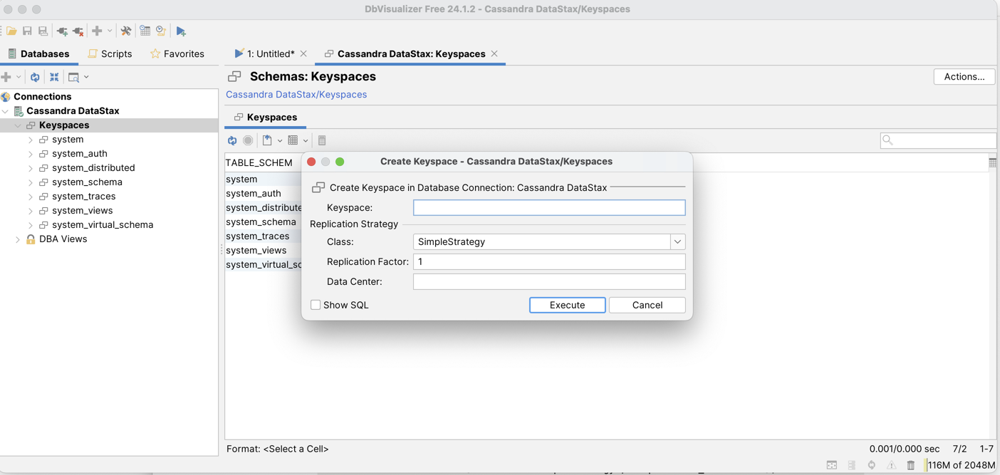
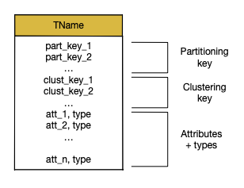
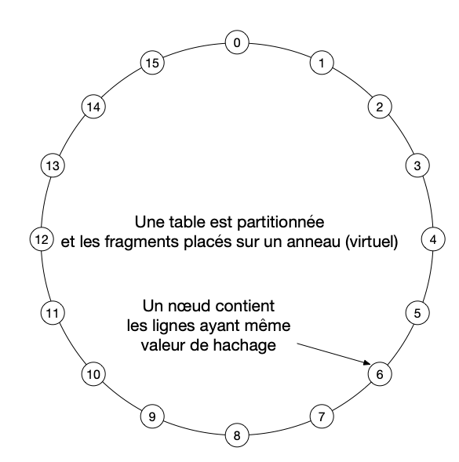
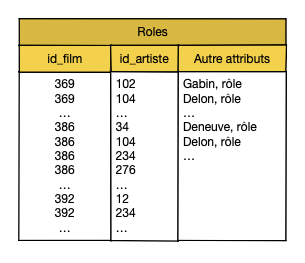
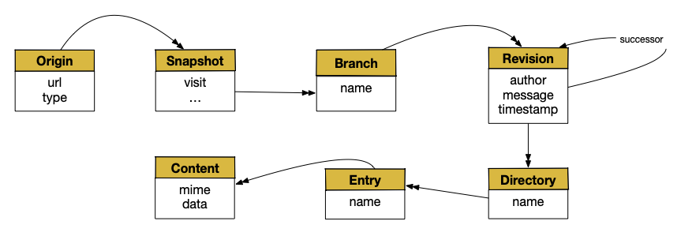

.. |nbsp| unicode:: 0xA0 
   :trim:

.. _chap-cassandra:
   
#######################
Etude de cas: Cassandra
#######################

*********************************************
S1: Cassandra, une base relationnelle étendue
*********************************************

.. admonition:: Supports complémentaires

    * `Diapositives: le modèle de données Cassandra <http://b3d.bdpedia.fr/files/slcass-model.pdf>`_
    * `Vidéo sur le modèle de données Cassandra <https://mediaserver.lecnam.net/permalink/v125f359529fduxzlu9q/>`_
   
Cassandra est un système de gestion de données à grande échelle conçu à l'origine (2007) par les ingénieurs de Facebook 
pour répondre à des problématiques liées au stockage et à l'utilisation de gros volumes de données. 
En 2008, ils essayèrent de le démocratiser en founissant une version stable, documentée, 
disponible sur Google Code. Cependant, Cassandra ne reçut pas un accueil particulièrement enthousiaste. 
Les ingénieurs de Facebook décidèrent donc en 2009 de faire porter Cassandra par l'Apache Incubator. 
En 2010, Cassandra était promu au rang de *top-level Apache Project*. 

Apache a joué un rôle de premier plan dans l'attraction qu'a su créer Cassandra. La communauté s'est 
tellement investie dans le projet Cassandra que, au final,  ce dernier a complètement divergé 
de sa version originale. Facebook s'est alors résolu à accepter que le projet - en l'état - 
ne correspondait plus précisément à leurs besoins, et que reprendre le développement à leur compte 
ne rimerait à rien tant l'architecture avait évolué. Cassandra est donc resté porté par l'Apache Incubator.

Aujourd'hui, c'est la société Datastax qui assure la distribution et le support de Cassandra 
qui reste un projet Open Source de la fondation Apache.

Cassandra a *beaucoup* évolué depuis l'origine, ce qui explique une terminologie assez erratique
qui peut prêter à confusion. L'inspiration initiale est le système BigTable de Google, et l'évolution
a ensuite plutôt porté Cassandra vers un modèle tendant vers le relationnel, avec quelques différences
significatives, notamment sur les aspects internes. C'est un système NoSQL très utilisé, et sans doute
un bon point de départ pour passer du relationnel à un système distribué.

Le modèle de données
====================

Cassandra est un système qui s'est progressivement orienté vers un modèle relationnel étendu,
avec typage fort et schéma contraint.  Initialement, Cassandra était beaucoup plus permissif 
et permettait d'insérer à peu près n'importe quoi. 

.. note:: Méfiez-vous des "informations" qui trainent encore sur le Web, où Cassandra
   est par exemple  qualifié de "*column-store*, avec une confusion assez générale
   due en partie aux évolutions du système, et en partie au fait que certains se contentent
   de répéter ce qu'ils ont lu quelque part sans se donner la peine de vérifier ou même de comprendre.
   
Comme dans un système relationnel, une base de données Cassandra est constituée de *tables*. 
Chaque table a un nom et 
est constituée de colonnes. Toute ligne (*row*) de la table doit respecter le 
schéma de cette dernière. Si une table a 5 colonnes, alors à l'insertion d'une entrée, 
la donnée devra être composée de 5 valeurs respectant le typage. Une colonne peut avoir 
différents types, 

  - des types atomiques, comme par exemple *entier*, *texte*, *date*;
  - des types complexes (ensembles, listes, dictionnaires);
  - des types construits et nommés.

Cela vous rappelle quelque chose? Nous sommes effectivement proche d'un modèle de documents 
structurés de type JSON, avec imbrication de structures, mais avec un *schéma* qui assure
le contrôle des données insérées. 
La gestion de la base est donc très contrainte et doit se
faire en cohérence avec la structure de chaque table (son *schéma*). C'est une différence notable
avec de nombreux systèmes NoSQL.

.. important:: Le vocabulaire encore utilisé par Cassandra est hérité d'un historique
   complexe et s'avère source de confusion. Ce manque d'uniformité et de cohérence dans 
   la terminologie est malheureusement une conséquence de l'absence de normalisation des systèmes
   dits "No-SQL". Dans tout ce qui suit, nous essayons de rester en phase avec les concepts
   (et leur nommage) présentés dans ce cours, d'établir le lien avec le vocabulaire Cassandra
   et si possible d'expliquer les raisons des écarts terminologiques. En particulier,
   nous allons utiliser *document* comme synonyme de *row* Cassandra, pour 
   des raisons d'homogénéïté avec le reste de ce cours.

Paires clé/valeur (*columns*) et documents (*rows*)
===================================================

La structure de base d'un document dans Cassandra est la paire *(clé, valeur)*, 
autrement dit la structure
atomique de représentation des informations semi-structurées, 
à la base de XML ou JSON par exemple. Une valeur peut être atomique (entier, chaîne
de caractères) ou complexe (dictionnaire, liste).

.. admonition:: **Vocabulaire**

   Dans Cassandra, cette structure est parfois appelée *colonne*, ce qui est difficilement explicable
   au premier abord (vous êtes d'accord qu'une paire-clé/valeur *n'est pas* une colonne?). 
   Il s'agit en fait d'un héritage de l'inspiration initiale de Cassandra, le
   système *BigTable* de Google dans lequel les données sont stockées en colonnes. Même si l'organisation
   finale de Cassandra a évolué, le vocabulaire est resté. Bilan: chaque fois
   que vous lisez "colonne" dans le contexte Cassandra, comprenez "paire clé-valeur" et tout
   s'éclaircira. 

.. admonition:: **Versions**

   Il existe une deuxième subtilité que nous allons laisser de côté pour l'instant: les valeurs
   dans une paire clé-valeur Cassandra sont associées à des versions. Au moment où 
   l'on affecte une valeur
   à une clé, cette valeur est étiquetée par l'estampille temporelle courante, et il est possible
   de conserver, pour une même clé, la série temporelle des valeurs successives. 
   Cassandra, à strictement parler, gère donc des *triplets* (clé, estampille, valeur). C'est
   un héritage de BigTable, que l'on retrouve encore dans HBase par exemple.
   
   L'estampille a une utilité dans le fonctionnement interne de Cassandra, 
   notamment lors des phases de réconciliation lorsque des fichiers ne sont plus synchronisés 
   suite à la panne d'un nœud. Nous y reviendrons.

Un *document* dans Cassandra  est un identifiant unique associé à
un ensemble de paires *(clé, valeur)*. Il s'agit ni plus ni moins de la notion traditionnelle 
de dictionnaire que nous avons rencontrée dès le premier chapitre de ce cours et qu'il 
serait très facile de représenter
en JSON par exemple. 

.. admonition:: **Vocabulaire**

   Cassandra appelle *row* les documents, et *row key* l'identifiant unique. La notion
   de ligne (*row*) vient également de BigTable. Conceptuellement, il n'y a pas
   de différence avec les documents structurés que nous étudions depuis le début 
   de ce cours. 

Dans les versions initiales de Cassandra, le nombre de paires clé-valeur 
constituant un document (ligne) n'était pas limité. On pouvait donc imaginer avoir 
des documents contenant des milliers de paires, tous différents les uns des autres. Ce
n'est plus possible dans les versions récentes, chaque document devant être conforme
au schéma de la table dans laquelle il est inséré. Les concepteurs de Cassandra ont sans doute
considéré qu'il était malsain de produire des fourre-tout de données, difficilement
gérables.  La  :numref:`cass-row`
montre un document Cassandra sous la forme de ses paires clés-valeurs 

.. _cass-row:
.. figure:: ../figures/cass-row.png
      :width: 50%
      :align: center

      Structure d'un document dans Cassandra

Les tables (*column families*)
==============================

Les documents sont groupés dans des tables qui, sous Cassandra, sont parfois
appelées des *column families* pour des raisons historiques. 

.. admonition:: **Vocabulaire**

   La notion de *column family* vient là encore de Bigtable, où elle avait un sens précis
   qui a disparu ici (pourquoi appeler une collection une "famille de colonnes?"). Transposez
   *column family* en *collection* et vous serez en territoire connu. Pour retrouver
   un modèle encore très proche de celui de BigTable, vous pouvez regarder le système HBase
   où les termes  *column family*  et  *column*  ont encore un sens fort.

.. note:: Il existe aussi des *super columns*, ainsi que des *super column families*. Ces structures apportent 
   un réel niveau de complexité dans le modèle de données, et il n'est pas vraiment nécessaire d'en parler ici.
   Il se peut d'ailleurs que ces notions peu utiles disparaissent à l'avenir.

La :numref:`cass-column-family` illustre une table et 3 documents avec leur identifiant.

.. _cass-column-family:
.. figure:: ../figures/cass-column-family.png
      :width: 100%
      :align: center

      Une table (*column family*) contenant 3 documents (*rows*) dans Cassandra

Bases (*Keyspaces*)
===================

Enfin le troisième niveau d'organisation dans Cassandra est le *keyspace*, qui contient un ensemble de tables
(*column families*).  C'est l'équivalent de la notion de base de données, ensemble de tables dans
le modèle relationnel, ou ensemble de collections dans des systèmes comme MongoDB.

En résumé:

   - Cassandra permet de stocker des tables *dénormalisées* dans lesquelles les valeurs
     ne sont pas nécessairement atomiques; il s'appuie sur
     une plus grande diversité de types (pas uniquement des entiers et des chaînes de caractères, mais
     des types construits comme les listes ou les dictionnaires). 
   - La modélisation d'une architecture de données dans Cassandra est beaucoup plus ouverte qu'en relationnel ce qui rend notamment la modélisation plus difficile à évaluer, surtout à long terme. 
   - La dénormalisation (souvent considérée comme la bête noire à pourchasser dans un modèle relationnel) devient recommandée avec Cassandra, en restant conscient que ses inconvénients (notamment la duplication   de l'information, et les incohérences possibles) doivent être envisagés sérieusement. 
   - En contrepartie des difficultés accrues de la modélisation, et surtout de l'impossibilté de garantir
     formellement la qualité d'un  schéma grâce à des méthodes adaptées, Cassandra assure un passage
     à l'échelle par distribution basé sur des techniques de partitionnement et de réplication
     que nous  détaillerons ultérieurement. C'est un système qui offre des performances jugées
     très satisfaisantes dans un environnement Big Data. 

Créons notre base
=================

À vous de vous retrousser les manches pour créer votre base Cassandra et y insérer nos films
(ou toute autre jeu de données de votre choix). Les commandes de base sont données ci-dessous;
elles peuvent toutes être entrées directement dans client graphique comme DbVisualizer.
Le *keyspace*
-------------

Rappelons que *keyspace* est le nom que Cassandra donne à une base de données. 
Cassandra est fait pour fonctionner dans un environnement distribué. Pour créer 
un *keyspace*, 
il faut donc  
préciser la stratégie de réplication à adopter. Nous verrons plus en détail 
après comment  tout ceci fonctionne. Voici 
la commande en ligne:

.. code-block:: text

    CREATE KEYSPACE IF NOT EXISTS Movies 
           WITH REPLICATION = { 'class' : 'SimpleStrategy', 'replication_factor': 3 };

Sous DbVisualizer, les *keyspaces* apparaissent à gauche de la 
fenêtre principale. Un clic bouton droit 
permet d'ouvrir un formulaire de création d'un *keyspace* (voir :numref:`cass-create-keyspace`).

.. _cass-create-keyspace:

      Utilisation de DbVisualizer -- Création d'un *keyspace*

Une fois le *keyspace* créé, essayez les commandes suivantes 
(sous ``cqlsh`` uniquement).

.. code-block:: bash

    cqlsh > DESCRIBE keyspaces;
    cqlsh > DESCRIBE KEYSPACE Movies;

Avec un client graphique, il est facile d'explorer un *keyspace*. Sous DbVisualizer,
vous pouvez entrer les commandes dans une fenêtre "SQL commander".

.. important:: Il peut être nécessaire de se reconnecter à Cassandra pour que le
   *keyspace* devienne visible.

Données relationnelles (à plat)
-------------------------------

On peut traiter Cassandra comme une base relationnelle (en se plaçant du point de vue 
de la modélisation en tout cas). On crée alors des tables destinées à contenir
des données "à plat", avec des types atomiques. Commençons par créer une table pour nos artistes.

.. code-block:: sql

     create table artists (id text, 
                    last_name text, first_name text, 
                    birth_date int, primary key (id) 
                   );

Je vous renvoie à la documentation Cassandra pour la liste des types atomiques disponibles. Ce sont,
à peu de chose près, ceux de SQL.  

L'insertion de données suit elle aussi la syntaxe SQL. Insérons quelques artistes.

.. code-block:: sql
 
    insert into artists (id, last_name, first_name, birth_date)  
                values ('artist1', 'Depardieu', 'Gérard', 1948);
    insert into artists (id, last_name, first_name, birth_date)  
                values ('artist2', 'Baye', 'Nathalie', 1948);
    insert into artists (id, last_name, first_name)  
                values ('artist3', 'Marceau', 'Sophie');

On peut vérifier que l'insertion a bien fonctionné en sélectionnant les données.

.. code-block:: sql

    select * from artists;
    
     id         | last_name   | first_name     | birth_date
    ------------+-------------+-----------------------------
      'artist1' | Depardieu   | Gérard         | 1948
      'artist2' | Baye        | Nathalie       | 1948
      'artist3' | Marceau     | Sophie         | null

À la dernière insertion, nous avons délibérément omis de renseigner la colonne ``birth_date``, et 
Cassandra accepte la commande sans retourner d'erreur. Cette flexibilité est l'un des aspects
communs à tous les modèles s'appuyant sur une représentation semi-structurée.

Il est également possible d'insérer à partir d'un document JSON en ajoutant le mot-clé ``JSON``.

.. code-block:: sql

    insert into artists JSON '{
         "id": "a1",
         "last_name": "Coppola",
         "first_name": "Sofia",
         "birth_date": "1971"
     }';

La structure du document doit correspondre très précisément (types compris) au schéma de la table,
sinon Cassandra rejette l'insertion. 

.. note:: Vous pouvez récupérer sur le site http://deptfod.cnam.fr/bd/tp/datasets/ des commandes 
   d'insertion Cassandra pour notre base de films.

Documents structurés (avec imbrication)
---------------------------------------

Cassandra va au-delà de la norme relationnelle en permettant des données
*dénormalisées* dans lesquelles certaines valeurs sont complexes (dictionnaires, ensembles, etc.).
C'est le principe de base que nous avons étudié pour la modélisation de document: en permettant 
l'imbrication on s'autorise la création de structures beaucoup plus riches, et potentiellement
suffisantes pour représenter intégralement les informations relatives à une entité.

.. note:: Le concept de relationnel "étendu" à des types complexes est très ancien, et existe déjà
   dans des systèmes comme Postgres depuis longtemps.
   
Prenons le cas des films. En relationnel, on aurait la commande suivante:

.. code-block:: sql

     create table movies (id text, 
                 title text, 
                 year int, 
                 genre text, 
                 country text, 
              primary key (id) );
                 
Tous les champs sont de type atomique. Pour représenter le metteur en scène, objet complexe
avec un nom, un prénom, etc., il faudrait associer (en relationnel) chaque ligne de la table *movies*
à une ligne d'une *autre* table représentant les artistes.  

Cassandra permet l'imbrication de la représentation d'un artiste dans la représentation d'un film;
une seule table suffit donc.
C'est le principe de dénormalisation: on regroupe 
les données le plus possible dans des lignes pour éviter les jointures.
Une valeur d'attribut  peut correspondre:

	- à un ensemble de valeurs (non ordonnées): ``SET`` 
	- à une liste de valeurs: ``LIST``
	- à un dictionnaire: ``MAP`` 
	-  à un nuplet: `TUPLE`` 
	- à une instance d'un type 

Définissons le *type* ``artist`` de la manière suivante:

.. code-block:: sql

         create type artist (id text, 
                             last_name text, 
                             first_name text, 
                             birth_date int, 
                             role text);

Et on peut alors créer la table ``movies`` en spécifiant que l'un des champs a pour type
``artist``.

.. code-block:: sql

     create table movies (id text, 
                          title text, 
                          year int, 
                          genre text, 
                          country text, 
                          director frozen<artist>, 
                          primary key (id) );

Notez le champ ``director``, avec pour type ``frozen<artist>``  indiquant l'utilisation d'un
type défini dans le schéma.

.. note:: L'utilisation de ``frozen`` semble obligatoire pour les types imbriqués. Les raisons
   sont peu claires pour moi. Il semble que ``frozen`` implique que toute modification de la
   valeur imbriquée doive se faire par remplacement complet, par opposition à une modification
   à une granularité plus fine affectant l'un des champs. Vous êtes invités à creuser
   la question si vous utilisez Cassandra.
   
Il devient alors possible d'insérer des documents structurés, comme celui de l'exemple ci-dessous. 
Ce qui montre
l'équivalence entre le modèle Cassandra et les modèles des documents structurés que nous avons étudiés.
Il est important de noter que les concepteurs de Cassandra ont décidé de se tourner vers un typage fort:
tout document non conforme au schéma précédent est rejeté, ce qui garantit que la base de données est
saine et respecte les contraintes. 

.. code-block:: sql

    INSERT INTO movies JSON '{
        "id": "movie:1",
        "title": "Vertigo",
        "year": 1958,
        "genre": "drama",
        "country": "USA",
        "director": {
            "id": "artist:3",
            "last_name": "Hitchcock",
            "first_name": "Alfred",
            "birth_date": "1899"
        }
    }';
    
Sur le même principe, on peut ajouter un niveau d'imbrication pour représenter 
l'ensemble des acteurs d'un film. Le constructeur ``set<...>`` déclare un type *ensemble*.
Voici un exemple parlant:

.. code-block:: sql

      create table movies (id text, 
                    title text, 
                    year int, 
                    genre text, 
                    country text, 
                    director frozen<artist>, 
                    actors set< frozen<artist>>,
                 primary key (id) );

Les acteurs sont donc une liste d'instances du type ``artist``, ce qui correspond
en JSON à la structure suivante:

.. code-block:: sql

	insert into movies JSON '{
		"id": "movie:11",
		"title": "Star Wars",
		"year": 1977,
		"genre": "Adventure",
		"country": "US",
		"director": {
			"id": "artist:1",
			"last_name": "Lucas",
			"first_name": "George",
			"birth_date": 1944
		},
		"actors": [
			{
				"last_name": "Hamill",
				"first_name": "Mark",
				"birth_date": 1951
			},
			{
				"last_name": "Ford",
				"first_name": "Harrison",
				"birth_date": 1942
			},
			{
				"last_name": "Fisher",
				"first_name": "Carrie",
				"birth_date": 1956
			}
		]
	}';

Je vous laisse effectuer (si ce n'est déjà fait) l'insertion de l'ensemble des films tels qu'ils sont fournis par
le site http://deptfod.cnam.fr/bd/tp/datasets/cassandra, avec tous les acteurs d'un film.
Il suffit de récupérer le fichier contenant l'ensemble des commandes d'insertion
et de l'exécuter comme un script. Nous
nous en servirons pour l'interrogation CQL ensuite.

En résumé:

   - Cassandra propose un modèle relationnel étendu, basé sur la capacité à imbriquer
     des types complexes dans la définition d'un schéma, et à sortir en conséquence
     de la première règle de normalisation (ce type de modèle est d'ailleurs appelé depuis
     longtemps N1NF pour *Non First Normal Form*);
   - Cassandra a choisi d'imposer un typage fort: toute insertion doit être conforme au schéma;
   - L'imbrication des constructeurs de type, notamment les *dictionnaires* (nuplets) et
     les *ensembles* (set) rend le modèle comparable aux documents structurés JSON ou XML.

Il faut noter que les ensembles doivent rester de taille raisonnable sous peine de
dégrader les performances. La conception d'un schéma Cassandra repose sur
des principes très spécifiques sur lesquels nous revenons plus loin.

**********************
S2: requêtes Cassandra
**********************

.. admonition:: Supports complémentaires

    * `Diapositives: CQL et ses limitations (et pourquoi...) <http://b3d.bdpedia.fr/files/slcass-cql.pdf>`_
   

Cassandra propose un langage, nommé CQL, inspiré de SQL, mais fortement restreint par l'absence de jointure. 
De plus, d'autres types de restrictions s'appliquent, motivées par l'hypothèse qu'une
base Cassandra est nécessairement une base à très grande échelle, et que les
seules requêtes raisonnables sont celles pour lequelles la structuration des données
permet des temps de réponse acceptables. 

.. note:: Cette session est une démonstration pratique ces capacités d'interrogation
   de Cassandra. Si vous souhaitez reproduire les manipulations, il vous
   faut un environnement constitué d'un serveur Cassandra,
   d'un client et de la base de données des films. En résumé, vous devriez avoir
   une table ``movies`` où chaque film contient des données imbriquées représentant
   le réalisateur du film et les acteurs.

CQL, un sous-ensemble de SQL
============================

CQL ne permet d'interroger qu'une seule table. Cette (*très* forte) restriction  
mise à part (!), le
langage est délibérement conçu comme un sous-ensemble de SQL et de sa construction 
``select from where``. 

.. note:: Toute requête CQL doit se terminer par un ';'

Commençons par quelques exemples.

Sélectionnons tous les films.

.. code-block:: sql

      select  * from movies;

Selon l'utilitaire que vous utilisez, vous devriez obtenir l'affichage des premiers films
sous une forme ou sous une autre. Cassandra étant supposé gérer de très grandes bases de données, 
ces utilitaires vont souvent ajouter automatiquement une clause limitant le nombre
de lignes retournées. Vous pouvez ajouter cette clause explicitement.

.. code-block:: sql

      select  * from movies limit 20;

On peut obtenir le résultat encodé en JSON en ajoutant simplement le mot-clé ``JSON``.

.. code-block:: sql

      select JSON * from movies;

Bien entendu, le ``*`` peut être remplacé par la liste des attributs à conserver (projeter).

.. code-block:: sql

      select title from movies;

Si une valeur *v* est un dictionnaire (objet en JSON), on peut accéder à l'un 
de ses composants *c* avec  la notation *v.c*. Exemple pour le réalisateur du film.

.. code-block:: sql

       select title, director.last_name from movies;

En revanche, quand la valeur est un ensemble ou une liste, on ne sait pas avec CQL accéder
à son contenu. La tentative d'exécuter la requête:

.. code-block:: sql

      select title, actors.last_name from movies;

devrait retourner une erreur. Il est vrai que l'on ne sait pas très bien à quoi devrait ressembler 
le résultat. Ou plus exactement on le sait, mais
cela supposeait que Cassandra soit capable de créer des types à la volée.
D'autres langages (notamment XQuery, mais également le langage de script Pig que nous
étudierons en fin de cours) proposent des solutions au problème
d'interrogation de collections imbriquées. Il se peut que CQL évolue
un jour pour proposer quelque chose de semblable.

On peut, dans la clause ``select``, appliquer des fonctions. Cassandra 
permet la définition de fonctions
utilisateur, et leur application aux données grâce à CQL. Quelques fonctions prédéfinies sont
également disponibles. Voici un exemple (sans intérêt autre qu'illustratif) 
de conversion de l'année du film
en texte (c'est un entier à l'origine).

.. code-block:: sql

      select cast(year as text) as yearText from movies ; 
      
Notez le renommage de la colonne avec le mot-clé ``as``. Tout cela est directement
emprunté à SQL. On peut également compter le nombre de lignes dans la table.

.. code-block:: sql

     select count(*) from movies ; 
     
On peut effectuer des filtrages avec la clause ``where``. Par exemple:

.. code-block:: sql

       select  *  from movies where id='movie:33';

Remarque importante: le critère de sélection porte ici sur la *clé*. On peut 
généraliser à plusieurs valeurs avec la clause ``in``.

.. code-block:: sql

    select  * from movies 
    where id in ('movie:33', 'movie:44214', 'movie:29845');
      
Tentons maintenant une recherche sur un attribut non-clé.

.. code-block:: sql

     select  * from movies 
     where title='Elle' ;
     
*Vous devriez obtenir un rejet de cette requête avec le message suivant*:

.. code-block:: text

     Unable to execute CQL script. Cannot execute this query as it might involve data
     filtering and thus may have unpredictable performance. If you want
     to execute this query despite the performance unpredictability,
     use ALLOW FILTERING.

En revanche, en ajoutant l'option ALLOW FILTERING, on obtient 
le résultat.

.. code-block:: sql

     select  * from movies 
     where title='Elle' 
     ALLOW FILTERING;

Nous avons atteint les limites de CQL en tant que clône de SQL. 

Pourquoi CQL n'est pas SQL
==========================

Pourquoi un ``where`` sur un attribut non-clé est-il rejeté? Pour une raison qui tient
à l'organisation des données: Cassandra organise une table selon une structure
qui permet très rapidement de trouver un document par sa clé. La recherche par clé
est donc autorisée. Pour aller plus loin, il faut regarder plus en détail 
le schéma d'une table. La syntaxe complète est ci-dessous:

.. code-block:: sql

	 create table Tname (
   		part_key_1 type,
   		part_key_2 type,
   		... type,
   		clust_key_1 type,
   		... type,
   		att_1 type,
   		att_2 type,
   		... type,
   		primary key ( 
            (part_key_1, part_key2, ...), 
            (clust_key_1, clust_key_2, ...) 
        )
      )

.. _cass-schema-table:

      Le schéma d'une table, avec la structure d'une clé

Les attributs d'un schéma peuvent être divisés en deux parties: les
*attributs de la clé* et les attributs non-clés. Mais les attributs
de la clé eux-mêmes se divisent en deux (:numref:`cassandra_chebotko`): 

 - les attributs de *partitionnement*: ils déterminent le placement de la ligne
   sur un serveur
 - les attributs de *regroupement*: ils servent à trier les lignes 
   sur un même serveur.
   
Il faut ici anticiper un peu sur l'étude de Cassandra comme système distribué. 
Sans entrer dans les détails, une table Cassandra est censée être très volumineuse.
Cassandra la découpe en *fragments* et place chaque fragment sur un
des serveurs du système distribué (:numref:`cass-anneau`). Ce système
a la forme d'un anneau mais nous allons laisser de côté cette caractéristique
pour l'instannt.
 
.. _cass-anneau:

      Cassandra est un système distribué: la *clé de partitionnement* détermine le serveur

Le contenu d'un fragment est déterminé par la *clé de partitionnement*. 
Pour chaque ligne on applique en effet une fonction (de hachage) aux valeurs de la clé de 
*partitionnement*. La valeur retournée par cette fonction détermine le placement dans le système distribué.
Conséquence: **une requête incluant comme critère une clé de partitionnement
ne concerne qu'un seul serveur**.

De plus,d ans un fragment (sur un serveur) les lignes sont triées sur la clé primaire.
Pour une même valeur de partitionnement,  les lignes sont 
donc *consécutives* et ordonnées sur la clé de regroupement.
Une requête sur une préfixe de la clé   primaire (part. + regroupement)
correspond à un parcours *séquentiel* sur un seul nœud, beaucoup
plus efficace qu'une recherche aléatoire.

Prenons un exemple concret: nous considérons que l'ensemble imbriqué
des acteurs d'un film est potentiellement trop grand pour l'imbriquer
dans la table ``movies``. On peut alors créer une table ``roles`` comme suit:

.. code-block:: sql

    create table Roles (
        id_film int,
        id_artiste int,
        role text,
        artist frozen<artist>,
        primary key (id_film, id_artiste)
     ) 

La clé de partitionnement est donc l'identifiant du film, et la
clé de regroupement l'identifiant de l'artiste. Tous les rôles
d'un même film seront sur le même serveur. Ils seront de plus
regroupés et triés par identifiant d'artiste.

.. _cass-cluster:

      Cassandra est un système distribué: la *clé de partitionnement* détermine le serveur

    
*Toute recherche sur un autre attribut (par exemple l'intitulé du rôle ou
le nom de l'artiste) n'a d'autre
solution que de parcourir séquentiellement toute la table en effectuant le test sur
le critère de recherche à chaque fois*.

Comme déjà indiqué, Cassandra est conçu pour de très grandes bases de données, et le rejet 
de ces requêtes séquentielle est une précaution. Le message indique clairement à l'utilisateur que
sa requête est susceptible de prendre beaucoup de temps à s'exécuter. 
À l'usage on décrouvre tout un ensemble de restrictions (par rapport à SQL) qui s'expliquent
par cette volonté d'éviter l'exécution d'une requête qui impliquerait un parcours de tout
ou partie de la table. Voyons quelques exemples, avec explications.

Tentons une requête sur la clé primaire, mais avec un critère *d'inégalité*.

.. code-block:: sql

     select  * from movies 
     where id > '000000';
     
On obtient un rejet avec un message indiquant que seule l'égalité est autorisée sur la clé
(et d'autres détails à éclaircir ultérieurement).

Peut-on trier les données avec la clause ``order by``? Essayons.

.. code-block:: sql

    select  * from movies order by title;

Les deux requêtes sont rejetées. Le message nous dit (à peu près)
que le tri est autorisé seulement quand on est assuré que les données à 
trier proviennent
d'une seule partition. En (un peu plus) clair: Cassandra ne veut pas avoir à trier des données
provenant de plusieurs serveurs, dans un environnement distribué avec répartition d'une table
sur plusieurs nœuds. 

Et voilà. Cassandra interdit tout usage de CQL qui amènerait à parcourir toute la base ou
une partie non prédictible de la base pour constituer le résultat. Cette interdiction
n'est cependant pas totale. Dans le cas de la clause ``where``, l'utilisateur 
peut prendre explicitement ses responsabilités en ajoutant la clause ``allow filtering``,
comme nous l'avons montré ci-dessus.
Si la table contient des milliards de ligne, il faudra certainement
attendre longtemps et exploiter intensivement les ressources du système pour un résultat
limité. À utiliser
à bon escient donc.

Il faut penser que le coût d'évaluation de cette requête est proportionnel à la taille 
de la base. Cassandra
tente de limiter les requêtes à celles dont le coût est proportionnel à la 
taille du résultat.

.. note:: Cette remarque explique pourquoi la requête ``select * from movies;``, qui
   parcourt toute la base, est autorisée.

À partir du moment où on autorise explicitement le filtrage, on peut combiner plusieurs
critères de recherche, comme en SQL.

.. code-block:: sql

     select  * from movies 
     where country='US' and year=2020 allow filtering;

*Mais*, si c'est pour faire du SQL, autant choisir une base relationnelle. Les restrictions
de Cassandra doivent s'interpréter dans un contexte *Big Data* où l'accès aux données
doit prendre en compte leur volumétrie (et notamment le fait que cette volumétrie
impose une répartition des données dans un système distribué).

Une autre possibilité est de créer un index secondaire sur les attributs auxquels on souhaite
appliquer des critères de recherche.

.. code-block:: sql

      create index on movies(year);
 
Cassandra autorise alors de requêtes avec la clause ``where`` portant sur les attributs indexés.

.. code-block:: sql
     
    select * from movies where year = 2020;

En présence d'un index, il n'est plus nécessaire de parcourir toute la collection. Cette option
est cependant à utiliser avec prudence. En premier lieu, un index peut être coûteux à maintenir.
Mais surtout sa sélectivité n'est pas toujours assurée. Ici, par exemple, un index sur l'année est
probablement une très mauvaise idée. On peut estimer qu'un film sur 100 a été tourné en 1992, et
à l'échelle du *Big Data*, ça laisse beaucoup de films à trouver, même avec l'index, et une requête
qui peut ne pas être performante du tout.

****************************************
S3: étude de cas: conception d'un schéma
****************************************

De nombreux conseils sont disponibles pour la conception d'un schéma Cassandra. Cette conception est 
nécessairement 
différente de celle d'un schéma relationnel à cause de l'absence du système de clé étrangère et de l'opération
de jointure. C'est la raison pour laquelle de nombreux *design patterns* sont proposés pour guider 
la mise en place d'une architecture de données dans Cassandra qui soit cohérente avec les besoins 
métiers, et la performance que peut offrir la base de données. 

On adopte un des nombreux schémas possibles en 
fonction des besoins.

 - On conçoit les *chemins d'accès*, ou séquence des requêtes émises par une application	
 - On organise les tables pour que  chaque requête  s'exécute *localement* et *séquentiellement*
 - On peut créer ponctuellement des index ou des vues matérialisées
 - Au pire (mais inévitable?) on multiplie les organisations physiques et donc la redondance

Acceptable pour une approche WORM (*Write Once, Read many*)

Cassandra oblige à réfléchir en priorité à la façon dont le 
modèle de données va être utilisé. Quelles  requêtes vont être exécutées? Dans quel *sens* 
mes données seront-elles traitées? C'est à partir de ces questions que pourra s'élaborer un modèle 
optimisé, *dénormalisé* et donc  performant.  
L'inconvénient d'une démarche basée sur les besoins est que si ces derniers évoluent (ou si une application
différente veut accéder à une base existante), l'organisation
de la base devient inadaptée. Avec un système relationnel comme MySQL, le raisonnement est opposé:
la disponibilité des jointures permet de se fixer comme  but la *normalisation* du modèle de données 
afin de répondre à tous les cas d'usage possibles, éventuellement de manière non optimale. 

Etude de cas
============

.. _modele_swh:

      Notre modèle de données

Pour chaque table on a un point d'accès (pe ``'origin``) et l'identification
relative à ce point d'accès (pe ``'snapshot``}). On nommera la table 
``snapshot_by_origin``

Quelques exemples: cherchons les visites

Une première approche purement relationnelle ne fonctionne pas.

.. code-block:: sql

    create table Origin 
       (origin_id uuid,
        url varchar, 
        description text,
        primary key (origin_id));
        
    create table Visit 
       (visit_id uuid,
        origin_id
        visit_ref int,
        date date,
        primary key (visit_id) 
       );

Il faut deux requêtes (pas de jointure)

.. code-block:: sql

  select origin_id in oid 
  from Origin 
  where url ='swh.org'
  
  select * from Visit 
  where origin_id = oid
 
Et Cassandra refuse les deux !  Organisons les clés et chemins d'accès.
Les critères de recherche doivent être dans la clé

.. code-block:: sql

    create table Origin 
     (url varchar, 
      description text,
      primary key (url)
      );
 
    create table Visit_by_origin
     (url_origin varchar,
      visit_ref int,
      date date,
      primary key (url_origin, 
                   visit_ref)
      );

.. code-block:: sql
      
  select * from Origin 
  where  url ='swh.org';
 
  select * from Visit_by_origin 
  where  url ='swh.org';
  
  select * from Visit_by_origin 
  where  url ='swh.org'
  and visit_ref < 3;
 
Imbriquons pour avoir moins de tables/
    
Un type ``Visit``.
    
  
.. code-block:: sql

  create type Visit (
      number int,
      date_visit date)
  
    
    
Imbriqué dans ``Origin``
    

.. code-block:: sql
  
  create table Origin 
     (url varchar, 
      description text,
      visites list<Visit>,
      primary key (url)
      )
  
Suppose un nombre limité de visites. Une requête localisée et unique pour trouver toutes les visites d'une origine.

.. code-block:: sql
  
  select * from Origin 
  where  url ='swh.org'
  
  
  
Les origines visitées au moins 10 fois
  

.. code-block:: sql
     
  select * from Origin 
  where  url ='swh.org'
  and count(visit.number) >= 10
  

Tentons une modélisation complète: ``Snapshot``

.. code-block:: sql
       
  create type Origin (
      description int,
      other_infos text);
  
  
  create table Snapshot_by_origin
     (url varchar, 
      snapshot_date,
      snapshot_id uuid,
      origin Origin,
      visits list<Visit>,
      branches map<string, uuid>,
      primary key (url, 
      snapshot_date)  )
  
Avec peu de branches par snapshot. Tous les snapshots d'une origine.
  

.. code-block:: sql
  
  select * from Snapshot_by_origin 
  where  url ='swh.org'
  
  
Snapshots après une date et contenant une branche ``master``
   

.. code-block:: sql

  select * from Snapshot_by_origin 
  where  url ='swh.org'
  and snapshot_date > '01-MARCH-2024'
  and branches contains key 'master'
  

On obtient les id des snapshots et des branches

Connaissant une branche: les ``Revisions``

Ici, vraie structure de graphe. Pas idéal
    

.. code-block:: sql
  
   create table Revision_by_branch
      (branch_id uuid, 
       revision_id uuid,
       parents list<uuid>,
       author varchar,
       message varchar,
       tstamp date, 
       primary key (branch_id, 
               revision_id)
       ); 

Toutes les révisions d'une branche par Stefano.

.. code-block:: sql
    
  select * from Revision_by_branch 
  where  branch_id ='bxyz'
  and author = 'Stefano'
  
  
   
Les révisions dont un parent est la révision 'abcd'
   

.. code-block:: sql
  
  select * from Revision_by_branch 
  where   branch_id ='bxyz'
  and parents contains 'abcd'
  

 
On obtient les id des révisions d'une branche
  
*********
Exercices
*********

Mise en pratique
================

Voici quelques manipulations et suggestions de recherches complémentaires.

.. _MEP-S2-1:
.. admonition:: Exercice `MEP-S2-1`_: expérimentez CQL

   À vous de jouer: reproduisez les requêtes ci-dessus sur votre base Cassandra. 

.. _MEP-S2-2:
.. admonition:: Exercice `MEP-S2-2`_: données imbriquées

   Peut-on exprimer des critères sur les données imbriquées? Peut-on
   par exemple trouver tous les films mis en scène par Tarantino? À vous de chercher
   la solution (si elle existe) dans la documentation Cassandra.

.. _MEP-S2-3:
.. admonition:: Exercice `MEP-S2-3`_: sujet d'étude, les vues matérialisées

   Depuis la version 3, Cassandra propose un mécanisme de *vue matérialisé*. Etudiez
   la documentation à ce sujet, et montrez comment ce mécanisme peut permettre
   de répondre à des requêtes comme celle de l'exercice précédent.

.. _Ex-S5-5:
.. admonition:: Exercice `Ex-S5-5`_: passer du relationnel aux documents complexes

   Vous trouverez la description d'une base relationnelle dans le chapitre
   de mon cours sur SQL http://sql.bdpedia.fr/relationnel.html#la-base-des-voyageurs. Elle
   décrit des voyageurs séjournant dans des logements. Notre but est de transformer
   cette base en une collection de documents JSON.
   
     - Proposez un document JSON représentant *toutes* les informations disponibles
       sur un des logements, par exemple *U Pinzutu*. On devrait donc y trouver
       les activités proposées.
     - Proposez un document JSON représentant *toutes* les informations disponibles
       sur un voyageur, par exemple Phileas Fogg. 
     - Proposez un schéma JSON pour des documents représentant les logements et leurs
       activités mais pas les séjours.
     - Vérifiez la validité syntaxique et insérez les documents dans MongoDb en effectuant
       une validation avec le schéma.
   

    .. ifconfig:: docstruct in ('public')
   
        .. admonition:: Correction

          Voici un document JSON représentant un logement. Notez que l'on pourrait aussi ajouter
          la liste des séjours (ça devient rapidement laborieux).
          
          .. code-block:: javascript

                { 
                   "code":"pi",
                    "nom":" U Pinzutu",
                    "capacité":10,
                    "type":"Gîte",
                    "lieu":"Corse",
                    "activités":[ 
                        { 
                        "codeActivité":"Voile",
                        "description":"Pratique du dériveur et du catamaran"
                        },
                        { 
                        "codeActivité":"Plongée",
                        "description":"Baptèmes et préparation des brevets"
                        }
                    ]
                }

          Le schéma pour ce type de document est le suivant (on peut ajouter toutes sortes de contraintes,
          descriptions, etc.)

          .. code-block:: javascript

                { 
                   "bsonType":"object",
                    "required":["code","nom","capacité","lieu"],
                    "properties":{ 
                        "code":{ "bsonType":"string"},
                        "nom":{"bsonType":"string"},
                        "capacité":{"bsonType":"int"},
                        "type":{"enum":["Gîte","Hôtel","Auberge"]},
                        "lieu":{ "bsonType":"string"},
                         "activités": { 
                            "bsonType":"array",
                            "items": {
                                "bsontype": "object",
                                "required":[ "codeActivité"],
                                "properties":{ 
                                    "codeActivité":{"bsonType":"string"}
                                }
                            }
                        }
                    }
                }
                

.. _Ex-S5-1:
.. admonition:: Exercice `Ex-S5-1`_: des schémas pour valider les documents JSON

   Il est facile de transformer MongoDB en une poubelle de données en insérant n'importe quel
   document. Depuis la version 3.2, MongoDB offre la possibilité d'associer
   un schéma à une collection et de contrôler que les documents insérés sont conformes au schéma.
   
   La documentation est ici: https://docs.mongodb.com/manual/core/schema-validation
   
   À vous de jouer: définissez le schéma de la collection des films, et appliquez
   la validation au moment de l'insertion. Vous pouvez commencer avec une collection simple, celle
   des artistes, pour vous familiariser avec cette notion de schéma.
   

.. _Ex-S3-2:
.. admonition:: Exercice `Ex-S3-2`_: modélisation d'une base Cassandra

   Maintenant, vous allez modéliser une base Cassandra pour stocker les informations
   sur le métro parisien. Voici deux fichiers JSON:
    
      - http://b3d.bdpedia.fr/files/metro-lines.json, les lignes de métro
      - http://b3d.bdpedia.fr/files/metro-stops.json, tous les arrêts de métro

   Proposez un modèle Cassandra, créez la ou les table(s) nécessaires, essayez
   d'insérer quelques données, voire toutes les données (ce qui suppose d'écrire un petit
   programme pour les mettre au bon format).

   .. ifconfig:: docstruct in ('public')

       .. admonition:: Correction
  
            .. code-block:: text

                  CREATE KEYSPACE IF NOT EXISTS Metros
                   WITH REPLICATION = { 'class' : 'SimpleStrategy', 'replication_factor': 3 };

            .. code-block:: sql
       
                   create table lines(color text, name text, number text, 
                                    route_name text, primary key(color));
            
                   create type line(line text, position int);
  
                   create table stops(
                            description text, 
                            latitude float,
                            lines set<frozen<line>>,
                            longitude float,
                            name text,
                            primary key(description)
                       );

            .. code-block:: text

                    insert into lines JSON '
                          {
                            "color": "#F58F53",
                            "name": "Tramway 3A",
                            "number": "3A",
                            "route_name": "PONT GARIGLIANO - HOP G.POMPIDOU <-> PORTE DE VINCENNES"
                          }';
   
  
                      insert into stops json '
                        {
                        "description": "Jean Jaurès (23 boulevard) - 92012",
                        "latitude": 48.84228,
                        "lines": [{"line": "ligne-10", "position": 2}],
                                   "longitude": 2.238863,
                                    "name": "Boulogne-Jean-Jaurès"
                          }
                    ';
                