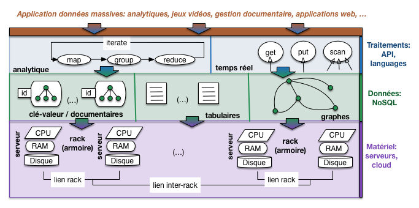
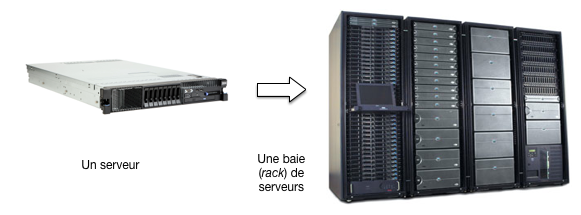
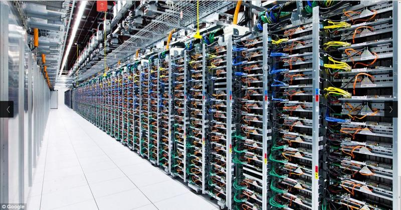
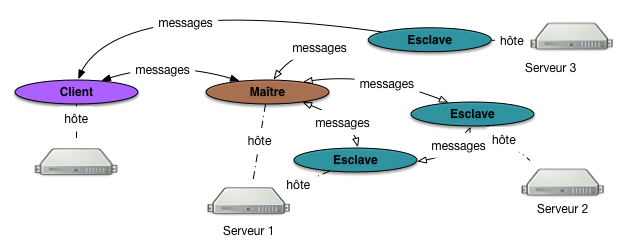
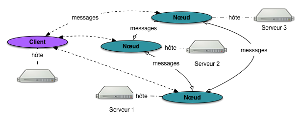
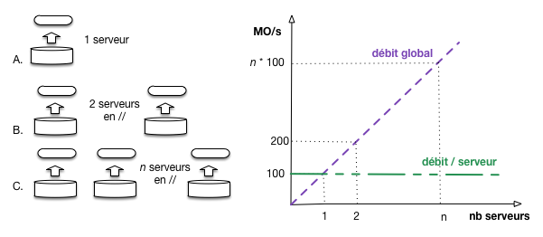
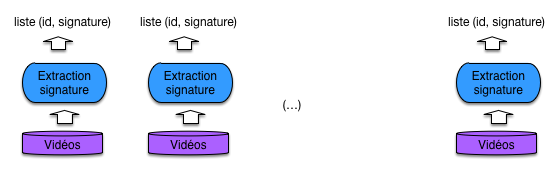
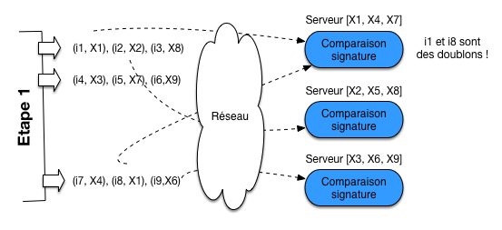
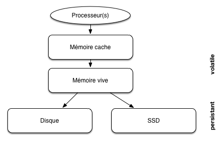
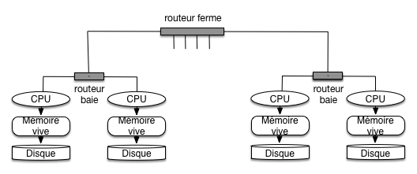

   
   
.. |nbsp| unicode:: 0xA0  
   :trim:  

.. _chap-cloud:

   
##########################################
Le *cloud*, une nouvelle machine de calcul
##########################################

Jusqu'à présent nous avons considéré le cas de la gestion de documents
(ou plus généralement d'objets semi-structurés sérialisés) dans le contexte
classique d'une unique machine tenant le rôle de serveur de données, et
communiquant avec des applications clientes. Le serveur dispose d'un CPU,
de mémoire RAM, d'un ou plusieurs disques pour la persistance. C'est une architecture
classique, courante, facile à comprendre. Elle permet de se pencher sur
des aspects importants comme la modélisation des données, leur indexation, la
recherche.

**La problématique**.
Nous envisageons maintenant la problématique de la *scalabilité* et les
méthodes pour l'aborder et la résoudre. Pour parler en termes intuitifs (pour l'instant)
la scalabilité est la capacité d'un système à s'adapter à une croissance non bornée
de la taille des données (nous parlons de données, et de traitements sur les données,
c'est restrictif et voulu car c'est le sujet du cours). Cette croissance, si nous ne lui envisageons
pas de limite,   finit *toujours* par dépasser les capacités d'une seule machine. 
Si c'est en mémoire RAM, cette capacité se mesure au mieux en TeraOctets (TOs);
si c'est sur le disque, en dizaines de TéraOctets. Même si on améliore les composants
physiques, toujours viendra le moment où le serveur individuel sera saturé.

Un moyen de gérer la scalabilité est d'ajouter des machines au système, et d'en
faire donc un *système distribué*. Cela ne va pas sans redoutables complications
car il faut s'assurer de la bonne coopération des machines pour assumer une tâche commune.
Cette méthode est aussi celle qui est privilégiée aujourd'hui pour faire face
au déluge de production des données numériques (et de leurs utilisateurs). Nous en proposons
dans ce qui suit une présentation qui se veut suffisamment exhaustive pour couvrir
les techniques les plus couramment utilisées, en les illustrant par quelques
systèmes représentatifs.

**Une nouvelle perspective.**
Un mot, avant de rentrer dans le gras, sur le titre du chapitre qui fait référence
au *cloud*, considéré comme un outil d'allocation de machines à la demande. Reconnaissons
tout de suite que c'est un peu réducteur car le *cloud* a d'autres aspects, et on peut y recourir pour
disposer d'une seule machine sans envisager la dimension de la scalabilité. Il
serait plus correct de parler de *grappe de serveurs* mais c'est plus long. 

Donc assumons le terme, dans une perspective générale qui définit *le cloud
comme une nouvelle machine de calcul à part entière, élastique et scalable, apte
à prendre en charge des masses de données sans cesse croissantes.* 
La première session va introduire cette perspective d'ensemble, et nous commencerons
ensuite une investigation systématique de ses possibilités.

.. note:: Rappelons qu'un MégaOctet (MO), c'est :math:`10^6` octets; un GigaOctet (GO) c'est 
   :math:`10^9` octets soit 1 000 MOs;  un TéraOctet (TO) c'est :math:`10^{12}` octets (1 000 GOs);
   un PétaOctet (PO) c'est :math:`10^{15}` octets, 1 000 TOs. Le PO, c'est l'unité
   du volume de données gérés par les applications à l'échelle du Web. 
   Pas besoin d'aller au-delà pour l'instant!

*******************************
S1: *cloud* et données massives
*******************************

Supports complémentaires:

  * `Présentation: Cloud et données massives <http://b3d.bdpedia.fr/files/slcloud.pdf>`_
  * `Vidéo de la session Cloud <https://mediaserver.lecnam.net/permalink/v125f35a3b11a2rwjfdo/>`_  

Ce chapitre  envisage le *cloud* comme une nouvelle machine de calcul en tant
que telle, qui se distingue de celles que nous utilisons tous les jours
par le fait qu'elle est constituée de composants autonomes (les serveurs) communiquant par réseau.
Sur cette machine globale se déploient des logiciels dont la caractéristique commune est de tenter
d'utiliser au mieux les ressources de calcul et de stockage disponible, de s'adapter
à leur évolution (ajout/retrait de machines, ou pannes) et accessoirement de faciliter
la tâche des utilisateurs, développeurs et administrateurs du système.

Vision générale
===============

La  :numref:`cloud`  résume la vision sur laquelle nous allons nous appuyer 
pour l'étude des systèmes distribués.

.. note:: Je rappelle une dernière fois pour ne plus avoir à le préciser ensuite: la
   perspective adoptée ici est celle de la gestion de *données* massives. Les grilles 
   de calcul par exemple n'entrent pas dans ce contexte. Autre rappel: ces données
   sont des unités d'information autonomes et identifiables que nous appelons *documents*
   pour faire simple.
   
La figure montre une organisation en couches allant du matériel à l'applicatif. Ces couches reprennent
l'architecture classique d'un système orienté données: stockage et calcul au niveau bas,
système de gestion de données au-dessus de la couche matérielle, interfaces d'accès au données
ou de traitement analytique, et enfin applications s'appuyant sur ces interfaces pour la
partie de leurs tâches relative aux accès et à la manipulation des données.

Qui dit architecture en  couche dit *abstraction*. Idéalement, chaque couche prend en charge
des problèmes techniques pour épargner à la couche supérieure d'avoir à s'en soucier. Un SGBD
relationnel par exemple gère l'accès aux disques, la protection des données, la reprise sur panne,
la concurrence d'accès, en isolant les applications de ces préoccupations qui leur compliqueraient
considérablement la tâche. Les deux couches intermédiaires de notre architecture tiennent
un rôle similaire. 

.. _cloud:

   
        Perspective générale sur les systèmes distribués dans un *cloud*

Pour bien comprendre en quoi ce rôle a des aspects particuliers dans le cadre d'un système distribué à grande
échelle, commençons par la couche matérielle qui va principalement nous occuper dans
ce chapitre.

La couche matérielle
--------------------

Notre figure montre une couche matérielle constituée de serveurs reliés par un réseau. Chaque serveur
dispose d'un  processeur (souvent multi cœurs), d'une mémoire centrale à accès direct (RAM) 
et d'un ou plusieurs supports de stockage persistant, les disques.

Dans une grappe de serveur, les machines sont dotées de composants de base (soit essentiellement
la carte mère, les disques et la connectique) et dépourvues de tous les petits accessoires
des ordinateurs de bureau (clavier, souris, lecteur DVD, etc.). De plus, les composants utilisés
sont souvent de qualité moyenne voire médiocre afin de limiter les coûts. On parle de 
*commodity server* dans le jargon du milieu. C'est un choix qui peut se résumer
ainsi: *on préfère avoir beaucoup de serveurs de qualité faible que quelques serveurs
de très bonne qualité*. Il a des conséquences
très importantes, et notamment:

  - le faible coût des serveurs permet d'en ajouter facilement à la demande, et d'obtenir
    la scalabilité souhaitée;
  - d'un autre côté la qualité médiocre des composants implique un taux de panne relativement
    élevé; *c'est un facteur essentiel qui impacte toutes les couches du système distribué*.
      
.. important:: Dans les environnements de *cloud* proposés sous forme de service, les serveurs
   sont le plus souvent créés par *virtualisation* ce qui apporte plus de flexibilité pour
   la gestion du service mais impacte (modérément) les performances. Comme on ne peut pas
   parler de tout, on va ignorer cette option ici. Vous êtes maintenant familiarisés avec
   l'utilisation de Docker: imaginez ce que cela donne, en terme d'administration,
   si vous ne disposez pas d'une machine mais de quelques centaines ou milliers.
   

Les serveurs sont empilés
dans des baies spéciales (*rack*) équipées pour leur fournir l'alimentation, la connexion réseau
vers la grappe de serveur, la ventilation. La  :numref:`rack-and-server` montre un serveur
et une baie typiques. 
 
.. _rack-and-server:

   
        Un serveur et une baie de serveurs.

Enfin, les baies sont alignées les unes à côté des autres dans de grands hangars
(les fameux *data centers*, ou grappes de serveurs), illustrés par la  :numref:`google-server-farm`.

.. _google-server-farm:

   
        Une grappe de serveurs.

Les baies sont connectées les unes aux autres grâce à des routeurs, et la grappe de serveur
est elle-même connectée à l'Internet par un troisième niveau de connexion (après ceux intra-baie,
et inter-baies). On obtient une connectique dite "hiérarchique" qui joue un rôle
dans la gestion des données massives.
 
Voici quelques ordres de grandeur pour se faire une idée de l'infrastructure matérielle
d'un système à grande échelle:

  - une baie contient quelques dizaines de serveurs, typiquement une quarantaine;
  - les grappes de serveurs peuvent atteindre des centaines de baies: 100 baies =
    env. 4000 serveurs = des PétaOctets de stockage.
  - les grandes sociétés comme Google, Facebook, Amazon ont depuis longtemps dépassé
    le cap du million de serveurs: essayez d'en savoir plus si cela vous intéresse (pas si facile).
    
Pas besoin d'atteindre cette échelle pour commencer à faire du distribué: quelques machines (2 
au minimum...) et on a déjà mis le pied dans la porte. Intervient alors la notion d'*élasticité*
étroitement liée au *cloud*: étant donnée l'abondance de ressources, il est très facile
d'allouer une ou plusieurs nouvelles machines à notre système. Si ce dernier est conçu de manière 
à être *scalable* (définition plus loin) il n'y a virtuellement pas de limite à l'accroissement
de sa capacité matérielle. 

Il faut souligner que dans l'infrastructure que nous présentons, la dépendance entre
les serveurs est réduite au minimum. Ils ne partagent pas de mémoire ou de périphériques, et leur
seul moyen de communiquer est l'échange de messages (*message passing*). Cela implique
que si un serveur tombe en panne, l'impact reste local.

Gare à la panne
---------------

Une des conséquences importantes d'une infrastructure basée sur
des serveurs à faible coût est la fréquence des *pannes* affectant le système. Ces pannes
peuvent être matérielles, logicielles, ou liées au réseau. Elles sont temporaires (un composant
ne répond plus pendant une période plus ou moins courte, puis réapparaît - typique des problèmes
réseau) ou permanentes (un disque qui devient inutilisable).

La fréquence d'une panne est directement liée au nombre de composants. Si, pour prendre
un exemple classique, un disque tombe en panne en moyenne tous les 10 ans, on aura
affaire (en moyenne) à une panne par an avec 10 disques, et une panne par jour
à partir de quelques milliers de disques ! Il ne s'agit que d'une moyenne: si tous les
matériels ont été acquis au même moment, ils auront tendance à tomber en panne à peu
près dans la même période.

L'ensemble du système distribué doit être conçu pour tolérer ces pannes et continuer
à fonctionner, éventuellement en mode dégradé. La principale méthode pour faire face
à des pannes est la *redondance*: on duplique par exemple systématiquement

  - les données (sur des disques différents!) pour pallier les défaillances de disque;
  - les composants logiciels dont le rôle est vital et dont la défaillance 
    impliquerait l'arrêt complet du système (*single point of failure*) sont également 
    dupliqués, l'un d'eux assurant la tâche et le (ou les) autre(s) étant prêts
    à prendre la relève en cas de défaillance.

Par ailleurs, le système doit être équipé d'un mécanisme de détection des pannes
pour pouvoir appliquer une méthode de reprise et assurer la disponibilité permanente.
En résumé, les pannes et leur gestion automatisée constituent un des soucis majeurs
dans les environnements *Cloud*.     

Systèmes distribués
===================

La couche logicielle qui exploite les ressources d'une ferme de serveur 
constitue un *système distribué*. Son rôle est de coordonner les actions
de plusieurs ordinateurs connectés par un réseau, en vue d'effectuer  une tâche commune.
Les systèmes NoSQL ont esentiellement en commun
d'être des systèmes distribués dont la tâche principale est la 
gestion de grandes masses de données.
         
Messages et protocole
---------------------

Commençons par quelques caractéristiques communes et un peu de terminologie. Un système
distribué est constitué de composants logiciels (des processus) que nous appellerons
*nœuds*. En règle générale, on trouve un nœud sur chaque machine, mais ce n'est pas une obligation. 

Ces nœuds
sont interconnectés par réseau et communiquent par *échange de messages*. La
connexion au réseau s'effectue par un port numéroté. Dans le cas du Web
par exemple (le système distribué le plus connu et le plus fréquenté!), le port est en général
le port 80. Rien n'empêche d'avoir plusieurs nœuds sur une même machine,
mais il faut dans ce cas associer à chacun un numéro de port différent. La 
configuration du système distribué consiste à énumérer la liste des nœuds
participants, référencés par l'adresse de la machine et le numéro de port. 

Le format des messages obéit à un certain protocole que nous n'avons pas
à connaître en général. Certains systèmes utilisent le protocole HTTP
(par exemple CouchDB, ou Elastic Search pour son interface REST), 
ce qui présente l'avantage d'une très bonne intégration au Web et une normalisation
de fait (des librairies HTTP existent dans tous les langages), 
mais l'inconvénient d'une certaine lourdeur. La plupart des protocoles d'échange
sont  spécifiques.

Clients, maîtres et esclaves
----------------------------

L'organisation du système distribué dépend des différents *types* de nœuds, de leur interconnexion et des
relations possibles avec le nœud-client (l'application). Nous allons essentiellement rencontrer deux topologies,
illustrées respectivement par la  :numref:`client-master-slave` et la  :numref:`client-master`.

.. _client-master-slave:

   
        Une architecture avec maître-esclave
        
Dans la première, le système distribué est organisé selon une topologie *maître-esclave*. Un
nœud particulier, le *maître*, tient un rôle central. Il  est 
notamment chargé des tâches administratives du système 
  
   - ajouter un nœud, en supprimer un autre, 
   - surveiller la cohérence et la disponibilité du système,
   - appliquer une méthode de reprise sur panne le cas échéant.
   
Il est aussi souvent chargé de communiquer avec l'application cliente (qui constitue un troisième type de nœud). 
Dans une telle architecture, le nœud-maître communique avec les nœuds-esclaves, qui
eux-mêmes peuvent communiquer entre eux. Un client qui s'adresse au système distribué 
envoie ses requêtes au nœud-maître, et ce dernier peut le mettre en communication
avec un ou plusieurs nœuds-esclaves. En revanche, un nœud-client ne peut pas
transmettre une requête directement à un esclave, ce qui évite des problèmes de 
concurrence et de cohérence que nous aurons l'occasion  de détailler sur 
des exemples pratiques. 

Insistons sur le fait que les nœuds sont des composants *logiciels* (des processus
qui tournent en tâche de fond)  hébergés par une machine. Il n'y a pas forcément
de lien un-à-un entre un nœud et une machine. La  :numref:`client-master-slave` montre
par exemple que le maître et un des esclaves sont hébergés par le serveur 1.
En fait, tous les nœuds peuvent être sur une même machine. Le système reste distribué, mais
pas vraiment scalable!

.. _client-master:

   
        Une architecture multi-nœuds 
        
Dans la seconde topologie (plus rare), il n'y a plus ni maître ni esclave, 
et on parlera en général de (multi-)nœuds, voire de (multi-)serveurs (au sens logiciel du terme).
Dans ce cas (:numref:`client-master`), le client peut indifféremment s'adresser à chaque
nœud. 

Cette topologie a la mérite d'éviter d'avoir un nœud particulier (le maître) dont
l'existence est indispensable pour le fonctionnement global du système. On parle pour un tel nœud
de *point individuel de défaillance* (*single point of failure*), situation que l'on cherche à éviter
en principe. Cela rend l'ensemble
du système plus fragile que si tous les nœuds ont des rôles équivalents. Cela dit,
une architecture avec un maître est plus facile à mettre en œuvre en pratique
et nous la rencontrerons plus souvent, associée à des dispositifs pour protéger
les tâches du nœud-maître.
 
Gestion des pannes, ou *failover*
---------------------------------

L'infrastructure à base de composants bon marché est soumise à des pannes fréquentes. Il est exclu 
de pallier ces pannes par la mobilisation permanente d'une armée d'ingénieurs système, et
un caractère distinctif des systèmes distribués (et en particulier de ceux dits NoSQL)
est d'être capable de fonctionner sans interruption en dépit des pannes, par application
d'une méthode de reprise sur panne souvent désignée par le mot *failover*.

En règle générale, la reprise sur panne s'appuie sur deux mécanismes génériques:

 - un  des nœuds est chargé de surveiller en permanence l'ensemble des nœuds du système
   par envoi périodique de messages de contrôle (*heartbeat*); en cas d'interruption
   de la communication, on va considérer qu'une panne est intervenue;
 - la méthode de reprise s'appuie sur la redondance des services et la réplication
   des données: pour tout composant fautif, on doit pouvoir trouver un autre composant
   doté des mêmes capacités.
    
Signalons un cas épineux: celui d'un
*partitionnement du réseau*. Dans un système avec *n* machines, on se retrouve avec
deux sous-groupes qui ne communiquent plus, l'un constitué de :math:`m` machines, l'autre des 
:math:`n-m` autres machines.
Que faire dans ce cas? Qui continue à fonctionner et comment?  
Nous verrons en détail les méthodes de réplication et de reprise pour quelques systèmes représentatifs. 

Les systèmes de stockage distribués, dits NoSQL
===============================================

On peut considérer que les systèmes de gestion de données massives apparus depuis les années 2000,
et collectivement
regroupés sous le terme commode de "NoSQL", sont une réponse à la question: "*quel outil me
permettrait de tirer parti de ma grappe de serveur pour mes données, en limitant au maximum
les difficultés liés à la distribution et au parallélisme?*" 
   
Une solution tout à fait
naturelle aurait été d'adopter les systèmes relationnels *distribués* qui existent depuis
longtemps et ont fait leur preuve. Pour des raisons qui tiennent à la nature plus "documentaire"
des données massives (voir le début de ce cours) et à la perception des lourdeurs de certains
aspects des systèmes relationnels (jointures et transactions  notamment), un autre choix s'est  imposé. Il
consiste à sacrifier certaines fonctionnalités (modèle, langage normalisé et puissament
expressif, transactions)
au profit de la capacité à se déployer dans un environnement distribué, à en tirer parti au 
mieux, à fournir une méthode de *failover* automatique,
et à faire preuve d'élasticité pour monter en puissance par ajout de nouvelles
ressources.

.. note:: Le terme "NoSQL" est censé signifier quelque chose comme "*Not Only SQL*", soit
   l'idée que les systèmes relationnels ne sont pas bons à tout faire, et que certaines
   niches (dont la gestion de données à très grande échelle) imposent des choix différents
   (en fait, des sacrifices sur les fonctionnalités avancées: modèle de données, interrogation, cohérence). 
   Aucune personne sensée ne prétend *remplacer* les systèmes relationnels dans la très grande majorité des applications, mais
   tous les systèmes NoSQL prétendent faire mieux en matière de scalabilité horizontale.

Les systèmes dits "NoSQL" sont extraordinairement variés. Un de leurs  points communs 
est d'être conçus explicitement pour une infrastructure *cloud* semblable à celle que
nous avons décrite ci-dessus. On retrouve dans cette conception des principes récurrents
que nous allons justement essayer de mettre en valeur dans tout ce qui suit. Résumons-les:

  - capacité à exploiter de manière équilibrée un ensemble de machines en vue d'une tâche précise;
  - capacité à détecter les pannes et à s'y adapter automatiquement;
  - capacité à évoluer par ajout/suppression de nouvelles ressources matérielles, sans interruption de service.

Il n'est pas question ici d'énumérer tous les systèmes existants. Ce serait laborieux, répétitif
et fragile puisqu'il en apparaît (et peut-être disparaît) tous les jours. 
Ce qu'il faut retenir essentiellement, c'est que:

  - ces systèmes fournissent nativement une adaptation à une infrastructure distribuée;
  - les modèles de données sont principalement de nature documentaire (ceux que nous
    étudions principalement), graphe (réputés assez peu scalables) et ...
    pas de modèle du tout: on stocke des chaînes d'octets !
  - on peut distinguer les systèmes à orientation analytique (traitements longs appliqués
    à une partie significative des données à des fins statistiques) et temps réel (accès
    instantané, quelques millisecondes, à des unités d'informations/documents).

Malgré le côté foisonnant de la scène NoSQL, tous s'appuient sur quelques principes 
de base que nous allons étudier dans la suite du cours; connaissant ces principes,
il est plus facile de comprendre les systèmes. Une  précision très importante: aucune normalisation
dans le monde du NoSQL. Choisir un système, c'est se lier les mains avec un modèle de données,
un stockage, et une interface spécifique. 

Une dernière remarque pour finir: les systèmes NoSQL les plus sophistiqués (Cassandra par exemple) tendent lentement
à évoluer vers une gestion de données structurées, équipée d'un langage d'interrogation qui rappelle furieusement SQL.
Bref, on se dirige vers ce qui ressemble fortement à du relationnel distribué.

Les systèmes de calcul distribués
=================================

Enfin la dernière couche de notre architecture est constituée de systèmes de calcul distribués
qui s'appuient en général sur un système de stockage NoSQL pour accéder aux données initiales. Le premier
système de ce type est Hadoop, équipé d'un moteur de calcul MapReduce. Une alternative plus sophistiquée
est apparue en 2008 avec Spark, qui propose d'une part des opérations plus complètes, d'autre
part un système de gestion des pannes plus performant. D'autres systèmes plus ou moins équivalents
existent, dont Flink qui est spécialisé pour le traitement de grand flux de données.

Quiz
====

.. eqt:: cloud-1

    Quel est l'ordre de grandeur du volume de données qui rend nécessaire le passage 
    à un système distribué?
   
    A) :eqt:`I` Le Giga
    #) :eqt:`C` Le Téra
    #) :eqt:`I` Le Péta

.. eqt:: cloud-2

    Que désigne le terme de *commodity server*? 
   
    A) :eqt:`I` Une machine dont la mémoire et la puissance de calcul sont extensibles
    
    #) :eqt:`I` Une machine propre à tous les usages, depuis l'ordinateur de bureau jusqu'au serveur
    #) :eqt:`C` Une machine réduite aux composants principaux, ces derniers étant à bas coût

.. eqt:: cloud-3

    À quoi correspond la notion de *SPOF* (*Single point of failure*)?
   
    A) :eqt:`C` Un composant dont le bon fonctionnement est nécessaire à tout le système
    #) :eqt:`I` Un composant par lequel toutes les données doivent passer
    #) :eqt:`I` Le composant le plus fragile du système

.. eqt:: cloud-4

    Qu'est-ce que le *failover*? Pourquoi est-ce important dans les systèmes de type *cloud*? 
   
    A) :eqt:`I` Le *failover* est la capacité d'une machine à se rétablir après une panne
    #) :eqt:`C` Le *failover* est la capacité d'un système à pallier la panne d'un de ses composants
    #) :eqt:`I` Le *failover* est le taux de panne du système

.. eqt:: cloud-5

    Parmi les arguments suivants en faveur du protocole HTTP pour la gestion de données 
    massives, lequel vous semble le moins convaincant?
   
    A) :eqt:`I` C'est un protocole normalisé implanté dans tous les langages de programmation
    #) :eqt:`C` C'est un protocole qui échange les données de manière compacte
    #) :eqt:`I` C'est un protocole pour lequel il existe déjà des applications clients: les navigateurs Web

.. eqt:: cloud-6

    Quel est le point faible d'une architecture Maître-esclave?
   
    A) :eqt:`C` Le maître est un SPOF
    #) :eqt:`I` Toutes les communications, y compris celles entre esclaves, doivent passer par le maître
    #) :eqt:`I` Une application client doit connaître tous les nœuds, et savoir lequel est le maître

.. eqt:: cloud-7

    Parmi les propriétés suivantes, une seule s'applique aux systèmes NoSQL. Laquelle?
   
    A) :eqt:`I` Ils disposent d'un haut niveau de fonctionnalités (transactions, langage expressif)
    #) :eqt:`I` Ils sont normalisés
    #) :eqt:`C` Ils s'adaptent nativement à des environnements distribués

******************
S2: La scalabilité
******************

Supports complémentaires:

  * `Présentation: Scalabilité <http://b3d.bdpedia.fr/files/slscalable.pdf>`_
  * `Vidéo de la session consacrée à la scalabilité <https://mediaserver.lecnam.net/permalink/v125f35a40247xlka7dn/>`_  
  
Il est temps de revenir sur la notion de scalabilité pour la définir précisément,
et de donner quelques exemples pour comprendre en pratique ce que cela implique.

Une définition
==============

Voici une définition assez générale, basée sur les notions (à expliciter)
de "système", "performance" et "ressource". 

.. _Def-scalability:

.. admonition:: Définition (scalabilité). 

   Un système est *scalable*  si ses *performances*
   sont proportionnelles aux *ressources* qui lui sont allouées.

Il s'agit d'une notion très stricte de la scalabilité, qu'il est difficile d'obtenir
en pratique mais nous donne une idée précise du but à atteindre.
   
Explicitons maintenant les notions sur lesquelles repose la définition.
Dans notre cas, la notion de *système* est assez bien identifiée:
il s'agit de l'environnement distribué de gestion/traitement de données basé sur l'architecture
de la  :numref:`cloud`. 

Les *ressources* sont les composants matériels que l'on peut ajouter au système.
Il s'agit essentiellement des serveurs, mais on peut aussi prendre en compte des dispositifs liés
au réseau comme les routeurs. La consommation des ressources s'évalue essentiellement selon les unités
de grandeur suivantes:

  - la mémoire RAM alouée au système;
  - le temps de calcul;
  - la mémoire secondaire (disque)
  - la bande passante (réseau).

.. note: La scalabilité mesuré en fonction de *nombre* des ressources est dite *scalabilité horizontale*,
   alors que la scalabilité en fonction de la *capacité* des ressources est la *scalabilité verticale*.
   Dans notre contexte, on vise la scalabilité horizontale par ajout de serveur, en renonçant 
   à une scalabilité verticale obtenue par des super-calculateurs.  

La notion de *performance* est la plus flexible. Voici les deux acceptions principales que nous
allons étudier.

  - *débit*: c'est le nombre d'unités d'information (documents) que nous pouvons
    traiter par unité de temps, toutes choses égales par ailleurs; 
  - *latence*: c'est le temps mis pour accéder à une unité d'information (document), en 
    lecture et/ou en écriture.
    
Au lieu de mesurer le débit en documents/seconde, on regarde souvent le nombre d'octets (par
exemple, 10 MO/s). C'est équivalent si on accepte que les documents ont une taille moyenne
avec un écart-type pas trop élevé. En ce qui concerne la latence, on mesure souvent le
nombre d'accès par seconde sur un nombre important d'opérations, afin de lisser les écarts,
et on nomme cette mesure *transactions par seconde* (abrégé par tps).

Exemple: comptons les documents
===============================

Pour mettre en évidence la scalabilité, conformément à la définition ci-dessus,
il faut quantifier les grandeurs *ressource* et *performance* et  montrer que leur
rapport est constant *pour un volume de données fixé*. Prenons un premier exemple:
on veut compter le nombre de documents dans le système. 
Charge serveur effectue indépendamment son propre comptage.
Il exécute pour cela une opération qui consiste à charger en mémoire centrale les données
stockées sur des disques magnétiques.  On mesure le débit de cette opération en MO/s
(:numref:`scalability1`).

.. _scalability1:

   
        Mesure de scalabilité
        
Avec un seul serveur, on constate un débit de 100 MO/s. Avec deux serveurs, on peut répartir
les données équitablement et effectuer les lectures en parallèle: on obtient un débit 
de 200 MO/s. Il n'est pas difficile d'extrapoler et de considérer que si on a *n* serveurs,
le débit sera de *n* \* 100 MO/s. 

*Attention*: dans ce scénario on suppose que tous les accès
sont de nature *locale*, et qu'il n'y a pas d'échange entre les serveurs. À la fin de l'opération
on obtient le nombre de documents sur chaque serveur, et cette information (un entier sur 4 ou 8 octets) est suffisamment
petite pour être transférée au client qui effectue l'agrégation. 

Le traitement est scalable. La figure montre le débit global: c'est bien une droite exprimant la dépendance linéaire entre
le nombre de ressources et la performance. La droite en vert montre que le débit par serveur est 
constant: c'est une condition nécessaire mais pas suffisante pour garantir la scalabilité au
niveau du système global. Si toutes les données devaient par exemple transiter dans un
unique tuyau de débit 1 GO/s, au bout de 10 serveurs en parallèle ce tuyau constituerait
le goulot d'étranglement du système.

Comme le montre cet exemple simple, la scalabilité nécessite d'envisager le système de manière globale,
en veillant à l'équilibre de tous
ses composants.

Autre exemple: cherchons les doublons
======================================

Prenons un exemple un peu plus complexe. On veut chercher d'éventuels doublons         
dans notre collection de vidéos. Après d'intenses réflexions, le groupe d'ingénieur NFE204
décide d'implanter un algorithme en deux étapes.

  - la première parcourt les vidéos et produit, pour chacune, une *signature* 
    (cf. http://en.wikipedia.org/wiki/Digital_video_fingerprinting); cette première étape
    se fait localement;
  - la seconde étape regroupe les signatures; si deux signatures (ou plus) égales sont trouvées,
    c'est un doublon!

La première étape est à peu de choses près le parcours en parallèle de tous
les disques, associé à un traitement local pour extraire la signature (:numref:`scalability2` ). 
Le résultat est une liste de paires *(id, signature)* où l'id de chaque document est associé
à sa signature.

.. _scalability2:

   
        Extraction des signatures

La seconde étape va nécessiter des échanges réseau. On va associer chaque serveur à une partie
des signatures, par hachage. Par exemple (très simple), si on a *n* serveurs, on
va associer une signature *h* au serveur *mod(h, n)*.  La :numref:`scalability3`
illustre le cas de 3 serveurs: les signatures *X1* et *X4* sont envoyées au serveur 1
puisque *mod(1,3)=mod(4,3)=1*.

On envoie alors
chaque paire *(i, s)* issue de l'étape 1, constituée d'un identifiant *i* et d'une signature *s* au serveur 
associé à *s*. Si deux signatures sont égales, elles se retrouveront sur le même serveur. Il suffit
donc d'effectuer, *localement*, une comparaison de signatures pour reporter les doublons. C'est le
cas pour les documents i1 et i8 dans la  :numref:`scalability3`.

.. _scalability3:

   
        Transfert des signatures et détection des doublons.

Le traitement est-il scalable? Oui en ce qui concerne la première étape, pour les raisons
analysées dans le premier exemple: le traitement s'effectue localement sur
chaque serveur, de manière indépendante.

La seconde étape implique un transfert réseau
de l'ensemble des listes produites dans la première étape.
Il faut donc tout d'abord  comparer le coût du transfert réseau, celui de la lecture
des données, et celui du traitement. Les données échangées (ici, des paires de valeurs) sont 
certainement beaucoup plus petites que les documents. Il est possible alors que le transfert réseau de ces
listes soit 100 ou 1000 fois moins coûteux que le parcours des documents et l'extraction de la signature.
Dans ce cas le coût prépondérant est celui de la première étape, et le traitement global est scalable.

Si le coût des transferts réseaux est comparable (ou supérieur) à celui des traitements,
il faudrait,  pour que la scalabilité soit stricte,  qu'il soit possible
d'améliorer le débit dans la grappe de serveur proportionnellement au nombre de serveurs.
C'est typiquement difficile, à moins de recourir à du matériel de connectique très sophistiqué et donc
très coûteux. Il est plus probable que le débit restera constant ou, pire 
se *dégradera* avec l'ajout de nouveaux serveurs. L'échange réseau devient le facteur
entravant la scalabilité.

 
Quelques conclusions
====================

En pratique, il est difficile d'augmenter les performances du réseau proportionnellement
aux ressources, et les transferts sont l'un des facteurs qui peuvent limiter la scalabilité en pratique.
La situation la plus favorable est celle de notre premier exemple, où l'essentiel
des traitements se fait *localement*, avec un résultat de taille négligeable qu'il est ensuite
possible de transférer à une autre machine ou  à l'application cliente. Plus généralement,
il faut être attentif à limiter le plus possible la taille des données échangées entre les
serveurs de manière à ce que le coût des transferts reste négligeable par rapport à celui
des traitements.
 

Le fait d'être scalable (selon notre définition) ne veut pas dire que le temps
de calcul est *acceptable*. Si un traitement prend 10 ans, il prendra encore 5 ans en doublant les ressources...
La première chose à faire est de s'en apercevoir à l'avance en effectuant des tests et en mesurant 
le coût des éléments dans la chaîne de traitement. Ensuite, il faut voir si on peut optimiser. 

Quand un traitement est complètement optimisé, et que la durée prévisible reste
trop élevée, la question suivante est : suis-je prêt à allouer les ressources nécessaires? 
Et là, si la réponse est non, il est temps de reconsidérer la définition du problème.
La définition du BigData, ça pourrait être: toutes les données que je peux me permettre
de stocker, et pour lesquelles il existe au moins un traitement assez intéressant 
au vu des ressources que je dois y consacrer. À méditer.

Quiz
====

.. eqt:: scal-1

    Un système de *n* serveurs consacre 80% de CPU à une application; la taille des données
    double, on ajoute *n* nouveaux serveurs, et on reste à 80% de CPU. Est-ce suffisant
    pour dire que le système est scalable? 

   
    A) :eqt:`I` Oui, c'est par définition
    #) :eqt:`C` Non, car il se peut que le réseau soit surchargé
    #) :eqt:`I` Non, on ne peut mesurer la scalabiité que pour 100% d'utilisation des ressources

.. eqt:: scal-2

    On veut implanter une jointure (par exemple entre les films et leur metteur
    en scène) avec la technique  proposée dans le chapitre :ref:`chap-mapreduce`. 
    On distribue donc les films selon l'identifiant de leur réalisateur, les
    artistes selon leur identifiant, et on effectue les jointures localement. C'est
    donc une forme de jointure par hachage.

    A) :eqt:`C` Cette méthode est scalable pour la jointure peut s'effectuer en parallèle
       sur tous les serveurs
    #) :eqt:`I` Cette méthode n'est pas scalable puisqu'elle implique un échange par réseau 
       de toutes les données

.. eqt:: scal-3

    Un système scalable en débit  l'est également en latence, et réciproquement

    A) :eqt:`I` Oui, car cela signifie que les ressources alloués contribuent proportionnellement
       aux capacités du système
    #) :eqt:`C` Non, car un système temps réel peut s'appuyer sur un index qui ne 
       contribue pas à l'amélioration du débit global
    #) :eqt:`I` Non, ça n'est vrai que dans un sens: un système analytique scalable
       est également scalable pour une appli temps réel puisque cela
       implique la scalabilité réseau, mais l'inverse n'est pas vrai. 

*************************************
S3: anatomie d'une grappe de serveurs
*************************************

Supports complémentaires:

  * `Présentation: performances du Cloud <http://b3d.bdpedia.fr/files/slcloudperf.pdf>`_
  * `Vidéo de la session consacrée aux performances d'un centre de données <https://mediaserver.lecnam.net/permalink/v125f35a402b0bxdcj0p/>`_  

Tout système informatique repose sur un ensemble de mécanismes de stockage
et d'accès à l'information, les *mémoires*.  Ces mémoires se différencient
par leur prix, leur rapidité, le mode d'accès aux données
(séquentiel ou par adresse) et enfin leur durabilité. 

La gestion des mémoires est une problématique fondamentale des SGBD: pour
une révision, je vous renvoie au chapitre "stockage" de mon cours sur les
`aspects systèmes des bases de données <http://sys.bdpedia.fr>`_. Les notions
essentielles sont revues ci-dessous, et reprise dans le cadre d'une ferme de serveur
où le réseau et la topologie du réseau jouent un rôle important.

La hiérarchie des mémoires
==========================

D'une manière générale, plus une mémoire est rapide, plus elle est
chère et -- conséquence directe -- plus sa capacité est réduite. Dans 
un cadre centralisé, mono-serveur, les mémoires forment une hiérarchie
classique illustrée par la  :numref:`hiermem`, allant de la mémoire la plus petite
mais la plus efficace à la mémoire la plus volumineuse 
mais la plus lente. Un bonne partie du travail d'un SGBD consiste
à placer l'information requise par une application le plus haut possible
dans la hiérarchie des mémoires: dans le cache du processeur idéalement;
dans la mémoire RAM si possible; au pire il faut aller la chercher
sur le disque, et là ça coûte très cher.
       
.. _hiermem:       

			
   Hiérarchie des mémoires dans un serveur
    
La mémoire vive (que nous appellerons mémoire
principale) et les disques (ou mémoire secondaire) sont les principaux niveaux
à considérer pour des applications de bases de données. Une base
de données est à peu près toujours stockée sur disque, pour les raisons
de taille et de persistance, mais  les données
doivent impérativement être placées en mémoire vive pour
être traitées. 

.. important:: La mémoire RAM est une mémoire *volatile* dont le contenu 
   est effacé lors d'une panne. Il est donc essentiel de synchroniser la mémoire
   avec le disque périodiquement (typiquement au moment d'un *commit*).

Si on considère maintenant un *cloud*, la hiérarchie se complète avec
les liens réseaux connectant les serveurs. Du côté du réseau aussi on trouve une hiérarchie:
les serveurs d'une même baie sont liés par un réseau rapide, mais les baies elles-mêmes
sont liées par des routeurs qui limitent le débit des échanges. 
       
.. _hiermem-cloud:       

			
   Hiérarchie des mémoires dans une ferme de serveurs

La :numref:`hiermem-cloud`  illustre les mémoires et leur communication dans une ferme de serveur. On
pourrait y  ajouter un troisième niveau de communication réseau, celui entre deux
fermes de serveurs distinctes.

Performances
============

On peut évaluer (par des ordres de grandeur, car les variations sont importantes en fonction
du matériel) les performances d'un système tel que celui de la :numref:`hiermem-cloud` selon deux critères:

  * *Temps d'accès*, ou *latence*: connaissant  *l'adresse* d'un document, quel est le temps
    nécessaire pour aller à l'emplacement mémoire indiqué par cette adresse
    et obtenir le document |nbsp| ?    On parle de lecture par clé
    ou encore *d'accès direct* pour cette opération;
  * *Débit*: quel est le volume de données lues par unité de temps
    dans le meilleur des cas? 
     
     
.. important:: Dans le cas d'un disque magnétique, le débit s'applique
   une lecture *séquentielle* respectant l'ordre de stockage des données
   sur le support. Si on effectue la lecture dans un ordre différent, il
   s'agit en fait d'une séquence d'accès directs, et c'est extrêmement lent.

Le temps d'un accès *direct*  en mémoire vive est par exemple de l'ordre
de 10 nanosecondes (:math:`10^{-8}` sec.), de 0,1 millisecondes pour un SSD, et  
de l'ordre de 10 millisecondes (:math:`10^{-2}` sec.) pour un disque.
Cela  représente un ratio approximatif de 1 |nbsp| 000 |nbsp| 000 (1 million!) 
entre les performances respectives de la mémoire centrale et du disque magnétique |nbsp| ! 
Un SSD est très approximativement 100 fois plus rapide (en accès direct) qu'un disque magnétique.

 .. _tbl-memoires:
 .. list-table:: Performance des divers types de mémoire
   :widths: 15 10 20 30
   :header-rows: 1

   * - Type mémoire
     - Taille
     - Temps d'accès aléatoire
     - Débit en accès séquentiel
   * - Mémoire *cache* (Static RAM)
     - Quelques MOs
     - :math:`\approx  10^{-8}` (10 nanosec.)  
     - Plusieurs dizaines de GOs par seconde
   * - Mémoire principale (Dynamic RAM)
     - Quelques GOs
     - :math:`\approx  10^{-8} -  10^{-7}` (10-100 nanosec.)
     - Quelques GO par seconde
   * - Disque magnétique
     - Quelques TOs
     - :math:`\approx  10^{-2}` (10 millisec.)    
     - Env. 100 MOs par seconde.
   * - SSD
     - Quelques TOs
     - :math:`\approx  10^{-4}` (0,1 millisec.)    
     - Jusqu'à quelques GOs par seconde.          

En ce qui concerne les composants réseau, la méthode la plus courante est d'utiliser des routeurs 
Ethernet 48 ports offrant un débit d'environ 10 GigaBits/sec. On utilise un routeur de ce type pour chaque baie,
en connectant par exemple les 40 serveurs de la baie. À un second niveau, les routeurs-baie 
sont connectés par un routeur-ferme qui se charge de mettre en communication les serveurs
de baies différentes (:numref:`hiermem-cloud`). Les 8 ports restant au niveau de chaque
baie sont par exemple utilisés pour cette connexion globale. Cela introduit un facteur 
d'agrégation (*oversubscription*) puisque  chaque port "global" doit gérer le débit
de 5 serveurs de la baie. 

.. note:: Vous avez compris la phrase qui précède? Si non, réfléchissez.

.. csv-table:: 
   :header: "", "RAM locale", "Disque local", "RAM Baie", "Disque baie", "RAM cloud", "Disque cloud"
   :widths: 10, 10, 10, 10, 10, 10, 10
	         
   "Latence (micro sec)", 0.1, 10 000, 300, 10 000, 500, 10 000
   "Débit (en MO/s)", 10 000, 100, 125, 100, 25, 20

Le tableau ci-dessus donne les ordres de grandeur pour la latence et le débit au
sein de la hiérarchie de mémoire (il faudrait ajouter les SSDs, cf. les performances
de ces derniers). Ce ne sont que des estimations: le débit de 20 MO/s par exemple est
obtenu en considérant que le facteur d'agrégation au niveau de chaque baie est de 5 (soit
100 MO/s divisé par 5), et en supposant que le trafic est équitablement réparti
entre les 5 serveurs partageant un même port.
L'accès la RAM d'un serveur en dehors de la baie subit l'effet combiné du réseau
(10 Gbits/s, soit 1,25 GO/s) et du facteur 5.

Il reste à donner une idée du coût. À ce jour (2024) voici ce qu'il en est pour une mémoire de 1 TO.

  - RAM: environ 3 000 $
  - SSD: environ 100 $
  - Disque: environ 20 $
  
C'est sans doute moins cher si on achète en gros, mais cela donne une idée du rapport. Le SSD
est très attractif mais reste encore presque 5 fois plus cher qu'un disque magnétique classique.  

Le principe de localité des données
===================================

Les mesures qui précèdent montrent l'importance du principe dit "de localité des données" que l'on
peut résumer ainsi: *il vaut mieux exécuter un traitement au plus près des données que de déplacer
des données vers un traitement*.

C'est particulièrement vrai des traitements analytiques qui parcourent de gros
volumes pour en extraire des informations statistiques. Si un traitement accède au
données du disque *local*, le débit est de l'ordre de 100 MO/s, alors qu'il sera
divisé par 5 ou 10 si on doit lire les données d'un disque *distant* (extérieur à la baie).
Bien entendu, si en plus les données peuvent être en  RAM ou au moins en SSD, on gagne un facteur 100
ou plus. À l'arrivée, cela fait une énorme différence.

La *data locality* est mise en œuvre par les systèmes comme Hadoop qui "déplacent" les programmes
vers les données, plutôt que d'amener les données à la machine exécutant le traitement, comme
c'est le cas dans une architecture client-serveur traditionnelle. Nous verrons concrètement
comment cela se passe pour les *frameworks* MapReduce qui distribuent des fonctions dans
le *cloud*, chaque serveur participant étant en charge d'exécuter les fonctions sur les
données de son stockage local.

.. note:: La localité des données est un concept proche du principe de localité généralement
  connu en informatique et qui peut s'énoncer comme: deux données susceptibles d'être
  traitées ensemble doivent être proches l'une de l'autre dans la  mémoire. 

Quelques conclusions
====================

Les ordres de grandeur qui précèdent ont quelques conséquences essentielles pour l'efficacité
des systèmes distribués. Il faut bien distinguer les systèmes temps réel, plutôt affectés
par la latence, des systèmes analytiques, plutôt affectés par le débit.

Systèmes analytiques
--------------------

Le principe essentiel est celui de la *localité des données*: un traitement gagnera beaucoup
en efficacité si le traitement s'applique aux données *locales* (c'est-à-dire celles
stockées sur le disque du serveur où s'exécute le traitement).

Il s'ensuit que les systèmes analytiques font de leur mieux pour *déplacer
les traitements  vers les données*, au lieu de la démarche inverse quand on exécute 
en client/serveur. 

Autre conséquence importante: *les données doivent être stockées séquentiellement sur les disques*,
pour minimiser la très grande latence des accès directs (quelques millisecondes). Pour caricaturer:
dans un systèmes distribué analytique, on écrit et on lit les données par lot, en parcourant
séquentiellement les disques. 

Nous retrouverons ces principes à l'œuvre dans un système comme Hadoop.

Systèmes temps réel
-------------------

Ici, on retrouve une préoccupation classique des SGBD centralisés: *les données doivent
être en RAM, au moins celles qui sont le plus utilisées*. L'accès à une donnée en RAM,
même sur une machine distante, est infiniment plus rapide qu'un accès disque. 
Un système temps réel doit tirer parti d'une infrastructure distribuée pour "agréger"
les RAM des serveurs comme une sorte de très grande mémoire *cache*. Les disques,
si possible, ne sont là que pour assurer la persistance.

.. note:: Un système comme MongoDB applique ce principe en recourant tout simplement
   aux fichiers *mappés* en mémoire centrale. Voir http://en.wikipedia.org/wiki/Memory-mapped_file
   et http://docs.mongodb.org/manual/faq/storage/. 

Quiz
====

.. eqt:: scal2-1

    Les baies d'une ferme de serveur sont équipées de routeurs Ethernet 48 ports et contiennent
    chacune 24 serveurs. En reprenant le calcul de cette session, quel est le débit espéré
    d'un disque d'une baie B1 lu depuis un serveur d'une baie B2?

    A) :eqt:`C` 100 MO/s
    #) :eqt:`I` 50 MO/s
    #) :eqt:`I` 25 MO/s

.. eqt:: scal2-2

    Reprenons l'exemple de la recherche de doublons dans une collection de vidéos. Diriez-vous
    qu'il respecte la localité des données?

    A) :eqt:`C` Oui car le calcul sur les données massives s'effectue localement
    #) :eqt:`I` Non car la recherche de doublons proprement dite s'effectue sur un serveur 
       distant des données

.. eqt:: scal2-3

    Reprenons l'exemple du calcul de jointure de la session précédente. Diriez-vous
    qu'il respecte la localité des données?

    A) :eqt:`I` Oui car les éléments à joindre sont rassemblés sur un seul serveur
    #) :eqt:`C` Non car le serveur qui effectue la jointure n'est pas celui qui stocke les données.

*********
Exercices
*********

.. _Ex-S1-1:
.. admonition:: Exercice `Ex-S1-1`_: quel *cloud* pour notre application?

   À partir de maintenant on va se placer dans le scénario d'une
   gestion (légale!) de vidéos à la demande. La collection
   est essentiellement constituée de vidéos d'une taille
   moyenne de 500 MO. À chaque vidéo on
   associe quelques méta données (de taille négligeable) comme son titre,
   ses auteurs, l'année de réalisation, etc.
   Au départ on a 10 000 vidéos, mais
   on espère rapidement en gérer 1 000 000 (un million).

   Faites une petite étude économique pour déterminer quel
   serait le coût annuel d'une grappe de serveurs pour stocker
   ce million de vidéos. Regardez les offres de quelques fournisseurs: Amazon
   EC2, Microsoft Azure, Google Cloud Computing, OVH, Gandi, ....
  
   À vous de choisir la configuration de vos serveurs.    
   Vous avez un budget serré ! Et n'oubliez pas 
   
     - de prendre en compte la réplication pour faire face aux pannes inévitables.
     - de prendre en compte le coût du traffic réseau pour installer vos vidéos et les
       transmettre à vos clients.
       
   Vous avez le droit de faire un fichier Excel (ou équivalent)
   résumant les tailles et performance de vos composants, le coût d'exploitation, etc.
   Vous aurez un coût unitaire par vidéo, et en fonction du nombre de clients, vous
   pouvez même déterminer un tarif (merci de rémunérer les auteurs).
   
   .. ifconfig:: cloud1 in ('public')

      .. admonition:: Correction
  
         Un million de vidéos, cela fait 500 millions de MOs, soit 500 000 GOs, soit 500 TOs. Commençons
         par ne pas prendre en compte la réplication. Je regarde, par exemple, chez Gandi
         (https://www.gandi.net/hebergement/serveur/prix). 
         
         Je peux configurer un serveur avec 8 cores, 16 GOs de RAM et trois disques de 1 TO chacun,
         pour 335 Euros/mois. 
         
         Hum pour mes 500 TOs il me faut 170 serveurs, soit 57 KE/mois !! C'est un peu moins
         cher si je mets 4 voire 5 disques par serveur, mais là je risque la congestion. À étudier
         avec un ingénieur système/réseau expert.
            
         Conclusion: ça me revient environ 6 cts/vidéo pour l'infrastructure. 
         
         Si on veut un taux de réplication de 2 (c'est le minimum, 3 c'est mieux), il faut
         doubler les chiffres.

.. _Ex-S1-2:
.. admonition:: Exercice `Ex-S1-2`_: combien de pannes?

   Essayons d'estimer le taux de panne dans mon système. On dispose des données suivantes:
   
     - le taux annuel de panne (*Annual Failure Rate*) de mes disques est de 4%;
     - chaque serveur se plante 3 fois par an en moyenne;
     - je constate que chaque baie se trouve coupée du réseau 3 fois par mois,
       coupure d'une durée suffisante pour
       que je doive appliquer un *failover*. 
     
   Estimez le nombre moyen de disques perdus par an, de redémarrages de serveur par an/mois/jour, de
   pannes de réseau par mois/jour.
   
   .. ifconfig:: cloud1 in ('public')

      .. admonition:: Correction
  
         Sans réplication, j'ai plus de 500 disques de 1 TO. J'en ai donc en moyenne 20 disques par an qui vont se planter.
         Avec réplication 2, cela donne 40 disques par an. Je peux recourir à des disques de 2 ou 3 TO.
         J'aurai moins de pannes, mais plus de travail pour la reprise (qui consiste à créer une nouvelle réplication).
         
         Sans réplication, j'ai en moyenne 170\*3=510 redémarrage serveur par an, soit nettement plus d'un par jour.
         Avec réplication 2, j'ai trois redémarrages de serveur par jour.
         
         Pour le réseau: considérons que j'ai 4 baies (40 serveurs par baie), sans réplication. J'ai 12 coupures
         réseau par mois, 2 fois plus avec une réplication 2.
         
         Conclusion: tous les jours j'ai des pannes de plusieurs types: disque défaillant, coupure réseau,
         serveur qui redémarre. Il me faut une politique de *failover* robuste.

.. _Ex-S2-1:
.. admonition:: Exercice `Ex-S2-1`_: mais quel est cet algorithme?

   La méthode utilisée pour chercher les doublons, en deux étapes, ne vous rappelle rien? Cherchez bien. 
   À vous de jouer: modélisez (et testez éventuellement avec MongoDB) cet algorithme.
               
   .. ifconfig:: cloud1 in ('public')

      .. admonition:: Correction
  
         Cas typique d'application de MapReduce: on extrait un indicateur d'un document (la signature),
         on regroupe (sur la signature), on agrège.

.. _Ex-S2-2:
.. admonition:: Exercice `Ex-S2-2`_: architectures orientées services

   L'acronyme SOA désigne les *Services Oriented Architecture*. Un ingénieur fan de SOA vient vous
   voir et vous tient le discours suivant: "pour détecter des doublons dans tes vidéos, il
   va falloir distribuer ton programme de calcul de signature sur *toutes* les machines, ça va
   te coûter un bras en temps d'ingénieur système pour l'installation et les mises à jour. 
   Je te propose plutôt de mettre en place une archi SOA un service Web sur le serveur X: ce service 
   reçoit une vidéo et renvoie la signature. Plus
   de coût d'administration!". 
   
   Que répondez-vous, outre le conseil de parler sans jargon (vos mots-clés sont scalabilité et SPOF)?

   .. ifconfig:: cloud1 in ('public')

      .. admonition:: Correction
  
         Le service va constituer un terrible goulot d'étranglement puisque tous les calculs
         passeront par lui. Probablement une très mauvaise idée.

.. _Ex-S3-1:
.. admonition:: Exercice `Ex-S3-1`_: quelques calculs

   Je dois exécuter mon traitement de recherche de doublons dans les vidéos, décrit
   dans la section sur la scalabilité. J'applique une fonction d'extraction de signature, *f*, et pour
   l'instant je ne considère que la première étape.
   
     - Supposons pour commencer que le coût du traitement par *f* soit négligeable 
       par rapport à la lecture des vidéos sur les disques. Combien de temps
       faut-il (dans le meilleur des cas) pour avoir parcouru toutes les vidéos dans votre *cloud* (reprenez
       la configuration choisie précédemment).
     - Ma fonction *f* prend 1s pour chaque MO; combien de temps
       faudra-t-il pour avoir testé toutes mes vidéos?
     - Jusqu'où faut-il que j'optimise ma fonction *f*  pour que l'accès au disque redevienne prépondérant?
     - J'arrive à optimiser mon traitement: 2 millisecondes par MO. Quelle solution me reste-t-il?
       
   .. ifconfig:: cloud1 in ('public')

      .. admonition:: Correction
  
           - Parcourir un disque de 1 TO, ça prend plus de deux heures. Si on a un
             processeur multi-core, on peut lire les disques d'un même serveur en parallèle.
           - J'ai 1 000 000 MOs par disque à traiter .... Ca fait 11 jours. Bienvenu dans le Big Data
           - Il faut traiter 100 MO/s, donc  100 KO par milliseconde, 1 MO par centièmes/sec.
           - Doubler le nombre de serveurs, utiliser 500 GOs sur chaque serveur. On peut combiner ça
             avec la réplication.
           
  
.. _Ex-S3-2:
.. admonition:: Exercice `Ex-S3-2`_: et avec le réseau?
  
   Maintenant je considère la deuxième étape, et je suppose qu'une paire (id, signature) 
   occupe en moyenne 100 octets. Calculer le temps
   de transfert, en supposant (1) que toutes les machines sont dans une même baie, avec un débit de 1 Gbits/s et (2)
   qu'elles sont dans des baies distinctes, avec un débit moyen de 200 Mbits/s. 
   
   .. ifconfig:: cloud1 in ('public')

      .. admonition:: Correction
  
           Il faut donc transférer 1 million de paires (id, signature), soit 100 millions
           d'octets, un petit peu moins d'un Gigabit. Le temps de tranfert va de moins
           d'une seconde dans une baie, à quelques secondes en cas de baies distinctes.
           
           Notez bien que les *mappers* envoient directement au *reducers*, sans passer par
           le maître. La modicité du temps de transfert par le réseau est due au fait que les
           paires intermédiaires sont petites, beaucoup plus petites que les documents initiaux.
           C'est la clé d'une bonne performance, et en tout cas  de la scalabilité des traitements
           de type MapReduce.

  
.. _Ex-S3-3:
.. admonition:: Exercice `Ex-S3-3`_: comment le système connaît-t-il la topologie réseau?
  
   Bonne question: je vous laisse effectuer l'exploration par vous-mêmes, en cherchant avec le mot-clé *network topology*
   et le nom d'un système NoSQL comme, par *Hadoop YARN* ou *Cassandra*. Tout n'est peut-être pas
   encore compréhensible, mais vous devriez retrouver quelques-uns des concepts précédents.
