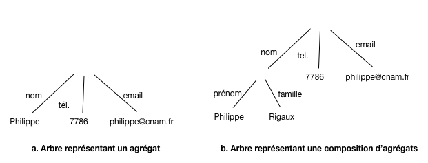
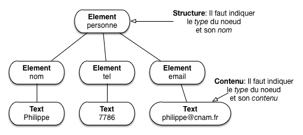
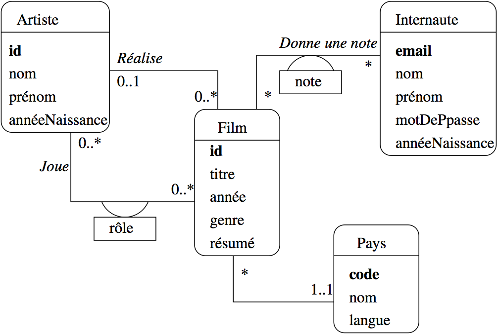
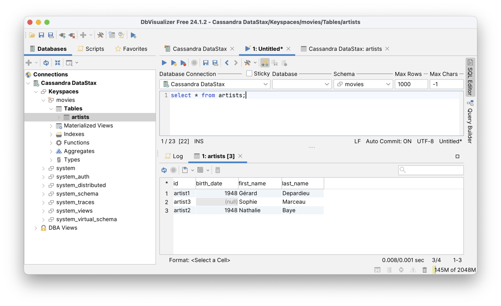
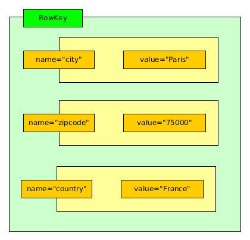
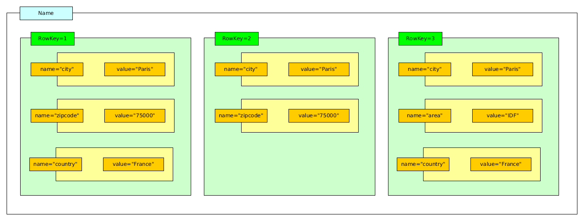

.. |nbsp| unicode:: 0xA0 
   :trim:

.. _chap-docstruct:
   
###########################
Modélisation de bases NoSQL
###########################

Ce chapitre est consacré à la notion de *document* qui est à la base
de la représentation des données dans l'ensemble du cours. Cette notion
est volontairement choisie assez générale pour couvrir la large palette
des situations rencontrées: une valeur atomique (un entier, une
chaîne de caractères) est un document; une paire clé-valeur est un document;
un tableau de valeurs est un document; un agrégat de paires clé-valeur
est un document; et de manière générale, toute composition des possibilités
précédentes (un tableau d'agrégats de paires clé-valeur par exemple) est
un document.

Nos documents sont caractérisés par l'existence d'une *structure*, et on
parlera donc de *documents structurés*. Cette structure peut aller du très simple
au très compliqué, ce qui permet de représenter de manière autonome des informations
arbitrairement complexes. 

Deux formats sont maintenant bien établis pour représenter les documents
structurés: XML et JSON. Le premier est très complet mais très lourd, le second
a juste les qualités inverses. Ces formats sont, entre autres, conçus pour
que le codage des documents soit adapté aux échanges dans un environnement distribué.
Un document en JSON ou XML peut être transféré par réseau entre deux machines sans
perte d'information et sans problème de codage/décodage. 

Il s'ensuit que les documents structurés sont à la base des systèmes distribués
visant à des traitements à très grande échelle, autrement dit le "NoSQL" pour faire 
bref. Plusieurs de ces systèmes utilisent directement XML et surtout JSON, mais le
modèle utilisé par d'autres est le plus souvent, à la syntaxe près, tout à 
fait équivalent. **Il est important d'être capable de comprendre le modèle
des documents structurés indépendamment d'un codage particulier**.
Ce chapitre se concentre sur le codage JSON. 
XML, beaucoup plus riche, est un peu trop complexe
pour les systèmes NoSQL. 

Il est donc tout à fait intéressant d'étudier la construction de documents structurés
comme base de la représentation des données. Une question très importante dans cette
perspective est celle de la modélisation préalable de collections de documents. Cette
modélisation est une étape essentielle dans la construction de bases relationnelles, 
et assez négligée pour les bases NoSQL où on semble parfois considérer qu'il suffit d'accumuler
des données sans se soucier de leur forme. Ce chapitre aborde donc la question, ne serait-ce
que pour vous sensibiliser: *construire une collection de documents comme une
décharge de données est une très mauvaise
idée et se paye très cher à terme*.

*****************************
S1: documents structurés
*****************************

.. admonition:: Supports complémentaires

      * `Diapositives: documents structurés et JSON <http://b3d.bdpedia.fr/files/sldocstruct.pdf>`_
      * `Vidéo sur les documents structurés <https://mediaserver.lecnam.net/permalink/v125f3595279a1n1ctla/>`_
      * `Vidéo sur le codage JSON <https://mediaserver.lecnam.net/permalink/v125f3595285182g35j3/>`_
  
Modèle des documents structurés
===============================

Le modèle des documents structurés repose sur quelques notions de base
que nous définissons précisément pour commencer.

.. admonition:: Définition (Valeur atomique)

     Une *valeur atomique* est une instance de l'un des types de base
     usuels: entiers, flottants, chaînes de caractères. 

Les types peuvent varier selon les systèmes mais la
caractéristique première d'une valeur atomique est d'être *non
décomposable* en sous-unités ayant un sens pour les applications qui
les manipulent. De ce point de vue, une date n'est pas atomique 
puisqu'on pourrait la décomposer en jour/mois/an, sous-unités
qui ont chacune un sens bien défini.

La signification d'une valeur est donnée par son association 
à un *identifiant*. Dans le modèle, les identifiants sont simplement
des chaînes de caractère. On obtient des *paires clé - valeur*.

.. admonition:: Définition (Paire clé - valeur)

     Une paire clé - valeur est une paire :math:`(i,v)` où 
     :math:`i`  est une clé et :math:`v` une valeur. 
 
Pour l'instant nous ne connaissons que les valeurs atomiques mais
la définition des paires clé-valeur s'étend aux valeurs structurées
que nous pouvons maintenant définir.

.. admonition:: Définition (Valeur structurée)

     La définition est récursive
     
       - Si :math:`v` est une valeur atomique, :math:`v` 
         est une valeur structurée.
       - Si :math:`v_1, \cdots, v_n` sont des valeurs structurées,
         alors la *liste* :math:`[v_1, \cdots, v_n]` est 
         une valeur structurée.
       - Si :math:`p_1, \cdots, p_n` sont des paires clé-valeur
         *dont les clés sont distinctes deux à deux*,
         alors le  *dictionnaire* (ou *objet*) 
         :math:`{p_1, \cdots, p_n}` est une valeur structurée.

Les listes (ou tableaux) et les dictionnaires (ou objets) sont
les structures qui, appliquées récursivement, permettent
de construire des valeurs structurées.

La définition des documents s'ensuit.

.. admonition:: Définition (Document)

     Tout dictionnaire est un document. 

Une *collection* est un ensemble de documents. On ajoutera souvent, pour
les documents appartenant à une collection, une contrainte *d'identification*:
chaque document doit contenir une paire clé-valeur dont la clé
est conventionnellement ``id``, et dont la valeur est unique au sein de la collection.
Cette valeur sert d'identifiant de recherche pour trouver rapidement un document dans une collection.

Ce modèle permet de représenter des informations plus ou moins complexes
en satisfaisant les besoins suivants:

  - *Flexibilité*: la structure s'adapte à des variations plus ou moins
    importantes; prenons un document représentant un livre ou une documentation technique:
    on peut avoir (ou non) des annexes, des notes de bas de pages, tout un ensemble
    d'éléments éditoriaux qu'il faut pouvoir assembler souplement. L'imbrication
    libre des listes et des dictionnaires le permet.

  - *Autonomie*: quand deux systèmes échangent un document, toutes les
    informations doivent être incluses dans la représentation; en particulier, 
    les données doivent être *auto-décrites*: le contenu vient avec sa propre description.
    C'est ce que permet la construction clé-valeur dans laquelle chaque valeur,
    atomique ou complexe, est qualifiée par par sa clé.
    

La construction récursive d'un document
structuré implique une représentation sous forme d'un
*arbre* dans lequel on représente à la fois le *contenu* (les valeurs) et la structure (les noms
des clés et l'imbrication des constructeurs élémentaires). La :numref:`label_on_edges1`
montre deux arbres correspondant à la représentation d'une personne. Les noms sont
sur les arêtes, les valeurs sur les feuilles.

.. _label_on_edges1:

   
        Représentation arborescente (arêtes étiquetées par les clés)

Cette représentation associe bien une *structure* (l'arbre) et le
*contenu* (le texte dans les feuilles). Une autre possibilité
est de représenter à la fois la structure et les valeurs 
comme des nœuds. C'est ce que fait XML (:numref:`simple_xml_tree`).

.. _simple_xml_tree:

   
        Représentation arborescente (clés représentées par des nœuds)

.. important:: les termes varient pour désigner  ce que nous appelons *document*; on 
   pourra parler *d'objet* (JSON), *d'élément* (XML), de *dictionnaire* (Python),
   de *tableau associatif* (PHP), de *hash map* (Java), etc. D'une
   manière générale ne vous laissez pas troubler par la terminologie variable, et
   ne lui accordez pas plus d'importance qu'elle n'en mérite.

Sérialisation des documents structurés
======================================

La *sérialisation* désigne la capacité à coder un document 
sous la forme d'une séquence d'octets qui peut "voyager" sans dégradation
sur le réseau, une propriété essentielle dans le cadre d'un système distribué.

Comme vu précédemment, les documents structurés sont des arbres dont chaque
partie est auto-décrite. On peut sérialiser un arbre de plusieurs manières, et plusieurs
choix sont possibles pour le codage des paires clé-valeur. Les principaux
codages sont JSON, XML, et YAML. Nous allons nous contenter du plus léger, JSON,
largement majoritaire dans les bases NoSQL. Mais pour bien comprendre qu'il
ne s'agit que d'une convention pour sérialiser un arbre, voici un brève
comparaison avec XML.

Commençons par la structure de base: les
*paires (clé, valeur)*. En voici un exemple, codé en JSON.

.. code-block:: javascript

    "nom": "philippe"
    
Et le même, codé en XML.

.. code-block:: xml

    <nom>philippe</nom>      

Voici
un second exemple JSON, montrant un document (qui, rappelons-le, est un dictionnaire).

.. code-block:: javascript

    {"nom": "Philippe Rigaux", "tél": 2157786,  "email": "philippe@cnam.fr"}

La représentation équivalente en XML est donnée ci-dessous.

.. code-block:: xml

    <personne>
      <nom>Philippe Rigaux</nom>
      <tel>2157786</tel>
      <email>philippe@cnam.fr</email>
    </personne>

On constate tout de suite que le codage XML est beaucoup plus bavard que celui de JSON.
XML présente de plus des attributs inclus dans les balises ouvrantes dont l'interprétation
est ambigue et qui viennent compliquer inutilement les choix de sérialisation. JSON est 
un choix clair et raisonnable.
    

   
Nous avons parlé de la nécessité de *composer* des structures comme condition
essentielle pour obtenir une puissance de représentation suffisante. 
Sur la base des paires (clé, valeur) et des agrégats vus ci-dessus, une
extension immédiate par composition consiste à considérer qu'un *dictionnaire est
une valeur*. On peut alors créer une paire clé-valeur dans laquelle la valeur
est un dictionnaire, et  imbriquer les dictionnaires les uns dans les autres,
comme le montre l'exemple ci-dessous.

.. code-block:: javascript

    {
     "nom": {
             "prénom": "Philippe", 
             "famille": "Rigaux"
            },
     "tél": 2157786,
     "email": "philippe@cnam.fr"
    }

Une *liste* est une
valeur constituée d'une séquence de valeurs. Les listes sont sérialisées 
en JSON (où on les appelle *tableaux*) avec des crochets ouvrant/fermant.
  
.. code-block:: javascript

    [2157786, 2498762]

Une liste est une valeur (cf. les définitions précédentes), et on peut donc l'associer à une clé dans un document.
Cela donne la forme sérialisée suivante:

.. code-block:: javascript

    {nom: "Philippe", "téls": [2157786, 2498762] }

XML en revanche ne connaît pas explicitement la notion de tableau. Tout est
uniformément représenté par balisage. Ici on peut introduire une balise ``tels``
englobant les items de la liste.
 
.. code-block:: xml
   
    <personne>
      <nom>philippe</nom>
      <tels>
        <tel>2157786</tel>
        <tel>2498762</tel>
      </tels>
    </personne>

Un des inconvénients de XML est qu'il existe plusieurs manières de représenter les mêmes données,
ce qui donne lieu à des réflexions et débats inutiles. Un langage comme JSON propose
un ensemble minimal et suffisant de structures, représentées avec concision. La puissance
de XML ne vient pas de sa syntaxe mais de la richesse des normes et outils associés.

Enfin, la sérialisation (JSON ou XML) est conçu pour permettre des  transferts sur le réseau
sqns détérioration du contenu, ce qui est évidemment essentiel dans le contexte d'un
système distribué où les données sont sans cesse échangées.

Abrégé de la syntaxe JSON
=========================

Résumons maintenant la syntaxe de JSON  qui remplace, il faut bien le dire, tout à fait
avantageusement XML dans la plupart des cas à l'exception sans doute de documents "rédigés"
contenant beaucoup de texte: rapports, livres, documentation, etc. JSON est 
concis, simple dans sa définition, et très facile à associer à un langage
de programmation (les structures d'un document JSON se transposent directement en structures
du langage de programmation, valeurs, listes et objets).

.. note:: JSON est l'acronyme de *JavaScript Object Notation*. Comme cette expression
   le suggère, il a été initialement créé pour la sérialisation et l'échange
   d'objets Javascript entre deux applications. Le scénario le plus courant est 
   sans doute celui des applications Ajax dans lesquelles le serveur (Web) et le
   client (navigateur) échangent des informations codées en JSON. Cela dit, JSON
   est un  format texte indépendant du langage de programmation utilisé pour le manipuler, et se trouve maintenant
   utilisé dans des contextes très éloignés des applications Web.

C'est le format de données principal que nous aurons à manipuler. Il est utilisé comme modèle
de données natif dans des systèmes NoSQL comme MongoDB, CouchDB, CouchBase, RethinkDB, et comme format d'échange
sur le Web par d'innombrables applications, notamment celles basées sur l'architecture REST que nous
verrons bientôt.

La syntaxe est très simple et a déjà été en grande partie introduite précédemment. Elle
est présentée ci-dessous, mais vous pouvez aussi vous référer à des sites comme http://www.json.org/.

La structure de base est la paire (clé, valeur) (*key-value pair*).

.. code-block:: javascript

    "title": "The Social network"

Les valeurs atomiques sont:

  - les chaînes de caractères (entourées par les classiques apostrophes doubles anglais (droits)), 
  - les nombres (entiers, flottants) 
  - les valeurs booléennes (``true`` ou ``false``).

Voici une paire (clé, valeur) où la valeur est un entier (NB: pas d'apostrophes).

.. code-block:: javascript

    "year": 2010

Et une autre avec un Booléen (toujours pas d'apostrophes).
    
.. code-block:: javascript

    "oscar": false
    

Les valeurs complexes sont soit des dictionnaires (qu'on appelle plutôt objets en JSON) soit des listes (séquences
de valeurs).  Un *objet* est un ensemble de paires clé-valeur dans lequel chaque clé ne peut apparaître 
qu'une fois au plus.

.. code-block:: javascript

    {"last_name": "Fincher", "first_name": "David", "oscar": true}

Un objet est une *valeur* complexe et peut être utilisé comme valeur  dans une paire clé-valeur
avec la syntaxe suivante.

.. code-block:: javascript

    "director": { 
      "last_name": "Fincher",
      "first_name": "David", 
      "birth_date": 1962,
      "oscar": true
    }
    
Une *liste* (*array*) est une séquence de valeurs dont les types peuvent varier: Javascript
est un langage non typé et les tableaux peuvent contenir des éléments hétérogènes, même
si ce n'est sans doute pas recommandé. Une liste est
une valeur complexe, utilisable dans une paire clé-valeur.

.. code-block:: javascript

    "actors": ["Eisenberg", "Mara", "Garfield", "Timberlake"]

La liste suivante est valide, bien que contenant des valeurs hétérogènes.

.. code-block:: javascript

    "bricabrac": ["Eisenberg", 1948, {"prenom", "Philippe", "nom": "Rigaux"}, true, [1, 2, 3]]

Ici, on peut commencer à réfléchir: imaginez que vous écriviez une application qui doit
traiter un document come celui ci-dessus. Vous savez que ``bricabrac`` est
une liste (du moins vous le supposez),
mais vous ne savez pas du tout à priori quelles valeurs elle contient. Pendant le 
parcours de la liste, vous allez donc devoir multiplier les tests
pour savoir si vous avez affaire à un entier, à une chaîne de caractères, ou même
à une valeur complexe, liste, ou objet. Bref, vous devez, *dans votre application*,
effectuer le "nettoyage" et les contrôles qui n'ont pas été faits au moment
de la constitution du document. Ce point est un aspect très négatif de 
la production incontrolée de documents (faiblement) structurés, et de l'absence de 
contraintes (et de schéma) qui est l'une des caractéristiques (négatives) commune aux
système NoSQL. Il est développé
dans la prochaine section.

L'imbrication est sans limite: on peut avoir
des  tableaux de tableaux, des tableaux d'objets contenant eux-mêmes des tableaux, etc. Pour représenter
un *document* avec JSON, nous adopterons simplement la contrainte que le constructeur de plus haut
niveau soit un objet (encore une fois, en JSON,  *document* et *objet* sont synonymes).

.. code-block:: javascript

    {
      "title": "The Social network", 
      "summary": "On a fall night in 2003, Harvard undergrad and \n
         programming genius Mark Zuckerberg sits down at his \n 
         computer and heatedly begins working on a new idea. (...)",
      "year": 2010, 
      "director": {"last_name": "Fincher",
                    "first_name": "David"},
      "actors": [ 
        {"first_name": "Jesse", "last_name": "Eisenberg"}, 
        {"first_name": "Rooney", "last_name": "Mara"}
      ]
    }

Quiz
====

.. eqt:: docstructA-1

    Voici un document structuré sérialisé en JSON
    
    .. code-block:: json
    
        {"A": 1, "A": 1, "A": 1}

    Ce document est-il conforme à la définition donnée? 
    
    A) :eqt:`I`  Oui
    #) :eqt:`C`  Non car il contient des clés identiques
    #) :eqt:`I` Non car il contient des valeurs identiques

.. eqt:: docstructA-2

    Voici une valeur complexe sérialisée en JSON
    
    .. code-block:: json
    
        ["A": 1, "B": 2, "C": 3]

    Est-elle conforme à la définition donnée? 
    
    A) :eqt:`I`  Oui, c'est une liste de paire clés-valeurs
    #) :eqt:`C`  Non, car une liste doit être constituée de valeurs
    #) :eqt:`I` Non car les valeurs doivent être encadrées par des apostrophes doubles

.. eqt:: docstructA-3

    Encore une valeur complexe sérialisée en JSON
    
    .. code-block:: json
    
        [1, {"X": "zsz", "Y": "123"}, [98, 89, 67]]

    Est-elle conforme à la définition donnée? 
    
    A) :eqt:`C`  Oui, c'est une liste
    #) :eqt:`I`  Non, car une liste doit être constituée de valeurs de même type
    #) :eqt:`I` Non car le dictionnaire en seconde position devrait être associé à un identifiant

.. eqt:: docstructA-4

    Voici deux sérialisations en JSON
    
    .. code-block:: json
    
        {"A": 1, "B": {"X": "zsz", "Y": "123"}, "C": [98, 89, 67]}

    .. code-block:: json
    
        {"B": {"X": "zsz", "Y": "123"}, "A": 1, "C": [98, 89, 67]}

    Représentent-ils le *même* document ?
    
    A) :eqt:`I`  Non, ils sont clairement différents
    #) :eqt:`C`  Oui, seul l'ordre change et la notion d'ordre ne fait pas partie de nos définitions
    #) :eqt:`I` Non, les clés doivent apparaître en ordre alphabétique.

.. eqt:: docstructA-5

    Quelle est la profondeur maximale d'un arbre représentant un document structuré ?
    
    A) :eqt:`I`  Trois, puisqu'on peut imbriquer succesivement une paire clé-valeur, un dictionnaire et une liste
    #) :eqt:`C`  Il n'y a pas de profondeur maximale
    #) :eqt:`I` Elle est définie par la taille de la mémoire RAM

.. eqt:: docstructA-6

    Encore une valeur structurée sérialisée en JSON
    
    .. code-block:: json
    
      [ 
           {"first_name": "Jesse", "last_name": "Eisenberg"}, 
            {"prénom": 2, "last_name": true},
            {"prénom": "Jesse", "nom": "Eisenberg"}
      ]

    Est-elle conforme à la définition donnée? 
    
    A) :eqt:`I`  Non, car les clés des dictionnaires changent pour chaque élément
    #) :eqt:`I`  Non, car on trouve deux fois la clé ``last_name`` avec des types différents
    #) :eqt:`C` Oui, c'est une liste de dictionnaires
    #) :eqt:`I`  Non, car on trouve deux fois Jesse Eisenberg avec un codage différent

Mise en pratique (optionnel)
============================

Voici quelques propositions d'explorations pratiques des environnements de  documents JSON. 

.. _MEP-S1-1:
.. admonition:: MEP `MEP-S1-1`_: validation d'un document JSON

   Comment savoir qu'un document JSON est bien formé (c'est-à-dire syntaxiquement correct)?  Il
   existe des validateurs en ligne, bien utiles pour détecter les fautes.

   Essayez par exemple  http://jsonlint.com/:  copiez-collez les documents JSON donnés 
   précédemment dans le validateur et vérifiez qu'ils sont correct (ou pas...). 
   
   Savez-vous quel est le jeu de caractères utilisé pour JSON? Cherchez sur le Web. Savez-vous
   comment on peut représenter de longues chaînes de caractères (comme le résumé du film)? Cherchez
   (aide: regardez en particulier comment gérer les sauts de ligne).
   
   Le document suivant contient (beaucoup) d'erreurs, à vous de les corriger. Cherchez-les visuellement,
   puis aidez-vous du validateur.

   .. code-block:: text

      {
        "title": "Taxi driver",
        "year": 1976,
        "genre": "drama",
        "summary": 'Vétéran de la Guerre du Vietnam, Travis Bickle est chauffeur de 
               taxi dans la ville de New York. La violence quotidienne l'affecte peu à peu.',
        "country": "USA",
       "director":     {
         "last_name": "Scorcese",
         first_name: "Martin",
         "birth_date": "1962"    
        },
       "actors": [
         {
         first_name: "Jodie",
         "last_name": "Foster",
         "birth_date": null,
         "role": "1962"  
         }
         {
         first_name: "Robert",
         "last_name": "De Niro",
         "birth_date": "1943",
         "role": "Travis Bickle ",
         }
      }

    Au-delà des documents *bien formés*, on peut aussi contrôler qu'un document est *valide*
    par rapport à une spécification (un schéma).  Voir les exercices sur les schémas JSON ci-dessous.
    
.. _MEP-S1-2:
.. admonition:: MEP `MEP-S1-2`_: récupérer des jeux de donnéest

   Nous allons récupérer aux formats JSON le contenu d'une base de données
   relationnelle pour disposer de documents à structure forte. Pour cela, rendez-vous
   sur le site http://deptfod.cnam.fr/bd/tp/datasets/. Sur ce site vous trouverez
   des fichiers en différents formats qui nous utiliserons dans d'autres mises en pratique. 

.. _MEP-S1-3:
.. admonition:: MEP `MEP-S1-3`_: JSON et l'Open Data

  L'Open Data désigne le mouvement de mise à disposition des données afin de favoriser
  leur diffusion et la construction d'applications. Les données sont fournies au format JSON ! Regardez les sites suivants,
  récupérez quelques documents, commencez à imaginer quel applications vous pourriez construire.

    - https://www.data.gouv.fr/fr/.
    - http://data.iledefrance.fr/page/accueil/
    - http://data.enseignementsup-recherche.gouv.fr/

.. _MEP-S1-4:
.. admonition:: MEP `MEP-S1-4`_: produire un jeu de documents JSON volumineux
 
   Pour tester des systèmes avec un jeu de données de taille paramétrable,
   nous pouvons utiliser des générateurs de données. Voici quelqes
   possibilités qu'il vous est suggéré d'explorer.
   
    - le site http://generatedata.com/ est très paramétrable mais ne permet
      malheureusement pas (aux dernières nouvelles) d'engendrer des
      documents imbriqués; à étudier quand même pour produire des tableaux
      volumineux;
    - https://github.com/10gen-labs/ipsum est un générateur de documents JSON
      spécifiquement conçu pour fournir des jeux de test à MongoDB, un système
      NoSQL que nous allons étudier. Une version adaptée à python3 de cet outil
      est disponible sur notre site http://b3d.bdpedia.fr/files/ipsum-master.zip
      
   Ipsum produit des documents JSON conformes à un schéma (http://json-schema.org).
   Un script Python (vous devez avoir un interpréteur Python installé sur votre
   machine) prend ce schéma en entrée et produit un nombre paramétrable
   de documents. Voici un exemple d'utilisation.
   
   .. code-block:: bash
   
     python ./pygenipsum.py --count 1000000 schema.jsch > bd.json  
   
   Lisez le fichier ``README`` pour en savoir plus. Vous êtes invités à vous
   inspirer des documents JSON représentant nos films pour créer
   un schéma et engendrer une base de films avec quelques millions 
   de documents. Pour notre base ``movies``, vous pouvez récupérer le
   `schéma JSON des documents <http://b3d.bdpedia.fr/files/movies.jsch>`_.
   (Suggestion: allez jeter un œil à http://www.jsonschema.net/).
   
   .. ifconfig:: docstruct in ('public')
     
      .. code-block:: javascript
      
       {
	   "type":"object",
	   "$schema": "http://json-schema.org/draft-03/schema",
	   "properties":{
		"_id": {"type":"string", "ipsum": "id"},
		"actors": {
			"type":"array",
			"items":
				{
					"type":"object",
					"required":false,
					 "minItems": 2,
	                 "maxItems": 6,
					"properties":{
						"_id": {"type":"string", "ipsum": "id"},
						"birth_date": {"type":"string", "format": "date"},
						"first_name": {"type":"string", "ipsum": "fname"},
						"last_name": {"type":"string", "ipsum": "fname"},
						"role": {"type":"string"}
					}
				}
		},
		"genre": {"type":"string",  
		         "enum": [ "Drame", "Comédie", "Action", "Guerre", "Science-Fiction"]},
		"summary": {"type":"string", "required":false},
		"title": {"type":"string"},
		"year": {"type":"integer"},
		"country": {"type":"string",  "enum": [ "USA", "FR", "IT"]},
		"director": {
			"type":"object",
			"properties":{
				"_id":{"type":"string"},
				"birth_date": {"type":"string"},
				"first_name":  {"type":"string", "ipsum": "fname"},
				"last_name":{"type":"string", "ipsum": "fname"}
			}
		}
	   }
	  }
	  

********************************
S2. Modélisation des collections
********************************

.. admonition:: Supports complémentaires

      * `Diapositives: modélisation de bases documentaires <http://b3d.bdpedia.fr/files/slmodelisation.pdf>`_
      * `Vidéo sur la modélisation relationnelle <https://mediaserver.lecnam.net/permalink/v125f359528d6fhie2on/>`_
      * `Vidéo sur la modélisation basée sur les documents structurés <https://mediaserver.lecnam.net/permalink/v125f3595297febdcm2m/>`_

Nous abordons maintenant une question très importante dans le
cadre de la mise en œuvre d'une grande base de données constituée de
documents: comment *modéliser* ces documents pour satisfaire les besoins
de l'application? Et plus précisément:

 - quelle est la structure de ces documents?
 - quelles sont les contraintes qui portent sur le contenu des documents?
 
Cette question est bien connue dans le contexte des bases de données relationnelles,
et nous allons commencer par rappeler la méthode bien établie. Pour les bases NoSQL, il
n'existe pas de méthodologie équivalente. Une bonne (ou mauvaise) raison
est d'ailleurs qu'il n'existe pas de modèle normalisé, et que la modélisation doit
s'adapter aux caractéristiques de chaque système.

.. note:: Certains semblent considérer que la question ne se pose pas et qu'on peut entasser 
   les données dans la base, n'importe comment, et voir plus tard ce que l'on peut en faire.
   C'est un(e absence de) choix porteur de redoutables conséquences pour la suite. La dernière
   partie de cette section donne mon avis à ce sujet.

Je vais donc extrapoler la méthodologie de conception
relationnelle pour étudier ce que l'on peut obtenir avec un modèle 
de documents structurés. 

Conception d'une base relationnelle
===================================

.. note:: Cette partie reprend de manière abrégée le contenu du chapitre "Conception d'une
   base de données" dans le support de cours `Bases de données relationnelles <http://sql.bdpedia.fr>`_.
   La lecture complète de ce chapitre est conseillée pour aller plus loin.
   
Voyons comment on pourrait modéliser notre base de films avec leurs réalisateurs et 
leurs acteurs.  La démarche consiste à:

  * déterminer les "entités" (film, réalisateurs, acteurs) pertinentes pour l'application; 
  * définir une méthode *d'identification* de chaque entité;  en pratique on recourt à 
    la définition d'un *identifiant* artificiel (il n'a aucun rôle descriptif)
    qui permet d'une part de s'assurer qu'une même "entité"
    est représentée une seule fois, d'autre part de référencer
    une entité par son identifiant.
  * préserver le lien entre les entités.

Voici une illustration informelle de la méthode, dans le contexte d'une base
relationnelle où l'on suit une démarche fondée sur 
des règles de *normalisation*. Nous reprendrons ensuite une approche plus générale
basée sur la notation Entité/association.

Commençons par les deux premières étapes. On va d'abord
distinguer deux types d'entités: les films et les réalisateurs. On
en déduit deux tables, celle des films et celle des réalisateurs. 

.. note:: Comment distingue-t-on des entités et modélise-t-on correctement un domaine? 
   Il n'y a pas de méthode magique:  c'est du métier, de l'expérience, de la pratique, des
   erreurs, ... 

Ensuite,
on va ajouter à chaque table  un attribut spécial, l'identifiant, désigné par ``id``,
dont la valeur est simplement un compteur auto-incrémenté. 
On obtient le résultat suivant.

.. csv-table:: 
   :header:  "id",  "titre", "année"
   :widths: 4, 10, 6
            
   1, Alien, 1979
   2, Vertigo , 1958
   3, Psychose, 1960
   4, Kagemusha, 1980   
   5, Volte-face, 1997
   6, Pulp Fiction, 1995 
   7, Titanic, 1997
   8, Sacrifice, 1986

La table des films.

.. csv-table:: 
       :header:  "id",  "nom", "prénom", "année"
       :widths: 4, 10, 10, 6
            
       101, Scott, Ridley, 1943  
       102, Hitchcock, Alfred, 1899
       103, Kurosawa, Akira, 1910
       104, Woo, John, 1946
       105, Tarantino, Quentin, 1963 
       106, Cameron, James, 1954
       107, Tarkovski, Andrei,1932\

La table des réalisateurs

Un souci constant dans ce type de modélisation est d'éviter toute redondance. Chaque
film, et chaque information relative à un film, ne doit être représentée qu'une fois. 
La redondance dans une base de données est susceptible de soulever de gros problèmes, 
et notamment des *incohérences* (on met à jour une des versions et pas les autres, et 
on se sait plus laquelle est correcte).

.. note: La valeur d'un identifiant est locale  à une table. On ne peut pas trouver
   deux fois la même valeur d'identifiant dans une même table, mais rien n'interdit
   qu'elle soit présente dans deux tables différentes. On aurait
   donc pu "numéroter" les réalisateurs 1, 2, 3, ..., comme pour les films.
   Ici, nous leur avons donné des identifiants 101, 102, ..., pour clarifier les explications.
   
Il reste à représenter le lien entre les films et les metteurs
en scène, sans introduire de redondance. Maintenant que nous avons
défini les identifiants, il existe un moyen simple pour indiquer
quel metteur en scène  a réalisé un film :
associer l'identifiant du metteur en scène au film. L'identifiant sert
alors de *référence* à l'entité. On ajoute un
attribut ``idRéalisateur`` dans la table *Film*, et on obtient la
représentation suivante.

.. csv-table:: 
   :header:  "id",  "titre", "année", "idRéalisateur"
   :widths: 4, 10, 6, 4
            
   1, Alien, 1979, 101
   2, Vertigo , 1958, 102
   3, Psychose, 1960, 102
   4, Kagemusha, 1980, 103   
   5, Volte-face, 1997, 104
   6, Pulp Fiction, 1995, 105 
   7, Titanic, 1997, 106
   8, Sacrifice, 1986, 107
   

Cette représentation est correcte. La redondance est réduite au
minimum puisque seule l'identifiant du metteur en scène a
été déplacé dans une autre table. Pour peu que l'on s'assure que cet
identifiant ne change *jamais*, cette redondance n'induit aucun effet négatif.

Cette représentation normalisée évite des inconvénients qu'il est bon d'avoir en tête:

   - *pas de redondance*, donc toute mise à jour affecte l'unique représentation, sans
     risque d'introduction d'incohérences;
   - *pas de dépendance forte induisant des anomalies de mise à jour*: on peut par exemple détruire
     un film sans affecter les informations sur le réalisateur, ce qui ne serait pas le cas s'ils 
     étaient associés dans la même table (ou dans un même document: voir plus loin).

Ce gain dans la qualité du schéma n'a pas pour contrepartie une perte d'information. Il est en 
effet facile de voir qu'elle peut être reconstituée
intégralement. En prenant un film, on obtient
l'identifiant de son metteur en scène, et cet identifiant
permet de trouver *l'unique* ligne dans la table des réalisateurs qui contient toutes
les informations sur ce  metteur en scène. Ce processus de reconstruction de l'information,
dispersée dans plusieurs tables, peut s'exprimer avec les opérations
relationnelles, et notamment la *jointure*. 

Il reste à appliquer une méthode systématique
visant à aboutir au résultat ci-dessus, et ce même dans des cas beaucoup
plus complexes. Celle universellement adoptée (avec des variantes) s'appuie
sur les notions *d'entité* et *d'association*. En voici une présentation très résumée.

La méthode permet de distinguer les *entités* qui
constituent la base de données, et les *associations* entre ces
entités. 
Un  schéma E/A décrit l'application visée,
c'est-à-dire une *abstraction* d'un domaine d'étude,
pertinente relativement aux objectifs visés. Rappelons
qu'une abstraction consiste à choisir  certains aspects de la réalité perçue
(et donc à éliminer les autres). Cette sélection se fait en fonction de certains *besoins*, qui 
doivent être précisément définis, et  rélève d'une démarche d'analyse qui n'est pas abordée
ici. 

.. _ea-films:

   Le schéma E/A des films
   
Par exemple, pour notre base de données *Films*, on n'a pas besoin de stocker dans la base de données
l'intégralité des informations relatives
à un internaute, ou à un film. Seules comptent celles
qui sont importantes pour l'application. Voici le schéma décrivant cette base de 
données *Films* (:numref:`ea-films`). On distingue

  * des *entités*, représentées par des rectangles, ici *Film*, *Artiste*,
    *Internaute* et *Pays* ;
  * des *associations* entre entités
    représentées par des liens entre ces rectangles.
    Ici on a représenté par exemple le fait qu'un artiste *joue* dans des
    films, qu'un internaute *note* des films, etc.

Chaque entité est caractérisée par un ensemble
d'attributs, parmi lesquels un ou plusieurs forment
l'identifiant unique (en gras). Nous l'avons appelé **id** pour *Film*
et *Artiste*, **code** pour le pays. Le nom de l'attribut-identifiant est
peu important, même si la convention **id** est très répandue.

Les associations sont caractérisées par des *cardinalités*.  La notation  0..*   sur le lien
*Réalise*, du côté de l'entité *Film*, signifie qu'un artiste peut réaliser plusieurs films, ou aucun.  La notation
0..1   du côté *Artiste* signifie en revanche qu'un film ne peut être
réalisé que par au plus un artiste.  En revanche dans l'association
*Donne une note*, un internaute peut noter plusieurs
films, et un film peut être noté par plusieurs internautes,
ce qui justifie l'a présence de  0..*  aux deux extrêmités
de l'association.

Outre les propriétés déjà évoquées (simplicité, clarté de lecture),
évidentes sur ce schéma, on peut noter aussi que la modélisation
conceptuelle est totalement indépendante de tout choix
d'implantation. Le schéma de la  :numref:`ea-films` ne spécifie aucun
système en particulier. Il n'est pas non plus question de type ou de
structure de données, d'algorithme, de langage, etc. En principe, il
s'agit donc de la partie la plus stable d'une application. Le fait de
se débarrasser à ce stade de la plupart des considérations techniques
permet de se concentrer sur l'essentiel : que veut-on stocker dans la
base ?

Schémas relationnels
--------------------

La transposition  d'une modélisation entité/association s'effectue
sous la forme d'un *schéma relationnel*. Un tel schéma énonce la
structure et les contraintes portant sur les données. À partir de 
la modélisation précédente, par exemple, on obtient 
les tables *Film*, *Artiste* et *Role* suivantes:

.. code-block:: sql

    create table Artiste  (idArtiste integer not null,
                           nom varchar (30) not null,
                           prenom varchar (30) not null,
                           anneeNaiss integer,
                           primary key (idArtiste),
                           unique (nom, prenom))
                           
     create table Film  (idFilm integer not null, 
                        titre    varchar (50) not null,
                        annee    integer not null,
                        idRealisateur    integer not null,
                        genre varchar (20) not null,
                        resume      varchar(255),
                        codePays    varchar (4),
                        primary key (idFilm),
                        foreign key (idRealisateur) references Artiste);
                        
     create table Role (idFilm  integer not null,
                       idActeur Iinteger not null,
                       nomRole  varchar(30), 
                       primary key (idActeur,idFilm),
                       foreign key (idFilm) references Film,
                       foreign key (idActeur) references Artiste);
                        

.. note: je laisse de côté *Internaute* et *Notation*, et je vous
   renvoie à http://sql.bdpedia.fr/relationnel.html pour les règles
   de passage d'un schéma entité/association à un schéma relationnel.

Le schéma impose des contraintes sur le contenu de la base. On a par 
exemple spécifié qu'on ne doit pas trouver deux artistes avec la même paire 
de valeurs (prénom, nom). La contrainte ``not null`` indique qu'une valeur doit
toujours être présente. Une contrainte très importante est la contrainte
d'intégrité référentielle (``foreign key``): elle garantit par exemple
que la valeur de ``idRéalisateur`` correspond bien à une clé primaire
de la table ``Artiste``. En d'autres termes: un film fait référence,
grâce à ``idRéalisateur``, à un artiste qui est représenté dans la base.
*Le système garantit que ces contraintes sont respectées*. 

Voici un exemple de contenu pour la table *Artiste*.

 .. list-table:: Table des artistes
   :header-rows: 1

   * - id
     - nom
     - prénom
   * - 11
     - Travolta
     - John
   * - 27
     - Willis
     - Bruce
   * - 37
     - Tarantino
     - Quentin
   * - 167
     - De Niro
     - Robert
   * - 168
     - Grier
     - Pam

On peut remarquer que le schéma et la base sont représentés séparément, contrairement
aux documents structurés où chaque valeur est associée à une clé qui indique sa signification.
Ici, le placement d'une valeur dans un colonne spécifique suffit.

Voici un exemple pour la table des films, illustrant la notion de clé étrangère.

 .. list-table:: Table des films
   :header-rows: 1

   * - id
     - titre
     - année
     - idRéal
   * - 17
     - Pulp Fiction
     - 1994
     - 37
   * - 57
     - Jackie Brown
     - 1997
     - 37

Une valeur de la colonne ``idReal``, une clé étrangère, est *impérativement* 
la valeur d'une clé primaire existante dans la table *Artiste*. Cette contrainte forte
est vérifiée par le système relationnel et garantit que la base est saine. Il est impossible
de faire référence à un metteur en scène qui n'existe pas. 

Dans une base relationnelle (bien conçue) les données sont cohérentes et cela apporte
une garantie forte aux applications qui les manipulent: pas besoin de vérifier par
exemple, quand on lit le film 17,  que l'artiste avec l'identifiant 37 existe bien: c'est
garanti par le schéma.

En contrepartie, la distribution des données dans plusieurs tables
rend le contenu de chacune incomplet. Le système de référencement par clé étrangère 
en particulier ne donne aucune indication directe sur l'entité
référencée, d'où des tables au contenu succinct et non interprétable. Voici la table *Role*.

 .. list-table:: Table des rôles
   :header-rows: 1

   * - idFilm
     - idArtiste
     - rôle
   * - 17
     - 11
     - Vincent Vega
   * - 17
     - 27
     - Butch Coolidge
   * - 17
     - 37
     - Jimmy Dimmick

En la regardant, on ne sait pas grand chose: il faut aller voir par exemple, pour le premier
rôle, que le film 17 est `Pulp Fiction`, et l'artiste 11, John Travolta. En d'autres termes,
il faut effectuer une opération rapprochant des données réparties dans plusieurs tables. Un système
relationnel nous fournit cette opération: c'est la *jointure*. Voici comment on reconstituerait
l'information sur le rôle "Vincent Vega" en SQL.

    .. code-block:: sql

       select titre, nom, prénom, role
       from Film, Artiste, Role
       where role='Vincent Vega'
       and Film.id = Role.idFilm
       and Artiste.id = Role.idActeur

La représentation des informations relatives à une  même "entité" (un film) dans plusieurs tables
a une autre conséquence qui motive (parfois) le recours
à une représentation par document structuré. Il faut de fait
effectuer *plusieurs écritures* pour une même entité, et 
donc appliquer une *transaction* pour garantir la cohérence des mises à jour. 
On peut considérer que ces précautions et contrôles divers pénalisent les performances
(pour des raisons claires: assurer la cohérence de la base).

.. note:: Pour la notion de transaction, reportez-vous au chapitre introductif de 
   http://sys.bdpedia.fr.

Ce qu'il faut retenir
---------------------

En résumé, les caractéristiques d'une modélisation relationnelle sont

 - Un objectif de *normalisation* qui vise à éviter à la fois toute redondance
   et toute perte d'information;
   
    #. la redondance est évitée en découpant les données avec une granularité fine,
       et en les stockant indépendamment les unes des autres;
    #. la perte d'information est évitée en utilisant un système de référencement
       basé sur les clés primaires et clés étrangères.
       
 - Les données sont contraintes par un *schéma* qui impose des règles sur le contenu de la base
 - Il n'y a aucune hiérarchie dans la représentation des entités; une entité comme *Pays*, qui
   peut être considérée comme secondaire, a droit à sa table dédiée, tout comme l'entité *Film*
   qui peut être considérée comme essentielle; *on ne pré-suppose pas en relationnel, l'importance
   respective des entités représentées*;
 - La distribution des données dans plusieurs tables est compensée par la capacité
   de SQL à effectuer des *jointures* qui exploitent le plus souvent le système
   de référencement (clé primaire, clé étrangère) pour associer des lignes stockées
   séparément.
 - Plusieurs écritures transactionnelles peuvent être nécessaires pour créer
   une seule entité.

Ce modèle est cohérent. Il fonctionne très bien, depuis très longtemps, au moins
pour des données fortement structurées comme celles que nous étudions ici. Il permet
de construire des bases pérennes, conçues en grand partie indépendamment des besoins
ponctuels d'une application, représentant un domaine d'une manière suffisament générique
pour satisfaire tous les types d'accès, mêmes s'ils n'étaient pas envisagés au départ.

Voyons maintenant ce qu'il en  est avec un modèle de document structuré.

Conception NoSQL avec documents structurés
==========================================

En relationnel, on a des lignes (des nuplets pour être précis)
et des tables (des relations). Dans le contexte du NoSQL, on
va parler de *documents* et de *collections* (de documents).

Documents et collections
------------------------

Notons pour commencer que la représentation arborescente est très puissante, 
plus puissante que la représentation offerte par la structure tabulaire du relationnel. Dans un nuplet relationnel,
on ne trouve que des valeurs dites atomiques, non décomposables. Il 
ne peut y avoir qu'un seul genre pour un film. Si ce n'est pas le cas, il
faut (processus de normalisation) créer une table des genres et la lier
à la table des films (je vous laisse trouver le schéma correspondant, à titre
d'exercice). Cette nécessité de distribuer les données dans plusieurs
tables est une lourdeur souvent reprochée à la modélisation relationnelle.

Avec un document structuré, il est très facile de représenter les genres
comme un tableau de valeurs, ce qui rompt la première règle de normalisation.

.. code-block:: javascript

    {
      "title": "Pulp fiction",
      "year": "1994",
      "genre": ["Action", "Policier", "Comédie"]
      "country": "USA"
    }

Par ailleurs, il est également facile de représenter une table par une collection de documents structurés. Voici
la table des artistes en  notation JSON.

.. code-block:: javascript

     [
      artiste:  {"id": 11, "nom": "Travolta", "prenom": "John"},
      artiste:  {"id": 27, "nom": "Willis", "prenom": "Bruce"},
      artiste:  {"id": 37, "nom": "Tarantino", "prenom": "Quentin"},
      artiste:  {"id": 167, "nom": "De Niro", "prenom": "Robert"},
      artiste:  {"id": 168, "nom": "Grier", "prenom": "Pam"} 
    ] 

On pourrait donc "encoder" une base relationnelle sous la forme de documents structurés,
et chaque document pourrait être plus complexe structurellement qu'une ligne dans
une table relationnelle.

D'un autre côté, une telle représentation, pour des données *régulières*, n'est pas du tout efficace
à cause de la redondance de l'auto-description: à chaque fois on répète le nom
des clés, alors qu'on pourrait les factoriser sous forme de schéma et les
représenter indépendamment (ce que fait un système relationnel, voir ci-dessus). 

L'auto-description n'est valable qu'en cas de variation dans la structure, ou éventuellement pour
coder l'information de manière autonome en vue d'un échange.
Une représentation arborescente XML / JSON est donc
plus appropriée pour des données de structure *complexe* et surtout *flexible*.

Le pouvoir de l'imbrication des structures
------------------------------------------

Dans une modélisation relationnelle, nous avons dû séparer les films et les
artistes dans deux tables distinctes, et lier chaque film à son metteur en scène
par une clé étrangère.  Grâce à l'imbrication des structures, il est possible avec
un document structuré de représenter l'information de la manière suivante:

.. code-block:: javascript

    {
      "title": "Pulp fiction",
      "year": "1994",
      "genre": "Action",
      "country": "USA",
      "director": {
        "last_name": "Tarantino",
        "first_name": "Quentin",
        "birth_date": "1963"    
      }
    }
   
On  a *imbriqué* un objet dans un autre, ce qui ouvre la voie
à la représentation d'une entité par un unique document complet.

.. important:: Notez que nous n'avons plus besoin du système de référencement
   par clés primaires / clés étrangères, remplacé par l'imbrication qui
   associe *physiquement* les entités *film* et *artiste*.
   
Prenons l'exemple du film "Pulp Fiction" et son metteur en scène et
ses acteurs. En relationnel, pour 
reconstituer l'ensemble du film "Pulp Fiction", il faut suivre les références
entre clés primaires et clés étrangères. C'est ce qui permet
de voir que Tarantino (clé = 37) est réalisateur de Pulp Fiction
(clé étrangère ``idRéal`` dans la table Film, avec la valeur 37) et joue également un rôle (clé
étrangère ``idArtiste`` dans la table Rôle).

Tout peut être représenté par un unique document structuré, en tirant parti de
l'imbrication d'objets dans des tableaux.

.. code-block:: javascript

    {
      "title": "Pulp fiction",
      "year": "1994",
      "genre": "Action",
      "country": "USA",
      "director": {
        "last_name": "Tarantino",
        "first_name": "Quentin",
        "birth_date": "1963" },
      "actors": [
        {"first_name": "John",
         "last_name": "Travolta",
         "birth_date": "1954",
         "role": "Vincent Vega" },
        {"first_name": "Bruce",
         "last_name": "Willis",
         "birth_date": "1955",
         "role": "Butch Coolidge" },
        {"first_name": "Quentin",
         "last_name": "Tarantino",
         "birth_date": "1963",
         "role": "Jimmy Dimmick"}
       ]
      }

*Nous obtenons une unité d'information autonome représentant l'ensemble
des informations relatives à un film* (on pourrait bien entendu en ajouter 
encore d'autres, sur le même principe). Ce rassemblement offre des avantages
forts dans une perspective de performance pour des collections à très grande échelle.

  - **Plus besoin de jointure**: il est inutile de faire des jointures pour reconstituer
    l'information puisqu'elle n'est plus dispersée, comme en relationnel, dans plusieurs
    tables.
  - **Plus besoin de transaction (?)**: une écriture (du document) suffit; pour créer toutes
    les données du film "Pulp fiction" ci-dessus, il faudrait écrire 1 fois dans
    la table *Film*, 3 fois dans la table *Artiste*; 3 fois dans la table *Role*.
    
    De même, une lecture suffit pour récupérer l'ensemble des informations.
    
  - **Adaptation à la distribution**. Si les documents sont autonomes, il est très facile
    des les déplacer pour les répartir au mieux dans un système distribué; l'absence de
    lien avec d'autres documents donne la possibilité d'organiser librement la collection.

Cela semble séduisant... De plus, les transactions et les jointures sont deux 
mécanismes assez compliqués à mettre
en œuvre dans un environnement distribué. Ne pas avoir à les implanter
simplifie considérablement la création de systèmes NoSQL, d'où
la prolifération à laquelle nous assistons. Tout système sachant faire des *put()*
et des *get()* peut prétendre à l'appellation !

Mais il y a bien entendu des inconvénients.

Les inconvénients
-----------------

En observant bien le document ci-dessus, on réalise rapidement qu'il introduit
cependant deux problèmes importants.

  * *Hiérarchisation des accès*: la représentation des films et des artistes n'est pas symétrique; 
    les films apparaissent près de la racine des documents, les artistes 
    sont enfouis dans les profondeurs; l'accès aux films est donc privilégié
    (on ne peut pas accéder aux artistes sans passer par eux) ce qui peut ou non
    convenir à l'application.
  
  * *Perte d'autonomie des entités*. Il n'est plus possible de représenter les informations
    sur un metteur en scène si on ne connaît pas au moins un film; inversement, en supprimant
    un film (e.g., Pulp Fiction), on risque de supprimer définitivement les données sur un artiste
    (e.g., Tarantino).
  * *Redondance*: la même information doit être représentée
    plusieurs fois, ce qui est tout à fait fâcheux. Quentin Tarantino est représenté deux fois,
    et en fait il sera représenté autant de fois qu'il a tourné de films (ou fait l'acteur 
    quelque part).
  
En extrapolant un peu, il est clair que la contrepartie d'un document *autonome*
contenant toutes les informations qui lui sont liées est l'absence de *partage*
de sous-parties potentiellement communes à plusieurs documents (ici, les artistes).
On aboutit donc à une redondance qui mène immanquablement à des incohérences diverses.

Par ailleurs, on privilégie, en modélisant les données comme des documents, une
certaine perspective de la base de données (ici, les films), ce qui n'est 
pas le cas en relationnel  où toutes les informations sont au même niveau. Avec
la représentation ci-dessus par exemple, comment connaître tous les films
tournés par Tarantino? Il n'y a pas vraiment d'autre solution que de lire
tous les documents, c'est compliqué et surtout coûteux.

Ce sont des inconvénients *majeurs*, qui risquent à terme de rendre la base de données
inexploitable. Il faut bien les prendre en compte avant de se lancer dans l'aventure
du NoSQL. D'autant que ...

Et le schéma?
-------------

Les systèmes NoSQL (à quelques exceptions près, cf. Cassandra) ne proposent pas de schéma, ou en tout cas rien 
d'équivalent aux schémas relationnels. Il existe un gain apparent: on peut tout de suite,
sans effectuer la moindre démarche de modélisation, commencer à insérer des documents.
Rapidement la structure de ces documents change, et on ne sait plus trop ce qu'on a mis dans la base
qui devient une véritable poubelle de données. 

Si on veut éviter cela, c'est au niveau de l'application effectuant des insertions qu'il
faut effectuer la vérification  des contraintes qu'un système relationnel peut nativement
prendre en charge. Il faut également, pour toute application exploitant les données, 
effectuer des contrôles puisqu'il n'y a pas de garantie de cohérence ou de complétude.

L'absence de schéma est (à mon avis) un autre inconvénient fort des systèmes NoSQL.

Ma conclusion: *Relationnel ou NoSQL?*
======================================

.. note:: Ce qui suit constitue un ensemble de conclusions que je tire 
   personnellement des arguments qui précèdent. Je ne cherche pas à polémiquer,
   mais à éviter de gros soucis à beaucoup d'enthousiastes qui penseraient
   découvrir une innovation mirifique dans le NoSQL. Contre-arguments et débats 
   sont les bienvenus!
   
La (ma) conclusion de ce qui précède est que les systèmes NoSQL sont beaucoup
moins puissants, fonctionnellement parlant, qu'un système relationnel. Ils 
présentent quelques caractéristiques potentiellement avantageuses dans *certaines* situations,
essentiellement liés à leur capacité à passer à l'échelle
comme système distribué. Ils ne devraient donc
être utilisés que dans des situations très précises, et rarement rencontrées. Résumons
les inconvénients:

  - *Un modèle de données puissant, mais menant à des représentations asymétriques
    des informations.* 
    
    Certaines applications seront privilégiées, et d'autres pénalisées. Une base de données
    est (de mon point de vue) beaucoup plus pérenne que les applications qui l'exploitent,
    et il est dangereux de concevoir une base pour une application initiale, et de s'apercevoir
    qu'elle est inadaptée ensuite.
    
  - *Pas de jointure, pas de langage de requêtes et en tout cas
    non normalisé.*
    
    Cela implique une chute potentielle extrêmement forte de la productivité. Êtes-vous
    prêts à écrire un programme à chaque fois qu'il faut effectuer une mise à jour,
    même minime?
    
  - *Pas de schéma, pas de contrôle sur les données*. 
 
    Ne transformez pas votre base  en déchèterie de documents! La garantie de ce que l'on
    va trouver dans la base évite d'avoir à multiplier les tests dans les applications.
    
  - *Pas de transactions.* 
  
    Une transaction assure la cohérence des données (cf. le support en ligne http://sys.bdpedia.fr).
    Êtes-vous prêts à baser un site de commerce électronique sur un système NoSQL
    qui permettra de livrer des produits sans garantir que vous avez été payé?
    
D'une manière générale, ce qu'un système NoSQL ne fait pas par rapport à un système
relationnel doit être pris en charge par les applications (contrôle de cohérence, opérations
de recherche complexes, vérification du format des documents). C'est potentiellement
une grosse surcharge de travail et un risque (comment garantir que les contrôles
ou tests sont correctement implantés?).

Alors, quand peut-on recourir un système NoSQL? Il existe des niches, celles qui présentent
une ou plusieurs des caractéristiques suivantes:

  - *Des données très spécifiques, peu ou  faiblement structurées.* graphes, séries temporelles, 
    données textuelles et multimédia. Les systèmes relationnels se veulent généralistes, 
    et peuvent donc être moins adaptés à des données d'un type très particulier.
  - *Peu de mises à jour, beaucoup de lectures*. C'est le cas des applications de type
    analytique par exemple: on écrit une fois, et ensuite on lit et relit pour analyser. Dans
    ce cas, la plupart des inconvénients ci-dessus disparaissent ou sont minorés.
  - *De très gros volumes*. Un système relationnel peut souffrir pour calculer efficament
    des jointures pour de très gros volumes (ordre de grandeur: des données dépassant
    les capacités d'un unique ordinateur, soit quelques TéraOctets à ce jour). Dans ce
    cas on peut vouloir dénormaliser, recourir à un système NoSQL, et assumer les dangers
    qui en résultent.
  - *De forts besoins en temps réel*. Si on veut obtenir des informations en quelques ms,
    même sur de très grandes bases, certains systèmes NoSQL peuvent être mieux adaptés.
    
Voilà ! Un cas typique et justifié d'application est celui de l'accumulation de données
dans l'optique de construire des modèles statistiques. On accumule des données sur le
comportement des utilisateurs pour construire un modèle de recommandation par exemple. La
base est alors une sorte d'entrepôt de données, avec des insertions constantes et aucune
mise à jour des données existantes.

*NoSQL = Not Only SQL*. En dehors de ces niches, je pense très sincèrement que dans la plupart des cas le relationnel 
reste un meilleur choix et fournit des fonctionnalités beaucoup plus riches
pour construire des applications.
Le reste du cours vous permettra d'apprécier plus en profondeur la technicité
de certains arguments. Après ce sera à vous de juger.

Quiz
====

.. eqt:: docstructB-1

    Quel est l'apport principal de la normalisation relationnelle
    
    A) :eqt:`I`  Regrouper les entités liées les unes aux autres dans un même espace
    #) :eqt:`I`  Respecter les normes de codage des données en tables
    #) :eqt:`C`  Eviter les redondances sans perdre d'information

.. eqt:: docstructB-2

    Quelle est la principale conséquence de la normalisation?
    
    A) :eqt:`I`  Les entités associées sont proches l'une de l'autre
    #) :eqt:`I`  Chaque entité est stockée dans un espace autonome et compact
    #) :eqt:`C`  L'information relative à chaque entité est fragmentée dans plusieurs tables

.. eqt:: docstructB-3

    Laquelle des affirmations suivantes sur les schémas relationnels est-elle vraie?
    
    A) :eqt:`C`  Il garantit la régularité des représentations et le respect des contraintes
    #) :eqt:`I`  Le schéma est construit par le système au fur et à mesure des insertions
    #) :eqt:`I`  Le schéma contient les liens qui associent les entités les unes aux autres

.. eqt:: docstructB-4

    Laquelle des affirmations suivantes sur la modélisation par documents structurés  est-elle vraie?
    
    A) :eqt:`I`  Elle est moins puissante mais plus efficace que la modélisation relationnelle
    #) :eqt:`C`  Elle évite la fragmentation des informations relative à une même entité
    #) :eqt:`I`  Elle rend inutile la définition d'un schéma

.. eqt:: docstructB-5

    Laquelle des affirmations suivantes sur les différences entre modélisation relationnelle 
    et modélisation par documents structurés est-elle **fausse**?
    
    A) :eqt:`I`  En relationnel, toutes les entités sont sur le même plan; avec les documents structurés
       elles sont hiérarchisées
    #) :eqt:`C`  On peut modéliser certaines bases de données dans un modèle et pas dans l'autre, et réciproquement
    #) :eqt:`I`  Il faut plus d'écritures et de lectures en relationnel qu'en modélisation par documents structuré

.. eqt:: docstructB-6

    Quel est l'impact du choix de modélisation sur les applications?
    
    A) :eqt:`I`  Les bases relationnelles imposent plus de complexité aux applications car les données
       sont très fragmentées
    #) :eqt:`C`  Les bases documentaires imposent plus de complexité aux applications à cause 
       de l'absence de norme et de schéma
    #) :eqt:`I`  La modélisation n'impacte pas les applications

*********************************************
S3: Cassandra, une base relationnelle étendue
*********************************************

   
.. admonition:: Supports complémentaires

    * `Diapositives: le modèle de données Cassandra <http://b3d.bdpedia.fr/files/slcass-model.pdf>`_
    * `Vidéo sur le modèle de données Cassandra <https://mediaserver.lecnam.net/permalink/v125f359529fduxzlu9q/>`_
   
Cassandra est un système de gestion de données à grande échelle conçu à l'origine (2007) par les ingénieurs de Facebook 
pour répondre à des problématiques liées au stockage et à l'utilisation de gros volumes de données. 
En 2008, ils essayèrent de le démocratiser en founissant une version stable, documentée, 
disponible sur Google Code. Cependant, Cassandra ne reçut pas un accueil particulièrement enthousiaste. 
Les ingénieurs de Facebook décidèrent donc en 2009 de faire porter Cassandra par l'Apache Incubator. 
En 2010, Cassandra était promu au rang de *top-level Apache Project*. 

Apache a joué un rôle de premier plan dans l'attraction qu'a su créer Cassandra. La communauté s'est 
tellement investie dans le projet Cassandra que, au final,  ce dernier a complètement divergé 
de sa version originale. Facebook s'est alors résolu à accepter que le projet - en l'état - 
ne correspondait plus précisément à leurs besoins, et que reprendre le développement à leur compte 
ne rimerait à rien tant l'architecture avait évolué. Cassandra est donc resté porté par l'Apache Incubator.

Aujourd'hui, c'est la société Datastax qui assure la distribution et le support de Cassandra 
qui reste un projet Open Source de la fondation Apache.

Cassandra a *beaucoup* évolué depuis l'origine, ce qui explique une terminologie assez erratique
qui peut prêter à confusion. L'inspiration initiale est le système BigTable de Google, et l'évolution
a ensuite plutôt porté Cassandra vers un modèle proche du relationnel, avec quelques différences
significatives, notamment sur les aspects internes. C'est un système NoSQL très utilisé, et sans doute
un bon point de départ pour passer du relationnel à un système distribué.

Installation
============

Avec Docker, il vous sera possible d'utiliser Cassandra dans un environnement virtuel. C'est de loin 
le mode d'installation le plus simple, il est rapide et ne pollue pas la machine avec 
des services qui tournent en tâche de fond et dont on ne se sert pas. 

Le serveur
----------

Reportez-vous au chapitre :ref:`chap-docker`  pour l'introduction à Docker. Vous
pouvez utiliser le desktop, ou la ligne de commande. C'est cette dernière
que je vous montre pour plus de clarté et de simplicité. Entrez: 

.. code-block:: bash

     docker run --name mon-cassandra -p 3000:9042  -d cassandra:latest

On communique avec Cassandra via un langage, CQL, dont les
commandes doivent être transmises au port 9042 du conteneur. Dans l'instruction
ci-dessus, ce port est renvoyé sur le  
port 3000 du système hôte avec l'option ``-p``. 
Normalement, tout cela est clair, sinon relisez encore
et encore le chapitre sur Docker. 

L'image Docker de cassandra  est alors téléchargée et instanciée. Vérifiez-le en listant
vos conteneurs:

.. code-block:: bash

    $ docker ps

Vous pouvez obtenir l'adresse IP (champ ``IPAddress``) de la machine Docker.

.. code-block:: bash

    $ docker inspect <id-conteneur>

Il est donc possible de se connecter à Casandra soit sur le port
3000 de la machine hôte (donc, ``localhost`` si vous travaillez 
sur votre ordinateur personnel),
soit sur le port 9042 du conteneur.

Nous sommes prêts à nous connecter au serveur Cassandra et  à interagir avec 
la base de données.

Le client
---------

Il vous faut un client sur la machine hôte. L'application cliente de base est l'interpréteur de commandes
``cqlsh``, ce qui nécessite une installation des binaires Cassandra.

Des clients graphiques existent. Datastax propose des outils, dont
le Datastax Studio qui est assez agréable à utiliser mais
l'installation est un peu lourde. Un "petit" utilitare graphique 
assez complet *DbVisualizer*, disponible en version
gratuite à l'adresse https://www.dbvis.com/.  Il permet classiquement 
de créer des connexions, d'inspecter un schéma et de transmettre des 
requêtes. 

DbVisualizer peut être utilisé avec beaucoup de bases de données (dont MongoDB
et ElasticSearch que nous découvrirons plus loin). Selon le système choisi,
il faut télécharger des connecteurs spécifiques (*drivers*). Cela se fait
de manière assez intuitive via DbVis lui-même. Dans le cas de Cassandra,
il faut prendre le *driver* ``Cassandra DataStax``.

..  _dbvis:

    
    Le client *DevCenter* fourni par la société *Datastax*.

La  :numref:`dbvis`  montre l'interface, après création d'un *keyspace*,
de tables et de données. Commençons par expliquer tout cela.

Le modèle de données
====================

Cassandra est un système qui s'est progressivement orienté vers un modèle relationnel étendu,
avec typage fort et schéma contraint.  Initialement, Cassandra était beaucoup plus permissif 
et permettait d'insérer à peu près n'importe quoi. 

.. note:: Méfiez-vous des "informations" qui trainent encore sur le Web, où Cassandra
   est par exemple  qualifié de "*column-store*, avec une confusion assez générale
   due en partie aux évolutions du système, et en partie au fait que certains se contentent
   de répéter ce qu'ils ont lu quelque part sans se donner la peine de vérifier ou même de comprendre.
   
Comme dans un système relationnel, une base de données Cassandra est constituée de tables. 
Chaque table a un nom et 
est constituée de colonnes. Toute ligne (*row*) de la table doit respecter le 
schéma de cette dernière. Si une table a 5 colonnes, alors à l'insertion d'une entrée, 
la donnée devra être composée de 5 valeurs respectant le typage. Une colonne peut avoir 
différents types, 

  - des types atomiques, comme par exemple *entier*, *texte*, *date*;
  - des types complexes (ensembles, listes, dictionnaires);
  - des types construits et nommés.

Cela vous rappelle quelque chose? Nous sommes effectivement proche d'un modèle de documents 
structurés de type JSON, avec imbrication de structures, mais avec un *schéma* qui assure
le contrôle des données insérées. 
La gestion de la base est donc très contrainte et doit se
faire en cohérence avec la structure de chaque table (son *schéma*). C'est une différence notable
avec de nombreux systèmes NoSQL.

.. important:: Le vocabulaire encore utilisé par Cassandra est hérité d'un historique
   complexe et s'avère source de confusion. Ce manque d'uniformité et de cohérence dans 
   la terminologie est malheureusement une conséquence de l'absence de normalisation des systèmes
   dits "No-SQL". Dans tout ce qui suit, nous essayons de rester en phase avec les concepts
   (et leur nommage) présentés dans ce cours, d'établir le lien avec le vocabulaire Cassandra
   et si possible d'expliquer les raisons des écarts terminologiques. En particulier,
   nous allons utiliser *document* comme synonyme de *row* Cassandra, pour 
   des raisons d'homogénéïté avec le reste de ce cours.

Paires clé/valeur (*columns*) et documents (*rows*)
===================================================

La structure de base d'un document dans Cassandra est la paire *(clé, valeur)*, 
autrement dit la structure
atomique de représentation des informations semi-structurées, 
à la base de XML ou JSON par exemple. Une valeur peut être atomique (entier, chaîne
de caractères) ou complexe (dictionnaire, liste).

.. admonition:: **Vocabulaire**

   Dans Cassandra, cette structure est parfois appelée *colonne*, ce qui est difficilement explicable
   au premier abord (vous êtes d'accord qu'une paire-clé/valeur *n'est pas* une colonne?). 
   Il s'agit en fait d'un héritage de l'inspiration initiale de Cassandra, le
   système *BigTable* de Google dans lequel les données sont stockées en colonnes. Même si l'organisation
   finale de Cassandra a évolué, le vocabulaire est resté. Bilan: chaque fois
   que vous lisez "colonne" dans le contexte Cassandra, comprenez "paire clé-valeur" et tout
   s'éclaircira. 

.. admonition:: **Versions**

   Il existe une deuxième subtilité que nous allons laisser de côté pour l'instant: les valeurs
   dans une paire clé-valeur Cassandra sont associées à des versions. Au moment où 
   l'on affecte une valeur
   à une clé, cette valeur est étiquetée par l'estampille temporelle courante, et il est possible
   de conserver, pour une même clé, la série temporelle des valeurs successives. 
   Cassandra, à strictement parler, gère donc des *triplets* (clé, estampille, valeur). C'est
   un héritage de BigTable, que l'on retrouve encore dans HBase par exemple.
   
   L'estampille a une utilité dans le fonctionnement interne de Cassandra, 
   notamment lors des phases de réconciliation lorsque des fichiers ne sont plus synchronisés 
   suite à la panne d'un nœud. Nous y reviendrons.

Un *document* dans Cassandra  est un identifiant unique associé à
un ensemble de paires *(clé, valeur)*. Il s'agit ni plus ni moins de la notion traditionnelle 
de dictionnaire que nous avons rencontrée dès le premier chapitre de ce cours et qu'il 
serait très facile de représenter
en JSON par exemple. 

.. admonition:: **Vocabulaire**

   Cassandra appelle *row* les documents, et *row key* l'identifiant unique. La notion
   de ligne (*row*) vient également de BigTable. Conceptuellement, il n'y a pas
   de différence avec les documents structurés que nous étudions depuis le début 
   de ce cours. 

Dans les versions initiales de Cassandra, le nombre de paires clé-valeur 
constituant un document (ligne) n'était pas limité. On pouvait donc imaginer avoir 
des documents contenant des milliers de paires, tous différents les uns des autres. Ce
n'est plus possible dans les versions récentes, chaque document devant être conforme
au schéma de la table dans laquelle il est inséré. Les concepteurs de Cassandra ont sans doute
considéré qu'il était malsain de produire des fourre-tout de données, difficilement
gérables.  La  :numref:`cass-row`
montre un document Cassandra sous la forme de ses paires clés-valeurs 

.. _cass-row:

      Structure d'un document dans Cassandra

Les tables (*column families*)
==============================

Les documents sont groupés dans des tables qui, sous Cassandra, sont parfois
appelées des *column families* pour des raisons historiques. 

.. admonition:: **Vocabulaire**

   La notion de *column family* vient là encore de Bigtable, où elle avait un sens précis
   qui a disparu ici (pourquoi appeler une collection une "famille de colonnes?"). Transposez
   *column family* en *collection* et vous serez en territoire connu. Pour retrouver
   un modèle encore très proche de celui de BigTable, vous pouvez regarder le système HBase
   où les termes  *column family*  et  *column*  ont encore un sens fort.

.. note:: Il existe aussi des *super columns*, ainsi que des *super column families*. Ces structures apportent 
   un réel niveau de complexité dans le modèle de données, et il n'est pas vraiment nécessaire d'en parler ici.
   Il se peut d'ailleurs ques ces notions peu utiles disparaissent à l'avenir.

La :numref:`cass-column-family` illustre une table et 3 documents avec leur identifiant.

.. _cass-column-family:

      Une table (*column family*) contenant 3 documents (*rows*) dans Cassandra

Bases (*Keyspaces*)
===================

Enfin le troisième niveau d'organisation dans Cassandra est le *keyspace*, qui contient un ensemble de tables
(*column families*).  C'est l'équivalent de la notion de base de données, ensemble de tables dans
le modèle relationnel, ou ensemble de collections dans des systèmes comme MongoDB.

Conception d'un schéma
======================

Le modèle de données sur Cassandra est très influencé à l'origine par le système BigTable dont le
plus proche héritier à ce jour est HBase. Cassandra en hérite principalement une terminologie assez dérourante
et peu représentative d'une organisation assez classique structurée selon les niveaux base, table et document.
Une fois dépassée ce petit obstacle, on constate une adoption des principes fondamentaux des systèmes
documentaires distribués: des documents à la structure flexible construits sur la cellule (clé, valeur),
entités d'information autonomes conçus pour le partitionnement dans un système distribué. 

De nombreux conseils sont disponibles pour la conception d'un schéma Cassandra. Cette conception est 
nécessairement 
différente de celle d'un schéma relationnel à cause de l'absence du système de clé étrangère et de l'opération
de jointure. C'est la raison pour laquelle de nombreux *design patterns* sont proposés pour guider 
la mise en place d'une architecture de données dans Cassandra qui soit cohérente avec les besoins 
métiers, et la performance que peut offrir la base de données. 

Cassandra oblige à réfléchir en priorité à la façon dont le 
modèle de données va être utilisé. Quelles  requêtes vont être exécutées? Dans quel *sens* 
mes données seront-elles traitées? C'est à partir de ces questions que pourra s'élaborer un modèle 
optimisé, *dénormalisé* et donc  performant.  
L'inconvénient d'une démarche basée sur les besoins est que si ces derniers évoluent (ou si une application
différente veut accéder à une base existante), l'organisation
de la base devient inadaptée. Avec un système relationnel comme MySQL, le raisonnement est opposé:
la disponibilité des jointures permet de se fixer comme  but la *normalisation* du modèle de données 
afin de répondre à tous les cas d'usage possibles, éventuellement de manière non optimale. 

En résumé:

   - Cassandra permet de stocker des tables *dénormalisées* dans lesquelles les valeurs
     ne sont pas nécessairement atomiques; il s'appuie sur
     une plus grande diversité de types (pas uniquement des entiers et des chaînes de caractères, mais
     des types construits comme les listes ou les dictionnaires). 
   - La modélisation d'une architecture de données dans Cassandra est beaucoup plus ouverte qu'en relationnel ce qui rend notamment la modélisation plus difficile à évaluer, surtout à long terme. 
   - La dénormalisation (souvent considérée comme la bête noire à pourchasser dans un modèle relationnel) devient recommandée avec Cassandra, en restant conscient que ses inconvénients (notamment la duplication   de l'information, et les incohérences possibles) doivent être envisagés sérieusement. 
   - En contrepartie des difficultés accrues de la modélisation, et surtout de l'impossibilté de garantir
     formellement la qualité d'un  schéma grâce à des méthodes adaptées, Cassandra assure un passage
     à l'échelle par distribution basé sur des techniques de partitionnement et de réplication
     que nous  détaillerons ultérieurement. C'est un système qui offre des performances jugées
     très satisfaisantes dans un environnement Big Data. 

Créons notre base
=================

À vous de vous retrousser les manches pour créer votre base Cassandra et y insérer nos films
(ou toute autre jeu de données de votre choix). Les commandes de base sont données ci-dessous;
elles peuvent toutes être entrées directement dans client graphique comme DbVisualizer.

Le *keyspace*
-------------

Rappelons que *keyspace* est le nom que Cassandra donne à une base de données. 
Cassandra est fait pour fonctionner dans un environnement distribué. Pour créer 
un *keyspace*, 
il faut donc  
préciser la stratégie de réplication à adopter. Nous verrons plus en détail 
après comment 
tout ceci fonctionne. Voici 
la commande:

.. code-block:: text

    CREATE KEYSPACE IF NOT EXISTS Movies 
           WITH REPLICATION = { 'class' : 'SimpleStrategy', 'replication_factor': 3 };

Sous DbVisualizer, les *keyspaces* apparaissent à gauche de la 
fenêtre principale (voir figure  :numref:`dbvis`). Un clic bouton droit 
permet d'ouvrir un formulaire de création d'un *keyspace*.

Une fois le *keyspace* créé, essayez les commandes suivantes 
(sous ``cqlsh`` uniquement).

.. code-block:: bash

    cqlsh > DESCRIBE keyspaces;
    cqlsh > DESCRIBE KEYSPACE Movies;

Avec un client graphique, il est facile d'explorer un *keyspace*.

Données relationnelles (à plat)
-------------------------------

On peut traiter Cassandra comme une base relationnelle (en se plaçant du point de vue 
de la modélisation en tout cas). On crée alors des tables destinées à contenir
des données "à plat", avec des types atomiques. Commençons par créer une table pour nos artistes.

.. code-block:: sql

     create table artists (id text, 
                    last_name text, first_name text, 
                    birth_date int, primary key (id) 
                   );

Je vous renvoie à la documentation Cassandra pour la liste des types atomiques disponibles. Ce sont,
à peu de chose près, ceux de SQL.  

L'insertion de données suit elle aussi la syntaxe SQL. Insérons quelques artistes.

.. code-block:: sql
 
    insert into artists (id, last_name, first_name, birth_date)  
                values ('artist1', 'Depardieu', 'Gérard', 1948);
    insert into artists (id, last_name, first_name, birth_date)  
                values ('artist2', 'Baye', 'Nathalie', 1948);
    insert into artists (id, last_name, first_name)  
                values ('artist3', 'Marceau', 'Sophie');

On peut vérifier que l'insertion a bien fonctionné en sélectionnant les données.

.. code-block:: sql

    select * from artists;
    
     id         | last_name   | first_name     | birth_date
    ------------+-------------+-----------------------------
      'artist1' | Depardieu   | Gérard         | 1948
      'artist2' | Baye        | Nathalie       | 1948
      'artist3' | Marceau     | Sophie         | null

Sous DbVusualizer, lancer un "SQL commander" et entrer la
requête.
On se retrouve avec l'affichage de la figure  :numref:`dbvis`

À la dernière insertion, nous avons délibérément omis de renseigner la colonne ``birth_date``, et 
Cassandra accepte la commande sans retourner d'erreur. Cette flexibilité est l'un des aspects
communs à tous les modèles s'appuyant sur une représentation semi-structurée.

Il est également possible d'insérer à partir d'un document JSON en ajoutant le mot-clé ``JSON``.

.. code-block:: sql

    insert into artists JSON '{
         "id": "a1",
         "last_name": "Coppola",
         "first_name": "Sofia",
         "birth_date": "1971"
     }';

La structure du document doit correspondre très précisément (types compris) au schéma de la table,
sinon Cassandra rejette l'insertion. 

.. note:: Vous pouvez récupérer sur le site http://deptfod.cnam.fr/bd/tp/datasets/ des commandes 
   d'insertion Cassandra pour notre base de films.

Documents structurés (avec imbrication)
---------------------------------------

Cassandra va au-delà de la norme relationnelle en permettant des données
*dénormalisées* dans lesquelles certaines valeurs sont complexes (dictionnaires, ensembles, etc.).
C'est le principe de base que nous avons étudié pour la modélisation de document: en permettant 
l'imbrication on s'autorise la création de structures beaucoup plus riches, et potentiellement
suffisantes pour représenter intégralement les informations relatives à une entité.

.. note:: Le concept de relationnel "étendu" à des types complexes est très ancien, et existe déjà
   dans des systèmes comme Postgres depuis longtemps.
   
Prenons le cas des films. En relationnel, on aurait la commande suivante:

.. code-block:: sql

     create table movies (id text, 
                 title text, 
                 year int, 
                 genre text, 
                 country text, 
              primary key (id) );
                 
Tous les champs sont de type atomique. Pour représenter le metteur en scène, objet complexe
avec un nom, un prénom, etc., il faudrait associer (en relationnel) chaque ligne de la table *movies*
à une ligne d'une *autre* table représentant les artistes.  

Cassandra permet l'imbrication de la représentation d'un artiste dans la représentation d'un film;
une seule table suffit donc.
Il nous faut au préalable définir le *type* ``artist`` de la manière suivante:

.. code-block:: sql

         create type artist (id text, 
                             last_name text, 
                             first_name text, 
                             birth_date int, 
                             role text);

Et on peut alors créer la table ``movies`` en spécifiant que l'un des champs a pour type
``artist``.

.. code-block:: sql

     create table movies (id text, 
                          title text, 
                          year int, 
                          genre text, 
                          country text, 
                          director frozen<artist>, 
                          primary key (id) );

Notez le champ ``director``, avec pour type ``frozen<artist>``  indiquant l'utilisation d'un
type défini dans le schéma.

.. note:: L'utilisation de ``frozen`` semble obligatoire pour les types imbriqués. Les raisons
   sont peu claires pour moi. Il semble que ``frozen`` implique que toute modification de la
   valeur imbriquée doive se faire par remplacement complet, par opposition à une modification
   à une granularité plus fine affectant l'un des champs. Vous êtes invités à creuser
   la question si vous utilisez Cassandra.
   
Il devient alors possible d'insérer des documents structurés, comme celui de l'exemple ci-dessous. 
Ce qui montre
l'équivalence entre le modèle Cassandra et les modèles des documents structurés que nous avons étudiés.
Il est important de noter que les concepteurs de Cassandra ont décidé de se tourner vers un typage fort:
tout document non conforme au schéma précédent est rejeté, ce qui garantit que la base de données est
saine et respecte les contraintes. 

.. code-block:: sql

    INSERT INTO movies JSON '{
        "id": "movie:1",
        "title": "Vertigo",
        "year": 1958,
        "genre": "drama",
        "country": "USA",
        "director": {
            "id": "artist:3",
            "last_name": "Hitchcock",
            "first_name": "Alfred",
            "birth_date": "1899"
        }
    }';
    
Sur le même principe, on peut ajouter un niveau d'imbrication pour représenter 
l'ensemble des acteurs d'un film. Le constructeur ``set<...>`` déclare un type *ensemble*.
Voici un exemple parlant:

.. code-block:: sql

      create table movies (id text, 
                    title text, 
                    year int, 
                    genre text, 
                    country text, 
                    director frozen<artist>, 
                    actors set< frozen<artist>>,
                 primary key (id) );

Les acteurs sont donc une liste d'instances du type ``artist``, ce qui correspond
en JSON à la structure suivante:

.. code-block:: sql

	insert into movies JSON '{
		"id": "movie:11",
		"title": "Star Wars",
		"year": 1977,
		"genre": "Adventure",
		"country": "US",
		"director": {
			"id": "artist:1",
			"last_name": "Lucas",
			"first_name": "George",
			"birth_date": 1944
		},
		"actors": [
			{
				"last_name": "Hamill",
				"first_name": "Mark",
				"birth_date": 1951
			},
			{
				"last_name": "Ford",
				"first_name": "Harrison",
				"birth_date": 1942
			},
			{
				"last_name": "Fisher",
				"first_name": "Carrie",
				"birth_date": 1956
			}
		]
	}')

Je vous laisse tester l'insertion de l'ensemble des films tels qu'ils sont fournis par
le site http://deptfod.cnam.fr/bd/tp/datasets/cassandra, avec tous les acteurs d'un film. Nous
nous en servirons pour l'interrogation CQL ensuite.

En résumé:

   - Cassandra propose un modèle relationnel étendu, basé sur la capacité à imbriquer
     des types complexes dans la définition d'un schéma, et à sortir en conséquence
     de la première règle de normalisation (ce type de modèle est d'ailleurs appelé depuis
     longtemps N1NF pour *Non First Normal Form*);
   - Cassandra a choisi d'imposer un typage fort: toute insertion doit être conforme au schéma;
   - L'imbrication des constructeurs de type, notamment les *dictionnaires* (nuplets) et
     les *ensembles* (set) rend le modèle comparable aux documents structurés JSON ou XML.

La suite du cours complètera progressivement la présentation de Cassandra.

Mise en pratique
================

.. _MEP-S3-1:
.. admonition:: MEP `MEP-S3-1`_:  mise en route de Cassandra

   Votre tâche est simple: installer Cassandra, un client de votre choix
   (DbVisualizer recommandé), 
   reproduire les commandes ci-dessus et créer une base ``movies`` avec nos films
   récupérés sur http://deptfod.cnam.fr/bd/tp/datasets/.
   Profitez-en pour vous familiariser avec l'interface graphique.
   

**************************
S4: MongoDB, une base JSON
**************************
   
.. admonition:: Supports complémentaires

      * `Vidéo de démonstration de MongoDB  <https://mediaserver.lecnam.net/permalink/v125f35a35d71le2bkhv/>`_
      
Voyons maintenant une base purement "documentaire" qui représente les données
au format JSON. Il s'agit de MongoDB, un des systèmes NoSQL les plus populaires du moment.
MongoDB est particulièrement apprécié pour sa capacité à passer en mode *distribué* pour
répartir le stockage et les traitements: nous verrons cela ultérieurement. Ce chapitre se
concentre sur MongoDB vu comme une base *centralisée* pour le stockage de documents JSON.

L'objectif est d'apprécier les capacités d'un système de ce type (donc, non relationnel)
pour les fonctionnalités standard attendues d'un système de gestion de bases de données. 

  - MongoDB n'impose pas de schéma, ce qui peut être vu comme un avantage 
    initialement, mais s'avère rapidement pénalisant puisque la charge du 
    contrôle des données est reportée du côté de l'application; des 
    contraintes basées sur la spécification JsonSchema (https://json-schema.org/) 
    peuvent être spécifiées
  - MongoDB propose un langage d'interrogation qui  lui est propre 
   (donc, non standardisé), pratique mais peu clair et assez limité; 
  - enfin, depuis la version 4.0  MongoDB offre un support transactionnel optionnel. 

C'est donc un système assez riche, très utilisé, et offrant des capacités
de distribution puissantes (nous y reviendrons).

Les données utilisées en exemple ici sont celles de notre base de films.
Si vous disposez de documents JSON plus proches
de vos intérêts,
vous êtes bien entendu invités à les prendre comme base d'essai.

Installation de MongoDB
=======================

L'installation Docker se fait en 2 clics ou  commande!  Voici celle
qui instancie un serveur accessible 
à localhost:30001.

.. code-block:: bash

        docker run --name mon-mongo -p 30001:27017 -d mongo  

MongoDB fonctionne en mode classique client/serveur. 
Le serveur ``mongod`` est en attente sur le port 27017 dans son conteneur, et
peut être redirigé vers un port de la machine Docker, comme le port 30001
dans la commande précédente.
   
En ce qui concerne les *applications* clientes, nous avons en gros deux possibilités: 
l'interpréteur de commande ``mongo`` (qui suppose d'avoir installé MongoDB sur la machine hôte)
ou une application graphique plus agréable à utiliser. 
Parmi ces dernières, des choix
recommandables sont 

 - ``RoboMongo`` (http://robomongo.org), une interface graphique  facile d'installation, mais assez limitée,
 - ``Studio3T`` (http://studio3.com) qui me semble le meilleur
   client graphique du moment; il existe une version gratuite, pour des utilisations non commerciales, qui ne vous expose
   qu'à quelques courriels de relance de la part des auteurs du système (vous pouvez en profiter
   pour les remercier gentiment).

Vous avez le choix. Dans ce qui suit je présente les commandes soit avec l'interpréteur ``mongo``,
soit avec Studio3T.

L'interpréteur de commandes ``mongo``
-------------------------------------

L'interpréteur de commande suppose l'installation des binaires de MongoDB sur votre machine, ce
qui se fait très facilement après les avoir téléchargé depuis http://www.mongodb.com. Il se lance
comme suit:

.. code-block:: bash

   $ mongo --host localhost --port 30001
     MongoDB shell version: xxx
     connecting to: test
     > 

La base par défaut est ``test``. Cet outil est en fait un interpréteur 
javascript (ce qui est cohérent
avec la représentation JSON) et on peut donc lui soumettre des instructions 
en Javascript, ainsi que
des commandes propres à MongoDB. Voici quelques instructions de base.

  * Pour se placer dans une base::
  
      use <nombase>
    
  * Une base est constituée d'un ensemble de *collections*, l'équivalent d'une table en relationnel. Pour créer
    une collection::
    
      db.createCollection("movies")
       
  * La liste des collections est obtenue par::
  
      show collections
      
  * Pour insérer un document JSON dans une collection (ici, *movies*)::
  
      db.movies.insert ({"nom": "nfe024"})
     
    Il existe donc un objet (javascript) implicite, ``db``, auquel on soumet des demandes d'exécution de certaines méthodes.
    
  * Pour afficher le contenu d'une collection::
  
      db.movies.find()
     
    C'est un premier exemple d'une fonction de recherche avec MongoDB. On obtient des objets (javascript, encodés en JSON)
    
    .. code-block:: javascript
    
         { "_id" : ObjectId("5422d9095ae45806a0e66474"), "nom" : "nfe024" }
    
    MongoDB associe un identifiant unique à chaque document, de nom conventionnel ``_id``, et lui attribue
    une valeur si elle n'est pas indiquée explicitement. 
    
  * Pour insérer un autre document::
  
      db.movies.insert ({"produit": "Grulband", prix: 230, enStock: true})  
      
    Vous remarquerez que la structure de ce document n'a rien à voir avec le précédent: *il n'y a pas
    de schéma (et donc pas de contrainte) dans MongoDB*. On est libre de tout faire (et même de faire
    n'importe quoi). Nous sommes partis pour mettre n'importe quel objet dans notre collection ``movies``,
    ce qui revient à reporter les problèmes (contrôles, contraintes, tests sur la structure) vers l'application.
   
  * On peut affecter un identifiant *explicitement*::
    
      db.movies.insert ({_id: "1", "produit": "Kramölk", prix: 10, enStock: true})
      
  * On peut compter le nombre de documents dans la collection::
   
      db.movies.countDocuments()
   
  * Et finalement, on peut supprimer une collection::
  
     db.movies.drop()
     
Ce n'est un bref aperçu des commandes.  On peut se lasser au bout d'un certain temps d'entrer
des commandes à la main, et préférer utiliser une interface graphique. 

Le client ``Studio3T``
-----------------------

Studio3T propose
un interpréteur de commande intelligent (autocomplétion, exécution de scripts placés
dans des fichiers), des fonctionnalités d'import et d'export. C'est le choix
recommandé. Installation en quelques clics, là encore, sur toutes les
plateformes. La  :numref:`studio3t`  montre l'interface en action.

   .. _studio3t:
   .. figure:: ../figures/studio3t.png
      :width: 100%
      :align: center
   
      L'interface de Studio3T

Création de notre base
======================

Nous allons insérer des documents plus sérieux pour découvrir les fonctionnalités de MongoDB. Notre
base de films nous fournit des documents JSON, comme celui-ci par exemple:

.. code-block:: javascript

    {
      "_id": "movie:100",
      "title": "The Social network", 
      "summary": "On a fall night in 2003, Harvard undergrad and 
         programming genius Mark Zuckerberg sits down at his  
         computer and heatedly begins working on a new idea. (...)",
      "year": 2010, 
      "director": {"last_name": "Fincher",
                    "first_name": "David"},
      "actors": [ 
        {"first_name": "Jesse", "last_name": "Eisenberg"}, 
        {"first_name": "Rooney", "last_name": "Mara"}
       ]
    }

Comme il serait fastidieux de les insérer un par un, nous allons utiliser un utilitaire
de chargement. Voici deux possibilités: l'utilitaire d'import de MongoDB, ou
Studio3T.

L'utilitaire d'import de MongoDB prend en entrée un tableau JSON contenant la liste des objets
à insérer. Dans notre cas, nous allons utiliser l'export JSON de  http://deptfod.cnam.fr/bd/tp/datasets/
dont le format est le suivant (remarquez les crochets qui indiquent un tableau).

.. code-block:: javascript

    [
     {
      "_id": "movie:1",
      "title": "Vertigo",
      "year": "1958",
      "director":   {
        "_id": "artist:3",
        "last_name": "Hitchcock",
        "first_name": "Alfred",
        "birth_date": "1899"    
      },
      "actors": [
       {
        "_id": "artist:15",
        "first_name": "James",
        "last_name": "Stewart",
       },
       {
        "_id": "artist:16",
        "first_name": "Kim",
        "last_name": "Novak",
       }
      ]
    },
    {
      "_id": "movie:2",
      "title": "Alien",  
      ...
    }
  ]
  
En supposant que ce tableau est sauvegardé dans ``movies.json``, on peut l'importer
dans la collection ``movies`` de la base ``nfe204`` avec le programme utilitaire 
``mongoimport``
(c'est un *programme*, pas une *commande* du client ``mongo``) :

.. code-block:: bash

    mongoimport -d nfe204 -c movies --file movies.json --jsonArray   
    
Ne pas oublier l'argument ``jsonArray`` qui indique à l'utilitaire d'import qu'il s'agit d'un tableau
d'objets à créer individuellement, et pas d'un unique document JSON.

Si vous utilisez Studio3T, il existe une option d'import de collection qui accepte un format
légèrement différent de celui ci-dessus. Un fichier conforme à ce format est disponible
parmi les jeux de données de http://deptfod.cnam.fr/bd/tp/datasets/. Vous pouvez le télécharger et l'utiliser
pour insérer directement les films dans la base avec l'utilitaire d'import de Studio3T.

Mise en pratique
================

.. _MEP-S4-1:
.. admonition:: Exercice `MEP-S4-1`_:  mise en route de MongoDB

   Votre tâche est simple: installer MongoDB, le client Studio3T  (ou un autre de votre choix), 
   reproduire les commandes ci-dessus et créer une base ``movies`` avec nos films.
   Profitez-en pour vous familiariser avec l'interface graphique.

*********
Exercices
*********

     
.. _Ex-S2-1:
.. admonition:: Exercice `Ex-S2-1`_: document = graphe
     
   Représenter sous forme de graphe le film complet "Pulp Fiction" donné précédemment.
    
   .. ifconfig:: docstruct in ('public')

       .. admonition:: Correction
  
          La :numref:`pulpfiction-graph` montre la forme arborescente dans la variante où
          les étiquettes sont sur les arêtes. Les sous-graphes pour Bruce
          Willis et Quentin Tarantino (en tant qu'acteur) ne sont pas développés.
      
          .. _pulpfiction-graph:
          .. figure:: ../figures/pulpfiction-graph.png    
              :width: 100%
              :align: center
   
              Représentation arborescente du film Pulp Fiction
              
          La représentation avec les étiquettes  sur les arêtes correspond à l'encodage JSON.
          XML s'appuie sur une représentation plus compliquée dans laquelle
          les étiquettes sont des nœuds intermédiaires. Cette différence explique en grande partie
          l'abandon de XML comme langage de modélisation de données. Les sous-graphes pour Bruce
          Willis et Quentin Tarantino (en tant qu'acteur) ne sont pas développés.

    
.. _Ex-S2-2:
.. admonition:: Exercice `Ex-S2-2`_: Privilégions les artistes
     
   Reprendre la petite base des films (les 3 tables données ci-dessus) et
   donner un document structuré donnant toutes les informations disponibles
   sur Quentin Tarantino. On veut donc
   représenter un document centré sur les artistes et pas sur les films.
    
   .. ifconfig:: docstruct in ('public')
   
       .. admonition:: Correction

          Voici une représentation possible. Cette fois c'est la représentation
          des films qui est redondante.
      
          .. code-block:: javascript

              {    
                "_id": "37", 
                 "first_name": "Quentin", 
                "last_name": "Tarantino",
                "films_dirigés" : [
                  {
                   "title": "Pulp fiction",
                   "year": "1994",
                   "actors": [
                       {"artist:11", "role": "Vincent Vega" },
                       {"artist:27", "role": "Butch Coolidge"}
                     ]
                   },
                  {
                   "title": "Jacky Brown",
                   ... 
                  },
                   ...               
                 ],  
                "films_joués": [
                  {
                   "title": "Pulp fiction",
                   ...
                  },
                  {
                   "title": "Reservoir Dogs",
                   ... 
                   },
                   ...              
                ]
              }

          Cette représentation convient pour des tâches d'analyse, en considérant qu'un
          document est créé une fois pour toutes et jamais modifié. Mais elle est inexploitable
          pour une base dans laquelle on effectue des mises à jour fréquentes (bases dites "transactionnelles")
          à cause de la difficulté à préserver la cohérence des données.

.. _Ex-S2-3:
.. admonition:: Exercice `Ex-S2-3`_: Comprendre la notion de document structuré
 
   Vous gérez un site de commerce électronique et vous attendez des 
   dizaines de millions d'utilisateurs (ou plus). Vous vous demandez
   quelle base de données utiliser: relationnel ou NoSQL?
   
   Les deux tables suivantes représentent la modélisation relationnelle
   pour les utilisateurs et les visites de pages (que vous enregistrez bien sûr
   pour analyser le comportement de vos utilisateurs).
   
   .. list-table:: Table des utilisateurs
      :header-rows: 1

      * - id
        - email
        - nom
      * - 1
        - s@cnam.fr
        - Serge
      * - 2
        - b@cnam.fr
        - Benoît
 
   .. list-table:: Table des visites
      :header-rows: 1

      * - idUtil
        - page
        - nbVisites
      * - 1
        - http://cnam.fr/A
        - 2
      * - 2
        - http://cnam.fr/A
        - 1
      * - 1
        - http://cnam.fr/B
        - 1
 
   Proposez une représentation de ces informations sous forme de document structuré  
   
     * en privilégiant l'accès par les utilisateurs;
     * en privilégiant l'accès par les pages visitées.
     
   
   .. ifconfig:: docstruct in ('public')
   
      .. admonition:: Correction

         Voici une représentation possible, centrée utilisateurs.
      
         .. code-block:: json

             [
             {    
               "_id": "1", 
               "email": "s@cnam.fr", 
               "nom": "Serge",
               "visites" : [
                 {
                   "page": "http://cnam.fr/A",
                   "nbVisites": 2
                 },
                 {
                   "page": "http://cnam.fr/B",
                   "nbVisites": 1
                 } 
                ]   
              },
              {    
               "_id": "2", 
               "email": "b@cnam.fr", 
               "nom": "Benoît",
               "visites" : [
                 {
                   "page": "http://cnam.fr/A",
                   "nbVisites": 2
                 }
                ]  
               }
              ]

         La représentation centrée sur les pages s'en déduit aisément.
         

.. _Ex-S2-4:
.. admonition:: Exercice `Ex-S2-4`_: extrait de l'examen du 16 juin 2016

   Le service informatique du Cnam a décidé de représenter ses données sous forme de documents
   structurés pour faciliter les processus analytiques. Voici un exemple de documents
   centrés sur les étudiants et incluant les Unités d'Enseignement (UE) suivies
   par chacuns.

    .. code-block:: javascript

        {
          "_id": 978,
          "nom": "Jean Dujardin",
          "UE": [{"id": "ue:11", "titre": "Java", "note": 12},
                {"id": "ue:27", "titre": "Bases de données", "note": 17},
                {"id": "ue:37",  "titre": "Réseaux", "note": 14} 
                ]
        }
        {
          "_id": 476,
           "nom": "Vanessa Paradis",
           "UE": [{"id":  "ue:13",  "titre": "Méthodologie", "note": 17,
                  {"id": "ue:27",  "titre": "Bases de données", "note": 10},
                  {"id":  "ue:76",   "titre": "Conduite projet", "note": 11} 
                 ]
        }
    
    - Sachant que ces documents sont produits à partir d'une base relationnelle, 
      reconstituez le schéma de cette base et indiquez le contenu des tables correspondant
      aux documents ci-dessus.
  
    .. ifconfig:: docstruct in ('public')
   
        .. admonition:: Correction
  
           Il s'agit d'une sorte de rétro-ingéniere à partir de documents structurés
           dont la forme aparaît extrêmement régulière. On trouve, dans chaque document,
           une description de personnes (étudiants) au premier niveau, avec un ensemble 
           imbriqué (le tableau de UEs). 

           Ces documents devraient vous rappeler quelque chose: les films et les acteurs, avec
           les rôles joués par les acteurs.  Ici, on a des étudiants (premier type d'entité),
           des UEs (deuxième type d'entité) et une association entre les deux: les étudiants
           sont inscrits à des UEs, et obtiennent une note. Le petit exemple donné montre bien
           qu'un étudiant peut suivre plusieurs UEs, et inversement, on remarque qu'une
           même UE (la 27) est suivie par plusieurs étudiants.
 
           Conclusion: il s'agit d'une classique assocation plusieurs-à-plusieurs,
           qui se représente en relationnel avec 3 tables: ``Etudiant``, ``UE`` 
           et ``Inscription``. Remarquez bien que la note ne peut être placée ni dans la table
           ``Etudiant`` ni dans la table ``UE``, mais seulement dans la table ``Inscription``. 

           .. list-table:: Table des étudiants
              :header-rows: 1
 
              * - id
                - nom
              * - 978
                - Jean Dujardin
              * - 476
                - Vanessa Paradis

           .. list-table:: Table des UEs
              :header-rows: 1

              * - id
                - titre
              * - 11
                - Java
              * - 13
                - Méthodologie
              * - 27
                - Bases de données
              * - 37
                - Réseaux
              * - 76
                - Conduite de projets

           Il nous faut finalement une table des inscriptions.

           .. list-table:: Table des inscriptions
              :header-rows: 1

              * - idEtudiant
                - idUE
                - note
              * - 978
                - 11
                - 12
              * - 978
                - 27
                - 17
              * - 978
                - 37
                - 14
              * - 476
                - 13
                - 17
              * - 476
                - 27
                - 10
              * - 476
                - 76
                - 11

           Et voilà. La représentation relationnelle est entièrement à plat, ce qui a l'avantage
           de donner une vision parfaitement symétrique, non centrée sur une entité particulière.
           L'inconvénient est la distribution des données dans plusieurs tables: il faut faire
           des jointures.
              
    
    - Proposez une autre représentation  des mêmes données, centrée cette fois, 
      non plus sur les étudiants, mais sur les UEs. 

      Avec les documents semi-structurés, on choisit de privilégier certaines entités,
      celles qui sont proches de la racine de l'arbre. En centrant sur les UEs,
      on obtient le même contenu, mais avec une représentation très différente.

    .. ifconfig:: docstruct in ('public')
   
        .. admonition:: Correction

          .. code-block:: javascript

              {
                "_id": "ue:11",
                "titre": "Java",
                "etudiants": [
                              {"id": 978, "nom": "Jean Dujardin", "note": 12}
                             ]
              }
              {
                "_id": "ue:13",
                "titre": "Méthodologie",
                "etudiants": [  
                        {"id": 476, "nom": "Vanessa Paradis", "note": 17}
                       ]
              }
              {
                "_id": "ue:27",
                "titre": "Java",
                "etudiants": [
                       {"id": 978, "nom": "Jean Dujardin", "note": 17},
                       {"id": 476, "nom": "Vanessa Paradis", "note": 10}
                   ]
              }
              {
                "_id": "ue:37",
                "titre": "Réseaux",
                "etudiants": [
                       {"id": 978, "nom": "Jean Dujardin", "note": 14}
                     ]
              }
              {
                 "_id": "ue:76",
                 "titre": "Conduite projet",
                 "etudiants": [  
                        {"id": 476, "nom": "Vanessa Paradis", "note": 11}
                      ]
              }

 
.. _Ex-S5-5:
.. admonition:: Exercice `Ex-S5-5`_: passer du relationnel aux documents complexes

   Vous trouverez la description d'une base relationnelle dans le chapitre
   de mon cours sur SQL http://sql.bdpedia.fr/relationnel.html#la-base-des-voyageurs. Elle
   décrit des voyageurs séjournant dans des logements. Notre but est de transformer
   cette base en une collection de documents JSON.
   
     - Proposez un document JSON représentant *toutes* les informations disponibles
       sur un des logements, par exemple *U Pinzutu*. On devrait donc y trouver
       les activités proposées.
     - Proposez un document JSON représentant *toutes* les informations disponibles
       sur un voyageur, par exemple Phileas Fogg. 
     - Proposez un schéma JSON pour des documents représentant les logements et leurs
       activités mais pas les séjours.
     - Vérifiez la validité syntaxique et insérez les documents dans MongoDb en effectuant
       une validation avec le schéma.
   

    .. ifconfig:: docstruct in ('public')
   
        .. admonition:: Correction

          Voici un document JSON représentant un logement. Notez que l'on pourrait aussi ajouter
          la liste des séjours (ça devient rapidement laborieux).
          
          .. code-block:: javascript

                { 
                   "code":"pi",
                    "nom":" U Pinzutu",
                    "capacité":10,
                    "type":"Gîte",
                    "lieu":"Corse",
                    "activités":[ 
                        { 
                        "codeActivité":"Voile",
                        "description":"Pratique du dériveur et du catamaran"
                        },
                        { 
                        "codeActivité":"Plongée",
                        "description":"Baptèmes et préparation des brevets"
                        }
                    ]
                }

          Le schéma pour ce type de document est le suivant (on peut ajouter toutes sortes de contraintes,
          descriptions, etc.)

          .. code-block:: javascript

                { 
                   "bsonType":"object",
                    "required":["code","nom","capacité","lieu"],
                    "properties":{ 
                        "code":{ "bsonType":"string"},
                        "nom":{"bsonType":"string"},
                        "capacité":{"bsonType":"int"},
                        "type":{"enum":["Gîte","Hôtel","Auberge"]},
                        "lieu":{ "bsonType":"string"},
                         "activités": { 
                            "bsonType":"array",
                            "items": {
                                "bsontype": "object",
                                "required":[ "codeActivité"],
                                "properties":{ 
                                    "codeActivité":{"bsonType":"string"}
                                }
                            }
                        }
                    }
                }
                

Pour aller plus loin (optionnel)
================================

.. _Ex-S5-1:
.. admonition:: Exercice `Ex-S5-1`_: des schémas pour valider les documents JSON

   Il est facile de transformer MongoDB en une poubelle de données en insérant n'importe quel
   document. Depuis la version 3.2, MongoDB offre la possibilité d'associer
   un schéma à une collection et de contrôler que les documents insérés sont conformes au schéma.
   
   La documentation est ici: https://docs.mongodb.com/manual/core/schema-validation
   
   À vous de jouer: définissez le schéma de la collection des films, et appliquez
   la validation au moment de l'insertion. Vous pouvez commencer avec une collection simple, celle
   des artistes, pour vous familiariser avec cette notion de schéma.
   

.. _Ex-S3-2:
.. admonition:: Exercice `Ex-S3-2`_: modélisation d'une base Cassandra

   Maintenant, vous allez modéliser une base Cassandra pour stocker les informations
   sur le métro parisien. Voici deux fichiers JSON:
    
      - http://b3d.bdpedia.fr/files/metro-lines.json, les lignes de métro
      - http://b3d.bdpedia.fr/files/metro-stops.json, tous les arrêts de métro

   Proposez un modèle Cassandra, créez la ou les table(s) nécessaires, essayez
   d'insérer quelques données, voire toutes les données (ce qui suppose d'écrire un petit
   programme pour les mettre au bon format).

   .. ifconfig:: docstruct in ('public')

       .. admonition:: Correction
  
            .. code-block:: text

                  CREATE KEYSPACE IF NOT EXISTS Metros
                   WITH REPLICATION = { 'class' : 'SimpleStrategy', 'replication_factor': 3 };

            .. code-block:: sql
       
                   create table lines(color text, name text, number text, 
                                    route_name text, primary key(color));
            
                   create type line(line text, position int);
  
                   create table stops(
                            description text, 
                            latitude float,
                            lines set<frozen<line>>,
                            longitude float,
                            name text,
                            primary key(description)
                       );

            .. code-block:: text

                    insert into lines JSON '
                          {
                            "color": "#F58F53",
                            "name": "Tramway 3A",
                            "number": "3A",
                            "route_name": "PONT GARIGLIANO - HOP G.POMPIDOU <-> PORTE DE VINCENNES"
                          }';
   
  
                      insert into stops json '
                        {
                        "description": "Jean Jaurès (23 boulevard) - 92012",
                        "latitude": 48.84228,
                        "lines": [{"line": "ligne-10", "position": 2}],
                                   "longitude": 2.238863,
                                    "name": "Boulogne-Jean-Jaurès"
                          }
                    ';
                