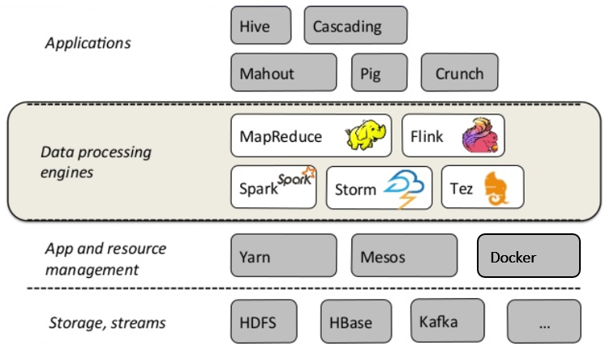
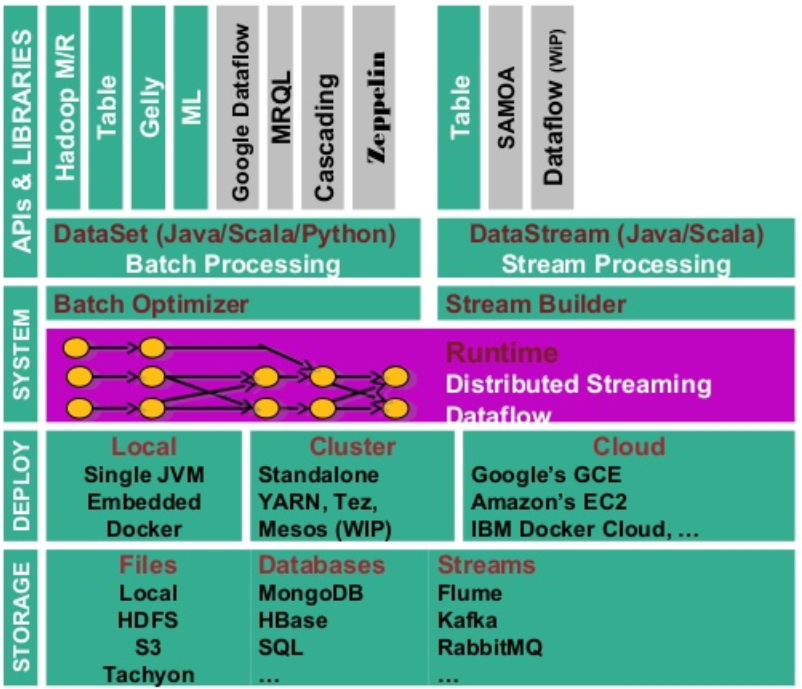
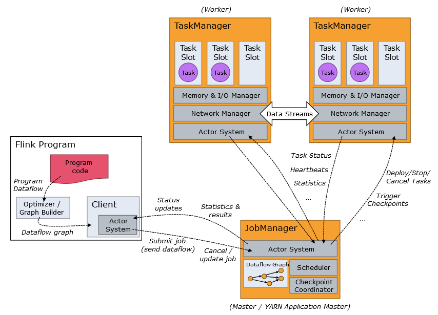
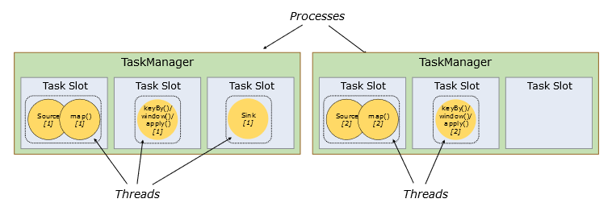
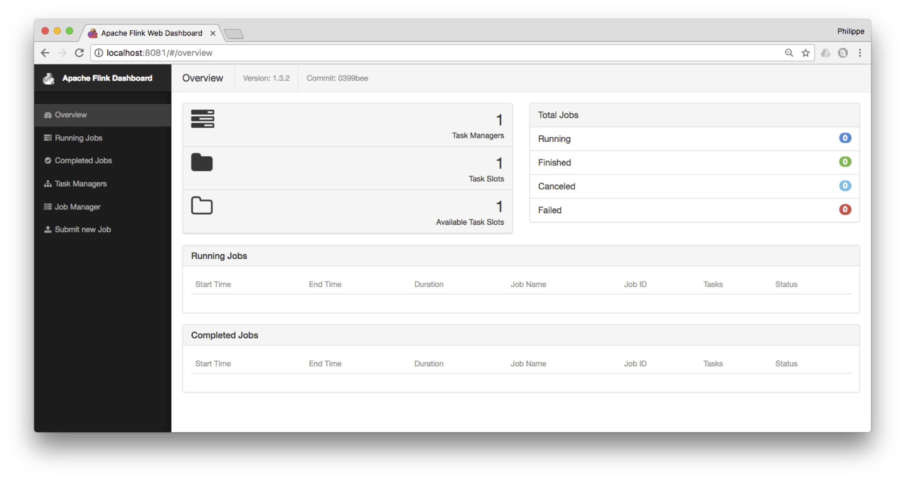
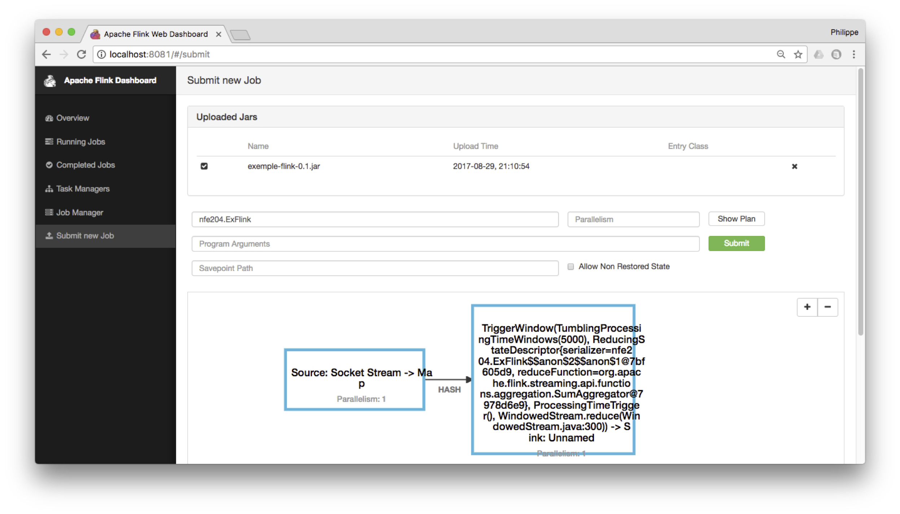
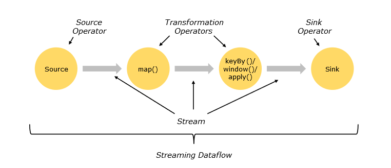
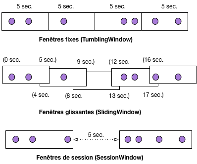
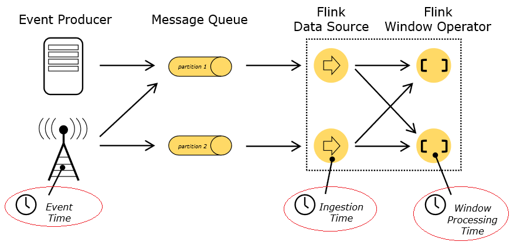

.. _chap-flink:
   
############################################
Traitement de flux massifs avec Apache Flink
############################################

.. |ImageLink| image:: ../figures/flink.ico
   :width: 7%
.. _ImageLink: https://flink.apache.org/
.. important:: Ce chapitre doit beaucoup à la conribution de Nadia Khelil puisqu'il
   exploite très largement le rapport NFE204 consacré à Flink en 2017. Un très grand merci 
   à elle!
   
   
Dans le traitement batch, les données sont collectées sur une certaine période. 
Par exemple, des données de capteurs sur une chaine de traitement industriel, 
des données d’un capteur météo, ou encore des données de logs sur un site 
internet, collectés sur une journée ou une heure. Ces données sont ensuite 
stockées dans une base puis traitées comme un ensemble. Cette 
chaine de traitement traditionnelle introduit une latence entre la récupération 
des données et leur analyse et fait l’hypothèse implicite que l'ensemble des données 
à disposition est complet.

Dans de nombreux secteurs, les *data scientists* ont besoin de traiter 
de larges flux de données en temps réel pour fournir des résultats quasi immédiats. 
Nous pouvons citer la détection de fraude, le suivi de titres boursiers, la 
détection d’anomalies sur les chaines industrielles, le suivi du trafic routier 
et aérien ou encore les systèmes de recommandation. 

Le modèle MapReduce est clairement inadapté pour répondre à ces besoins, et
les systèmes de traitement à grande échelle comme Spark ou Flink
proposent des technologies de traitements de flux massifs en temps réels.
Flink en particulier a nativement été conçu pour le
*data streaming*, et l'application d'opérateurs de fouille de données
à des flux. C'est donc ce système qui est présenté dans ce chapitre, 
et illustré par une application de traitement de messages  en temps réel.

Nous allons dans un premier temps, présenter le système dans sa globalité 
et étudier son anatomie fonctionnelle et son architecture. Cette partie est
largement reprise de la documentation officielle de Flink, et vous êtes invités
à vous y reporter pour plus de détails: à ce stade du cours vous devez
être en mesure d'aborder ce type de documentation et d'en comprendre les
aspects techniques, communs à de nombreux systèmes distribués étudiés
précédemment.

La seconde partie présente plus en détail l’API de temps réel fournie 
par Flink et expose les grands principes sur lesquels elle repose. 

Enfin, la dernière partie est consacré aux opérateurs de fenêtrage qui sont une spécificité
des systèmes de traitement de flux. 
Nous donnons quelques exemples, à vous de les compléter
en effectuant les exercices suggérés.

Les programmes Flink peuvent être écrits en Java, Scala ou Python. 
Dans le cadre de cette étude, nous avons fait le choix de Scala pour 
les raisons déjà évoquées dans le chapitre :ref:`chap-spark` : Scala
est un langage fonctionnel qui se prête très bien à la modélisation
de chaînes de traitement dont chaque étape consiste à appeler une fonction.

****************
S1: Apache Flink
****************

.. admonition:: Supports complémentaires

    * `Fichier de génération de flux (Python) <http://b3d.bdpedia.fr/files/SimFlux.py>`_  
    * `Programme Flink de traitement de flux <http://b3d.bdpedia.fr/files/flinknfe204.zip>`_  

Flink a pour  l’origine le projet Stratosphere, conçu en 2008 par 
le professeur Volker Marl et ses équipes à l’université de Berlin. 
Flink est un des projets phares de la fondation Apache depuis fin 2014
(http://flink.apache.org). 
En allemand, Flink signifie "agile" ou "rapide", comme l’écureuil de son logo.

Flink est un environnement généraliste *open source* de traitement 
distribué de données massives. Ce qui le différencie des autres 
(comme Hadoop MapReduce ou Spark) est : une API de streaming native 
qui offre des fonctionnalités étendues par rapport au framework 
MapReduce et ses opérateurs itératifs.

.. _S1_1_Environnement_Flink:

   
      Flink dans la chaine de traitement des données

La :numref:`S1_1_Environnement_Flink` présente le positionnement de Flink dans la chaîne 
de traitement des données. Ces dernières sont récupérées à partir 
d’une base ou d’un flux puis ingérées par les frameworks de 
traitement (Flink, ou Spark, ou  autres) où elles sont traitées et analysées. 

Nous avons entre les couches de stockage et de traitement, une 
couche applicative qui supporte les options de déploiement des 
systèmes (en local, sur plusieurs serveurs). Au dernier niveau 
du schéma, nous trouvons une couche de service, représentée par 
des langages avec un haut niveau d’abstraction comme Pig ou Hive. 

Architecture applicative
========================

Avant de passer en revue les options de déploiement sur une ou 
plusieurs machines, étudions les différentes briques 
qui composent ce système (:numref:`S2_1_Flink_Architecture_Applicative`).

.. _S2_1_Flink_Architecture_Applicative:

   
      Ecosystème Flink

Le cœur du système se trouve dans le moteur de traitement (*Runtime*), 
celui-ci peut traiter soit des flux de données en *streaming* grâce au *Stream Builder* et 
à la *DataStream API*, soit des ensembles de données en mode *batch* avec l’optimiseur 
de batch et la *DataSet API*. Ce moteur d’exécution est scalable et 
distribué, permettant donc le traitement des données massives (streaming ou batch), 
l’exécution d’opérations itératives, la gestion de la mémoire et 
l’optimisation des coûts de traitement. 

Flink est implanté  en Java, mais dispose de *wrappers* permettant 
de supporter Scala et Python. Il a aussi un langage de requêtage 
*Flink SQL* qui interagit avec l’API Table et offre les mêmes opérateurs 
que le langage SQL (*select*, *where*, …).

À un niveau d’abstraction plus élevé, nous avons différentes briques applicatives 
(*Domaine Specific Language*) qui viennent se greffer aux deux blocs primaires 
(DataStream et DataSet APIs). Notamment les librairies de *Machine Learning* ML 
et SAMOA (*Machine Learning* en streaming), inspirées de scikit-learn et de 
Spark MLlib, ou d’analyse de graphe (Gelly pour le traitement batch et 
*Dataflow* pour le temps réel). 

L’API Table est basée sur le modèle relationnel étendu et offre des fonctionnalités 
qui se rapprochent du Pig ou du SQL avec des opérateurs comme *Select*, *Filter*, 
*Co-group*. Elle permet par exemple de lire un fichier CSV et de lui appliquer directement 
des transformations  sans avoir à passer par un objet DataStream ou DataSet.
Flink possède une mémoire cache permettant de stocker les données pendant 
le traitement. Elle est notamment utilisée pour les opérateurs à mémoire d’état. 
Si l’utilisateur souhaite pérenniser ses données dans l’objectif d’une analyse 
ultérieure, il faut adjoindre à Flink un système de stockage (écriture en fichier 
texte ou dans une base de données).

De plus, Flink gère de manière autonome sa mémoire interne en utilisant ses
propres composants d’extraction et de sérialisation  des données. 
Il optimise aussi le transfert réseau et l’écriture sur disque.

Architecture système
====================

Voyons comment Flink fonctionne et se déploie dans une grappe  de machines
(:numref:`S3_1_Flink_Architecture_Systeme`).
Flink fonctionne en mode Maître-esclave. Le maitre, appelé *JobManager*, 
planifie les tâches, les distribue aux *TaskManagers*, suit l’avancement 
de l’exécution, alloue les ressources et compile les résultats. Les esclaves,
appelés donc TaskManagers, exécutent les tâches envoyées par le JobManager 
et s’échangent parfois des données lors des différentes phases du traitement.

.. _S3_1_Flink_Architecture_Systeme:

   
      Fonctionnement d’un cluster Flink

Les opérations à exécuter sont divisées en sous-tâches, en fonction 
des options de parallélisme par défaut ou spécifiées. Une ou plusieurs 
instances parallèles d’une opération sont menées dans un *Task Slot* 
(littéralement un emplacement de tâche). Le Task Slot représente un 
espace mémoire isolé dédié à l’exécution d’un ou plusieurs fils de 
traitements (*Threads*), voir :numref:`S3_2_Flink_Task_slot_et_Threads`. 
Un TaskManager peut avoir un ou plusieurs 
Task slots. Pour compléter cette architecture, l’utilisateur peut 
télécharger un client pour communiquer avec Flink et lui soumettre 
des traitements (par exemple Zeppelin, https://zeppelin.apache.org/).

.. _S3_2_Flink_Task_slot_et_Threads:

   
      Task slots

Flink peut être lancé, pour des tests et expérimentations,
en mode *standalone*; dans ce cas, le système 
par défaut est composé d’un JobManager et d’un TaskManager 
qui se partagent les ressources de la même machine. 

L’utilisateur peut également ajouter autant de TaskManager 
que ses ressources le lui permettent, dans ce cas, Flink est 
lancé en mode *cluster local*. Cette architecture facilite le 
développement et le débogage. Flink peut finalement être déployé 
sur une ou plusieurs machines à distance en utilisant 
des gestionnaires de ressources distribuées comme
Yarn, Mesos ou Docker.

Chaque TaskManager envoie un message (*heartbeats*) à intervalle 
régulier et en reçoit du JobManager pour signaler qu’il n’est pas en 
panne. Si un TaskManager tombe en panne, le JobManager redistribue 
les tâches entre les TaskManagers opérationnels en reprenant le 
job à partir du dernier *checkpoint* complété. 

L’inconvénient avec ce type d’architecture est l’unicité du maître 
qui représente un point de défaillance unique (SPOF), car par 
défaut, un cluster Flink contient un seul JobManager. 
Si le JobManager fait défaut, les TaskManagers s’en 
rendent compte car ils sont déconnectés du JobManager mais 
il n’y a pas de procédure d’élection d’un nouveau JobManager 
parmi eux (les TaskManagers restent des esclaves). 
Pour pallier ce risque, Flink propose une procédure dite de 
Haute Disponibilité (*High Availability*). L’idée est d’avoir 
un JobManager leader et un ou plusieurs JobManagers en attente, 
prêts à prendre le relais si le leader tombe en panne ou fait 
défaut. Cette procédure est prise en charge par un *framework*
sous-jacent très utilisé, Zookeeper (http://zookeeper.apache.org). 
Celui-ci permet de gérer la configuration du système 
distribué et est intégré à Flink. Zookeeper se charge de 
désigner parmi les JobManagers en standby celui qui dirigera 
le cluster et lui fournira le dernier checkpoint complété.

Tolérance aux pannes
====================

L’une des forces de Flink est son mécanisme de Checkpointing. 
Ce mécanisme consiste à faire des instantanés 
(*snapshots*) automatiques et asynchrones de l’état 
de l’application et de la position dans le flux à 
intervalles réguliers. Ceci permet d’avoir la garantie 
que chaque donnée est traitée exactement une fois 
(*Exactly-once processing delivery guarantee*) avec un 
faible impact sur les performances.

En cas de panne ou de défaillance, un programme 
Flink avec des checkpoints activés[#]_, reprendra le 
traitement à partir du dernier checkpoint, assurant que 
Flink maintient l’unicité des traitements. Le mécanisme 
de checkpoint peut être étendu à l’écriture et lecture 
à partir d’une base également.

Flink permet à l’utilisateur de déclencher manuellement 
des checkpoints, ceux-ci sont alors appelés *savepoints*
(points de sauvegarde) et permettent par exemple 
d’arrêter le programme et de reprendre à partir de l’état 
sauvegardé ou de redémarrer l’application avec un parallélisme 
différent pour s’adapter aux changements de vitesse et de 
masse du flux.

Il également possible dans le cadre de la reprise sur 
panne de définir la stratégie de redémarrage. Flink applique 
une stratégie de redémarrage par défaut lorsque le checkpointing 
est activé. Si le programme inclut une stratégie de redémarrage 
spécifique, celle-ci remplace la stratégie par défaut (Ex. 
un nombre max de tentatives de 2 avec un temps d’attente de 
5 secondes entre chaque relance).

Prise en mains de Flink
=======================

Nous allons reprendre un exemple de la documentation Flink pour faire 
connaissance avec ce système.

Installation et lancement
-------------------------

Flink peut s'installer avec Docker, mais comme nous avons besoin de plusieurs
scripts et clients (dont l'interface en ligne de commande), il est sans doute plus
direct de récupérer directement l'ensemble du logiciel. 

Flink peut se télécharger depuis http://flink.apache.org/downloads.html, et plusieurs
versions sont proposées en association avec Hadoop et Scala. Choisissez
une version binaire, n'importe laquelle: à ce stade nous n'avons pas besoin
de Hadoop et la version de Scala ne compte pas vraiment non plus.

Installez Flink dans un répertoire quelconque et ajoutez le sous-répertoire ``bin``
dans le chemin d'accès à vos exécutables. Par exemple, sous Linux ou Mac OS X,
cela donne les commandes suivantes:

.. code-block:: bash

   cd ~/Downloads        
   tar xzf flink-*.tgz   
   cd flink-1.3.2
   export PATH=$PATH:/users/philippe/flink-1.3.2/bin
    
Et vous pouvez alors lancer un serveur Flink en local avec la commande:

.. code-block:: bash

      start-cluster.sh

Le serveur fournit une interface Web à l'adresse http://localhost:8081,
comme le montre la :numref:`flink-dashboard`.
 
.. _flink-dashboard:

   
   Le tableau de bord de Flink

Nous sommes prêts à effectuer nos premières manipulations avec Flink.
Pour lancer et suivre l’avancement des programmes 
ou pour modifier les paramètres de l’architecture 
système, il existe plusieurs moyens :

  * La *Command-Line Interface* (CLI) : permet de lancer 
    des jobs en ligne de commande.
  * Le *Client Web Interface* (port 8081) : permet 
    de soumettre des jobs, d'inspecter les plans d’exécution 
    et de les exécuter, de débugger les plans d’exécution, d'avoir avoir 
    une vision globale du cluster. Zeppelin Notebook, par exemple, 
    offre une interface web interactive de visualisation et 
    d’exploration des données (https://zeppelin.apache.org/).
  * la *JobManager Web Interface* (port 8081) permet de suivre la 
    progression du traitement, d’avoir une vision globale du statut 
    du système, de consulter le détail de l’exécution des jobs et
    l’évolution de l’utilisation des ressources par les 
    TaskManagers, et éventuellement savoir pourquoi un job 
    a échoué et situer quelle tâche parallèle a causé le problème.
  * enfin l'*Interactive Scala Shell* permet de lancer des 
    requêtes, d’explorer les données, de modifier les paramètres 
    du système. Elle offre un accès complet à l’API Scala.

La ligne de commande Scala est très pratique pour tester rapidement des opérateurs
et des *workflows*, qui peuvent ensuite être intégrés dans des programmes complets 
au *Job Manager* via l'interface Web. Cette dernière 
offre de nombreuses visualisations  pour suivre l’avancement 
des traitements et avoir une vision globale du cluster.

Vous pouvez arrêter le serveur.

.. code-block:: bash

      stop-cluster.sh

Quelques commandes interactives
-------------------------------

Flink est un moteur de traitement distribué, et propose les opérateurs typiques
de ces environnements. Nous les avons exploré avec Pig, avec Spark, et nous les
retrouvons ici. Avant d'en donner la liste, voici quelques exemples 
qui devraient se passer d'explication,
exécutés avec l'utilitaire de commandes interactif.

Placez-vous dans le répertoire contenant le fichier bien connu ``author-small.txt`` (ou n'importe
quel autre fichier qui a votre préférence), et entrez:

.. code-block:: bash
   
     start-scala-shell.sh local

Vous devriez obtenir un prompt ``Scala-Flink``. Voici quelques commandes à tester
(note: la variable Scala prédéfinie ``benv`` désigne l'environnement de traitements *batch*).

.. code-block:: scala

     val data = benv.readTextFile("author-small.txt")
     data.print
     data.count
     data.filter(_.contains("1989"))
     data.filter(_.contains("1989")).count()
     data.filter(_.contains("1989")).print()
     data.filter(_.contains("1989")).map(_.toUpperCase).print()

Notez bien que, comme Pig ou Spark, la construction d'un workflow n'implique
pas son exécution immédiate, qui est déclenchée quand on la demande directement par ``run()`` ou,
ici, indirectement par ``print()``. Exemple:

.. code-block:: scala

     val data = benv.readTextFile("author-small.txt")
     var workflow = data.filter(_.contains("1989")).map(_.toUpperCase)
     // A ce stade, rien n'est exécuté mais la commande suivante déclenche le calcul
     workflow.print()

Un programme de suivi de flux
-----------------------------

Nous allons nous concentrer sur la gestion de flux avec Flink. Nous allons utiliser
un programme qui simule un flux de données à la demande, en transmettant 
des données sur un port réseau. Ce programme Python 
est disponible sur notre site à l'adresse http://b3d.bdpedia.fr/files/SimFlux.py.
Il vous faut bien entendu un environnement Python (version 3: je n'ai pas testé
le programme avec la version 2).

Entrez alors la commande:

.. code-block:: bash 

   python3 SimFlux.py

Vous devriez obtenir le message:

.. code-block:: text

     J'attends une connexion sur localhost:9000...
     
Le programme a ouvert un accès (une *socket*) sur le port 9000 de la machine locale
et attend des connexions. Des options permettent de modifier le port ou la machine
si nécessaire: entrez ``python3 SimFlux.py -h`` pour des détails. Vous êtes d'ailleurs
invités à regarder le code et à le modifier si cela vous arrange.

Notre programme joue le rôle d'un serveur de flux. Dès qu'un "client" se connecte, des données
sont envoyées, à un rythme variable. Dans son mode par défaut, il transmet
simplement des entiers générés aléatoirement.
Pour le 
vérifier, nous pouvons lancer une application comme ``telnet`` sur ce même port. 
Dans une autre fenêtre, entrez:

.. code-block:: bash

   telnet localhost 9000
   
``telnet`` joue le rôle du client: vous devriez constater qu'il reçoit des données
(des entiers, donc) à un rythme assez lent.  
En d'autres termes, nous avons établi une connexion réseau pour envoyer des données, via le port 9000,
depuis le "producteur" ``SimFlux`` vers le consommateur ``telnet``. Ce dernier ne fait pas
grand chose mais nous allons le remplacer par Flink pour traiter les données reçues. Le moment
venu, nous remplacerons notre générateur de flux par un véritable serveur de *streaming*.

``SimFlux.py`` peut également produire deux autres types de données
avec l'option ``source``. Tout d'abord, si on lui indique un fichier (texte),
les lignes du fichier sont transmises une à une (et on revient au début du fichier 
après la dernière ligne). Le format est le suivant:

.. code-block:: bash 

   python3 SimFlux.py --source /chemin_vers/un_fichier.txt

Ensuite, si on lui indique un répertoire, les fichiers du répertoire seront transmis un à un. 
Pour envoyer par exemple les films codés en JSON, un par un, dézippez le
fichier ``movies-json.zip`` quelque part et lancez la commnde:

.. code-block:: bash 

   python3 SimFlux.py --source /quelque_part/movies-json

Testons maintenant Flink pour traiter le flux des entiers. Lancez à nouveau 
le générateur de flux en mode par défaut:

.. code-block:: bash 

   python3 SimFlux.py
   
Puis, l'interpéteur scala en ligne de commande:

.. code-block:: bash
   
     start-scala-shell.sh local

Entrez maintenant les instructions suivantes:

.. code-block:: scala

      // Déclaration du flux de données. NB: senv est l'environnement de streaming
      val stream = senv.socketTextStream("localhost", 9000, '\n')
      // À chaque entier en entrée, on ajoute 2 (pourquoi pas)
      val w = stream.map ({ x => x.toInt + 2 } )
      // Voyons ce que cela donne
      w.print()
      // Workflow défini: on l'exécute
      senv.execute("Mon premier traitement de flux ")
   
Notre flux de données est capté  par ce traitement 
consistant simplement à ajouter 2 à l'entier reçu. C'est notre premier traitement.

.. note:: Un CTRL-C dans la fenêtre de ``SimFlux.py`` permet d'interrompre le flulx courant.

Déploiement
-----------

L'utilitaire de commande Scala est pratique pour tester un traitement, mais pour
une mise en production, il faut créer un *package* contenant le programme
à exécuter et ses dépendances. Cela suppose un environnement de developpement
assez complet, basé sur l'utilitaire Maven. Des instructions sont données ici:

   https://ci.apache.org/projects/flink/flink-docs-stable/
   
Pour vous faciliter la tâche (dans un premier temps du moins), nous vous fournissons
un *package* prêt au déploiement. Voici le programme à déployer, avec le même *workflow* que celui
déjà testé en ligne de commande.

.. code-block:: scala

   package nfe204 

   /**
      Exemple de programme Flink - Cours NFE204: http://b3d.bdpedia.fr
   */

   import org.apache.flink.streaming.api.scala._
   import org.apache.flink.streaming.api.windowing.time.Time;

   object ExFlink {

       def main(args: Array[String]) : Unit = {
         // Environnement de streaming
         val env: StreamExecutionEnvironment = StreamExecutionEnvironment.getExecutionEnvironment
         // Connexion a la socket localhost:9000
         val stream = env.socketTextStream("localhost", 9000, '\n')
         // Workflow
         val w = stream.stream.map { x => x.toInt + 2 } 
         // Affichage sur la sortie standard
         w.print()
         env.execute("Exemplede programme Flink - NFE204")
      }
   }
   
Récupérer le fichier ``flinknfe204.zip`` dont le lien est donné en début de session. Une fois décompressé,
vous pouvez:

   - soit utiliser directement le *package* ``exemple-flink.jar`` qui se trouve dans le répertoire ``target``
   - soit tenter de recompiler le code source (qui se trouve dans ``src``) avec la commande ``mvn package``;
     il faut disposer de Maven (https://maven.apache.org) sur votre machine 
   
Une fois que vous disposez du fichier ``jar``, vous pouvez le transmettre au serveur Flink grâce à l'interface
web. Choisissez ``Submit new job`` et envoyez le fichier ``jar``. En cliquant ensuite sur ce fichier et
en entrant le nom du programme (``nfe204.ExFlink``) vous verrez l'affichage du *workflow*,
comme sur la :numref:`flink-deploy`.

.. _flink-deploy:

   
   Déploiement avec l'interface Flink

Il ne reste plus qu'à exécuter le *job* avec le bouton ``Submit`` (bien entendu il faut démarrer
notre serveur de flux au préalable). Vous pouvez inspecter le tableau de bord de Flink
qui vous montre les *jobs* en cours d'exécution. Si le serveur était en production avec de nombreux
esclaves, le ``jar`` serait transmis à chacun et l'interface permettrait de visualiser l'ensemble des tâches
parallèles.

Dans le menu ``Job manager``, vous pouvez consulter la sortie  ``stdout`` qui devrait montrer 
le résultat du traitement de nos flux.

Et voilà pour cette prise en main. Vous pouvez arrêter le serveur Flink.

.. code-block:: bash

    stop-local.sh
    

****************************
S2: l'API de streaming Flink
****************************

.. admonition:: Supports complémentaires

      * `Présentation: gestion des flux avec Flink <http://b3d.bdpedia.fr/files/slflinkstream.pdf>`_
      * Vidéo sur la gestion de flux:   <https://mediaserver.cnam.fr/lti/v1261a0df6ad8zf8glx2/>`_  

      
Nous allons à présent  étudier plus en détails (mais pas intégralement
quand même)  le fonctionnement de l’API *DataStream*.  Cette session 
se concentre sur le gestion de flux non limités, la prochaine session
étudiera la notion de fenêtre qui permet de discrétiser un flux.

Vous êtes fortement invités à vous munir de votre installation de Flink et
de notre générateur de flux pour tester les exemples donnés.

Modèle de données et de programmation
=====================================

Les éléments de base d’un programme Flink sont les *streams* (flux)
constitués d'*items* (éléments) et les *transformations*. 
Conceptuellement, un *stream* est un flux de données non borné.
Une transformation est une opération 
qui prend en entrée un ou plusieurs flux et qui 
produit un ou plusieurs flux en sortie.

Flink est totalement agnostique sur la nature des éléments. C'est à l'application
de connaître la structure des éléments reçus  et de les manipuler en conséquence.
Pour certaines
opérations (regroupements), il est cependant parfois nécessaire de choisir ou
de créer une clé. On peut le faire à partir 
des champs d'un élément quand ce dernier est un document structuré, ou
plus généralement par application d'une fonction.
La clé peut donc être un champ, une concaténation 
de plusieurs champs ou le résultat d’une fonction
appliquée à un champ. Pour des données de *log* sur 
un site marchand par exemple, on peut définir comme 
clé l’identifiant de connexion, si on souhaite  effectuer des regroupements par client.

La :numref:`flink_dataflow` représente un *workflow* (ou  *dataflow* dans une terminologie
centrée sur les données) de Flink. Il débute par 
l’ingestion d'éléments provenant d’une ou 
plusieurs sources de données (par exemple une API délivrant
des données en continu, ou un gestionnaire de distribution de messages
comme RabbitMQ ou Kafka), sur lesquelles 
s’opèrent des transformations (filtrage et 
attribution de clé, regroupement par clé, 
application de fonctions définies par 
l’utilisateur) et s’achève par un ou 
plusieurs *sinks* (par exemple, affichage ou écriture 
sur disque). 

.. _flink_dataflow:

   
      *Dataflow* Flink (d'après la documentation)

Les transformations
===================

Les opérateurs de transformation modifient un ou plusieurs 
flux de type générique *DataStream*, type qui peut être raffiné
en *KeyedDataStream* quand une clé a été définie.
Un traitement  peut combiner plusieurs 
transformations successives. Voici les principales
transformations disponibles. 

.. csv-table:: 
   :header: Transformation, Description
   :widths: 20, 100
             
   "*Map*", "Applique une transformation définie par 
   l’utilisateur à chaque élément du flux et produit exactement un élément."
   "*FlatMap*", "Prend un élément du flux et produit zéro, 
   un ou plusieurs éléments."
   "*Filter*", "Filtre les éléments d’un flux en 
   fonction d’une ou plusieurs conditions."
   "*KeyBy*", "Attribue une clé aux éléments d'un flux,
   ce qui revient à la partitionner en fragments partageant la même clé. Le 
   flux sortant est de type *KeyedDataStream*."
   "*Reduce*", "Applique une réduction sur un *KeyedDataStream* 
   en combinant le nouvel élément du flux au dernier résultat 
   de la réduction. "
   "*Fold*", "Applique une réduction sur un *KeyedDataStream* 
   en combinant le nouvel élément du flux à un accumulateur dont
   la valeur initiale est fournie."
   "*Aggregations*", "Fonctions prédéfinies ``sum``, ``max``, ``min``, ``maxBy`` et ``minBy``,
   pour agréger les valeurs numériques des éléments d’un *KeyedDataStream*."
   "*Union*", "Union de deux flux ou plus, incluant 
   tous les champs de tous les flux (ne supprime 
   pas les doublons)."
   "*Connect*", "Connecte deux flux indépendamment de 
   leur type, permettant d’avoir un état partagé."
   "*Split*", "Partitionne le flux selon des critères."
   "*Select*", "Sélectionne un ou plusieurs 
   éléments d’un flux partitionné."
   "*Extract Timestamps*", "Extrait l’horodatage d’un *stream*."

Dans Flink, l’affichage ou l’écriture s’effectuent 
via l’opérateur *Sink*. Le *DataSink* ingère des 
*DataStreams* et les transmet à des fichiers, 
*sockets* (interfaces de connexion), systèmes 
externes (de visualisation ou de stockage) ou 
les imprime sur la console. En voici quelques-uns :

.. csv-table:: 
   :header: Sink, Description
   :widths: 20, 100
             
   "*writeAsText*", "Transforme les éléments 
   en texte en utilisant la méthode *toString()*"
   "*writeAsCsv*", "Ecrit les éléments dans 
   un fichier csv. Les délimiteurs de champs 
   et de ligne sont paramétrables."
   "*print / printToErr*", "Imprime les éléments 
   sur la console."
   "*writeUsingOutputFormat / FileOutputFormat*", "Permet 
   d’écrire avec un format défini
   par l’utilisateur."
   "*addSink*", "Permet d’ajouter un connecteur 
   défini par l’utilisateur en dehors 
   des fonctions *sink* existantes."

Les méthodes *write* citées plus haut sont 
principalement destinées au débogage, elles 
ne participent pas au processus de reprise sur panne. 
Pour assurer la fiabilité de l’écriture 
unique des flux, il est préférable de passer 
par des gestionnaires de données robuste
(ElasticSearch, Cassandra, Kafka et tous ceux que vous pouvez maintenant
explorer dans la galaxie NoSQL).

Quelques exemples
=================

Pour bien comprendre, le plus simple est d'expérimenter. Vous avez notre programme de génération
de flux, déjà utilisé dans la session précédente. Il tient lieu de *data source* en attendant mieux.
Le *data sink* est simplement l'affichage à l'écran du flux résultat. Nous utilisons la fenêtre 
interactive Scala pour tester des expressions, intégrées à un script dont la forme générale
est la suivante:

.. code-block:: scala

      // Déclaration du flux de données. NB: senv est l'environnement de streaming
      val stream = senv.socketTextStream("localhost", 9000, '\n')
      // Les ... ci-dessous désignent l'emplacement des opérateurs à évaluer
      val w = stream.(...) 
      // Data sink = affichage 
      w.print()
      // Workflow défini: on l'exécute
      senv.execute("Je lance mon traitement de flux ")

   
Notre générateur de flux produit des entiers dans son mode par défaut. Commençons
par les transformer en flux de *tuple* Scala pour avoir des données plus structurées
(des *documents*, pour renvoyer au premier chapitre de ce cours). Vous êtes invités
à tester l'expression suivante.

.. code-block:: scala
 
     val w = stream.map ( { x => Tuple1(x.toInt) } )

On obtient l'affichage des entiers reçus, inclus dans un *tuple*.

.. code-block:: text

      (7672)
      (7479)
      (5745)
      (8310)
      ...

Flink traite donc chaque élément dès qu'il est reçu: un gestionnaire de flux
vise à une latence minimale, contrairement aux traitements *batch* massifs
comme Hadoop/MapReduce.

.. note:: Pour interrompre un *DataFlow*, il faut que la connexion au flux soit coupée.
   Vous pouvez interrompre la connexion en entrant CTRL-C dans notre générateur de flux.
   Il se mettra automatiquement en attente d'une nouvelle connexion.
   
On crée un flux de  *tuple* avec un seul champ, converti au type *Int*. On peut apppliquer
à ce flux d'autres transformations. Par exemple créer un autre *tuple* avec la valeur
comme premier champ, et le double de la valeur comme second champ. Ce qui donne:

.. code-block:: scala
 
     val w2 = w.map( {y => (y._1, y._1 * 2) } )
     w2.print()

.. note:: La syntaxe Scala ``y._1``  désigne le premier champ du tuple ``y``.

Cela donne un flux de paires d'entiers.

.. code-block:: text

      (5563,11126)
      (1219,2438)
      (465,930)
      ..
      
Bien entendu, on peut chaîner toutes les transformations, ce qui revient à
tout écrire en une séquence d'instructions:

.. code-block:: scala
 
     stream.map ( { x => Tuple1(x.toInt) } )
           .map( {y => (y._1, y._1 * 2) } )
           .print()

.. important:: Si vous voulez entrer des instructions multi-lignes dans l'interpréteur Scala, utilisez
   la commande ``:paste``, suivi de vos instructions, et ``CTRL D`` pour finir.

Le fait d'engendrer des tuples, dans lesquels les champs ne sont
pas nommés, finit par donner un code un peu ésotérique. On peut choisir
pour plus de clarté de définir les types des résultats intermédiaires.
Voici un exemple complet dans lequel on a défini un type ``MonDouble``
permettant de représenter un réel et son double
(si on réfléchit un peu, le fait qu'un réel puisse avoir un double soulève quelques
questions métaphysiques; lecture recommandée: https://fr.wikipedia.org/wiki/Le_R%C3%A9el_et_son_double).

.. code-block:: scala
 
     case class MonDouble(leReel: Float, sonDouble: Double)
     val stream = senv.socketTextStream("localhost", 9000, '\n')
     val w = stream.map ( { x => Tuple1(x.toFloat) } ).map( {y => MonDouble(y._1, y._1 * 2) } )
     val fluxFiltre = w.filter ({_.leReel > 1000})
     fluxFiltre.print()
     senv.execute("Mon premier traitement de flux ")
     
.. note:: Une ``case class`` en Scala est une classe  d'objets non modifiables pour laquelle (entre autres) il n'est pas
   nécessaire de définir un constructeur.

Ce programme produit donc un flux d'objets de la classe ``MonDouble``. Notez qu'on a ajouté
un filtre pour ne conserver que les objets dont le champ ``leReel`` est supérieur à 1000.

À ce stade, faites une pause et vérifiez que vous comprenez bien ce que nous
sommes en train de faire. Nous définissons des chaînes de traitements par des
opérateurs Flink qui prennent comme argument des fonctions Scala à appliquer à
chaque élément du flux. Ces opérateurs sont des *opérateurs de second ordre*
(relisez le chapitre :ref:`chap-calcdistr` si vous avez déjà oublié).

Contrairement
à ce qui se passe dans un environnement comme, disons, MapReduce/Hadoop, il
n'y a pas de *matérialisation* des résultats intermédiaires, mais une sorte de tuyauterie
qui transfère en continu les données d'un opérateur à un autre. En d'autres termes, le jeu de données
n'est pas soumis en totalité au premier opérateur, lequel
stocke  complètement son résultat sur disque avant de le fournir comme entrée au second opérateur,
et ainsi de suite. 
Au contraire, dans l'optique du traitement de flux, chaque document passe sans interruption
dans la chaîne de traitement, et la *latence* pour obtenir le résultat est minimale. C'est assez évident 
quand on exécute nos petits scripts

.. attention::  Si ce n'est pas clair, il faut approfondir, sinon ce qui suit
  restera définitivement du côté obscur.
  
Passons à la suite. Le ``flatMap``
produit plusieurs éléments pour chaque élément traité. L'exemple
typique est celui d'une ligne que l'on décompose en mots. Lancez
notre générateur de flux en mode "lignes de fichier texte" (voir ci-dessus)
et exécutez le script suivant.

.. code-block:: scala

     val stream = senv.socketTextStream("localhost", 9000, '\n')
     val w = stream.flatMap ({ str => str.split("\\W+") }).print()
     senv.execute("Je découpe en mots")

On obtient les mots du document texte. Par exemple, à partir du fichier ``webdam-book.txt``:

.. code-block:: text

   Vianu
   2010
   Web
   Data
   Management
   Abiteboul
   2010
   Web
   Data
   ...
   
Pour reprendre l'exemple du compteur de mots que nous avons déjà étudié
à plusieurs reprises avec MapReduce, voici son expression sur un flux avec Flink.

.. code-block:: scala
 
     case class CompteurMot(mot: String, compteur: Int)
     val stream = senv.socketTextStream("localhost", 9000, '\n')
     val w = stream.flatMap ({ str => str.split("\\W+") })
            .map({ CompteurMot(_, 1) })
            .keyBy("mot")
            .sum("compteur")
            .print()
    senv.execute("Le compteur de mots")

À chaque fois qu'une nouvelle ligne est reçue, elle est soumise au *Dataflow*
qui cumule dans les fragments correspondant à chaque mot le nombre
d'occurrences reçues jusqu'ici. On voit donc défiler l'incrémentation successive
des compteurs:

.. code-block:: text

      CompteurMot(2010,5)
      CompteurMot(Web,5)
      CompteurMot(Data,5)
      CompteurMot(Management,5)
      CompteurMot(Senellart,1)
      CompteurMot(1995,3)
      CompteurMot(Fundations,3)
      

Il faut
bien être conscient qu'un flux est en théorie *infini*, et qu'on ne dispose
donc à aucun moment d'un état stable et final d'un groupe sur lequel
on pourrait appliquer un calcul définitif. Si je veux calculer
une moyenne glissante par exemple, je dois garder à la fois la somme
des valeurs collectées jusqu'à présent, et le nombre de valeurs 
rencontrées. Cette moyenne évolue à chaque nouvel
élément par combinaison de la valeur accumulée jusqu'ici et 
du nouvel élément.

Quelle est alors la signification de l'opérateur *Reduce* sur un flux? 
Une fonction de *Reduce* dans Flink consiste  à définir comment combiner
deux éléments, dont l'un représente l'accumulation des éléments rencontrés dans
le passé. 

.. note:: Il existe une variante de *Reduce*, *Fold*, où l'accumulateur
   est d'un type différent des éléments du flux. La valeur initiale
   de cet accumulateur doit alors être fournie. Un exemple sera donné plus loin.

Voici un script illustrant l'opérateur de *Reduce*. Une première
variable, ``mots``, partitionne le flux en fragments correspondant chacun
à un mot. Chaque fragment contient toutes les occurrences rencontrées:

.. code-block:: scala

     case class CompteurMot(mot: String, compteur: Int)
     val stream = senv.socketTextStream("localhost", 9000, '\n')
     val mots = stream.flatMap ({ str => str.split("\\W+") }).map({ CompteurMot(_, 1) }).keyBy("mot")

     mots.print()
     senv.execute("Le compteur de mots")
     
Vous pouvez déjà tester ce premier script pour obtenir le résultat concret 
du flux des mots et de leur compteur. En l'appliquant à un flux
fourni depuis le fichier ``webdam-book.txt`` par exemple, voici 
ce que l'on obtient.

.. code-block:: text

      ...
      CompteurMot(Management,1)
      CompteurMot(Abiteboul,1)
      CompteurMot(2010,1)
      CompteurMot(Web,1)
      CompteurMot(Data,1)
      
      CompteurMot(Management,1)
      CompteurMot(Manolescu,1)
      CompteurMot(2010,1)
      ..

Le *reduce* va compter le nombre d'occurrences de chaque fragment. La fonction
prend en entrée une paire constituée de l'accumulateur (``acc``) et d'une nouvelle
occurrence (``occ``), et produit un nouveau ``CompteurMot`` avec incrémentation.

.. code-block:: scala

     case class CompteurMot(mot: String, compteur: Int)
     val stream = senv.socketTextStream("localhost", 9000, '\n')
     val mots = stream.flatMap ({ str => str.split("\\W+") }).map({ CompteurMot(_, 1) }).keyBy("mot")
     val compte = mots.reduce( (acc, occ)  => {CompteurMot (acc.mot, acc.compteur + 1) }).print()     
     senv.execute("Le compteur de mots")

Cette fois on obtient un flux de compteurs dont la valeur augmente au fur et
à mesure.

.. code-block:: text

   ...
   CompteurMot(2010,7)
   CompteurMot(Web,7)
   CompteurMot(Data,7)
   CompteurMot(Management,7)
   CompteurMot(Manolescu,2)
   CompteurMot(2010,8)
   ...

Ces exemples doivent vous permettre de comprendre les caractéristiques essentielles
d'un traitement de flux.
À vous d'aller plus loin en explorant les autres opérateurs. Rien ne vous empêche
par exemple de lancer deux générateurs de flux et de les combiner. 
Les exercices ci-dessous sont des variantes des exemples que nous avons déjà 
donnés.

Exercices
=========

Le premier exercice consiste, si ce n'est pas encore fait, 
à tester les transformations précédentes.

.. _Ex-S2-1:
.. admonition:: Exercice `Ex-S2-1`: mise en œuvre

   Exécutez les *dataflows* précédents sur notre flux d'entier.
 

Pour les exercices suivants, nous allons nous appuyer sur un flux de documents JSON,
provenant de nos fichiers de films extraits de *movies.zip*. Vous devez donc lancer
le générateur de flux comme suit:

.. code-block:: bash

    python3 SimFlux.py --source <le-chemin-vers-les-fichiers-json>

Il va falloir décoder les flux JSON en Scala. Heureusement nous avons
fait en partie ce travail pour vous. Voici les classes Scala représentant
les artistes et les films.

.. code-block:: scala

   case class Artiste(nom: String, prenom: String, annee_naissance: Double) 

   case class Film(titre: String, 
            resume: String, 
            annee: Double, 
            genre: String, 
            pays: String, 
            realisateur: Artiste, 
            acteurs: List[Artiste]) 
 
Et voici la fonction (presque complète) qui instancie un objet ``Film``
à partir d'un encodage en JSON.

.. code-block:: scala

   def parseFilm (jsonString: String) : Film = {
      import scala.util.parsing.json.JSON

      // On parse
      val jsonMap = JSON.parseFull(jsonString).getOrElse("").asInstanceOf[Map[String, Any]]

      // On extrait
      val titre = jsonMap.get("title").get.asInstanceOf[String]
      val resume = jsonMap.get("summary").get.asInstanceOf[String]
      val annee = jsonMap.get("year").get.asInstanceOf[Double]
      val genre = jsonMap.get("genre").get.asInstanceOf[String]
      val pays = jsonMap.get("country").get.asInstanceOf[String]
   
      // Le metteur en scène
      val director_json  = jsonMap.get("director").get.asInstanceOf[Map[String, Any]]
      val nom = director_json.get("last_name").get.asInstanceOf[String]
      val prenom = director_json.get("first_name").get.asInstanceOf[String]
      val director = Artiste (nom, prenom, 0)

      // Et voici le film
      return Film(titre, resume, annee, genre, pays, director, List())
   }

Il faut compiler ces définitions dans l'interpréteur Scala avant de traiter
les flux de documents JSON.
Vous pouvez compléter cette fonction pour extraire également les acteurs
si vous avez de l'appétit en programmation Scala.

.. _Ex-S2-2:
.. admonition:: Exercice `Ex-S2-2`: flux de données JSON

   Définissez et exécutez les transformations suivantes sur le flux
   des films codés en JSON.
   
    - Appliquez simplement notre fonction et affichez le titre du film
    - Appliquez le décompte continu des mots sur le résumé des films
    - Créez une classe ``CompteurFilm``, groupez les films par réalisateur,
      et affichez en continu le nombre de films réalisés par chaque réalisateur.
    - Ne prenez en compte que les drames, groupez-les par année, et affichez,
      pour chaque année, la liste des films. Pour créer la liste, vous pouvez
      soit définir une classe Scala adéquate, soit simplement (!) concaténer
      les titres des films dans une chaine de caractères. 

.. ifconfig:: flink2 in ('public')

   .. admonition:: Correction
  
      .. code-block:: scala
      
            val stream = senv.socketTextStream("localhost", 9000, '\n')
            val w = stream.map ( { x => parseFilm (x) } )
                        .map ( { film => film.titre } )
                        .print()
            senv.execute(" ")

        .. code-block:: scala
        
            case class CompteurMot(mot: String, compteur: Int)
            val stream = senv.socketTextStream("localhost", 9000, '\n')
            val w = stream.map ( { x => parseFilm (x) } )
                            .flatMap ({ film => film.titre.split("\\W+") })
                         .map({ CompteurMot(_, 1) }).keyBy("mot")
                         .reduce( { (v1, v2) => CompteurMot (v1.mot, v1.compteur + 1) } )
                         .print()
             senv.execute("")

       .. code-block:: scala
       
            case class CompteurFilm(realisateur: String, compteur: Int)
            val stream = senv.socketTextStream("localhost", 9000, '\n')
            val w = stream.map ( { x => parseFilm (x) } )
                         .map ( {f => CompteurFilm(f.realisateur.nom, 1) } )
                        .keyBy ( { "realisateur" } )
                        .sum("compteur")
                        .print()
             senv.execute("")
       
       
.. _Ex-S2-3:
.. admonition:: Exercice `Ex-S2-3`: parallélisme ou pas parallélisme?
       
     Un *dataflow* Flink est-il toujours entièrement parallélisable? Posez-vous
     la question en reprenant nos exemples ou ceux des exercices précédents. Vous
     pouvez approfondir la question en lisant la documentation Flink à ce sujet.
    
    .. ifconfig:: flink2 in ('public')

      .. admonition:: Correction
  
         La parallélisme est valable pour toute la chaîne de traietement, mais il
         est quand même limité par le partitionnement d'un flux en fonction d'une clé. Si cette
         clé ne prend que très peu de valeurs, cela restreint d'autant les possibilités
         de parallélisme puisqu'il faut que toutes les valeurs d'un même flux soient traitées 
         dans la même tâche et donc surune même machine.
         
         Au pire, il n'y a pas de partitionnement, et plus  du tout de parallélisme. C'est d'ailleurs
         exactement la même problématique que pour l'opérateur de Reduce.
        

****************
S3: Le fenêtrage
****************

.. admonition:: Supports complémentaires

      * `Présentation: fenêtres sur flux avec Flink <http://b3d.bdpedia.fr/files/slflinkwindows.pdf>`_
      * Vidéo sur le fenêtrage de flux:   <https://mediaserver.cnam.fr/lti/v1261a0df6c1filb7dw2/>`_

Un flux  est théoriquement 
infini, et il n'est donc possible en principe que d'obtenir
des résultats transitoires (par exemple le décompte des mots, qui
change à chaque document reçu). Il est, en revanche, possible de le faire 
sur des parties du flux appelées des fenêtres ou 
*windows* (par exemple, une moyenne sur les 50 
derniers éléments ou un la valeur maximale  des éléments sur 
la dernière heure).

.. important:: La présentation qui suit est évidemment restreinte
   à l'essentiel. Vous trouverez beaucoup plus de détails dans la documentation Flink.

Les fenêtres s'appliquent soit à des flux dotés d'une clé (*KeyeddataStream*)
soit à des flux "bruts", sans clé, mais dans ce dernier cas il n'y a pas de parallélisation
possible.

Définition d'une fenêtre
========================

Plusieurs méthodes sont proposées pour définir une fenêtre.
Elles peuvent être délimitées par 
le temps (par exemple une fenêtre de 5 minutes) ou par 
les données (tous les 3 éléments). 
Par ailleurs, les fenêtres peuvent être exclusives (*TumblingWindow*, sans chevauchement), 
glissantes (*SlidingWindow*, avec chevauchement) ou par sessions 
(avec des périodes d’inactivité). Pour le 
dernier cas, il suffit par exemple d’imaginer 
que la session est composée des clics d’un 
client sur un site marchand lorsque celui-ci 
est connecté et que les périodes d’inactivités 
sont composées des moments où le client est 
hors connexion. Ces options autorisent une 
grande flexibilité de programmation.

La  :numref:`flink_windowing` montre les principaux types de fenêtres prédéfinis,
et leur couverture d'un même flux de données. La fenêtre fixe couvre 5 secondes et
démarre toutes les 5 secondes. La fenêtre glissante couvre 5 secondes
et démarre toutes les 4 secondes. L'utilisateur reçoit donc toutes les 4 secondes
une fenêtre contenant les éléments des 5 dernières secondes. On peut noter que certains éléments
appartiennent à deux fenêtres.

.. _flink_windowing:

   
      Fenêtres sur flux
      
Le dernier type de fenêtre est défini par l'intervalle de temps entre
deux éléments (ce qui définit l'arrêt d'une session et le début d'une nouvelle).

Dans Flink, un événement peut avoir trois 
étiquettes de temps différentes : 

  * Le moment de création de l’événement 
    (estampille de l’événement ou *Event Time*), fourni par 
    le producteur du flux sous la forme d'un champ  *timestamp* dans l'élément.
  * Le temps d’ingestion : correspond au moment 
    où l'élément est inséré dans le *dataflow* de Flink.
  * Le temps de traitement : correspond au 
    moment où chaque opérateur applique un 
    traitement à l'élément.

.. _flink_timestamp:

   
      Horodatage des éléments

Le fenêtrage utilisant l’estampille nécessite 
un moyen de mesurer la progression de cet horodatage. 
Par exemple, un *windowing* qui construit des 
fenêtres horaires a besoin que le programme lui 
signale que l’estampillage a dépassé la fin d’une 
heure et qu’il peut clôturer la fenêtre en 
cours. Flink permet de suivre cette progression 
à l’aide de marqueurs en filigrane (*watermarks*). 
Ces marqueurs sont des streams virtuels intégrés 
au flux et portent un horodatage marquant la 
fin d’une fenêtre ; ils signalent à Flink qu’il 
peut lancer le traitement sur cette fenêtre.

Il est possible que certains éléments arrivent après 
le marqueur temporel. 
De plus, lors d’un calcul en temps réel, l’utilisateur 
n’est jamais certain que tous les événements liés à 
une fenêtre sont entrés dans le système. Flink donne 
la possibilité de fixer un facteur de retard (marqueurs 
en filigrane). L’utilisateur doit définir un facteur de 
retard raisonnable au vu de la latence induite par 
ce report.

Opérations sur les fenêtres
===========================

Il reste à définir les opérations à appliquer aux éléments contenus
dans une fenêtre. Flink propose trois options:

  - application *incrémentale* d'une fonction *Reduce* dont la définition
    consiste simplement à indiquer comment on combine deux
    éléments de la fenêtre.
  - application *incrémentale* d'une fonction *Fold* dont la définition
    consiste simplement à indiquer comment on combine un
    élément de la fenêtre avec un accumulateur dont la valeur initiale est fournie.
  - enfin, toute fonction s'appliquant à l'ensemble des éléments de la fenêtre,
    et qui ne peut pas s'appliquer incrémentalement.
    
La troisième option est la plus générale, mais elle a un gros inconvénient:
il faut attendre que la fenêtre soit intégralement constituée pour appliquer
la fonction, ce qui implique de conserver *tous* les éléments dans *toutes*
les fenêtres actives. Les deux premières options n'ont pas besoin
de conserver les éléments puisque la nature de l'opération impliquée
permet de ne conserver que le résultat qui évolue incrémentalement
à chaque élément reçu.

Quelques exemples
=================

Passons aux exemples, en commençant par un flux d'entiers engendré par
*SimFlux*. Pour commencer, nous définissons une fenêtre avec 
*windowall()*, ce qui revient à empêcher tout parallélisme. L'exemple
suivant produit une fenêtre toutes les 5 secondes, et accumule dans une chaîne de
caractères les entiers reçus.

.. code-block:: scala

   import org.apache.flink.streaming.api.windowing.assigners._;

   val stream = senv.socketTextStream("localhost", 9000, '\n')
   val w = stream.map ( { x => Tuple1(x.toInt) } )
                 .windowAll(TumblingProcessingTimeWindows.of(Time.seconds(5)))
                  .fold("Liste: ") { (acc, v) => acc + " | " + v }
                  .print()
   senv.execute(" ")
 
Le fenêtrage précédent implique qu'un élément est dans une fenêtre et une seule. En revanche,
les fenêtres glissantes peuvent partager certains éléments car leur périodicité et leur
durée sont définies séparément. L'exemple suivant montre une fenêtre glissante
couvrant 10 secondes, émise toutes les 5 secondes.
 
.. code-block:: scala

   import org.apache.flink.streaming.api.windowing.assigners._;

   val stream = senv.socketTextStream("localhost", 9000, '\n')
   val w = stream.map ( { x => Tuple1(x.toInt) } )
                  .windowAll(SlidingProcessingTimeWindows.of(Time.seconds(10), Time.seconds(5)))
                  .fold("Liste: ") { (acc, v) => acc + " | " + v }
                  .print()
   senv.execute(" ")

Vous pouvez vérifier en exécutant ce *dataflow* que les éléments sont repris
d'une fenêtre à l'autre. Le résultat ressemble à celui-ci.

.. code-block:: text

   Liste:  | 2393 | 627 | 3915
   Liste:  | 2393 | 627 | 3915 | 5540 | 2782
   Liste:  | 5540 | 2782 | 868 | 8052
   Liste:  | 868 | 8052 | 3648 | 5871 | 7994 | 9517 | 9066
   ...

Pour permettre un certain degré de parallélisme, il faut définir une clé de partitionnement.
On peut alors utiliser l'opérateur de fenêtrage ``window()``. 

L'exemple suivant partitionne le flux d'entiers en 2: les pairs et les impairs. La
clé de partitionnement est la valeur de l'entier modulo 2 (``x % 2`` en Scala). 
À l'affichage, on obtient la liste des entiers pairs, et celle des entiers impairs.

.. code-block:: scala

   import org.apache.flink.streaming.api.windowing.assigners._;

   val stream = senv.socketTextStream("localhost", 9000, '\n')
   case class MonEntier (classe: Int, valeur: Int)
   val w = stream.map ( { x => x.toInt } ).map({ x => MonEntier (x % 2, x)} )
                  .keyBy("classe")
                  .window(TumblingProcessingTimeWindows.of(Time.seconds(5)))
                  .fold("Liste: ") { (acc, v) => acc + " | " + v.valeur }
                  .print()
   senv.execute(" ")

Le niveau de parallélisme autorisé par ce fenêtrage n'est que de deux. D'une manière générale,
dès qu'un regroupement intervient, le nombre de groupes est le facteur limitant
le parallélisme pour cet opérateur.
 
Il ne vous reste plus qu'à effectuer quelques exercices pour maîtriser l'essentiel
des opérateurs de gestion de flux.

Exercices
=========

.. _Ex-S3-1:
.. admonition:: Exercice `Ex-S3-1`: mise en œuvre

   Exécutez les exemples de fenêtrage, adaptez-les pour effectuer la somme
   des entiers reçu pendant chaque fenêtre.
 
.. _Ex-S3-2:
.. admonition:: Exercice `Ex-S3-2`: classer les films

   Partitionnez le flux des films en fonction du genre. Affichez avec chaque genre
   la liste des titres.

.. _Ex-S3-3:
.. admonition:: Exercice `Ex-S3-3`: alerte sur les réalisateurs

   Détectez les réalisateurs trop productifs: votre *dataflow* doit trouver
   les réalisateurs qui ont publié 2 films en moins de 20 secondes, et les afficher.
   
   Dans un contexte plus réaliste, ce genre de *dataflow* permet de lever des alertes
   quand des événements hors du commun surviennent, par exemple des changements
   de température soudains dans des flux provenant de capteurs.
