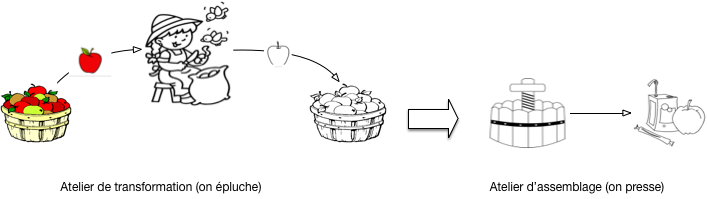
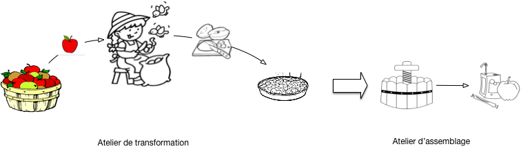
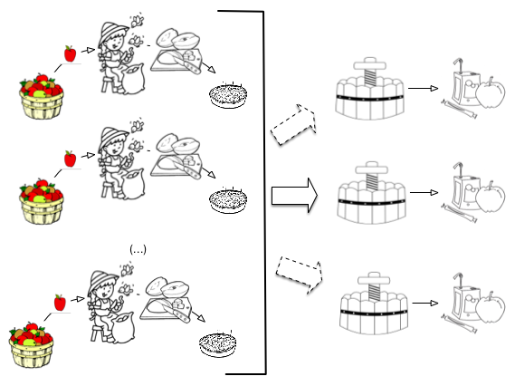
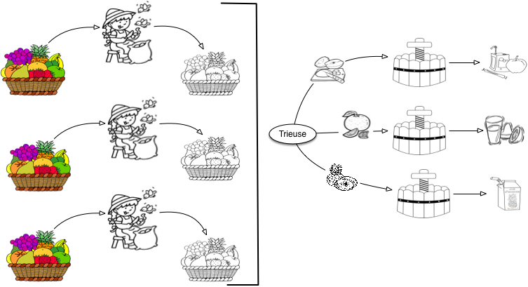
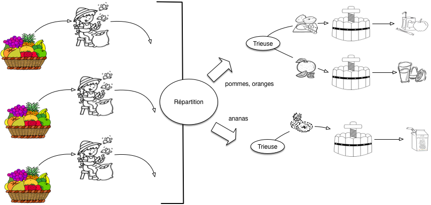
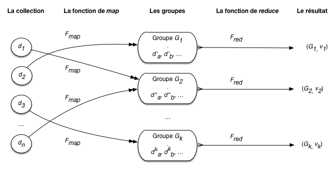
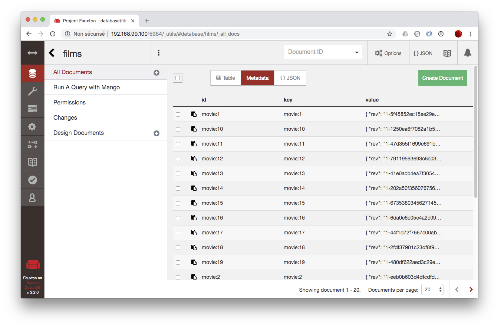
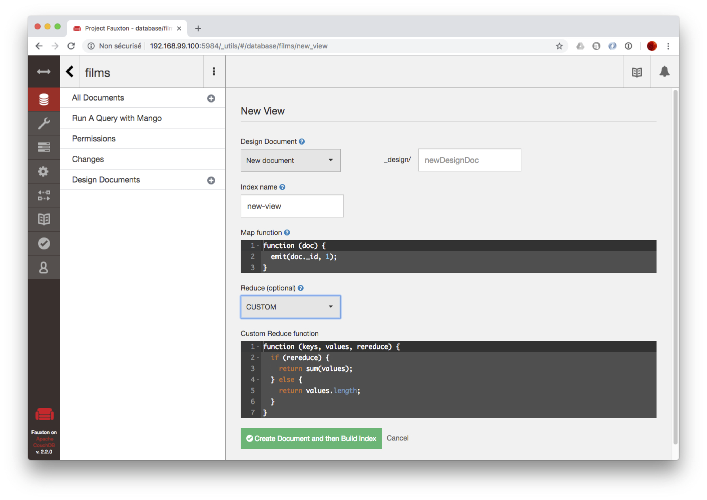
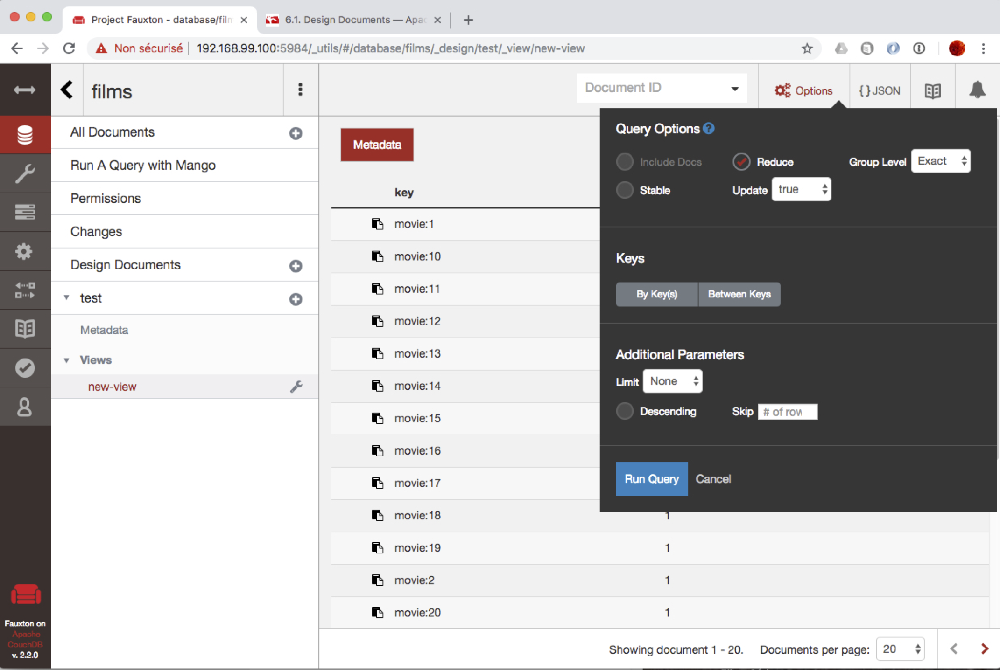
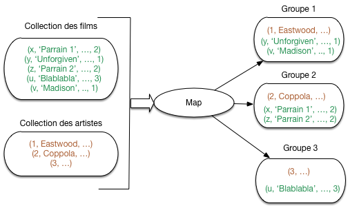

.. _chap-mapreduce:
   
#######################
MapReduce, premiers pas
#######################

.. admonition:: Pour aller plus après ce chapitre

    * `Le cours RCP216 sur la fouille et de la visualisation de données massives  <http://cedric.cnam.fr/vertigo/Cours/RCP216/>`_.
      Complémentaire au cours NFE204, RCP216 aborde beaucoup plus en détails les calculs distribués
      (dont le modèle MapReduce fait partie) en général, et la fouille de données à grande échelle en particulier. 
      Lecture très fortement recommandée après l'introduction du présent chapitre.
 
 
Nous abordons maintenant un processus plus  complet pour le traitement d'une collection,
que nous allons appeler *chaîne de traitement* par traduction de "*data processing pipelines*"
(ou simplement *workflow*).
Le principe général est de soumettre chaque document d'une collection 
à une séquence d'opérations, comme par exemple:

  * un *filtrage*, en ne gardant le document que s'il satisfait certains critères; 
  * une *restructuration*, en changeant la forme du document;
  * une *annotation*, par ajout au document de propriétés calculées;
  * un *regroupement* avec d'autres documents sur certains critères;
  * des *opérations d'agrégation* sur des groupes de documents.
  
Une chaîne de traitement permet *entre autres* de calculer des agrégations, comme
le ``group by`` de SQL.  Leur pouvoir d'expression va au-delà, notamment
par la possibilité d'ajouter en cours de route des attributs calculés, ou
de changer complètement la structure des informations manipulées. Enfin,
et c'est essentiel, ces chaînes sont conçues pour pouvoir s'exécuter
dans un environnement distribué, avec un effet de passage à l'échelle
obtenu par la parallélisation. 

La spécification d'une chaîne de traitement s'appuie sur un paradigme 
nommé MapReduce que nous rencontrerons de manière récurrente. Ce chapitre propose
une présentation détaillé du principe de calcul MapReduce, et une illustration
pratique avec deux systèmes: MongoDB et CouchDB. MapReduce n'est
vraiment intéressant que dans un contexte distribué: cet aspect sera
abordé en profondeur dans le chapitre :ref:`chap-calcdistr`. 
Nous nous en tenons (à l'exception d'une présentation intuitive
dans la première session) au contexte centralisé (un seul serveur) dans ce qui suit,
ce qui permet de se familiariser avec les concepts et la pratique dans un cadre simple.
        
************************
S1: MapReduce démystifié
************************

.. admonition:: Supports complémentaires:

    * `Présentation: MapReduce expliqué avec les mains  <http://b3d.bdpedia.fr/files/slmapreduce.pdf>`_
    * `Vidéo présentant MapReduce <https://mediaserver.cnam.fr/permalink/v125f35a35eefhqfv1so/>`_
  
Commençons par expliquer que MapReduce, en tant que modèle de calcul, ce n'est pas grand chose! 
Cette section propose une découverte "avec les mains", en étudiant comment cuisiner quelques
recettes  simples avec un robot MapReduce. La fin de la section  récapitule en termes
plus informatiques.

Un jus de pomme MapReduce
=========================

Ecartons-nous de l'informatique pour quelques moments. Cela nous laisse un peu
de temps pour faire un bon jus de pomme. Vous savez faire du jus de pomme? C'est simple:

  - l'épluchage: il faut éplucher les pommes une par une;
  - le pressage: on met toutes les pommes dans un pressoir, et on récupère le jus.
  
Le processus est résumé sur la :numref:`juspommeMR`. 
Observons le cuisinier. Il a un tas de pomme à gauche, les prend une par une, épluche
chaque pomme et place la pomme épluchée dans un tas à droite. Quand toutes les pommes
sont épluchées (et pas avant!), on peut commencer 
la seconde phase.

.. _juspommeMR:

   
      Les deux phases de la confection de jus de pomme

Comme notre but est de 
commencer à le  formaliser en un modèle que nous appellerons à la fin *MapReduce*,
nous distinguons précisément la frontière entre les deux phases, et les tâches
effectuées de chaque côté. 

  - À gauche, nous avons donc *l'atelier de transformation*: il consiste en un agent, l'éplucheur,
    qui prend une pomme dans son panier à gauche, produit une pomme épluchée dans un second panier à droite,
    et répète la même action jusqu'à ce que le panier de gauche soit vide.
  - À droite nous avons *l'atelier d'assemblage*: on lui confie un tas de pommes épluchées
    et il produit du jus de pomme.

Nous pouvons déjà tirer deux leçons sur les caractéristiques essentielles de notre
processus élémentaire. La première porte sur l'atelier de transformation qui applique
une opération individuelle à chaque  produit.

.. admonition:: Leçon 1: l'atelier de transformation est centré sur les pommes

   Dans l'atelier de transformation, les pommes sont épluchées *individuellement* et 
   *dans n'importe quel ordre*. 

L'éplucheur ne sait pas combien de pommes il a à éplucher, il se contente de piocher dans 
le panier tant que ce dernier n'est pas vide. De même, il ne sait pas
ce que deviennent les pommes épluchées, il se contente de les transmettre
au processus général.

La seconde leçon porte sur l'atelier d'assemblage qui, au contraire, applique
une transformation aux produits *regroupés*: ici, des tas de pommes.

.. admonition:: Leçon 2: l'atelier d'assemblage est centré sur les tas de pommes

   Dans l'atelier d'assemblage, on applique des transformations
   à des *ensembles* de pommes.
 
Tout celà est assez élémentaire, voyons si nous pouvons faire mieux en 
introduisant une première variante. Au lieu de cuire des pommes entières, on préfère les
couper au préalable en quartiers.  La phase d'épluchage devient une phase 
d'épluchage/découpage. 

Cela ne change pas grand chose, comme le montre la  :numref:`juspommeMR+`. Au lieu d'avoir deux tas
identiques à gauche et à droite avec des pommes, le cuisinier a un tas avec *p* pommes
à gauche et un autre tas avec *4p* quartiers de pommes à droite.

.. _juspommeMR+:

   
      Avec des quartiers de pomme

Cela nous permet quand même de tirer une troisième leçon.

.. admonition:: Leçon 3: la transformation peut modifer le nombre et la nature des produits

   La première phase n'est pas limitée à une 
   transformation un pour un des produits consommés.
   Elle peut prendre en entrée des produits d'une certaine nature (des pommes), sortir
   des produits d'une autre nature (des quartiers de pomme épluchées), et il peut n'y 
   avoir aucun rapport fixe entre le nombre de produits en sortie et le nombre de produits en 
   entrées (on peut jeter des pommes pourries, couper une  petite pomme
   en 4 ou en 6, une grosse pomme en 8, etc.)

Nous avons notre premier processus MapReduce, et nous avons identifié
ses caractéristiques principales. Il devient possible de montrer comment passer à 
grande échelle dans la production de jus de pomme,
sans changer le processus. 

Beaucoup de jus de pomme
========================

Votre jus de pomme  est très bon et vous devez en produire beaucoup: une seule personne ne suffit
plus à la tâche. Heureusement la méthode employée se généralise facilement à une brigade
de *n* éplucheurs.

  - répartissez votre tas de pommes en *n* sous-tas, affectés chacun à un éplucheur;
  - chaque éplucheur effectue la tâche d'épluchage/découpage comme précédemment;
  - regroupez les quartiers de pomme et pressez-les.
  
Il se peut qu'un pressoir ne suffise plus: dans ce cas affectez *c* pressoirs
et répartissez équitablement les quartiers dans chacun. Petit inconvénient: vous obtenez
plusieurs fûts de jus de pomme, un par pressoir, avec une qualité
éventuellement variable. Ce n'est sans doute pas très grave.

.. important:: Notez que cela ne marche que grâce aux caractéristiques identifiées 
   par la leçon N° 1 ci-dessus. Si l'ordre d'épluchage était important par exemple, 
   ce ne serait pas si simple car il faudrait faire attention à ce que l'on confie
   à chaque éplucheur;
   *idem* si l'épluchage d'une pomme dépendait de l'épluchage des autres. 
   
La  :numref:`BigjuspommeMR` montre la nouvelle organisation de vos deux ateliers.
Dans l'atelier de transformation, vous avez *n* éplucheurs qui, chacun, font
*exactement* la même chose qu'avant: ils produisent des tas de quartiers de pomme.
Dans l'atelier d'assemblage, vous avez *r* pressoirs: un au minimum, 2, 3 ou plus
selon les besoins. Attention: il n'y aucune raison d'imposer comme
contrainte que le nombre de pressoirs soit égal au nombre de éplucheurs. Vous
pourriez avoir un très gros pressoir qui suffit à occuper 10 éplucheurs.

.. _BigjuspommeMR:

   
      Parallélisation de la production de jus de pomme

*Vous avez parallélisé votre production de jus de pomme.*  Remarque essentielle:
vous n'avez pas besoin de recruter des éplucheurs  avec des compétences supérieures à celles
de votre atelier artisanal du début. Chaque éplucheur épluche ses pommes et n'a
pas besoin de se soucier de ce que font les autres, à quel rythme ils travaillent,
etc. Vous n'avez pas non plus besoin d'un matériel nouveau
et radicalement plus cher. 

*Vous pouvez même prétendre que la rentabilité économique est préservée*.
Si un éplucheur épluche 50 Kgs de pomme par jour,
10 éplucheurs (avec le matériel correspondant) produiront 500 Kgs par jour! 
C'est aussi une question de matériel à
affecter au processus: il est clair que si vous n'avez qu'un seul économe (le couteau
qui sert à éplucher)  ça ne marche pas. Mais si 
la production de jus de pomme est rentable avec un éplucheur, elle le sera aussi pour 10
avec le matériel correspondant. Nous dirons que le processus est *scalable*, 
et cela vaut une quatrième leçon.

.. admonition:: Leçon 4: parallélisation et scalabilité (linéaire)

   La production de jus de pomme est parallélisable et proportionnelle aux ressources
   (humaines et matérielles) affectées.
  
Votre processus a une seconde caractéristique importante (qui résulte
de la remarque déjà faire que les éplucheurs sont indépendants
les uns des autres). Si un éplucheur éternue
à répétition sur son tas de pomme, s'il épluche mal ou si les quartiers de pomme à
la fin de l'épluchage tombent par terre, cela ne remet pas en cause l'ensemble de la production
mais seulement la petite partie qui lui était affectée. Il suffit de recommencer
cette partie-là. De même, si un pressoir est mal réglé, cela n'affecte pas
le jus de pomme  préparé dans les autres et les dégâts restent *locaux*.   

.. admonition:: Leçon 5: le processus est robuste

   Une défaillance affectant la production de jus de pomme n'a qu'un effet *local*
   et ne remet pas en cause *l'ensemble* de la production.
   
Les leçons 4 et 5 sont les deux propriétés essentielles de MapReduce, 
modèle de traitement qui se prête bien à la distribution des tâches.
Si on pense en terme de puissance ou d'expressivité, cela reste
quand même très limité. Peut-on faire mieux que du jus de pomme?
Oui, en adoptant la petite généralisation suivante.

Jus de fruits MapReduce
=======================

Pourquoi se limiter au jus de pomme? Si vous avez une brigade d'éplucheurs
de premier plan et des pressoirs efficaces, vous pouvez aussi envisager
de produire du jus d'orange, du jus d'ananas, et ainsi de suite. 
Le processus consistant en une double phase de transformation *individuelle*
des ingrédients, puis d'élaboration collective convient tout à fait,
à une adaptation près: comme on ne peut pas presser ensemble des oranges
et les pommes, *il faut ajouter une étape initiale de tri/regroupement* dans l'atelier
d'assemblage.

En revanche,  pendant la première phase, on peut soumettre un tas
indifférencé de pommes/oranges/ananas à un même éplucheur.
L'absence de spécialisation garantit ici une meilleure utilisation de votre brigade,
une meilleure adaptation aux commandes, une meilleure réactivité aux incidents (pannes,
blessures, cf. exercices). 

.. _jusfruits:

   
      Production de jus de fruits en parallèle

La  :numref:`jusfruits` montre une configuration de vos ateliers de production
de jus de fruit, avec 4 ateliers de transformation, et 1 atelier d'assemblage.       

Résumons: chaque éplucheur a à sa gauche un tas de  fruits (pommes, oranges, ananas). 
Il épluche chaque ingrédient, un par un, et les transmet à l'atelier d'assemblage. 
Cet atelier d'assemblage comporte maintenant une trieuse qui envoie chaque fruit
vers un tas homogène, transmis ensuite
à un pressoir dédié. *Le processus reste parallélisable, avec les
mêmes propriétés de scalabilité que précedemment.* Nous avons simplement besoin
d'une opération supplémentaire.

Une question non triviale en générale est celle du critère de tri et de regroupement.
Dans le cas des pommes, oranges et ananas, on peut supposer que l'opérateur
fait facilement la distinction visuellement. Pour des cas plus subtils (vous distinguez
une variété de pomme *Reinette* d'une *Jonagold*?) il nous faut une méthode plus robuste.
Les produits fournis par l'atelier d'assemblage doivent  être *étiquetés* au préalable
par l'opérateur de l'atelier de transformation.  

.. admonition:: Leçon 6: phase de tri / regroupement, étiquetage

   Si les produits doivent être traitées par catégorie, il faut ajouter une
   phase de tri / regroupement au début de l'atelier d'assemblage. Le tri
   s'appuie sur une *étiquette* associée à chaque produit en entrée, indiquant
   le groupe d'appartenance.

Et finalement, comment faire si nous mettons en place *plusieurs* ateliers
d'assemblage? Deux choix sont possibles:

  - *spécialiser* chaque atelier à une ou plusieurs catégories de fruits;
  - *ne pas spécialiser* les ateliers, et simplement répliquer l'organisation
    de la  :numref:`jusfruits` où un atelier d'assemblage sait presser
    tous les types de fruits.
    
Les deux choix se défendent sans doute (cf. exercices), mais dans le modèle
MapReduce, c'est la spécialisation (choix 1) qui s'impose, pour des raisons
qui tiennent aux propriétés des méthodes d'agrégation de données, pas toujours
aussi simple que de mélanger deux jus d'oranges. 
 
Dans une configuration avec plusieurs ateliers d'assemblage, chacun est
donc spécialisé pour traiter une ou plusieurs catégories. Bien entendu, il faut
s'assurer que chaque catégorie est prise en charge par un atelier. C'est le rôle
d'une nouvelle machine, le *répartiteur*, illustré par la  :numref:`jusfruits+`.
Nous avons deux ateliers d'assemblage, le premier prenant en charge les
pommes et les oranges, et le second les ananas.

.. _jusfruits+:

   
      Production en parallèle, avec répartition vers des ateliers d'assemblage spécialisés

C'est fini!
Cette fois nous avons une métaphore complète d'un processus MapReduce dans un contexte Cloud/Big Data.
Tirons une dernière leçon avant de le reformuler en termes abstraits/informatiques.

.. admonition:: Leçon 7: répartition vers les ateliers d'assemblage

   Si nous avons plusieurs ateliers d'assemblage, il faut mettre en place 
   une opération de répartition qui envoie chaque type de fruit vers
   l'atelier spécialisé. Cette opération doit garantir que chaque type
   de fruit a son atelier.
      
On peut envisager de nombreuses variantes qui ne remettent pas en cause le modèle
global d'exécution et de traitement. Une réflexion sur ces variantes est proposée en exercice.

Le modèle MapReduce
===================

Il est temps de prendre un peu de hauteur (?) pour caractériser le modèle MapReduce
en termes informatiques. 

.. important:: Pour l'instant, nous nous concentrons uniquement 
   sur la compréhension de ce que *spécifie* un traitement MapReduce,
   et pas sur la manière dont ce traitement est *exécuté*. Nous savons
   par ce qui précède qu'il est possible de le paralléliser, 
   mais il est également tout à fait autorisé de l'exécuter 
   sur une seule machine en deux étapes. C'est le scénario que nous adoptons
   pour l'instant, jusqu'au moment où nous
   aborderons les calculs distribués dans le chapitre :ref:`chap-calcdistr`. 

Le principe de MapReduce est ancien et provient de la programmation fonctionnelle. Il se résume
ainsi: étant donné une collection *d'items*, on applique à chaque item
un processus de transformation
individuelle (phase dite "de Map") qui produit des *valeurs intermédiaires*
étiquetées. Ces valeurs
intermédiaires sont regroupées par étiquette et soumises à une 
fonction d'assemblage (on parlera plus volontiers d'agrégation en informatique) appliquée
à chaque groupe  (phase dite "de Reduce"). La phase de Map correspond à notre atelier de transformation, 
la phase de Reduce
à notre atelier d'assemblage. 

Reprenons le modèle dans le détail.

.. admonition:: Notion d'item en entrée (document)
  
   Un *item d'entrée* est une valeur quelconque apte à être soumise à la fonction
   de transformation. Dans tout ce qui suit, nos items d'entrée seront des *documents
   structurés*.
   
Dans notre exemple culinaire, les items d'entrées sont les fruits "bruts": pommes, oranges, ananas,
etc. La transformation appliquée aux items est représentée par une fonction de Map.

.. admonition:: Notion de fonction de Map
  
   La fonction de Map, notée :math:`F_{map}` est appliquée à chaque 
   item de la collection, et produit zéro, une ou plusieurs
   valeurs dites "intermédiaires",  placées dans un *accumulateur*.

Dans notre exemple, :math:`F_{map}` est l'épluchage. Pour un même fruit, on produit
plusieurs valeurs (les quartiers), voire aucune si le fruit est pourri. 
L'accumulateur est le tas à droite du cuisinier. 

Il est souvent nécessaire de  *partitionner* les valeurs produites
par le *map* en plusieurs groupes. Il suffit de modifier la fonction 
:math:`F_{map}` pour qu'elle émette non plus une valeur, mais
associe chaque valeur au groupe auquel  elle appartient. 
:math:`F_{map}` produit, pour chaque item, 
une paire *(k, v)*, où *k* est l'identifiant du groupe et
*v* la valeur à placer dans le groupe. L'identifiant du groupe
est déterminé à partir de l'item traité (c'est ce que nous avons informellement appelé "étiquette" dans la 
présentation de l'exemple.)

Dans le modèle
MapReduce, on appelle *paire intermédiaire*  les données
produites par la phase de Map.

.. admonition:: Notion de paire intermédiaire
  
   Une paire intermédiaire est produite par la fonction de Map;
   elle est de la forme *(k, v)* où    *k* est l'identifiant (ou *clé*) d'un groupe  
   et *v* la valeur extraite de l'item d'entrée par :math:`F_{map}`.

Pour notre exemple culinaire, il y a trois groupes, et donc
trois identifiants possibles:  ``pomme``, ``orange``, ``ananas``. 

       
À l'issue de la phase de Map, on dispose donc d'un ensemble de paires
intermédiaires. Chaque paire étant caractérisée par l'identifiant d'un
groupe, on peut constituer les groupes par regroupement sur la
valeur de l'identifiant. On obtient des *groupes intermédiaires*.

.. admonition:: Notion de groupe intermédiaire
  
   Un *groupe intermédiaire* est l'ensemble des valeurs intermédiaires associées
   à une même valeur de clé. 

Nous aurons donc le groupe des quartiers de pomme, le groupe des quartiers
d'orange, et le groupe des rondelles d'ananas. On entre alors dans
la seconde phase, dite de Reduce. La transformation appliquée à chaque
groupe est définie par la fonction de Reduce.

.. admonition:: Notion de fonction de Reduce
  
   La fonction de  Reduce, notée :math:`F_{red}`, est appliquée à chaque 
   groupe intermédiaire et produit une valeur finale. L'ensemble
   des valeurs finales (une pour chaque groupe) constitue le résultat
   du traitement MapReduce.
   
Résumons avec la  :numref:`mapreduce-mongo`, et plaçons-nous
maintenant dans le cadre de nos bases documentaires. Nous avons
une collection de documents :math:`d_1, d_2, \cdots, d_n`. La fonction
:math:`F_{map}` produit des paires intermédiaires sous la
forme de documents :math:`d^j_i`,
dont l'identifiant (:math:`j`) désigne le groupe d'appartenance. 
Notez les doubles flêches: un  document en entrée peut engendrer plusieurs
documents en sortie du *map*. :math:`F_{map}` 
place chaque :math:`d^j_i` dans un groupe :math:`G_j, j \in [1, k]`. Quand
la phase de *map* est terminée (et pas avant!), on peut passer
à la phase de *reduce* qui applique successivement :math:`F_{red}`
aux documents de chaque groupe. On obtient, pour chaque groupe,
une valeur (un document de manière générale) :math:`v_j`.  

.. _mapreduce-mongo:

   
      MapReduce (en centralisé)

Voici pour la théorie. En complément, notons dès maintenant
que ce mécanisme a quelques propriétés intéressantes:

  * il est *générique* et s'applique à de nombreux problèmes,
  * il se *parallélise* très facilement;
  * il est assez tolérant aux pannes dans une contexte distribué.
  
La première propriété doit être fortement relativisée: on ne fait quand
même pas grand chose, en termes d'algorithmique, avec MapReduce et 
il ne faut *surtout* par surestimer  la capacité de ce modèle de calcul
à prendre en charge des traitements complexes.  

Cette limitation est compensée
par la parallélisation et la tolérance aux pannes.
Pour ces derniers aspects,
il est important que chaque document soit traité *indépendamment* du contexte. Concrètement,
l'application de :math:`F_{map}` à un document *d* doit donner un résultat qui
ne dépend ni de la position de *d* dans la collection, ni de ce qui s'est passé
avant ou après dans la chaîne de traitement, ni de la machine ou du système, etc. 
En pratique, cela signifie que
la fonction :math:`F_{map}` ne conserve pas un *état* qui pourrait varier et influer
sur le résultat produit quand elle est appliquée à *d*. 

Si cette propriété n'était
pas respectée, on ne pourrait pas paralléliser et conserver un résultat invariant.
Si :math:`F_{map}` dépendait par exemple du système d'exploitation, de l'heure,
ou de n'importe quelle variable extérieure au document traité (un *état*),
l'exécution en parallèle aboutirait à des résultats non déterministes.

Concevoir un traitement MapReduce
=================================

Quelques conseils pour finir sur la conception d'un traitement MapReduce. En un mot:
c'est très simple, à condition de se poser les bonnes questions et de faire preuve
d'un minimum de rigueur.

Les questions à se poser
------------------------

Questions pour la phase de Map:

  - Il faut être clair sur la nature des documents que l'on traite en entrée. D'où viennent-ils,
    quelle est leur structure? Un traitement MapReduce s'applique à un flux de documents, on
    ne peut rien faire si on ne sait pas en quoi ils consistent.

  - Quels sont les groupes que je veux constituer? Combien y en a-t-il? Comment les
    identifier (valeur de clé identifiant un groupe, l'étiquette)? Comment déterminer 
    le ou les étiquettes d'un ou de plusieurs groupes dans un document en entrée?

  - Quelles sont les valeurs intermédiaires que je veux produire à partir d'un document et
    placer dans des groupes? Comment les produire à partir d'un document?

Ces questions sont nécessaires (et pratiquement suffisantes) pour savoir ce que doit faire
la fonction de Map. Pour la fonction de Reduce, c'est encore plus simple:

  - Quelle est la nature de l'agrégation qui va prendre un groupe et produire une valeur finale?
  
Et c'est tout, il reste à traduire en termes de programmation.

Un peu de rigueur
-----------------

Un traitement MapReduce se spécifie sous la forme de deux fonctions

 - La fonction de Map prend *toujours* en entrée *un* (un seul) document;
   elle produit *toujours* des paires *(k, v)* où *k* est l'étiquette (la clé) du groupe
   et *v* la valeur intermédiaire.
 - La fonction de Reduce prend *toujours* en entrée une paire *(k, list(v))*,
   où *k* est l'étiquette (la clé) du groupe
   et *list(v)* la liste des valeurs du groupe.
   
Spécifier un traitement, c'est donc *toujours* définir deux fonctions avec les caractéristiques
ci-dessus. Le corps de chaque fonction doit indiquer, respectivement:

  - comment on produit des paires *(k, v)* à partir d'un document (fonction de Map, transformation);
  - comment on on produit une valeur agrégée *V* à partir d'uune paire *(k, list(v))*.

Pratiques, réflechissez, vérifiez que vous avez bien compris!

Quiz
====

.. eqt:: mapreduceA-1

    Quelle est l'affirmation *fausse* parmi celles ci-dessous
    
     
    A) :eqt:`C`  Pour un item en entrée, l'atelier de transformation produit exactement un item en sortie
    #) :eqt:`I`  Pour un item en entrée, l'atelier de transformation peut ne produire aucun  item en sortie
    #) :eqt:`I` Pour un item en entrée, l'atelier de transformation peut produire plusieurs items en sortie

.. eqt:: mapreduceA-2

    Quelle est l'affirmation *correcte* parmi celles ci-dessous
    
    A) :eqt:`I`  L'atelier de transformation produit toujours en sortie des items d'une nature (d'un type) différente de ceux en entrée
    #) :eqt:`I`  L'atelier de transformation produit en sortie des items de même nature que ceux en entrée
    #) :eqt:`C` La nature (le type) des items en sortie est indépendant de celle des items en entrée

.. eqt:: mapreduceA-3

    Quand commence l'atelier d'assemblage ?
    
    A) :eqt:`I`  Quand l'atelier de transformation a produit assez d'items pour que ça en vaille la peine
    #) :eqt:`C`  Quand l'atelier de transformation a terminé
    #) :eqt:`I` L'assemblage est effectué en continu 

.. eqt:: mapreduceA-4

    Quelle propriété permet de paralléliser la production ?
    
    A) :eqt:`C`  Aucune coordination n'est nécessaire: il suffit d'ajouter des ateliers, toujours 
       identiques, en fonction des besoins
    #) :eqt:`I`  Chaque atelier se sert dans une corbeille d'entrée commune: on est sûr que chaque item sera traité par l'un deux
    #) :eqt:`I` Tous les ateliers travaillent au même rythme: cela garantit que les
       transformations termineront en même temps

.. eqt:: mapreduceA-5

    Quelle propriété permet de garantir que le processus va toujours finir ?
    
    A) :eqt:`I`  Si un atelier est fiable, tous le seront  puisqu'ils sont tous identiques
    #) :eqt:`C`  L'échec éventuel d'un atelier n'affecte pas les autres: il suffit de recommencer la tâche locale
    #) :eqt:`I` Chaque item en entrée est traité par plusieurs ateliers: on a la garantie presque totale que l'un deux va réussir
       la transformation

.. eqt:: mapreduceA-6

    Quelle extension au processus de base permet d'effectuer des regroupements ?
    
    A) :eqt:`I`  Les items produits par la transformation sont placés dans des conteneurs de taille fixe: chaque
       conteneur correspond à un groupe
    #) :eqt:`I`  L'atelier d'assemblage analyse les items reçus et les répartit en groupe en fonction de leurs caractéristiques
    #) :eqt:`C` Les items produits par la transformation sont étiquetés: chaque étiquette correspond à un groupe
    #) :eqt:`I` Les items en entrée sont répartis sur les ateliers de transformation en fonction de leur type: chaque atelier
       produit un groupe

.. eqt:: mapreduceA-7

    Quel est le rôle des ateliers d'assemblage dans le regroupement ?
    
    A) :eqt:`I`  Chaque atelier peut recevoir n'importe quel groupe 
    #) :eqt:`I`  Chaque atelier peut recevoir des items de n'importe quel groupe, et en renvoie certains 0 d'autres ateliers
    #) :eqt:`C` Chaque atelier ne reçoit que des items  d'un ou plusieurs groupes déterminés  

.. eqt:: mapreduceA-8

    Qu'est-ce qu'une *valeur intermédiaire* ?
    
    A) :eqt:`I`  Une valeur extraite d'un document en entrée 
    #) :eqt:`C`  Une valeur produite par une fonction de Map
    #) :eqt:`I` Une valeur conservée en mémoire entre deux appels à la fonction de Map

.. eqt:: mapreduceA-9

    Qu'est-ce qu'une *paire intermédiaire* ?
    
    A) :eqt:`C`  Une valeur intermédiaire et son étiquette (sa clé)
    #) :eqt:`I`  Une paire de valeurs intermédiaires
    #) :eqt:`I` Une paire constituée d'un item en entrée et de sa valeur transformée 

.. eqt:: mapreduceA-10

    Comment caractériser la fonction de Map ?
    
    A) :eqt:`I`  Elle prend en entrée un ensemble de documents et produit une paire clé-valeur 
    #) :eqt:`C`  Elle prend en entrée un  document et produit des paires clé-valeur 
    #) :eqt:`I`  Elle prend en entrée un  document et produit une valeur intermédiaire

************************
S2: MapReduce et CouchB
************************

.. admonition:: Supports complémentaires

     * `Vidéo présentant la programmation MapReduce avec CouchDB <https://mediaserver.cnam.fr/permalink/v125f35a3aec3j2k2g8x/>`_

CouchDB propose  un moteur d'exécution MapReduce, avec des fonctions javascript,
mais dans un but un peu particulier: celui de créer des collections structurées
dérivées par application d'un traitement MapReduce à une collection stockée. De
telles collections sont appelées *vues* dans CouchDB. Leur contenu  est matérialisé
et maintenu incrémentalement.

Cette section introduit la notion de vue CouchDB, mais se concentre surtout sur la
définition des fonctions de Map et de Reduce qui est rendue très facile grâce
à l'interface graphique de CouchDB. Vous devriez avoir importé la collection des
films dans CouchDB dans une base de données *movies*. C'est celle que nous utilisons,
comme d'habitude, pour les exemples.

La notion de vue dans CouchDB
=============================

Comme dans beaucoup de systèmes NoSQL, une collection CouchDB
n'a pas de schéma et les documents peuvent donc avoir n'importe
quelle structure, ce qui ne va pas sans soulever des problèmes
potentiels pour les applications. CouchDB répond à ce problème
de deux manières: par des fonctions dites de validation, et par la
possibilité de créer des *vues*.

Une vue dans CouchDB est une collection dont les éléments ont
la forme (clé, document). Ces éléments sont *calculés* par un 
traitement MapReduce, stockés (on parle donc de matérialisation,
contrairement à ce qui se fait en relationnel), et maintenus
en phase avec la collection de départ. Les vues permettent de
structurer et d'organiser un contenu.

.. important: Les vues sont indexées sur la clé grâce à un arbre-B,
   ce qui permet d'effectuer des recherches très rapides, y
   compris par intervalle, sur la clé. Cet aspect n'est pas développé
   dans ce qui suit.

La définition d'une vue est stockée dans CouchDB sous la forme
de documents JSON dits "documents de conception" (*design documents*).
Pour tester une nouvelle définition, on peut aussi créer des vues
temporaires: c'est ce qui nous intéresse directement, car nous allons
pouvoir tester le MapReduce de CouchDB grâce à l'interface de définition
de ces vues temporaires

Accédez à l'interface d'administration de CouchDB à l'URL ``_utils``,
puis choisissez la basedes films (que vous devez avoir chargé au cours d'un
exercice précédent). Vous devriez avoir l'affichage de la
:numref:`couch-films`.

.. _couch-films:

   
      La collections *films* vues par l'interface de CouchDB
      
Dans le menu de gauche, choissisez l'option "New view" dans le menu "Design documents". Dans
le menu déroulant "Reduce", choisissez l'option "Custom" pour indiquer
que vous souhaitez définir votre propre fonction de Reduce.

On obtient un formulaire avec deux fenêtres pour, respectivement, les fonctions
de Map et de Reduce (:numref:`couch-view`).

.. _couch-view:

   
      Définition des vues temporaires.

Avant de passer aux fonctions MapReduce, donnez un nom à votre vue 
dans le champ en haut à droite. 

Les fonctions Map et Reduce
===========================

Avec CouchDB, la fonction de Map est obligatoire, contrairement à la fonction de Reduce.
La fonction Map par défaut ne fait rien d'autre qu'émettre les documents de la base,
avec une clé ``null``.

.. code-block:: javascript

    function(doc) {
      emit(null, doc);
    }

Toute fonction de Map prend un document en entrée, et appelle la fonction
``emit`` pour produire des clés intermédiaires.
Produisons une première fonction de Map qui produit une vue dont
la clé est le titre du document, et la valeur le metteur en scène.
    
.. code-block:: javascript

    function(doc)
    {
       emit(doc.title, doc.director)
    }

À vous de tester. Vous devriez (en actionnant le bouton "Create and build index") obtenir l'affichage
de la :numref:`couch-runview`.

.. _couch-runview:

   
      Définition et test d'une vue 

.. important:: Pour être sûr d'activer la fonction de Reduce, cochez la case
   "Reduce" dans l'interface de CouchDB. Cette case se trouve dans la fenietre des options
   (montrée sur la :numref:`couch-runview`).
   
Un deuxième exemple: la vue produit la liste des acteurs (c'est la clé),
chacun associé au film dans lequel il joue (c'est la valeur). C'est un cas
où la fonction de Map émet plusieurs paires intermédiaires.
 
.. code-block:: javascript

    function(doc)
    {           
      for  (i = 0; i < doc.actors.length; i++) {    
         emit({"prénom": doc.actors[i].first_name, "nom": doc.actors[i].last_name}, doc.title) ;         
      }           
   }

On peut remarquer que la clé peut être un document composite. À vous de tester
cette nouvelle vue. Vous remarquerez sans doute que les documents de la vue sont
*triés* sur la clé. C'est un effect indirect de l'organisation sous forme d'arbre-B,
qui repose sur l'ordre des clés indexées. Pour MapReduce, le fait que les
paires intermédiaires soient triées facilite les regroupements sur la clé
puisque les documents à regrouper sont consécutifs dans la liste.

Vérifiez: cherchez dans la liste des documents de la vue Bruce Willis par exemple.
Vous remarquerez qu'il apparaît pour chaque film dans lequel il joue un rôle, 
et que toutes ces occurrences sont en séquence dans la liste. Pour effectuer
ce regroupement, on applique une fonction de Reduce. La voici:

.. code-block:: javascript

    function (key, values) {
      return values.length;
    }

   
À vous de continuer en expérimentant l'interface et en étudiant le résultat intermédiaire
(sans appliquer de fonction Reduce) puis le résultat final.
 
Mise en pratique
================

.. _MEP-S2-1:
.. admonition:: Exercice `MEP-S2-1`_: quelques programmes MapReduce à produire

   Outre les commandes de découverte de CouchDB décrites précédemment, voici quelques programmes à produire
   
      - Donnez, pour chaque année, le nombre de films parus cette année-là. Puis donnez
        pour chaque année la liste des titres de ces films.
      - Donnez, pour chaque metteur en scène, la liste des films qu'il a réalisés.

***********************************
S3: *Frameworks* MapReduce: MongoDB
***********************************

.. admonition:: Supports complémentaires:

     * `Présentation: MapReduce et MongoDB  <http://b3d.bdpedia.fr/files/slmongomr.pdf>`_
     * `Vidéo présentant la programmation MapReduce avec MongoDB <https://mediaserver.cnam.fr/permalink/v125f35a35fc7ddbt3to/>`_
    
Passons à la pratique, en restant dans un contexte centralisé, avec MongoDB.
MongoDB est un des exemples de *framework* MapReduce. Commençons par une petite
discussion sur cette notion de *framework* avant de passer à la pratique.
MongoDB dispose d'un
moteur de calcul MapReduce qui est relativement facile à expérimenter. Les fonctions
de Map et de Reduce sont codées en javascript, et il est possible de les tester
localement sans recourir un une grappe de serveurs et à du *Big Data*. Nous donnons
ci-dessus les fonctions complètes et le mode d'emploi: avec un peu d'agilité
vous pouvez copier/coller les exemples et les modifier pour vos tests.

*Frameworks* MapReduce
======================

La programmation d'un traitement MapReduce requiert l'utilisation d'un 
environnement de programmation spécialisé (ou *framework*). 

Regardez une nouvelle fois la  :numref:`jusfruits+`. Elle comprend
beaucoup de composants, de mécanismes appliqués successivement aux données
transformées, regroupées, distribuées dans un flux complexe. S'il fallait
implanter tout cela pour chaque traitement, ce serait extrêmement lourd et 
peu productif. Dans un *framework* MapReduce, tout ce qui est générique est
pris en charge, et notamment  toute l'organisation et la gestion de la répartition
des traitements, quand on est dans un contexte distribué. De fait, avec
un tel environnement, le programmeur se contente de définir la partie
purement *fonctionnelle* du traitement: la fonction de Map, :math:`F_{map}`,
et la fonction de Reduce, :math:`F_{red}`. 

.. note:: Pour votre culture: la caractérisation d'un *framework* (du moins
   quand on est attaché à utiliser un vocabulaire précis) est justement celle d'un environnement
   basé sur un modèle d'exécution pré-défini. Ce modèle applique des fonctions fournies
   par le développeur qui n'est donc pas en charge du *contrôle* (pris en charge par
   le framework) mais de la *spécification*. On parle *d'inversion de contrôle*,
   et un exemple typique est fourni par les *frameworks* MVC. Fin de la parenthèse.

Pour reprendre une dernière
fois notre métaphore culinaire, c'est comme si vous décidiez de confier
à un sous-traitant l'organisation de vos ateliers. Votre seul rôle
est de former les cuisiniers qui travaillent dans cet atelier aux 
tâches "métier", celles qui constituent vraiment le cœur de vos compétences.

Un traitement MapReduce repose sur la notion de *fonction de second ordre*.
Pas de panique: cela signifie simplement que l'environnement
(*framework*) fournit deux fonctions, *map()* et *reduce()*, qui prennent
chacune en entrée, respectivement, les fonctions  :math:`F_{map}`
et :math:`F_{red}` mentionnées ci-dessus. Ce sont des fonctions qui 
prennent en argument d'autres fonctions et les appliquent aux données,
d'où la notion de "second-ordre".

Quittons la cuisine avec un exemple très simple de calcul:  on veut 
compter le nombre de fruits sains (on rejette les fruits pourris)
par type de fruit.

Durant la phase de *Map*, notre opérateur va examiner les fruits un
par un, et placer un jeton dans la corbeille à sa droite pour chaque
fruit sain: c'est la valeur. Il faut aussi dire pour quel type
de fruit on produit cette valeur: c'est la clé. 

Il faut fournir ces deux fonctions au *framework*, qui se charge du reste.
En MapReduce, la fonction de Map est

.. code-block:: javascript

   function controleFruit (fruit)
   {
      if (fruit.statut != pourri) {
        emit (fruit.type, 1)
      }
   }

et la fonction de Reduce:

.. code-block:: javascript

   function compterPomme (typeFruit, groupe)
   {
     return <typeFruit, sum(groupe)>
   }

On a l'équivalent de la requête SQL suivante.

.. code-block:: sql

   select count(*) from Fruits group by type 

MapReduce  s'apparente au *group by* dans le mécanisme de calcul, mais
la possibilité d'appliquer des fonctions quelconques, et 
celle de restructurer complètement les données pendant la phase de *map*,
le rendent beaucoup plus puissant. En contrepartie, *ce n'est pas
un langage de requête*, mais une méthode de spécification de traitements
distribués qui évite au programmeur de prendre en charge les aspects
"parallélisme" et "distribution". 

.. note:: Une fonction de Map "émet" des paires intermédiaires. Cette notion "d'émission"
   (au lieu du traditionnel ``return``) suggère le fonctionnement distribué du système:
   la paire intermédiaire est transmise au *framework* qui se charge de la router
   vers le destinataire adéquat.
     
Mon premier traitement MapReduce/MongoDB
========================================

Nous allons produire un document par réalisateur, avec la liste
des films qu'il/elle a réalisé. Conceptuellement, nous créons
un groupe par réalisateur, plaçons dans ce groupe les films
pendant la phase de *map* et construisons le document final dans la phase
de *reduce*. 

La spécification consiste à définir les deux fonctions
à appliquer (:math:`F_{map}` et :math:`F_{red}`).
Voici la fonction de *map*.

.. code-block:: javascript

    var mapRealisateur = function() {
                  emit(this.director._id, this.title);
          };
          
En javascript, les fonctions peuvent se stocker dans des variables. 
L'instruction ``emit`` produit une paire (clé, valeur), constituée
ici de l'identifiant du réalisateur, et du titre du film. Notez
que la fonction ne prend aucun argument: implictement, elle
dispose comme contexte du document auquel elle s'applique,
désigné par ``this``. Et c'est tout.

Voici la fonction de *reduce*.

.. code-block:: javascript
          
   var reduceRealisateur = function(directorId, titres) {
      var res = new Object();
      res.director = directorId;
      res.films = titres;
      return res;
    };

Une fonction de *reduce* prend deux arguments: l'identifiant du groupe auquel elle
s'applique (ici, ``directorId``) et la liste (un tableau en javascript)
des valeurs produites par le *map*.

Dans notre exemple, nous construisons la valeur de résultat comme
un objet ``res`` auquel on affecte deux propriétés: ``director`` 
et ``titres``.

.. note:: Le code donné ici correspond à une mise en œuvre des principes standards
   de MapReduce, ceux qu'ils faut comprendre et connaître. C'est celui rencontré en pratique 
   dans les systèmes comme Hadoop, Spark ou Flink.
   
   MongoDB présente quelques spécificités qu'il est inutile de mémoriser tant que vous n'avez 
   pas à utiliser ce système au-delà d'une formation. En particulier, 
   
     - les fonctions Map et Reduce devraient
       retourner le même type de données pour fonctionner en toutes circonstances. 
     - la fonction de Reduce n'est pas appelée pour les valeurs de clés qui ne sont 
       pas associées à plusieurs valeurs. Lire
       https://docs.mongodb.com/manual/reference/command/mapReduce/#mapreduce-reduce-cmd

À l'échelle à laquelle nous travaillons, 
vous pouvez ignorer ces spécificités et vous concentrer sur le principe du fonctionnement.
   

Il ne reste plus qu'à lancer un traitement, avec la fonction ``mapReduce``
sur la collection ``movies``. Voici la syntaxe.

.. code-block:: javascript
          
    db.movies.mapReduce(mapRealisateur,  reduceRealisateur, {out: {"inline": 1}} )

Le premier paramètre est la fonction de *map*, le second la fonction de *reduce*,
et le troisième indique la sortie, ici l'écran.

À ce stade vous brûlez sans doute d'envie de tester cette exécution. Allez-y: vous
devriez obtenir, pour chaque groupe, un résultat de la forme suivante.

.. code-block:: javascript

		{
			"_id" : "artist:3",
			"value" : {
				"director" : "artist:3",
				"films" : [
					"Vertigo",
					"Psychose",
					"Les oiseaux",
					"Pas de printemps pour Marnie",
					"Fenêtre sur cour",
					"La mort aux trousses"
				]
			}
		}
    
Devinez de quel réalisateur il s'agit? Ici, ça se devine (?), mais en général on
aimerait bien disposer au moins du nom. Reportez-vous aux exercices.

MongoDB propose plusieurs options pour l'exécution d'un traitement
MapReduce. La plus utile (et la plus générale, présente dans tous
les systèmes) consiste à prendre en entrée non pas une collection
entière, mais le résultat d'une requête. On passe pour cela un objet
``query`` dans le document-paramètre en troisième position. Voici
un exemple. 

.. code-block:: javascript

    db.movies.mapReduce(mapRealisateur,  reduceRealisateur, 
             {out: {"inline": 1}, query: {"country": "USA"}} )

Une autre possibilité intéressante est le calcul *incrémental*
d'un traitement MapReduce. En bref, on peut stocker le
résultat dans une nouvelle collection, et mettre à jour
cette collection, sans avoir à tout recalculer, quand de nouveaux
documents apparaissent dans la collection en entrée. Il
s'agit d'une spécificité MongoDB, donc nous n'allons
pas insister dessus: reportez-vous à la documentation.

Jointures avec MapReduce
========================

MapReduce est un mécanisme de base qui peut être utilisé pour implanter
des opérateurs de plus haut niveau. La méthode utilisée pour transposer
une opération comme la jointure en MapReduce n'est pas forcément
très élégante, mais elle a le mérite de bénéficier de la *scalabilité*
du calcul (par parallélisation/distribution) dans des systèmes conçus
pour gérer de grands vollumes de données. Elle est aussi représentative
de la transposition en MapReduce de traitements plus sophistiqués,
même si elle passe par des contournements peu satisfaisants.

Nous montrons donc cette méthode. Notre
base est celle contenant les films *avec références*, et nous avons déjà
vu que la technique consistant à implanter côté client, bien
qu'effective, ne passe pas à l'échelle.
Le but est  d'obtenir pour chaque artiste la liste des films qu'il/elle a réalisé.

Comment faire? Le principe de la jointure avec MapReduce est d'exploiter
le mécanisme de regroupement pour associer, dans un même groupe, un réalisateur
et les films dont il est metteur en scène. Regardons la figure :ref:`jointure-mr`. Nous
avons au départ deux collections distinctes: les films et les artistes. Les artistes
ont un identifiant, et pour chaque film on connaît l'identifiant de son
artiste-réalisateur. 

.. _jointure-mr:

   
      MapReduce (en centralisé)
      
On va créer autant de groupes que d'artiste. Dans chaque groupe on place:

  - l'artiste dont l'identifiant correspond à l'identifiant du groupe;
  - les films (0, 1 ou plusieurs) dont l'identifiant *du metteur en scène*
    correspond à l'identifiant du groupe.

Les documents issus de collections différentes (représentés
par des couleurs distinctes dans la figure) sont
alors associés dans un même groupe.
La fonction de Reduce recevra chaque groupe, avec un artiste et 
0, 1 ou plusieurs films. Elle devra construire le document final.

*Tous les secrets (il y en a peu) de la conception d'un traitement MapReduce          
sont exposés dans cet exemple.* Le mot-clé est *regroupement* des 
documents qui doivent être traités ensemble, puis implantation de ce traitement dans
la fonction de Reduce. Imprégnez-vous bien du principe ci-dessus, qui résume
vraiment l'essentiel de ce qu'il faut comprendre.

Passons à la pratique, avec comme toujours des détails d'implantation qui vont du compliqué
au peu glorieux.
Première étape: nous devons accéder  dans un même traitement MapReduce
aux films (dans *movies*) et aux artistes (dans *artists*). Malheureusement,
le MapReduce de MongoDB semble ne pouvoir prendre qu'une seule collection
en entrée (les autres systèmes n'ont pas cette limitation). Nous 
allons donc commencer par copier les données dans une collection commune,
nommée *jointure*:

.. code-block:: bash

     mongoimport -d moviesref -c jointure --file movies-refs.json --jsonArray
     mongoimport -d moviesref -c jointure --file artists.json --jsonArray
  
Voici maintenant le code des deux fonctions de *map* et de *reduce*. La fonction de
*map* est donnée ci-dessous: essayez de la comprendre, en vous aidant
des commentaires internes donnés par la suite.

.. code-block:: javascript
 
    var mapJoin = function() {
      // Est-ce que la clé du document contient le mot "artist"?
      if (this._id.indexOf("artist") != -1) {
        // Oui ! C'est un artiste. Ajoutons-lui son type.
        this.type="artist";        
        // On produit une paire avec pour clé celle de l'artiste
        emit(this._id, this);
      }
      else {
        // Non: c'est un film. Ajoutons-lui son type.
       this.type="film";
       // Simplifions un peu le document pour l'affichage
       delete this.summary;
       delete this.actors;
        // On produit une paire avec pour clé celle du metteur en scène
       emit(this.director._id, this);
     }
    };

Donc, la fonction s'appliquera en entrée à notre collection *jointure* qui contient
maintenant des documents *artistes* et des documents *films*. La fonction
doit d'abord savoir à quel type de document elle  a affaire. Dans notre cas, c'est
simple, les clés des artistes sont de la forme ``artist:xx`` et les
clés des films de la forme ``movie:yy``. C'est ce que teste la fonction
Javascript *indexOf*.

La fonction produit donc, à l'attention du *reduce*, soit un document 
*artist*, soit un document *film* (notez que nous les "annotons"
avec leur type pour rendre les choses plus faciles ensuite). Nous voulons regrouper les
metteurs en scène avec les films qu'ils/elles ont réalisés: *on
y arrive en émettant les documents à  regrouper avec la même valeur
de clé*.

Ici, on émet les artistes avec leur identifiant, et les films avec l'identifiant
de leur metteur en scène. Le résultat est donc bien celui souhaité. Si cela
vous semble obscur, réfléchissez soigneusement et prenez un exemple.

.. note:: Et pour les artistes qui n'ont jamais réalisé de film? Et bien ils
   seront solitaires dans leur groupe. On n'a pas vraiment moyen de les éliminer
   à ce stade, car on ne sait pas décider si un artiste, considéré isolément, est
   ou non un réalisateur.
   
*Il s'agit du mécanisme de base d'une implantation à base de MapReduce*. Le préalable
à toute manipulation conjointe de documents distincts est de le regrouper
avec le *map* pour les traiter ensemble avec le *reduce*.   

Voici maintenant la fonction de *reduce*.

.. code-block:: javascript
          
   var reduceJoin = function(id, items) {
   
     var director = null, films={result: []}
      
     // Commençons par chercher l'artiste dans cette liste    
     for (var idx = 0; idx < items.length; idx++) {
       if (items[idx].type=="artist") {
            director = items[idx];
        }
     }             
           
     // Maintenant, 'director' contient l'artiste : on l'affecte aux films   
     for (var idx = 0; idx < items.length; idx++) {
        if (items[idx].type=="film"  && director != null) {
            items[idx].director = director;
            films.result.push (items[idx]);
         }             
      }
      return films; 
    };

On dispose en entrée d'une liste "d'items", dont on sait qu'elle contient
un artiste (au plus) et des films (peut-être aucun, peut-être plusieurs).
On effectue donc la jointure *localement*. On identifie d'abord le metteur
en scène, et on le place dans la variable ``director``. Puis on affecte
ce document à l'attribut ``director`` de chaque film. 

On retourne finalement un objet ``films`` contenant le résultat de la jointure
locale. Pour des raisons liées à des limitations du MapReduce sous MongoDB, nous
ne pouvons pas (i) émettre plusieurs documents dans une exécution de
la fonction ou même (ii) émettre un tableau de documents. Nous avons
donc dû "encapsuler" ce tableau dans la valeur retournée. Vous étiez
prévenu: ce n'est pas très élégant.

Il reste à exécuter ce traitement MapReduce, avec l'instruction suivante.

.. code-block:: javascript
 
    db.jointure.mapReduce(mapJoin, reduceJoin, {out: {"inline": 1}});

Regardez bien le résultat. La fonction de *reduce* produit des paires clé-valeur,
la clé étant l'identifiant de l'artiste, et la valeur est celle produite par
notre fonction *reduce()*. Dans le cas des artistes qui ne sont pas réalisateurs,
l'artiste est émis tel quel: MongoDB n'appelle pas la fonction *reduce()*
pour des groupes contenant un seul document.

*Ce qu'il faut retenir avant tout*, c'est le mécanisme qui permet d'associer
des documents initialement distincts. MapReduce n'étant pas conçu (au départ) pour
ce genre de manipulation, il faut accepter quelques inconvénients, et bricoler quelque
peu. Ici, l'application client devrait "nettoyer" le résultat obtenu, mais pour
l'essentiel l'objectif visé est atteint.

Mise en pratique
================

Voici quelques fonctions MapReduce à réaliser avec MongoDB.

.. _Ex-S3-1:
.. admonition:: Exercice `Ex-S3-1`_: implanter le *sum()*.

    Implantez en MapReduce le calcul équivalent à
    
    .. code-block:: sql
    
          select count(*) from movies group by genre
          
    .. ifconfig:: mongomapreduce in ('public')

        .. admonition:: Correction
           
           .. code-block:: javascript

                var mapFilmsGenre = function() {
                    emit(this.genre,this._id);
                };
        
                var reduceFilmsGenre = function(genre,id) {
                   return id.length;
                 };

            db.movies.mapReduce(mapFilmsGenre,  
                            reduceFilmsGenre, {out: {"inline": 1}} );

.. _Ex-S3-2:
.. admonition:: Exercice `Ex-S3-2`_:  afficher le nom du réalisateur

    Reprenez l'exemple (mapRealisateur, joinRealisateur), et effectuez
    les modifications suivantes:
    
      * modifiez les fonctions pour afficher le *nom* du réalisateur avec la liste de ses films.
        (Astuce: la clé émise par la fonction de *map* peut être un *objet* avec plusieurs valeurs).
      * appliquez le traitement aux films français parus avant 2000 (attention, les années
        sont codées comme des chaînes de caractères).
     
.. _Ex-S3-3:
.. admonition:: Exercice `Ex-S3-3`_:  compter les termes d'un texte

   Objectif: construire un groupe pour chaque terme (mot) apparaissant
   dans le titre d'un film, et lui associer des informations. Voici une version
   de base. La fonction de *map*:
   
    .. code-block:: javascript
   
       var mapTermes = function() {
         var tokens = this.title.match(/\S+/g)
         for (var i = 0; i < tokens.length; i++) { 
                  emit(tokens[i], this.title);
          }
       }

   La fonction de *reduce*:
             
    .. code-block:: javascript
  
       var reduceTermes = function(terme, titres) {
          var res = new Object();
          res.terme = terme;
          res.titres = titres;
          return res;
       };
   
   Commencez par vérifier que cela fonctionne, regardez les mots qui apparaissent dans
   plusieurs titres. Ensuite, traitez le *résumé* de chaque film, et faites les calculs
   suivants:
   
     * Pour chaque terme, affichez le titre du film et le nombre d'occurrences dans le résumé
       du film.
     * Pour chaque terme, affichez de plus le nombre total d'occurences du terme dans la collection.
     * Enfin, identifiez les termes qui apparaissent très souvent et sont peu significatifs
       ("de", "un", "le", etc.). Faitez-en une liste et éliminez-les du résultat.
      
    Quand vous serez arrivés au bout, vous aurez fait un bon pas vers un algorithme
    de construction d'un index plein texte sur votre base documentaire.
 
.. _Ex-S3-4:
.. admonition:: Exercice `Ex-S3-4`_:  classification de documents (basique)

   Nous voulons grouper les films. Ecrivez le traitement MapReduce pour
   
     * un classement par genre,
     * un classement par décennie (les années 70, les années 80, etc.)
     
   Si vous vous sentez en forme, réflechissez au problème suivant: comment
   appliquer un algorithme de classification kMeans sur les films (pour
   les grouper par période par exemple) ou les artistes (les grouper
   par génération par exemple). Bon *brainstorming*, mais pas d'inquiétude,
   nous y reviendrons.  
 
.. _Ex-S3-5:
.. admonition:: Exercice `Ex-S3-5`_:  encore une jointure
 
   Reprenez l'implantation de la jointure décrite précédemment, et
   transformez-la pour calculer celle des films et des *acteurs*.
   
   .. code-block:: sql

       select * from Film, Role, Artiste 
       where film.id=role.id_film 
       and role.id_acteur=artiste.id

   C'est plus difficile que de faire la jointure entre le film et le metteur en scène...

   .. ifconfig:: mongomapreduce in ('public')

        .. admonition:: Correction
           
           .. code-block:: javascript

                var mapJoin2 = function() {
                // Est-ce que la clé du document contient le mot "artist"?
                if (this._id.indexOf("artist") != -1) {
                    // Oui ! C'est un artiste. Ajoutons-lui son type.
                    this.type="artist";
                    // On produit une paire avec pour clé celle de l'artiste
                    emit(this._id, this);
                 }
                else {
                    // Non: c'est un film. Ajoutons-lui son type.
                    this.type="film";
                    // Simplifions un peu le document pour l'affichage
                    delete this.summary;
                    delete this.director;
                    // On produit une paire avec pour clé celle de l'artiste
                    for (var i = 0; i < this.actors.length; i++) {
                        emit(this.actors[i]._id, this);
                  }
                }
            };

            var reduceJoin2 = function(id, items) {
                var ARTIST = null, films={result: []}
                var trouve=false;
                // Commençons par chercher l'artiste dans cette liste
                for (var idx = 0; idx < items.length; idx++) {
                  if (items[idx].type=="artist") {
                    artiste = items[idx].last_name;
                   }
                 }
                 
                 if (artiste != null) {
                    res= new Object();
                    res.artiste = artiste ;
                    res.films = new Array()
                   // Maintenant constituons le tableau des films
                   for (var idx2 = 0; idx2 < items.length; idx2++) {
                     if (items[idx2].type=="film") {
                            res.fils.push(items[idx2].title);
                        }
                    }
                  } 
                  return res
             }

*********
Exercices
*********

Commençons par un exercice-type commenté.

.. _Ex-Exo-type:
.. admonition:: Exercice `Ex-Exo-type`_: exercice-type MapReduce

    **Enoncé**.
    
    L'énoncé est le suivant (il provient d'un examen des annales). Un système d'observation spatiale capte 
    des signaux en provenance de planètes situées dans de lointaines galaxies.  Ces signaux sont stockés dans une 
    collection *Signaux* de la forme  *(idPlanète, date, contenu)*.
    
    *Le but est de déterminer si ces signaux peuvent être émis par une intelligence extra-terrestre*.
    Pour cela les scientifiques ont mis au point les fonctions suivantes:

        #. *Fonction de structure*: :math:`f_S(c): Bool`, prend un contenu en entrée, et renvoie  ``true``
           si le contenu présente une certaine structure, ``false`` sinon.
        #. *Fonction de détecteur d'Aliens*: :math:`f_D(<c>): real`, prend une liste de contenus 
           *structurés* en entrée, et renvoie un indicateur entre 0 et 1 indiquant la probabilité que ces contenus 
           soient écrits en  langage extra-terrrestre, et donc la *présence d'Aliens*!

    
    Bien entendu, il y a beaucoup de signaux: c'est du Big Data. Le but est de produire 
    une spécification MapReduce
    qui  produit, pour chaque planète, l'indicateur de présence d'Aliens
    par analyse des contenus provenant de la planète.

    **Correction**.

    D'abord il faut se mettre en tête la forme des documents de la collection. En JSON ça ressemblerait à ça:
    
    .. code-block:: json
    
        {"idPlanète" : "Moebius 756",
          "date": "24/02/2067",
          "contenu": "Xioinpoi <ubnnio 3980nklkn"
          }

    Nous savons que la fonction de Map reçoit un document de ce type, et doit émettre 
    0, 1 ou plusieurs paires clé-valeur. *La première question à se poser c'est: quels sont
    les groupes que je dois constituer* et quelle est la clé ("l'étiquette") qui
    caractérise ces groupes. Rappelons que MapReduce c'est avant tout un moyen
    de regrouper des données (ou des quartiers de pomme, ou  d'ananas, etc.).
    
    Ici on a un groupe par planète. La clé du groupe est évidemment l'identifiant
    de la planète. Le squelette de notre fonction de Map est donc:
    
    .. code-block:: javascript
    
        function fMap(doc) {
             emit(doc.idPlanète, qqChose);
        }

    Ici c'est écrit en Javascript mais n'importe quel pseudo-code équivalent (ou du Java, ou du Scala, ou
    même du PHP...) fait l'affaire.
    
    Quelle est la valeur à émettre? Ici il faut penser que la fonction de Reduce recevra une liste
    de ces valeurs et devra produire une valeur agrégée. Dans notre énoncé la valeur agrégée est
    un indicateur de présence d'Aliens, et cet indicateur est produit sur une liste
    de contenus structurés.
    
    La fonction de Map doit donc émettre un contenu structuré. Comme tous ne le sont pas,
    on va appliquer la fonction :math:`f_S(c): Bool` (si elle est citée dans l'énoncé, c'est qu'elle
    sert à quelque chose). Ce qui donne
    
    .. code-block:: javascript
    
        function fMap(doc) {
            if (fS(doc.contenu) == True) {
                emit(doc.idPlanète, doc.contenu)
            }
        }

    Notez bien que la fonction ne peut et ne doit accéder qu'aux informations du document (sauf
    cas de variables globale qui serait précisée).
    
    Il ne reste plus qu'à écrire la fonction de Reduce. Elle reçoit *toujours* 
    la clé d'un groupe et la liste des valeurs affectées à ce groupe. C'est l'occasion d'utiliser la seconde
    fonction de l'énoncé:
   
    .. code-block:: javascript
    
            function fReduce(idPlanète, contenusStruct) {
                return (idPlanète, fD(contenusStruct))
            }
        }
    
    C'est tout (pour cette fois). L'exemple est assez trivial, mais les mêmes principes 
    s'appliquent toujours.
    
      
.. _Ex-S1-1:
.. admonition:: Exercice `Ex-S1-1`_: production de jus de fruits: les variantes

   Proposons des variantes à notre processus de production de jus de fruit
   tel qu'il est résumé par la  :numref:`jusfruits+`. Pour chaque variante envisagée
   réfléchissez à ses avantages / inconvénients et exposez vos arguments.
   
     - peut-on trier les fruits à la fin de l'atelier de transformation, plutôt
       qu'au début de l'atelier d'assemblage? 
     - et si on triait les fruits *avant* de les soumettre à l'atelier de 
       transformation?
     - dans l'atelier d'assemblage, peut-on avoir un seul pressoir, ou faut-il
       autant de pressoirs que de types de fruits?
     - peut-on toujours se contenter d'un seul atelier d'assemblage? 
     - discuter de la spécialisation des ateliers d'assemblage: MapReduce
       affecte chaque groupe à un seul atelier; pourrait-on
       produire du jus d'orange dans chaque atelier? Avantages? 
       Inconvénients?
              
   .. ifconfig:: mrbasic in ('public')

      .. admonition:: Correction
 
         * On peut trier à la fin de la transformation, mais ça ne suffit
           pas: il faut également fusionner les listes triées provenant
           d'ateliers de transformation distinct avant l'assemblage. Il
           est beaucoup plus efficace de fusionner des listes triées
           que des listes non triées, donc on peut considérer que c'est 
           une option à considérer.
         * Rien ne dit que l'atelier de transformation va produire des fruits
           en sortie, même s'il en a en entrée. Donc ça ne sert à rien de trier
           (sauf cas particulier).
         * On peut avoir plusieurs pressoirs. En fait, en général on
           ne peut pas prévoir le nombre de groupes, et donc
           le nombre de pressoirs. Un même tâche effectue donc
           plusieurs assemblages, en séquence.
         * Oui, on peut toujours se contenter, fonctionnellement, d'un
           seul atelier d'assemblage. Il faut prendre garde à ce que
           ça ne devienne pas un goulot d'étranglement.  
         * Dans un contexte de gestion de données, il est impératif
           d'agréger tous les documents d'un même groupe ensemble. Beaucoup
           de calcul statistiques ne sont pas additifs (la somme des
           moyennes et la moyenne des sommes diffèrent) et on ne peut donc
           pas manipuler des agrégations partielles.

.. _Ex-S1-2:
.. admonition:: Exercice `Ex-S1-2`_: commençons à parler informatique

   Vous avez un ensemble de documents textuels, et vous voulez connaître la fréquence
   d'utilisation de chaque mot. Si, par exemple, le mot "confiture" apparaît 1 fois
   dans le document A, deux fois dans le document B et 1 fois dans le document C,
   vous voulez obtenir (confiture, 4).
   
   Quel est le processus Map Reduce qui prend en entrée les documents et fournit en sortie
   les paires (mot, fréquence)?  Décrivez-le avec des petits dessins si vous voulez.
   
   NB : ce genre de calcul est à la base de nombreux algorithmes d'analyse, et sert
   par exemple à construire des moteurs de recherche.
   
   
   .. ifconfig:: mrbasic in ('public')

      .. admonition:: Correction
 
         Supposons que le format des documents est le suivant
         
         .. code-block:: json
    
            {"texte" : "Bla farine bla confiture bla sucre bla confiture ..."}
         
         Il faut découper chaque texte en mots, associés à leur nombre d'occurrences
         dans le texte. Par exemple, (confiture, 2) si le mot apparaît deux fois. L'important
         est de comprendre que le critère de regroupement (l'étiquette) est le mot. Pour chaque
         mot on "émet" la paire (mot, nbOccurrences). 
         
                         
         .. code-block:: javascript
                
                    function fonctionMap (doc) 
                    {
                      // On parcourt les mots du texte
                      for (mot in doc.texte) { 
                         emit (mot, 1)
                      }
                    }

         À noter: on émet plusieurs paires (clé, valeur) par document, autant qu'il y a de mots
         dans le document. Pour un même mot *m*, on émettra donc autant de fois *(m, 1)* 
         qu'il y a d'occurrences de *m*.
         
         Noter aussi que dans une spécification de haut niveau, on n'a pas besoin d'indiquer
         comment on découpe un texte en mot. Ca se fera au moment de l'implantation.
         
         La phase d'agrégation se charge de cumuler les
         occurrences d'un même mot sur l'ensemble des documents.
         
         .. code-block:: javascript
                
                    function fonctionReduce (mot, occurrences) 
                    {
                       return (mot, count (occurrences))
                    }
         
   

.. _Ex-S1-3:
.. admonition:: Exercice `Ex-S1-3`_: continuons l'examen du 16 juin 2016

   Reprenons les documents représentant les inscriptions des étudiants à des UEs. Voici deux exemples.

    .. code-block:: javascript

        {
          "_id": 978,
          "nom": "Jean Dujardin",
          "UE": [{"id": "ue:11", "titre": "Java", "note": 12},
                {"id": "ue:27", "titre": "Bases de données", "note": 17},
                {"id": "ue:37",  "titre": "Réseaux", "note": 14} 
                ]
        }
        
        {
          "_id": 476,
           "nom": "Vanessa Paradis",
           "UE": [{"id":  "ue:13",  "titre": "Méthodologie", "note": 17,
                  {"id": "ue:27",  "titre": "Bases de données", "note": 10},
                  {"id":  "ue:76",   "titre": "Conduite projet", "note": 11} 
                 ]
        }
    
    Spécifiez le calcul du nombre d'étudiants par UE, en MapReduce, 
    en prenant en entrée des documents construits sur le modèle ci-dessus.
   
  
    .. ifconfig:: mrbasic in ('public')
   
        .. admonition:: Correction

                Une fonction de Map produit des paires (clé, valeur). La première
                question à se poser c'est: quelle est la clé que je choisis de produire?
                Rappelons que la clé est une sorte d'étiquette que l'on pose sur 
                chaque valeur et qui va permettre de les regrouper.
                
                Ici, on veut regrouper par UE pour pouvoir compter tous les étudiants inscrits.
                On va donc émettre une paire intermédiaire pour chaque UE mentionnée dans
                un document en entrée. Voici le pseudo-code.
                
                .. code-block:: bash
                
                    function fonctionMap ($doc) # doc est un document centré étudiant 
                    {
                      # On parcourt les UEs du tableau UEs
                      for    [$ue in $doc.UE] do 
                         emit ($ue.id, $doc.nom)
                      done 
                     }
                
                Quand on traite le premier document de notre exemple, on obtient donc
                trois paires intermédiaires:
                
                .. code-block:: javascript
                
                    {"ue:11", "Jean Dujardin"}
                    {"ue:27", "Jean Dujardin"}
                    {"ue:37", "Jean Dujardin"}
                
                Et quand on traite le second document, on obtient:
                
                .. code-block:: javascript
                
                    {"ue:13", "Vanessa Paradis"}
                    {"ue:27", "Vanessa Paradis"}
                    {"ue:76", "Vanessa Paradis"}
                
                Toutes ces paires sont alors transmises à "l'atelier d'assemblage" qui
                les regroupe sur la clé. Voici la liste des groupes (un par UE).
                
                
                .. code-block:: javascript
                
                    {"ue:11", ["Jean Dujardin"]}
                    {"ue:13", ["Vanessa Paradis"]}
                    {"ue:27", ["Jean Dujardin", "Vanessa Paradis"]}
                    {"ue:37", ["Jean Dujardin"]}
                    {"ue:76", ["Vanessa Paradis"]}
                
                Il reste à appliquer la fonction de Reduce à chaque groupe. 
                
                
                .. code-block:: bash
                
                    function fonctionReduce ($clé, $tableau) 
                    {
                      return ($clé, count($tableau)
                    }
                
            Et voilà.

.. _Ex-S1-4:
.. admonition:: Exercice `Ex-S1-4`_:  algèbre linéaire distribuée

    Nous disposons d'une matrice *M* de dimension :math:`N \times N`
    représentant les liens entres les :math:`N`  pages du Web, chaque lien étant
    qualifié par un facteur d'importance (ou "poids"). La matrice est représentée par une
    collection math:`C`  dans laquelle chaque document est de la forme 
    {"id": \&23, "lig": *i*, "col": *j*, "poids": :math:`m_{ij}`}, et
    représente un lien entre la page :math:`P_i` et la page :math:`P_j` de poids :math:`m_{ij}`

    Exemple: voici une matrice :math:`M` avec :math:`N=4`. La première cellule de le seconde ligne
    est donc représentée par
    un document {"id": \&t5x, "lig": 2, "col": 1, "poids": 7}

    .. math::

           M= \left[ {\begin{array}{cccc}
            1 & 2  & 3 & 4 \\
            7 & 6 & 5 & 4 \\
            6 & 7  & 8 & 9 \\
             3 & 3  & 3 & 3 \\
            \end{array} } \right] 

    **Questions**

       
      - Chaque ligne :math:`L_i` de :math:`M` peut être vue comme un vecteur décrivant la page :math:`P_i`. Spécifiez le
        traitement MapReduce qui calcule la norme de ces vecteurs à partir des documents de la collection :math:`C`
        (rappel: la norme d'un vecteur :math:`V(x_1, x_2, \cdots, x_n)` est :math:`\sqrt{x_1^2 + x_2^2 + \cdots + x_n^2}`). 

      - Nous voulons calculer le produit de la matrice avec un vecteur :math:`V(v_1, v_2, \cdots v_N)` de dimension :math:`N`. 
        Le résultat est un autre vecteur :math:`W` tel que:
    
        .. math::
        
            w_i = \Sigma_{j=1}^N  m_{ij} \times v_j
            
        On suppose pour le moment que :math:`V` tient en mémoire RAM
        et est accessible comme variable statique par toutes les fonctions de Map ou de Reduce.
        Spécifiez le traitement MapReduce qui implante ce calcul.

   .. ifconfig:: mrbasic in ('public')

      .. admonition:: Correction
 
         On connaît le format des documents. Le critère de regroupement est l'identifiant de la ligne.
         La valeurà émettre est le carré du poids
                          
         .. code-block:: javascript
                
                    function fonctionMap (doc) 
                    {
                      emit (doc.lig, doc.poids * doc.poids)
                    }
         
         La fonction de Reduce recevra donc les carrés des poids d'une même ligne. Il restera
         à les cumuler pour obtenir la norme.
         
         .. code-block:: javascript
                
                    function fonctionReduce (lig, listePoids) 
                    {
                       return (lig, sqrt (sum (listePoids)))
                    }

        Le produit de la matrice et du vecteur est presque identique.  La fonction de Map multiplie
        chaque poids d'une ligne de la matrice par la coordonnées correspondante du vecteur :math:`V`
        (supposé accessible comme variable globale).
        
        .. code-block:: javascript
                
                    function fonctionMap (doc) 
                    {
                      emit (doc.lig, doc.poids * V[doc.col])
                    }

        La fonction de Reduce est la même qu'auparavant.
        
        
.. _Ex-S1-5:
.. admonition:: Exercice `Ex-S1-5`_: un peu plus difficile
   
   On considère des documents représentant des articles ou ouvrages de recherche, avec la liste de leurs auteurs. Voici le
   format d'après un exemple.
   
    .. code-block:: javascript
    
      { 
        "type": "Book",
        "title": "Bases de données distribuées",
        "year": 2020,
        "publisher": "Cnam", 
        "authors": ["R. Fournier-S'niehotta", P. Rigaux", "N. Travers"]
      }

   On veut calculer, pour chaque trio d'auteurs (x, y, z), le nombre d'articles que
   ces trois auteurs ont co-signés. Précisions: si les auteurs d'un article sont un sur-ensemble
   de (x, y, z) (par ex. (x, u, v, y, w, z)) ça compte pour 1. L'ordre des auteurs
   ne compte pas: (z, y, x) est considéré comme une occurrence.
   
   Comment faire ce calcul en MapReduce?
   
   NB: le résultat est appelé *support* de (x,y,z), et c'est une mesure utilisée, entre autres,
   dans la découverte de règles d'association.
   
   .. ifconfig:: mrbasic in ('public')

      .. admonition:: Correction
 
         Pour chaque publication, on prend la liste des auteurs, et on en extrait
         toutes les combinaisons possibles de 3 auteurs distincts. S'il y a 5 auteurs par
         exemple, il y a :math:`(5 \times 4 \times 3) / (3 \times 2)` combinaisons possibles (révisez votre
         combinatoire si nécessaire). 
         
         Pour chaque combinaison *C*, il faut émettre la paire (*C*, 1). Le regroupement se fera
         sur la combinaison, et la somme des 1 donnera le nombre d'occurrences sur l'ensemble
         de la collection. Encore une fois, c'est le choix de la clé qui est essentiel.
         

.. _Ex-S1-6:
.. admonition:: Exercice `Ex-S1-6`_: classons les fruits
   
   On reçoit d'un fournisseur une livraison de fruits (pommes, ananas, oranges, etc). On décide d'effectuer un
   test qualité en leur donnant 0 ou 1 pour les critères suivants (trop mûr, tâché, déformé, etc). 
   
   Pour chaque espèce de fruit, on veut calculer la proportion de fruits trop mûrs. Comment faire avec MapReduce?
   
   On veut faire le même calcul pour tous les critères. Comment faire?
   
   NB: ce genre d'indicateur permet de construire des classeurs pour reconnaitre automatiquement l'espèce d'un fruit
   (enfin, pour produire un indicateur de probabilité d'appartenance à une espèce à une classe, avec choix
   de la classe la plus probable). 

   .. ifconfig:: mrbasic in ('public')

      .. admonition:: Correction

         Pour chaque fruit, on émet (espèce, 1) ou (espèce, 0) selon que le fruit est trop mûr ou pas.
         Ensuite, la phase d'agrégation regroupe les paires pour la même espèce, 
         et on calcule la fraction du nombre de 1 sur le nombre total du groupe.
      
         Si on a trois critères, on émet (espèce, [i, j, k]) en généralisant le principe.

