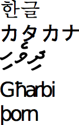

.. |nbsp| unicode:: 0xA0 
   :trim:
  
       
.. |oe| unicode:: 0x0153 
   :rtrim:

.. _chap-indexation:
       
######################################
Recherche d'information : l'indexation
######################################

Dans ce chapitre, nous allons continuer notre découverte des fondements
théoriques de la recherche d'information, avec **l'indexation**. Il s'agit d'une
étape que vous avez réalisée à la fin du chapitre précédent, plus ou moins sans
le savoir (puisqu'elle était automatisée), lorsque que vous avez *importé* des
documents dans ElasticSearch. C'est dans cette étape que se décide et s'affine
la transformation du texte des documents, en vue de remplir les index inversés
vus au chapitre précédent. L'indexation permet d'améliorer les performances du
moteur de recherche et la satisfaction des besoins des utilisateurs.

Nous allons aborder cette étape d'un point de vue théorique mais aussi d'un
point de vue pratique, toujours avec Elasticsearch.

**************************
S1: L'analyse de documents 
**************************

.. admonition:: Supports complémentaires:

    * `Présentation: Recherche d'information - analyse de documents <http://b3d.bdpedia.fr/files/slri-indexation-analyse.pdf>`_
    * `Vidéo : Pré-traitement des documents  textuels  <https://mediaserver.lecnam.net/permalink/v125f5947d4batpxkr93/>`_  
  
En présence d'un document textuel un tant soit peu complexe, on ne peut pas se
contenter de découper plus ou moins arbitrairement en mots sans se poser
quelques questions et appliquer un pré-traitement du texte. Les effets de ce
pré-traitement doivent être compris et maîtrisés: ils influent directement sur
la précision et le rappel. Quelques exemples simples pour s'en convaincre:

 - si on cherche les documents contenant le mot "loup", on s'attend généralement
   à trouver ceux contenant "loups", "Loup", "louve"; il faut donc, quand on
   conserve un document dans Elasticsearch, qu'il soit en mesure de mettre ces
   différentes formes dans *le même index inversé*;
   
 - si on ne normalise pas (on conserve les majuscules et les pluriels), on va dégrader
   le rappel, puisqu'un utilisateur saisissant le mot-clef "loup" ne trouvera
   pas les documents dans lesquels ce terme apparaît *seulement* sous la forme "Loup" ou "loups";
   
 - on le comprend immédiatement avec le cas de "loup / louve", il faut une
   connaissance experte de la langue pour décider que "louve" et "loup" doivent
   être associés, ce qui requiert une transformation qui dépend de la langue et
   nécessite une analyse approfondie du contenu;

 - inversement, si on normalise (retrait des accents, par exemple) "cote",
   "côte", "côté", on va unifier des mots dont le sens est différent, et on va
   diminuer la précision.

En fonction des caractéristiques des documents traités, des utilisateurs de
notre système de recherche, il faudra trouver un bon équilibre, aucune solution
n'étant parfaite. C'est de l'art et du réglage... 

L'analyse se compose de plusieurs phases: 

  * *Tokenization*: découpage du texte en "termes".
  * *Normalisation*: identification de toutes les variantes d'écritures d'un
    même terme et choix d'une règle de normalisation (que faire des majuscules? acronymes? apostrophes? accents?).     
  * *Stemming* ("racinisation"): rendre la racine des mots pour éviter le biais des 
    variations autour d'un même sens (auditer, auditeur, audition, etc.)
  * *Stop words* ("mots vides"), comment éliminer les mots très courants qui ne rendent
    pas compte de la signification propre du document?

Ce qui suit est une brève introduction, essentiellement destinée à comprendre
les outils prêts à l'emploi que nous utiliserons ensuite. Remarquons en
particulier que les étapes ci-dessus sont parfois décomposées en sous-étapes
plus fines avec des algorithmes spécifiques (par exemple, un pour les accents,
un autre pour les majuscules). L'ordre que nous donnons ci-dessus est un exemple, 
il peut y avoir de légères variations. Enfin, notez bien que **le texte
transformé dans une étape sert de texte d'entrée à la transformation suivante**
(nous y reviendrons dans la partie pratique).

Tokenisation et normalisation
=============================

Un *tokenizer* prend en entrée un texte (une chaîne de caractères) et produit
une séquence de *tokens*. Il effectue donc un traitement purement lexical,
consistant typiquement à éliminer les espaces blancs, la ponctuation, les
liaisons, etc., et à identifier les "mots". Des transformations peuvent
également intervenir (suppression des accents par exemple, ou normalisation des
acronymes - U.S.A. devient USA). 

La tokenization est très fortement dépendante de la langue. La première chose à
faire est d'identifier cette dernière. En première approche on peut examiner le
jeu de caractères (:numref:`characters`).

.. _characters:

   
      Quelques jeux de caractères ... exotiques
      
Il s'agit respectivement du: Coréen, Japonais, Maldives, Malte, Islandais. 
Ce n'est évidemment pas suffisant pour distinguer des langues utilisant le
même jeu de caractères. Une extension simple est d'identifier
les *séquences de caractères fréquents*, (*n*-grams).
Des bibliothèques fonctionnelles font ça très bien (e.g., Tika, http://tika.apache.org)

Une fois la langue identifiée, on divise le texte en *tokens* ("mots"). 
Ce n'est pas du tout aussi facile qu'on le dirait!

  * Dans certaines langues (Chinois, Japonais), les mots  *ne sont pas* séparés par des espaces.
  * Certaines langues s'écrivent de droite à gauche, de haut en bas.
  * Que faire (et de manière *cohérente*) des acronymes, élisions, nombres, unités, URL, email, etc.
  * Que faire des *mots composés*: les séparer en *tokens* ou les regrouper en un seul? Par exemple:
  
    - Anglais: *hostname*, *host-name* et *host name*, ...
    - Français: Le Mans, aujourd'hui, pomme de terre, ...
    - Allemand: *Levensversicherungsgesellschaftsangestellter* (employé d’une société d’assurance vie).

Pour les majuscules et la ponctuation, une solution simple est de 
normaliser systématiquement (minuscules, pas de ponctuation). Ce qui
donnerait le résultat suivant pour notre petit jeu de données.

     * :math:`d_1`: ``le loup est dans la bergerie``
     * :math:`d_2`: ``le loup et les trois petits cochons``
     * :math:`d_3`: ``les moutons sont dans la bergerie``
     * :math:`d_4`:  ``spider cochon spider cochon il peut marcher au plafond``
     * :math:`d_5`: ``un loup a mangé un mouton les autres loups sont restés dans la bergerie``
     * :math:`d_6`:  ``il y a trois moutons dans le pré et un mouton dans la gueule du loup``
     * :math:`d_7`: ``le cochon est à 12 euros le kilo le mouton à  10 euros kilo``
     * :math:`d_8`: ``les trois petits loups et le grand méchant cochon``

Stemming (racine), lemmatisation
================================

La racinisation consiste à *confondre* toutes les formes d'un même mot, ou de 
mots apparentés, en une seule *racine*. Le  *stemming morphologique*
retire les pluriels, marque de genre, conjugaisons, modes, etc. 
Le *stemming lexical* fond les termes proches lexicalement: 
"politique, politicien, police (?)" ou   "université, universel, univers (?)".
Ici, le choix influe clairement sur la précision et le rappel (plus d'unification
favorise le rappel au détriment de la précision).

La racinisation 
est très dépendante de la langue et peut nécessiter une analyse linguistique
complexe.  En anglais, *geese* est le pluriel de *goose*, *mice* de *mouse*; 
les formes   masculin / féminin en français n'ont parfois rien à voir ("loup / louve")
mais aussi ("cheval / jument": parle-t-on de la même chose?) Quelques
exemples célèbres montrent les difficultés d'interprétation:

 * "Les poules du couvent couvent": où est le verbe, où est le substantif?
 * "La petite brise la glace":  idem.

Voici un résultat possible de la racinisation pour nos documents.

     * :math:`d_1`: ``le loup etre dans la bergerie``
     * :math:`d_2`: ``le loup et les trois petit cochon``
     * :math:`d_3`: ``les mouton etre dans la bergerie``
     * :math:`d_4`:  ``spider cochon spider cochon il pouvoir marcher au plafond``
     * :math:`d_5`: ``un loup avoir manger un mouton les autre loup etre rester dans la bergerie``
     * :math:`d_6`:  ``il y avoir trois mouton dans le pre et un mouton dans la gueule du loup``
     * :math:`d_7`: ``le cochon etre a 12 euro le kilo le mouton a 10 euro kilo``
     * :math:`d_8`: ``les trois petit loup et le grand mechant cochon``

Il existe des procédures spécialisées pour chaque langue. En anglais,
l'algorithme `Snowball <http://snowballstem.org/>`_ de Martin Porter fait
référence et est toujours développé aujourd'hui. Il a connu des déclinaisons
dans de nombreuses langues, dont le français, par un travail collaboratif. 

Mots vides et autres filtres
============================

Un des filtres les plus courants consiste
à retire les mots porteurs d'une information faible
("*stop words*" ou "mots vides")  afin de limiter le stockage.

  * Les articles: *le*, *le*, *ce*, etc.
  * Les verbes "fonctionnels": *être*, *avoir*, *faire*, etc.
  * Les conjonctions: *et*, *ou*, etc.
  * et ainsi de suite. 
  
Le choix est délicat car, d'une part, ne pas supprimer
les mots vides augmente l'espace de stockage nécessaire (et ce d'autant
plus que la liste associée à un mot très fréquent est très longue),
d'autre part les éliminer peut diminuer la pertinence des 
recherches  ("pomme de terre", "Let it be", "Stade de France").

Parmi les autres filtres, citons en vrac: 

  * *Majuscules / minuscules*. On peut tout mettre en minuscules, mais
    on perd alors la distinction nom propre / nom commu,, par exemple Lyonnaise des Eaux, Société Générale, Windows, etc.
  * *Acronymes*.
    CAT = *cat* ou *Caterpillar Inc.*?  M.A.A.F ou MAAF ou Mutuelle ... ?
  * *Dates, chiffres*.
    Monday 24, August, 1572 -- 24/08/1572 -- 24 août 1572;
    10000 ou 10,000.00 ou 10,000.00

Dans tous les cas, les même règles de transformation s'appliquent aux documents 
ET à la requête. Voici, au final, pour chaque document la liste
des *tokens* après application de quelques règles simples.

     * :math:`d_1`: ``loup etre bergerie``
     * :math:`d_2`: ``loup trois petit cochon``
     * :math:`d_3`: ``mouton etre bergerie``
     * :math:`d_4`:  ``spider cochon spider cochon pouvoir marcher plafond``
     * :math:`d_5`: ``loup avoir manger  mouton autre loup etre rester bergerie``
     * :math:`d_6`:  ``avoir trois mouton pre mouton gueule loup``
     * :math:`d_7`: ``cochon etre douze euro kilo mouton dix euro kilo``
     * :math:`d_8`: ``trois petit loup grand mechant cochon``

Quiz
====

.. eqt:: ri-analysedoc-1

    Qu'est-ce que la tokenisation?
   
    A) :eqt:`I`  C'est l'élimination de toute ponctuation
    #) :eqt:`C`  C'est le découpage d'un texte en unités lexicales
    #) :eqt:`I` C'est l'extraction des termes d'un dictionnaire présents dans un texte

.. eqt:: ri-analysedoc-2

    Quelle opération ci-dessous ne relèvent pas de la stemmisation?
   
    A) :eqt:`C`  Rassembler tous les synonymes en un seul terme
    #) :eqt:`I`  Supprimer toutes les formes plurielles
    #) :eqt:`I`  Ramener tous les verbes à la forme infinitive
    

***********************************
S2: L'indexation dans ElasticSearch
***********************************

.. admonition:: Supports complémentaires:

    * `Présentation: Indexation avec ElasticSearch <http://b3d.bdpedia.fr/files/slri-indexation-ES.pdf>`_
    * `Vidéo : gestion de l'indexation avec ElasticSearch  <https://mediaserver.lecnam.net/permalink/v125f5947d4bahgys4kz/>`_  
  
Par défaut, Elasticsearch propose une analyse des documents automatisée,
*inférant* la nature des champs qui sont présents dans les documents qu'on lui
propose par l'interface ``_bulk`` (voir chapitre précédent). Vous pouvez par
exemple consulter l'analyse qui a été réalisée pour les films en saisissant la
commande suivante (dans le terminal ou dans Kopf) :

  .. code-block:: bash

     curl -XGET http://localhost:9200/movies/?pretty=1

  .. code-block:: json	
  
    {
      "movies" : {
        "aliases" : { },
        "mappings" : {
          "movie" : {
            "properties" : {
              "fields" : {
                "properties" : {
                  "actors" : {
                    "type" : "string"
                  },
                  "directors" : {
                    "type" : "string"
                  },
                  "genres" : {
                    "type" : "string"
                  },
                  "image_url" : {
                    "type" : "string"
                  },
                  "plot" : {
                    "type" : "string"
                  },
                  "rank" : {
                    "type" : "long"
                  },
                  "rating" : {
                    "type" : "double"
                  },
                  "release_date" : {
                    "type" : "date",
                    "format" : "strict_date_optional_time||epoch_millis"
                  },
                  "running_time_secs" : {
                    "type" : "long"
                  },
                  "title" : {
                    "type" : "string"
                  },
                  "year" : {
                    "type" : "long"
                  }
                }
              },
              "id" : {
                "type" : "string"
              },
              "type" : {
                "type" : "string"
              }
            }
          }
        },
        "settings" : {
          "index" : {
            "creation_date" : "1510156098539",
            "number_of_shards" : "1",
            "number_of_replicas" : "0",
            "uuid" : "8_C-IZStS5uRhI58Xz9hCA",
            "version" : {
              "created" : "2040699"
            }
          }
        },
        "warmers" : { }
      }
    }

Vous pouvez notamment constater que les champs contenant du texte sont lus comme
des ``string``, ceux contenant des entiers comme des ``long`` et la date est lue
comme un type spécifique, ``date``. Avec cette détection, Elasticsearch pourra
opérer des opérations sur les entiers ou les dates (par exemple : les notes
supérieures à 5.8, les films sortis entre le 1er janvier 2006 et le 14 novembre
2008, etc.).

Il est cependant fréquent que l'on souhaite aller plus loin, et affiner la
configuration, pour optimiser le moteur de recherche. Il est alors nécessaire de
spécifier soi-même un *schéma* pour les données.

Le schéma
=========

Un document est, on l'a vu, constitué de *champs* (*fields*), chaque champ étant
indexé séparément. Le schéma indique les paramètres d'indexation pour chaque
champ. Revenons au document 
décrivant un film dans la base Webscope, avec une liaison vers une collection
d'artistes : 

    .. code-block:: json	

      {
        "title": "Vertigo",
        "year": 1958,
        "genre": "drama",
        "summary": "Scottie Ferguson, ancien inspecteur de police, est sujet au vertige depuis qu'il a 
                    vu mourir son collègue. Elster, son ami, le charge de surveiller sa femme, 
                    Madeleine, ayant des tendances suicidaires. Amoureux de la jeune femme Scottie ne 
                    remarque pas le piège qui se trame autour de lui et dont il va être la victime... ",
        "country": "DE",
        "director": 	{
          "_id": "artist:3",
          "last_name": "Hitchcock",
          "first_name": "Alfred",
          "birth_date": "1899"	
        },
        "actors": [
        {
          "_id": "artist:15",
          "first_name": "James",
          "last_name": "Stewart",
          "birth_date": "1908",
          "role": "John Ferguson"	
        },
        {
          "_id": "artist:282",
          "first_name": "Arthur",
          "last_name": "Pierre",
          "birth_date": null,
          "role": null	
        }
        ]
      }

Reprenant la structure du document ci-dessus, voici un schéma possible :

    .. code-block:: json	
      :linenos:

      {
        "mappings": {
          "movie": {
            "_all":       { "enabled": true  },
            "properties": {
              "title":    { "type": "string"  },
              "year":     { "type":   "date", "format": "yyyy" },
              "genre":      { "type": "string" },
              "summary": { "type": "string"},
              "country": {"type": "string"},
              "director":     {
                "properties": {
                  "_id": { "type":"string" },
                  "last_name": { "type":"string"},
                  "first_name": { "type":"string"},
                  "birth_date": { "type": "date", "format":"yyyy"}
                }},
                "actors": { 
                  "type": "nested",
                  "properties": {
                    "_id": { "type":"string"},
                    "first_name": { "type":"string"},
                    "last_name": { "type":"string"},
                    "birth_date": { "type": "date", "format":"yyyy"},
                    "role": { "type":"string"}
                  }
                }
            }
          }
        }

Vous pouvez télécharger ce fichier ici : `movie-schema-2.4.json <http://b3d.bdpedia.fr/files/movie-schema-2.4.json>`_.

Tout est inclus sous le champ "mappings". Ici, on ne parle que de documents de
type *movie*, d'où la ligne 3. Chaque *mapping* a deux types de champs :

  - les *méta-champs* (*meta-fields*)
  - les champs proprement dits. 

Méta-champs
-----------

Le champ ``_all`` est un champ méta-champ, dans lequel toutes les valeurs des
autres champs sont par exemple concaténées pour permettre une recherche (mais
elles ne sont pas stockées, pour gagner de la place). Ce champ est déprécié à
partir de la version 6.0 d'Elasticsearch. Le champ ``_source`` est un autre
méta-champ, dans lequel le contenu du document est stocké (mais non indexé),
afin d'éviter d'avoir à recourir à une autre base de stockage. C'est évidemment
coûteux en terme de place et pas forcément souhaitable, on peut alors le
désactiver.

Champs
------

Tous les champs sont décrits sous le champ "properties". ElasticSearch fournit
un ensemble de types pré-définis qui suffisent pour les besoins courants; on
peut associer des attributs à un type. Les attributs indiquent d'éventuels
traitements à appliquer à chaque valeur du type avant son insertion dans
l'index. Par exemple : pour traiter les chaînes de caractères de type
``string``, il peut être bénéfique de spécifier un ``analyzer`` spécifique,
correspondant à un langage particulier. Les attributs possibles correspondent
aux choix présentés dans la première partie de ce chapitre, en terme de
*tokenisation*, de *normalisation*, de *stop words*, etc. La plupart des
attributs ont des valeurs par défaut et sont optionnels. C'est le cas des
suivants, mais nous les avons fait figurer en raison de leur importance :

    -  *index* indique simplement si le champ peut être utilisé dans une recherche;  
    -  *store* indique que la valeur du champ est stockée dans l'index, et qu'il est donc possible de récupérer cette valeur comme résultat d'une recherche, **sans avoir besoin de retourner à la base principale** en d'autres termes, ``store`` permet de traiter l'index aussi comme une base de données;

Les champs ``index``  et ``store`` sont très importants pour les performances du
moteur. Toutes les combinaisons de valeur sont possibles :

  - ``index=true``, ``store=false``: on pourra interroger le champ, mais il faudra accéder au document principal dans la  base documentaire si on veut sa valeur;
  - ``index=true``, ``store=true``: on pourra interroger le champ, et accéder à sa valeur dans l'index;
  - ``index=false``, ``store=true``: on ne peut pas interroger le champ, mais on peut récupérer sa valeur dans l'index;
  - ``index=false``, ``store=false``: n'a pas de sens à priori; le seul intérêt est d'ignorer le champ s'il est fourni dans le document Elasticsearch.

.. ifconfig:: pasfini in ('public')

  .. admonition:: À quoi cela sert-il d'indexer un champ sans le stocker ?

    - c'est notamment le cas pour les textes qui sont décomposés en termes:
      chaque terme est indexé indépendamment
    - très difficile pour l'index de reconstituer le texte
    - d'où l'intérêt de conserver ce dernier dans son  intégralité, à part

    C'est une question de compromis: stocker une valeur prend plus d'espace
    que l'indexer. Dans la situation la plus extrême, on dupliquerait la base
    documentaire en stockant chaque document *aussi* dans l'index. En
    revanche, un stockage plus important dégrade les performances

Remarquez la structure pour le réalisateur (``director``), correspondant à
l'imbrication d'un objet JSON simple et non d'une valeur atomique. Enfin, notez
l'utilisation du type ``nested`` pour les champs ayant plusieurs valeurs, soit,
concrètement, un tableau en JSON; c'est le cas par exemple pour le nom des
acteurs (`actors`).

Champs créés dynamiquement
--------------------------

Pour faciliter les recherches, on peut avoir besoin de regrouper certains
champs. Par exemple, dans le cas de documents où le nom et le prénom d'une
personne seraient séparés, il serait sans doute pertinent de permettre des
recherches sur le nom complet de la personne. Il faudrait alors recopier, à
l'indexation, le contenu du champ `nom` et du champ `prenom` de chaque document
dans un nouveau champ `nom_complet`. Voici les paramètres associés à cette
opération pour un tel schéma.

  .. code-block:: json	

    {
      "mappings": {
        "my_type": {
          "properties": {
            "first_name": {
              "type": "text",
              "copy_to": "full_name" 
            },
            "last_name": {
              "type": "text",
              "copy_to": "full_name" 
            },
            "full_name": {
              "type": "text"
            }
          }
        }
      }
    }

Importer le schéma dans ElasticSearch
-------------------------------------

On peut stocker le schéma dans un fichier json, par exemple appelé
``movie-schema-2.4.json``. La création de l'index adoptant ces paramètres dans
ElasticSearch se fait comme ceci (pour l'index ``monindex``) :

  .. code-block:: bash

    curl -XPUT 'localhost:9200/monindex' -H 'Content-Type: application/json' -d movie-schema-2.4.json

Avec ElasticSearch, il est plus difficile de faire évoluer un schéma (qu'avec
une BDD classique). Sauf rares exceptions, il faut en général créer un nouvel
index et réindexer les données. ElasticSearch permet la copie d'un index vers
l'autre avec l'API ``reindex``:

  .. code-block:: bash

   curl -XPOST 'localhost:9200/_reindex?pretty' -H 'Content-Type: application/json' -d'
    {
      "source": {
        "index": "nfe204"
      },
      "dest": {
        "index": "new_nfe204"
      }
    }'

Analyse avec ElasticSearch
==========================

Pour améliorer le `mapping` et notre compréhension des résultats,
Elasticsearch propose une interface pour observer les effets des paramètres de
l'analyse. 

Vous pouvez donc voir comment est transformée une chaîne spécifique, par
exemple "X-Men: Days of Future Past", avec l'analyseur par défaut pour l'index
``movies`` : 

.. code-block:: bash

	curl -XGET 'localhost:9200/movies/_analyze?pretty=1' -d '{ "text" : "X-Men: Days of Future Past" }' 
	# cette requête doit être en POST dans Kopf

Voici le résultat :

.. code-block:: json

	{
		"tokens" : [ {
			"token" : "x",
			"start_offset" : 0,
			"end_offset" : 1,
			"type" : "<ALPHANUM>",
			"position" : 0
		}, {
			"token" : "men",
			"start_offset" : 2,
			"end_offset" : 5,
			"type" : "<ALPHANUM>",
			"position" : 1
		}, {
			"token" : "days",
			"start_offset" : 7,
			"end_offset" : 11,
			"type" : "<ALPHANUM>",
			"position" : 2
		}, {
			"token" : "of",
			"start_offset" : 12,
			"end_offset" : 14,
			"type" : "<ALPHANUM>",
			"position" : 3
		}, {
			"token" : "future",
			"start_offset" : 15,
			"end_offset" : 21,
			"type" : "<ALPHANUM>",
			"position" : 4
		}, {
			"token" : "past",
			"start_offset" : 22,
			"end_offset" : 26,
			"type" : "<ALPHANUM>",
			"position" : 5
		} ]
	}

Le découpage en `tokens` se fait aux espaces et à la ponctuation, les termes
sont normalisés en passant en `bas de casse`, et le "the" est considéré comme
un mot vide. Dans le cas d'un `mapping` spécifique par champ, il est possible
de préciser dans la requête d'analyse le champ sur lequel on souhaite
travailler, pour comparer par exemple un découpage dans le champ de titre avec
un découpage dans le champ de résumé.

Une chaîne d'analyse personnalisée avec Elasticsearch
=====================================================

Comme indiqué dans la première partie, l'analyseur est une chaîne de
traitement (pipeline) constituée de tokeniseurs et de filtres. Les analyseurs
sont composés d'un tokenizer, et de TokenFilters (0 ou plus). Le tokenizer
peut être précédé de CharFilters. Les filtres (TokenFilter) examinent les
tokens un par un et décident de les conserver, de les remplacer par un ou
plusieurs autres. 

Voici un exemple d'analyseur personnalisé.

.. code-block:: bash

  curl -XPUT 'localhost:9200/indexdetest?pretty' -H 'Content-Type: application/json' -d'
  {
    "settings": {
      "analysis": {
        "analyzer": {
          "custom_lowercase_stemmed": {
            "tokenizer": "standard",
            "filter": [
              "lowercase",
              "custom_english_stemmer"
            ]
          }
        },
        "filter": {
          "custom_english_stemmer": {
            "type": "stemmer",
            "name": "english"
          }
        }
      }
    }
  }
  '

Le tokenizer est standard, donc le découpage se fait à la ponctuation et aux
espaces. On place ensuite deux filtres, un de "lowercase" pour normaliser vers
des lettres en `bas de casse` (minuscules) et un autre appelé
"custom_english_stemmer", qui `lemmatise` le texte avec les règles de la
langue anglaise.

On peut ensuite tester l'effet de cet analyseur, comme suit :

.. code-block:: bash

	curl -XGET 'localhost:9200/indexdetest/_analyze?pretty' -H 'Content-Type: application/json' -d'
	{
		"analyzer": "custom_lowercase_stemmed",
		"text":"Finiras-tu ces analyses demain ?"
	}
	'

Voici le résultat de l'analyse de cette phrase :

.. code-block:: json

  {
    "tokens" : [ {
      "token" : "finira",
      "start_offset" : 0,
      "end_offset" : 7,
      "type" : "<ALPHANUM>",
      "position" : 0
    }, {
      "token" : "tu",
      "start_offset" : 8,
      "end_offset" : 10,
      "type" : "<ALPHANUM>",
      "position" : 1
    }, {
      "token" : "ce",
      "start_offset" : 11,
      "end_offset" : 14,
      "type" : "<ALPHANUM>",
      "position" : 2
    }, {
      "token" : "analys",
      "start_offset" : 15,
      "end_offset" : 23,
      "type" : "<ALPHANUM>",
      "position" : 3
    }, {
      "token" : "demain",
      "start_offset" : 24,
      "end_offset" : 30,
      "type" : "<ALPHANUM>",
      "position" : 4
    } ]
  }

Et l'on peut comparer ainsi plusieurs analyseurs.

.. code-block:: bash

	curl -XGET 'localhost:9200/indexdetest/_analyze?pretty' -H 'Content-Type: application/json' -d'
	{
		"analyzer": "french",
		"text":"Finiras-tu ces analyses demain ?"
	}
	'

.. code-block:: json

    {
      "tokens" : [ {
        "token" : "finira",
        "start_offset" : 0,
        "end_offset" : 7,
        "type" : "<ALPHANUM>",
        "position" : 0
      }, {
        "token" : "analys",
        "start_offset" : 15,
        "end_offset" : 23,
        "type" : "<ALPHANUM>",
        "position" : 3
      }, {
        "token" : "demain",
        "start_offset" : 24,
        "end_offset" : 30,
        "type" : "<ALPHANUM>",
        "position" : 4
      } ]
    }

Ici, le pronom "tu" est éliminé, en raison du réglage par défaut de l'analyseur
"French" (pour lequel c'est un `stop_word`). Avec notre analyseur 
"custom_lowercase_stemmed", reposant sur la langue anglaise, "tu" n'est pas un
`stop word`, il est préservé. Il en est de même pour le démonstratif `ces`.

Remarquez que la chaîne `analyses` est lemmatisée dans les deux cas vers
``analys``, ce qui permettra à ElasticSearch de regrouper tous les mots de cette
famille (analyse, analyser, analyste). 

Conclusion
==========

Dans ce chapitre, nous avons vu comme les textes originaux et leurs éventuelles
méta-données pouvaient être transformés pour être utilisés par les moteurs de
recherche. Cette étape, appelée indexation, comporte de nombreux paramètres et
repose sur les travaux académiques en linguistique et recherche d'information,
utilisable directement dans des outils comme Elasticsearch. Les paramètres de
l'indexation varient suivant les données, même si des options par défaut
satisfaisantes existent.

Après avoir indexé convenablement les documents, il nous reste à voir comment y
accéder. Nous avons vu dans le chapitre :ref:`chap-introri` les requêtes Lucene,
nous verrons en Travaux Pratiques (chapitre :ref:`chap-ritp_tpelasticdsl`)
qu'ElasticSearch possède un langage dédié très puissant, permettant des
recherches mais aussi des statistiques sur les documents. Dans le chapitre
suivant (:ref:`chap-ranking`), nous verrons le classement des résultats d'un
moteur de recherche.

Quiz
====

.. eqt:: ri-es-1

    Cherchez l'intrus: parmi la liste des actions suivantes, laquelle ne relève pas
    de la spécification d'un schéma.
   
    A) :eqt:`I` Indication du type d'un champ
    #) :eqt:`I` Calcul de nouveaux champs à partir des champs indexés
    #) :eqt:`C` Indication de l'importance d'un document
    #) :eqt:`I` Indication de la méthode de tokenisation / racinisation

.. eqt:: ri-es-2

    Qu'est-ce qui distingue une valeur *stockée* d'une valeur *indexée*?
   
    A) :eqt:`I` La seule différence est qu'une valeur stockée peut être renvoyée
       par Elastic Search dans le résultat d'une requête
    #) :eqt:`C` La valeur indexée a été soumise à des transformations contrairement
       à la valeur stockée
    #) :eqt:`I` La valeur indexée est en mémoire RAM, et la valeur stockée sur le disque

Exercices
=========

.. _Ex-S2-1:
.. admonition:: Exercice `Ex-S2-1`_: les analyseurs

   Tester et interpréter les résultats de l'application des analyseurs suivants.
   
    #. Analyseur standard anglais:

       .. code-block:: json

          {                                                                               
             "analyzer": "english",                                                        
             "text": "j'aime les couleurs de l'arbre durant l'été"                         
           }    
                                                                                      
    #. Analyseur standard français:

       .. code-block:: json
 
            {                                                                               
              "analyzer": "french",                                                         
              "text": "j'aime les couleurs de l'arbre durant l'été"                         
            }                                                                               

    #. Analyseur standard neutre, avec quelques filtres:

       .. code-block:: json
       
           {                                                                               
            "analyzer": "standard",                                                       
            "filter":  [ "lowercase", "asciifolding" ],                                   
            "text": "j'aime les COULEURS de l'arbre durant l'été"                         
            }   

    Ces documents peuvent être soumis à la ressource ``_analyze``  d'un index.
    
    .. code-block:: bash
     
        curl -XPUT '<url>/monindex/_analyze' -H 'Content-Type: application/json' -d @test.json
