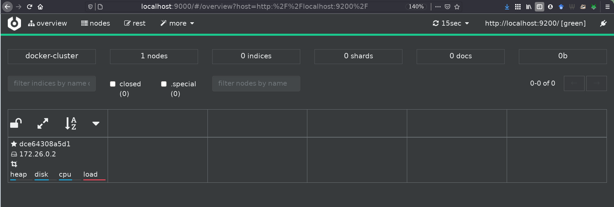
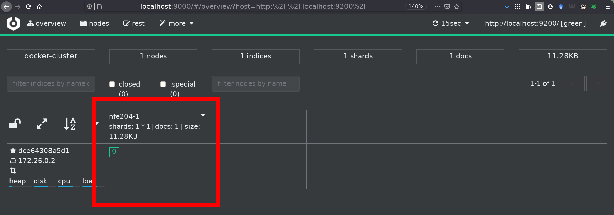

.. _chap-introri:
   
#########################################
Introduction à la recherche d'information
#########################################

.. admonition:: Supports complémentaires:

     * Un cours complet en ligne (en anglais) et accompagné d'un ouvrage de
       référence : http://www-nlp.stanford.edu/IR-book/. *Certaines parties du
       cours empruntent des exemples à ce livre*.
  
*****************
S1: les principes
*****************

.. admonition:: Supports complémentaires:

      * `Présentation: Introduction à la recherche d'information <http://b3d.bdpedia.fr/files/slri-intro-principes.pdf>`_
      * `Vidéo de la session Introduction RI - principes <https://mediaserver.cnam.fr/permalink/v125f5947d4c11yianvt/>`_  

Qu'est ce que la recherche d'information
========================================

La *Recherche d'Information* (RI, *Information Retrieval, IR* en anglais)
consiste à trouver des *documents* peu ou faiblement structurés, dans une grande
*collection*, en fonction d'un *besoin d'information*. Le domaine d'application
le plus connu est celui de la recherche "plein texte". Étant donné une
collection de documents constitués essentiellement de texte, comment trouver les
plus pertinents en fonction d'un besoin exprimé par quelques mots-clés? La RI
développe des *modèles* pour interpréter les documents d'une part, le besoin
d'information d'autre part, en vue de faire correspondre les deux, mais aussi
des *techniques* pour calculer des réponses rapidement même en présence de
collections très volumineuses. Enfin, des systèmes (appelés "moteurs de
recherches") fournissent des solutions sophistiquées prêtes à l'emploi.

La RI a pris une très grande importance, en raison notamment de l'émergence
de vastes sources de documents que l'on peut agréger et exploiter (le Web bien
sûr, mais aussi les systèmes d'information d'entreprise). Les techniques
utilisées ont également beaucoup progressé, avec des  résultats spectaculaires.
La RI est maintenant omniprésente dans beaucoup d'environnements informatiques, 
et notamment:
 
  * La recherche sur le Web, utilisée quotidiennement par des milliards d'utilisateurs,
  * La recherche de messages dans votre boîte mail,
  * La recherche de fichiers sur votre ordinateur (*Spotlight*),
  * La recherche de documents dans une base documentaire, publique ou privée,
  
Ce chapitre introduit ces différents aspects en se concentrant sur la recherche
d'information appliquée à des collections de documents structurés, comprenant
des parties textuelles importantes. 

Précision et  rappel
====================

Comme le montre la définition assez imprécise donnée en préambule, la recherche
d'information se donne un objectif à la fois ambitieux et relativement vague.
Cela s'explique en partie par le contexte d'utilisation de ces systèmes. Avec
une base de données classique, on connaît le schéma des données, leur
organisation générale, avec des contraintes qui garantissent qu'elles ont une
certaine régularité. En RI, les données, ou "documents", sont souvent
hétérogènes, de provenances diverses, présentent des irrégularités et des
variations dues à l'absence de contrainte et de validation au moment de leur
création. De plus, un système de RI est souvent utilisé par des utilisateurs
non-experts. À la difficulté d'interpréter le contenu des documents et de le
décrire s'ajoute celle de comprendre le "besoin", exprimé souvent de manière
très partielle.

D'une certaine manière, la RI vise essentiellement à prendre en compte ces
difficultés pour proposer des réponses les plus pertinentes possibles. La notion
de *pertinence* est centrale ici: un document est pertinent s'il satisfait le
besoin exprimé. Quand on utilise SQL, on considère que la réponse est toujours
exacte car définie de manière mathématique (en fonction de l'état de la base).  En
RI, on ne peut jamais considérer qu'un résultat, constitué d'un ensemble de
documents, est exact, mais on mesure son *degré de pertinence* (c'est-à-dire les
erreurs du système de recherche) en distinguant:

  - les **faux positifs**: ce sont les documents *non pertinents* inclus dans le
    résultat; ils ont été sélectionnés à tort. En anglais, on parle de *false
    positive*.

  - les **faux négatifs**: ce sont les documents *pertinents* qui *ne sont pas*
    inclus dans le résultat. En anglais, on parle de *false negative*.

Les documents *pertinents* inclus dans le résultat sont appelés les **vrais
positifs**, les documents *non pertinents* non inclus dans le résultat sont
appelés les **vrais négatifs**. On le voit à ce qui vient d'être dit : on
emploie le terme *positif* pour désigner ce qui a été ramené dans le résultat de
recherche. À l'inverse, les documents qui sont *négatifs* ont été laissés de
côté par le moteur de recherche au moment de faire correspondre des documents
avec un besoin d'information. Et l'on désigne par *vrai* ce qui a été bien
classé (dans le résultat ou hors du résultat). 

Deux indicateurs formels, basés sur ces notions, sont couramment employés 
pour mesurer la qualité d'un système de RI. 

.. admonition:: La précision

   La *précision* mesure la proportion des vrais positifs dans le résultat *r*.
   Si on note respectivement :math:`t_p(r)` et :math:`f_p(r)` le nombre de vrais
   et de faux positifs dans *r* (de taille :math:`|r|`), alors
   
   .. math:: \text{précision} = \frac{t_p(r)}{t_p(r) + f_p(r)} =  \frac{t_p(r)}{|r|}

   Une précision de 1 correspond à l'absence totale de faux positifs. Une
   précision nulle indique un résultat ne contenant aucun document pertinent.
   
.. admonition:: Le rappel

   Le rappel mesure la proportion des documents pertinents qui sont inclus dans le résultat. Si on note :math:`f_n(r)` le
   nombre de documents faussement négatifs, alors le rappel est:
   
   .. math:: \frac{t_p(r)}{t_p(r) + f_n(r)}

   Un rappel de 1 signifie que tous les documents pertinents apparaissent dans le résultat.  Un rappel
   de 0 signifie qu'il n'y a aucun document pertinent dans le résultat.
   
La  :numref:`truefalsepositivenegative` illustre (en anglais) ces concepts
pour bien distinguer les ensembles dont on parle pour chaque requête de
recherche et les mesures associées.

.. _truefalsepositivenegative:
.. figure:: ../figures/fauxpositifs.png
      :width: 70%
      :align: center
   
      Vrai, faux, positifs, négatifs.

Ces deux indicateurs sont très difficiles à optimiser simultanément. Pour
augmenter le rappel, il suffit d'ajouter plus de documents dans le résultat, au
détriment de la précision. À l'extrême, un résultat qui contient *toute* la
collection interrogée a un rappel de 1, et une précision qui tend vers 0.
Inversement, si on fait le choix de ne garder dans le résultat que les documents
dont on est sûr de la pertinence, la précision s'améliore mais on augmente le
risque de faux négatifs (c'est-à-dire de ne pas garder des documents
pertinents), et donc d'un rappel dégradé.

L'évaluation d'un système de RI est un tâche complexe et fragile car elle repose
sur des enquêtes impliquant des utilisateurs. Reportez-vous à l'ouvrage de
référence cité au début du chapitre (et au matériel de cours associé) pour en
savoir plus.

La recherche plein texte
========================

Commençons par étudier une méthode simple de recherche pour trouver des
documents répondant à une recherche dite "plein texte" constituée d'un ensemble
de mots-clés.  On va donner à cette recherche une définition assez restrictive
pour l'instant: il s'agit de trouver tous les documents contenant *tous* les
mots-clés. Prenons pour exemple l'ensemble (modeste) de documents ci-dessous.
  
     * :math:`d_1`: ``Le loup est dans la bergerie.``
     * :math:`d_2`: ``Le loup et le trois petits cochons``
     * :math:`d_3`: ``Les moutons sont dans la bergerie.``
     * :math:`d_4`:  ``Spider Cochon, Spider Cochon, il peut marcher au plafond.``
     * :math:`d_5`: ``Un loup a mangé un mouton, les autres loups sont restés dans la bergerie.``
     * :math:`d_6`:  ``Il y a trois moutons dans le pré, et un mouton dans la gueule du loup.``
     * :math:`d_7`: ``Le cochon est à 12 le Kg, le mouton à  10 E/Kg``
     * :math:`d_8`: ``Les trois petits loups et le grand méchant cochon``
 
Et ainsi de suite. Supposons que l'on recherche **tous les documents parlant de
loups, de moutons mais pas de bergerie** (c'est le besoin).  Une solution simple
consiste à parcourir tous les documents et à tester la présence des mots-clés.
Ce n'est pas  très satisfaisant car:

  * c'est potentiellement long, pas sur notre exemple bien sûr, mais en présence d'un ensemble volumineux de documents;
  * le critère "pas de bergerie" n'est pas facile à traiter;
  * les autres types de recherche ("le mot 'loup' doit être *près* du mot 'mouton'") sont
    difficiles;
  * *quid* si je veux *classer* par pertinence les documents trouvés?

On peut faire mieux en créant une structure compacte sur laquelle peuvent
s'effectuer les opérations de recherche. Les données sont organisées dans une
matrice (dite d'incidence) qui représente l'occurrence (ou  non) de chaque mot
dans chaque document. On peut, au choix, représenter les mots en colonnes et les
documents en ligne, ou l'inverse. La première solution semble plus naturelle
(chaque fois que j'insère un nouveau document, j'ajoute une ligne dans la
matrice). Nous verrons plus loin que la seconde représentation, appelée *matrice
inversée*, est en fait beaucoup plus appropriée pour une recherche efficace.

.. admonition:: Terme, vocabulaire.

   Nous utilisons progressivement la notion de *terme* (*token* en anglais) qui
   est un peu différente de celle de "mot". Le  *vocabulaire*, parfois appelé
   *dictionnaire*, est l'ensemble des termes sur lesquels on peut poser une
   requête. Ces notions seront développées plus loin.
 
Commençons par montrer une matrice d'incidence avec les documents en ligne. On
se limite au vocabulaire suivant: {"loup", "mouton", "cochon", "bergerie",
"pré", "gueule"}. 

 .. _loups:
 .. list-table:: La matrice d'incidence
        :widths: 15 10 10 10 10 10 10
        :header-rows: 1

        * - 
          - loup
          - mouton
          - cochon
          - bergerie
          - pré
          - gueule
        * - :math:`d_1`
          - 1
          - 0
          - 0
          - 1
          - 0
          - 0
        * - :math:`d_2`
          - 1
          - 0
          - 1
          - 0
          - 0
          - 0
        * - :math:`d_3`
          - 0
          - 1
          - 0
          - 1
          - 0
          - 0
        * - :math:`d_4`
          - 0
          - 0
          - 1
          - 0
          - 0
          - 0
        * - :math:`d_5`
          - 1
          - 1
          - 0
          - 1
          - 0
          - 0
        * - :math:`d_6`
          - 1
          - 1
          - 0
          - 0
          - 1
          - 1
        * - :math:`d_7`
          - 0
          - 1
          - 1
          - 0
          - 0
          - 0
        * - :math:`d_8`
          - 1
          - 0
          - 1
          - 0
          - 0
          - 0
     
Cette structure est parfois utilisée dans les bases de données sous le nom
*d'index bitmap*. Elle permet de répondre à notre besoin de la manière suivante :

- On prend les *vecteurs d'incidence* de chaque terme contenu dans la requête,
  soit les colonnes dans notre représentation :

  * Loup:      11001101
  * Mouton:    00101110
  * Bergerie:    01010011

- On fait un ``et`` (`logique
  <https://fr.wikipedia.org/wiki/Conjonction_logique>`_)  sur les vecteurs de
  `Loup` et `Mouton` et on obtient 00001100

- Puis on fait un ``et`` du résultat avec le *complément* du vecteur de
  `Bergerie` (01010111)

- On obtient 00000100, d'où on déduit que la réponse est limitée au document
  :math:`d_6`, puisque la 6e position est la seule où il y a un '1'.

Les index inversés
==================

Si on imagine maintenant des données à grande échelle, on s'aperçoit que cette
approche un peu naïve soulève quelques problèmes.  Posons par exemple les
hypothèses suivantes:

 * Un million de documents, mille mots chacun en moyenne (ordre de grandeur
   d'une encyclopédie en ligne bien connue)
 * Disons 6 octets par mot, soit 6 Go (pas très gros en fait!)
 * Disons 500 000 termes *distincts* (ordre de grandeur du nombre de mots dans
   une langue comme l'anglais)

La matrice a 1 000 000 de lignes, 500 000 colonnes, donc :math:`500 \times 10^9`
bits, soit 62 GO. Elle ne tient pas en mémoire de nombreuses machines, ce qui va
beaucoup compliquer les choses.... Comment faire mieux?

Une première remarque est que nous avons besoin des vecteurs pour les *termes*
(mots) pour effectuer des opérations logiques (``and``, ``or``, ``not``) et il
est donc préférable *d'inverser* la matrice pour disposer les termes en ligne
(la représentation est une question de convention: ce qui est important c'est
qu'au niveau de la structure de données, le vecteur d'incidence associé à un
*terme* soit stocké contigument en mémoire et donc accessible simplement et
rapidement). On obtient la structure de la  :numref:`inverted-index-bool`
pour notre petit ensemble de documents.

.. _inverted-index-bool:
.. figure:: ../figures/inverted-index-bool.png
      :width: 40%
      :align: center
   
      Inversion de la matrice
      
Seconde remarque:  la matrice d'incidence est *creuse*. En effet, sur chaque
ligne, il y a au plus 1000 "1" (cas extrême où tous les termes du document sont
distincts). Donc, dans l'ensemble de la matrice, il n'y a au plus que
:math:`10^9` positions avec des 1, soit un sur 500. Il est donc tout à fait
inutile de représenter les cellules avec des 0. On obtient une structure appelée
*index inversé* qui est essentiellement l'ensemble des lignes de la matrice
d'incidence, dans laquelle on ne représente que les cellules correspondant à *au
moins* une occurrence du terme (en ligne) dans le document (en colonne).

.. important:: Comme on ne représente plus l'ensemble des colonnes pour chaque ligne, il faut indiquer,
   pour chaque cellule, à quelle colonne elle correspond.  Pour cela, on place dans
   les cellules *l'identifiant* du document (*docId*). **De plus chaque liste est
   triée sur l'identifiant du document**.
   
La  :numref:`inverted-index`   montre un exemple d'index inversé pour trois
termes, pour une collection importante de documents consacrés à nos animaux
familiers. À chaque terme est associé une liste inverse.

.. _inverted-index:
.. figure:: ../figures/inverted-index.png
      :width: 50%
      :align: center
   
      Un index inversé
      
On parle donc de cochon dans les documents 2, 31, 54 et 101 (notez que les
documents sont ordonnés — très important). Il est clair que la taille des
listes inverses varie en fonction de la fréquence d'un terme dans la collection.

La structure d'index inversé est utilisée dans *tous*  les moteurs de recherche.
Elle présente d'excellentes propriétés pour une recherche efficace, avec en
particulier des possibilités importantes de compression des listes associées à
chaque terme.

.. admonition:: **Vocabulaire** 

   Le *dictionnaire* (*dictionary*) est l'ensemble
   des termes de l'index inversé; le *répertoire* est la structure qui
   associe chaque terme à l'adresse de la liste inversée (*posting list*) associée au terme.
   Enfin on ne parle plus de cellule (la matrice a disparu) mais *d'entrée* pour
   désigner un élément d'une liste inverse.
   
En principe, le répertoire est toujours en mémoire, ce qui permet de trouver
très rapidement les listes impliquées dans la recherche.  Les listes inverses
sont, autant que possible, en mémoire, sinon elles sont compressées et stockées
dans des fichiers (contigus) sur le disque.

Opérations de recherche
=======================

Étant donné cette structure, recherchons les documents parlant de loup et de
mouton. On ne peut plus faire un ``et`` sur des tableaux de bits de taille fixe
puisque nous avons maintenant des listes de taille variable. L'algorithme
employé est une *fusion* ("*merge*") de liste triées. C'est une technique très
efficace qui consiste à parcourir en parallèle et séquentiellement des listes,
en une seule fois. Le parcours unique est permis par le tri des listes sur un
même critère (l'identifiant du document).

La  :numref:`loup-et-mouton-full` montre comment on traite la requête ``loup
et mouton``. On maintient deux curseurs, positionnés au départ au début de
chaque liste. L'algorithme compare les valeurs des docId contenues dans les
cellules pointées par les deux curseurs. On compare ces deux valeurs, puis:

   - (choix A) si elles sont égales, on a trouvé un document: on
     place son identifiant dans le résultat, à gauche; *on avance les deux curseurs d'un cran*
   - (choix B) sinon, on avance le curseur pointant sur la cellule dont la valeur est la
     plus petite, jusqu'à atteindre ou dépasser la valeur la plus grande. 

.. _loup-et-mouton-full:
.. figure:: ../figures/loup-et-mouton-full.png
      :width: 100%
      :align: center
   
      Parcours linéaire pour la fusion de listes triées

La  :numref:`loup-et-mouton-full` se lit de gauche à droite, de haut en bas.  
On applique tout d'abord deux fois le choix A: les documents 1 et 2 parlent
de loup et de mouton. À la troisième étape, le curseur du haut (loup) pointe
sur le document 3, le pointeur du bas (mouton) sur le document 4. On applique
le choix B en déplaçant le curseur du haut jusqu'à la valeur 4. 

Et ainsi de suite.  Il est clair *qu'un seul parcours suffit*. La recherche est
linéaire, et l'efficacité est garantie par un parcours séquentiel d'une
structure (la liste) très compacte. De plus, il n'est pas nécessaire d'attendre
la fin du parcours de toutes les listes pour commencer à obtenir le résultat.
L'algorithme est résumé ci-dessous.

.. code-block:: php

   // Fusion de deux listes l1 et l2
   function Intersect($l1, $l2)
   {
     $résultat = [];
     // Début de la fusion des listes
     while ($l1 != null and $l2 != null) {
       if ($l1.docId == $l2.docId) {
         // On a trouvé un document contenant les deux termes
         $résultat += $l1.docId;
         // Avançons sur les deux listes
         $l1 = $l1.next; $l2 = $l2.next;    
       }
       else if ($l1.docId < $l2.docId) {
         // Avançons sur l1
         $l1 = $l1.next;
       }
       else {
          // Avançons sur l2
         $l2 = $l2.next;       
       }
     }
   }

   
C'est l'algorithme de base de la recherche d'information. Dans la version
présentée ici, on satisfait des requêtes dites *booléennes*: l'appartenance d'un
document au résultat est binaire, et il n'y a aucun classement par pertinence.

À partir de cette technique élémentaire, on peut commencer à raffiner, pour
aboutir aux techniques sophistiquées visant à capturer au mieux le besoin de
l'utilisateur, à trouver les documents qui satisfont ce besoin et à les classer
par pertinence. Pour en arriver là, tout un ensemble d'étapes que nous avons
ignorées dans la présentation abrégée qui précède sont nécessaires. Nous les
reprenons dans ce qui suit.

Quiz
====

.. eqt:: ri-intro-1

    **Cherchez l'erreur!**  Quelle propriété parmi les suivantes ne vous semble pas s'appliquer à la recherche d'information?
   
    A) :eqt:`I`  On évalue la proximité entre le besoin exprimé et les documents du système
    #) :eqt:`C`  On cherche des documents de structure similaire à celui donné par la requête
    #) :eqt:`I`  On cherche des documents de contenu similaire à celui donné par la requête
    #) :eqt:`I`  On cherche les paires de documents proches les uns des autres

.. eqt:: ri-intro-2

    Quel est le rappel si la recherche ramène tous les documents?
    
    A) :eqt:`C` Le rappel est maximal, donc 1
    #) :eqt:`I` Le rappel est minimal, donc 0
    #) :eqt:`I` Le rappel est le rapport entre le nombre de documents pertinents et la taille de la collection
     

.. eqt:: ri-intro-3

    Quelle est la précision si la recherche ramène tous les documents?
    
    A) :eqt:`I` La précision est maximale, donc 1
    #) :eqt:`I` La précision est minimale, donc 0
    #) :eqt:`C` La précision est le rapport entre le nombre de documents pertinents et la taille de la collection

.. eqt:: ri-intro-4

    Quel est le rappel si la recherche ne ramène aucun document?
    
    A) :eqt:`I` Le rappel est maximal, donc 1
    #) :eqt:`C` Le rappel est minimal, donc 0
    #) :eqt:`I` Le rappel est le rapport entre le nombre de documents pertinents et la taille de la collection

.. eqt:: ri-intro-5

    Quelle est la précision si la recherche ne ramène aucun document?
    
    A) :eqt:`I` La précision est maximale, donc 1
    #) :eqt:`I` La précision est minimale, donc 0
    #) :eqt:`C` La précision est indéfinie

.. eqt:: ri-intro-6

    Si je souhaite minimiser le nombre de faux positifs dans ma réponse, je dois favoriser
    
    A) :eqt:`I` Le rappel
    #) :eqt:`C` La précision 
    #)  :eqt:`I` Le rapport rappel / précision
    #)  :eqt:`I` Le rapport  précision / rappel

.. eqt:: ri-intro-7

    Si je souhaite minimiser le nombre de faux négatifs dans ma réponse, je dois favoriser
    
    A) :eqt:`C` Le rappel
    #) :eqt:`I` La précision 

.. eqt:: ri-intro-8

    Qu'est-ce qu'une matrice (ou un index) inversé?
    
    A) :eqt:`I` C'est une structure dans laquelle on a remplacé les 0 par des 1 et réciproquement, pour
       faciliter les calculs
    #) :eqt:`I`  C'est une structure où les documents sont  en ligne et les token en colonne
    #) :eqt:`C`  C'est une structure où les documents sont  en colonne et les token en ligne

.. eqt:: ri-intro-9

    Qu'est-ce que le répertoire dans un index inversé?
    
    A) :eqt:`I` C'est l'espace où l'on stocke les listes inversées
    #) :eqt:`I`  C'est la liste des termes indexés
    #) :eqt:`C`  C'est un tableau qui associe un terme et une liste

.. eqt:: ri-intro-10

    Quel est le coût d'une recherche avec un index inversé?
    
    A) :eqt:`I` Proportionnel à la taille de la collection 
    #) :eqt:`C`  Proportionnel à la taille des listes correspondant aux mots cherchés
    #) :eqt:`I`  Proportionnel au nombre de termes de la requête

.. eqt:: ri-intro-11

    Par rapport à la définition de la recherche d'information, quel énoncé ci-dessous 
    sur la recherche booléenne vous semble correct ?
    
    A) :eqt:`I` Ce n'est pas de la RI car on traite des documents structurés
    #) :eqt:`C`  Ce n'est pas de la RI car il n'y a pas d'estimation de la pertinence  
    #) :eqt:`I`  Ce n'est pas de la RI car il n'y a ni faux négatif ni faux positif.

**********************************************
S2: Bases documentaires et moteur de recherche
**********************************************

.. admonition:: Supports complémentaires

   * `Diaporama sur le couplage BD documentaire / moteur de recherche <http://b3d.bdpedia.fr/files/slri-intro-debuterES.pdf>`_
   * `Vidéo de la session Bases documentaires et moteur de recherche <https://mediaserver.cnam.fr/permalink/v125f5947d4bf7inn4n4/>`_  

Dans cette section, nous allons passer au concret en introduisant les moteurs de
recherche. Nous allons utiliser ici `Elastic Search <http://elastic.co>`_, un
moteur de recherche qui s'installe et s'initialise très facilement. Nous
indexerons nos premiers documents, et commencerons à faire nos premières
requêtes.

.. admonition:: ElasticSearch ou Solr

  ElasticSearch est un moteur de recherche disponible sous licence libre
  (Apache). Il repose sur Lucene (nous verrons plus bas ce que cela signifie).
  Il a été développé à partir de 2004 et est aujourd'hui adossé à une
  entreprise, `Elastic.co <https://www.elastic.co/fr/>`_. Un autre moteur de
  recherche libre existe: `Solr <http://lucene.apache.org/solr/>`_ (prononcé
  "Solar"), lui aussi reposant sur Lucene. Bien que leurs configurations soient
  différentes, les fonctionnalités de ces deux moteurs sont comparables
  (cela n'a pas toujours été le cas). Nous choisissons ElasticSearch pour ce
  cours, mais vous ne devriez pas avoir beaucoup de difficultés à passer à Solr.

Nous allons nous appuyer entièrement sur les choix par défaut d'ElasticSearch
pour nous concentrer sur son utilisation. La construction d'un moteur de
recherche en production demande un peu plus de soin, nous en verrons au chapitre
suivant les étapes nécessaires.

Architecture du système d'information avec un moteur de recherche
=================================================================

Un moteur de recherche comme ElasticSearch est une application spécialisée dans
la recherche, qui s'appuie sur un index *open source* écrit en Java, Lucene.
C'est-à-dire que l'implémentation des structures de données et les algorithmes
de parcours vus dans la section précédente sont déléguées à Lucene (qui profite
régulièrement des avancées des techniques de Recherche d'Information issues du
monde académique).

Une question qui vient naturellement à l'esprit est alors: *mais pourquoi ne pas
utiliser directement le moteur de recherche comme gestionnaire des documents ?*
En effet, pourquoi s'embarrasser de MongoDB alors qu'ElasticSearch permet des
recherches puissantes, efficaces, ainsi que le stockage et l'accès aux
documents.

La réponse est qu'un système comme ElasticSearch est entièrement consacré à la
recherche (donc à la *lecture*) la plus efficace possible de documents. Il
s'appuie pour cela sur des structures compactes, compressées, optimisées (les
index inversés) dont nous avons donné un aperçu. En revanche, ce n'est pas 
nécessairement un
très bon outil pour les autres fonctionnalités d'une base de données. Le
stockage par exemple n'est ni aussi robuste ni aussi stable, et il faut parfois
*reconstruire* l'index à partir de la base originale (on parlera de *réindexer
les documents*).

Un système comme ElasticSearch (ou Solr, ou un autre s'appuyant sur des index
inversés) n'est pas non plus très bon pour des données souvent modifiées. Pour
des raisons qui tiennent à la structure de ces index, les mises à jour sont
coûteuses et s'effectuent difficilement en temps réel. La notion de mise à jour
vaut ici aussi bien pour le *contenu* des documents (modification de la valeur
d'un champ) que pour leur *structure* (ajout ou suppression d'un champ par exemple).

La pratique la plus courante consiste donc à utiliser un système de recherche
comme un *complément* d'un serveur de base de données (relationnelle ou
documentaire) et à lui confier les tâches de recherche que le serveur BD ne sait
pas accomplir (soit, en gros, les recherches non structurées). Dans le cas des
bases NoSQL, l'absence fréquente de tout langage de requête fait du moteur de
recherche associé un outil indispensable. 

Même en cas de présence d'un langage d'interrogation  fourni par le système
NoSQL, le moteur de recherche est un candidat tout à fait valide pour satisfaire
les recherches plein texte *et* les recherches structurées. En résumé, à part
les deux inconvénients (reconstruction depuis une source extérieure, support
faible des mises à jour), les moteurs de recherche sont des composants puissants
aptes à satisfaire efficacement les besoins d'un système documentaire.

.. note:: Les paragraphes ci-dessus sont à prendre avec réserve, car l'évolution
   d'un système comme Elastic Search montre qu'il tend à devenir également
   un gestionnaire robuste pour le stockage de documents.
   Il n'est pas exclu qu'Elastic Search devienne à terme une option tout à fait 
   valable pour l'indexation *et* le stockage ce qui simplifierait l'architecture.

.. _archi-ri:
.. figure:: ../figures/archi-ri.png
      :width: 100%
      :align: center
   
      Architecture d'une application avec moteur de recherche.

La  :numref:`archi-ri` montre une architecture typique, en prenant pour
exemple une base de données MongoDB. Les *documents (applicatifs)* sont donc
dans la base MongoDB qui fournit des fonctionnalités de recherche structurées.
On peut indexer la collection des documents applicatifs en extrayant des
"champs" formant des *documents (au sens d'ElasticSearch, Solr)* fournis à l'index qui
se charge de les organiser pour satisfaire efficacement des requêtes.
L'application peut alors soit s'adresser au serveur MongoDB, soit au moteur de
recherche.

Un scénario typique est celui d'une recherche par mot-clé dans un site. Les
données du site sont périodiquement extraites de la base et indexées dans
Elasticsearch. Ce dernier se charge alors de répondre à la fonctionnalité
``Search`` que l'on trouve couramment sur tous les types de site. 

.. note:: On pourrait se demander s'il n'est pas inefficace de *dupliquer* les
  documents de la base de données vers le moteur de recherche. En fait, c'est un
  inconvénient, mais assez mineur car on *filtre* généralement les documents de
  la base pour n'indexer que les champs soumis à des recherches plein texte
  comme le résumé du film. De plus, les données fournies ne sont pas stockées
  telles-quelles mais compressées et réorganisées dans des listes inversées.
  Le contenu de la base de données n'est donc pas 
  un miroir de l'index géré par le moteur de recherche.

Mise en place d'ElasticSearch
=============================

Commençons par l'installation avec Docker. Voici une commande qui devrait fonctionner
sous tous les systèmes et mettre ElasticSearch en attente sur le port 9200.

.. code-block:: bash

    docker run -d --name es1 -p 9200:9200 -p 9300:9300 -e "discovery.type=single-node"  elasticsearch:7.8.1

.. docker network create ElasticNetwork
     
Quelques remarques:

 - L'option ``-d`` lance le serveur ElasticSearch en tâche de fond (vous pouvez
   l'enlever, mais vous devrez utiliser une autre console pour lancer des
   commandes, elle sera dévolue aux messages du serveur)
 - Les serveurs ElasticSearch prennent par défaut des noms tirés du catalogue des héros Marvel.

.. - L'option ``-D`` permet de configurer le serveur en affectant des valeurs à certains paramètres.

.. admonition:: Les versions d'ElasticSearch

   ElasticSearch évolue rapidement. Pour éviter que les instructions qui suivent
   ne deviennent rapidement obsolètes, j'indique le numéro de version dans
   l'installation avec Docker (la 7.8.1, de juillet 2020). 

Ici, le nombre de fragments de l'index est fixé à 1, et le degré de réplication
à 0. Cela revient à demander à ElasticSearch de s'exécuter en mode local, sans
distribution. Tout cela sera revu plus tard.

Toutes les interactions avec un serveur ElasticSearch passent par une interface
REST basée sur JSON (revoyez au besoin le chapitre :ref:`chap-bddoc`). Vous
pouvez directement vous adresser au serveur REST en écoute sur le port 9200. 

Vous pouvez obtenir l'IP de votre conteneur (que l'on a nommé *es1*) avec la
commande Bash suivante:

.. code-block:: bash

     docker inspect --format '{{ .NetworkSettings.IPAddress }}' es1

.. admonition:: localhost

   Pour simplifier le travail des élèves sur les machines du CNAM, nous
   utilisons dans la suite "localhost" comme nom de machine (équivalent à
   127.0.0.1). Si vous travaillez sur une autre machine, relevez l'IP obtenue
   ci-dessus et remplacez localhost par cette adresse IP dans les commandes.

Un accès avec votre navigateur (ou avec ``cUrl``) à `http://localhost:9200
<http://localhost:9200>`_ devrait renvoyer un document JSON semblable à
celui-ci:

.. code-block:: json

     {
    "name": "7a46670f6a9e",
    "cluster_name": "docker-cluster",
    "cluster_uuid": "89U3LpNhTh6Vr9UUOTZAjw",
    "version": {
        "number": "7.8.1",
        "...": "...",
         "lucene_version": "8.5.1",
      },
    "tagline": "You Know, for Search"
    }

Pour une inspection confortable du serveur et des index ElasticSearch, nous
vous conseillons d'utiliser une interface d'admiistration: ``cerebro`` (successeur
de Kopf). Elle peut être téléchargée ici: https://github.com/lmenezes/cerebro.

Vous obtenez un répertoire ``cerebro-xx-yy-zz``. Il faut exécuter le programme 
``bin/cerebro`` de ce répertoire.

Sous Unix/Linux, voici la séquence de commandes correspondante :

.. code-block:: bash

  wget https://github.com/lmenezes/cerebro/releases/download/v0.9.2/cerebro-0.9.2.tgz
  tar -xvzf cerebro-0.9.2.tgz; cd cerebro-0.9.2;
  ./bin/cerebro

Testez que tout fonctionne en visitant (avec un navigateur de votre machine)
l'adresse http://localhost:9000/#/connect, en saisissant l'adresse du serveur
Elasticsearch dans la première fenêtre (:code:`http://localhost:9200/`). Vous
devriez  obtenir l'affichage de la  :numref:`es-webui` montrant le serveur (ici
ayant l'identifiant :code:`dce64308a5d1`) et proposant tout un ensemble
d'actions. En particulier, la barre supérieure de l'interface propose un bouton
:code:`rest`, permettant d'accéder à un espace de travail optimisé pour éditer
des requêtes et vérifier les résultats.

.. _es-webui:

   
      Le tableau de bord proposé par Cerebro.
      
ElasticSearch organise les données selon trois niveaux:

  - *l'index* regroupe des chemins d'accès à un collection de documents;
  - *le type* désigne le format du document indexé;
  - *l'identifiant* sert de clé d'accès à un document;
  - enfin chaque document a un numéro de version.
  
.. _sec-introri-premierdoc:

Première indexation
-------------------

L'indexation dans un moteur de recherche, c'est l'opération qui consiste à
stocker un document, à l'aide des *index*. Nous allons dans ce qui suit indexer
un de nos films dans l'index ``nfe204-1``, avec le type ``movies``. Elasticsearch
est par défaut assez souple et se charge d'inférer la nature des champs du
document que nous lui transmettons. Nous verrons dans le chapitre
:ref:`chap-indexation` que l'on peut paramétrer précisément cette étape, pour
optimiser les performances d'ElasticSearch et améliorer l'expérience des
utilisateurs de notre application.

Téléchargez le document `movie_1.json <http://b3d.bdpedia.fr/files/movie_1.json>`_.

Pour transmettre notre document à Elasticsearch, on exécute la commande
suivante, dans un terminal (dans le dossier où se trouve ``movie_1.json``) :  

.. code-block:: bash

     curl -X PUT http://localhost:9200/nfe204-1/movies/movie:1 -H 'Content-Type: application/json' --data-binary @movie_1.json
    
.. note:: Les versions récentes d'ElasticSearch n'acceptent pas d'attribut nommé ``_id`` dans le document
   JSON. Retirez-le avant d'effectuer l'insertion, s'il est présent.
   
Le ``PUT`` crée une "ressource" (au sens Web/REST du terme, cf. chapitre
:ref:`chap-bddoc`) à l'URL indiquée. Attention à bien spécifier comme
identifiant de la ressource la même valeur que celle du champ ``_id`` du
document JSON. Si vous avez pratiqué un peu l'interface REST de CouchDB, vous
remarquerez que l'on retrouve exactement les mêmes principes.

La réponse devrait être:

.. code-block:: json

    {
      "_index": "nfe204-1",
      "_type": "movies",
      "_id": "movie:1",
      "_version": 1,
      "result": "created",
      "_shards": {
        "total": 2,
        "successful": 1,
        "failed": 0
      },
      "_seq_no": 0,
      "_primary_term": 1
    }
    
Attention, comme on a fait une indexation directe qui crée l'index, il nous faut
saisir cette commande pour ajuster un paramètre d'Elasticsearch (sinon le
cluster passe en orange dans l'interface Cerebro, avec un problème de
`sharding`) :

.. code-block:: bash

    curl -X PUT "localhost:9200/nfe204-1/_settings?pretty" -H 'Content-Type: application/json' -d' { "number_of_replicas": 0 }'

Si nous rafraichissons l'interface web, nous obtenons l'affichage de la 
:numref:`es-insert`, avec un nouvel index ``nfe204-1``. 

.. _es-insert:

   
      Apparition d'un nouvel index (encadré en rouge)

La ressource étant créée, un ``GET`` permet de la ramener.

.. code-block:: bash

    curl -X GET http://localhost:9200/nfe204-1/movies/movie:1
        

Indexer davantage de documents
------------------------------

Il serait très fastidieux d'indexer un à un tous les documents d'une collection,
d'autant plus que c'est une opération à répéter régulièrement pour mettre les
documents du moteur de recherche à jour avec le contenu de la base. 

Sinon, on risque d'avoir les deux situations suivantes, peu souhaitable pour les
utilisateurs du système : 

- un document présent dans la source mais pas dans l'index, et donc non
  trouvé lors d'une recherche;

- un document présent dans l'index mais détruit dans la source, trouvé donc 
  par une recherche alors qu'il n'existe pas.

Dans les versions précédentes d'Elasticsearch, il existait un mécanisme de
*river* (fleuve), par lequel les documents de Mongodb pouvaient *couler*
(automatiquement) vers Elasticsearch. Ce mécanisme a disparu, nous verrons en
Travaux Pratiques comment automatiser tout de même cette synchronisation. Pour
le moment, nous allons nous contenter d'utiliser une autre interface
d'Elasticsearch, appelée ``bulk`` (*en grosses quantités*), qui permet comme son
nom l'indique d'indexer de nombreux documents en une seule commande. 

Récupérez notre collection de films, au format JSON adapté à l'insertion en masse
dans ElasticSearch,  sur le site http://deptfod.cnam.fr/bd/tp/datasets. Le fichier
se nomme ``films_esearch.json``.

Vous pouvez l'ouvrir pour voir le format.  Chaque document
"film" (sur une seule ligne) est précédé d'un petit document JSON qui précise l'index (``movies``), le
type de document (``movie``) et l'identifiant (``1``).

.. code-block:: json

    {"index":{"_index": "nfe204","_type":"movies","_id": "movie"}}
    
    
On trouve ensuite les documents JSON proprement dits. **Attention il ne doit pas y avoir de retour à la
ligne dans le codage JSON**, ce qui est le cas dans le document que nous fournissons.

.. code-block:: json

    {"title": "Mars Attacks!", "summary": "...", "...": "..."}
 
Ensuite, importez les documents dans Elasticsearch avec la commande suivante (en
étant placé dans le dossier où a été récupéré le fichier):

.. code-block:: bash

   curl -s -XPOST http://localhost:9200/_bulk/ -H 'Content-Type: application/json' --data-binary @films_esearch.json

Puis, comme précédemment (pour le partitionnement) :

.. code-block:: bash

    curl -X PUT "localhost:9200/nfe204/_settings?pretty" -H 'Content-Type: application/json' -d' { "number_of_replicas": 0 }'

Avec les paramètres spécifiés dans le fichier ``films_esearch.json``, vous
devriez retrouver un index ``nfe204``  maintenant présent dans l'interface, contenant
les données sur les films.

Nous sommes prêts à interroger notre moteur de recherche avec l'API REST. Dans
l'interface Cerebro, ou simplement avec votre navigateur (qui agit comme un
client HTTP et donc REST, rappelons-le), utilisez le chemin ``_search`` pour
déclencher la fonction de recherche. Vous pouvez également transmettre quelques
requêtes par mot-clé sur un des index, par exemple
``nfe204/movies/_search?q=Logan``. 

Mise en pratique
================

.. _MEP-S2-1:
.. admonition:: Exercice  `MEP-S2-1`_: mise en route ElasticSearch

   Installez ElasticSearch sur votre machine, avec l'une des interfaces d'aministration
   proposée ci-dessus (nous vous conseillons Kopf). Insérez le fichier des films. Vous pouvez alors en 
   profiter pour explorer les options de l'interface ce qui vous facilitera les choses
   par la suite.
   
     * Cherchez comment ElasticSearch a interprété la structure des documents fournis (information
       dite de *Mapping*).
     * Vous trouverez une option de "rafraichissement" d'index. Essayez de comprendre de
       quoi il s'agit (aide: reprenez ce que nous avons dit sur les différences entre
       une base de données et un moteur de recherche).
     * Exécutez les requêtes et regardez les options proposées pas
       l'interface (``explain`` par exemple).

Quiz
====

.. eqt:: ri-se-1

    Parmi les arguments ci-dessous, lequel vous semble faux pour
    distinguer un moteur de stockage NoSQL d'un moteur de recherche comme Elastic Search?
   
    A) :eqt:`I`  Les mises à jour du contenu ou du schéma
       sont plus difficiles avec un moteur de recherche à cause 
       de la compression des  listes inversées
    #) :eqt:`C`  On ne peut pas faire de recherche structurée avec un moteur de recherche
    #) :eqt:`I` Un moteur de recherche étant conçu comme une structure secondaire, il n'offre pas la même sécurité de stockage.

.. eqt:: ri-se-2

    Quelles sont les conséquences techniques d'une architecture comme celle de la :numref:`archi-ri`
   
    A) :eqt:`I`  Il faut reconstruire l'index du moteur de recherche tous les soirs
    #) :eqt:`C`  Il faut synchroniser toute mise à jour du moteur de stockage vers l'index
    #) :eqt:`I` Il faut synchroniser toute mise à jour de l'index vers le  moteur de stockage

.. eqt:: ri-se-3

    Quel est le protocole d'échange avec Elastic Search
   
    A) :eqt:`C`  HTTP
    #) :eqt:`I`  Swift
    #) :eqt:`I` Un protocole propriétaire

************************************
S3: la pratique: requêtes booléennes
************************************

.. admonition:: Supports complémentaires:

      * `Présentation: Requêtes booléennes <http://b3d.bdpedia.fr/files/slri-intro-lucene-query.pdf>`_
      * `Vidéo de la session requêtes booléennes <https://mediaserver.cnam.fr/permalink/v125f5947d4bf62u4nbc/>`_  

Nous avons dit qu'ElasticSearch s'appuie sur le système d'indexation Lucene.
Lucene propose un langage de recherche basé sur des combinaisons de mot-clés,
accessible dans ElasticSearch. Ce dernier propose également un langage étendu et
raffiné (appelé DSL), permettant des requêtes complexes et puissantes, nous
l'aborderons en Travaux Pratiques.

Le langage de base
==================

Une première méthode pour transmettre des recherches est de passer une
expression en paramètre à l'URL à laquelle répond votre serveur ElasticSearch.
Reprenez l'URL que vous avez obtenue pour votre conteneur dans la section Mise
en place ou, si vous travaillez en local, utilisez ``localhost``. La suite de
l'URL sera composée de l'index, puis du type de documents, puis de l'interface.
Nous allons commencer par l'interface ``search``, qui permet comme son nom
l'indique d'effectuer des recherches. 

Nous pouvons donc travailler avec l'URL
http://localhost:9200/movies/movie/_search, directement dans votre navigateur ou  avec
cURL. Il est
également possible de travailler dans l'interface Kopf, en se plaçant dans
l'onglet Rest. La forme la plus simple d'expression est une liste de mots-clés.
Voici quelques exemples d'URLs de recherche:

.. code-block:: html

     http://localhost:9200/nfe204/movies/_search?q=alien
     http://localhost:9200/nfe204/movies/_search?q=alien,coppola
     http://localhost:9200/nfe204/movies/_search?q=alien,coppola,1994

Ce sont des requêtes essentiellement *non structurées*, très faciles à exprimer,
mais donnant peu de contrôle et d'expressivité. La réponse est dans un format
JSON avec peu d'espaces, vous pouvez le rendre lisible en ajoutant à la fin de
l'URL le paramètre ``&pretty=true`` (et voyez cette page `Common Options
<https://www.elastic.co/guide/en/elasticsearch/reference/current/common-options.html>`_
pour d'autres paramètres éventuels).

.. code-block:: bash

    curl http://localhost:9200/nfe204/movies/_search?q=alien&pretty=true

Une seconde méthode est de transmettre un document JSON décrivant la recherche. L'envoi
d'un document suppose que l'on utilise la méthode ``POST``. Voici
par exemple un document avec une recherche sur trois mots-clé.

.. code-block:: json

   {
    "query": {
       "query_string" : {
          "query" : "alien,coppola,1994"
       }
     }
   }
   
Pour la tester, il est plus pratique d'utiliser l'interface Web. La 
:numref:`es-search` montre l'exécution avec l'interface Kopf.

.. _es-search:
.. figure:: ../figures/es-search.png
      :width: 100%
      :align: center
   
      L'interface Kopf avec recherches structurées
      
On voit clairement (mais partiellement) le résultat, produit sous la forme d'un
document JSON énumérant les documents trouvés dans un tableau ``hits``. Notez
que le  document indexé lui-même est présent, dans le champ ``_source``,
correspondant à un comportement par défaut d'ElasticSearch (dans sa version
actuelle) : *la totalité des documents sont dupliqués dans ElasticSearch*:  la
question de l'utilisation de *deux* systèmes qui semblent partiellement
redondants se pose. Nous revenons sur cette question plus loin. 

Exprimer une recherche revient donc à envoyer à ElasticSearch 
(utiliser la méthode ``POST``) un document encodant la requête.
Le langage de recherche proposé par ElasticSearch, dit "DSL" pour *Domain
Specific Language*,  est très riche (voir la documentation en ligne pour tous
les détails, et les Travaux Pratiques).  Pour vous donner juste un exemple,
voici comme on prend les 5 premiers documents d'une requête, en excluant la
source du résultat.

.. code-block:: json

   { 
    "from": 0,
    "size": 5,
    "_source": false,
    "query": {
       "query_string" : {
           "query" : "matrix,2000,jamais"
       }
     } 
   }

Nous allons pour l'instant nous contenter d'une variante du language, dite *Query String*, qui
correspond, essentiellement, au langage de base de Lucene.  Toutes les
expressions données ci-dessous peuvent être entrées comme valeur du champ
``query`` dans le document-recherche donné

Termes
======

La notion de base est celle de *terme*. Un terme est soit un mot, soit une
séquence de mots (une *phrase*) placée entre apostrophes. La recherche:

.. code-block:: sql

   neo apprend

retourne tous les documents contenant soit "neo", soit "apprend". La recherche

.. code-block:: sql

  "neo apprend"
  
ramène les documents contenant les deux mots côte à côte (vous devez utiliser
\\" pour intégrer un guillemet double dans une requête). 

Par défaut, la recherche  s'effectue toujours sur tous les champs d'un document
indexé (ou , plus précisément, sur un champ ``_all`` dans lequel ElasticSearch
concatène toutes les chaînes de caractères). La syntaxe complète pour associer
le champ et le terme est:

.. code-block:: sql

  champ:terme

Par exemple, pour ne chercher le mot-clé ``Alien`` que dans les titres des films, on peut
utiliser la syntaxe suivante :

.. code-block:: json

   { 
    "query": {
       "query_string" : {
           "query" : "title:alien"
       }
     } 
   }

Revenez au fichier ``movies_elastic.json``  et à la structure de ses documents pour
voir que les données de chaque film sont imbriquées sous un champ ``fields``.
Nous l'omettons dans la suite, pensez à l'ajouter.

Si on ne précise pas le champ, c'est celui par défaut qui est pris en compte. 
Les requêtes précédentes sont donc équivalentes à:

.. code-block:: sql

   _all:"neo apprend"
  
Les valeurs des termes (dans la requête) et le texte indexé sont tous deux
soumis à des transformations que nous étudierons dans le chapitre suivant. Une
transformation simple est de tout transcrire en minuscules. La requête:

.. code-block:: sql

   _all:"NEO APPREND"

devrait donc donner le même résultat, les majuscules étant converties en
minuscules. La conception d'un index doit soigneusement indiquer les
transformations à appliquer, car elles déterminent le résultat des recherches.
   
.. important: Les transformations appliquées à la requête ET au texte indexé doivent être 
   cohérentes. Si les termes sont transformés en majuscules, et le texte indexé en minuscules,
   on n'aura jamais de résultat!

On peut spécifier un terme simple (pas une phrase) de manière incomplète

  * le '?' indique un caractère inconnue: ``opti?al`` désigne ``optimal``, ``optical``, etc.
  * le '\*' indique n'importe quelle séquence de caractères (``opti*`` pour toute chaîne commençant par ``opti``). 
      
La valeur d'un terme peut-être indiquée de manière approximative en ajoutant le suffixe '-', si l'on n'est pas sûr de l'orthographe par
exemple.  Essayez de rechercher ``optimal``, puis ``optimal-``. La proximité des termes est établie par
une distance dite "distance d'édition" (nombre d'opérations d'éditions permettant de passer d'une valeur - optimal -
à une autre - optical).

Des recherches *par intervalle* sont possibles. Les crochets [] expriment des
intervalles *bornes comprises*, les accolades {} des intervalles bornes non
comprises. Voici comment on recherche tous les documents pour une année comprise
entre 1990 et 2005:

.. code-block:: sql

    year:[1990 TO 2005]
   
Connecteurs booléens
====================

Les critères de recherche peuvent être combinés avec les connecteurs Booléens 
``AND``, ``OR`` et ``NOT``. Quelques exemples.

.. code-block:: sql

   year:[1990 TO 2005] OR title:M*
   year:[1990 TO 2005] AND NOT title:M*
   
.. important:: Attention à bien utiliser des majuscules pour les connecteurs Booléens.

Par défaut, un ``OR`` est appliqué, de sorte qu'une recherche sur plusieurs critères ramène l'union
des résultats sur chaque critère pris individuellement. 

Venons-en maintenant à l'opérateur "+". Utilisé comme préfixe d'un nom
de champ, il indique que la valeur du champ *doit* être égale au terme.
La recherche suivante:

.. code-block:: sql

    +year:2000  title:matrix

recherche les documents dont l'année est 2000 (obligatoire) **ou** dont le titre
est ``matrix`` ou n'importe quel titre. 

Quelle est alors la différence avec ``+year:2000``?  La réponse tient
dans le *classement* effectué par le moteur de recherche: les documents dont
le titre est ``matrix`` seront mieux classés que les autres. C'est une illustration,
parmi d'autres, de la différence entre "recherche d'information" et "interrogation
de bases de données". Dans le premier cas, on cherche les documents les plus "proches",
les plus "pertinents", et on classe par pertinence.

Quiz
====

.. eqt:: ri-bool-1

    Avec une requête de type "Query string", Elastic Search effectue la recherche
   
    A) :eqt:`I`  Dans le premier champ de type texte des documents indexés
    #) :eqt:`I`  Dans un champ de type texte défini par défaut
    #) :eqt:`C` Dans un champ constitué de la concaténation de tous les textes d'un document

.. eqt:: ri-bool-2

    La recherche booléenne  dans cette session est-elle identique
    à celle présentée en début de chapitre et basée sur les vecteurs d'incidence?
   
    A) :eqt:`I`  Oui, car l'exécution repose sur les OR et AND binaires 
    #) :eqt:`C`  Non, car Elastic Search peut ramener des documents même si une partie seulement 
       des termes recherchés est présente.

.. eqt:: ri-bool-3

    Est-il possible de demander les documents dans lesquels un mot ne figure pas (par exemple
    les textes avec "loup", "cochon" mais pas "bergerie")?
   
    A) :eqt:`C`  Oui
    #) :eqt:`I`  Non

*********
Exercices
*********

.. _Ex-S1-1:
.. admonition:: Exercice `Ex-S1-1`_: précision et rappel, calculons

   Voici une matrice donnant les faux positifs et faux négatifs, vrais positifs et vrais négatifs
   pour une recherche.
   
   .. _conmat:
   .. list-table:: Table de contingence
        :widths: 15 10 10
        :header-rows: 1

        * - 
          - Pertinent
          - Non pertinent
        * - Ramené (positif)
          - 50
          - 10
        * - Non ramené (négatif)
          - 30
          - 120

   Quelques questions:
    
     * Donnez la précision et le rappel.
     * Quelle méthode stupide donne toujours un rappel maximal?
     * Quelle méthode stupide donne une précision infinie?
  
   .. ifconfig:: introri in ('public')

      .. admonition:: Correction
  
         * Précision: 50 / 60
         * Rappel: 50 / 80
         * Ramener tous les documents
         * Ne ramener aucun document
   
.. _Ex-S1-2:
.. admonition:: Exercice `Ex-S1-2`_: précision et rappel, réfléchissons.

   Soit un système qui affiche systématiquement 20 documents, ni plus ni moins, pour toutes les recherches. Indiquez
   quel est la précision et le rappel dans les cas suivants:

    * Mon besoin de recherche correspond à un document unique de la collection, il est affiché parmi les 20.
    * Ma base contient 100 documents, je veux tous les obtenir, le système m'en renvoie 20.
    * Je fais une recherche dont je sais qu'elle devrait me ramener 30 documents. Parmi les
      20 que renvoie le système, je n'en retrouve que 10 parmi ceux attendus.
          
   .. ifconfig:: introri in ('public')

      .. admonition:: Correction
  
          * p = 1/20, r = 1/1 = 1
          * p = 20/20 = 1 ; r = 20/100 = 0.2
          * p = 10/20 = 0.5 ; r = 10/30 = 1/3

.. _Ex-S1-3:
.. admonition:: Exercice `Ex-S1-3`_: proposons une autre mesure
  
   Voici une autre mesure de qualité, que nous appellerons *exactitude* comme traduction de *accuracy* (exactitude). 
   Elle se définit comme la fraction du résultat qui est correcte (en comptant les
   vrais positifs et vrais négatifs comme corrects). Donc, 

   .. math::

        accuracy = \frac{t_n + t_p}{t_n + t_p + f_n + f_p}.

   Où *p* et *n* désignent les négatifs et positifs, *t* et *f* les vrais et faux, respectivement.
   
   Cette mesure ne convient pas en recherche d'information. Pourquoi? Imaginez un système où seule une infime
   partie des documents sont pertinents, quelle que soit la recherche. 
   
     - Quelle serait l'exactitude dans ce cas?
     - Quelle méthode simple et stupide donnerait une exactitude proche de la perfection?
   
   .. ifconfig:: introri in ('public')

      .. admonition:: Correction
  
          * L'exactitude tend vers 1
          * Il suffit de renvoyer un résultat vide, quelle que soit la requête.
      
.. 
   admonition:: Exercice `Ex-S1-4`_: matrice d'incidence

   Faire un fichier Excel (ou l'équivalent) qui calcule la taille d'une
   collection, la taille de la matrice d'incidence, et la densité de 1 dans
   cette matrice, en fonction des paramètres suivants :
      
      * *n*, le nombre de documents,
      * *d*, le nombre de termes distincts,
      * *m*, le nombre moyen de mots dans un document,
      * *w*, la taille moyenne d'un mot (en octets).

    admonition:: Exercice `Ex-S1-5`_: algorithme de négation

    On sait faire une fusion pour une recherche de type ET. La recherche
    de type OU est évidente (?). Montrer qu'un
    algorithme similaire existe pour une recherche de type NOT ("les documents
    qui parlent de loup mais pas de mouton").

.. _Ex-S3-1:
.. admonition:: Exercice  `Ex-S3-1`_: recherches

   Exprimez les recherches suivantes sur votre base de données
   
     * les films dans lesquels on parle d'un "meurtrier";
     * même critère, mais en ajoutant le mot-clé "féroce";
     * films avec Kate Winslett et Leonardo di Caprio;
     * films qui sont soit des drames, soit du fantastique;
     * films avec le mot-clé "France"; obtient-on les films produits en France? Sinon pourquoi?
       Que faudrait-il faire?
     * on recherche le film "Sleepy Hollow"; effectuez une recherche sur le titre
       ("Sleepy", "Hollow", "Sleepy Hollow") puis sur le résumé.
     * films satisfaisant une combinaison de critères: parus entre 1990 et 2000 *et* aux USA,
       *ou* contenant les mots-clés "Michael" et "Sonny"; 
     * etc.
     
   Vous êtes invités à effectuer les recherches avec ou sans majuscules, à chercher
   des phrases comme "féroce et meurtrier", à indiquer ou non des noms de champs,
   et à interpréter les résultats (ou l'absence de résultat) obtenus.
   
   Exemple: cherchez le titre "Titanic", puis "titanic", puis effectuez une recherche
   sans précisez le nom du champ. Alors?
