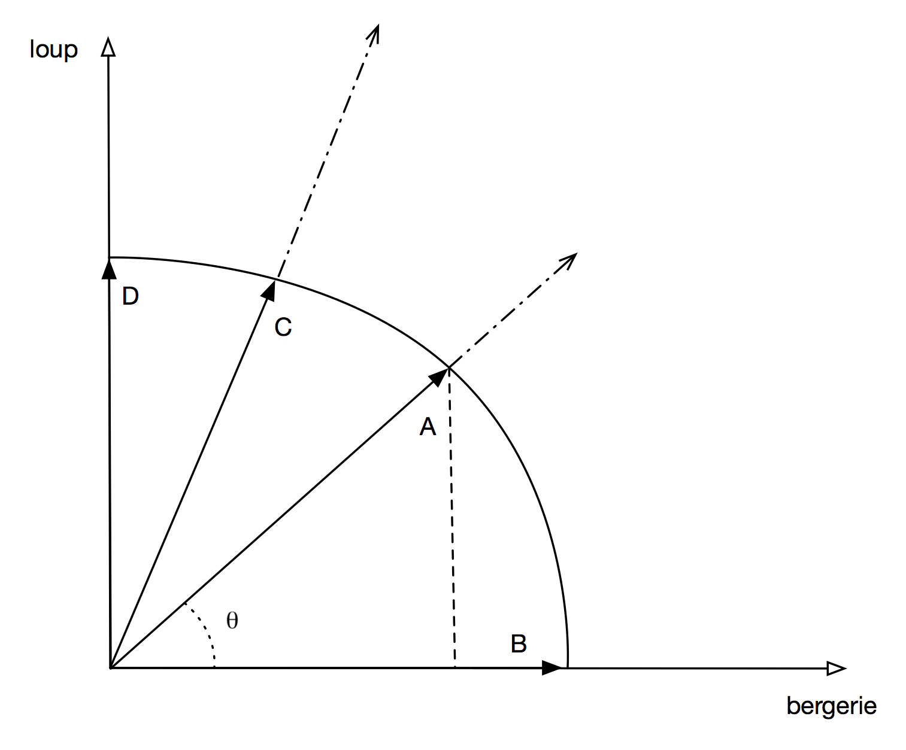
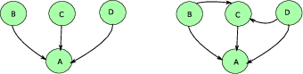
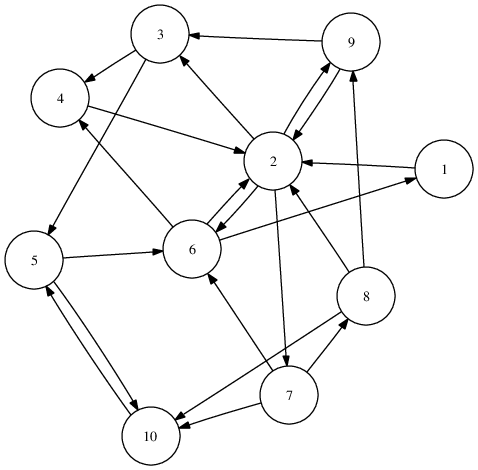

.. _chap-ranking:
   
#########################
Recherche avec classement
#########################

Supports complémentaires:

  * Un cours complet en ligne (en anglais): http://www-nlp.stanford.edu/IR-book/. *Certaines parties du cours empruntent des exemples
    à cette source*.
  
*****************************
S1: recherche avec classement
*****************************

Supports complémentaires:

  * `Présentation: Recherche avec classement <http://b3d.bdpedia.fr/files/slri-ranking-rankedsearch.pdf>`_
  * `Vidéo de la session "Principes de la recherche avec classement" <https://mediaserver.cnam.fr/permalink/v125f35a3b0b7my7jokt/>`_  

Le mode d'interrogation classique en base de données consiste à
exprimer des critères de recherche et à produire en sortie les
données qui satisfont *exactement* ces critères. En d'autres termes,
dans le cas d'une base documentaire, on peut déterminer qu'un document
est ou n'est pas dans le résultat. Cette décision univoque correspond
au modèle de requêtes Booléennes présenté précécemment.
 
Notions de base: espace métrique, distance et similarité
========================================================

Dans le cas typique
d'un document textuel, il est illusoire de vouloir effectuer une recherche
exacte en tentant de produire comme critère  la chaîne de caractères
complète du document, voire même une sous-chaîne. 
La même remarque s'applique
à des objets complexes ou multimédia (images, vidéos, etc.). La logique est alors
plutôt d'interpréter la requête comme un *besoin*, et d'identifier les
documents les plus "proches" du besoin.
En recherche d'information (*RI*), on raisonne donc plutôt en terme
de *pertinence* pour décider si un document fait ou non partie du résultat d'une recherche.  
La formalisation de ces notions
de besoin et de pertinence est au centre des méthodes de RI.

En particulier, la formalisation de la pertinence consiste à en donner une
expression *quantitative*. Pour cela, l'approche classique consiste

  * à définir un espace métrique *E* doté d'une fonction de *distance* :math:`m_E`, 
  * à définir une fonction :math:`f` de l'espace des documents vers *E*; cette fonction s'applique également
    à la requête *q*, vue comme un document;
  * enfin, on mesure la pertinence (ou *similarité*) entre
    deux documents :math:`d_1` et :math:`d_2` comme l'inverse de la distance entre :math:`f(d_1)`
    et :math:`f(d_2)`.
    
    .. math:: 
        
          sim(d, q) = \frac{1}{m_E(f(d_1), f(d_2))} 

On obtient une mesure de la similarité, ou *score*, mesurant la proximité de deux documents
(ou, plus précisément, des vecteurs représentant ces documents). Il reste à interpréter
la requête :math:`q` comme un document et à évaluer :math:`sim(f(d), f(q))` pour chaque document *d*
afin d'évaluer la pertinence d'un document vis-à-vis du besoin
exprimé par la requête.

Avec cette approche, contrairement aux requêtes Booléennes, on ne peut souvent plus dire 
de manière stricte qu'un document *d* n'appartient 
pas au résultat d'une recherche. Il est plus correct de dire que *d* est plus ou
moins *pertinent*. Cela rend les résultats beaucoup plus riches, et offre à l'utilisateur 
la possibilité d'éviter le "tout ou rien" de l'approche Booléenne.

.. note:: Reportez-vous au chapitre :ref:`chap-introri` pour une discussion
   introductive sur les notions de faux et vrais positifs, de rappel et de précision.
   

La contrepartie de cette flexibilité est l'abondance des candidats potentiels
et la nécessité de les *classer* en fonction de leur pertinence/score. Le rôle d'un
moteur de recherche consiste donc (conceptuellement), pour chaque requête *q*, 
à calculer le score :math:`s_i = sim(q, d_i)` pour chaque document :math:`d_i` 
de la collection, à trier tous les documents par ordre décroissant des scores
et à présenter ce classement à l'utilisateur. 

.. important:: Il faut ajouter une contrainte de temps: le résultat doit être 
   disponible en quelques dizièmes de secondes, même dans le cas de collections
   comprenant des millions, des centaines de millions ou des milliards de documents (cas du Web).
   La performance de la recherche s'appuie sur les structures d'index inversés
   et des optimisations fines qui dépassent le cadre de ce cours: 
   reportez-vous, par exemple, au livre en ligne mentionné en début de chapitre.
   
En pratique, le calcul du score pour *tous* les documents n'est bien sûr pas
faisable (ni souhaitable d'ailleurs), et le moteur de recherche dispose de structures
de données qui vont lui permettre de déterminer rapidement les 
documents ayant le meilleur score. Ces documents (disons les 10 ou 20 premiers, typiquement)
sont présentés à l'utilisateur, et le reste de la liste est calculé à la demande 
si besoin est. Dans le cas d'une interface interactive (et si le classement
est réellement pertinent vis-à-vis du besoin), il est rare qu'un utilisateur aille au-delà de la seconde,
voire même de la première page.

**Vocabulaire**. En résumé, voici les points à retenir.

  #. on effectue des calculs dans un espace métrique, le plus souvent un espace vectoriel;
  #. pour chaque document, on produit un objet de l'espace métrique, appelé *descripteur*,
     qui a le plus souvent la forme d'un *vecteur* (*features vector*);
  #. on applique le même traitement à la requête *q* pour obtenir un descripteur :math:`v_q`;
  #. le *score* est une mesure de la pertinence d'un document :math:`d_i` par rapport au
     *besoin* exprimé par la requête *q*; 
  #. le calcul du score s'appuie sur la mesure de la *distance* entre le descripteur de :math:`d_i` 
     et celui de *q*.

Ces principes étant posés, voyons une application concrète (quoique simplifiée
pour l'instant, et peu satisfaisante en pratique) au cas de la recherche plein texte.

Application à la recherche plein texte
======================================

.. important:: La méthode présentée ci-dessous n'est qu'une première approche, 
   à la fois très simplifiée et présentant de sévères défauts
   par rapport à la méthode générale que nous présenterons ensuite. 

Pour commencer, on suppose
connu l'ensemble :math:`V=\{t_1, t_2, \cdots, t_n\}` de tous les termes utilisables pour la rédaction d'un
document et on définit *E* comme l'espace de tous les vecteurs
constitués de *n* coordonnées valant soit 0, soit 1 (soit,
en notation mathématique, :math:`E = \{0, 1\}^{n}`). Ce sont nos descripteurs.

Par exemple, on considère que le vocabulaire est {"papa", "maman", "gateau", "chocolat", "haut", "bas"}. 
Nos vecteurs sont donc constitués de 6 coordonnées valant soit 0, soit 1. Il faut alors
définir la fonction :math:`f` qui associe un document *d* à son descripteur (vecteur) :math:`v = f(d)`.
Voici cette définition: 

.. math::

      v[i] = \left\{
                \begin{array}{ll}
                  1 \text{ si $d$ contient le terme $t_i$}\\
                  0 \text{ sinon}
                \end{array}
              \right.

C'est exactement la représentation que nous avons adoptée jusqu'à présent. À chaque
document on associe une séquence (un vecteur) de 1 ou de 0 selon que le terme :math:`t_i`
est présent ou non dans le document. 

Prenons un premier exemple. Le document :math:`d_{maman}`::

   "maman est en haut, qui fait du gateau"
   
sera représenté par le descripteur/vecteur :math:`[0, 1, 1, 0, 1, 0]`. Je vous laisse
calculer le vecteur de ce second document :math:`d_{papa}`::

  "papa est en bas, qui fait du chocolat"
 
.. note:: Remarquez que l'on choisit délibérément d'ignorer certains mots considérés
   comme peu représentatifs du contenu du document. Ce sont les *stop words* (mots
   inutiles) comme "est", "en", "qui", "fait", etc. 

.. note:: Remarquez également que *l'ordre des mots* dans le document est ignoré
  par cette représentation qui considère un texte comme un "sac de mots" (*bag of words*).
  Si on prend un document contenant les deux phrases ci-dessus, on ne sait
  plus distinguer si papa est en haut ou en bas, ou si maman
  fait du gateau ou du chocolat.
   
Maintenant, contrairement à la recherche Booléenne
dans laquelle on vérifiait que, pour chaque terme requis, la position correspondante dans le vecteur
d'un document était à 1, on va appliquer une fonction de distance sur les vecteurs
afin d'obtenir une valeur entre 0 et 1 mesurant la pertinence.
Un candidat naturel est la distance Euclidienne dont nous rappelons la définition,
pour deux vecteurs :math:`v_1` et :math:`v_2`.

.. math:: 

    E(v_1, v_2) = \sqrt{(v_1^1 - v^1_2)^2 + (v^2_1 - v^2_2)^2 + \cdots + (v_1^n - v^n_2)^2}

Et la similarité est l'inverse de la distance.

.. math::

      sim(v_1, v_2) = \left\{
                \begin{array}{ll}
                  \infty \text{ si $v^i_1=v^i_2$ pour tout $i$ }\\
                  \frac{1}{E(v_1, v_2)}  \text{ sinon}
                \end{array}
              \right.

On obtient une mesure de la similarité, ou *score*, mesurant la proximité de deux documents
(ou, plus précisément, des vecteurs représentant ces documents). 

Il reste à interpréter
la requête comme un document et à évaluer :math:`sim(f(d), f(q))` pour chaque document *d*
et la requête *q* pour évaluer la pertinence d'un document vis-à-vis du besoin
exprimé par la requête. La requête *q* par exemple::

   "maman haut chocolat"

est donc transformée en un vecteur :math:`v_q = [0, 1, 0, 1, 1, 0]`. Pour le document
:math:`d_{maman}`, on obtient un score
de :math:`sim (v_q, d_{maman}) = \frac{1}{\sqrt{2}}`.  À vous de calculer
:math:`sim (v_q, d_{papa})` et de vérifier que ce score est moins elevé, ce qui correspond
à notre intuition. Notez quand même:

  - que "chocolat", un des mots-clés de *q*, n'apparaît pas dans le document :math:`d_{maman}`, malgré tout classé en tête;
  - qu'un seul terme est commun entre :math:`d_{papa}` et *q*, et que le document est quand même (bien) classé;
  - qu'un document comme "``bébé mange sa soupe``" obtiendrait un score non nul (lequel?) et serait donc lui aussi
    classé (si on ne met pas de borne à la valeur du score).

Une différence concrète très sensible (illustrée ci-dessus) avec les requêtes Booléennes
est qu'il n'est pas nécessaire
qu'un document contienne *tous* les termes de la requête pour que son score soit
différent de 0. 

Les limites de l'approche présentée jusqu'ici sont explorées dans des
exercices. La méthode beaucoup plus robuste détaillée dans la prochaine section
montrera aussi, par contraste, coment des facteurs comme la taille des documents,
la taille du vocabulaire, le nombre d'occurrences d'un terme dans un document
et la rareté de ce terme influent sur la précision du classement.

Quiz
====

.. eqt:: ri-rank1-1

    Quelle est la différence entre un espace métrique (EM) et un espace vectoriel (EV)?
   
    A) :eqt:`I` Les données d'un EM sont ordonnées, contraitrement aux vecteurs
    #) :eqt:`I` Il existe une fonction de distance dans un EM, et pas dans un EV
    #) :eqt:`C` Un EV est un type particulier d'espace métrique

.. eqt:: ri-rank1-12

    Laquelle de ces propriétés n'est pas nécessaire pour une distance
   
    A) :eqt:`I` La symétrie
    #) :eqt:`I` L'inégalité triangulaire
    #) :eqt:`C` La valeur est comprise entre 0 et 1
    #) :eqt:`I` La distance est nulle ssi les deux objets sont les mêmes

.. eqt:: ri-rank1-2

    Quelle explication de la notion de "bag of words" vous semble la bonne.
   
    A) :eqt:`I` Chaque texte est représenté par un sous-ensemble de ses mots, c'est le "sac"
    #) :eqt:`C` Le texte est considéré comme un ensemble de mots sans ordre, comme
       s'ils étaient dans un "sac"
    #) :eqt:`I` Les textes sont projetés dans un espace vectoriel appelé "sac de mots".

.. eqt:: ri-rank1-3

    Pourquoi est-il plus correct de parler de distance entre les représentations des documents
    que de distance entre les documents eux-mêmes?
   
    A) :eqt:`C` Parce qu'il peut y avoir plusieurs représentations possibles d'un même
       document, ce qui peut influer sur la distance
    #) :eqt:`I` Parce que la distance naturelle entre deux documents textuels est trop coûteuse
       à calculer
    #) :eqt:`I` Parce que cela permet d'appliquer une même distance à des documents multimédia
       quelconques: images, vidéos, etc.

.. eqt:: ri-rank1-4

    Comment est interprétée une requête *q* ?
   
    A) :eqt:`I` C'est une séquence d"opérations à appliquer à la collection
    #) :eqt:`I` C'est une spécification de critères de recherche filtrant la collection
    #) :eqt:`C` C'est un document de même type que ceux de la collection
    #) :eqt:`I` C'est une sous-chaîne des documents textuels de la collection
   

.. eqt:: ri-rank1-5

    Qu'est-ce qui détermine le classement du résultat?
   
    A) :eqt:`I` On calcule toutes les distances entre chaque paire de documents, et on trie.
    #) :eqt:`C` On calcule la distance par rapport à un document de référence: la requête
    #) :eqt:`I` Les documents qui contiennent le plus de termes sont classés en premier

.. eqt:: ri-rank1-6

    Qu'est-ce qu'un *stop word*
   
    A) :eqt:`I` On exclut les documents qui contiennent ce mot
    #) :eqt:`C` C'est un mot courant qui n'informe pas sur le document
    #) :eqt:`I` C'est un mot qui déclenche l'arrêt de la recherche quand il est rencontré

.. eqt:: ri-rank1-7

    Un document doit contenir tous les mots de la requête pour être pertinent
   
    A) :eqt:`I` Vrai
    #) :eqt:`C` Faux

.. eqt:: ri-rank1-8

    Quelle propriété de la distance euclidienne est vraie?
   
    A) :eqt:`I` On ne prend en compte que les 1
    #) :eqt:`I` On ne prend en compte que les 0
    #) :eqt:`C` On prend en compte toutes les coordonnées des vecteurs
    #) :eqt:`I` On prend en compte les coordonnées du vecteur décrivant la requête

**************************
S2: recherche plein  texte
**************************

Supports complémentaires:

  * `Présentation: Recherche plein texte <http://b3d.bdpedia.fr/files/slri-ranking-fulltextsearch.pdf>`_
  * `Vidéo de la session classement dans la recherche plein texte <https://mediaserver.cnam.fr/permalink/v125f35a3b0588uwz8x9/>`_  

Nous reprenons maintenant un approche plus solide pour la recherche plein texte,
qui pour l'essentiel s'appuie sur les principes précédents, mais corrige les
gros inconvénients que vous avez dû découvrir en complétant les exercices.

La méthode présentée dans ce qui suit est maintenant bien établie et utilisée, 
à quelques raffinements près, comme approche de base par tous les moteurs de recherche.
Résumons (une nouvelle fois):

  * les documents (textuels) sont vus comme des *sacs de mots*, l'ordre entre les mots étant
    ignoré; on ne fera pas de différence entre un document qui dit que le mouton est
    dans la gueule du loup et un autre qui prétend  que le loup est dans la gueule du mouton (?);
  * quand on parle de "mots", il faut bien comprendre: les termes obtenus par application
    d'un processus de simplification / normalisation lexicale déjà étudié;
  * un descripteur est associé à chaque document, dans un espace doté d'une fonction
    de distance qui permet d'estimer la similarité entre deux documents;
  * enfin, la *requête* elle-même est vue comme un document, et placée donc dans le même espace;
    on considère donc ici les requêtes exprimées comme une liste de mots, sans aucune construction 
    syntaxique complémentaire.
    
Ceci posé, nous nous concentrons sur la fonction de similarité. 

.. note:: "mot" et "terme" sont utilisés comme des synonymes à partir de maintenant. 

Le poids des mots
=================

Dans l'approche très simplifiée présentée ci-dessus, nous avons traité les mots uniformément,
selon une approche Booléenne: 1 si le mot est présent dans le document, 0 sinon.

Pour obtenir des résultats de meilleure qualité, on va prendre en compte
les degrés de pertinence et d'information portés par un terme, selon deux principes:

  #. plus un terme est présent dans un document, plus il est représentatif du contenu du document;
  #. moins un terme est présent dans une collection, et plus une occurrence de terme est significative.
  
De plus, on va tenter d'éliminer le biais lié à la longueur variable
des documents. Il est clair que plus un document est long, et plus il contiendra
de mots et de répétitions d'un même mot. Si on n'introduit pas un élément correctif, 
la longueur des documents a donc un impact fort sur le résultat d'une recherche et
d'un classement, ce qui n'est pas forcément souhaitable.

En tenant compte de ces facteurs, on aboutit à affecter un *poids* 
à chaque mot dans un document, et à représenter ce dernier comme un vecteur
de paires *(mot, poids)*, ce qui peut être considéré comme une représentation compacte 
du contenu du document.  La méthode devenue classique pour déterminer le poids est 
de combiner la *fréquence des termes* et la *fréquence inverse (des termes) dans
les documents*, ce que l'on abrège par *tf* (*term frequency*)
et *idf* (*inverse document frequency*).

La fréquence des termes
-----------------------

La *fréquence d'un terme t* dans un document *d* est le nombre d'occurrences de
*t* dans *d*.

.. math::

    \mathrm{tf}(t,d)= n_{t,d}

où :math:`n_{t,d}` est le nombre d'occurrences de *t'* dans *d*. On
représente donc un document par la liste des termes associés à leur fréquence. Si
on prend une collection de documents, dans laquelle certains termes apparaissent
dans plusieurs documents (ce qui est le cas normal), on peut représenter
les *tf* par une matrice semblable à la matrice d'incidence déjà vue
dans la cas Booléen. Celle ci-dessous correspond à une collection de trois documents,
avec un vocabulaire constitué de 4 termes.

.. csv-table:: 
   :header: terme, d1, d2, d3
   :widths: 10, 10, 10, 10
             
   "voiture", 27, 15, 24
   "marais", 3, 20, 0
   "serpent", 0, 25, 29
   "baleine", 14, 0, 17
   "`total`", `44`, `60`, `70`

Normalisation des *tf*
----------------------

Il y a donc 44 termes dans le document *d1*, 60 dans le *d2* et 70 dans le *d3*. Il est clair qu'il est difficile
de comparer dans l'absolu des fréquences de terme pour des documents de longueur très différentes, car
la probabilité qu'un terme apparaisse souvent augment avec la taille du document.

Pour s'affranchir de l'effet induit par la taille (qui amènerait à classer systématiquement en tête les
documents longs), on *normalise* donc les valeurs des *tf*. Une méthode simple est, par exemple,
de diviser chaque *tf* par le nombre total de termes dans le document, ce qui donnerait la
matrice suivante:

.. csv-table:: 
   :header: terme, d1, d2, d3
   :widths: 10, 10, 10, 10
             
   "voiture", 27/44, 15/60, 24/70
   "marais", 3/44, 20/60, 0
   "serpent", 0, 25/60, 29/70
   "baleine", 14/44, 0, 17/70

Un calcul un peu plus sophistiqué consiste à considérer l'ensemble une colonne de la matrice
d'incidence comme un vecteur dans un espace multidimensionel. Dans notre exemple l'espace
est de dimension 4, chaque axe correspondant à l'un des termes. Le vecteur de *d1*
est (27, 3, 0, 14), celui de *d2* (15,20, 25,0), etc.
Pour normaliser ces vecteurs, on va diviser leurs coordonnées par leur norme euclidienne.
Rappel: la norme d'un vecteur :math:`v = (x_1, x_2, \cdots, x_n)` est

.. math::
         
            ||v|| = \sqrt{x_1^2 + x_2^2 + \cdots + x_n^2} 

La norme du vecteur *d1* est donc:

.. math::
         
            \sqrt{27^2 + 3^2 + 14^2} =  30,56

Celle de *d2*:

.. math::
         
            \sqrt{15^2 + 20^2 + 25^2} =  35,35

Celle de *d3*:

.. math::
         
            \sqrt{24^2 + 29^2 + 17^2} =  41,3

On voit que le résultat est assez différent de la simple somme des *tf*. L'interprétation 
des descripteurs de documents comme des vecteurs est à la base d'un calcul de similarité
basé sur les cosinus, que nous détaillons ci-dessous.

La fréquence inverse dans les documents
---------------------------------------

La fréquence inverse d'un terme dans les documents (*inverse document
frequency*, ou *idf*) mesure l'importance d'un terme par rapport à une
collection *D* de documents. Un terme qui apparaît rarement peut être considéré
comme plus caractéristique d'un document qu'un autre, très commun. On retrouve
l'idée des mots inutiles, avec un raffinement consistant à mesurer le degré
d'utilité. 

L'idf d'un terme *t*  est obtenu en divisant le nombre total de documents par
le nombre de documents contenant au moins une occurrence de *t*. De plus, on prend
le logarithme de cette fraction pour conserver cette valeur dans un intervalle
comparable à celui du *tf*. 

.. math::

    \mathrm{idf}(t)=\log\frac{|D|}{\left|\left\{d' \in D\,|\,n_{t,d'}>0\right\}\right|}
 
Notez que si on ne prenait pas le logarithme, la valeur de l'idf pourrait
devenir très grande, et rendrait négligeable l'autre composante du poids d'un
terme. La base du logarithme est 10 en général, mais quelle que soit la base,
vous noterez que l'idf est nul dans le cas d'un terme apparaissant dans *tous*
les documents (c'est clair? sinon réfléchissez!).

Reprenons notre matrice ci-dessus en supposant que la collection se limite
aux trois documents. Alors

  - l'idf de "voiture" est 0, car il apparaît dans tous les documents. Intuitivement, "voiture"
    est (pour la collection étudiée) tellement courant qu'il n'apporte rien comme critère de recherche.
  - l'idf de "marais", "serpent" et "baleine"   est :math:`log(3/2)`

Dans un cas plus réaliste, un terme qui apparaît 100 fois dans une collection d'un million de documents aura
un idf de :math:`log_{10}(1000000/100) = log_{10}(10000) = 4` (en base 10). Un terme qui n'apparaît
que 10 fois aura un idf de :math:`log_{10}(1000000/10) = log_{10}(100000) = 5`. Une valeur d'idf plus élevée
indique le terme est relativement plus important car plus rare.
  
 
Le poids tf.idf
---------------

On peut combiner le tf (normalisé ou non) et l'idf pour obtenir le poids tf.idf d'un terme *t* dans un document.
C'est simplement le produit des deux valeurs précédentes:

.. math::

    \mathop{\mathrm{tf{.}idf}}(t,d)= n_{t,d}\cdot \log\frac{|D|}{\left|\left\{d'\in D\,|\,n_{t,d'}>0\right\}\right|}
    
À chaque document *d* nous associons un vecteur :math:`v_d` dont chaque composante :math:`v_d[i]`
contient le tf.idf du terme :math:`t_i` pour *d*. 

Si le tf n'est pas normalisé,  les valeurs des tf.idf 
seront d'autant plus élevées que le document est long. En terme de stockage (et pour anticiper un peu sur la
structure des index inversés), il est préférable de stocker 

  - l'idf à part, dans une structure indexée par le terme, 
  - la norme des vecteurs à part, dans une structure indexéee par les documents
  - et enfin de placer dans chaque cellule la valeur du tf.
  
On peut alors effectuer le produit tf.idf et la division par la norme au moment du calcul de la distance. 

La similarité cosinus
=====================

Nous avons donc des vecteurs représentant les documents. La requête
est elle aussi représentée par un vecteur  dans lequel les coefficients 
des mots sont à 1.  Comment calculer la distance entre ces vecteurs?
Si on prend comme mesure la norme de la différence entre deux vecteurs comme nous l'avons fait 
initialement, des anomalies sévères apparaissent car deux documents peuvent avoir des 
contenus semblables mais des tailles très différentes. La distance Euclidienne n'est donc
pas un bon candidat. 

On pourrait mesure la distance euclidienne entre les vecteurs normalisés. 
Une mesure plus adaptée en pratique  est la *similarité cosinus*. Commençons par quelques rappels,
en commençant par la formule du *produit scalaire* de deux vecteurs.

.. math::

    v_1 . v_2  = ||v_1|| \times ||v_2|| \times cos \theta = \sum_{i=1}^n v_1[i] \times v_2[i]
    
où :math:`\theta` désigne l'angle entre les deux vecteurs et :math:`||v||` la norme d'un vecteur 
*v* (sa longueur Euclidienne). 

On en déduit donc que le cosinus de l'angle entre deux vecteurs satisfait:

.. math::

    cos { } \theta  = \frac{\sum_{i=1}^n v_1[i] \times v_2[i]}{||v_1|| \times ||v_2||}

Quel est l'intérêt de prendre ce cosinus comme mesure de similarité? L'idée est que l'on compare
la *direction* de deux vecteurs, indépendamment de leurs longueurs. La  :numref:`CosineSim`
montre la représentation des vecteurs pour nos documents de l'exercice `Ex-S1-1`_. Les
vecteurs en ligne pleine sont les vecteurs unitaires, normalisés, les lignes pointillées
montrant les vecteurs complets. Pour des raisons d'illustration,
l'espace est réduit à deux dimensions correspondant  aux deux termes, "loup" et "bergerie".
Il faut imaginer un espace vectoriel de dimension *n*, *n* étant le nombre
de termes dans la collection, et donc potentiellement très grand.

.. _CosineSim:

   
      Illustration de la similarité cosinus
     

Les documents (B) et (D) contiennent respectivement une occurrence de "bergerie" et une de "loup":
ils sont alignés avec les axes respectifs. 

Le  document (A) contient une occurrence de "loup" 
et une de "bergerie" et fait donc un angle de 45 degrés avec l'abcisse: le cosinus de cet angle,
égal à :math:`\sqrt{2}/2`, représente la similarité entre A et B. 

En ce qui concerne C, 
"loup" est mentionné deux fois et "bergerie" une, d'où un angle plus important avec l'abcisse. 
      
Le fait d'avoir comme dénominateur
dans la formule le produit des normes revient à normaliser le calcul en ne considérant que des
vecteurs de longueur unitaire.  La mesure satisfait aussi des conditions satisfaisantes
intuitivement:

  - l'angle entre deux vecteurs de même direction est 0, le cosinus vaut 1;
  - l'angle entre deux vecteurs orthogonaux, donc "indépendants" (aucun terme en commun),
    est 90 degrés, le cosinus vaut 0;
  - toutes les autres valeurs possibles (dans la mesure où les coefficients de nos vecteurs sont
    positifs) varient continuement entre 0 et 1 avec la variation de l'angle entre 0 et 90 degrés.

Dernier atout: la similarité cosinus est très simple à calculer, et très rapide pour des vecteurs
comprenant de nombreuses composantes à 0, ce qui est le cas pour la représentation des documents.
    
.. note:: 

          La similarité cosinus n'est pas une distance au sens strict du terme (l'inégalité triangulaire
          n'est pas respectée), mais ses propriétés en font un excellent candidat.

Passons à la pratique sur notre exemple de trois documents représentés par la matrice
donnée précédemment. On va ignorer l'idf pour faire simple, et se contenter de prendre en compte
le tf.

Commençons par une requête simplissime: "voiture". Cette requête est représentée dans l'espace
de dimension 4 de notre vocabulaire par le vecteur (1, 0, 0, 0), dont la norme est 1.
On pourrait croire qu'il suffit de prendre le classement des *tf*
du terme concerné, sans se lancer dans des calculs compliqués, auquel cas
*d1* arriverait en tête juste devant *d3*. *Erreur!* Ce qui compte ce n'est pas
la fréquence d'un terme, mais sa proportion par rapport aux autres. Il faut appliquer le
calcul cosinus rigoureusement.

Calculons donc les cosinus. Pour d1, le cosinus vaut est le produit scalaire des
vecteurs (27, 3, 0, 14) et (1, 0, 0, 0), divisé par le produit de la norme de ces deux vecteurs: 

.. math::
   
     \frac{27 \times 1 + 3 \times 0 + 0 \times 0 + 14 \times 0}{1  \times 30,56} = 0,88
 
Pour les autres documents:

     * Pour d2, le cosinus vaut : :math:`\frac{15 + 0 + 0 + 0}{1 \times 35,35} = 0,424`
     * Pour d3, le cosinus vaut : :math:`\frac{24 + 0 +0 +0}{1,41 \times 41,3} = 0,58`

Le classement est d1, d3, d2, et on voit que *d1* l'emporte assez nettement sur *d3* alors que
le nombre d'occurrences du terme "voiture" est à peu près le même dans les deux cas. Explication:
*d1* parle *essentiellement* de voiture, le second terme le plus important, "baleine", ayant moins
d'occurrences. Dans *d3* au contraire, "serpent" est le terme principal, "voiture" arrivant en second.
Le document *d1* est donc plus pertinent pour la requête et doit être classé en premier.

Prenons un second exemple, "voiture" et "baleine". Remarquons d'abord que les coefficients de la requête sont (1, 0, 0, 1) et
sa norme :math:`\sqrt{1+1} = 1,41`. Voici les calculs cosinus:
    
             * Pour d1, le cosinus vaut : :math:`\frac{27 + 14}{1,41 \times 30,56} = 0,95`
             * Pour d2, le cosinus vaut : :math:`\frac{15 + 0}{1,41 \times 35,35} = 0,30`
             * Pour d3, le cosinus vaut : :math:`\frac{24 + 17}{1,41 \times 41,3} = 0,70`

L'ordre est donc d1, d3, d2. Le document d3 présente un meilleur équilibre 
entre les composantes ``voiture`` et  ``baleine``, mais, contrairement
à d1, il a une autre composante forte pour ``serpent``
ce qui diminue sa similarité.

Quiz
====

.. eqt:: ri-tfidf-1

    Pourquoi un terme est-il considéré comme important pour un document?
   
    A) :eqt:`I` Parce qu'il est rare dans le document
    #) :eqt:`C` Parce qu'il est rare dans la collection
    #) :eqt:`I` Parce qu'il est fréquent dans la collection et rare dans le document
    #) :eqt:`I` Parce qu'il est rare dans la collection et fréquent dans le document

.. eqt:: ri-tfidf-1a

    Je soumets une requête :math:`t_1 t_2 \cdots t_n`. Quel est le tf de chaque terme
    dans le vecteur représentant cette requête?
   
    A) :eqt:`I`  :math:`\frac{1}{n}`
    #) :eqt:`C`  1
    #) :eqt:`I`  :math:`\frac{1}{\sqrt{n}}`

.. eqt:: ri-tfidf-1b

    La normalisation de ce vecteur-requête est elle
    importante pour le classement ?
   
    A) :eqt:`C` Non puisque cela revient à multiplier tous les rangs par une constante positive, et
       ne change donc pas l'ordre.
    #) :eqt:`I` Oui car c'est la condition pour permettre le calcul du cosinus
    #) :eqt:`I` Non car la normalisation n'a de sens que pour les documents, pas pour la requête

.. eqt:: ri-tfidf-1c

    Dans la figure :numref:`euclidiandistance`, qu'obtient-on en projetant un vecteur sur l'axe d'un terme *t* ?
   
    A) :eqt:`I` La norme du vecteur multipliée par le cosinus
    #) :eqt:`I` L'idf du terme *t*
    #) :eqt:`I` Le tf du terme *t*
    #) :eqt:`C` Le tf.idf du terme *t*

    .. _euclidiandistance:
    .. figure:: ../figures/euclidiandistance.png
       :width: 50%
       :align: center

       Vecteurs dans un espace Euclidien

.. eqt:: ri-tfidf-2

    On exprime une requête avec un seul terme. Est-ce que l'idf du terme a une importance pour
    le classement?
   
    A) :eqt:`C` Non puisque cela ne change pas la direction du vecteur
    #) :eqt:`I` Oui car cela change sa norme
    #) :eqt:`I` Non car son idf est forcément égal à 1 dans ce cas

.. eqt:: ri-tfidf-3

    Quel est le but de la normalisation ?
   
    A) :eqt:`C` Unifier la taille des vecteurs décrivant les documents
    #) :eqt:`I` Effacer les écarts entre les fréquences de termes dans un document
    #) :eqt:`I` Utiliser une même représentation pour tous les documents

.. eqt:: ri-tfidf-4

    Comment caractériser un mot qui n'a aucun intérêt pour une recherche?
   
    A) :eqt:`I` C'est un mot dont l'idf vaut 1
    #) :eqt:`C` C'est un mot dont l'idf vaut 0
    #) :eqt:`I` C'est un mot qui n'apparaît que dans un seul document

.. eqt:: ri-tfidf-5

    Deux documents de même longueur contiennent tous les deux le même nombre
    d'occurrences d'un terme *t*. Que peut-on en déduire sur le classement
    de ces documents si je fais une recherche avec l'unique terme *t*?

    A) :eqt:`I` Ils seront tous les deux classés en tête avec une valeur cosinus de 1
    #) :eqt:`I` Leur classement sera le même, mais pas forcément en tête
    #) :eqt:`C` Leur classement dépend, pour chacun, des co-occurrences avec d'autres termes
       différents de *t*

.. eqt:: ri-tfidf-6

    Je soumets une requête composée de deux termes: :math:`t_1`  et :math:`t_2`, qui ont le même idf. Chaque document
    contient soit :math:`t_1`, soit :math:`t_2`, une seule fois,  et jamais les deux ensemble. Quel
    sera le résultat?

    A) :eqt:`I` Ils seront tous les deux classés en tête avec une valeur cosinus de 1
    #) :eqt:`I` Leur classement sera le même, mais pas forcément en tête
    #) :eqt:`C` Les documents sont classés selon leur taille

*************************
S3: l'algorithme PageRank
*************************

.. note:: Cette session est proposée en complément au cours mais ne fait pas partie du contenu
   évalué à l'examen.

Supports complémentaires:

  * `Présentation: PageRank <http://b3d.bdpedia.fr/files/slri-ranking-pagerank.pdf>`_

Les pages Web sont des documents particuliers : ils contiennent du texte, mais
aussi des liens hypertextes qui permettent de passer d'une page à une autre. On
peut donc voir le Web comme un (gigantesque) graphe orienté, dont les sommets
sont des pages et les liens sont les arcs du graphe. Ce constat a amené de
grands algorithmes pour améliorer la recherche d'information sur le Web : le
PageRank et HITS. Je vais détailler le fonctionnement du premier, pour le second
vous pouvez consulter la section correspondante dans le livre "Web data
management" (lien vers le chapitre:
http://webdam.inria.fr/Jorge/files/wdm-websearch.pdf).

Le problème de la mesure TF-IDF détaillée précédemment, c'est qu'elle ne
parvient pas à distinguer le vrai du faux : deux pages Web portant sur le même
sujet, avec les mêmes fréquences d'apparition des mots mais *affirmant des
choses* opposées, seront classées de la même manière. Pourtant, les utilisateurs
ont besoin d'en trouver facilement une et apprécient de ne pas voir l'autre (qui
contient de fausses informations). L'idée du PageRank, c'est de profiter de la
structure du graphe pour améliorer le classement TF-IDF en distinguant les pages
"faisant autorité" des pages dont on peut se passer. Les liens sont en effet
très parlants : une page "de référence" est beaucoup citée (de nombreux liens
pointent vers elle), alors qu'une page obscure est généralement assez isolée
dans le graphe.

Le PageRank a été élaboré par Larry Page et Serguei Brin, les fondateurs de
Google, et publié dans un article de recherche lorsqu'ils étaient étudiants à
l'université Stanford (`lien fou <http://ilpubs.stanford.edu/422/1/1999-66.pdf>`_).
L'algorithme formalise mathématiquement l'intuition du paragraphe précédent, en
imaginant une *marche aléatoire* dans le graphe du Web, et en estimant finement
la probabilité que cette marche aléatoire s'arrête sur une page donnée. Plus il
y a de liens qui mènent vers une page, plus elle est importante (pour les
utilisateurs qui créent les pages), plus cette probabilité est élevée : c'est
le score PageRank. 

Un cas simple
=============

Regardons un graphe du Web simplifié à l'extrême, où il n'y aurait que 4 pages
(nommées A, B, C et D) et reliées comme dans la figure :numref:`pagerankBasic`.

.. _pagerankBasic:

   
      Deux graphes simples

Pour le graphe de gauche, si l'on marche aléatoirement sur ce graphe, la
probabilité d'atteindre la page A à l'étape *i* est égale à la probabilité de se
trouver en B, C ou D à l'étape *i-1*. On peut donc écrire :
     
.. math:: 

  pr(A) = pr(B) + pr(C) + pr(D)

Dans des cas moins simples, le marcheur doit choisir par quelle arête sortante
il va quitter une page. On suppose que la probabilité de choisir chacune de ces
arêtes est uniforme pour une page donnée.

Ainsi, sur le graphe de droite de la figure :numref:`pagerankBasic`, pour
arriver en C à l'étape *i*, le marcheur peut partir de B ou de D. Mais, pour
sortir de B, le marcheur a une probabilité 1/2 de choisir l'arête menant vers C,
et une probabilité 1/2 de choisir l'arête menant vers A (il y a deux liens sur
la page B). On écrit :

.. math:: 

  pr(C) = ContributionDeB + ContributionDeD = \frac{1}{2} pr(B) + \frac{1}{2} pr(D)

Généralisons
============

Bien sûr, le Web n'est pas composé de seulement 4 pages, il nous faut donc
généraliser. On utilise pour cela une matrice de transition, qui encode ces
probabilité de passer d'une page à l'autre. Soit :math:`G = (g_{ij})` cette
matrice, elle contient les coefficients suivants :

.. math::

  \left\{\begin{array}{ll}
    g_{ij} = 0 & \mbox{s'il n'y a pas de lien entre les pages i et j} \\
    g_{ij} = \frac{1}{n_i} & \mbox{sinon, avec} n_i \mbox{le nombre de liens sortant de i}
  \end{array}
  \right.

Regardons le graphe plus grand de la figure :numref:`graph`, contenant 10 pages. 

.. _graph:

   
      Un exemple plus complet

La matrice de transition associée à ce graphe est la suivante :

.. math::

  G=\begin{pmatrix}
  0&1&0&0&0&0&0&0&0&0\\
  0&0&\frac 1 4&0&0&\frac 1 4&\frac 1 4&0&\frac 1 4&0\\
  0&0&0&\frac 1 2&\frac 1 2&0&0&0&0&0\\
  0&1&0&0&0&0&0&0&0&0\\
  0&0&0&0&0&\frac 1 2&0&0&0&\frac 1 2\\
  \frac 1 3&\frac 1 3&0&\frac 1 3&0&0&0&0&0&0\\
  0&0&0&0&0&\frac 1 3&0&\frac 1 3&0&\frac 1 3\\
  0&\frac 1 3&0&0&0&0&0&0&\frac 1 3&\frac 1 3\\
  0&\frac 1 2&\frac 1 2&0&0&0&0&0&0&0\\
  0&0&0&0&1&0&0&0&0&0\\
  \end{pmatrix}

Il y a 4 liens sortant du nœud 2, vers les pages 3, 6, 7 et 9. Donc les
coefficients de la ligne 2 sont tous nuls sauf :math:`g_{23}`, :math:`g_{26}`,
:math:`g_{27}`, et :math:`g_{29}`, qui valent chacun 1/4.

Calculons le PageRank pas à pas. Je veux la probabilité d'arriver sur le nœud 2
(noté N2) à l'étape *e*. J'ai besoin de :

- la probabilité de me trouver sur une page donnée au départ : je me donne un
  vecteur uniforme :math:`v` de taille :math:`n = 10`

.. math::

  v = [0.1, 0.1, 0.1, 0.1, 0.1, 0.1, 0.1, 0.1, 0.1, 0.1]

- la probabilité de passer d'une page donnée à la page N2 : c'est la seconde
  colonne de la matrice (transposée) :

.. math::

  C_2^{T} = [1, 0, 0, 1, 0, 1/3, 0, 1/3, 1/2, 0]

Multiplions ces vecteurs: 

.. math::

  0.1 \times 1 + 0.1 \times 1 + 0.1 \times 1/3 + 0.1 \times 1/3+ 0.1 \times 1/2 = 0.317

J'ai une probabilité de 0.317 de me trouver sur N2 après une itération, si je
suis parti avec une probabilité uniforme de n'importe laquelle des 10 pages. 

On reproduit ce calcul pour les 10 nœuds, et l'on stocke le résultat dans le
vecteur :math:`v`. La deuxième coordonnée de ce vecteur contient 0.317
(puisqu'on voulait arriver au nœud 2). Vous pourriez vérifier que l'on a :

.. math::

  v = [0.033, 0.317, 0.075, 0.083, 0.150, 0.108, 0.025, 0.033, 0.058, 0.117]

Si l'on souhaite poursuivre la marche aléatoire une étape plus loin, il faut
prendre ce vecteur, et ré-effectuer la multiplication par les colonnes de la
matrice. Cependant, ce qui nous intéresse, ce ne sont pas chacune des étapes,
mais la valeur de ce vecteur :math:`v` quand le nombre d'étapes tend vers
l'infini (si cette limite existe). 

.. math::

  \mathsf{pr}(i)=\left(\lim_{k\rightarrow+\infty}(G^T)^kv\right)_i

La convergence n'est pas complètement assurée dans le cas du Web, et peut
dépendre de la position initiale. En outre, des pages ne contiennent pas de
liens *sortants*, bloquant la marche aléatoire. Pour ces raisons, on modifie
légèrement le modèle, en ajoutant qu'avec une probabilité :math:`d > 0`, le
marcheur ne suit pas "un des liens *sortant* de la page" mais peut se retrouver à
n'importe quel endroit du Web (comme quand il saisit une nouvelle adresse dans
la barre de son navigateur, sans rapport avec la page consultée). Chacune des
autres pages a une probabilité uniforme d'être choisie.

La véritable formule du PageRank est donc :

.. math::

  \mathsf{pr}(i)=\left(\lim_{k\rightarrow+\infty}((1-d)G^T+dU)^kv\right)_i

où :math:`U` est une matrice contenant :math:`\frac{1}{N}` dans chaque cellule
(et l'indice i que l'on prend la i-ème coordonnée du vecteur-limite).

Le théorème de Perron-Frobenius assure cette fois l'existence de la limite (et
qu'elle ne dépend pas de la position initiale). 

Le *vrai score* de Google
=========================

Le PageRank est depuis longtemps un algorithme public, qui peut donc être (et
est) utilisé par tous les moteurs de recherche. La valeur pour chaque page 
pondère le résultat du TF-IDF, afin de modifier le classement, faisant remonter
les pages beaucoup citées. 

Chaque moteur de recherche complète ces scores par divers critères, afin de
personnaliser l'expérience de recherche (afficher d'abord des avocats "fruits"
aux maraîchers, des avocats "de profession" aux magistrats). Remarquons enfin
qu'une difficulté majeure réside dans la mise au point d'heuristiques de calcul
pour estimer la valeur de la limite pour toutes les pages du Web (chacune est
une ligne ET une colonne d'une gigantesque matrice…). Une tâche qui est d'autant
plus délicate que de nombreuses pages sont créées, mises à jour ou détruites à
chaque instant.

*********
Exercices
*********

.. _Ex-S1-1:
.. admonition:: Exercice `Ex-S1-1`_: premiers pas vers la recherche plein texte

   Voici quelques documents textuels (brefs!).
   
     * A: ``Le loup est dans la bergerie.``
     * B: ``Les moutons sont dans la bergerie.``
     * C: ``Un loup a mangé un mouton, les autres loups sont restés dans la bergerie.``
     * D:  ``Il y a trois moutons dans le pré, et un mouton dans la gueule du loup.``
       
   Prenons le vocabulaire suivant: {"loup", "mouton", "bergerie", "pré", "gueule"}. 
   
     * Construisez la fonction qui associe chaque document à un vecteur dans :math:`\{0, 1\}^{5}`. Vous pouvez
       représenter cette fonction sous forme d'une matrice d'incidence.
     * Calculer le score de chaque document par la distance Euclidienne
       pour les recherches suivantes, et en déduire le classsement:
     
       - :math:`q_1`. "loup et pré"
       - :math:`q_2`. "loup et mouton"
       - :math:`q_3`. "bergerie"
       - :math:`q_4`. "gueule du loup"
  
.. ifconfig:: rankingS1 in ('public')

   .. admonition:: Correction
  
      Les vecteurs des documents
      
        - :math:`v(A) = [1, 0, 1, 0, 0]`
        - :math:`v(B) = [0, 1, 1, 0, 0]`
        - :math:`v(C) = [1, 1, 1, 0, 0]`
        - :math:`v(D) = [1, 1, 0, 1, 1]`
        
      Les vecteurs des requêtes
      
        - :math:`v(q_1) = [1, 0, 0, 1, 0]`
        - :math:`v(q_2) = [1, 1, 0, 0, 0]`
        - :math:`v(q_3) = [0, 0, 1, 0, 0]`
        - :math:`v(q_4) = [1, 0, 0, 0, 1]`
        
      En ce qui concerne les requêtes:
      
        - :math:`E(q_1, A) = \sqrt{2}; E(q_1, B) = \sqrt{4}; E(q_1, C) = \sqrt{3}; E(q_1, D) = \sqrt{2}`.  A et D sont les plus pertinents,
          suivi de C  et enfin B. Notez que A de contient pas le mot "pré". Pourquoi
          obtient-il le même score que D?
        - :math:`E(q_2, A) = \sqrt{2}; E(q_2, B) = \sqrt{2}; E(q_2, C) = \sqrt{1}; E(q_2, D) = \sqrt{2}`. 
        - :math:`E(q_3, A) = \sqrt{1}; E(q_3, B) = \sqrt{1}; E(q_3, C) = \sqrt{2}; E(q_3, D) = \sqrt{5}`.
        - :math:`E(q_4, A) = \sqrt{2}; E(q_4, B) = \sqrt{4}; E(q_4, C) = \sqrt{3}; E(q_4, D) = \sqrt{2}`. C'est
          donc D qui l'emporte, mais à égalité avec A, ce ne correspond pas vraiment à l'intuition.

.. _ftsdistanceapp:
.. _Ex-S1-2:
.. admonition:: Exercice `Ex-S1-2`_:  à propos de la fonction de distance

   Supposons que l'on prenne comme distance non pas la distance Euclidienne mais le carré
   de cette distance. Est-ce que cela change le classement? Qu'est-ce que cela vous inspire?
   
.. ifconfig:: rankingS1 in ('public')

   .. admonition:: Correction
  
      On peut effectuer un calcul *simplifié* de la distance, tant que l'ordre est respecté. Ce
      qui nous intéresse en fait, ce n'est pas le score proprement dit, mais l'ordre des scores. 

.. _ftsbaddistance:
.. _Ex-S1-3:
.. admonition:: Exercice `Ex-S1-3`_:  critique de la distance Euclidienne

   La  distance que nous avons utilisée mesure la *différence* entre la requête
   et un document, par comparaison des termes un à un. Cela induit des inconvénients
   qu'il est assez facile de mettre en évidence. 
   
   Supposons maintenant que le vocabulaire a une taille très grande. On fait une recherche avec 1 mot-clé.
   
     - quel est le score pour un document qui ne contient 99 termes et pas ce mot-clé?
     - quel est le score pour un document qui contient 101 termes *et* le mot-clé? 

   Conclusion? Le classement obtenu sera-t-il satisfaisant? Trouvez un cas où un document est bien classé
   même s'il ne contient pas le mot-clé !
   
.. ifconfig:: rankingS1 in ('public')

   .. admonition:: Correction
  
      Distance de :math:`\sqrt{100}=10` dans le premier cas; de :math:`\sqrt{100}` dans le second également. Ils seront classés au même niveau,
      ce qui ne va pas du tout!   
      
      Un document avec 50 termes sera mieux classé
      que n'importe quel document de 100 termes contenant ou non le mot-clé. Cela nous met sur
      la piste de ce qui ne va pas: la mesure que nous utilisons est fortement dépendante de la
      taille du document, au détriment de sa pertinence.

.. _ftsuniform:
.. _Ex-S1-4:
.. admonition:: Exercice `Ex-S1-4`_:  critique de l'hypothèse d'uniformité des termes

   Enfin, dans notre approche très simplifiée, tous les termes ont la même importance. Calculez
   le classement pour la requête:
   
      - :math:`q_5`. "bergerie et gueule"
 
   et tentez d'expliquer le résultat. Est-il satisfaisant? Quel est le biais (pensez au raisonnement
   sur la longueur du document dans l'exercice précédent).

.. ifconfig:: rankingS1 in ('public')

   .. admonition:: Correction
  
      Vecteur de la requête: :math:`v(q_5) =  [0, 0, 1, 0, 1]]`
      
      Calcul des classements:
      
       - :math:`E(q_5, A) = \sqrt{2}; E(q_5, B) = \sqrt{2}; E(q_5, C) = \sqrt{3}; E(q_2, D) = \sqrt{4}`. 
       
     Tous les documents sont mieux classés que D, alors que "gueule" est un terme plus discriminant.       

.. _Ex-S2-0:
.. admonition:: Exercice `Ex-S2-0`_: à propos de la requête

     Je soumets une requête :math:`t_1, t_2, \cdots, t_n`. 
     Quel est le poids de chaque terme dans le vecteur représentant cette requête? 
     La normalisation de ce vecteur est elle importante pour le classement (justifier)?

.. _Ex-S2-1:
.. admonition:: Exercice `Ex-S2-1`_: encore des voitures, des serpents et des baleines

   Toujours sur les documents *d1*, *d2* et *d3*, calculez le classement pour les requêtes suivantes:
   
     - serpent
     - voiture et serpent
   
.. _Ex-S2-2:
.. admonition:: Exercice `Ex-S2-2`_: pesons le loup, le mouton et la bergerie

   Nous reprenons nos documents de l'exemple `Ex-S1-1`_.
     
      - Donnez, pour chaque document, le tf de chaque terme.
      - Donnez les idf des termes (ne pas prendre le logarithme, pour simplifier).
      - En déduire la matrice d'incidence montrant  l'idf pour chaque
        terme, le nombre de termes pour chaque document,  et le tf pour chaque cellule.
                
.. ifconfig:: rankingS2 in ('public')

      .. admonition:: Correction
  
         Fréquence des termes par document (tf).
         
          - Document A: loup (1), bergerie (1)
          - Document B: mouton (1), bergerie (1)
          - Document C: loup (2), mouton (1), bergerie (1)
          - Document D: loup (1), mouton (2), pré (1), gueule (1)
          
         Fréquence inverse des termes dans les documents (idf): loup  (4/3), 
         mouton (4/3), bergerie (4/3), pré (4), gueule (4).
       
         .. _loups2:
         .. list-table:: La matrice d'incidence
            :widths: 15 10 10 10 10 10
            :header-rows: 1

            * - 
              - loup (4/3)
              - mouton (4/3)
              - bergerie (4/3)
              - pré (4)
              - gueule (4)
            * - A 
              - 1
              - 0
              - 1
              - 0
              - 0
            * - B
              - 0
              - 1
              - 1
              - 0
              - 0
            * - C 
              - 2
              - 1
              - 1
              - 0
              - 0
            * - D
              - 1
              - 2
              - 0
              - 1
              - 1

.. _Ex-S2-3:
.. admonition:: Exercice `Ex-S2-3`_: interrogeons et classons

   Reprendre les requêtes de l'exercice  `Ex-S1-1`_    
      
       - :math:`q_1`. "loup et pré"
       - :math:`q_2`. "loup et mouton"
       - :math:`q_3`. "bergerie"
       - :math:`q_4`. "gueule du loup"
   
   et calculer le classement avec la distance cosinus, en ne prenant en compte
   que le vecteur des tf, comme dans l'exercice `Ex-S2-1`_. 
 
.. _Ex-S2-4:
.. admonition:: Exercice `Ex-S2-4`_: comparons les loups et les moutons

     - Reprenez une nouvelle fois  les documents de l'exercice  `Ex-S1-1`_. Vous devriez
       avoir la matrice des tf.idf calculée dans l'exercice `Ex-S2-2`_.
      
        - classez les documents B, C, D par similarité cosinus décroissante 
          avec A;
        - calculez la similarité cosinus entre chaque paire de documents; peut-on
          identifier 2 groupes évidents? 
   
   
.. _Ex-S2-5:
.. admonition:: Exercice `Ex-S2-5`_ : un exemple complet

   Voici trois recettes.
   
    - Panna cotta (pc):  Mettre la crème, le sucre et la vanille dans une casserole et faire frémir. Ajouter 
      les 3 feuilles de gélatine préalablement  trempées dans l'eau froide. Bien remuer 
      et verser la crème dans des coupelles. Laisser refroidir quelques heures.
    - Crème brulée (cb): Faire bouillir le lait, ajouter la crème et le sucre hors du feu. Ajouter les 
      jaunes d'œufs, mettre au four au bain marie et laisser cuire doucement 
      à 180C environ 10 minutes. Laisser refroidir puis mettre dessus du sucre roux et le 
      brûler avec un petit chalumeau.
    - Mousse au chocolat (mc): Faire ramollir le chocolat dans une terrine. Incorporer les jaunes et le sucre.
      Puis, battre les blancs en neige ferme et les ajouter délicatement au 
      mélange à l'aide d'une spatule. Mettre au frais 1 heure ou 2 minimum.
   
   À vous de jouer pour la création de l'index et les calculs de classement.
   
     - On prend pour vocabulaire  les mots suivants : crème, sucre, œuf, gélatine. Tous
       les autres mots sont ignorés.
       Donnez la matrice d'incidence avec l'idf de chaque terme, et le tf de chaque paire (terme, document).
     - Donnez les normes de vecteurs représentant chaque document.  
     - Donner les résultats classés par combinaison tf (on ignore l'idf) pour les requêtes suivantes 
       
          - crème et sucre
          - crème et œuf
          - œuf et gélatine

     - Même chose mais en tenant compte de l'idf (sans appliquer le logarithme).
             
     - Commentez le résultat de la dernière requête. Est-il correct intuitivement? Que penser de l'indexation
       du terme 'œuf', est-elle réprésentative du contenu des recettes?

 
   .. ifconfig:: rankingS2 in ('public')

      .. admonition:: Correction
   
         #. Matrice d'incidence

            Crème apparaît dans 2 documents sur 3, idf=3/2;  sucre dans 3 sur 3 (idf=1),         
            œuf dans 1 sur 3 (idf=3) comme gélatine. On obtient:
            
           .. csv-table:: 
                 :header: " ", pc, cb, mc
                 :widths: 10, 10, 10, 10
             
                 "crème (3/2)", "2", "1", "0"
                 "sucre (1)", "1", "2", 1
                 "œuf (3)", 0, 1, 0
                 "gélatine (3)", 1, 0, 0

         #. Les normes: 
           
             - pc: :math:`\sqrt{2^2 + 1+ 1} = \sqrt{6}`
             - cb: :math:`\sqrt{1 + 2^2 + 1} = \sqrt{6}`
             - mc: :math:`\sqrt{1} = 1`
                          
         #. Classement (on ne normalise pas la requête car cela n'influe pas sur le classement,
            et du coup on a des cosinus supérieurs à 1): 

             - crème et sucre:
             
                  * pc: :math:`\frac{2+ 1}{\sqrt{6}}`
                  * cb: :math:`\frac{1 + 2}{\sqrt{6}}`
                  * mc: :math:`\frac{1}{1}`
 
             - crème et œuf: 
             
                  * pc: :math:`\frac{2}{\sqrt{6}}`
                  * cb: :math:`\frac{1 + 1}{\sqrt{6}}`
                  * mc: :math:`\frac{0}{1}`
             
             - œuf et gélatine: 
             
                  * pc: :math:`\frac{2+ 1}{\sqrt{6}}`
                  * cb: :math:`\frac{1}{\sqrt{6}}`
                  * mc: :math:`\frac{0}{1}`

         #. Etudions maintenant l'impact de l'idf. En prenant le logarithme, on obtient:
         
              - :math:`idf(\text{crème}) = log(1.5) = 0,176`
              - :math:`idf(\text{sucre}) = log(1) = 0`
              - :math:`idf(\text{œuf}) = log(3) = 0,477`
              - :math:`idf(\text{gélatine}) = log(3) = 0,477`
              
            On remarque que l'IDF de 'sucre' vaut zéro, ce qui revient à dire que ce terme
            ne sert à rien dans une requête. Cela reflête le fait que 'sucre' apparaît
            dans *tous* les documents et que son pouvoir de discrimination est nul.
            
            Ce qui nous donne la matrice des tf.idf suivante:
            
            .. csv-table:: 
                 :header: " ", pc, cb, mc
                 :widths: 10, 10, 10, 10
             
                 "crème", "0,352", "0,176", "0"
                 "sucre", "0", "0", 0
                 "œuf", 0, "0,477", 0
                 "gélatine", "0,477", 0, 0

            Un inconvénient immédiat apparaît: le document ``mc`` a tous ses coefficients
            à zéro et n'apparaîtra dans aucun résultat, même pour les requêtes sur le sucre.
            Pour pallier ce défaut, on peut prendre pour l'idf non pas le log mais :math:`1+log`.
            Celà fait partie des très nombreux petits réglages qui font la qualité d'un moteur de recherche.

            Les normes des vecteurs:
             
               - pc: :math:`\sqrt{0,352^2 +  0,477^2} = 0,593`
               - cb: :math:`\sqrt{0,176^2 + 0,477^2} = 0,508`               
             
            La requête "œuf et gélatine" est représentée par le vecteur (0,477, 0,477). La similarité
            cosinus (toujours en ignorant la norme de la requête qui est constante et ne change 
            pas le classement)  est donc:
             
                  * pc: :math:`\frac{0,477^2}{0,593}`
                  * cb: :math:`\frac{0,477^2}{0,508}`
            
            C'est donc la crème brulée qui l'emporte. Pourquoi? Parce que le terme
            "œuf" commun entre la requête et le document est prépondérant dans la représentation
            vectorielle de ce dernier.
            En prenant en compte l'idf, il semble en effet que le document ``cb`` parle essentiellement
            d'œuf, alors que le document ``pc`` parle à peu près à parts égales d'œuf et de crème.
            Le document le plus spécifiquement liée à la requête vient donc en premier.
            
            La pauvre mousse au chocolat n'apparaît pas dans le résultat, 
            alors qu'il faut vraiment des œufs pour la préparer.

         #. Interprétation: clairement, il faut des œufs dans la mousse au chocolat, mais le mot 'œuf'
            lui-même n'apparaît pas, ce qui fausse les résultats. Le tf est à 0 pour le document mc, 
            et l'idf de 'œuf' est surévalué (parce que le nombre de documents lui-même est 
            ridiculement petit).
            
            Notre moteur de recherche souffre donc des limitations d'une approche purement lexicale
            basée uniquement sur le tf.idf. Il mérite donc des améliorations, la plus séduiasante
            étant la consrtruction de réseaux de termes de type *word to vec* pour tenter d'identifier 
            les concepts à apparier, plutôt que les termes.

.. _Ex-S2-6:
.. admonition:: Exercice `Ex-S2-6`_: et si on calculait autrement?

   Chaque document est représenté comme un vecteur dans un espace *n*-dimensionnel.
   avec des coefficients *normalisés* tf.idf.   
                 
        .. _euclidianSim:
    
     .. figure:: ../figures/EuclidianSim.png       
        :width: 50%
        :align: center
   
        Calcul basé sur la distance Euclidienne
                 
    Revenons à notre idée initiale de calculer la similarité basée sur la distance Euclidienne entre
    les deux points A et B: 
    
    .. math:: 

       E(A, B) = \sqrt{(a_1 - b_1)^2 + (a_2 - b_2)^2 + \cdots + (a_n - b_n)^2}
                 
    La figure :numref:`EuclidianSim` montre la distance Euclidienne, et la distance cosinus 
    entre les deux points A et B. Montrez qu'un classement par ordre décroissant
    de la similarité cosinus et identique au classement par ordre croissant de
    la distance Euclidienne! (Aide: montrez que la distance augmente quand le cosinus
    diminue. Un peu de Pythagore peut aider).     

   .. ifconfig:: rankingS2 in ('public')

      .. admonition:: Correction
   
         Notons que: OBC et CBA sont deux triangles rectangles, par définition
         du cosinus comme projection orthogonale. Par ailleurs, on ne considère pour les calculs
         de similarité que les points situés dans le quadrant des coordonnées positives, et le cosinus
         est donc une valeur positive entre 0 et 1. 
         
         Enfin, on sait que A et B sont sur le cercle trigonométrique. Donc:
         
           - :math:`|| OB || = 1`     
           - :math:`||OA || = 1 = ||OC || + || CA ||`  

         C'est parti pour Pythagore, comme au collège. Nous avons:
         
            - :math:`|| AB ||^2 = || BC ||^2 + ||AC ||^2`  
            - :math:`|| OB ||^2 = 1 = || OC ||^2 + ||BC ||^2`, et donc :math:`||BC ||^2 = 1 - || OC ||^2`

         Ce qui nous donne:
         
            - :math:`|| AB ||^2 = 1 - || OC ||^2 + ||AC ||^2  = 1 - || OC ||^2 + (1- ||OC ||)^2` 
            - :math:`|| AB ||^2 = 2  (1 - || OC ||)` 
         
         
         AB est la distance euclidienne, OC la distance cosinus comprise entre 0 et 1. 
         L'une augmente (de 0 à :math:`\sqrt{2}`) quand l'autre diminue (de 1 à 0). C.Q.F.D.
         
         La distance cosinus est plus efficace à  calculer car il suffit de considérer
         les indices des deux vecteurs pour lesquels les coordonnéess
         sont toutes les deux non nulles, alors
         que pour la distance euclidienne on doit prendre en compte ceux pour lesquelles
         *au moins* une des coordonnées est non nulle.
         

Pour les exercices qui suivent vous pouvez vous appuyer sur un outil en ligne comme
celui-ci: http://www.webworkshop.net/pagerank_calculator.php. Le but est quand
même de comprendre ce qui se passe, donc utilisez *aussi* votre cerveau!

.. _Ex-S3-1:
.. admonition:: Exercice `Ex-S3-1`: le plus petit graphe du monde

   On suppose que l'on ne connait que 3 pages du Web: A, B et C. A et B se référencent
   l'une l'autre, et C référence A.
   
   Quel est le *page rank* de ces pages?
   
   .. ifconfig:: rankingS3 in ('public')

      .. admonition:: Correction
  
         Un marcheur qui se déplace dans ce graphe va, dès la seconde itération, se retrouver
         en A ou en B. Ces deux nœuds se référençant l'un l'autre, la probablité
         à chaque itération d'être en A est 1/2, même chose pour B.
         
         Comme il n'y a qu'un choix à partir de A (respectivement B), le PageRank
         de ces deux nœuds est 1/2.
         

.. _Ex-S3-2:
.. admonition:: Exercice `Ex-S3-2`: un graphe un peu plus compliqué

   Maintenant on suppose que le graphe contient 2 composants A  et B. A contient *n*
   pages, B contient *k* pages. Chaque page de A a des liens vers toutes
   les pages de  B, et aucun autre lien. Chaque page de B a des liens vers toutes
   les pages de  A, et aucun autre lien. 
   
   Quel est le *page rank* de ces pages? (Vous noterez que le *page rank* est 
   le même pour toutes les pages de A, pour des raisons de symétrie; même remarque 
   pour les pages de B).  

   .. ifconfig:: rankingS3 in ('public')

      .. admonition:: Correction
  
         C'est une simple  généralisation du raisonnement ci-dessus. À chaque
         étape il y a une chance sur deux d'être sur un nœud de A, même chose
         pour un nœud de B.
         
         Partant de A, la probabilité d'arriver sur chaque nœud de B est de 1/2k.
         Partant de B, la probabilité d'arriver sur chaque nœud de A est de 1/2n.
         

.. _Ex-S3-3:
.. admonition:: Exercice `Ex-S3-3`: encore
   
   Et pour être sûr que vous avez compris: on prend un graphe avec deux
   pages :math:`A_1` et :math:`A_2`, et *n* pages :math:`\{B_1, B_2, \cdots, B_n\}`.
   Les deux premières se référencent l'une l'autre, chaque page :math:`B_i` 
   référence :math:`A_1`.
   
   Même question...

   .. ifconfig:: rankingS3 in ('public')

      .. admonition:: Correction

        Vous devriez pouvoir y arriver tout seul....

*****************************************************
Implémenter le classement dans un moteur de recherche
*****************************************************

Pour poursuivre ce cours sur le classement, vous pouvez suivre les Travaux
pratiques dans le chapitre :ref:`chap-ritp_tpranking`, dans lequel vous
expérimenterez différentes manières de pondérer un classement avec
ElasticSearch. 

