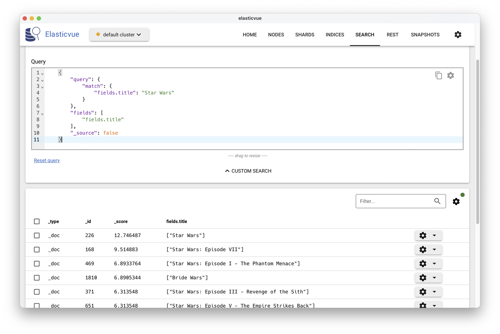
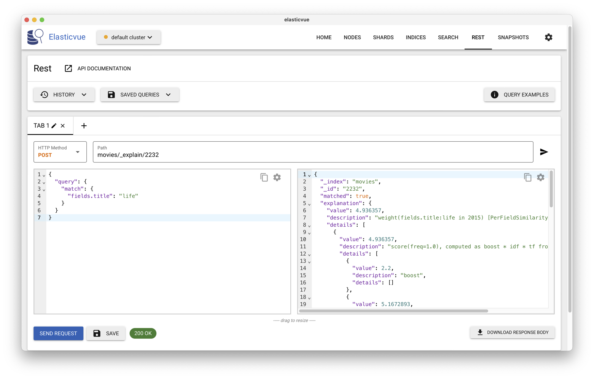

.. _chap-ritp_tpelasticdsl:
  
##########################################
Opérations de recherche avec ElasticSearch
##########################################

Ce chapitre est consacré l'interrogation
d'une base Elasticsearch, en utilisant le DSL (Domain Specific Language) dédié à
ce moteur de recherche. Il est conçu dans une optique
de mise en pratique: vous devriez disposer d'un serveur installé avec Docker 
et de l'application ElasticVue (reportez-vous au chapitre :ref:`chap-introri`).

***************************************
S1: Introduction au DSL d'ElasticSearch
***************************************

Le DSL est un langage extrêmement riche. Dans cette introduction
nous nous concentrons sur les recherches exactes, les recherches
plein-texte (avec classement donc) et quelques opérations de combinaison.

Exécuter des requêtes
=====================

Dans toute cette introduction
nos requêtes portent sur la (modeste) base des films que vous avez déjà
dû importer dans un index (nommé ``nfe204`` si vous avez suivi
exactement les instructions). 
Comme déjà vu dans le chapitre :ref:`chap-introri`, nous pouvons
transmettre des requêtes dans ElasticVue avec l'interface ``SEARCH``,
en ``POST``-ant un document JSON décrivant la requête.

Par exemple, votre première requête consiste à trouver les films "Star Wars" de
la base. Le document JSON à ``POST``-er est le suivant:

.. code-block:: json

    {
        "query": {
            "match": {
                "title": "Star Wars"
            }
        }
    }

Elle est équivalente à la requête simplifiée, "à la Google",
``_search?q=title:Star+Wars``. 
Le résultat consiste en un ensemble de documents JSON contenant
le type, l'identifiant interne, le score et la *source*, cette dernière 
étant le document transmis pour indexation, avant transformations.

On peut demander à ne pas obtenir toute la source (option ``'_source': false``), 
en sélectionnant en revanche certains champs 
qui nous intéressent particulièrement (l'équivalent donc du 
``select`` en SQL). On ajoute pour cela un champ ``fields``, ce
qui donne, si on souhaite obtenir seulement le titre:

.. code-block:: json

  	{
    	"query": {
      		"match": {
        		"title": "Star Wars"
      		}
  		},
  		"fields": ["title"],
  		"_source": false
   	}

En utilisant ElasticVue, vous pouvez  
voir les titres et les scores (:numref:`es-dsl`). 

.. _es-dsl:

   
      Affichage des résultats avec les scores.

Vous êtes prêts à passer à l'action. Nous n'allons pas
explorer ici toutes les possibilités du DSL, mais essentiellement
les recherches exactes et les recherches plein-texte.

Les recherches exactes
======================

On entend par là les recherches qui s'appuient sur une égalité stricte
des critères de recherche et des valeurs contenues dans les documents
(par opposition aux recherches plein texte que nous étudierons ensuite).
On les appelle *Term-level queries* dans la documentation que 
vous trouverez ici: https://www.elastic.co/guide/en/elasticsearch/reference/current/term-level-queries.html.

Pour effectuer les recherches exactes, on introduit un opérateur dans l'objet
``query``, exprimant une condition sur certains champs. On peut 
par exemple demander les documents dans lesquels un certain champs existe
(ici, le champ ``summary``):
 
.. code-block:: json

	{
  		"query": {
   	 		"exists": {"field": "summary"}
  		},
  		"fields": ["title"],
  		"_source": false
	}

.. important:: Peut-on rechercher les documents pour lesquels un champ *n'existe pas* ? 
   Oui bien sûr. Il faut utiliser pour celà les opérateurs de combinaison booléenne.
   Voir plus loin.
   
Nous n'allons présenter que quelques-uns des opérateurs (reportez-vous
à la documentation pour une présentation complète). L'opérateur
``fuzzy`` permet de chercher les mots *proches* (syntaxiquement). 
Très utile pour ne pas dépendre des fautes d'orthographe! Recherchons
le film *Matrice*. 

.. code-block:: json

	{
	  "query": {
	     "fuzzy": {
      		"title": {
        		"value": "matrice"
    	  	}
    	  }
  		},
  	 "fields": ["title"],
	 "_source": false
	}

On obtient bien un résultat (je vous laisse vérifier). Dans le même
esprit on peut faire des recherches par préfixe ou par 
expression régulière. 

Voyons maintenant les recherches par intervalle: la requête suivante
retourne tous les films entre 2010 et 2020.

.. code-block:: json

	{
  		"query": {
		    "range": {
		      "year": {"gte": 2010, "lte": 2020}
    		}
  		},
  		"fields": ["title", "year"],
  		"_source": false
	}

Il existe divers raffinements selon le type de donnée 
(et notamment pour les dates). Dans l'exemple ci-dessus, on
effectue une recherche sur des entiers (l'année) ce qui est 
simple à exprimer et interpréter. 

Qu'en est-il pour les champs de type ``text``, les plus 
courants. Ici, on a deux interprétations possibles: recherche
*exacte* et recherche *approchée*, cette dernière impliquant 
un classement.

La recherche exacte est exprimée avec l'opérateur ``term``.
Elle s'applique correctement pour des champs texte dont
la valeur est codifiée, par exemple le genre du film.

.. code-block:: json

	{
	  "query": {
   		 "term": {
      		"genre": {"value": "drama"}
    		}
  		},
  		"fields": ["title"],  		
  		"_source": false
	}

*Mais*, notez que nous utilisons le mot ``drama`` sans 
majuscule, alors que dans le document indexé, c'est bien ``Drama``.
Explication: la recherche exacte porte sur la valeur des champ *après* 
les transformations décrites dans le chapitre :ref:`chap-introri`
(et notamment, ici, le placement de tous les caractères en minuscules). 
Si on veut l'appliquer aux champs de type texte, il faut
donc "deviner" les transformations effectuées, ce qui n'est pas
toujours facile. Essayez par exemple de chercher *Star Wars*.

.. code-block:: json

	{
	  "query": {
	      "term": {
      			"title": {"value": "star wars"}
    			}
  			},
  		"fields": ["title"],
	  	"_source": false
	}

Même en utilisant des minuscules on ne trouve rien car un texte contenant
plusieurs mots est transformé en vecteur (une recherche avec ``star`` 
en revanche trouve bien des films, mais beaucoup plus que désiré);

Pour les recherches exactes sur du texte, ElasticSearch n'est pas
très adapté, et en tout cas pas l'opérateur ``term``. Je vous
laisse étudier des opérateurs qui étendent ``term``:
``terms`` et ``terms_set``. 

	
Les recherches plein-texte
==========================

On s'intéresse ici aux recherches portant sur des champs 
textuels analysés (et ayant donc fait l'objet de transformations,
cf. le chapitre  :ref:`chap-introri`). La correspondance 
entre le texte indexé et celui de la requête est
exprimée par un *score*. La documentation
est ici: https://www.elastic.co/guide/en/elasticsearch/reference/current/full-text-queries.html.

Reprenons la requête qui cherche les occurrences de *Star Wars*,
cette fois avec l'opérateur ``match`` 

.. code-block:: json

  	{
    	"query": {
      		"match": {
        		"title": "Star Wars"
      		}
  		},
  		"fields": [
    		"title", "summary"
  		],
  		"_source": false
   	}

Cette fois, contrairement à ce qui se passait avec ``term``, 
les transformations sont appliquées au document *et* à
la requête, et le résultat correspond aux principes de la recherche plein texte 
avec classement.
Prenez le temps de comprendre (intuitivement) 
le rapport entre le titre du film et son classement. 

Il faut bien réaliser que chaque terme est pris en compte
*individuellement*. Cherchons par exemple les résumés
de film qui contiennent ``Roman Empire``.

.. code-block:: json

	{
    	"query": {
      		"match": {
        		"summary": "Roman Empire"
      		}
  		},
  		"fields": [
    		"title", "summary"
  		],
  		"_source": false
   	}

On obtient des résumés qui contiennent ``Roman`` et ``Empire``,
``Roman`` tout seul et ``Empire`` tout seul: la
différence est reflétée dans le score, et donc dans le classement.

Remplacez ``match`` par  ``match_phrase``, comparez les résultats
et reportez-vous à la documentation pour comprendre.

Enfin il est possible d'effectuer une recherche plein-texte moins 
"structurée" avec l'opérateur ``query_string`` dont  
le paramètre est une liste de mots-clé enrichis de connecteur 
booléens et d'options. Cette liste est l'équivalent (en plus puissant) 
de l'approche habituelle avec les applications de recherche, consistant
à mettre en vrac les termes principaux de la recherche. Voici un 
premier exemple.

.. code-block::

	{
  		"query": {
    		"query_string": {
      			"query": "(DiCaprio) OR (Deneuve)"
    		}
  		},
  		"fields": ["title"],
  		"_source": false
	}

Et un second exemple un peu plus élaboré:

.. code-block::

	{
  		"query": {
  			"query_string": {
    		  "query": "year:[1990 TO 2010] AND director.last_name:Tarantino"
    		}
  		},
  		"fields": ["title"],
  		"_source": false
	}

Reportez-vous à la documentation pour les très nombreuses options (qui
reprennent en fait celles du langage du système d'indexation sous-jacent, Lucene).

Combinaison de recherches
=========================

On peut combiner plusieurs recherches en paramétrant
la manière dont les critères de recherche et les scores se combinent. Nous
allons nous limiter ci-dessus aux combinaisons booléennes. 
La documentation (https://www.elastic.co/guide/en/elasticsearch/reference/current/query-dsl-bool-query.html)
donne des informations plus complètes.

Les recherches booléennes sont  exprimées par des objets (au sens JSON) ``bool``
dans l'object ``query``. Cet objet ``bool``  peut lui-même
avoir plusieurs sous-clauses: ``must``, ``should``, ``must_not``
et ``filter``. Voyons quelques exemples.

La clause ``must``
------------------

L'objet ``must`` est un tableau de recherches plein-texte ou exactes,
et s'interprète comme un ``ET`` logique (ou, en termes ensemblistes,
comme une intersection des résultats). Voici un exemple 
d'une requête des films dont le titre est proche de Star Wars *et*
qui sont parus
entre 1970 et 2000. On combine un ``match`` et un ``range``.

.. code-block:: json

	{
	  "query": {
   		"bool": {
      		"must": [
        		{
          			"match": {"title": "Star Wars"}
        		},
        		{
         			 "range": {"year": {"gte": 1970,"lte": 2000} }
       		    }
     		 ]
  			}
  		}
 	}

Et oui, la syntaxe devient un peu compliquée... Si on
utilise ``should`` à la place de ``must``, on obtient
une interprétation disjonctive ``OR`` (et donc 
une *union* des résultats). À vous de vérifier (vous pouvez aussi
trouver un exemple plus intéressant, comme les films 
tournés soit par Q. Tarantino  soit par J. Woo.). 

Enfin le ``must_not`` correspond au ``NOT``. On peut donc construire
des expressions booléennes complexes, au prix d'un syntaxe
il est vrai assez lourde. Un exemple: les films
avec Bruce Willis, sauf ceux tournés par Q. Tarantino.

.. code-block:: json

	{
  		"query": {
    		"bool": {
      			"must": 
        			{
		          "match": {"actors.last_name": "Willis"}
       				 },
      			"must_not": 
        			{
          			"match": {"director.last_name": "Tarantino"}
        			}
   				 }
  			}
		}

Je vous laisse étudier la clause ``filter`` qui sert principalement
à exclure des documents du résultat sans inflluer sur le score. 

Agrégats
========

Elasticsearch permet également d'effectuer des agrégations, dans l'esprit 
du ``group by`` de SQL. 
Les agrégats fonctionnent avec deux concepts, les `buckets` (seaux, en français)
qui sont les catégories que vous allez créer, et les `metrics` (indicateurs, en
français), qui sont les statistiques que vous allez calculer sur les `buckets`.

Si l'on compare à une requête SQL très simple : 

      .. code-block:: sql

        select count(color)
        from table
        group by color

``count(color)`` est la métrique, ``group by color`` crée les groupes
(`buckets`).

Une agrégation est la combinaison d'un `bucket` (au moins) et d'une `metric` (au
moins). On peut, pour des requêtes complexes, imbriquer des `buckets` dans
d'autres `buckets`. La syntaxe est, comme précédemment, très modulaire. 

Un exemple, avec le nombre de films par année : 

.. code-block:: json

    {
      "size": 0,
      "aggs" : { "nb_par_annee" : {
        "terms" : {"field" : "year"}
          }
      }
    }

Le paramètre ``aggs`` permet à Elasticsearch de savoir qu'on travaille sur des
agrégations. Le paramètre ``size:0`` permet de ne pas afficher
les
résultats de recherche de la requête.
``nb_par_annee`` est le nom que l'on donne à notre agrégat. Les buckets sont
créés avec le ``terms`` qui ici indique que l'on va créer un groupe par valeur
différente du champ ``year``. La métrique sera automatique ici, ce sera
simplement la somme de chaque catégorie.

Le résultat d'une agrégation apparaît dans un champ ``aggregations``
dans le résultat. Voici un extrait de ce dernier. Remarquez
que le tableau ``hits`` est vide
(car ``size:0``). Le tableau ``buckets`` en revanche 
contient ce que nous cherchons (ouf).

.. code-block:: json

	{
   		"hits": {
    		"total": {
      			"value": 326,
      			"relation": "eq"
    		},
    		"max_score": null,
    		"hits": []
  		},
  		"aggregations": {
    		"nb_par_annee": {
       		"buckets": [
        		{"key": 2017,"doc_count": 12},
 	       		{"key": 2019,"doc_count": 11},
       		 	{"key": 2005,"doc_count": 9},
         	]
         }
      }   

.. important:: ElasticVue ne semble pas savoir afficher le champ
   ``aggregation``. Vous pouvez donc effectuer ces requêtes
   avec la fenêtre ``REST`` en transmettant la requête 
   avec un ``POST`` à l'URL ``<index>/_search``.
   
On peut appliquer une agrégation sur le résultat d'une requête, comme
par exemple ci-dessous où on ne prend que les films du genre
"western".

.. code-block:: json

		{
		  "query": {
    		"term": {
      			"genre": {"value": "western"}
    		}
  		},
  		"aggs": {
    		"nb_par_annee": {
      			"terms": {
        			"field": "year"
      			}
   		 }
  		}
	}	
	
	
Voici pour cette présentation de l'essentiel (?) de DSL.
Vous devriez exécuter tous les exemples donnés précédemment (et tenter
des variantes pour bien comprendre la syntaxe) avant
de passer à la prochaine session qui va vous mettre au défi d'entrer
vos propres requêtes.

**************************
S2: Expression de requêtes
**************************

La documentation complète sur le DSL d'Elasticsearch se trouve en ligne à
l'adresse :
https://www.elastic.co/guide/en/elasticsearch/reference/current/query-dsl.html.
Vous aurez à vous y reporter dans ce qui suit. 

Nous allons maintenant
utiliser une  base de films plus large que celle que vue précédemment.
Récupérez le fichier suivant contenant environ 5000 films, au format JSON :
http://b3d.bdpedia.fr/files/big-movies-elastic.json. Même s'il
est assez volumineux, il reste possible de le copier/coller
dans ElasticVue pour le transmettre à l'URL ``_bulk`` 
en mode ``POST``. À défaut, la ligne de commande (pas très simple...)
devrait fonctionner.

.. code-block:: bash

		curl -XPOST --cacert http_ca.crt  -U elastic:mot_de_passe \ 
		        https://localhost:9200/_bulk/ --data-binary @big-movies-elastic.json

Dans l'interface ElasticVue, vous devriez voir apparaître un index appelé `movies` 
contenant 4850 films.

Les documents ont la structure suivante (notez bien que toutes
les données sont dans un champ imbriqué ``fields``):

.. code-block:: json

  {
    "fields": {
      "directors": [
        "Joseph Gordon-Levitt"
      ],
      "release_date": "2013-01-18T00:00:00Z",
      "rating": 7.4,
      "genres": [
        "Comedy",
        "Drama"
      ],
      "image_url": "http://ia.media-imdb.com/images/M/MVNTQ3OQ@@._V1_SX400_.jpg",
      "plot": "A New Jersey guy dedicated to his family, friends, and church,
        develops unrealistic expectations from watching porn and works to find
        happ iness and intimacy with his potential true love.",
      "title": "Don Jon",
      "rank": 1,
      "running_time_secs": 5400,
      "actors": [
        "Joseph Gordon-Levitt",
        "Scarlett Johansson",
        "Julianne Moore"
      ],
      "year": 2013
    },
    "id": "tt2229499",
    "type": "add"
  }

À vous de jouer !
=================

Maintenant, proposez des requêtes pour les besoins d'information suivants.

- Films 'Star Wars' dont le réalisateur (directors) est 'George Lucas' (requête
  booléenne)

  .. ifconfig:: rielastic in ('public')

     .. admonition:: Correction
    
        Dans toutes les solutions vous pouvez ajouter un champ ``fields``
        pour n'afficher que quelques données.
        
        .. code-block:: json

           {
             "query": {
               "bool": {
                 "must": [
                   {
                     "match": {
                       "fields.title": "Star Wars"
                     }
                   },
                   {
                     "match": {
                       "fields.directors": "George Lucas"
                     }
                   }
                 ]
               }
             }
           }

      Pour une recherche exacte on utilise ``match_phrase``: 

          .. code-block:: json

            {
              "query": {
                "bool": {
                  "should": [
                    {
                      "match_phrase": {
                        "fields.title": "Star Wars"
                      }
                    },
                    {
                      "match": {
                        "fields.directors": "George Lucas"
                      }
                    }
                  ]
                }
              }
            }

  
      ou de manière très compacte: ``_search?q=fields.title:Star+Wars directors:George+Lucas``

- Films dans lesquels 'Harrison Ford' a joué

  .. ifconfig:: rielastic in ('public')

   .. admonition:: Correction
     
      .. code-block:: json

        {
          "query": {
            "match": {
              "fields.actors": "Harrison Ford"
            }
          }
        }

    ou  ``_search?q=fields.actors:Harrison+Ford``

- Films dans lesquels 'Harrison Ford' a joué dont le résumé (plot) contient
  'Jones'.

  .. ifconfig:: rielastic in ('public')

   .. admonition:: Correction
     
      .. code-block:: json

        {"query":{
          "bool": {
            "must": [
              { "match": { "fields.actors": "Harrison Ford" }},
              { "match": { "fields.plot": "Jones" }}
            ]
        }}}

      ``_search?q=fields.actors=Harrison+Ford fields.plot:Jones``

- Films dans lesquels 'Harrison Ford' a joué dont le résumé (plot) contient
  'Jones' mais sans le mot 'Nazis'

  .. ifconfig:: rielastic in ('public')

   .. admonition:: Correction
     
      .. code-block:: json

        {"query":{
          "bool": {
            "must": [
              { "match": { "fields.actors": "Harrison Ford" }},
              { "match": { "fields.plot": "Jones" }}
            ],
            "must_not" : { "match" : {"fields.plot":"Nazis"}}
        }}}

      ``_search?q=actors=Harrison+Ford plot:Jones -plot:Nazis``

- Films de 'James Cameron' dont le rang devrait être inférieur à 1000 (boolean +
  range query).

  .. ifconfig:: rielastic in ('public')

   .. admonition:: Correction
     
      .. code-block:: json

        {"query":{
          "bool": {
            "must": [
              { "match": { "fields.directors": "James Cameron" }},
              { "range": { "fields.rank": {"lt":1000 }}}
            ]
        }}}

- Films de 'Quentin Tarantino' dont la note (rating) doit être supérieure à 5,
  sans être un film d'action ni un drame.

  .. ifconfig:: rielastic in ('public')

   .. admonition:: Correction
     
      .. code-block:: json

        {
          "query": {
            "bool": {
              "must": [
                {
                  "match_phrase": {
                    "fields.directors": "Quentin Tarantino"
                  }
                },
                {
                  "range": {
                    "fields.rating": {
                      "gte": 5
                    }
                  }
                }
              ],
              "must_not": [
                {
                  "match": {
                    "fields.genres": "Action"
                  }
                },
                {
                  "match": {
                    "fields.genres": "Drama"
                  }
                }
              ]
            }
          }
        }

- Films de 'J.J. Abrams' sortis (released) entre 2010 et 2015

  .. ifconfig:: rielastic in ('public')

   .. admonition:: Correction
     
      .. code-block:: json

        {
          "query": {
            "bool":{
              "must": {"match": {"fields.directors": "J.J. Abrams"}},
              "filter": {
                "range": {
                  "fields.release_date": { "from": "2010-01-01", "to": "2015-12-31"}
                }
              }
            }
          }
        }

Proposez maintenant les requêtes d'agrégation permettant d'obtenir les statistiques
suivantes.

.. important:: Certaines de ces requêtes sont assez difficiles. Ne les 
   faites que si vous êtes très motivés pour maîtriser ElasticSearch. La
   solution sera publiée.

- Donner la note (rating) moyenne des films. 

  .. ifconfig:: rielastic in ('public')

   .. admonition:: Correction
     
      .. code-block:: json

        {"size":0,
        "aggs" : {
            "note_moyenne" : {
              "avg" : {"field" : "fields.rating"}
            }}}

- Donner la note (rating) moyenne, et le rang moyen des films de George Lucas.
  
  .. ifconfig:: rielastic in ('public')

   .. admonition:: Correction
     
      .. code-block:: json

        {"size": 0,,
          "query" :{
            "match" : {"fields.directors": {"query": "George Lucas", "operator": "and"}}
          }
         ,"aggs" : {
            "note_moyenne" : {
              "avg" : {"field" : "fields.rating"}
            },
            "rang_moyen" : {
              "avg" : {"field" : "fields.rank"}
            }
        }}

- Donnez la note (rating) moyenne des films par année. Attention, il y a ici une
  imbrication d'agrégats (on obtient par exemple 456 films en 2013 avec un
  *rating* moyen de 5.97).
 
  .. ifconfig:: rielastic in ('public')

   .. admonition:: Correction
     
      .. code-block:: json

        {"size": 0,
        "aggs" : {
            "group_year" : {
              "terms" : {
                "field" : "fields.year"
              },
              "aggs" : {
                "note_moyenne" : {
                  "avg" : {"field" : "fields.rating"}
                }}
            }}}

- Donner la note (rating) minimum, maximum et moyenne des films par année.

  .. ifconfig:: rielastic in ('public')

   .. admonition:: Correction
     
      .. code-block:: json

        {"size": 0,
        "aggs" : {
            "group_year" : {
              "terms" : {
                "field" : "fields.year"
              },
              "aggs" : {
                "note_moyenne" : {"avg" : {"field" : "fields.rating"}},
                "note_min" : {"min" : {"field" : "fields.rating"}},
                "note_max" : {"max" : {"field" : "fields.rating"}}
              }
            }}}

- Donner le rang (rank) moyen des films par année et trier par ordre
  décroissant. 

  .. ifconfig:: rielastic in ('public')

   .. admonition:: Correction
     
      .. code-block:: json

        {"size": 0,
        "aggs" : {
            "group_year" : {
              "terms" : {
                "field" : "fields.year",
                "order" : { "rating_moyen" : "desc" }
              },
              "aggs" : {
                "rating_moyen" : {
                  "avg" : {"field" : "fields.rating"}
              }}
        }}}

- Compter le nombre de films par tranche de note (0-1.9, 2-3.9, 4-5.9...).
  Indice : ``group_range``.

  .. ifconfig:: rielastic in ('public')

   .. admonition:: Correction
     
      .. code-block:: json

        {"size": 0,
        "aggs" : {
            "group_range" : {
              "range" : {
                "field" : "fields.rating",
                "ranges" : [
                  {"to" : 1.9},
                  {"from" : 2, "to" : 3.9},
                  {"from" : 4, "to" : 5.9},
                  {"from" : 6, "to" : 7.9},
                  {"from" : 8}
                ]
              }
            }}}

************************************
S3: Le classement dans Elasticsearch
************************************

Etudions maintenant 
le classement effectué par ElasticSearch et la façon dont
on peut le contrôler voire le modifier.

Le score
========

Le score d'un document est calculé en fonction d'une requête 
au moyen d'une fonction dite *Practical Scoring Function* 
reprise du système d'indexation sous-jacent Lucene. La dernière
trace de documentation de cette fonction semble être
ici (me dire si vous trouvez plus récent): 
https://www.elastic.co/guide/en/elasticsearch/guide/current/practical-scoring-function.html>.
On retrouve les notions de *tf*,  *idf* et *normalisation* 
présentées dans le chapitre :ref:`chap-ranking`, mais avec des formules  
(légèrement) différentes des versions
canoniques: chaque système fait sa petite cuisine
pour essayer d'arriver au meilleur résultat. 

En lisant les explications sur la *Practical Scoring Function*, on constate
donc que pour chaque terme:

 - l'``idf`` est :math:`log (1 + \frac{N-n}{n}`), *N* étant le nombre
   total de documents, *n* le nombre de documents contenant le terme 
 - le ``tf`` est la fréquence normalisée de manière simplifiée 
   par rapport à un calcul cosinus exact, l'idée étant toujours
   de ne pas surestimer les longs documents. 
 - le terme est multiplié par un facteur dite de *boost*
   
Pour étudier cela concrètement, prenons un exemple. 
Nous pouvons observer avec l'API ``_explain`` d'Elasticsearch 
le calcul du score
pour un film donné et pour une requête donnée. 
Prenons, par exemple, dans l'index *movies*,
les films dont le titre contient ``life``, comme
ci-dessous:

.. code-block:: bash

  {
    "query": {
      "match": {
        "fields.title": "life"
      }
    }
  }
  
Chaque film a son propre score, qui dépend de l'index, de la
requête, et de la représentation du film dans le document indexé.
Pour obtenir le détail  de ce score,
on transmet la requête  non pas à l'API ``_search`` mais à l'URL
``movies/_explain/<id_doc>``.
Par exemple, le score du 
film des Monty Python, "Life of Brian" (La vie de Brian, en
français), dont l'identifiant est 2232, est obtenu
avec l'URL ``movies/_explain/2232`` comme le montre 
la :numref:`es-explain`.

.. _es-explain:

   
      Obtenir l'explication d'un classement avec ElasticVue

Dans la fenêtre droite, le résultat contient un objet 
``explanation`` qui détaille les paramètres du classement.
Il est notamment indiqué qu'il est obtenu par la formule
:math:`boost \times idf \times tf`, ce qui devrait vous rappeler
la méthode présentée dans le chapitre :ref:`chap-ranking`.
En détaillant, on voit que
Elasticsearch utilise  une fonction
de score  qui  utilise  3
facteurs.

  - *boost* vaut 2,2 (pour le *boosting*, voir ci-dessous)
  - *idf* vaut 5,167, valeur obtenue en considérant que 28 films sur les 4 999
    contiennent le terme *life*, et :math:`ln(1+ (4999-28+0,5)/(28 + 0,5)) = 5,167`.
  - enfin *tf* vaut 0,434, calcul basé sur une fréquence de 1 (*life*
    apparaît une fois dans le titre), la présence de 3 termes dans le titre
    et des facteurs de normalisation dont la taille moyenne d'un
    titre (2,7). Je vous laisse tenter
    d'éclaircir le détail de ces calculs.

Le boosting
============

Quand on effectue des recherches sur plus d'un champ, il peut rapidement devenir
pertinent de donner davantage de poids à l'un ou l'autre de ces champs, de façon
à améliorer les résultats de recherche. Par exemple, il peut être tentant
d'indiquer qu'une correspondance (`match`) dans le titre d'un document vaut 2
fois plus qu'une correspondance dans n'importe quel autre champ. C'est ce que
l'on appelle en anglais le `boosting`, cela autorise la modification du score
calculé par Elasticsearch en vue de rendre les résultats plus pertinents (pour
les utilisateurs d'un système donné). 

La valeur du *boost* peut-être spécifiquement introduite dans la requête. 
Voici comment on *booste* d'un facteur de 2 la requête précédente
(ce qui a peu d'intérêt puisqu'il y a un seul terme, mais nous
verrons ensuite comment *booster* chaque terme individuellement).

.. code-block:: bash

	 {
    	"query": {
      	"match": {
        	"fields.title": {
            	  "query": "life",
              	  "boost": 2 
            	}
      	}
    	}
  	}
  
Le résultat du ``_explain`` montre que le *boost* pris en compte
dans le calcul du score  a doublé par rapport à la version précédente
(où le *boost* était par défaut à 1).

.. note:: Pourquoi ElasticSearch affiche-t-il des valeurs 
   de *boost* qui   semblent supérieures aux valeurs d'entrée? Parce que 
   la valeur affichée tient compte de facteurs de normalisation du terme.
   Il est difficile de détailler les calculs, mais l'important est 
   la valeur relative qui a effectivement doublé.
   

Saisissez la commande suivante et observez la position d'American Graffiti 
(réalisé par G. Lucas) dans
le classement, avec et sans l'option "boost". Que se passe-t-il ?

.. code-block:: json

 	 {
  	"query": {
   	 "bool": {
    	  "should": [
        	{
          		"match": {
            		"fields.title": {
              		"query": "Star Wars",
              		"boost": 4
            		}
          		}
        	},
        	{
          		"match": {
            	"fields.directors": {
              		"query": "George Lucas"
           	 		}
          		}
        	}
 	     ]
    	}
  		},
  		"fields": ["fields.title"],
  		"_source": false
	}

Avec le boosting, American Graffiti est 9e, derrière Bride Wars, mieux classé car
le boosting favorise la correspondance avec (au moins) un des mots du titre.
Sans le boosting, American Graffiti arrive en cinquième position.

Si on peut associer du boosting positif à certaines valeurs de certains
champs, on peut rejeter vers le bas du classement des documents qui
contiennent certaines valeurs pour d'autres champs. On peut combiner boosting
positif et boosting négatif (évidemment pour des champs différents).
