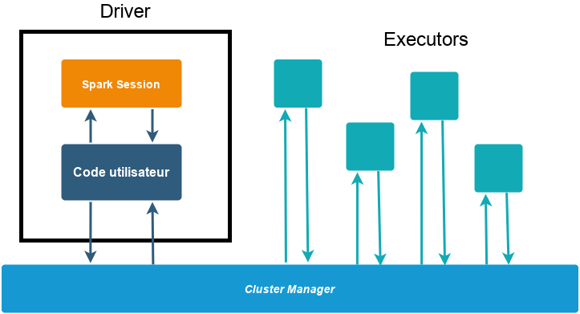
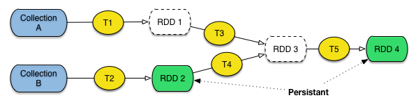
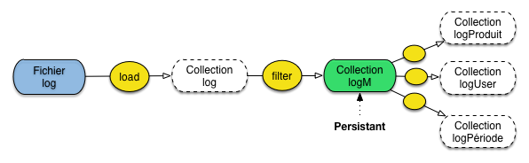
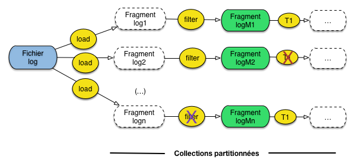
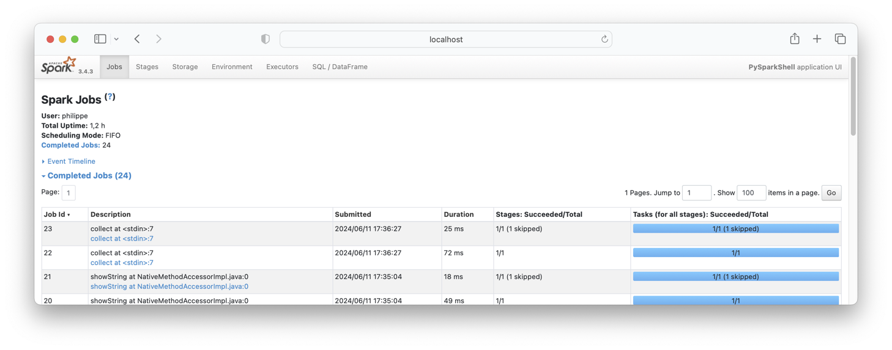
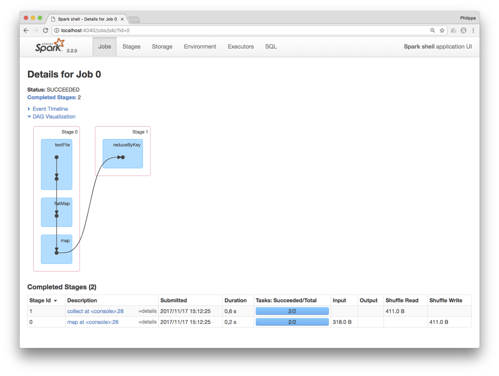

.. _chap-spark:
   
##########################
Etude de cas: Apache Spark
##########################

Avec le système Spark, nous récapitulons une  bonne partie 
des sujets abordés dans e cours. 
Spark est un environnement dédis au calcul
distribué à grande échelle, proposant des fonctionnalités bien plus
puissantes que le simple MapReduce des origines, toujours disponible dans
l'écosystème Hadoop.

Ces fonctionnalités consistent notamment en un ensemble d'opérateurs de second
ordre (voir cette notion dans le chapitre :ref:`chap-cloud`) qui étendent
considérablement la simple paire constituée du Map et du Reduce. Nous avons eu
un aperçu de ces opérateurs avec Pig, qui reste cependant lié  à un contexte
d'exécution MapReduce (un programme Pig est compilé et exécuté comme une
séquence de *jobs* MapReduce). 

Entre autres limitations, cela ne couvre pas une classe importante
d'algorithmes: ceux qui procèdent par *itérations*       sur un résultat
progressivement affiné à chaque exécution. Ce type d'algorithme est très
fréquent dans le domaine général de la fouille de données: PageRank, *kMeans*,
calculs de composantes connexes dans les graphes, etc.

Ce chapitre propose une vision d'ensemble du système Spark, avec des aspects 
pratiques, et une illustration de son intégration avec un système
de stockage distribué comme Cassandra.

************************
S1: Introduction à Spark
************************

.. admonition:: Supports complémentaires

    * `Diapositives: Introduction à Spark <http://b3d.bdpedia.fr/files/slspark.pdf>`_
    * `Vidéo d'introduction à Spark <https://mediaserver.lecnam.net/permalink/v125f5947d4d8krmjech/>`_  

MapReduce repose sur un mécanisme de progression consistant
à écrire sur disque les résultats intermédiaires. En présence de chaînes
de traitement complexes, incluant parfois des itérations sur 
une même source de données, ce mécanisme de
sérialisation/désérialisation sur disque devient extrêmement 
pénalisant pour les performances.

Dans Spark, la méthode est très différente. Elle consiste  à placer ces jeux de
données en mémoire RAM et à éviter la pénalité des écritures sur le disque. Le
défi est alors bien sûr de proposer une reprise sur panne automatique efficace.

Architecture système
====================

Spark est un *framework* qui coordonne l'exécution de *tâches* sur des *données*
en les répartissant au sein d'un *cluster* de machines. Il est voulu comme
extrêmement modulaire et flexible.
Le programmeur envoie au *framework* des *Spark Applications*, pour lesquelles
Spark affecte des ressources (RAM, CPU) du cluster en vue de leur
exécution. Une Spark application se compose d'un processus *driver* et
d\'*executors*. Le *driver* est essentiel pour l'application car il exécute la
fonction `main()` et est responsable de 3 choses : 

 - conserver les informations relatives à l'application ;
 - répondre aux saisies utilisateur ou aux demandes de programmes externes ;
 - analyser, distribuer et ordonnancer les tâches (cf plus loin).
    
Un *executor* n'est responsable que de 2 choses : exécuter le code qui lui
est assigné par le *driver* et lui rapporter l'état d'avancement de la tâche.

Le *driver* est accessible programmatiquement par un point d'entrée appelé
*SparkSession*, que l'on trouve derrière une variable :code:`spark`.

La figure :numref:`sparkarchi` illustre l'architecture système de Spark. Dans cet exemple 
il y a un *driver*
et 4 *executors*. La notion de nœud dans le cluster est absente : les utilisateurs
peuvent configurer combien d'exécutors reposent sur chaque nœud.

.. _sparkarchi:

  
     L'architecture système de Spark

Spark est un *framework* multilingue : les programmes Spark peuvent être écrits en
Scala, Java, Python, SQL et R. Cependant, il d'abord écrit en Scala, il s'agit
de son langage par défaut. L'API est complète en Scala
et Java, pas nécessairement dans les autres langages. 

.. note:: Spark peut aussi fonctionner en mode *local*, dans lequel *driver* et
   *executors* ne sont que des processus de la machine. La puissance de Spark est
   de proposer une transparence (pour les programmes) entre une exécution locale
   ou sur un cluster.

Architecture applicative
========================

L'écosystème des API de Spark est hiérarchisé et comporte
essentiellement 3 niveaux :

 - les APIs bas-niveau, avec les RDDs (*Resilient Distributed Dataset*);
 - les APIs de haut niveau, avec les *Datasets*, *DataFrames* et SQL;
 - les autres bibliothèques (*Structured Streaming*, *Advanced Analytics*, etc.).

Nous allons laisser de côté dans ce cours le dernier niveau : l'exploration des
bibliothèques de *machine learning* relève du `cours RCP216
<https://cedric.cnam.fr/vertigo/Cours/RCP216/>`_.

Initialement, les RDDs ont été au centre de la programmation avec Spark (ce qui
a pour conséquence que de nombreuses ressources que vous trouverez sur Spark
reposeront dessus). Aujourd'hui, on leur préfère des APIs de plus haut niveau,
que nous allons explorer en détail, les *Datasets* et *DataFrames*. Celles-ci
présentent l'avantage d'être proches de structures de données connues (avec une
vision tabulaire), donc de faciliter le passage à Spark. En outre, elles sont
gérées  efficacement par le *framework* grâce au contrôle des
types de données qu'elles lui apportent, d'où des gains de performance.

L'innovation des RDDs
---------------------

La principale innovation apportée par  Spark est le concept de *Resilient
Distributed Dataset* (RDD). Un RDD est une collection (pour en rester à notre
vocabulaire) calculée à partir d'une source de données (par exemple une base de
données Cassandra, un flux de données, un autre RDD) et placée en mémoire RAM.
Spark conserve l'historique des opérations qui a permis de constituer un RDD, et
la reprise sur panne s'appuie essentiellement sur la préservation de cet
historique afin de reconstituer  le RDD en cas de panne. Pour le dire
brièvement: Spark n'assure pas la préservation des données en *extension* mais
en *intention*. La préservation d'un programme qui tient en quelques lignes de
spécification (cf. les programmes Pig) est beaucoup plus facile et efficace que
la préservation du jeu de données issu de cette chaîne. C'est l'idée principale
pour la *résilience* des RDDs.

Par ailleurs, les RDDs représentent des collections partitionnées et
distribuées. Chaque RDD est donc constitué de ce que nous avons appelé
*fragments*. Une panne affectant un fragment individuel peut donc être réparée
(par reconstitution de l'historique) indépendamment des autres fragments,
évitant d'avoir à *tout* recalculer. 

Les DataFrames et Datasets que nous utiliserons plus loin reposent sur les RDDs,
c'est-à-dire que Spark transforme les opérations sur les DataFrames/Datasets en
opérations sur les RDDs. En pratique, vous n'aurez que rarement besoin de RDDs
(sauf si vous maintenez du code ancien, ou que votre expertise vous amène à
aller plus loin que les *Structured APIs*).

Actions et transformations : la chaîne de traitement Spark
----------------------------------------------------------

Un élément fondamental de la pratique de Spark réside dans **l'immutabilité**
des collections (RDD ou autres). Elles ne peuvent être modifiées après leur création. C'est un
peu inhabituel et cela induit des manières nouvelles de travailler. 

En effet, pour passer des données d'entrée à la sortie du programme, on devra
penser une chaîne de collections qui constitueront les étapes du traitement. La
(ou les) première(s) collection(s) contien(nen)t les données d'entrée. Ensuite,
chaque collection est le résultat de **transformations** sur les précédentes
structures, l'équivalent de ce que nous avons appelé *opérateur* dans Pig. Comme
dans Pig, une transformation sélectionne, enrichit, restructure une collection,
ou combine deux collections. On retrouve dans Spark, à peu de choses près, les
mêmes opérateurs/transformations que dans Pig, comme le montre la table
ci-dessous (qui n'est bien sûr pas exhaustive: reportez-vous à la documentation
pour des compléments).

.. csv-table:: 
   :header:  Opérateur, Description
   :widths: 10, 20
	         
   ``map``, Prend un document en entrée et produit un document en sortie
   ``filter``, Filtre les documents de la collection 
   ``flatMap``, "Prend un document en entrée, produit un ou plusieurs document(s) en sortie"
   ``groupByKey``, Regroupement de documents par une valeur de clé commune
   ``reduceByKey``,  "Réduction d'une paire *(k, [v])* par une agrégation du tableau *[v]*"
   ``crossProduct``, Produit cartésien de deux collections
   ``join``, Jointure de deux collections
   ``union``, Union de deux collections
   ``cogroup``, Cf. la description de l'opérateur dans la section sur Pig
   ``sort``, Tri d'une collection

Les collections obtenues au cours des différentes étapes d'une chaîne de
traitement sont stockées dans des RDDs, des DataFrames, etc., selon l'API
employée. C'est exactement la notion que nous avons déjà étudiée avec Pig. La
différence essentielle est que dans Spark, les RDD ou DataFrames sont, 
par défaut, *transients*, c'est-à-dire non matérialisés sur un
support externe comme le disque. Ils peuvent cependant être
marqués comme étant *persistants*, dans le cas où
l'on souhaite les réutiliser à plusieurs reprises (cas d'une itération). 
Spark fait son possible pour conserver les structures
persistantes en mémoire RAM, pour un maximum d'efficacité.

.. _spark-rdd:

  
   RDD persistants et transitoires dans Spark.

Les collections forment un graphe construit par application de transformations à
partir de collections stockées (:numref:`spark-rdd`). S'il n'est pas marqué
comme persistant, le RDD/DataFrame sera transitoire et ne sera pas conservé en
mémoire après calcul (c'est le cas des RDD 1 et 3 sur la figure). Sinon, il est
stocké en RAM, ou mis sur disque s'il n'y a pas assez de mémoire,
et disponible comme source de données pour d'autres
transformations.

Par opposition aux transformations qui produisent d'autres RDD ou DataFrames, les **actions**
produisent des *valeurs* (pour l'utilisateur). L'évaluation des opérations en
Spark est dite "paresseuse", c'est-à-dire que Spark attend le plus possible pour
exécuter le graphe des instructions de traitement. Comme dans Pig, 
une action
déclenche donc l'exécution de l'ensemble des transformations qui la précèdent.

L'évaluation paresseuse (*lazy evaluation*) permet à Spark de compiler de
simples transformations de DataFrames en un plan d'exécution physique
efficacement réparti dans le cluster. Un exemple de cette efficacité est
illustrée par le concept de *predicate pushdown* : si un :code:`filter()` à la
fin d'une séquence amène à ne travailler que sur 1 ligne des données d'entrée,
les autres opérations en tiendront compte, optimisant d'autant la performance en
temps et en espace.

RDDs, *Dataset* et *DataFrame*
------------------------------

Un RDD, venant de l'API bas-niveau, est une "boîte" destinée à contenir
n'importe quel document, sans aucun préjugé sur la structure (ou l'absence de
structure) de ce dernier. Cela rend le système très généraliste, mais empêche
une manipulation fine des constituants des documents, comme par exemple le
filtrage en fonction de la valeur d'un champ. C'est le programmeur de
l'application qui doit fournir la fonction effectuant le filtre. Cela impose
un "décodage" des éléments du RDD dans un format reconnu par
le langage de programmation utilisé. C'es ce décodage (ou, pour
le dire plus techniquement, la sérialisation/désérialisation) qui
pénalise l'utilisation directe des RDD.

On l'a dit, Spark implémente une API de plus haut niveau avec des structures
assimilables à des tables relationnelles : les *Dataset* et *DataFrame*. Ils
comportent un *schéma*, avec les définitions des colonnes. La connaissance de ce
schéma -- et éventuellement de leur type -- permet à Spark de proposer des
opérations plus fines, et des optimisations inspirées des techniques
d'évaluation de requêtes dans les systèmes relationnels. En fait, on se rapproche 
d'une implantation distribuée du langage SQL.  En interne, un avantage important
de la connaissance du schéma est d'éviter de recourir à la sérialisation des
objets Java (opération effectuée dans le cas des RDD pour écrire sur disque et
échanger des données en réseau). 

.. note:: Saluons au passage le mouvement progressif de ces systèmes vers une
   ré-assimilation des principes du relationnel (schéma, structuration des
   données, interrogation à la SQL, etc.), et la reconnaissance des avantages,
   internes et externes,  d'une modélisation des données. Du *NoSQL* à *BackToSQL*!
   

On distingue les *Dataset*,  dont le type des colonnes est connu, et les *DataFrames*.
Un *DataFrame* n'est rien d'autre qu'un *Dataset* (:code:`DataFrame =
Dataset[Row])` contenant des lignes de type *Row* dont le schéma précis n'est
pas connu. Ce typage des structures de données est lié au langage de
programmation : Python et R étant dynamiquement typés, ils n'accèdent qu'aux
DataFrames. En Scala et Java en revanche, on utilise les Datasets, des objets
JVM fortement typés.

Tout cela est un peu abstrait? Voici un exemple simple qui permet d'illustrer
les principaux avantages des *Dataset/DataFrame*. Nous voulons appliquer un
opérateur qui filtre les films dont le genre est "Drame". On va exprimer le
filtre (en simplifiant un peu) comme suit:

.. code-block:: text

    films.filter(film.getGenre() == 'Drame');

Si ``films`` est un RDD, Spark n'a aucune idée sur la structure des documents
qu'il contient. Spark va donc instancier un objet Java (éventuellement en
dé-sérialisant une chaîne d'octets reçue par réseau ou lue sur disque) et
appeler la méthode ``getGenre()``. Cela peut être long, et impose surtout de
créer un objet pour un simple test.

Avec un *Dataset* ou *DataFrame*, le schéma est connu et Spark utilise son
propre système d'encodage/décodage à la place de la sérialisation Java. De plus,
dans le cas des *Dataset*, la valeur du champ ``genre`` peut être testée
directement sans même effectuer de décodage depuis la représentation binaire.

Il est, en résumé, tout à fait préférable d'utiliser les *Dataset* dès que l'on
a affaire à des données structurées. 

Exemple: analyse de fichiers *log*
==================================

Prenons un exemple concret: dans un serveur d'application, on constate qu'un module *M* produit
des résultats incorrects de temps en temps. On veut analyser le fichier journal (*log*) de l'application
qui contient les messages produits par le module suspect, et par beaucoup d'autres modules.

On construit donc un programme qui charge le  *log* sous forme de collection, ne conserve
que les messsages produits par le module *M* et analyse ensuite ces messages. Plusieurs analyses sont
possibles en fonction des causes suspectées: la première par exemple regarde le *log* de *M* pour un produit particulier, 
la seconde pour un utilisateur particulier, la troisième pour une tranche horaire particulière, etc.

Avec Spark, on va créer un DataFrame ``logM`` persistant, contenant les messages produits par *M*. 
On construira ensuite,
à partir de ``logM`` de nouveaux DataFrames dérivés pour les analyses spécifiques (:numref:`spark-log`). 

.. _spark-log:

  
   Scénario d'une analyse de *log* avec Spark
   
On combine deux transformations pour construire ``logM``, comme le montre le programme suivant (qui n'est pas la syntaxe
exacte de Spark, que nous présenterons plus loin).

.. code-block:: javascript
          
    // Chargement de la collection
    log = load ("app.log") as (...)
    // Filtrage des messages du module M
    logM = filter log with log.message.contains ("M")    
    // On rend logM persistant !
    logM.persist();
    
On peut alors construire une analyse basée sur le code produit directement à partir de ``logM``.

.. code-block:: javascript
          
    // Filtrage par produit
    logProduit = filter logM with log.message.contains ("product P")   
    // .. analyse du contenu de logProduit     

Et utiliser également ``logM`` pour une autre analyse, basée sur l'utilisateur.

.. code-block:: javascript
          
    // Filtrage par utilisateur
    logUtilisateur = filter logM with log.message.contains ("utilisateur U")   
    // .. analyse du contenu de logProduit     

Ou encore par tranche horaire.

.. code-block:: javascript
          
    // Filtrage par utilisateur
    logPeriode = filter logM with log.date.between d1 and d2
    // .. analyse du contenu de logPeriode     

``logM``  est une sorte de "vue"  sur la collection initiale, dont la persistance
évite de refaire le calcul complet à chaque analyse.

Reprise sur panne
=================

Pour comprendre la reprise sur panne, il faut se pencher sur le second aspect
des RDD: la *distribution*. Un RDD est une collection *partitionnée* (cf.
chapitre :ref:`chap-sharding`), les DataFrames le sont aussi. La
:numref:`spark-failover` montre le traitement précédent dans une perspective de
distribution. Chaque DataFrame, persistant ou non, est composé de fragments
répartis dans la grappe de serveurs. 

.. _spark-failover:

  
   Partitionnement et reprise sur panne dans Spark.
   
Si une panne affecte un calcul s'appuyant sur un fragment *F* de DataFrame
persistant (par exemple la transformation notée ``T`` et marquée par une
croix rouge sur la figure), il suffit de le relancer à partir de *F*. Le gain
en temps est considérable! 

La panne la plus sévère affecte un fragment de DataFrame *non* persistant (par
exemple celui marqué par une croix violette). Dans ce cas, Spark a mémorisé la
chaîne de traitement ayant constitué le DataFrame, et il suffit de ré-appliquer
cette chaîne en remontant jusqu'aux fragments qui précèdent dans le graphe des
calculs.

Dans notre cas, il faut parcourir à nouveau le fichier ``log``  pour créer le
fragment ``logn``. Si les collections stockées à l'origine du calcul sont
elles-mêmes partitionnées (ce qui n'est sans doute pas le cas pour un fichier
*log*), il suffira d'accéder à la partie de la collection à l'origine des
calculs menant au DataFrame défaillant.

En résumé, Spark exploite la capacité à reconstruire des fragments de
RDD/DataFrame par application de la chaîne de traitement, et ce en se limitant
si possible à une partie seulement des données d'origine. La reprise peut
prendre du temps, mais elle évite un recalcul complet. Si tout se passe bien
(pas de panne) la présence des résultats intermédiaires en mémoire RAM assure de
très bonnes performances.

Quiz
====

.. eqt:: spark-1

    Quel est le principal apport du concept de RDD?

    A) :eqt:`I` Un RDD est un fichier journal *partitionné* de telle sorte
       qu'une panne peut être réparé avec seulement un fragment du journal.
    #) :eqt:`C` Un RDD est une collection partitionnée en mémoire RAM dont chaque
       fragment peut être reconstruit grâce à l'historique des opérations
    #) :eqt:`I` Un RDD est une collection partitionnée et répliquée selon les mêmes principes
       que MongoDB ou ElasticSearch: la reprise sur panne est assurée par la réplication

.. eqt:: spark-2

    Quel est la différence entre RDD persistant et non persistant?

    A) :eqt:`I` Un RDD non persistant disparaît dès que la chaîne de traitement qui l'a produit
       se termine
    #) :eqt:`C` Un RDD non persistant disparaît dès que la transformation dont il est la
       source se termine 
    #) :eqt:`I` Les RDD persistants sont sur disque, les RDD non persistants en mémoire RAM

.. eqt:: spark-3

    Quelle est la différence entre une transformation et une action?

    A) :eqt:`I` Une transformation change le format des données, une action renvoie le résultat
       d'un calcul à l'utilisateur 
    #) :eqt:`I` Une transformation est l'équivalent d'une procédure en programmation classique,
       alors qu'une action est l'équivalent d'une fonction. 
    #) :eqt:`C` Une transformation est une *spécification* intégrable à une chaîne de traitement;
       une action déclenche *l'exécution* d'une chaîne de traitement.  

.. eqt:: spark-4

    Comment expliqueriez-vous la notion d'exécution "paresseuse" dans Spark?

    A) :eqt:`C` Une chaîne de traitement est constituée par spécification et ne se déclenche
       que quand c'est nécessaire
    #) :eqt:`I` C'est un autre nom du principe de localité des données: chaque transformation
       s'applique aux données les plus proches 
    #) :eqt:`I`  Le système accumule un certain volume de données avant de déclencher le traitement
       afin d'assurer son efficacité. 

.. eqt:: spark-5

    Que signifie pour un RDD la propriété d'immutabilité?

    A) :eqt:`I` Un RDD est construit sur un cliché de la collection initiale, qui reste figé
       sur la durée de l'exécution du traitement.
    #) :eqt:`C` Le contenu d'un RDD ne peut pas être modifié une fois qu'il est constitué.
    #) :eqt:`I` La chaîne des RDD est solidaire, et toute modification de l'un entraîne le 
       recalcul de tous les autres.

.. eqt:: spark-6

    En quoi le concept de *sérialisation* implique-t-il une différence entre 
    les *RDD* et les structures plus récentes

    A) :eqt:`I` Aucun, dans tous les cas il faut mettre les données sur disque.
    #) :eqt:`C` Les RDD contiennent des objets java dont la sérialisation est très coûteuse,
       alors que les *Datasets* disposent de leur propre système d'écriture sur disque.
    #) :eqt:`I` Les *Datasets* sont plus puissants car ils s'appuient sur 
       les objets Java, leurs méthodes,  et le mécanisme natif de sérialisation.

.. eqt:: spark7

    Quel est l'avantage d'un DataSet sur un RDD ?

    A) :eqt:`I` Les DataSet sont toujours persistants et la reprise sur panne est donc toujours 
       plus efficace.
    #) :eqt:`C` Les DataSets connaissent la structure de leurs données et peuvent donc
       optimiser les traitements qui s'y appliquent.
    #) :eqt:`I` Seuls les DataSets peuvent prendre une base relationnelle comme source de données

********************
S2: Mise en pratique
********************

Il est temps de passer à l'action. Nous allons commencer par montrer  comment effectuer
des transformations sur des données non-structurées avec des DataFrames standard.
Les exemples qui suivent sont proposés en Python, mais d'autres
interfaces existent, notamment en Scala et en R. Scala est un 
langage fonctionnel, doté
d'un système d'inférence de types puissant, ce qui le rend
particulièrement approprié pour exprimer des chaînes de traitements sous
la forme d'une séquence d'appels de fonctions. Je fais l'hypothèse 
que la plupart de mes lecteurs seront plus familiers avec Python.

Le plus simple pour reproduire ces commandes est  
de télécharger dans un répertoire ``spark`` la dernière
version de Spark depuis le site http://spark.apache.org. 
L'installation comprend
un sous-répertoire ``bin`` dans lequel se trouvent les commandes 
qui nous intéressent (et notamment l'interpréteur ``pyspark``). 
Vous pouvez  placer le chemin vers ``spark/bin``  dans votre
variable ``PATH``, selon des spécificités qui dépendent de votre environnement:
à ce stade du cours vous devriez être rôdés à ce type de manœuvre.

.. code-block:: bash

    pyspark
  
Aux numéros de version près, vous devriez obtenir l'affichage suivant:

.. code-block:: text

		Welcome to
		      ____              __
		     / __/__  ___ _____/ /__
		    _\ \/ _ \/ _ `/ __/  '_/
		   /__ / .__/\_,_/_/ /_/\_\   version 3.4.3
		      /_/

		Using Python version 3.10.0 (v3.10.0:b494f5935c, Oct  4 2021 14:59:20)
		Spark context Web UI available at http://163.173.78.98:4040
		Spark context available as 'sc' (master = local[*], app id = local-1718116101741).
		SparkSession available as 'spark'.
		>>> 

C'est parti !

Transformations et actions
==========================

Vous pouvez récupérer le fichier http://b3d.bdpedia.fr/files/loups.txt pour
faire un essai (il est temps de savoir à quoi s'en tenir à propos de ces loups
et de ces moutons!), sinon n'importe quel fichier texte fait l'affaire.
Copiez-collez les commandes ci-dessous. 

.. code-block:: python

     loupsEtMoutons = spark.read.text("loups.txt")

Nous avons créé un premier DataFrame nommé ``loupsEtMoutons``
contenant autant de documents que de lignes dans le fichier en entrée,
avec une unique colonne ``value``. 
Spark propose des *actions* directement
applicables à un DataFrame et produisant des résultats scalaires.
(Un DataFrame est interfacé comme un objet auquel nous pouvons appliquer 
des méthodes.) Voici des exemples des méthodes ``count()`` et ``first()``.

.. code-block:: python

    loupsEtMoutons.count() # Nombre de documents dans ce RDD
      res0: Long = 4

    loupsEtMoutons.first() // Premier document du RDD
      res1: String = Le loup est dans la bergerie.

La fonction ``show()`` est particulière: elle affiche le contenu 
du Dataframe sous forme de table.

.. code-block:: python

	loupsEtMoutons.show() // Récupération du dataframe complet
     

	+--------------------+
	|               value|
	+--------------------+
	|Le loup est dans ...|
	|Les moutons sont ...|
	|Un loup a mangé u...|
	|Il y a trois mout...|
	+--------------------+

.. note:: Petite astuce: en entrant le nom de l'objet (``loupsEtMoutons.``) suivi de la touche TAB,
   l'interpréteur vous affiche la liste des méthodes disponibles.

Passons aux *transformations*. Elles prennent un (ou deux) DataFrame en entrée,
produisent un DataFrame en sortie. On peut sélectionner (filtrer) les documents
(lignes) qui contiennent "bergerie".

.. code-block:: python

    bergerie = loupsEtMoutons.filter(loupsEtMoutons.value.contains("bergerie"))

Notez l'accès à l'attribut ``value`` qui est simplement le contenu
textuel de chaque document du Dataframe. 
La fonction :code:`filter()`  reçoit un booléen (ici, application
de la fonction Python standard ``contains()``) et ne conserve dans la
collection résultante que les lignes pour lesquelles ``True`` était retourné.

Nous avons créé un second DataFrame nommé ``bergerie``. 
Nous sommes en train de définir une chaîne
de traitement qui part ici d'un fichier texte et applique des transformations
successives. 

À ce stade, rien n'est calculé, on s'est contenté de déclarer les étapes. Dès
que l'on déclenche une *action*, comme par exemple l'affichage du contenu d'un
DataFrame (avec ``show()``), Spark va déclencher l'exécution.

.. code-block:: python

	bergerie.show()
    
    +--------------------+
    |               value|
    +--------------------+
    |Le loup est dans ...|
    |Les moutons sont ...|
    |Un loup a mangé u...|
    +--------------------+
 
On peut combiner une transformation et une action. En fait, comme
avec pig, on peut chaîner
les opérations et ainsi définir très concisément le *workflow*. Combien 
de documents contiennent le mot "loup" ?

.. code-block:: python

    loupsEtMoutons.filter(loupsEtMoutons.value.contains("loup")).count()
    3
    
Et pour conclure cette petite session introductive, voici comment on implante en
le compteur de termes dans une collection.

Compteur de termes, en DataFrames
---------------------------------

Nous allons avoir besoin de la librairie des fonctions Spark/Python. On l'importe
comme suit:

.. code-block:: python

		from pyspark.sql import functions as sf
		
On crée un premier DataFrame constitué de tous les termes obtenus
en appliquant la fonction (standard) Python ``split()`` aux documents:
   
.. code-block:: python

    termes = loupsEtMoutons.select(sf.split(loupsEtMoutons.value, "\s+").name("mots"))

La méthode ``split`` décompose une chaîne de caractères (ici, en prenant comme séparateur un espace)
en une liste de mots.
On donne un nom à la colonne
avec ``name()`` 
(sinon la colonne est nommée par défaut ``split(value, \s+, -1)split(value, \s+, -1)``, 
ce qui n'est pas très pratique). Notez que ``split``, comme beaucoup d'autres
fonctions, crée une colonne, et qu'il faut appeler la fonction ``select``
pour construire un *dataframe* à partir de cette colonne (ou de plusieurs).

.. code-block:: python

	+--------------------+
	|                mots|
	+--------------------+
	|[Le, loup, est, d...|
	|[Les, moutons, so...|
	|[Un, loup, a, man...|
	|[Il, y, a, trois,...|
	+--------------------+

Nous allons maintenant "aplatir" chaque tableau pour, à partir d'une
ligne de la colonne ``mots``, obtenir autant de lignes qu'il y a de mots.
C'est l'équivalent de la fonction ``flatten`` dans Pig. Concrètement: 

.. code-block:: python

		listeMots = termes.select(sf.explode(termes.mots).alias("mot"))
		
Ce qui donne un nouveau Dataframe ``listeMots``:

.. code-block:: python

	+---------+
	|      mot|
	+---------+
	|       Le|
	|     loup|
	|      est|
	|     dans|
	|       la|
	|bergerie.|
	|      ...|

Groupons maintenant les mots: 

.. code-block:: python

    compteurTermes = listeMots.groupBy("mot")

On obtient une structure intermédiaire de type ``GroupedData`` sur
laquelle on eut appliquer des opérations d'agrégation, la plus
simple étant ``count``.

.. code-block:: python

		compteurTermes.count().show()
	
		+---------+-----+
		|      mot|count|
		+---------+-----+
		|bergerie.|    3|
		|       du|    1|
		|     pré,|    1|
		|    mangé|    1|
		|       Le|    1|
		|   autres|    1|
		|     sont|    2|

Et voilà! On a décomposé chaque étape, mai on aurait pu 
exprimer toute la chaîne de traitement  en une seule fois.

.. code-block:: python

    compteurTermes = loupsEtMoutons.select(sf.split(loupsEtMoutons.value, "\s+"
                      ).name("mots")
                      ).select(sf.explode(sf.col("mots")
                      ).name("mot")
                      ).groupBy("mot"
                      ).count(
                      ).show()

.. note:: Attention aux indentations en Python... Si vous voulez
   reproduire la commande, le plus simple est de tout mettre sur une seule ligne.

Le résultat pourra vous sembler un peu étrange (``pré,``) : il manque les
diverses étapes de simplification du texte qui sont de mise pour un moteur de
recherche (vues dans le chapitre :ref:`chap-introri` pour les détails). Mais
l'essentiel est de comprendre l'enchaînement des opérateurs.

Finalement, si on souhaite conserver en mémoire le DataFrame final pour le
soumettre à divers traitements, il suffit d'appeler la fonction ``cache()``:

.. code-block:: python

    compteurTermes.cache()

Spark SQL, gestion de données structurées
=========================================

Allons maintenant un peu plus loin en étudiant l'import de données
structurées dans  park et leur manipulation
avec Spark SQL, une forme de SQL adaptée aux spécificités
des *dataframes*. Nous allons prendre le
fichier des films ``films.json``, dans le format proposé
sur https://deptfod.cnam.fr/bd/tp/datasets/ (il convient également
pour un import dans MongoDB).

Pour la création du *dataframe* initial, on applique simplement 
la fonction de lecture JSON.

.. code-block:: python

     df = spark.read.json("films.json")

    # Le schéma a été inferré d'après le contenu
    df.printSchema()
    
     # Regardons un extrait de ce contenu
    df.show()

Le *dataframe* peut maintenant être inspecté en s'appuyant sur le schéma
et des fonctions spécifiques aux types de données importées. Quelques
exemples:

.. code-block:: python

    # Affichage de quelques 
	df.select(df["director"], df["year"]).show()
	# Filtrage
	df.filter(df['year'] > 2000).show()
	# Regroupement et comptage
	df.groupBy("year").count().show()

On peut même pousser l'illusion un cran plus loin et créer 
une représentation relationnelle du *dataframe*.

.. code-block:: python

		df.createOrReplaceTempView("films")
		
``films`` est alors une table sur laquelle on peut exprimer des
requêtes SQL.

.. code-block:: python
  
    sqlDF = spark.sql("SELECT * FROM films where year > 2000")

Spark SQL connaît les types imbriqués, comme le montre l'exemple suivant:

.. code-block:: python

       sqlDF = spark.sql("SELECT director.first_name FROM films where year > 2000").show()

Et on peut effectuer des transformations structurelles, comme "l'aplatissement"
d'un tableau. Voici comment créer le *dataframe* associant à chaque acteur le titre
et le metteur en scène de chacun des films dans lesquels il a joué.

.. code-block:: python
 
     roles = df.select(df.title,sf.explode (df.actors).alias("acteur"),df.director)
     
C'est l'équivalent d'un ``Map`` dans lequel on émettrait une paire clé valeur
pour chaque acteur d'un film. L'équivalent du ``Reduce`` est obtenu
par la combinaison de ``groupBy``  suivi d'une fonction d'agrégation.
Voici le nombre de rôles joués par chaque acteur.

.. code-block:: python

      acteurs = roles.groupBy(roles.acteur).count()

Mise en pratique
================

.. _MEP-SPark-1: 
.. admonition:: Exercice `MEP-SPark-1`_: à vous de jouer

   Vous vous doutez de ce qu'il faut faire à ce stade: reproduire les commandes 
   qui précèdent, et explorer l'interface de Spark jusqu'à ce que tout soit clair. Vous y passerez
   peut-être un peu de temps mais à cette mise en pratique vous mettra très concrètement au cœur
   d'un système très utilisé, et qui repose sur une bonne partie des concepts vus en cours.

.. _MEP-Spark-2:
.. admonition:: Exercice `MEP-SPark-2`_: Passons à PageRank

  
   .. note:: cet exercice est donnée en Scala, la version Python viendra
      prochainement, mais en attendant considérez qu'il s'agit d'une proposition
      optionnelle.

   Essayons d'implanter notre PageRank avec Spark. On va supposer que notre graphe est
   stocké dans un fichier texte ``graphe.txt`` avec une ligne par arête, 
   
   .. code-block:: text
   
        url1 url2
        url1 url3
        url2 url3
        url3 url2
   
   Commençons par créer la matrice (ou plus exactement les vecteurs représentant les liens sortants
   pour chaque URL).
   
   .. code-block:: scala
   
      val graphe = spark.read.textFile("graphe.txt")
      val matrix = graphe.map{ s =>
                        val parts = s.split("\\s+")
                        (parts(0), parts(1))
                    }.distinct().groupByKey()
                    
   Initialisons le vecteur initial des rangs
    
   .. code-block:: scala
     
       var ranks = matrix.mapValues(v => 1.0)
    
   Appliquons 20 itérations.
    
   .. code-block:: scala
    
       for (i <- 1 to 20) {
         val contribs = 
             matrix.join(ranks)
                   .values
                   .flatMap{ case (urls, rank) =>
                               val size = urls.size
                               urls.map(url => (url, rank / size))
                           }
             ranks = contribs.reduceByKey(_ + _)
       }

   Finalement exécutons le tout
   
   .. code-block:: scala
   
       ranks.show()

   Une fois que cela fonctionne, vous pouvez effectuer quelques améliorations
   
     #. Ajoutez des opérateurs ``persist()``  ou  ``cache()`` où cela vous semble pertinent.
     #. Raffinez PageRank en introduisant une probabilité (10 % par exemple) de faire un "saut"
        vers une page quelconque au lieu de suivre les liens sortants.

   .. ifconfig:: spark1 in ('public')

       .. admonition:: Correction

          .. code-block:: scala
          
               matrix.cache()
               ranks = contribs.reduceByKey(_ + _).mapValues(0.15 + 0.85 * _)

*************************************************************
S3: Traitement de données structurées avec Cassandra et Spark
*************************************************************

.. admonition:: Supports complémentaires

    * `Vidéo  Spark: de Cassandra aux Datasets <https://mediaserver.lecnam.net/permalink/v125f5947d595jlokr2c/>`_  

Voyons maintenant les outils de traitement proposés par Spark sur des données
structurées issues, par exemple, d'une base de données, ou de collections de
documents JSON. On interagit dans ce cas évidemment de façon privilégiée avec
les *DataFrames* et les *Datasets*. On l'a dit, les deux structures sont
semblables à des tables relationnelles, mais la seconde est, de plus, fortement
typée puisqu'on connaît le type de chaque colonne. Cela simplifie
considérablement les traitements, aussi bien du point de vue du concepteur des
traitements que de celui du système.

  - Pour le concepteur, la possibilité de référencer des champs et de leur
    appliquer des opérations standard en fonction de leur type évite d'avoir à
    écrire une fonction spécifique pour la moindre opération, rend le code
    beaucoup lisible et concis.

  - Pour le système, la connaissance du schéma facilite les contrôles *avant*
    exécution (*compile-time checking*, par opposition au *run-time checking*),
    et permet une sérialisation très rapide, indépendante de la sérialisation
    Java, grâce à une couche composée d' *encoders*.

Nous allons en profiter pour instancier un début d'architecture réaliste en 
associant Spark à Cassandra
comme source de données. Dans une telle organisation, le stockage et le 
partitionnement sont assurés 
par Cassandra, et le calcul distribué par Spark. Idéalement, chaque 
nœud Spark traite un ou plusieurs
fragments d'une collection partitionnée Cassandra, et communique donc 
avec un des nœuds de la
grappe Cassandra. On obtient alors un système complètement distribué et donc *scalable*.

Préliminaires
=============

La base Cassandra que nous prenons comme support est celle des restaurants
New-Yorkais. Reportez-vous au chapitre :ref:`chap-cassandra_tp` pour la création
de cette base. Dans ce qui suit, on suppose que le serveur Cassandra est 
dans un conteneur Docker qui effectue un renvoi sur le port 3000 
de la machine hôte. On se connecte donc sur Cassandra 
avec la machine ``localhost``  et le port 3000. Je suppose également
qu'à ce stade du cours vous êtes capables d'identifier votre
propre configuration.

Pour associer Spark et Cassandra, il faut utiliser un connecteur
disponible sur GitHub: https://github.com/datastax/spark-cassandra-connector.
Nous allons nous appuyer sur l'interface Python, ``pyspark`` qui
effectue automatiquement un téléchargement des librairies
nécessaires quand on le lance avec l'option suivante
(la version indiquée ici est la 3.5.0, prise en janvier 2025).

.. code-block:: bash

	pyspark --packages com.datastax.spark:spark-cassandra-connector_2.12:3.5.0

Une fois ``PySpark`` lancé, vous devez pouvoir établir une connexion
avec Cassandra comme suit (en reprenant les paramètres à adapter selon
votre contexte).

.. code-block:: python

	session = SparkSession.builder \
		.appName("NFE204") \
		.config("spark.cassandra.connection.host", "localhost") \
		.config("spark.cassandra.connection.port", "3000") \
		.config("spark.sql.extensions", "com.datastax.spark.connector.CassandraSparkExtensions") \
		.getOrCreate()
    	
L'objet ``session`` permet de communiquer avec Cassandra.
Essayez d'afficher un extrait des restaurants:

.. code-block:: python

	restaurants_df = session.read.format("org.apache.spark.sql.cassandra") \
			.options(table="restaurant", keyspace="resto_ny") \
			.load()
	restaurants_df.show()

Tout va bien ? Nous avons donc créé un *DataFrame* Spark nommé ``restaurant_df``, 
dont le schéma (noms des colonnes) a été directement
obtenu depuis Cassandra. En revanche, les colonnes ne sont pas typées 
(on pourrait espérer
que le type est récupéré et transcrit depuis le schéma de Cassandra, 
mais ce n'est malheureusement pas le cas). 

Tant que nous y sommes, nous allons créer un *Dataframe* pour les inspections.

.. code-block:: python

	inspections_df = session.read.format("org.apache.spark.sql.cassandra") \
			.options(table="inspection", keyspace="resto_ny") \
			.load()

Traitements Spark/Cassandra
===========================

Voici quelques exemples 
de transformations Spark appliquées à des données
issues de Cassandra.
 Commençons par les *projections* (malencontreusement référencées par la mot-clé
``select`` depuis les débuts de SQL) consistant à ne conserver que certaines colonnes.
La commande suivante ne conserve que trois colonnes.

.. code-block:: scala

    restaus_simples = restaurants_df.select("name", "phone", "cuisinetype")
    restaus_simples.show()
    
Voici maintenant comment
on effectue une sélection (avec le mot-clé ``filter``, 
correspondant au ``where`` de SQL).

.. code-block:: scala

    manhattan = restaurants_df.filter("borough =  'MANHATTAN'")
    manhattan.show()

Par la suite, nous omettons l'appel à *show()* que vous pouvez ajouter si vous souhaitez
consulter le résultat.
Tout cela aurait aussi bien pu s'exprimer en CQL (voir exercices). Mais Spark
va définitivement plus loin en termes de capacité de traitements,
et propose notamment la fameuse opération de jointure qui nous a tant manqué 
jusqu'ici. 

.. code-block:: python

	restaus_inspections = restaurants_df.join(inspections_df, restaurants_df.id == inspections_df.idrestaurant)

On peut effectuer des agrégats, comme par exemple le regroupement des
restaurants par arrondissement (*borough*):

.. code-block:: scala

    comptage_par_borough = restaus_inspections.groupBy("borough").count()

Et un exemple complet: la moyenne des notes des restaurants de tapas.

.. code-block:: python

	from pyspark.sql import functions as sf
	
	comptage_tapas = restaurants_df.filter("cuisinetype > 'Tapas'") \
    	.join(inspections_df, restaurants_df.id == inspections_df.idrestaurant) \
     	.groupBy("name") \
     	.agg(sf.avg("score"))

L'interface de contrôle Spark
=============================

Spark dispose d'une interface Web qui permet de consulter les entrailles du système et de mieux comprendre
ce qui est fait. Elle est accessible sur le port 4040, donc à l'URL http://localhost:4040 pour 
une exécution du *shell*. 
Pour explorer les informations fournies par cette interface, nous allons exécuter 
notre *workflow* calculant la moyenne des scores des restaurants de tapas.
Lancez  *pyspark* est exécutez ce *workflow*.

Maintenant, vous devriez pouvoir accéder à l'interface et obtenir un affichage semblable 
à celui de la :numref:`sparkUI`. En particulier, le *job* que vous venez d'exécuter devrait
apparaître, avec sa durée d'exécution et quelques autres informations.

.. _sparkUI:

  
     L'interface Web de Spark

L'onglet *jobs*
---------------

Chaque exécution d'une action correspond à un *job*, lui-même
décomposé en *stages* (étapes). Cette décomposition correspond à l'identification
des  étapes du *workflow* qui peuvent d'exécuter en parallèle. 

À quoi correspondent ces *étapes*? En fait, si vous avez bien suivi ce qui précède dans le cours,
vous avez les éléments pour répondre: une *étape* dans Spark regroupe un ensemble d'opérations
qu'il est possible d'exécuter *localement*, sur une seule machine, sans avoir à effectuer des
échanges réseau. C'est une généralisation de la phase de *Map* dans un environnement MapReduce.
Les étapes sont logiquement séparées par des phases de *shuffle* qui consistent à redistribuer
les données afin de les regrouper selon certains critères. Relisez le chapitre :ref:`chap-cloud`
pour revoir vos bases du calcul distribué si ce n'est pas clair.

Quand le traitement s'effectue sur des données partitionnées, une *étape* est effectuée en parallèle
sur les  fragments, et Spark appelle *tâche* l'exécution de l'étape sur un fragment
particulier, pour une machine particulière. Résumons:

  - Un *job* est l'exécution d'une chaîne de traitements (*workflow*) dans un environnement distribué. 
  - Un *job* est découpé en *étapes*, chaque étape étant un segment du *workflow* qui peut s'exécuter localement.
  - L'exécution d'une étape se fait par un ensemble de tâches, une par machine hébergeant un fragment
    du RDD servant de point d'entrée à l'étape.

Entre deux
*stages*, il y a donc nécessairement une étape de distribution des données
(*shuffle*) qui permet d'initialiser l'état de départ du *stage* qui suit.
On retrouve une fonctionnement de base illustré déjà par MapReduce: les
deux phases, Map et Reduce, sont parallélisables, mais le
ppassage de l'une à l'autre correspond à une forme 
de synchronisation.

Cliquez sur le nom du *job* pour obtenir des détails sur les étapes du calcul
(:numref:`sparkQueryPlan`). Spark nous
dit que l'exécution s'est faite en trois étapes. Ce n'est pas forcément
très clair, mais la première comprend les 
transformations textuelle, et la seconde les opérations d'agrégation.
Les deux étapes sont séparées par une phase de *shuffle*.

.. _sparkQueryPlan:

  
     Plan d'exécution d'un *job* Spark: les étapes.

L'onglet *Stages*
-----------------

Vous pouvez obtenir des informations complémentaires sur chaque étape avec
l'onglet *Stages* (qui veut dire *étapes*, en anglais). En particulier,
l'interface montre de nombreuses statistiques sur le temps d'exécution, le
volume des données échangées, etc. Tout cela est très précieux quand on veut
vérifier que tout va bien pour  des traitements qui durent des heures ou des
jours.

L'onglet *Storage*
------------------

Maintenant, consultez l'onglet *Storage*. Il devrait être vide et c'est normal: 
aucun *job* n'est en cours d'exécution.
Notre fichier de départ est trop petit pour que la durée 
d'exécution soit significative. Mais introduisez l'opération de persistance
``cache()`` dans le *workflow*:  

.. code-block:: python

	comptage_tapas = restaurants_df.filter("cuisinetype > 'Tapas'") \
    	.join(inspections_df, restaurants_df.id == inspections_df.idrestaurant) \
    	.cache() 
    	
        
Et exécutez à nouveau l'action ``comptage_tapas.show()``. Cette fois un RDD devrait apparaître dans l'onglet *Storage*,
et de plus vous devriez comprendre pourquoi!

Exécutez une nouvelle fois l'action ``show()`` et consultez les statistiques des temps d'exécution. 
La dernière exécution devrait être significativement plus rapide que les précédentes. Comprenez-vous
pourquoi? Regardez les étapes, et clarifiez tout cela dans votre esprit.

L'onglet *SQL/Dataframe*
------------------------

Cet onglet montre de manière assez complète le plan d'exécution Spark pour 
la jointure et l'agrégation.

Mise en pratique
================

.. _MEP-SPark-3: 
.. admonition:: Exercice `MEP-SPark-3`_: à vous de jouer

   La mise en pratique de cette session est plus complexe. Si vous choisissez de vous y lancer, 
   vous aurez un système quasi complet (à toute petite échelle) de stockage et de calcul distribué.

*********
Exercices
*********

.. _Ex-Spark-1:
.. admonition:: Exercice `Ex-Spark-1`_: Réfléchissons aux traitements  itératifs
 
   Le  but de cet exercice est de modéliser le calcul d'un algorithme itératif
   avec Spark. Nous allons prendre comme exemple celui que nous connaissons déjà: PageRank.
   On prend comme point de départ un ensemble de pages Web contenant des liens, stockés
   dans un système comme, par exemple, Elastic Search.
   
   Pour l'instant il ne vous est pas demandé de produire du code, mais de réfléchir et d'exposer
   les principes, et notamment la gestion des RDD.
   
     - Partant d'un stockage distribué de pages Web, 
       quelle chaîne de traitement permet de produire la représentation matricielle du graphe de PageRank ?
       Quelles opérations sont nécessaires et où stocker le résultat?
     - Quelle chaîne de traitement permet de calculer, à partir du graphe, 
       le vecteur des PageRank? Vous pouvez fixer un nombre d'itérations (100, 200) 
       ou déterminer une condition d'arrêt (beaucoup plus difficile).
       Indiquez les RDD le long de la chaîne complète.
     - Indiquez finalement quels RDD  devraient être marqués persistants. Vous 
       devez prendre en considération deux critères: amélioration des performances et 
       diminution du temps de reprise sur panne.

    .. ifconfig:: spark1 in ('public')

       .. admonition:: Correction
        
            - Pour chaque document (une page web),  il faut
              extraire la liste des liens *sortants* (donc, dans le cas du HTML,
              toutes les balises ``<a href='lien' .../>``. Il s'agit typiquement d'une
              opération de *Map*, sans *Reduce*! La clé d'émission est l'URL de la page analysée,
              la valeur est la liste des URL sortantes. 
              
              Possibilité plus paresseure: on émet chaque lien au fur et à mesure de leur
              rencontre, et on ajoute après le *Map* une opération de regroupement par clé. Cela semble cependant
              un peu idiot de disperser les liens pour les regrouper ensuite. Dans tous les cas
              on obtient un RDD ``Matrix`` avec tous les vecteurs de la matrice PageRank. Chaque
              unité d'information (chaque "document") dans ce RDD est donc de la forme
              
              .. math::
              
                   (u, V_u[u_i, u_j, \cdots])
              
              où chaque :math:`u^x` est un lien sortant de :math:u`. NB: on ne représente
              pas une matrice avec des 0 et des 1, à l'échelle du Web ce serait 
              
            - Deuxième étape: on dispose de la matrice. Il faut 
              évaluer la probabilité d'aboutir à une page :math:`u'`. 
              Initialement, on suppose que l'on part de n'importe que page :math:`u` et on simule un processus
              aléatoire de déplacement qui nous donne la probablité d'arriver 
              à :math:`u'`.  À chaque étape :math:`i`, ces probabilités sont représentés par un RDD dit 
              "des rangs",  :math:`Rank_i`, dont chaque
              unité d'information (chaque "document") est de la forme
              
              .. math::
              
                 (u, p_u)
              
              Où :math:`p_u` est la probablité d'être arrivé en :math:`u`. Initialement cette probabilité
              dans :math:`Rank_0` est égale à 1: on suppose que l'on part de :math:`u`.
              
              Effectuons une **jointure** (sur l'URL)
              entre ``Matrix`` et ``Rank``. On obtient, pour chaque URL ``u``, des unités
              d'information de la forme
              
              .. math::
              
                  (u, V_u[u_i, u_j, \cdots, u_k, \dots], p_u)
                  
              On effectue alors un calcul simulant le choix aléatoire et équiprobable de suivre
              un des liens sortants de ``u``. La probabilité de suivre chacun des  liens sortants 
              est :math:`p_u / |V_u|`. On doit donc produire:
              
              .. math::
              
                  (u_i, p_u / |V_u|) \\
                  (u_j, p_u / |V_u|)\\
                    \cdots\\
                  (u_k, p_u / |V_u|)\\
                  
            
              Chacune de ces paires :math:`(u', p^{u'}_u)`
              est la probabilité :math:`p^{u'}_u` d'arriver sur l'URL *en provenance de u*. Il reste
              à cumuler toutes ces probabilités pour toutes les provenances possibles. **Ces paires
              sont produites par une opération de Map**.
               
              Et finalement il faut obtenir la probabilité de se retrouver sur 
              un lien ``u'`` en cumulant les probabilités d'arriver sur ``u'`` en provenance
              de toutes les  URLs ``u`` dont ``u'`` est un lien sortant. **C'est une opération
              de Reduce** (ou de regroupement par clé, ce qui revient au même).
              
              Il faut itérer un certain nombre de fois (10 ou 20 fois). À chaque itération 
              on obtient les rangs dans nouveau RDD qui sert d'entrée à la prochaine itération.
              
              En résumé, à chaque étape *i*:
              
                - On effectue la jointure entre ``Matrix`` et :math:`Rank_i`
                - On applique un *Map* qui émet des paires :math:`(u', p^{u'}_u)`
                - On applique un *Reduce* qui regroupe sur la clé :math:`u'` et 
                  cumule les probabilités :math:`p^{u'}_u` pour toutes les provenances :math:`u`
                     
            - Quels RDD marquer comme persistants? Il faut évidemment ne pas 
              recalculer ``Matrix`` à chaque itération, et le conserver en RAM pour ne 
              pas dégrader les calculs. 
              
              Si on fait beaucoup d'itérations, il faut envisager la situation en cas de panne:
              sans persistance intermédiaire il faudra recommencer les calculs à zéro. On peut
              donc rendre pesistants les RDD stockant les calculs intermédiaires, au moins quelques-uns
              (1 sur 5?).

              https://github.com/abbas-taher/pagerank-example-spark2.0-deep-dive

.. _Ex-Spark-2: 
.. admonition:: Exercice: `Ex-Spark-2`_ qu'est-il arrivé à CQL?

   Vous avez sans doute noté que Spark  surpasse CQL. On peut donc envisager
   de se passer de ce dernier, ce qui soulève quand même un inconvénient majeur (lequel?).
   Le connecteur Spark/Cassandra permet de déléguer les transformations Spark
   compatibles avec CQL grâce à un paramètre *pushdown* qui est activé par défaut.
   
     - Enoncez clairement l'inconvénient d'utiliser Spark en remplacement de CQL.
     - Etudiez le rôle et fonctionnement de l'option  *pushdown* dans la documentation
       du connecteur.
     - Quelles sont les requêtes parmi celles vues ci-dessus qui peuvent être
       transmises à CQL?

   .. ifconfig:: spark1 in ('public')

      .. admonition:: Correction
  
         L'inconvénient majeur est que l'on va effectuer un transfert entre Cassandra et Spark
         de données qui vont ensuite être immédiatement filtrées. Il serait bien préférable
         d'effectuer ce filtre dès l'origine avec une requête CQL.
         
         La fonction "pushdown" a justement pour but de transférer les clauses qui peuvent l'être
         de Spark vers CQL.

Et pour aller plus loin
=======================

.. _Ex-Spark-3: 
.. admonition:: Exercice `Ex-Spark-3`_: plans d'exécution

   Avec l'interface de Spark vous pouvez consulter le graphe d'exécution de chaque
   traitement. Comme nous sommes passés avec l'API des *DataFrame* à un niveau beaucoup
   plus *déclaratif*, cela vaut la peine de regarder, pour chaque traitement 
   effectué (et notamment la jointure) comment Spark évalue le résultat avec des
   opérateurs distribués.
   
 
.. _Ex-Spark-4: 
.. admonition:: Exercice `Ex-Spark-4`_: exploration de l'interface *Dataset*

   L'API des *Datasets* est présentée ici:
     
     https://spark.apache.org/docs/latest/api/scala/index.html#org.apache.spark.sql.Dataset
     
   Etudiez et expérimentez les transformations et actions décrites.

 
 
.. _Ex-Spark-5: 
.. admonition:: Exercice `Ex-Spark-5`_: Cassandra et Spark, système distribué complet

   En associant Cassandra et Spark, on obtient un environnement distribué complet, Cassandra
   pour le stockage, Spark pour le calcul. La question à étudier (qui peut faire l'objet
   d'un projet), c'est la bonne intégration de ces deux systèmes, et notamment la correspondance
   entre le partitionnement du stockage  Cassandra et le partitionnement des calculs Spark. 
   Idéalement, chaque fragment d'une collection Cassandra devrait devenir un fragment
   RDD dans Spark, et l'ensemble des fragments traités en parallèle. À approfondir !
