.. |nbsp| unicode:: 0xA0 
   :trim:

.. _chap-xml:
   
#################
Annexe: Bases XML
#################

.. _section-xml:

.. important:: Ce chapitre contient l'ensemble du matériel de cours relatif au langage XML et aux
   techniques d'interrogation de documents XML. **Il ne fait plus partie de l'enseignement principal
   du cours NFE204**, mais je le laisse disponible à titre de complément. XML est un langage
   permettant de modéliser et de créer des documents semi-structurés, beaucoup plus riche et
   complet que JSON, mais sans doute trop tiche et trop complexe pour les besoins simples de
   représentation de documents dans le cadre des bases NoSQL.
   
*****************
S1: codage en XML
*****************

.. admonition:: Supports complémentaires

     * `Présentation: formalisme XML <http://b3d.bdpedia.fr/files/slxml.pdf>`_
     * `Vidéo de la session codage XML <http://avc.cnam.fr/univ-r_av/avc/courseaccess?id=2065>`_

Introduction à XML
==================

XML (pour *eXtensible Markup Language*)
est un langage qui permet de structurer de l'information textuelle.
Il utilise, comme HTML (et la comparaison s'arrête là), des
balises pour "marquer" les différentes parties d'un contenu,
ce qui permet ensuite aux applications qui utilisent ce contenu
de s'y retrouver. Voici un exemple de contenu |nbsp| ::

  Le film de SF Gravity, réalisé par Alfonso Cuaròn, est paru en l'an 2013.

Il s'agit d'un texte simple et non structuré
dont aucune application automatisée
ne peut extraire avec pertinence les informations. 
Voici maintenant une représentation possible du même contenu
en XML |nbsp| :

.. code-block:: xml

    <?xml version="1.0" encoding="utf-8"?>

    <film>
      <titre>Gravity</titre>
      <annee>2013</annee>
      <genre>SF</genre>
      <realisateur
         nom="Cuaròn"
         prenom="Alfonso"/>
    </film>

Cette fois des balises ouvrantes et fermantes séparent les différentes
parties de ce contenu (titre, année de parution, pays producteur, etc.). 
Il devient alors  (relativement) facile d'analyser et d'exploiter ce contenu,
sous réserve bien entendu que la signification de ces balises soit connue.

Où est la nouveauté |nbsp| ? Une tendance naturelle des
programmes informatiques est de 
représenter l'information qu'ils manipulent selon un format
qui leur est propre. Les informations sur le film
*Gravity* seront par exemple stockées
selon un certain format dans  MySQL,
et dans un autre format si on les édite avec un traitement de texte
comme Word. L'inconvénient est que l'on a souvent besoin de
manipuler la même information avec des applications différentes,
et que le fait que ces applications utilisent un format propriétaire
empêche de passer de l'une à l'autre. Il n'y a pas moyen d'éditer
avec Word un film stocké dans une base de données, et inversement,
pas moyen d'interroger un document Word avec SQL.
Le premier intérêt de XML est de favoriser l'interopérabilité
des applications en permettant  *l'échange* des informations. 

De très nombreuses  applications informatiques produisent
maintenant un codage XML des données qu'elles manipulent.
Cela va des applications bureautiques (oui, votre tableur) 
à tous les services Web qui échangent des documents XML. Cette
profusion mène naturellement à l'utilisation de XML comme format
natif pour non seulement *échanger* de l'information, mais également
la stocker.

Le format XML a été activement promu par le W3C, ce qui a produit un
ensemble très riche de normes (pour l'interrogation avec XQuery, 
pour la description de schéma avec  XMLSchema, pour les transformations
avec XSLT, etc.). Une caractéristique commune à ces normes (ou
"recommandations") est la lourdeur inhérente au langage. 

Quelques mots sur XHTML et plus généralement la notion de "dialecte" XML. 
XHTML est une spécialisation de XML spécifiquement
dédié à la visualisation de documents sur le Web. XHTML est un
exemple du développement de "dialectes" XML
(autrement dit d'un vocabulaire de
noms de balises et de règles de structuration de
ces balises) adaptés à la représentation des données pour des domaines
d'application particuliers. 

On peut citer comme exemples de dialecte RSS pour les résumés de contenus Web,
SVG pour les données graphiques, MusicXML pour les partitions musicales,
et un très grand nombre d'autres, adaptés à des domaines particulier.
Voici un exemple de document SVG:

.. code-block:: xml

    <?xml version="1.0" encoding="UTF-8" ?>
    
    <svg xmlns="http://www.w3.org/2000/svg">

     <polygon points="0,0  50,0  25,50"
        style="stroke:#660000;"/>

     <text x="20" y="40">Some SVG text</text>
    </svg>

La figure :ref:`svg` montre l'affiche de ce document avec une application
disposant   d'un moteur de rendu SVG (ce qui est le cas de la plupart des
navigateurs).

  
.. _svg:

   
      Le rendu du document SVG
      
Voici un exemple de document MusicXML:

.. code-block:: xml

    <?xml version="1.0" encoding="UTF-8"?>

    <score-partwise version="2.0">
      <part id="P1">
        <attributes>
         <divisions>1</divisions>
        </attributes>
       <note>
        <pitch>
          <step>C</step>
          <octave>4</octave>
        </pitch>
        <duration>4</duration>
       </note>
      </part>
    </score-partwise>

Et son rendu montré par la figure :ref:`score`.

.. _score:
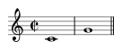
   
      Le rendu du document MusicXML
      
Tous ces
dialectes sont conformes
aux règles syntaxiques XML, présentées ci-dessous, et les documents
sont donc manipulables avec les interfaces de programmation
standard XML.

En résumé,  XML fournit des règles de représentation de l'information
qui sont "neutres" au regard des différentes
applications susceptibles de traiter cette information. Il facilite
donc l'échange de données, la transformation de ces données,
et en général l'exploitation dans des contextes divers  
d'un même document.

Formalisme XML
==============

.. note:: Nous nous contentons du minimum vital. Si vous
   êtes amenés à utiliser intensivement XML (pas forcément une bonne nouvelle!)
   il faudra impérativement aller plus loin.
   
Les documents XML sont la plupart du temps créés, stockés et surtout
échangés sous une forme textuelle ou *sérialisée* qui "marque" la
structure par des balises mêlées au contenu textuel. Ce marquage
obéit à des règles syntaxiques, la principale étant que le
parenthésage défini par les balises doit être imbriqué |nbsp| : si une
balise <b> est ouverte entre deux balises <a> et
</a>, elle doit également être fermée
par </b> entre ces deux balises.  Cette contrainte introduit
une hiérarchie entre les éléments définis par les balises.  Dans
l'exemple du film ci-dessus, l'élément ``<titre>Gravity</titre>``
est un sous-élément de l'élément défini par la balise ``<film>``.  Ce dernier englobe tout le
document (sauf la première ligne) et est appelé 
*l'élément racine*
du document.
 

Un document XML  est une chaîne de caractères 
qui doit toujours débuter par une 
*déclaration XML* |nbsp| :

.. code-block:: xml

    <?xml version="1.0" encoding="ISO-8859-1"?>

Cette première
ligne indique que la chaîne contient des informations
codées avec la version 1.0 de XML, et que le jeu
de caractères utilisé est conforme à la norme
UTF-8 définie par l'Organisation
Internationale de Standardisation (ISO). 

On trouve ensuite, optionnellement  et sans contrainte d’ordre:

  * une déclaration ou (exclusif) une référence à un type de document, ou  DTD (*Document
    Type Definition*)::
     
     <!DOCTYPE element racine [schema racine ] >
    
    ou::
    
      <!DOCTYPE element racine SYSTEM "uri schema racine" >
      
  * des commentaires de la forme ``<!-- texte -->``
  * des instructions de traitement (par ex. appel à XSLT) 
    de la forme ``<?instruction attribut1 = "valeur" ... attribut n ="valeur" ? >`` 
  * le *corps* du document, qui commence à la première balise ouvrante et finit
    à la dernière balise fermante.

Le corps est l'essentiel du contenu d'un document. Il est formé d'une
imbrication d'éléments (balises) et de texte, le tout formant
la description conjointe du contenu et de la structure. Tout ce qui précède la
première balise ouvrante constitue le prologue. 

Voici quelques exemples simples. Le premier est un élément vide (et donc
un document vide également).

.. code-block:: xml

    <document/>
  
Le second comprend la construction de base de XML: la structure (balise) associée
à un texte.

.. code-block:: xml
  
   <document> Hello World! </document>

Le troisième donne un premier exemple d'imbrication d'éléments représentant la structure hiérarchique.
  
.. code-block:: xml
  
    <document>
      <salutation> Hello World! </salutation> 
    </document>

Enfin le dernier est le seul correct puisqu'il contient la ligne de déclaration initiale. Notez
l'ajout d'un *attribut* dans la balise ouvrante.

.. code-block:: xml
    
    <?xml version="1.0" encoding="utf-8" ?> 

    <document>
      <salutation color="blue"> Hello World! </salutation> 
    </document>

Un document XML est interprété comme un *arbre*, basé sur
un modèle, le DOM (*Document Object Model*) normalisé par le W3C.
Dans le DOM, chaque nœud de l'arbre a un *type*, et une *description* (nom, contenu).
L'ensemble peut rapidement devenir compliqué: nous présentons l'essentiel,
en commençant par les types de nœuds les plus importants: les
nœuds de type **Element** qui représentent la structure, et les
nœuds de type **Text** qui représentent le contenu.

Éléments et texte
~~~~~~~~~~~~~~~~~

Les *éléments* constituent les principaux nœuds de structure d'un document XML.  

 * Dans la forme sérialisée, chaque élément se compose d'une *balise ouvrante* ``<nom>``, 
   de son *contenu* et d'une *balise fermante* ``</nom>``.
 * Dans la forme arborescente, un élément est un nœud de type  **Element** (DOM), racine
   d'un sous-arbre représentant son contenu.

Les nœuds de type **Text** correspondent au *contenu textuel* du document.

  - ils constituent les feuilles de l'arborescence (un nœud **Text** n'a pas de fils);
  - ils contiennent une chaîne de caractères.

Voici un premier exemple montrant la construction de base: un élément et un texte.

.. code-block:: xml
    
    <monEl>
      Le contenu textuel.
    </monEl>

Un second exemple montrant la création d'une arborescence par imbrication
des balises ouvrante/fermante.

.. code-block:: xml

    <maRacine>
     Contenu texte
     <sousEl>
       Autre contenu
     </sousEl>
    </maRacine>

La correspondance DOM de ces deux exemples est montrée dans la figure :ref:`ElementEtText`.

.. _ElementEtText:
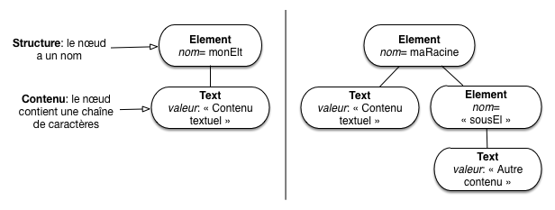
   
      Nœuds de type **Element** et **Text** dans le modèle arborescent
      
Notez que, contrairement à HTML, les majuscules et minuscules
sont différenciées dans les noms d'éléments.
Tout document XML comprend un et un seul *élément racine* qui définit le
contenu même du document.  

Un élément a un nom, mais il n'a pas de "valeur". Plus
subtilement, on parle de *contenu* d'un élément pour désigner 
la combinaison arbitrairement complexe de commentaires, d'autres éléments, de
références à des entités et de données caractères qui peuvent
se trouver entre la balise ouvrante et la balise fermante.

La présence des balises ouvrantes et fermantes est obligatoire pour
chaque élément. En revanche, le contenu d'un élément peut être vide.
Il existe alors une convention qui permet d'abréger la notation en
utilisant une seule balise de la forme ``<nom/>``. Dans
notre document *Gravity*, l'élément *réalisateur* est vide, ce qui
ne l'empêche pas d'avoir des attributs.

Les noms de balise utilisés dans un document XML sont libres et peuvent
comprendre des lettres de l'alphabet,  des chiffres, et les
caractères "-" et "_". Néanmoins ils ne doivent pas contenir 
d'espaces ou commencer par un chiffre. 

Attributs et Document
~~~~~~~~~~~~~~~~~~~~~

Pour compléter la description de l'essentiel de la syntaxe et de
sa représentation arborescente, il faut introduire
deux types DOM: **Attribute** et **Document**.

Dans le document *Gravity.xml* l'élément *réalisateur* 
a deux *attributs*. Les attributs d'un élément apparaissent toujours
dans la balise ouvrante, sous la forme ``nom="valeur"`` ou
``nom='valeur'``, où ``nom`` est le nom de l'attribut et
``valeur`` est sa valeur. Les noms d'attributs suivent les mêmes règles
que les noms d'éléments. Si un élément a
plusieurs attributs, ceux-ci sont séparés par des espaces.

Un élément ne peut pas avoir deux attributs
avec le même nom. De plus, contrairement à HTML,
il est bon de noter que

  * un attribut doit *toujours* avoir une valeur |nbsp| ;
  * la valeur doit être comprise entre des apostrophes
    simples ('10') ou doubles ("10") |nbsp| ; la valeur elle-même peut
    contenir des apostrophes simples si elle est encadrée par des apostrophes
    doubles, et réciproquement.

Les attributs sont représentés en DOM par des nœuds de type **Attribute**
attachés à l'élément.

Enfin, un document XML sous forme sérialisée commence *toujours* par un prologue
représenté dans la forme arborescente par un nœud de type *Document*
qui constitue la *racine du document* Ce nœud a un unique fils de type
**Element** qui est *l'élément racine* (à bien distinguer, même si
la terminologie peut prêter à confusion).

La figure :ref:`GravityDOM` montre la représentation DOM complète
de notre document *Gravity*. Chaque *type* de nœud est représenté par
une couleur différente.  

.. _GravityDOM:
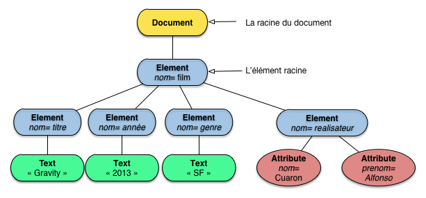
   
      L'arbre DOM complet pour le document *Gravity*

Sections littérales
~~~~~~~~~~~~~~~~~~~~

Il peut arriver que l'on souhaite placer dans un document du texte qui
ne doit pas être analysé par le parseur.  C'est le cas par exemple |nbsp| :

  * quand on veut inclure (à des fins de documentation par exemple)
    du code de programmation qui contient des
    caractères réservés dans XML |nbsp| : les '$<$' et '\&'
    abondent dans du code C ou C++ |nbsp| ;
  * quand le document XML est consacré lui-même à XML, avec des
    exemples de balises que l'on souhaite reproduire littéralement.

Le document XML suivant  n'est pas *bien formé* par rapport à
la syntaxe XML |nbsp| :

.. code-block:: text

    <?xml version='1.0'?>

    <programme>
     if ((i < 5) && (j > 6)) printf("error");
    </programme>

Une analyse syntaxique du fichier détecterait
plusieurs erreurs syntaxiques liées à la présence des caractères '<',
'>' et '\&' dans le contenu de l'élément ``<programme>``.

Les *sections littérales* ``CDATA`` permettent d'éviter ce
problème en définissant des zones qui ne sont pas analysées par le
parseur XML.  Une section ``CDATA`` est une portion de texte entourée par
les balises ``<![CDATA[`` et ``]]>``. Ainsi il est possible
d'inclure simplement notre ligne de code dans une section ``CDATA`` pour éviter une erreur syntaxique provoquée par les
caractères réservés |nbsp| :

.. code-block:: xml

    <?xml version='1.0'?>

    <programme>
     <![CDATA[if ((i < 5) && (j > 6)) printf("error");]]>
    </programme>

En résumé, voici ce qu'il faut retenir. Pour la forme sérialisée (qui encode un arbre):

 * Un document débute par un prologue.
 * Le contenu du document est enclos dans une unique balise ouvrante/fermante.
 * Chaque balise ouvrante  <nom> *doit* avoir une balise fermante </nom>; 
   tout ce qui est entre les deux est soit du texte, soit du balisage correctement ouvert/fermé.

Pour la forme arborescente, représentée par des nœuds dont les types
sont définis par le DOM:

  * Un document est un *arbre* avec une racine (du document) de type **Document**.
  * La racine du document a un seul *élément* fils, de type **Element**, appelé
    *l'élément racine*.
  * Chaque **Element** est un sous-arbre représentant du contenu structuré
     formé de nœuds **Element**, de nœuds **Text**, et parfois
     de nœuds **Attribute**.

Ces connaissances devraient suffire pour la suite.

Exercices
=========

.. _Ex-S1-1:
.. admonition:: Exercice `Ex-S1-1`_: comprendre ce que représente un document XML

   Prenons le document suivant. 

   .. code-block:: xml
      
    <les_genies>
     <genie>
        Alan Turing
     </genie>
     <genie>
      Kurt Godel
     </genie>
    </les_genies>
    
   Et répondez aux questions suivantes:
    
     - Donnez sa forme arborescente.    
     - Quel est le *contenu* de l'élément ``les_genies``?
     - Quel est le *contenu textuel* de l'élément ``les_genies``?
     
   Suggestion: vous pouvez dès maintenant installer BaseX (voir prochain chapitre)
   et charger le document.  Aidez-vous des fenêtres d'inspection
   de la structure du document. 

   .. ifconfig:: docstruct in ('public')

      .. admonition:: Correction
  
         La figure :ref:`LesGenies` montre la forme arborescente du modèle DOM. 
         Le *contenu* de l'élements  ``les_genies`` est constitué de deux 
         nœuds **Elements** avec leurs sous-arbres (un nœud de type **Text**
         dans les deux cas). Le *contenu textuel* est la concaténation
         des nœuds de type **Text**, soit ``Alan TuringKurt Godel``. Une question
         pertinente à ce propos: est-ce qu'un retour à la ligne entre une balise
         ouvrante et une balise fermante constitue un nœud texte constitué
         d'espaces blancs? La réponse est oui ou non selon le contexte, et fait
         partie des aspects pénibles de la spécification XML: consultez le site du W3C
         ou oubliez simplement la question qui en général ne se pose pas.
       
         .. _LesGenies:
         .. figure:: ../figures/LesGenies.png    
              :width: 70%
              :align: center
   
              L'arbre des génies

.. _Ex-S1-2:
.. admonition:: Exercice `Ex-S1-2`_: produire des documents XML

   On trouve du XML partout sur le Web (et nous y revenons dans le
   prochain chapitre). Mais vous pouvez aussi coder vos propres informations
   en XML. Tous les composants Office (Microsoft ou OpenOffice) par
   exemple offrent l'option de sauvegarder en XML. Exportez
   par exemple les données d'un tableur et regardez le contenu du XML engendré.

   Êtes-vous sûr que vos documents XML sont bien formés? Utilisez
   le validateur du W3C pour le vérifier: http://validator.w3.org/.
   
   Autre exercice amusant (peut-être): regarder des codages alternatifs. Par
   exemple exportez votre calendrier en iCalendar, et regardez à quoi
   ça ressemble. Peut-on convertir en XML? Pourquoi voudrait-on le faire?
   
.. _Ex-S1-3:
.. admonition:: Exercice `Ex-S1-3`_: récupérer une très grosse collection de documents XML

    Pourquoi ne pas installer toute une encyclopédie, en XML, 
    sur votre ordinateur? Wikipedia propose des *dumps* (export)
    à l'adresse suivante: http://dumps.wikimedia.org/. Vous êtes invités
    à en récupérer tout ou partie (volume = quelques GOs) et à regarder
    attentivement comment sont constitués les documents.

*********************************
S2: XPath, trouver son chemin XML
*********************************

.. admonition:: Supports complémentaires

    * `Diapositives: comprendre XPath  <http://b3d.bdpedia.fr/files/slxpath.pdf>`_
    * `Vidéo de la session XPath <http://avc.cnam.fr/univ-r_av/avc/courseaccess?id=2162>`_  
    * Pour en savoir plus: reportez-vous au livre en ligne `Web Data Management <http://webdam.inria.fr/jorge>`_.
  
  
XPath est un langage  normalisé par le W3C qui sert à *exprimer des chemins* dans
un document XML. Ces chemins partent d'un nœud dit *courant* et mènent
à des nœuds qui constituent l'ensemble désigné par l'expression XPath (son résultat
pour le dire simplement). 

XPath s'appuie sur la représentation arborescente d'un document XML. Il reste
assez limité: essentiellement on peut le voir comme un outil pour "naviguer" dans
un arbre XML afin de sélectionner des ensembles de nœuds. XPath prend
en revanche tout son intérêt quand il est associé à des langages plus puissants
dont il constitue une brique de base. C'est le cas de XQuery (que nous introduisons
dans la prochaine session), de XSLT, des schémas, etc. Un interpréteur XPath est
inclus dans tout environnement de programmation XML, et c'est donc un langage à connaître,
au moins dans ses principes essentiels.

Comme souvent avec XML, ces principes sont assez simples, mais les détails deviennent
rapidement indigestes. Ce qui suit se limite donc à la partie de XPath la plus claire, et 
sans doute la plus utile en pratique. Quelques compléments sont mentionnés au passage: 
si vous êtes amenés à utiliser XPath de manière intensive, reportez-vous à une source
plus complète, comme par exemple le livre cité ci-dessus.

.. note:: XPath a évolué de la V1.0 présentée ici à une V2 qui 
   vise à une meilleure intégration avec XQuery. 
  
Un exemple commenté
===================

Avant d'entrer dans la théorie, voyons un exemple simplissime qui nous donnera
toutes les intuitions nécessaires pour aborder les détails techniques avec confiance.
Nous prenons comme document-exemple la représentation du film Gravity (récupérer
le document <http://b3d.bdpedia.fr/files/Gravity.xml>`_ pour travailler
avec dans BaseX, si ce n'est déjà fait).
Sa forme arborescente est rappelée par le figure :ref:`GravityDOM2`. 

.. _GravityDOM2:

   
        L'arbre DOM du document ``Gravity``

Repérez bien les différents *types* de nœud, les *noms* des éléments et attributs, la
*valeur* des attributs et des nœuds texte. XPath s'appuie sur cette représentation DOM.
Voici l'expression XPath que nous allons étudier et commenter.

.. code-block:: xquery

   /film/titre/text()
   
Une expression XPath est découpée en *étape*, séparés par des '/': ici il y en a trois que nous allons
successivement détailler. Par ailleurs, une expression s'évalue par rapport à un point de départ
dans l'arbre, dit *nœud courant*. 

Ici nous avons une expression dite *absolue* qui commence par un '/': dans ce 
cas le nœud courant est la racine du document.  En l'absence du '/' initial, l'expression
est dite *relative* et le nœud courant est défini par le contexte d'exécution.

.. note:: Il est assez facile de remarquer l'analogie entre ces notions (ainsi que la notation)
   et celles utilisées pour la navigation dans un système de fichiers. 
   
À partir du nœud courant, on va naviguer dans une certaine direction, le plus souvent (mais
pas toujours) en considérant les *enfants* du nœud courant. La situation iniale est illustrée
par la figure :ref:`GravityXPath1`: le nœud courant est marqué par des bords rouges en pointillés,
et le(s) chemin(s) de navigation par des flêches rouges. 
   
.. _GravityXPath1:
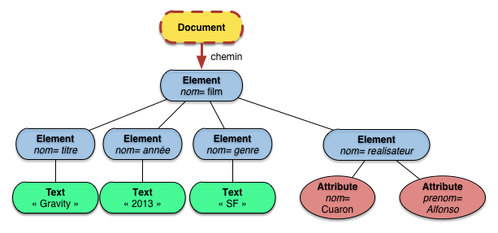
   
        Situation initiale

Les chemins issus du nœud courant désignent un ensemble de nœuds. On applique 
alors  des tests en sélectionner certains. On peut sélectionner des nœuds de deux manières
avec XPath:

  * par des tests sur la *structure* (``node-test``), soit le nom du nœud, soit le type du nœud;
  * par des tests sur *le contenu*, grâce à des *prédicats* que nous verrons plus tard.
  
Le test  de notre première étape est 

 .. code-block:: xquery

   film

C'est un test qui porte sur le *nom* du nœud. En clair, on veut, parmi les enfants
du nœud courant, ceux dont le nom est ``film``. On obtient le résultat de la figure
:ref:`GravityXPath2`: où le résultat est mis en évidence par un bord rouge plein.

   
.. _GravityXPath2:
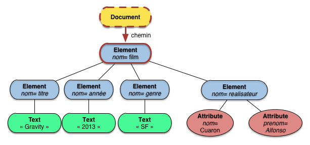
   
        La première étape

.. important:: Ces explications peuvent sembler compliquées par rapport à la simplicité
   de notre exemple. Elles expriment les règles générales d'interprétation d'une expression,
   et se généralisent donc à des cas plus complexes: faites l'effort de les mémoriser, vous
   vous en féliciterez ensuite.
   
Nous en arrivons à la seconde étape, qui consiste également en un test sur le nom
du nœud:

.. code-block:: xquery

   titre   
  
L'interprétation de cette étape (et donc tu test) se fait par rapport un nœud courant, 
et ce nœud courant est l'un des nœuds du résultat de l'étape précédente. En l'occurrence, 
il n'y en a qu'un, c'est le nœud ``film``, mais dans le cas général, l'étape précédente 
a pu sélectionner plusieurs nœuds, et l'étape courante est évaluée en les prenant successivement 
comme nœud courant (tout le monde suit? sinon relisez).
  
Nous avons donc la situation  illustrée par la figure :ref:`GravityXPath3`: le nœud
courant est ``film``, les chemins de navigation sont ceux qui mènent aux enfants,
et le nœud sélectionné est celui dont le nom est ``titre``.
  
.. _GravityXPath3:

   
        La deuxième étape

Il reste à considérer la dernière étape:

.. code-block:: xquery

   text()
   
Ici, le test de nœud ne porte pas sur le nom mais sur le *type* (DOM) des nœuds
que l'on veut sélectionner: on veut tous les nœuds de type **Text**. On sélectionne
par le type quand, entre autres, les nœuds concernés n'ont pas de nom (c'est le cas
des nœuds texte).

Le nœud courant, les chemins, et le nœud final sélectionné sont illustrés sur la
figure       :ref:`GravityXPath4`: ce nœud final est le résultat de l'ensemble
de l'évaluation XPath pour notre expression.

.. _GravityXPath4:
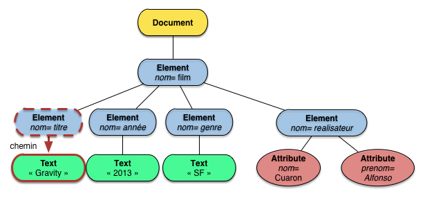
   
        La dernière étape
        
Une bonne part des concepts utiles à la compréhension de XPath sont montrés dans ce qui précède:

  * notion de *nœud courant*, point de départ pour l'interprétation d'une étape;
  * chemin de navigation, allant du nœud courant initial à l'un des nœud finaux;
  * test de nœud, par nom ou par type;
  * itérations sur des étapes.
  
Prenez donc le temps de bien relire si ce n'est pas clair. C'est dense mais court:
il n'est pas nécessaire d'en comprendre beaucoup plus pour savoir manipuler XPath. 
Le formalisme XPath est revu de manière plus générale dans ce qui suit.

Formalisme XPath
=================

Une *expression XPath* est une suite d'étapes (*steps*). 
Une *étape*  est une expression de la forme:

.. code-block:: xquery

   axe::test[predicat]
   
Chaque étape comprend trois composants, dont le premier a pour valeur
par défaut ``child``, et le dernier est optionnel.

  * *l'axe* indique la direction de la navigation effectuée à partir du nœud courant; par défaut
    on navigue vers les enfants;
  * ``test`` est un *test de nœud*, le seul composant à devoir figurer obligatoirement
    dans une étape; un test (de nœud) exprime un filtre sur les nœuds désignés 
    par l'axe, soit sur le nom, soit sur le type DOM;
  * enfin le *prédicat* est une condition sur du contenu extrait à partir du nœud courant.
  
L'axe ``child`` est le plus courant et on évite en général de le mentionner dans
une expression. Notre exemple ``/film/titre/text()`` pourrait se développer en

.. code-block:: xquery

    /child::film/child::titre/child::text()  
    
ce qui ne facilite pas la lecture. Cet exemple ne comprend pas de prédicat. Voici
un premier exemple d'expression  avec prédicat.

.. code-block:: xquery

     child::realisateur[attribute::nom="Cuaron"]
     
Elle peut s'abréger en ``realisateur[@nom="Cuaron"]``. 
On voit que le prédicat sélectionne  les valeurs de nœuds-texte ou des attributs
proches du nœud courant (ici, le nom du réalisateur qui est un attribut) et
les compare à des constantes ou entre eux:  c'est un peu comparable à la clause
``where``  de SQL, à la différence notable que les valeurs sont ramenées par
des expressions XPath *relatives* au nœud courant.

L'interprétation d'une expression a été décrite sur notre exemple préliminaire.
Voici les règles, en résumé. À chaque étape:

  * on considère un *nœud courant*, pris comme point de départ;
  * on "désigne"  à partir du nœud courant un ensemble d'autres nœuds par l'axe de navigation;
  * on applique à chacun les tests de nœud;
  * on applique les prédicats (optionnels);
  * enfin on prend chacun des nœuds sélectionnés comme nœud courant pour l'étape suivante.

Les axes sont très nombreux dans XPath. On peut se contenter de ceux
donné par la liste suivante:

      * ``child``: les enfants du nœud courant;
      * ``descendant``: tous les descendants du nœud courant;
      * ``parent``: l'ascendant direct du nœud courant;
      * ``attribute``: les attributs du nœud courant;
      * ``self``: le nœud courant lui-même.

Si vous êtes amenés à utiliser XPath intensivement, il faudra aller plus loin:
reportez-vous au livre `Web Data Management <http://webdam.inria.fr/jorge>`_ 
pour une présentation complète.

La figure :ref:`GravityXPath-child` montre les nœuds désignés par l'expression ``child::node()``, 
pour le nœud courant ``film``. Le test de nœud ``node()`` est le test "neutre": il 
renvoie "vrai" pour tous les nœuds.

.. _GravityXPath-child:
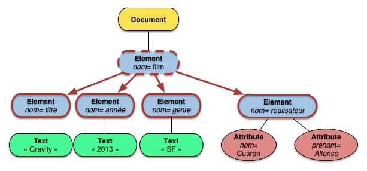
   
        L'axe ``child`` 
        
La figure :ref:`GravityXPath-descendant`  montre les nœuds désignés par l'expression ``descendant::node()``.
À partir du nœud courant, on prend donc en compte *tous* les nœuds du sous-arbre, *à l'exception
des attributs* qui sont toujours traités de manière spéciale. En fait, les attributs ne sont
pas considérés comme partie de l'arbre "principal". C'est toujours l'idée qu'ils représentent
des méta-données et ne doivent donc pas être traités sur le même plan que le contenu
principal représenté par des nœuds texte.
       
.. _GravityXPath-descendant:

   
        L'axe ``descendant`` 

Pour accéder explicitement aux attributs, on doit utiliser l'axe ``attribute`` qui s'abrège
avantageusement en ``@``.  La figure :ref:`GravityXPath-att`  montre les nœuds désignés par 
l'expression ``@*``, pour le nœud courant  ``réalisateur``. Notez le test de nœud ``*``
qui prend tous les nœuds nommés, quels que soit le nom.

.. _GravityXPath-att:
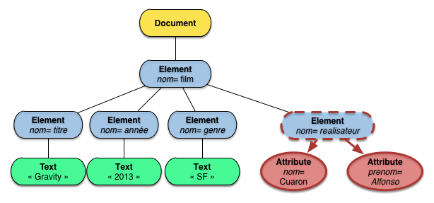
   
        L'axe des attributs
        
L'axe ``parent`` ne nécessite pas de grande explication: il désigne l'unique nœud
parent du nœud courant.

Tests et prédicats
==================
 

Voyons maintenant comme on filtre les nœuds désignés par les axes. Il existe
deux méthodes: filtrage sur la structure (par les ``node-test``) ou filtrage sur
le contenu avec les prédicats.

.. admonition:: Pour les puristes

   Cette distinction est un peu simplificatrice car on pourait 
   montrer des exemples de prédicats filtrant sur la structure. Privilégions
   la clarté et passons.
   
Commençons par les tests de nœud. Il peuvent porter sur le *type* (DOM) du nœud.
Voici les principaux tests sur le type:

    * ``node()`` sélectionne les nœuds  quel que soit leur type;
    * ``text()`` sélectionne les nœuds de type \textbf{Text};
    * ``element()`` sélectionne les nœuds de type \textbf{Element}.
 
Ou bien ils portent  sur le *nom* du nœud (seulement pour éléments et attributs).

    * ``unNom`` sélectionne les éléments ou attributs de nom ``unNom``
    * ``*`` sélectionne les nœuds qui ont un nom, quel que soit le nom.

Prenons l'expression suivante:

.. code-block:: xquery    

    /film/*/text()
    
qui est *presque* identique à notre exemple initial. On a donc trois tests 
de nœud, l'un portant sur un nom explicite, l'autre sélectionnant les nœuds
quel que soit leur nom, le dernier sélectionnant par le type. Le résultat
de cette expression est illustré par la figure :ref:`GravityXPath-text`.
    
.. _GravityXPath-text:
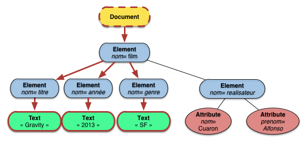
   
        Application d'un filtre sur le type du nœud 
        
Et finalement, les *prédicats* testent des valeurs extraites du contenu
par des expressions relatives au nœud courant. Voici quelques exemples:

    * Films réalisés par M. Cuaron:
 
      .. code-block:: xquery
      
         /film[realisateur/attribute::nom='Cuaron']/titre
    
    * Les films de SF: 

      .. code-block:: xquery
      
         /film[genre='SF']/titre

    * Les personnes dont on connaît la date de naissance:

      .. code-block:: xquery
      
          /personne[attribute::date_naissance]
    
     * Les films dont le genre est soit SF, soirt comédie:
 
      .. code-block:: xquery
      
          /film[genre='SF' or genre='Comedy']/titre

Insistons un peu sur la notion d'expression *relative* dans les prédicats. L'expression
``genre`` -- c'est une expression XPath, avec l'axe implicite ``child`` et aucun prédicat -- 
dans le dernier exemple est *relative* au nœud ``film``, autrement
dit relative au nœud courant sélectionné par l'étape et objet du test. 

Dans le premier
exemple cette expression relative est un peu plus complexe: ``realisateur/@nom='Cuaron'``.
La figure :ref:`GravityXPath-predicate` montre l'imbrication des deux expressions XPath
dans l'expression complète. Celle exprimant le chemin principal est en rouge, celle
exprimant le test du prédicat en vert. Au cours de l'évaluation d'un chemin, on
peut donc "explorer" les alentours du nœud courant pour exprimer des filtres.
       
.. _GravityXPath-predicate:
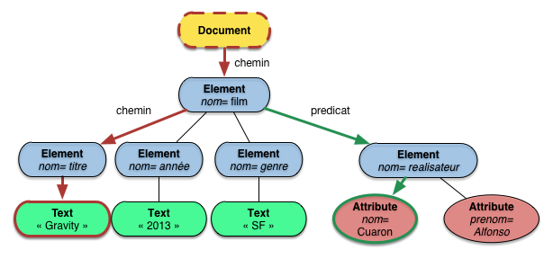
   
        Evaluation de ``/film[realisateur/@nom='Cuaron']/titre``
        
.. admonition:: Parenthèse
 
   Si vous êtes *très* attentif, vous vous demandez peut-être ce qui
   se passe dans un prédicat quand l'expression XPath sélectionne un *ensemble* de nœuds
   que l'on veut comparer à une *unique* valeur. On entre ici dans la soupe de règles peu digestes
   qu'il vaut mieux ignorer tant que c'est possible. Une telle situation peut 
   d'ailleurs être considérée comme une anomalie. Fermons cette parenthèse que ne visait
   qu'à vous donner un aperçu des aspects indigestes de la spécification complète XPath.
  
Pour conclure, voici quelques abréviations très pratiques.

  * ``.`` désigne le nœud courant (c'est l'abrégé de ``self::node()``)
  * ``..`` désigne le  parent du nœud courant (c'est l'abrégé de ``parent::node()``)
  *  ``//`` est une expression abrégée désignant tous les descendants du 
     nœud courant, y compris le nœud courant lui-même; donc:     
     
     #. ``//a`` désigne tous les nœuds du document dont le nom est ``a``;
     #. ``.//b`` désigne tous les descendants du nœud courant (ou lui-même)
        dont le nom est ``b``.

On peut s'arrêter: si vous assimilez ce qui précède, vous êtes largement assez
compétent(e) pour constuire les expressions XPath résolvant les navigations
les plus courantes. Pour vérifier, regardez les exemples suivants 
et confirmez-vous que vous les comprenez.

  * Tous les nœuds texte du document: ``//text()``
  * Les nœuds texte dont le nom du parent est ``titre``: ``//text()[parent::film]``
  * Les nœuds texte dont le nom du parent est ``titre``        
    et qui contiennent la sous-chaîne ``ty``.
         
    .. code-block:: xquery
    
        //text()[parent::titre and contains(., 'ty')]
       
    NB: la fonction ``contains (chaine, motif)`` renvoie vrai si ``motif`` est trouvé dans ``chaine``.
     
  * Les nœuds qui ont plus de deux enfants.
 
    .. code-block:: xquery
      
        //*[count(*) >= 2]
       
    NB: la fonction ``count(set)`` compte le nombre de nœuds dans ``set``.
    
Comme vous pouvez le constater, un des aspects que nous avons passé sous  silence est
le très riche ensemble de fonctions disponibles dans XPath. Ces fonctions font
(depuis XPath 2.0) partie de la spécification XQuery.
  
Exercices  
=========
  
Vous pouvez vous contenter de faire les deux premiers exercices si votre
objectif n'est pas d'approfondir les langages XML. Pour ceux/celles qui
souhaitent effectuer un projet avec des documents XML et un système comme
BaseX ou eXist, compléter l'ensemble des exercices est utile.
  
.. _Ex-S2-1:
.. admonition:: Exercice `Ex-S2-1`_: Testons XPath

   Voici un document que vous pouvez également récupérer 
   `en cliquant ici <http://b3d.bdpedia.fr/files/limonade.xml>`_.
   
   .. code-block:: xml 

      <?xml version="1.0" encoding="ISO-8859-1"?>

      <inventory>
        <drink>
          <lemonade supplier="mother" id="1">
            <price>$2.50</price>
            <amount>20</amount>
          </lemonade>
          <pop supplier="store" id="2">
            <price>$1.50</price>
            <amount>10</amount>
          </pop>
        </drink>
        <snack>
          <chips supplier="store" id="3">
            <price>$4.50</price>
            <amount>60</amount>
            <calories>180</calories>
          </chips>
        </snack>
      </inventory>
   
Evaluer (sur papier) les requêtes XPath suivantes (quels nœuds
obtient-on?), puis les appliquer avec BaseX après avoir créé une
nouvelle base et chargé le document.
Vous pouvez simplifier ces expressions en exploitant l'axe par défaut.

  *  ``/inventory``
  * ``/inventory/drink``
  *  ``/inventory/drink/*``
  *  ``/inventory/drink/lemonade``
  *   ``/inventory/drink/*/price``
  *  ``/inventory/drink/price``
  *  ``/inventory/drink/lemonade[amount>15]``
  *  ``/inventory/*/*[amount>15]``    
  *  ``/inventory/drink/pop/amount[. < 20]``
  *  ``/inventory/*[*/amount>15]``
  *  ``/inventory/*/*[attribute::supplier='store']``
  *  ``/inventory/drink/lemonade[amount>15]``

.. _Ex-S2-2:
.. admonition:: Exercice `Ex-S2-2`_: Continuons à tester XPath

   Encore un document XML:
   
   .. code-block:: xml
   
      <?xml version="1.0" encoding="ISO-8859-1"?>

      <library>
        <book year="2010">
          <title>Web Data Management and Distribution</title>
          <author>S. Abiteboul</author>
          <author>I. Manolescu</author>
          <author>P. Rigaux</author>
          <author>M.-C. Rousset</author>
          <author>P. Senellart</author>
        </book>
        <book year="2007">
          <title>Database Management Systems</title>
          <author>R. Ramakrishnan</author>
          <author>J. Gehrke</author>
        </book>
      </library>
      
   Que cherchent à calculer les expressions suivantes ? 
   Donner les résultats de leurs évaluations sur le document précédent (vous pouvez
   utiliser BaseX).

      * ``/library``
      * ``/*/book/title/text()``
      * ``/library/book/@*``
      * ``/library/book/@year``
      * ``/descendant::author``
      * ``/*/descendant::library``
      * ``/descendant::book/title`` 

.. _Ex-S2-3:
.. admonition:: Exercice `Ex-S2-3`_:  interrogation d'une base XML avec XPath

   Créez une base ``bigmovies`` dans laquelle vous chargez le document
   ``movies.xml`` extrait du site Webscope, qui contient en un seul document tous les films. 
   Trouvez les expressions XPath qui permettent de répondre
   aux questions suivantes.
  
            * tous les *éléments* titre;
            * tous les *titres* (le texte) des films;
            * tous les titres des films sortis après 2000;
            * le résumé de Spider-Man;
            * qui est le metteur en scène de *Heat*?
            * titre des films avec Kirsten Dunst;
            * quels films ont un résumé?
            * quels films *n'ont pas* de résumé;
            * quel rôle tient Clint Eastwood dans *Impitoyable*?
            * quel est le dernier film du document?
            * titre du film qui précède *Marie-Antoinette* dans le document;
            * films dont le titre contient un 'V' (utiliser la fonction *contains()*);
            * films dont la distribution consiste en exactement 3 acteurs (fonction *count()*).
            
.. ifconfig:: xpathsol in ('public')

   .. admonition:: Correction

      * ``/movies/movie/title``
      *  ``//title/text()``
      *  ``//movie[year > 2000]/title``
      *  ``/movie[title='Spider-Man']/summary``
      *  ``//movie[title='Heat']/director``
      *  ``//movie[actor/last_name='Dunst']/title``
      *   ``/movie[summary]/title``
      *  ``/movie[not(summary)]/title``
      *   ``/movie[title='Impitoyable']/actor[last_name='Eastwood']/role``
      *   ``//movie[position()=last()]/title``
      *   ``//movie[title='Marie Antoinette']/preceding-sibling::movie[last()]/title``
      *   ``//movie/title[contains (text(), 'V')]``
      * ``//*[count(descendant::*) = 3]``

.. _Ex-S2-4:
.. admonition:: Exercice `Ex-S2-4`_:  pour ceux qui ne sont pas encore dégoutés de XPath

   BaseX fournit un document ``factbook.xml`` dans le répertoire ``etc``. Créez
   une base ``factbook`` et importez ce document. Il contient des données administratives
   sur les états, régions et cités du globe.
   
   Voici tout un ensemble de requêtes XPath très intéressantes. *Aide*: pour afficher
   la valeur d'un attribut, il faut ajouter une dernière étape XPath ``/string()``. 
   
     * Donnez la liste des pays.
     * Donnez la liste des régions françaises.
     * Donnez la liste des villes Corses.
     * Quels pays ont moins de 100 000 habitants?
     * Affichez les capitales des pays. (NB: l'id de la capitale est un attribut de ``country``). Faites attention:
       les villes (``city``) apparaissent parfois directement sous ``country``, parfois sous
       un niveau intermédiaire ``province``.
     * Quel est le pays dont la capitale est Bishkek?
     * Dans quels pays trouve-t-on des Mormons ? (Chercher un élément ``religions`` dont la valeur est ``Mormon``).
            
   Et ainsi de suite... On atteint assez rapidement les limites de XPath en tant que langage d'interrogation: pas
   de possibilité en général de *restructurer* les données pour afficher, par exemple, un pays, sa capitale,
   sa population et le nombre de ses provinces. Il faut recourir à un langage plus puissant (XQuery) pour cela.
   
.. ifconfig:: xpathsol2 in ('public')

   .. admonition:: Correction

      * ``//country/name``
      * ``//country[name="France"]/province/@name/string()``
      * ``//country[name="France"]/province[@name="Corse"]/city/name``
      * ``//country[@population < 10000]/name``
      * ``//country//city[@id=ancestor::country/@capital]/name``
      *  ``//country[descendant::religions/text()='Mormon']`` 

************************
S3: une pincée de XQuery
************************

.. admonition:: Supports complémentaires

     * `Vidéo de démonstration du langage XQuery <http://avc.cnam.fr/univ-r_av/avc/courseaccess?id=2134>`_
     * Pour en savoir plus: reportez-vous au livre en ligne `Web Data Management <http://webdam.inria.fr/jorge>`_
  
Cette section est une brève introduction à XQuery. N'y passez pas beaucoup de temps
si l'utilisation d'un système basé sur XML n'est pas votre objectif principal. XQuery ne
fait pas partie des connaissances requises à l'examen NFE204 (pour ceux qui le passent)! 
Cela étant, connaître les bases d'un langage normalisé et bien conçu pour l'interrogation
de documents structurés ne peut pas être complètement inutile. XQuery est un langage
puissant et proposé dans tous les systèmes gérant des documents XML.

La présentation qui suit est orientée vers la pratique et se fait au mieux en
utilisant BaseX pour entrer les commandes au fur et à mesure. Vous devriez
déjà disposer d'une base *movies* dans laquelle vous avez chargé les documents
des films (un document par film). Reportez-vous à la section
:ref:`section-basex`  et à ses exercices si ce n'est pas le cas.
Les exemples donnés s'effectuent sur cette base.

Valeurs et construction de valeurs: ``let`` et ``return``
=========================================================

Contrairement à XPath, XQuery permet de construire de nouveaux documents. La méthode générale
consiste à définir des *variables* référençant des valeurs et à construire
le nouveau document en y intégrant ces variables. Les valeurs en XQuery peuvent 
être des constantes, des documents XML, des ensembles de nœuds obtenus par
expressions XPath, etc. 

Voici un premier exemple.

.. code-block:: xquery 

   let $vf := doc("movies/movie_5.xml")
   return $vf

La clause ``let`` permet de définir une variable associée à *une* (et une seule) valeur. Ici, cette
valeur est le document XML ``movie_5.xml``  de la base ``movies``. Pour être plus précis:
la variable ``vf`` référence la *racine* de ce document. 

La clause ``return $vf`` renvoie le document complet. Plus intéressant:
``$vf`` peut être traitée comme un nœud courant XPath, à partir duquel on peut 
évaluer des expressions. L'exemple suivante retourne le titre du film.

.. code-block:: xquery 

   let $vf := doc("movies/movie_5.xml")
   return $vf/movie/title/text()

C'est une chaîne de caractères obtenue par évaluation de l'expression
XPath ``$vf/movie/title/text()``. Ici, il est nécessaire de dire un mot du modèle
de données de XQuery. Il s'appuie sur deux notions: les valeurs, et les séquences de valeurs.
À peu près tout est "valeur" avec XQuery: un entier, une chaîne de caractères, un
nœud XML (et son sous-arbre). Il est donc plus juste de dire que ``return`` permet
de construire une valeur qui (comme dans l'exemple ci-dessus) peut être du XML.

En principe l'intérêt est de construire un nouveau
document structuré XML. On définit la structure avec le ``return``
et on y intégre les valeurs référencées par les variables, comme le
montre l'exemple suivant.

.. code-block:: xquery 

   let $vf := doc("movies/movie_5.xml")
   return <titre>{$vf/movie/title/text()}</titre>

On construit donc un nœud littéral (nommé ``titre``) et on y insère le résultat d'une
expression XQuery en général (et XPath en particulier) appliquée en prenant la
variable ``$vf`` comme nœud courant initial. Très important: pour bien distinguer
une expression du texte littéral qui peut l'entourer, l'expression doit être
entourée par des accolades.

.. note:: Que se passe-t-il si on oublie les accolades? Je vous laisse vérifier.

On obtient:

.. code-block:: xml

    <titre>Volte/Face</titre>
    
Voici un exemple plus complet montrant l'imbrication d'éléments littéraux
et d'expressions.

.. code-block:: xquery 

    let $vf := doc("movies/movie_5.xml")
    return <info>Le film {$vf/movie/title/text()}, paru en {$vf/movie/year/text()},
               dont le directeur est {$vf/movie/director/last_name/text()}
           </info>
      
Rien n'empêche bien entendu, la construction de documents imbriqués.

.. code-block:: xquery 

    let $vf := doc("movies/movie_5.xml")
    return <film><titre>{$vf/movie/title/text()}</titre>
                 <annee> {$vf/movie/year/text()}</annee>
                 <distribution>
                   {$vf/movie/actor}
                 </distribution>
           </film>
           
qui donne le résultat suivant:

.. code-block:: xml

   <film>
     <titre>Volte/Face</titre>
     <annee/>
     <distribution>
       <actor id="11">
        <first_name>John</first_name>
        <last_name>Travolta</last_name>
        <birth_date>1954</birth_date>
        <role>Sean Archer/Castor Troy</role>
       </actor>
       <actor id="12">
        <first_name>Nicolas</first_name>
        <last_name>Cage</last_name>
        <birth_date>1964</birth_date>
        <role>Castor Troy/Sean Archer</role>
      </actor>
     </distribution>
   </film>        
 
Ici, on rencontre une limitation: on s'est contenté de copier l'ensemble des nœuds ``actor`` du 
document initial vers le document construit.       On ne dispose pas encore de moyen
pour parcourir ces nœuds un par un pour en extraire des valeurs et les restructurer.

Contrairement à ce que nous avons vu jusqu'à présent, l'expression ``$vf/movie/actor``
ne renvoie pas *une* valeur mais une *séquence* de valeurs.  Pour traiter
les séquences, il nous faut des boucles.

Séquences: la clause ``for``
============================

La clause ``for`` est le second moyen de définir une variable avec XQuery. Alors
que ``let`` instancie une variable une seule fois avec la valeur donnée, ``for``
définit une variable en fonction d'une séquence de valeurs, et instancie
la variable autant de fois qu'il y a de valeurs dans cette séquence. Bref: c'est
une boucle! Exemple:

.. code-block:: xquery

    for $i in (1,2,3) 
    return <chantons>
     { $i } Km(s) a pieds, Ca use, ca use
     { $i } Km(s) a pieds, Ca use les souliers
    </chantons> 

Besoin d'explications? Avec la clause ``for``, ``return`` est appelé autant
de fois qu'il y a de valeurs dans la séquence d'entrée. Donc, ici, on construit
trois fois le gentil petit couplet, et le résultat de la requête XQuery est
une nouvelle *séquence* de (trois)  valeurs.

Au lieu de donner une séquence "en dur" comme dans l'exemple précédent, 
on peut bien entendu obtenir une
séquence issues d'une collection. La fonction *collection()* 
renvoie une séquence de documents provenant d'une base de données. 
Voici comment on obtient la liste des titres de films.

.. code-block:: xquery

    for $film in collection("movies")
    return <titre>{$film/movie/title/text()}</titre>
   
Nous voici proches d'un langage de requêtes comparable à SQL, et adapté
à des collections de documents structurés. Les documents reposent
sur l'imbrication de structures les unes dans les autres? Le langage
permet également l'imbrication d'expressions. 

Reprenons notre
exemple ci-dessus d'un affichage des acteurs d'un film. Les acteurs
forment une séquence, et nous savons maintenant traiter une séquence
avec la clause ``for``.  La requête suivante utilise une expression
``for`` imbriquée pour parcourir la liste des acteurs et les traiter
un à un.

.. code-block:: xquery 

    let $vf := doc("movies/movie_5.xml")
    return <film><titre>{$vf/movie/title/text()}</titre>
                 <annee> {$vf/movie/year/text()}</annee>
                 <distribution>
                   {for $acteur in $vf/movie/actor
                    return <acteur>{$acteur/last_name/text()}</acteur>
                   }
                 </distribution>
           </film>
           
Ce qu'il faut retenir: toute expression XQuery (et donc toute
expression XPath qui est une partie de XQuery) peut être imbriquée
dans le document construit avec ``return``. À l'exécution, une
expression est remplacée par la séquence constituant son résultat.

.. note:: Ceux qui pratiquent la programmation Web avec des
   moteurs de *template* reconnaîtront un type de construction
   bien connue, combinant du langage hypertexte et des 
   expressions de programmation dont le résultat est intégré
   au document final.
   
Vous savez à peu près tout sur la définition et l'utilisation des variables. Bien
entendu, rien n'empêche de définir plusieurs variables avec plusieurs ``let`` ou 
``for``. Je vous laisse deviner le résultat de la requête suivante (et vérifier
avec BaseX).

.. code-block:: xquery
 
    for $i in (-3,-2,-1,0,1,2,3)
    let $j := $i + 1
    return <suivant>{$j} est le nombre suivant {$i}</suivant>
    
    
Filtrons et trions: les clauses ``where`` et ``order``
======================================================

La clause ``where`` est comparable à celle de SQL, ainsi que la clause ``order by``. 
Voici la liste des films parus au XXIème siècle, triés par titre.

.. code-block:: xquery
 
    for $film in collection("movies")
    where $film/movie/year > 2000
    order by $film/movie/title
    return <titre>{$film/movie/title/text()}</titre>    
    
Souvenons-nous que chaque variable est un nœud qui peut être pris
comme nœud courant initial d'une expression XPath. Ce qui permet
d'envisager des critères de recherche plus complexes que la simple
comparaison de deux valeurs atomiques.

La requête suivante sélectionne tous les acteurs qui ont tourné
avec Clint Eastwood.

.. code-block:: xquery

    for $film in collection("movies")
    for $acteur in $film//actor
    where $acteur/../actor/last_name/text() ='Eastwood'
    return <acteur>{$acteur/last_name} joue dans {$film//title}</acteur>

Pour bien comprendre l'expression     ``$acteur/../actor/last_name/text()``, il
faut connaître XPath bien sûr, mais aussi se représenter correctement l'arborescence
des documents interrogés. Ici: ``$actor`` désigne un des nœuds ``actor`` d'un film,
l'étape ``..``  permet de remonter d'un niveau, puis l'étape ``actor`` de redescendre
vers tous les acteurs du même film pour tester si l'un d'entre eux est nommé
Eastwood.

Compliqué? Il est vrai qu'on saurait faire plus simple en effectuant directement
le test au niveau de la variable ``$film``:

.. code-block:: xquery

    for $film in collection("movies")
    for $acteur in $film//actor
    where $film/movie/actor/last_name ='Eastwood'
    return <acteur>{$acteur/last_name} joue dans {$film//title}</acteur>

Le lecteur attentif (vous!) remarque que l'on compare une chaîne de caractères
'Eastwood' et le résultat d'une expression XPath qui retourne une séquence
de nœuds de type **Element** (tous les noms d'acteurs). L'interpréteur XQuery 
se débrouille pour faire sens de tout cela et renvoie ``true`` si la comparison
est vraie pour *l'un* des nœuds de la séquence, après conversion de ce nœud en chaîne
de caractères.  Ce n'est pas très facile à suivre, et fait partie des quelques conventions
complexes qui peuvent rendre incertaines la compréhension d'une requête XQuery.

Dans le même ordre d'idée, voici une requête qui ne renvoie jamais rien.

.. code-block:: xquery

    for $film in collection("movies")
    where $film/movie/direcor/last_name ='Hitchcock'
    return <film>{$film}</film>

Il y a pourtant bien des films dirigés par Hitchcock dans la base? Et aucun
message d'erreur n'est renvoyé. Regardé de plus près: ``diretor`` au lieu
de ``director``. En corrigant on obtient bien le résultat escompté.

La leçon? En l'absence de schéma, XQuery (ou tout langage d'interrogation  de
document structuré) ne se plaindra jamais d'un attribut qui n'existe pas ou d'une erreur de typage.
Cela donne parfois lieu à beaucoup de temps perdu pour ceux habitués aux messages d'erreurs
renvoyés par SQL.

Résumons: le pouvoir des FLOWR
==============================   
   
Concluons par un petit récapitulatif, suivi d'exemples montrant que, même
si vous avez bien compris ce qui précède, vous n'êtes qu'à la première  
étape du long chemin qui peut vous conduire à la maîtrise complète de XQuery
(si c'est votre objectif, tout à fait respectable).

Les clauses que nous avons vues jusqu'à présent forment un sous-ensemble de XQuery
dit FLOWR (``for``, ``let``, ``order by``, ``where`` et ``return``). C'est sans
doute le plus important, mais il existe beaucoup d'autres constructions que nous
ne présentons pas:

  - les tests ``if then else``;
  - l'élimination des doublons;
  - les expressions quantifiées ("il existe...", "pour tout ...");
  - la production paramétrée de la structure du résultat;
  - d'innombrables fonctions.
  
Avec la clause FLOWR, la démarche consiste à définir (``let`` et ``for``) des variables qui référencent
des valeurs en général, et des nœuds XML en particulier. 

  - la fonction *doc(fichier)* retourne la racine du document contenu dans le fichier;
  - la fonction *collection(nomColl)* retourne la séquence des racines des documents de
    la collection *nomColl*.
    
À partir de ces nœuds on
peut exprimer des chemins XPath, ou effectuer des itérations si la variable contient une séquence.
Les expressions XPath ou XQuery renvoient des séquences de
valeurs sur lesquelles on peut effectuer des tests (``where``),
des tris (``order by``); on peut aussi inclure ces séquences/valeurs dans le document construit
avec ``return``. Dans ce cas les expressions  doivent être entourés d'accolades.

Il n'y a pas vraiment de limite à ce que l'on peut exprimer avec XQuery qui est
équivalent à un langage de programmation complet, orienté vers la production de documents structurés.
Voici une jolie requête construisant un résultat complexe. Je vous laisse la décrypter
et la tester.

.. code-block:: xquery

    for $m in collection("movies")/movie 
    let $d := $m/director
    where $m/actor/last_name="Dunst" 
    return
       
{"Le film ", $m/title/text(), " sous la direction de ",
            $d/first_name/text(), ' ', $d/last_name/text()},
            avec <ol>{for $a in $m/actor
                     return <li>{$a/first_name, ' ', $a/last_name, " jouant ", $a/role}</li>}
                    </ol>
        
 

Notez que les virgules jouent le rôle d'un concaténateur de texte (la fonction
*concat()* est en fait sous-entendue ici). Notez aussi comment on définit la
variable ``$d`` au départ pour éviter d'avoir à répéter ``$m/director`` par la suite.
   
Terminons avec l'opération qui sert toujours de référence pour évaluer les capacités
d'un langage dans une base NoSQL: la jointure. Pas de problème avec XQuery, la jointure
s'exprime par des boucles imbriquées. Prenons comme exemple la requête qui va créer
des paires de films ayant le même metteur en scène.

Il faut parcourir la collection ``movies`` avec *deux* curseurs représentés
par *deux* variables (c'est une "auto-jointure"). On teste ces deux variables
pour vérifier d'une part l'égalité des deux metteurs en scène, d'autre part qu'il s'agit
de deux films distincts. Cela donne la requête suivante.

.. code-block:: xquery

    for $film1 in collection("movies")/movie 
    for $film2 in collection("movies")/movie 
    where $film1/director/attribute::id = $film2/director/attribute::id
    and $film1/title != $film2/title
    return <paire>{"Le film ", $film1/title/text(), " et le film ",
            $film2/title/text(), 
             " ont pour directeur ", $film1/director/last_name/text()}
          </paire>

Notez l'utilisation de l'attribut ``@id`` pour tester si les nœuds
représentant les metteurs en scène sont identiques. Le reste est du déjà
vu mais représente une requête de complexité respectable.

La jointure est indispensable quand des informations à rassembler
sont dans des collections distinctes. Les exercices proposent d'expérimenter
cette situation.

Exercices
=========

.. _Ex-S3-1:
.. admonition:: Exercice `Ex-S3-1`_:  testez XQuery

   Exécutez avec BaseX les requêtes présentées précédemment.
   Vous êtes bien sûr encouragés à effectuer quelques variations
   pour vérifier que vous comprenez bien ce qui se passe. 
   

.. _Ex-S3-2:
.. admonition:: Exercice `Ex-S3-2`_:  quelques requêtes XQuery

   Pour exploiter toute la puissance de XQuery, vous pouvez
   chargez deux documents XML séparés pour les films et les artistes
   (soit ``movies_refs.xml`` et ``artists.xml``). Pour simplifier, vous
   pouvez aussi vous contenter au début d'effectuer les requêtes sur ``movies.xml``.

   Il est pratique de définir deux variables permettant de référencer ces deux documents
   au début de chaque requête:
   
   .. code-block:: xquery

       let $ms:=doc("movies/movies_refs.xml"),
       $as:=doc("movies/artists.xml")

   À vous de jouer:
    
      * Tous les films parus après 2002, avec leur titre et l'année.
      * Créez une liste "à plat" de toutes les paires (titre, rôle), chaque
        paire étant incluse dans un élément ``<result``. Voici un extrait du résultat
        attendu:
        
        .. code-block:: xml
        
           <results>
            <result>
             <title>Heat</title>  
             <role>Lt. Vincent Hanna</role>
            </result>
            <result>
             <title>Heat</title>  
             <role>Neil McCauley</role>
            </result>
           </results>
           
      * Donnez les films dont le réalisateur est *aussi* un acteur.
      * Montrez le films, groupés par genre (aide: la fonction *distinct-values()* 
        supprime les doublons d'une séquence).
      * Pour chaque acteur *distinct*, donnez la liste des titres des films dans lesquels
        cet acteur joue un rôle. Voici un extrait du résultat
        attendu:
            
        .. code-block:: xml
        
           <actor>16,
             <title>Match Point</title>
             <title>Lost in Translation</title>
           </actor>    

      * (Jointure) Donnez les titres des films et les noms des réalisateurs.
      * Donnez le titre de chaque film, avec un élément imbriqué ``actors`` 
        contenant la liste des acteurs avec leur rôle.
      * Donnez les titre et année des films dirigés par Clint Eastwood après 1990, par ordre alphabétique.        

.. ifconfig:: xquery in ('public')

   .. admonition:: Correction

     * .. code-block:: xquery
       
         let $ms:=document("movies/movies.xml")
         for $m in $ms//movie
         where $m/year > 2002
         return <m>
                 {$m/title, $m/year}
                </m>
      
     * .. code-block:: xquery
             
          <results>
          {
            let $ms:=document("movies/movies.xml")
            for $m in $ms//movie, $a in $m/actor
            return 
             <result>{$m/title}  
               <role>{string($a/@role)}</role></result>
          }
          </results>

     * .. code-block:: xquery
             
         let $ms:=document("movies/movies.xml")
         for $m in $ms//movie, $a in $m/actor
         where $a/@id=$m/director/@id
         return <result>{$m/title}</result>

     * .. code-block:: xquery 
       
         let $ms:=document("movies/movies.xml")
         for $g in distinct-values($ms//movie/genre)
         return 
         <genre>
          {$g}
          <movies>
           {for $m in $ms//movie[genre=$g]
            return $m/title
           }
          </movies>
         </genre>
         
     * .. code-block:: xquery 
       
          let $ms:=document("movies/movies.xml")
          for $a in distinct-values($ms//movie/actor/@id)
          where count($ms//movie[$a=actor/@id]) > 1
          return 
           <actor>{$a},
          {for $m in $ms//movie
           where $a = $m/actor/@id
           return $m/title
          }
         </actor> 
         
     * .. code-block:: xquery
      
         let $ms:=document("movies/movies_refs.xml"),
         $as:=document("movies/artists.xml")
         for $m in $ms//movie
           for $a in $as//artist[@id=$m/director/@id]
            return <m>
                   {$m/title/text(), 'directed by ', $a/first_name/text(), 
                   $a/last_name/text()}
                </m>
                
    * .. code-block:: xquery
    
       <results>
       {
        let $ms:=document("movies/movies_alone.xml"),
        $as:=document("movies/artists_alone.xml")
        for $m in $ms//movie
        return
         <result>
          {$m/title}
          <actors>
           {for $a in $as//artist[@id=$m/actor/@id]
            return <actor>
            {$a/first_name/text(), $a/last_name/text()}
               as {string($m/actor[@id=$a/@id]/@role)}
          </actor>
         }
        </actors>
       </result>
       }
       </results>

.. _section-basex:

***********************
S4: BaseX, une base XML
***********************

.. admonition:: Supports complémentaires

     * `Vidéo de démonstration de BaseX  <http://avc.cnam.fr/univ-r_av/avc/courseaccess?id=2125>`_
      
BaseX est notre premier exemple de base de données orientée documents. Si on
considère que tout ce qui n'est pas relationnel est du NoSQL, alors BaseX
est une base NoSQL. Mais si on prend un définition plus précise consistant à qualifier de système
NoSQL tout système de gestion de données sacrifiant des fonctionnalités du relationnel
pour faciliter la scalabilité par distribution, alors ce n'est pas le cas. BaseX
ne dispose pas de mode distribué. C'est l'un des rares systèmes *Open Source*
(un autre notable étant `eXist <http://exist-db.org>`_) à ambitionner de proposer
un système de gestion de données totalement orienté vers le format XML, et implantant
les normes du W3C (XPath, XQuery, XSLT, XSchema, ...).

XML n'est pas un langage totalement exotique chez les serveurs de  données. De grands éditeurs
comme Oracle proposent des modules d'intégration de documents XML, et les langages et outils
mentionnés ci-dessus. Les étudier à travers BaseX a l'avantage de la simplicité et de la légèreté. 

Cette session sera couverte par une présentation / démonstration en direct de BaseX et de son interface
graphique. L'objectif est essentiellement d'aller jusqu'au chargement d'une première collection de documents
XML, que nous utiliserons comme support pour la découverte de XPath et XQuery.

L'interface graphique de ``BaseX``
==================================

BaseX s'installe en quelques clics à partir de http://basex.org. On obtient essentiellement
des commandes pour lancer/stopper un serveur, lancer le serveur REST associé à BaseX, 
et accéder à une interface graphique simple et agréable.  Elle s'avère 
très pratique pour effectuer en interactif des commandes et des
requêtes. 

Cette interface se lance avec la commande ``basexgui``, et l'affichage ressemble (en principe)
à la figure :ref:`basexgui`.

   .. _basexgui:
   .. figure:: ../figures/basexgui.png
      :width: 80%
      :align: center
   
      L'interface graphique de BaseX
      
L'interface comprend, de haut en bas et de gauche à droite:

 * une barre de menu (non visible sur la figure, particularité de MacOS);
 * une barre d'outils, permettant notamment de contrôler les fenêtres affichées;
 * un formulaire d'exécution de *commandes* (choix ``Command``, par défaut), de 
   *requêtes* (choix ``XQuery``) ou de recherches (choix ``Find``); le choix est contrôlé
   par un petit menu déroulant à gauche du champ de saisie 
 * des fenêtres montrant divers aspects du système; la figure en montre 4, dont l'Editeur (en haut à droite)
   et le résultat (en bas à gauche).
   
La principale chose à retenir à ce stade est que le *formulaire d'exécution* permet d'entrer et
d'effectuer des *commandes système* propres à BaseX, alors que *l'éditeur* sert à entrer et exécuter
des *instructions XQuery*. Comme son nom ne l'indique pas, XQuery est bien plus qu'un langage de requête:
il comprend entre autre tout un ensemble de fonctions que l'on peut appeler directement et qui tiennent
lieu de commandes complémentaires.

La *barre d'outils* permet de supprimer / ajouter des fenêtres ou *vues* à l'interface, chaque vue montrant une perspective
particulière sur les données en cours de manipulation. Une des vues les plus intéressantes est 
celle qui donne une vision arborescente d'un document semi-structuré, et permet de *naviguer* dans cette arborescence
(le symbole dans la barre d'outils est un petit diagramme arborescent).

.. important:: On peut aussi fermer / ouvrir des vues à partir du menu *Views*.

Bases de données et collection
==============================

Les notions de *base de données* et de *collection* sont synonymes. *Une collection
(ou base de données donc) est un ensemble de documents XML*. Par défaut, il n'existe aucune contrainte 
sur le contenu et on peut donc mélanger des documents SVG, XHTML, etc. C'est possible,
mais ce n'est pas recommandé.

Nous allons importer notre base de films. BaseX prend en entrée soit
un chemin vers un fichier XML à importer, soit un chemin
vers un répertoire contenant une liste de fichiers
XML. Si vous avez effectué les exports de la base
*Webscope* proposés dans les exercices précédents, vous devriez
disposer d'un  répertoire *movies/movies-xml* contenant un fichier par film. 
Nous allons importer tous ces fichiers.

Commençons par créer la collection avec la commande:

.. code-block:: sql

    create database movies
  
Il est aussi possible d'utiliser l'interface de création accessible par le menu,
qui donne accès à différentes options. 

.. note:: Par défaut les fichiers des bases de données sont placées dans ``$HOME/BaseXData``. 

On peut créer autant de bases que l'on veut. La liste des bases accessibles est obtenue
par la *commande* ``list``.  On se place  dans le contexte d'une
base/collection avec la commande:

.. code-block:: sql

    open movies

Nous sommes prêts à ajouter des données. On insère un document avec la commande:

.. code-block:: sql

    add <chemin/nomdoc>

Notez le chemin absolu sur votre ordinateur vers le répertoire  *movies-xml* provenant
de webscope (appelons-le
``chemin``), et entrez
la commande:

.. code-block:: sql

    add <chemin>/movies-xml 
  
Et on peut consulter la liste des documents dans une base avec la *requête* 
(c'est une requête, pas une commande, donc il faut utiliser le formulaire des requêtes!):

.. code-block:: sql

    db:list("nombase")

Donc, ``db:list("movies")`` devrait vous montrer la liste des fichiers XML importés. La
figure :ref:`basex-movies` montre ce que vous devriez obtenir en exécutant la commande
``db:list('movies')``.

.. _basex-movies:
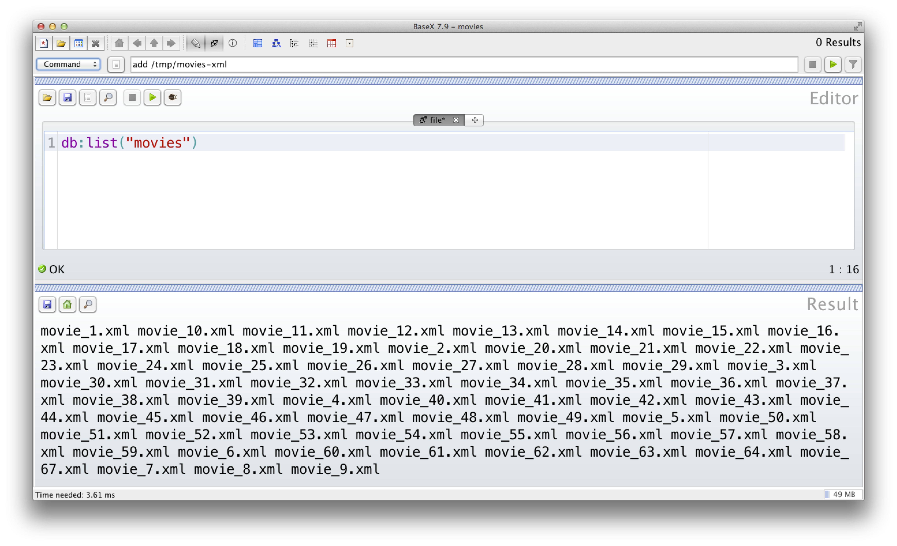
   
        La commande ``db:list('movies')`` après import des documents.
        
Un document peut être supprimé avec la *requête* suivante:

.. code-block:: sql

    db:remove(nombase, nomdoc)

Une base est détruite avec la commande:

.. code-block:: sql

    drop database <nombase>  

Voici pour l'essentiel des commandes utiles. 

Exploration interactive
=======================
   
Nous pouvons maintenant explorer notre collection XML (qui ne contient qu'un seul document) avec l'interface
de BaseX. Les menus ``Views``  et ``Visualization`` proposent d'ajouter/retirer des fenêtres. Testez-les,
et essayez d'arriver à une interface semblable à celle de la figure :ref:`basex-explore`, avec les
quatre fenêtres suivantes:

 * la fenêtre ``Editor``;
 * la fenêtre ``Result``;
 * la fenêtre ``Tree``;
 * la fenêtre ``Folder``.
 
Les deux dernières montrent une vue arborescente de notre document. De plus, en cliquant sur certains nœuds, 
on "zoome" sur les sous-arbres (astuce: le bouton droit permet de "remonter" d'un niveau).

   .. _basex-explore:
   .. figure:: ../figures/basex-explore.png
      :width: 80%
      :align: center
   
      Exploration d'une base avec l'interface de BaseX

Parcourez votre document XML avec les différentes perspectives pour bien comprendre les
deux formes: sérialisée (avec les balises) et arborescente (sous forme d'une hiérarchie de nœuds).

Interrogation, recherche
========================

BaseX s'appuie essentiellement sur XQuery pour l'interrogation, mais dispose également d'un index plein texte
pour des recherches par mot-clé. Nous nous concentrons sur XQuery pour l'instant.

Les plus simples des "requêtes" XQuery constituent   un fragment nommé *XPath*
qui permet d'exprimer des *chemins*. C'est lui
que nous allons regarder en détail.  En supposant que nous avons créé une base *movies* 
et ajouté le document *movies.xml* exporté depuis le Webscope, voici quelques exemples de
chemins.

  * Tous les titres
  
    .. code-block:: xquery
    
        /movie/title
        
  * Tous les acteurs
   
    .. code-block:: xquery
    
       /*//actor
     
  * Les films parus en 2002
   
    .. code-block:: xquery
    
       /movie[year=2002]
        
Intuitivement, cela ressemble à des chemins dans une hiérarchie de répertoires. Nous couvrirons XPath
de manière relativement détaillée.

Autres documents
================

BaseX accepte d'autres documents semi-structurés, et notamment ceux au format JSON. Une collection (base)
ne peut stocker des documents que d'un seul format: la fenêtre *Properties* d'une base
de données nous permet d'indiquer le format choisi. 

.. Note:: BaseX reconnaît les formats CSV, HTML et stocke également des fichiers textes.

Quel que soit le format d'import, un document semi-structuré est "vu" comme un arbre, dont la sérialisation
est codée en XML.

Exercices
=========

.. _Ex-S4-1:
.. admonition:: Exercice `Ex-S4-1`_:  installation et premières manipulations

   Installez BaseX dans votre environnement (à partir de http://basex.org). Allez ensuite dans
   ``basex/bin``  et lancez la commande::
   
     basexgui
    
   Vous devez obtenir le lancement d'une interface graphique comme celle de la figure  :ref:`basexgui`.    
    
   Trouvez la commande *New database* dans le menu, et créez une base en indiquant le répertoire contenant les fichiers
   XML à importer. Par exemple, créez la base ``movies`` en indiquant le répertoire ``movies/movies-xml``
   que vous avez constitué précédemment. La fenêtre devrait ressembler à celle de la figure :ref:`basex-crdb`. 
   
   .. _basex-crdb:
   .. figure:: ../figures/basex-crdb.png
      :width: 60%
      :align: center
   
      Création d'une base et import de documents XML
   
   Vous pouvez consulter la liste des fichiers importés avec la commande:
   
   .. code-block:: sql

       db:list("movies")
     
   Je vous invite à partir de là à commencer à vous familiariser avec l'interface graphique de BaseX. Ajoutez/supprimez
   des fenêtres avec la barre d'outils, consultez l'arborescence d'un document à l'aide des fenêtres montrant 
   des perspectives hiérarchiques, etc. 
   
   Nous verrons bientôt comment *interroger* cette base avec le langage XPath. Vous pouvez dès
   maintenant, dans la fenêtre ``Editor``, entrer la commande suivante:

   .. code-block:: xquery
   
       /movie/title
     
     
.. _Ex-S4-2:
.. admonition:: Exercice `Ex-S4-2`_:  quelques bases XML

   Les données que vous avez dû récupérer par un export de Webscope peuvent
   être chargées dans différentes bases. Quelques suggestions:
   
     - créez une base ``bigmovies`` avec comme seul document le fichier ``movies.xml``
       contenant tous les films;
     - créez une base ``xpath`` (nous l'utiliserons
       dans le cours sur XPath) et chargez le document 
       `Gravity.xml <http://b3d.bdpedia.fr/files/Gravity.xml>`_.
            
     - créez une base ``multidocs`` avec les fichiers  ``movies-refs.xml``  et ``artists.xml``:
       elle pourra nous servir pour les requêtes XQuery avec jointures.
     - Si vous avez des documents bureautiques, créez une base ``bureautique`` et importez-les. 
       Explorez ces documents avec l'interface de BaseX. 

Travaux pratiques XPath
=======================

Le jeu de données a importer dans votre base de données (BaseX) est téléchargeable
ici : `bibliotheque.xml <http://b3d.bdpedia.fr/files/bibliotheque.xml>`_.

Pour l'ensemble des questions ci-dessous, vous devez
produire la requête XPath correspondante.

#. Les auteurs de livres
#. Le premier auteur du premier livre
#. Titres des livres
#. Les codes ISBN de livres
#. Les auteurs de livres
#. Nombre d'auteurs de livres
#. Nombre d'auteurs pour le premier livre
#. Titre des livres écrits en francais 
#. Les auteurs dont les livres ne sont pas en première position 
#. Livres n'ayant qu'un seul auteur
#. Tout élément ``book`` ayant un fils avec un seul auteur
#. Tous les livres avant le deuxième livre
#. Tous les livres après le deuxième livre
#. Tous les auteurs de livres français
#. Les titres de livres écrits en français écrit par "Knab"
#. Nombre de livres
#. Nombre de livres dont le sujet est "databases"
#. Premier et deuxième auteurs du premier livre
#. Titre des livres rédigés par Philippe Rigaux avec au moins un autre auteur
#. Titre des livres dont le titre contient XML et publié chez Eyrolles
#. Auteurs ayant rédigé au moins deux livres.

.. ifconfig:: xpathtp in ('public')

   .. admonition:: Correction

    #. /child::biblio/child::book/child::author
    #. /child::biblio/child::book[position()=1]/child::author[position()=1]
    #. /child::biblio/child::book/child::title/child::text()
    #. /child::biblio/child::book/attribute::ISBN
    #. /biblio/book/author
    #. count(/biblio/book/author)
    #. count(/biblio/book[1]/author)
    #. biblio/book[@lang="fr"]/title
    #. /biblio/book[not(position()=1)]/author
    #. /biblio/book[count(author)=1]
    #. /descendant-or-self::book[count(child::author) = 1]//book[count(author)=1]
    #. /biblio/book[2]/preceding-sibling::*
    #. /biblio/book[2]/following-sibling::*
    #. /biblio/book[@lang="fr"]/author
    #. /biblio/book[@lang="fr"]/author[contains(lastname,"Knab")]/parent::book/title/text()
    #. count(//book)
    #. count(/book[@subject="databases"])
    #. /biblio/book[1]/author[2 or 1]
    #. //book[author[lastname = "Rigaux"][firstname = "Philippe"]][count(author) > 1]/title
    #. //book[contains(title, "XML")][contains(publisher/name, "Eyrolles")]/title
    #.  //author[lastname/text()=following::lastname/text()][firstname/text()=following::firstname/text()]

