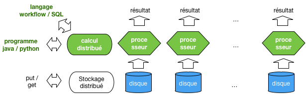
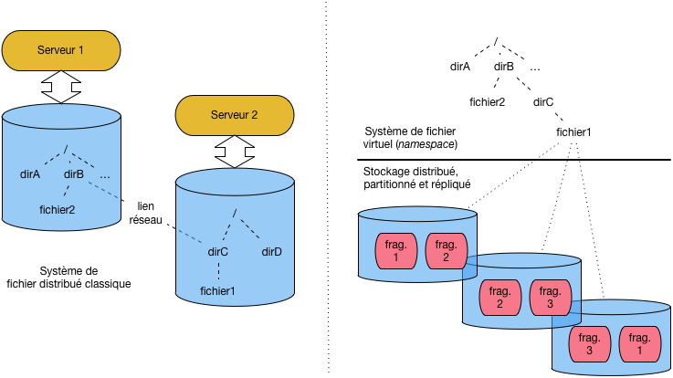
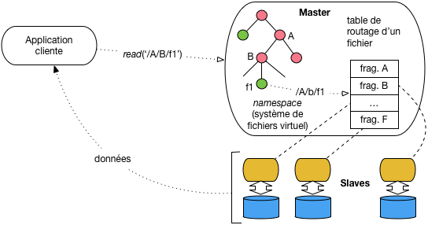
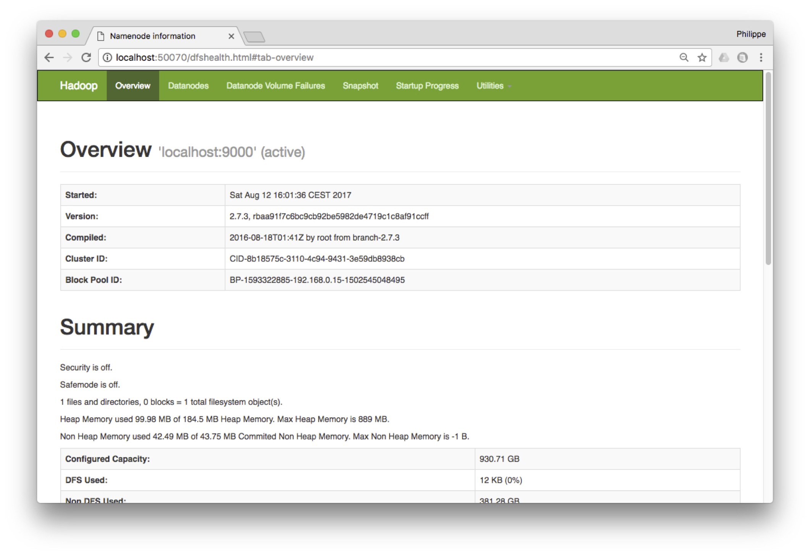

.. _chap-calcdistr:
   
#######################################
Calcul distribué: introduction à Hadoop
#######################################

Nous abordons maintenant le domaine des *traitements analytiques à grande
échelle* qui, contrairement à des fonctions de recherche qui 
s'intéressent à un document précis ou à un petit sous-ensemble d'une
collection, parcourent l'intégralité d'un large ensemble pour en extraire
des informations et construire des modèles statistiques ou analytiques.

La préoccupation essentielle n'est pas ici la performance (de toute façon,
les traitements durent longtemps) mais la garantie de scalabilité 
horizontale qui permet malgré tout
d'obtenir des temps de réponse raisonnables, et *surtout* la garantie de terminaison
en dépit des pannes pouvant affecter le système pendant le traitement.

.. _calculdistr:

   
   Le calcul distribué, compagnon logique du stockage distribué
   
La :numref:`calculdistr` montre, en vert, le positionnement logique du calcul distribué
par rapport aux systèmes de stockage distribué étudiés jusqu'ici. La *répartition des données*
ouvre logiquement la voie à la *distribution des traitements sur les données*. L'un ne va pas 
sans l'autre: il serait peu utile d'appliquer un calcul distribué sur une source de données
centralisée qui constituerait le goulot d'étranglement, et réciproquement.

Ce chapitre va étudier les méthodes qui permettent de distribuer des calculs à très grande échelle
sur des systèmes de stockage partitionnés et distribués. Tous les systèmes vus jusqu'à présent
sont des candidats valables pour alimenter des calculs distribués, mais nous allons regarder
cette fois HDFS, un système de fichiers  étroitement associé à Hadoop.

Pour les calculs eux-mêmes, deux possibilités sont offertes: des opérateurs 
intégrés à un langage de programmation, dont MapReduce est l'exemple de base,
ou des langages de workflow (ou à la SQL) qui permettent des spécifications de plus haut niveau.
Nous étudierons Pig latin, un des premiers représentants du genre.

*Ce chapitre ne considère pas l'algorithmique analytique proprement dite, mais
les opérateurs de manipulation de données qui fournissent l'information à
ces algorithmes.*
En clair, il s'agit de voir comment récupérer des sources de données,
comment les filtrer, les réorganiser, les combiner, les enrichir, le tout en respectant les
deux contraintes fondamentales de la scalabilité: parallélisation et tolérance aux pannes.

.. admonition:: La notion d'opérateur de second ordre

    Les opérateurs décrits ici sont des *opérateurs de second ordre*. Contrairement
    aux opérateurs classiques qui s'appliquent directement à des données, un 
    opérateur de second ordre prend des fonctions en paramètres et applique
    ces fonctions à des données au cours d'un traitement immuable
    (par exemple un parcours séquentiel).
    

Depuis 2004, le modèle phare d'exécution est MapReduce, déjà 
introduit dans le chapitre :ref:`chap-bddoc` dans un contexte centralisé, 
et distribué en Open Source dans le système Hadoop. MapReduce est le premier modèle
à combiner distribution massive et reprise sur panne dans le contexte d'un *cloud* de
serveurs à bas coûts. Ses limites sont cependant évidentes: faible expressivité (très peu
d'opérateurs) et performances médiocres.

Très rapidement, des langages de plus haut niveau (Pig, Hive) ont été proposés, avec pour
objectif notable l'expression d'opérateurs plus puissants (par exemple les jointures).  Ces opérateurs
restent exécutables dans un contexte MapReduce, un peu comme SQL est exécutable dans un 
système basé sur des parcours de fichier.  Enfin, récemment, des systèmes proposant des alternatives plus riches
à Hadoop ont commencé à émerger. La motivation essentielle est de fournir un support
aux algorithmes fonctionnant par *itération*. C'est  le cas d'un grand nombre 
de techniques en fouilles de données qui affinent progressivement un résultat jusqu'à obtenir
une solution optimale. MapReduce est (était) très mal adapté à ce type d'exécution. Les
systèmes comme `Spark <https://spark.apache.org/>`_   ou `Flink <https://spark.apache.org/>`_
constituent de ce point de vue un progrès majeur. 

Ce chapitre suit globalement cette organisation historique, en commençant par
MapReduce, suivi du système HDFS/Hadoop, et finalement d'une présentation du langage Pig.
Les systèmes itératifs feront l'objet des chapitres suivants.

***********************************
S2: Une brève introduction à Hadoop
***********************************

.. admonition:: Supports complémentaires

    * Un fichier de test. `Auteurs/publis <http://b3d.bdpedia.fr/files/author-medium.txt>`_,
    * Programme MapReduce. `Mapper <http://b3d.bdpedia.fr/files/AuthorsMapper.java>`_,
      `Reducer <http://b3d.bdpedia.fr/files/AuthorsReducer.java>`_, et 
      `Job <http://b3d.bdpedia.fr/files/AuthorsJob.java>`_

Cette session propose une introduction à l'environnement historique de programmation 
distribuée à grande échelle, Hadoop.
Pour être tout à fait exact, Hadoop est une implantation en *open source* de
l'architecture présentée par Google au début des années 2000, et comprenant
essentiellement un système de fichiers distribué et tolérant aux pannes, GFS, et
le modèle MapReduce qui s'appuie sur GFS pour effectuer un accès parallélisé à
de très gros volumes de données. Un troisième composant "Google", BigTable (HBase dans
la version Hadoop), propose une organisation plus structurée des données que de simples fichiers.
Il n'est pas présenté ici.

Notre objectif dans cette session est de comprendre HDFS, d'y charger des données, puis
de leur
appliquer un traitement MapReduce. 
Les aspects architecturaux, brievement évoqués, devraient maintenant être clairs
pour vous puisqu'ils s'appuient sur des principes standards déjà exposés.

.. important:: Cette session propose du code MapReduce qui a été testé et devrait 
   fonctionner, **mais** l'expérience montre que la mise en œuvre de Hadoop
   est laborieuse et dépend de paramètres qui changent souvent: sauf si vous
   êtes **très** motivés, il est préférable sans doute de ne pas perdre de temps
   à chercher à reproduire les commandes qui suivent. Concentrez-vous sur les principes.

Systèmes de fichiers distribués
===============================

HDFS est donc la version *open source* du *Google File System*, dont le but est de fournir
un environnement de stockage distribué et tolérant aux pannes pour de très gros fichiers.
HDFS peut être utilisé directement comme service d'accès à ces fichiers, ou 
indirectement par des systèmes de gestion de données (HBase pas exemple) qui
obtiennent ainsi la distribution et la résistance aux pannes sans avoir à les implanter 
directement.

Un système de fichiers comme HDFS est conçu pour la gestion de fichiers
de grande taille (plusieurs dizaines de MOs au minimum), que l'on écrit une fois et qu'on
lit ensuite par des parcours séquentiels. Le contre-exemple est celui d'une collection
de très petits documents souvent modifiés: il vaut mieux dans ce cas utiliser
un système NoSQL documentaire spécialisé.

Pour comprendre cette distinction, étudions les deux scénarii illustrés par
la :numref:`dfs-bigpic`. Sur la partie gauche, nous trouvons un système de fichiers
distribués classique, de type NFS (*Network File System*: consultez la fiche Wikipedia pour
en savoir - un  peu - plus). Dans ce type d'organisation, le serveur 1 dispose d'un
système de fichiers organisé de manière hiérachique, très classiquement. La racine (/) 
donne accès aux répertoires ``dirA`` et ``dirB``, ce dernier contenant un fichier ``fichier2``, 
le tout étant stocké sur le dique local.

.. _dfs-bigpic: 

   
   Deux types de systèmes de fichiers distribués

Imaginons que le serveur 1 souhaite pouvoir accéder au répertoire ``dirC`` et
fichier ``fichier1`` qui se trouvent
sur le serveur 2. Au lieu de se connecter à distance explicitement à chaque fois,
on peut "monter" (*mount*) ``dirC`` dans le système de fichier du serveur 1, sous
la forme d'un répertoire-fils de ``dirB``. Du point de vue de l'utilisateur,
l'accès devient complètement transparent. On peut accéder à ``/dirA/dirB/dirC`` 
comme s'il s'agissait d'un répertoire local. L'appel réseau
qui maintient ``dirC`` dans l'espace de nommage du serveur 1 est complètement
géré par la couche NFS (ou toute autre solution équivalente).

Dans un contexte "Big Data", avec de très gros volumes de données, cette solution
n'est cependant pas satisfaisante. En particulier, ni l'équilibrage (*load balancing*)
ni le principe de localité ne sont  pris en satisfaits. Premièrement, si 10%
des données sont stockées dans le fichier 1 et 90% dans le fichier 2, le serveur 2 devra
subir 90% des accès (en supposant une répartition uniforme des requêtes). Ensuite, un processus s'exécutant
sur le serveur 1 peut être amené à traiter un fichier du serveur 2 sans se rendre compte
qu'il engendre de très gros accès réseaux. 

La partie droite de la  :numref:`dfs-bigpic` montre l'approche GFS/HDFS
qui est totalement dédiée aux très gros fichiers et aux accès distribués. 
La grande différence est que la notion de fichier ne correspond plus
à un stockage physique localisé, mais devient un symbole désignant
un stockage partitionné, distribué et répliqué. Chaque fichier est divisé
en fragments (3 fragments pour le fichier 2 par exemple), de tailles égales,
et ces fragments sont alloués par HDFS aux serveurs du *cluster*. Chaque
fragment est de plus répliqué.

Le système de fichier de vient alors un espace de noms virtuel, partagé
par l'ensemble des nœuds, et géré par un nœud spécial, le maître. On retrouve,
pour la notion classique de fichier, les principes généraux déjà étudié
dans ce cours.
   
Il est facile de voir que les inconvénients précédents (défaut d'équilibrage et de
localité des données) sont évités. Il est également facile de constater que cette
approche n'est valable que pour de très gros fichiers qu'il est possible de partitionner
en fragments de taille significative (quelques dizaines de MOs typiquement).

Architecture HDFS
=================

Voici maintenant un aperçu de l'architecture de GFS (:numref:`gfs`). Le système
fonctionne en mode maître/esclave, le maître (*namenode*)
jouant comme d'habitude le rôle de coordinateur
et les esclaves (*datanode*) assurant le stockage. Le maître maintient (en mémoire RAM) l'image globale
du système de fichiers, sous la forme d'une arborescence de répertoires et
de fichiers. À chaque fichier est associée une table décrivant le partionnement de son
contenu en fragment, et la répartition de ces fragments sur les différents nœuds-esclaves.

.. _gfs: 

   
   Architecture HDFS

Les applications clients doivent  se connecter
au maître auquel elles transmettent leur requête sous la forme d'un
chemin d'accès à un fichier, par exemple, comme illustré sur la figure,
le chemin ``/A/B/f1``. Voici en détail le cheminement de cette requête:

 - Elle est d'abord routée par le client (qui ignore tout de l'organisation
   du stockage) vers le maître.
 - Le maître inspecte sa hiérarchie, et trouve les adresses des fragments
   constituant le fichier.
 - Chaque serveur stockant un fragment est alors mis directement en contact
   avec le client qui peut récupérer tout ou partie du fichier.

En d'autres termes, les échanges avec le maître sont limités
aux méta-données décrivant le fichier et sa répartition, ce qui évite
les inconvénients d'avoir à s'adresser systématiquement à un même nœud
lors de l'initialisation d'une requête. Toutes les autres commandes
de type POSIX (écriture, déplacement, droits d'acc¡es, etc.) suivent
le même processus.

Encore une fois la conception de HDFS est très orientée vers le stockage
de fichiers de très grande taille (des GOs, voire des TOs). Ces fichiers
sont partitionnés en fragments de 64 MOs, ce qui permet de les lire en 
parallèle. La lecture par une seule application cliente, comme illustré sur
la :numref:`gfs`, constituerait un goulot d'étranglement, mais cette
architecture prend tout son sens dans le cas de traitement MapReduce,
le contenu d'un fichier pouvant alors être lu en parallèle par tous
les serveurs d'une grappe.

Utiliser HDFS pour de très nombreux petits fichiers serait un contresens:
la mémoire RAM du maître pourrait être insuffisante pour
stocker l'ensemble du *namespace*, et on perdrait toute possibilité
de parallélisation.

HDFS fournit un mécanisme natif de tolérance aux pannes qui le rend
avantageux pour des système de gestion de données qui veulent
déléguer la distribution et la fiabilité du stockage. Ce mécanisme
s'appuie tout d'abord sur la réplication d'un même fragment (3 exemplaires
par défaut) sur différents serveurs.

Le maître assure la surveillance des esclaves par des communications
(*heartbeats*) fréquents (toutes les secondes) et réorganise la communication
entre une application cliente et le fragment qu'elle est en train de lire en 
cas de défaillance du serveur.  Ce remplacement est utile par exemple, comme nous l'avons vu,
pour un traitement MapReduce afin d'effectuer à nouveau un calcul sur l'un
des fragments.

Enfin le maître lui-même est un des points sensibles du système: en
cas de panne plus rien ne marcherait et des données seraient perdues.
On peut mettre en place un "maître fantôme" prêt à prendre le relais,
et une journalisation de toutes les écritures pour pouvoir effectuer
une reprise sur panne.

Mise en œuvre avec Hadoop
=========================

Voici maintenant une présentation concise de la mise en œuvre d'un 
système HDFS L'environnement est assez lourd à mettre en place et à configurer 
donc nous allons aller au plus simple dans ce qui suit.

Des images Docker existent pour Hadoop mais elles ne me semblent pas plus
simples à gérer qu'une installation directe, avec les options simplifiées
proposées par Hadoop. 

.. important:: Encore une fois, l'expérience montre que la lourdeur de Hadoop s'accomode mal d'un déploiement
   virtuel sur une seule petite machine. L'importance du sujet ne justifie pas que vous y passiez
   des jours en vous arrachant les cheveux. Il suffit sans doute de lire
   une fois cette session pour comprendre l'essentiel.
   
   Si vous tentez quand même la mise en pratique, sachez que
   les commandes qui suivent supposent un environnement de type Unix
   (MacOS X en fait partie). Pour Windows, je ne peux que vous renvoyer au site
   de Hadoop, en espérant pour vous que ce ne soit pas trop compliqué.

   Autre avertissement: Hadoop, c'est du Java, donc il faut au minimum savoir compiler
   et exécuter un programme java, et disposer d'une mémoire RAM volumineuse.

Si l'avertissement qui précède vous effraie (c'est fait pour), 
il vaut sans doute mieux se contenter d'une simple lecture 
de cette partie.
 
Installation et configuration
-----------------------------

Je vous invite donc 
à récupérer la dernière version (binaire, inutile de prendre les sources)
sur le site http://hadoop.apache.org. C'est un fichier
dont le nom ressemble à ``hadoop-2.7.3.tar.gz``. Décompressez-le quelque part, par
exemple dans ``\tmp``. les commandes devraient ressembler à (en utilisant bien sûr le nom
du fichier récupéré):

.. code-block:: bash

   mv hadoop-2.7.3.tar.gz /tmp
   cd /tmp
   tar xvfz hadoop-2.7.3.tar.gz

Bien, vous devez alors définir une variable d'environnement ``HADOOP_HOME`` qui
indique le répertoire d'installation de Hadoop.

.. code-block:: bash

     export HADOOP_HOME=/tmp/hadoop-2.7.3

Les répertoires ``bin`` et ``sbin`` de Hadoop contiennent des exécutables. Pour les lancer sans avoir
à se placer dans l'un de ces répertoires, ajoutez-les dans votre variable ``PATH``.

.. code-block:: bash

    export PATH=$PATH:$HADOOP_HOME/bin:$HADOOP_HOME/sbin

Bien, vous devriez alors pouvoir exécuter un programme Hadoop. Par exemple:

.. code-block:: bash

   hadoop version
   Hadoop 2.7.3

Pour commencer
il faut configurer Hadoop pour qu'il s'exécute en mode dit "pseudo-distribué",
ce qui évite la configuration complexe d'un véritable *cluster*. Vous devez
éditer le fichier ``$HADOOP_HOME/etc/hadoop/core-site.xml`` 
et indiquer le contenu suivant :

.. code-block:: xml

   <configuration>
     <property>
       <name>fs.default.name</name>
       <value>hdfs://localhost:9000</value>
     </property>     
    </configuration>

Cela indique à Hadoop que le nœud maître  HDFS  (le "NameNode" 
dans la terminologie Hadoop) est en écoute sur le port  9000. 

Pour limiter la réplication, modifiez également le fichier ``$HADOOP_HOME/etc/hadoop/hdfs-site.xml``.
Son contenu doit être le suivant:

.. code-block:: xml

    <configuration>
        <property>
            <name>dfs.replication</name>
            <value>1</value>
        </property>
    </configuration>

Premières manipulations
-----------------------

Ouf, la configuration minimale est faite, 
nous sommes prêts à effectuer nos premières manipulations. Tout 
d'abord nous allons formatter l'espace dédié au stockage des données.

.. code-block:: bash

     hdfs namenode -format

Une fois ce répertoire formatté nous lançons le maître HDFS (le *namenode*).
Ce maître gère la hiérarchie (virtuelle) des répertoires HDFS,
et communique avec les *datanodes*, les "esclaves" dans la terminologie
employée jusqu'ici, qui sont chargés de gérer les fichiers (ou fragments de fichiers)
sur leurs serveurs respectifs. Dans notre cas, la configuration ci-dessus
va lancer un *namenode* et deux *datanodes*, grâce à la commande suivante:

.. code-block:: bash

    start-dfs.sh &

.. note:: Les nœuds communiquent entre eux par SSH, et il faut éviter que le mot
   de passe soit demandé à chaque fois. Voici les commandes pour permettre
   une connection SSH sans mot de passe.

   .. code-block:: bash
   
       ssh-keygen -t rsa -P ""
       cat $HOME/.ssh/id_rsa.pub >> $HOME/.ssh/authorized_keys

Vous devriez obtenir les messages suivants:

.. code-block:: bash

     starting namenode, logging to (...)
     localhost: starting datanode, logging to (...)
     localhost: starting secondarynamenode, logging to (...)

Le second *namenode* est un miroir du premier. À ce stade, vous disposez d'un serveur
HDFS en ordre de marche. Vous pouvez consulter son statut et toutes sortes d'informations
grâce au serveur web accessible à http://localhost:50070. La figure :numref:`hdfs-ui` montre
l'interface

.. _hdfs-ui:

   
        Perspective générale sur les systèmes distribués dans un *cloud*

Bien entendu, ce système de fichier est vide. Vous pouvez y charger un premier fichier,
à récupérer sur le site à l'adresse suivante: `http://b3d.bdpedia.fr/files/author-medium.txt <http://b3d.bdpedia.fr/files/author-medium.txt>`_.
Il s'agit d'une liste de publications sur laquelle nous allons faire tourner nos exemples.
 
Pour interagir avec le serveur de fichier HDFS, on utilise la commande ``hadoop fs <commande>`` 
où commande est la commande à effectuer. La commande suivante crée un répertoire ``/dblp``
dans HDFS.

.. code-block:: bash
    
      hadoop fs -mkdir /dblp
      
Puis on copie le fichier du système de fichiers local vers HDFS.

.. code-block:: bash
    
      hadoop fs -put author-medium.txt /dblp/author-medium.txt

Finalement, on peut constater qu'il est bien là.

.. code-block:: bash
    
      hadoop fs -ls /dblp
      
.. note:: Vous trouverez facilement sur le web des commandes supplémentaires, par
   exemple ici: https://dzone.com/articles/top-10-hadoop-shell-commands
   
   Pour inspecter le système de fichiers avec l'interface Web,
   vous pouvez aussi accéder à http://localhost:50070/explorer.html#/

Que sommes-nous en train de faire? Nous copions un fichier depuis notre machine locale
vers un système distribué sur plusieurs serveurs. Si le fichier est assez gros, il
est découpé en fragments et réparti sur différents serveurs. Le découpage
et la recomposition sont transparents et entièrement gérés par Hadoop.

Nous avons donc réparti nos données (si du moins elles avaient une taille respectable)
dans le *cluster* HDFS. Nous sommes donc en mesure maintenant d'effectuer
un calcul réparti avec MapReduce.

MapReduce, le calcul distribué avec Hadoop
==========================================

L'exemple que nous allons maintenant étudier est un processus MapReduce
qui accède au fichier HDFS et effectue un calcul assez trivial. Ce sera à vous d'aller 
plus loin ensuite.

Installation et configuration
-----------------------------

Depuis la version 2 de Hadoop, les traitements sont gérés par un gestionnaire
de ressources distribuées nommé Yarn. Il fonctionne en mode maître/esclaves,
le maître étant nommé ``Resourcemanager`` et les esclaves ``NodeManager``.

Un peu de configuration préalable s'impose avant de lancer notre *cluster* Yarn.
Editez tout d'abord le fichier ``$HADOOP_HOME/etc/hadoop/mapred-site.xml``
avec le contenu suivant:

.. code-block:: xml

    <configuration>
        <property>
           <name>mapreduce.framework.name</name>
           <value>yarn</value>
        </property>
    </configuration>

Ainsi que le fichier ``$HADOOP_HOME/etc/hadoop/yarn-site.xml``:

.. code-block:: xml

    <configuration>
        <property>
           <name>yarn.nodemanager.aux-services</name>
           <value>mapreduce_shuffle</value>
        </property>
     </configuration>
    
Vous pouvez alors lancer un *cluster* Yarn (en plus du *cluster* HDFS).

.. code-block:: bash

    start-yarn.sh

Yarn propose une interface Web à l'adresse http://localhost:8088/cluster: Elle
montre les applications en cours ou déjà exécutées.

Notre programme MapReduce
-------------------------

.. important:: Toutes nos compilations java font se fait par l'intermédiaire
   du script ``hadoop``. Il suffit de définir la variable suivante au préalable:

   .. code-block:: bash
   
       export HADOOP_CLASSPATH=${JAVA_HOME}/lib/tools.jar

Le
format du fichier que nous avons placé dans HDFS est très simple: il contient des noms d'auteur et des titres
de publications, séparés par des tabulations. 
Nous allons compter le nombre de publications de chaque auteur dans notre fichier. 

Notre première classe Java contient le code de la fonction de Map.

.. code-block:: java

    /**
     * Les imports indispensables
     */

    import java.io.IOException;
    import java.util.Scanner;
    import org.apache.hadoop.io.IntWritable;
    import org.apache.hadoop.io.Text;
    import org.apache.hadoop.mapreduce.Mapper;

    /**
     * Exemple d'une fonction de map: on prend un fichier texte contenant
     * des auteurs et on extrait le nom
     */
    public class AuthorsMapper extends
      Mapper<Object, Text, Text, IntWritable> {

      private final static IntWritable one = new IntWritable(1);
      private Text author = new Text();

       /* la fonction de Map */
        @Override
        public void map(Object key, Text value, Context context)
           throws IOException, InterruptedException {

          /* Utilitaire java pour scanner une ligne  */
          Scanner line = new Scanner(value.toString());
          line.useDelimiter("\t");
          author.set(line.next());
          context.write(author, one);
        }
      }

Hadoop fournit deux classes abstraites pour implanter des fonctions
de Map et de Reduce: ``Mapper`` et ``Reducer``. Il faut étendre
ces classes et implanter deux méthodes, respectivement ``map()`` et ``reduce()``. 

L'exemple ci-dessus montre l'implantation de la fonction de map. Les paramètres
de la classe abstraite décrivent respectivement les types des paires
clé/valeur en entrée et en sortie. Ces types sont fournis pas Hadoop
qui doit savoir les sérialiser pendant les calculs pour les placer sur disque.
Finalement, la classe ``Context`` est utilise pour pouvoir interagir avec l'environnement
d'exécution.

Notre fonction de Map prend donc en entrée une paire clé/valeur
constituée du numéro de ligne du fichier en entrée (automatiquement engendrée par le système)
et de la ligne elle-même. Notre code se contente d'extraire la partie de la ligne
qui précède la première tabulation, en considérant que c'est le nom de l'auteur. On
produit dont une paire intermédiaire ``(auteur, 1)``.

La fonction de Reduce est encore plus simple. On obtient en entrée
le nom de l'auteur et une liste de 1, aussi longue qu'on a trouvé d'auteurs
dans les fichiers traités. On fait la somme de ces 1.

.. code-block:: java

    import java.io.IOException;
    import org.apache.hadoop.io.IntWritable;
    import org.apache.hadoop.io.Text;
    import org.apache.hadoop.mapreduce.Reducer;

    /**
     * La fonction de Reduce: obtient des paires  (auteur, <publications>)
     * et effectue le compte des publications
     */
    public  class AuthorsReducer extends
          Reducer<Text, IntWritable, Text, IntWritable> {
       private IntWritable result = new IntWritable();

       @Override
       public void reduce(Text key, Iterable<IntWritable> values, 
            Context context)
        throws IOException, InterruptedException {
      
        int count = 0;
        for (IntWritable val : values) {
          count += val.get();
        }
        result.set(count);
        context.write(key, result);
      }
    }

Nous pouvons maintenant soumettre un "job" avec le code qui suit. Les
commentaires indiquent les principales phases. Notez qu'on lui indique
les classes implantant les fonctions de Map et de Reduce, définies auparavant.

.. code-block:: java

    /**
     * Programme de soumision d'un traitement MapReduce
     */

    import org.apache.hadoop.conf.*;
    import org.apache.hadoop.util.*;
    import org.apache.hadoop.fs.Path;
    import org.apache.hadoop.io.IntWritable;
    import org.apache.hadoop.io.Text;
    import org.apache.hadoop.mapreduce.Job;
    import org.apache.hadoop.mapreduce.lib.input.FileInputFormat;
    import org.apache.hadoop.mapreduce.lib.output.FileOutputFormat;

    public class AuthorsJob {

    public static void main(String[] args) throws Exception {
 
     /* Il nous faut le chemin d'acces au fichier a traiter
             et le chemin d'acces au resultat du reduce */

      if (args.length != 2) {
        System.err.println("Usage: AuthorsJob <in> <out>");
        System.exit(2);
      }

     /* Definition du job */
     Job job = Job.getInstance(new Configuration());

     /* Definition du Mapper et du Reducer */
     job.setMapperClass(AuthorsMapper.class);
     job.setReducerClass(AuthorsReducer.class);

     /* Definition du type du resultat  */
     job.setOutputKeyClass(Text.class);
     job.setOutputValueClass(IntWritable.class);

     /* On indique l'entree et la sortie */
     FileInputFormat.addInputPath(job, new Path(args[0]));
     FileOutputFormat.setOutputPath(job, new Path(args[1]));

     /* Soumission */
     job.setJarByClass(AuthorsJob.class);
     job.submit();
    }
  }

Un des rôles importants du Job est de définir la source en entrée pour les
données (ici un fichier HDFS) et le répertoire HDFS en sortie, dans lequel les
*reducers* vont écrire le résultat. 

Compilation, exécution
----------------------

Il reste à compiler et à exécuter ce traitement. La commande de compilation
est la suivante.

.. code-block:: bash

     hadoop com.sun.tools.javac.Main AuthorsMapper.java AuthorsReducer.java AuthorsJob.java

Les fichiers compilés doivent ensuite être placés dans une archive java (jar)
qui sera transmise à tous les serveurs avant l'exécution distribuée. Ici, on 
crée une archive ``authors.jar``.

.. code-block:: bash

     jar cf authors.jar AuthorsMapper.class AuthorsReducer.class AuthorsJob.class

Et maintenant, on soumet le traitement au *cluster* Yarn avec la commande suivante:

.. code-block:: bash
      
     hadoop jar authors.jar AuthorsJob /dblp/author-medium.txt /output
      
On indique donc sur la ligne de commande le ``Job`` à exécuter, le fichier en entrée et le répertoire
des fichiers de résultat. Dans notre cas, il y aura un seul *reducer*, et donc un seul
fichier nommé ``part-r-00000`` qui sera donc placé dans ``/output`` dans HDFS.

.. important:: Le répertoire de sortie ne doit pas exister avant l'exécution. Pensez
   à le supprimer si vous exécutez le même job plusieurs fois de suite.
   
   .. code-block:: bash
    
        hadoop fs -rm -R /output
   
Une fois le job exécuté, on peut copier ce fichier de HDFS vers la machine locale
avec la commande:

.. code-block:: bash

     hadoop fs -copyToLocal /output/part-r-00000 resultat

Et voilà! Vous avez une idée complète de l'exécution d'un traitement MapReduce. Le
résultat devrait ressembler à:

.. code-block:: text

    (...)
    Dominique Decouchant    1                                                                    
    E. C. Chow      1                                                                            
    E. Harold Williams      1                                                                    
    Edward Omiecinski       1                                                                    
    Eric N. Hanson  1                                                                            
    Eugene J. Shekita       1                                                                    
    Gail E. Kaiser  1                                                                            
    Guido Moerkotte 1                                                                            
    Hanan Samet     2                                                                            
    Hector Garcia-Molina    2                                                                    
    Injun Choi      1 
    (...)

Notez que les auteurs sont triés par ordre alphanumérique, ce qui est un effet
indirect de la phase de *shuffle* qui réorganise toutes les paires intermédiaires.

En inspectant l'interface http://localhost:8088/cluster vous verrez les statistiques sur
les *jobs* exécutés.

Quiz
====

.. eqt:: gfs-1

    Quelle affirmation parmi les suivantes est vraie pour GFS?

    A) :eqt:`I` L'arborescence des répertoires et des fichiers correspond à
       la répartition dans le système distribué
    #) :eqt:`I` Chaque fichier est découpé en *n* fragments, où *n* est le nombre de serveurs
    #) :eqt:`C` Chaque fichier est découpé en fragments de taille fixe, et chacun
       est répliqué sur 3 serveurs
    #) :eqt:`I` Un fichier est stocké sur le serveur qui correspond à son répertoire dans
       l'arborescence

.. eqt:: gfs-2

    Commment est constituée l'arborescence des fichiers?

    A) :eqt:`I` La racine est au niveau du maitre, et chaque fils de la racine 
       est la racine du serveur de fichier local d'un des serveurs participants
    #) :eqt:`C` L'arboresence est totalement virtuelle et gérée par le maître
    #) :eqt:`I` L'arborescence des répertoires est gérée par le maître, les fichiers
       sont ceux des serveurs et sont liés à un répertoire.

.. eqt:: gfs-3

    Pour quelle utilisation le système GFS est-il le plus adapté

    A) :eqt:`I` Pour une application client qui peut lire tous les fragments en parallèle,
       comme expliqué précédemment
    #) :eqt:`C` Pour un traitement distribué de type MapReduce
    #) :eqt:`I` Pour une application temps-réel qui va pouvoir chercher un document dans un
       seul fragment.

*********
Exercices
*********

Reportez-vous également au chapitre  :ref:`chap-pigtp` pour un ensemble d'exercices
à faire sur machine.

.. _Ex-CalcDist-1: 
.. admonition:: Exercice  `Ex-CalcDist-1`_: MapReduce en distribué avec MongoDB

   Vous devez avoir implanté un compteur de mots avec MongoDB dans la chapitre 
   :ref:`chap-bddoc`. Vous devriez également avoir engendré une collection volumineuse
   et distribuée grâce au générateur de données ipsum (cf. chapitre :ref:`chap-sharding`). Il
   ne reste plus qu'à faire l'essai: lancer, en vous connectant au routeur ``mongos``, le
   calcul MapReduce dans MongoDB. Ce calculer devrait insérer le résultat dans une collection 
   partitionnée présente sur les différents serveurs. À vous de jouer.

.. _Ex-CalcDist-2: 
.. admonition:: Exercice `Ex-CalcDist-2`_: un ``grep``, en MapReduce

   On veut scanner des millards de fichiers et afficher tous ceux qui contiennent
   une chaîne de caractères *c*. Donnez la solution en MapReduce, en utilisant
   le formalisme de votre choix (de préférence un pseudo-code un peu structuré quand même).
             
   .. ifconfig:: mapreduce in ('public')

      .. admonition:: Correction

         Pas bien compliqué. Map: on charge les fichiers un par un (ou ligne par ligne s'ils sont
         vraiment très gros), on cherche *c* et si on la trouve on émet le nom
         du fichier et un indicateur quelconque. Soit, en code:

         .. code-block:: javascript

            // Le pattern est supposé connu dans le contexte d'exécution
            function MapGrep (fichier) {
              if (contains(fichier, pattern) {
                   emit(fichier.nom, 1);
            }

         Reduce: on émet le nom
         du fichier, éventellement avec le nombre d'occurrences trouvées de *c*.
         Par exemple:
         
         .. code-block:: javascript

            function ReduceGrep (nomFichier, [nb]) {
              return (nomFichier, sum(nb));
            }
         
      

.. _Ex-CalcDist-3: 
.. admonition:: Exercice `Ex-CalcDist-3`_: un ``rollup``, en MapReduce
   
   Une grande surface enregistre tous ses tickets de caisse, indiquant 
   les produits vendus, le prix et la date, ainsi que le client
   si ce dernier a une carte de fidélité.
   
   Les produits sont classés selon une taxonomie comme illustré sur la  :numref:`taxonomie`,
   avec des niveaux de précision.
   Pour chaque produit on sait à quelle catégorie précise de N1 il appartient (par exemple, ``chaussure``);
   pour chaque catégorie on connaît son parent.
   
   .. _taxonomie: 
   .. figure:: ../figures/taxonomie.png
      :width: 60%
      :align: center
   
      Les produits et leur classement.
      
   Supposons que la collection ``Tickets`` contienne
   des documents de la forme (idTicket, idClient, idProduit, catégorie, date, prix).
   Comment obtenir en MapReduce le total des ventes à une date *d*, pour le niveau N2?   
   On fait donc une agrégation de ``Tickets`` au niveau supérieur de la 
   taxonomie.

   .. ifconfig:: mapreduce in ('public')

      .. admonition:: Correction

         Il nous faut donc une fonction *parent(n)* qui renvoie le parent d'un nœud
         *n* dans la taxonomie. On pourrait généraliser avec une fonction *ancêtre (n, niveau)*
         qui renvoie l'ancêtre à un niveau donné.
         
         Cela acquis, il suffit d'appliquer la fonction *parent(n)* à chaque ticket
         pour pouvoir faire le regroupement voulu. La clé de regroupement est une
         paire constituée d'une date et du parent. Soit:

         .. code-block:: javascript

            function MapRollup (ticket) {
                   emit({ticket.date, parent(ticket.categorie)}, ticket.prix);
            }

         Reduce: direct.
         
         .. code-block:: javascript
         
            function ReduceRollup ({date, categ}, [prix]) {
              return ({date, categ}, sum(prix));
            }

.. _Ex-CalcDist-4: 
.. admonition:: Exercice `Ex-CalcDist-4`_: MapReduce, calcul distribué pour les nuls
   
   MapReduce est souvent une solution brutale et inefficace (mais facile à implanter) pour
   des problèmes qui ont des solutions bien plus élégantes. 
   
   Par exemple: vous disposez d'une collection distribuée de très grande taille, disons
   des utilisateurs. Voulez calculer la valeur médiane d'une variable, l'âge, ou
   le solde du compte, ou n'importe quoi.
   
     - Quelle est la solution MapReduce?
     - Cherchez une solution qui implique beaucoup moins de transfert de données et de calcul. 
       Regardez par exemple les suggestions proposées ici:
       https://www.quora.com/What-is-the-distributed-algorithm-to-determine-the-median-of-arrays-of-integers-located-on-different-computers

.. _Ex-CalcDist-5:
.. admonition:: Exercice `Ex-CalcDist-5`_:  algèbre linéaire distribuée

    Nous disposons le calcul d'algèbre linéaire du chapitre `chap-mapreduce`_. On a donc
    une matrice *M* de dimension :math:`N \times N`
    représentant les liens entres les :math:`N`  pages du Web, chaque lien étant
    qualifié par un facteur d'importance (ou "poids"). La matrice est représentée par une
    collection math:`C`  dans laquelle chaque document est de la forme 
    {"id": \&23, "lig": *i*, "col": *j*, "poids": :math:`m_{ij}`}, et
    représente un lien entre la page :math:`P_i` et la page :math:`P_j` de poids :math:`m_{ij}`

    Vous avez déjà vu le calcul de la norme des lignes de la matrice, et celui du produit
    de la matrice par un vecteur :math:`V`. Prenons en compte maintenant la taille et la distribution.
 

    **Questions**

       
      - On estime qu'il y a environ :math:`N=10^{10}` pages sur le Web, avec 15 liens par
        page en moyenne. Quelle est la taille de la collection :math:`C`, en TO,  en supposant que chaque document
        a une taille de 16 octets
      - Nos serveurs ont 2 disques de 1 TO chacun et chaque document est répliqué  2 fois (donc trois versions en tout).
        Combien affectez-vous de serveurs au système de stokage?
      - Maintenant, on suppose que :math:`V` ne tient plus dans la mémoire RAM d'une seule machine. Proposez
        une méthode de partitionnement de la collection :math:`C` et de :math:`V` qui permette d'effectuer 
        le calcul distribué de :math:`M \times V` avec MapReduce sans jamais avoir à lire
        le vecteur sur le disque. 
             
        Donnez le critère de partitionnement et la technique (par intervalle ou par hachage).
        
      - Supposons qu'on puisse stocker *au plus* deux (2) coordonnées d'un vecteur  
        dans la mémoire d'un serveur. Inspirez-vous de la :numref:`mr-execution-ex`
        pour montrer le déroulement du traitement distribué précédent en choisissant le nombre minimal de serveurs
        permettant de conserver le vecteur en mémoire RAM. 
        
        Pour illustrer le calcul, prenez la matrice :math:`4\times4` ci-dessous, et le vecteur :math:`V = [4,3,2,1]`.

        .. math::

           M= \left[ {\begin{array}{cccc}
            1 & 2  & 3 & 4 \\
            7 & 6 & 5 & 4 \\
            6 & 7  & 8 & 9 \\
             3 & 3  & 3 & 3 \\
            \end{array} } \right] 

       - Expliquez pour finir comment calculer  la similarité cosinus
         entre :math:`V` et les lignes :math:`L_i` de la matrice.

    .. ifconfig:: mapreduce in ('public')

        .. admonition:: Correction
        
          Il y a donc :math:`N=150 \times 10^{9}` liens à placer dans la matrice, chaque lien étant
          représenté par un document de 16 octets. Soit  :math:`N=2400 \times 10^{9}` octets,
          ou 2,4 TO.

          Avec trois copies de chaque lien, on arrive à 7,2 TO. Il faut donc au moins 4 serveurs
          pour pouvoir stocker la matrice (répliquée) sur disque.
          
          Le vecteur :math:`V` ne tient plus en mémoire RAM pour une seule machine. Il faut
          donc le découper en :math:`f` fragments de manière à ce que chaque fragment contenant
          :math:`\frac{N}{f}` coordonnées tienne 
          en RAM (on suppose qu'on a assez de machines, ce qui semble raisonnable). On a donc
          les fragments :math:`V_1[0, \frac{N}{f}[`, :math:`V_2[\frac{N}{f}, 2 \times \frac{N}{f}[`, etc.
          
          Chaque fonction de MAP accède à l'un des fragments  :math:`V_i[(i-1) \times \frac{N}{f}, i \times \frac{N}{f}]`
          du vecteur. Cette fonction peut donc se contenter
          d'accéder à la partie de la matrice qui doit être combinée à ce fragment: il s'agit
          évidemment des colonnes :math:`[(i-1) \times \frac{N}{f}, i \times \frac{N}{f}[`. On va donc
          partitionner la matrice en :math:`f` fragments, *verticalement*.
          
          
          .. _partition-matrice:
          .. figure:: ../figures/partition-matrice.png       
            :width: 50%
            :align: center
   
            Partition verticale de la matrice
          
          La :numref:`partition-matrice` montre le partitionnement du vecteur et celui de la matrice.
          Le calcul MapReduce est alors *exactement* le même que celui déjà vu pour un calcul dans
          le cas où le vecteur tient en mémoire. La seule différence est qu'il s'applique 
          aux fragments à apparier de la matrice et du vecteur.
          
          La :numref:`mr-execution-matrice` illustre le calcul distribué avec un partitionnement minimal 
          en deux fragments. Pour simplifier un peu la figure, on
          montre le calcul au niveau des lignes et pas des cellules élémentaires.
          Un premier serveur multiplie les deux premières colonnes de la matrice
          avec les deux premières coordonnées du vecteur. Le second serveur effectue le calcul complémentaire.
                    
          .. _mr-execution-matrice:
          .. figure:: ../figures/mr-execution-matrice.png       
            :width: 80%
            :align: center
   
            Illustration du calcul distribué
          
          On a utilisé deux *reducers*, avec une distribution (*shuffle*) qui envoie tous
          les résultats intermédiaires des lignes 1 et 3 vers le premier *reducer*, et ceux
          des lignes 2 et 4 vers le second.
          
          Pour finir, le calcul de la similarité cosinus est obtenu en combinant un premier calcul
          des normes des vecteurs, suivi du produit avec le vecteur du document-cible.

