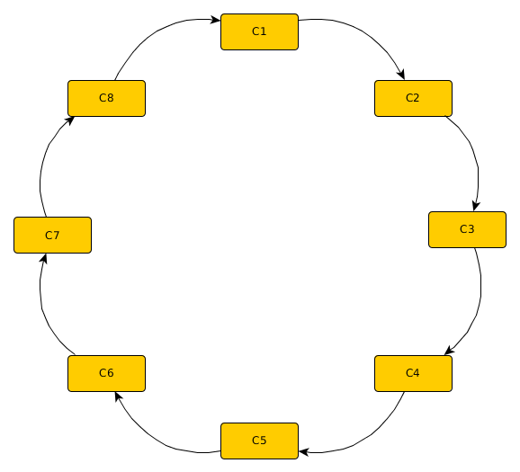
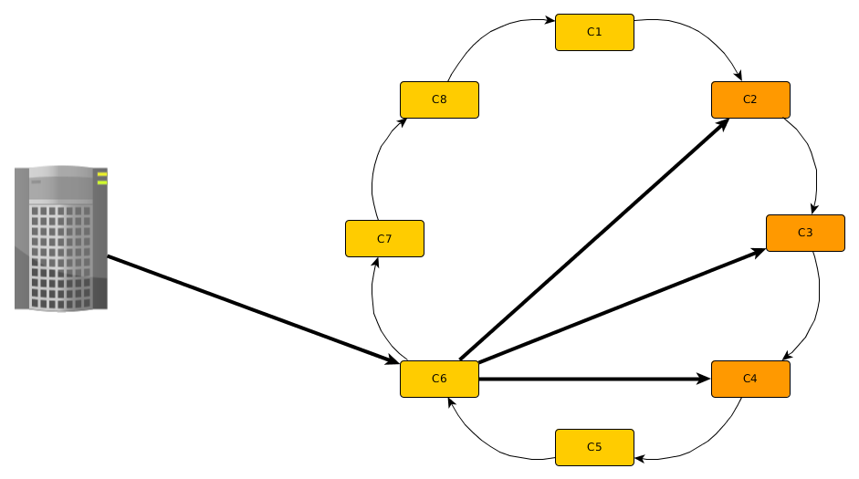
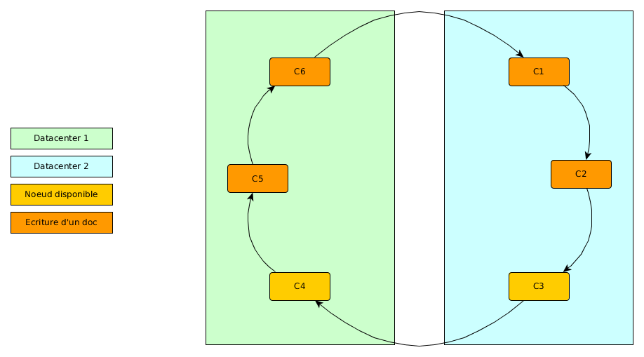

.. _chap-cassandra:

****************************************
S3: Création et interrogation d'une base
****************************************

*******************************
S4: Cassandra en mode distribué
*******************************

Nous passons maintenant à une présentation de l'architecture distribuée de Cassandra. Elle repose sur la
mise en pratique de concepts déjà présentés dans ce cours, et notamment sur le partitionnement par
hachage.

Le Hash-Ring
============

L'architecture des nœuds avec Cassandra se fait au travers ce que qui est communément appelé un *Hash Ring*. Chaque nœud du 
cluster est disposé en file, dans un *anneau* directionnel. Lorsque l'on ajoute un nouveau nœud dans le cluster, ce dernier 
vient naturellement s'ajouter à l'annneau. C'est notamment à partir de cette caractéristique qu'une phrase est souvent reprise 
dans la littérature lorsqu'il s'agit de faire de la réplication avec Cassandra : *Just add a node !* Rien de nouveau ici:
c'est l'architecture présentée initialement par le système Dynamo (Amazon), et s'appuyant sur le *hachage cohérent*
(*consistent hashing*) que nous avons exposé dans le chapitre :ref:`chap-sharding`.

Chaque nœud est reponsable d'un intervalle de valeurs de hachage sur l'anneau. De plus,
le choix d'un nœud pour l'écriture dans le Hash Ring se fait grâce à des *partitioners* qui proposent des méthodes 
de hashage différentes, permettant une répartition uniforme des ressources dans le cluster, et évider ainsi 
l'apparition de hotspots. Nous n'irons pas plus loin dans ces explications, car elles traitent du partitionnement, 
et notre analyse va se concentrer sur la réplication.

	Représentation d'un cluster Cassandra avec le Hash Ring

Créons maintenant un cluster Cassandra, avec 5 nœuds. Pour cela, entrez les commandes suivantes dans motre terminal Cassandra.

.. code-block:: bash

	$  docker run -d -e "CASSANDRA_TOKEN=1" --name cassandra-1 spotify/cassandra:cluster
	$  docker inspect -f '{{.NetworkSettings.IPAddress}}' cassandra-1 	# devrait renvoyer une IP du type 172.17.0.X
	$  docker run -d -e "CASSANDRA_TOKEN=10" -e "CASSANDRA_SEEDS=172.17.0.X" --name cassandra-2 spotify/cassandra:cluster
	$  docker run -d -e "CASSANDRA_TOKEN=100" -e "CASSANDRA_SEEDS=172.17.0.X" --name cassandra-3 spotify/cassandra:cluster
	$  docker run -d -e "CASSANDRA_TOKEN=1000" -e "CASSANDRA_SEEDS=172.17.0.X" --name cassandra-4 spotify/cassandra:cluster
	$  docker run -d -e "CASSANDRA_TOKEN=10000" -e "CASSANDRA_SEEDS=172.17.0.X" --name cassandra-5 spotify/cassandra:cluster

Nous venons de créer un cluster de 5 nœuds Cassandra, qui tournent tous en tâche de fond grâce à Docker. 
Insérons maintenant des données.

.. code-block:: bash
	
	$ docker exec -it cassandra-1 /bin/bash
	[docker]$ cqlsh 172.17.0.X
	cqlsh > CREATE keyspace repli 
              with replication = {'class':'SimpleStrategy', 'replication_factor':3};
	cqlsh > USE repli;
	cqlsh:repli > CREATE TABLE data (id int, value text, PRIMARY KEY (id));
	cqlsh:repli > INSERT INTO data (id, value) VALUES (10, 'Premier document');

Nous venons de créer un *keyspace*, qui va répliquer les données sur 3 nœuds. La *column family* 
*data* va utiliser la clé primaire 
*id* et la fonction de hashage du *partitioner* pour stocker le document dans l'un 
des 5 nœuds, puis répliquer dans les 2 nœuds suivants  sur l'anneau.

Vérifions que le cluster est bien composé de 5 nœuds, et regardons comment chaque nœud a été réparti sur l'anneau
On s'attend à ce que les nœuds soient placés par ordre croissant de leur identifiant.

.. code-block:: bash
	
	$ docker exec -it cassandra-1 /bin/bash
	$ [docker]$ nodetool ring

Adressage des requêtes par Cassandra
====================================

Un cluster Cassandra a la particularité de fonctionner en mode multi-nœuds. La notion de nœud maître et nœud esclave n'existe 
donc pas avec Cassandra. Chaque nœud du cluster a le même rôle et la même importance, et jouit donc de la capacité de lecture 
et d'écriture dans le cluster. Un nœud ne sera donc jamais préféré à un autre pour être interrogé par le client.

Pour que ce système fonctionne, chaque nœud du cluster a la connaissance de la topologie de l'anneau. Chaque nœud sait donc où sont 
les autres nœuds, quels sont leurs identifiants, quels nœuds sont disponibles et lesquels ne le sont pas.

Du coup, lorsque un client interroge Cassandra, en mode cluster, il va interroger un nœud qui sera choisi au hasard parmi 
tous les nœuds du cluster. Évidemment, le partitionnement fait que tous les nœuds ne possèdent pas localement 
l'information recherchée. 
Cependant, tous les nœuds sont capables de dire quel est le nœud du cluster qui possède la ressource recherchée. Dans ce cas 
donc, ce nœud que l'on appellera *le coordinateur* va rediriger la requête au bon nœud, c'est à dire celui qui est capable 
de la traiter, et ce dernier renverra directement le résultat au client.

***************
S5: Réplication
***************

Facteur de réplication et stratégie de placement des réplicas
=============================================================

Le facteur de réplication est le paramètre du *Keyspace* qui précise le nombre de réplicats qui seront utilisés. 
Le facteur de réplication par défaut est de 1, signifiant que la ressource sera stockée sur un seul nœud; 3 est la valeur 
du facteur de réplication considérée comme optimale pour assurer la disponibilité complète du système.

Le facteur de réplication est un indicateur qui précise le nombre final de copies du document dans le cluster. 
Si le facteur est de 3, il ne sera donc pas écrit 1 fois, puis répliqué 3 fois, mais écrit 1 fois, et répliqué 2 fois.

Un autre paramètre lié aux keyspaces affecte la topologie de la réplication, c'est-à-dire la logique selon laquelle 
les documents seront répliquées au sein des nœuds du cluster. Deux seront présentées ici, la stratégie simple, et la stratégie 
par topologie du réseau.

Stratégie simple
================

Avec la stratégie simple, tout part de l'anneau. Considérons un cluster composé de 8 nœuds, c1 à c8, et un facteur de 
réplication de 3. Comme expliqué précédemment, n'importe quel nœud peut recevoir la requête du client. Ce nœud, 
que l'on nommera *coordinateur* va utiliser la méthode de hachage, l'ID des nœuds du cluster et la clé de la ressource 
pour décider quel sera le nœud dans lequel cette dernière sera stockée. Le coordinateur va alors rediriger la requête 
pour une écriture sur le nœud choisi par la fonction de hachage. Comme le facteur de réplication est de 3, le coordinateur 
va aussi rediriger la requête d'écriture vers les 2 nœuds suivant le nœud choisi, dans le sens de l'anneau.

	Stratégie de réplication simple

Comme on le voit dans le schéma ci-dessus, lorsque le client effectue la requête sur le cluster, c'est le nœud c6 
qui a été sélectionné (au hasard) pour traiter la demande. Ce dernier calcule que c'est le nœud c2 qui doit être sollicité 
pour traiter la requête. Il va donc rediriger la requête vers c2, mais également vers c3 et c4
Ce schéma vaut aussi pour la lecture que pour l'écriture.

Testons que le document inséré précedemment a bien été répliqué sur 2 nœuds.

.. code-block:: bash
	
	$ docker exec -it cassandra-1 /bin/bash
	$ [docker]$ nodetool cfstats -h 172.17.0.X repli

Regardez pour chaque nœud la valeur de *Write Count*. Elle devrait être à 1 pour 3 nœuds consécutifs sur l'anneau, 
et 0 pour les autres. Vérifions maintenant qu'en se connectant à un nœud qui ne contient pas le document, on peut 
tout de même y accéder. Considérons par exemple que le nœud cassandra-1  ne contient pas le document.

.. code-block:: bash
	
	$ docker exec -it cassandra-1 /bin/bash
	[docker]$ cqlsh 172.17.0.X
	cqlsh > USE repli;
	cqlsh:repli > SELECT * FROM data;

Stratégie par topologie du réseau
=================================

La stratégie par topologie du réseau présente un intérêt lorsque l'infrastructure est répartie sur différents clusters. 
Ces derniers peuvent être éloignés physiquement, ou dans le même local. Avec cette stratégie, Cassandra va mettre 
en avant la localité des données, et préférera alors solliciter les nœuds locaux. C'est notamment la raison pour laquelle cette 
stratégie est intéressante pour des ressources localisées dans différents endroits du monde.

L'architecture est toujours celle d'un anneau directionnel, chaque nœud étant lié au nœud suivant.
L'écriture d'un document va se faire pour chaque groupe de nœuds, selon le facteur de réplication. 

	Stratégie de réplication par topologie du réseau

Comme on le voit dans le schéma ci-dessus, le système est réparti sur 2 data centers, et le facteur de réplication est de 2. 
L'écriture des documents va donc se faire sur chaque centre, et au sein de chaque cente, le facteur de réplication 
sera utilisé pour répliquer les données selon la direction de l'anneau, de la même manière que dans une stratégie simple. 
Pour chaque centre donc, la ressource sera écrite sur le nœud qui fait correspondre son ID, par la fonction de hashage,
avec la valeur de  hachage de la  clé du document.

Ecriture et cohérence des données
=================================

La cohérence se réfère à la capacité d'une ressource d'être synchronisée et à jour parmi tous les réplicas. 
Avec Cassandra, la cohérence des données en écriture est paramétrable. Ce paramétrage est nécessaire pour affiner 
la stratégie à adopter en cas de problèmes d'écriture.

Considérons par exemple l'écriture sur un nœud inactif. Lorsque cela arrive, le coordinateur va attendre que le nœud 
soit de nouveau actif avant d'écrire le document sur ce dernier. Bien entendu, rien ne l'empêche d'écrire sur les 
autres réplicats, ce qu'il fait d'ailleurs. Lorsque le coordinateur attend la remise à disponibilité du nœud, il stocke 
alors la ressource localement. Pendant cette attente, le document n'est pas à proprement parler dans le cluster. Il n'est 
donc pas disponible à la lecture. Ce cas de figure s'appelle un *Hinted Handoff* et met en avant le problème lié à la 
cohérence des données 

Différentes stratégies ont vu le jour pour gérer le *Hinted Handoff*. Elles vont de celles qui vont maximiser la disponibilité 
du système à celles qui vont maximiser la cohérence des données. Quelques stratégies sont résumées ci-dessous :

	* **ANY** : La réponse au client sera assurée si la ressource a été écrite sur au moins 1 des réplicats.  Si tous les nœuds sont inactifs, alors le Hinted Handoff est toléré. C'est la stratégie qui ne garantie pas la cohérence des données, mais qui rend le système le plus disponible. En l'occurrence, c'est aussi la stratégie la plus dangereuse, elle peut entraîner de nombreux conflits
	* **ONE** : La réponse au client sera assurée si la ressource a été écrite sur au moins 1 des réplicats.  Impossible ici d'utiliser le Hinted Handoff. 
	* **QUORUM** : La réponse au client sera assurée si la ressource a été écrite sur au moins la moitié des réplicats. C'est aujourd'hui un très bon compromis, car la règle du quorum va s'adapter au nombre de réplicats considéré
	* **ALL** : La réponse au client sera assurée lorsque la ressource aura été écrite dans tous les réplicats. C'est la stratégie qui assure la meilleure cohérence des données, au prix de la disponibilité

Comme dans d'autres systèmes de bases de données de type NoSQL, la stratégie à adopter pour assurer la cohérence des données 
en écriture est souvent affaire de compromis. Plus on fait en sorte que le système soit disponible, plus on 
s'expose à la création de conflits car en procédant ainsi, le système ne peut plus assurer la cohérence des données. 
À contrario, si on veut assurer la meilleure cohérence des données, alors il faut s'assurer pour chaque écriture que 
la ressource a été écrite partout, ce qui rend du coup le système beaucoup moins disponible.

Lecture et cohérence des données
================================

Lorsque en lecture la ressource n'est pas synchronisée entre les différents réplicats, alors le système détecte un conflit. 
Lorsque le coordinateur identifie un conflit, il va solliciter les réplicats pour démarrer une procédure de réconciliation. 
La réconciliation peut démarrer, mais le rôle du coordinateur n'est pas d'attendre que la réconciliation soit 
terminée pour répondre au client. En l'occurrence, Cassandra garantit que au prochain appel, les données seront 
de nouveau synchronisée, mais pour l'appel présent, le système a besoin d'une stratégie pour savoir quelle ressource 
renvoyer au client.

Comme pour l'écriture de données, il existe aussi des stratégies de cohérence de données en lecture. Il y a des 
stratégies qui vont optimiser la réactivité du système, et donc sa disponibilité. D'autres stratégies, vont 
mettre en avant la vérification de la cohérence des ressources, au détriment de la disponibilité. Quelques stratégies 
sont résumées ci-dessous:

	* **ONE** : Le coordinateur reçoit la réponse du réplicat le plus proche et la renvoie au client. Cette stratégie assure une haute disponibilité, mais au risque de renvoyer une ressource qui n'est pas synchronisée avec les autres réplicats. Dans ce cas, la cohérence des données n'est pas assurée
	* **QUORUM** : Le coordinateur reçoit la réponse de au moins la moitié des réplicats, et renvoie au client la ressource avec le timestamp le plus récent. C'est la stratégie qui représente le meilleur compromis
	* **ALL** : Le coordinateur reçoit la ressource de tous les réplicats. Si un réplicat ne répond pas, alors la requête sera en échec. C'est la stratégie qui assure la meilleure cohérence des données, mais au prix de la disponibilité du système

Pour la lecture aussi, la performance du système est affaire de compromis. Pour assurer une réponse qui reflète exactement 
les ressources stockées en base, il faut interroger plusieurs réplicats (voire tous), ce qui prend du temps. La disponibilité 
du système va donc être fortement dégradée. Si au contraire, on veut le système le plus disponible possible, alors il faut 
ne lire la ressource que sur 1 seul réplicat, et la renvoyer directement au client. Il faudra dans ce cas accepter qu'il 
n'est pas impossible que le client reçoive une ressource non synchronisée, et donc fausse.

Pour étudier la cohérence des données en lecture, nous allons utiliser la ressource stockée, et stopper 2 nœuds 
Cassandra sur les 3. Pour ce faire, nous allons utiliser Docker. Considérons que la donnée est stockée sur les 
nœuds cassandra-1, cassandra-2 et cassandra-3

.. code-block:: bash
	
	$ docker pause cassandra-2
	$ docker pause cassandra-3
	$ docker exec -it cassandra-1 /bin/bash
	[docker]$ nodetool ring

Vérifiez que les nœuds sont bien au statut *Down*. 

Nous pouvons maintenant paramétrer le niveau de cohérence des données. Réalisons une requête de lecture. 
Le système est paramétré pour assurer la meilleure cohérence des données. On s'attend à ce que la requête plante car en 
mode ALL, Cassandra attend la réponse de tous les nœuds.

.. code-block:: bash

	$ docker exec -it cassandra-1 /bin/bash
	[docker]$ cqlsh 172.17.0.X
	cqlsh > use repli;
	cqlsh:repli > consistency all; 	# devrait renvoyer Consistency level set to ALL.
	cqlsh:repli > select * from data;	# devrait renvoyer Unable to complete request: one or more nodes were unavailable.

Comme attendu, la réponse renvoyée au client est une erreur. Testons maintenant le mode ``ONE``, qui devrait normalement 
renvoyer la ressource du nœud le plus rapide. On s'attend à ce que la ressource du nœud 172.17.0.X soit renvoyée. 

.. code-block:: bash

	$ docker exec -it cassandra-1 /bin/bash
	[docker]$ cqlsh 172.17.0.X
	cqlsh > use repli;
	cqlsh:repli > consistency one;	# devrait renvoyer Consistency level set to ONE.
	cqlsh:repli > select * from data;

Dans ce schéma, le système est très disponible, mais ne vérifie pas la cohérence des données. Pour preuve, 
il renvoie effectivement la ressource au client alors que tous les autres nœuds qui contiennent la ressource s
ont perdus. Enfin, testons la stratégie du quorum. Avec 2 nœuds sur 3 perdus, la requête devrait 
normalement renvoyer au client une erreur.

.. code-block:: bash

	$ docker exec -it cassandra-1 /bin/bash
	[docker]$ cqlsh 172.17.0.X
	cqlsh > use repli;
   # devrait renvoyer Consistency level set to QUORUM.
	cqlsh:repli > consistency quorum;	
   # devrait renvoyer Unable to complete request: one or more nodes were unavailable.
	cqlsh:repli > select * from data;	

Le résultat obtenu est bien celui attendu. Moins de la moitié des réplicas est disponible, la requête 
renvoie donc une erreur. Réactivons un nœud, et re-testons.

.. code-block:: bash

	$ docker unpause cassandra-2
	$ docker exec -it cassandra-1 /bin/bash
	[docker]$ nodetool ring
	[docker]$ cqlsh 172.17.0.X
	cqlsh > use repli;
   # devrait renvoyer Consistency level set to QUORUM.
	cqlsh:repli > consistency quorum;	
	cqlsh:repli > select * from data;	

Lorsque le nœud est réactivé (via Docker), il faut tout de même quelques dizaines de secondes avant qu'il soit 
effectivement réintégré dans le cluster. Le plus important est que la règle du quorum soit validée, avec 2 nœuds sur 
3 disponibles, Cassandra accepte de retourner au client une ressource. 

Utilisation des snitches : Gossip
=================================

Les *snitches* sont des modules de Cassandra, qui occupent des fonctions très particulières. Dans le cadre de cette analyse, 
nous ne considéreront que le Gossip car il a un impact sur la réplication.
Le Gossip est une manière décentralisée pour un cluster d'avoir l'information sur ses nœuds. Le Gossip est très scalable et 
peut être utilisé sur des clusters composés de plusieurs centaines de nœuds. Avec un cluster aussi grand, 
l'utilisation des *heartbeats* trouve ses limites.

Le concept derrière Gossip est assez simple, et pourtant incroyablement efficace. L'idée est que les nœuds 
vont *parler* aux autres nœuds qui sont près d'eux dans le Hash Ring. Comme chaque nœud a la même importance, 
chaque nœud va *parler* à ses *voisins*. 

Considérons l'exemple suivant :

	* Le nœud c3 interroge le nœud c2 et lui demande son statut : tout va bien
	* Le nœud c3 interroge le nœud c4 et lui demande son statut : problème apparent, le serveur ne répond pas
	* Le nœud c1 interroge le nœud c3 et lui demande son statut : lui va bien, le nœud c2 aussi, par contre, le nœud c4 ne répond pas

Arrêtons là l'exemple, imaginons juste que ce processus est le même pour chaque nœud. 
Il n'est donc pas nécessaire d'utiliser une liste d'IPs, ni de heartbeats. Lorsqu'un nouveau nœud est 
ajouté à un cluster, en quelques minutes il aura la connaissance de tous les nœuds du cluster. 

************************
S7: Cassandra & Big Data
************************

Cassandra est considéré aujourd'hui comme l'une des bases de données NoSQL les plus performantes dans un environnement 
Big Data. Lorsque le projet requiert de travailler sur de très gros volumes de données, le défi est de pouvoir 
écrire les données rapidement. Et sur ce point, Cassandra a su démontrer sa supériorité. Comme i vu auparavant, 
le passage à l'échelle chez Cassandra est très efficace, et donc particulièrement adapté à un environnement 
où les données sont distribuées sur plusieurs serveurs. Grâce à l'architecture de Cassandra, la distribution 
implique une maintenance gérable sans être trop lourde, et assure automatiquement une gestion équilibrée des données sur 
l'ensemble des nœuds. 

On pourrait croire que mettre un cluster Cassandra en production se fait en quelques coups de baguette magique. 
En réalité, l'opération est beaucoup plus délicate. En effet, Cassandra propose une modélisation des données 
très ouverte, ce qui donne accès à énormément de possibilités, et permet surtout de faire n'importe quoi. 
Contrairement aux bases de données relationnelles, avec Cassandra, on ne peut pas se contenter de juste 
stocker des documents. Il faut en effet avoir une connaissance fine des données qui vont être stockées, la manière 
dont elles seront interrogées, la logique métier qui conditionnera leur répartition sur les différents nœuds. 
La conception du modèle de données sur Cassandra demande donc une attention particulière, car une modélisation 
peu performante en production avec des pétaoctets de données donnera des résultats catastrophiques.

Cassandra permet aussi de ne pas contraindre le nombre de paires clé/valeur dans les documents. Lorsqu'un
document  a 
beaucoup de valeurs, on parle alors de *wide row*. Les *wide rows* permettent de profiter des possibilités offertes 
en terme de modélisation. En revanche, plus un document a de valeurs, plus il est lourd. Il faut donc estimer 
finement à partir de combien de valeurs le modèle va s'écrouler tellement les briques sont lourdes... 
N'oublions pas que Cassandra est une base de données NoSQL, et donc le concept de jointures n'existe pas.

Les ressemblances avec le modèle relationnel et particulièrement SQL apportent une aide certaine, 
particulièrement à ceux qui ont une grosse expérience sur SQL. En revanche, elles peuvent amener 
les utilisateurs à sous-estimer cette base de données extrêmement riche. Cassandra offre des performances élevées, 
à condition de concevoir le modèle de données adéquat. Vous trouverez sur Internet nombre d'anecdotes de 
grosses structures qui se sont cassées les dents avec Cassandra, et qui ont été obligées de refaire intégralement 
leur modèle de données, et ce plusieurs fois avant de pouvoir enfin toucher du doigt cette performance tant convoitée. 