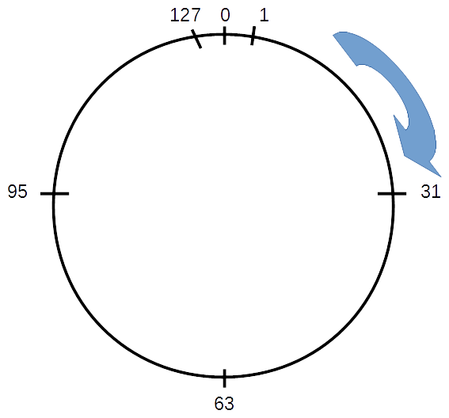
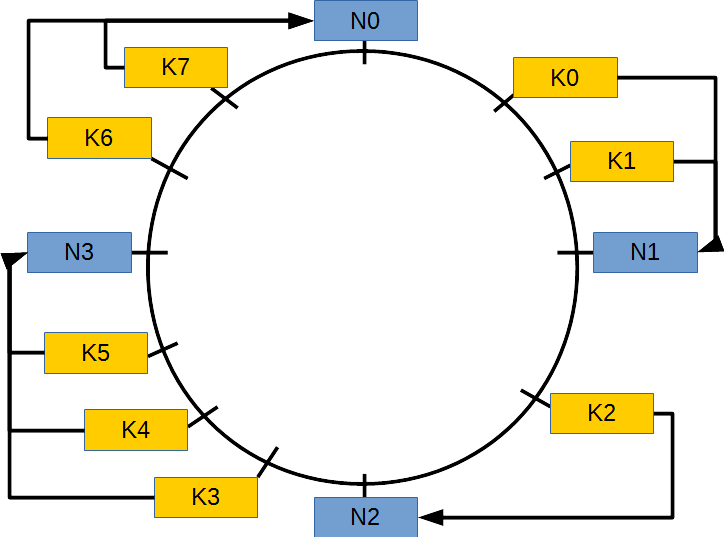
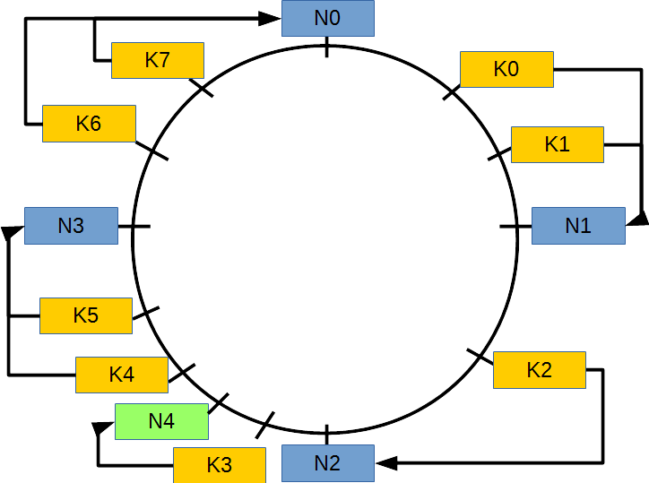
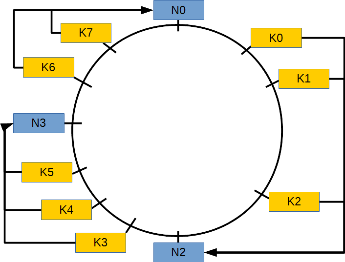

.. _chap-complements:

###########
Compléments
###########

Ce chapitre contient une sélection des rapports de projets effectués
dans le cadre du cours. Merci aux contributeurs qui m'ont fourni
une version révisée et complétée de leur travail.

**************************
Le système NoSQL Cassandra
**************************

Contribution de **Fabrice LEBEL (sept. 2015)**.
   
Introduction
============

Apache Cassandra est une base de données non-relationnelle créée
initialement par la société Yahoo! et passée dans le domaine libre, sous
licence Apache, en 2008.

C’est un moteur de **base de données orientée colonnes**. Dans ce type
de représentation, les données sont regroupées par **familles de
colonnes** (’**column families**\ ’) qui peuvent ne pas avoir le même
nombre de colonnes. De ce fait, le schéma de la base de données n’est
pas fixé à l’avance (voir [DATASTAX]_).

**Chaque colonne** est **définie par un nom** (chaîne de caractères,
entier, UUID...) et **contient**

-  **une valeur ou un ensemble de colonnes** (appelé aussi sous-famille
   de colonnes)

-  un ’\ **timestamp**\ ’ ou horodatage.

Outre la notion de familles de colonnes, Apache Cassandra manipule des
objets proches de ceux que l’on trouve dans les base de données
relationnelles :

-  **Keyspace :** c’est un conteneur pour les tables de données et les
   index. Nous pouvons représenter un keyspace comme une base de donnée,
   conteneur de tables (relations).

-  **Table :** c’est une table analogue à celles des bases de données
   relationnelles

-  **Clé-primaire (’primary key’) :** permet d’identifier de manière
   unique une ligne d’une table sur les différents nœuds du cluster

-  **Index :** comme dans les bases de donnée relationnelles il permet
   d’augmenter les performance de lecture des enregistrements d’une
   table.

**Dans cette section** nous nous interessons plus particulièrement à

-  l’\ **architecture distribuée** du framework Apache Cassandra

-  la **distribution** et la **réplication** des données au sein d’un
   cluster Apache Cassandra.

Notons que notre présentation se base principalement sur les ouvrages de [DATASTAX]_, [BRU2013]_, [RIG2015]_. Nous renvoyons le lecteur à ces ouvrages pour de plus amples
informations.

Architecture Distribuée
=======================

Apache Cassandra a une **architecture ’peer-to-peer’ c.-à.d. sans notion
de serveur/nœud maître-esclave** (ou encore ’\ **masterless**\ ’) et
utilisant une **topologie en anneau** appelée aussi **topologie Chord**.
Dans ce type d’architecture chaque nœud joue le même rôle et ils
communiquent entre eux grâce à un protocole nommé **protocole de
bavardage** ou ’\ **gossip protocol**\ ’. Ce protocole permet aux noeuds
du cluster d’échanger des informations concernant leur état,
l’ajout/retrait d’un nœud, la mise à jour des données...

En ce qui concerne l’aspect de **mise à l’échelle** ou
’\ **scalabiliy**\ ’, ellle est gérée en **ajoutant, ’à chaud’**
(c.-à-d. sans arrêt/redémarrage de la grappe de serveurs), de **nouveaux
nœuds**.

Dans un système NoSQL les données doivent être distribuées équitablement
entre les différents nœuds composant la grappe de serveurs. Comme
l’indique [BRU2013]_, p. 69 et sv., une **approche simple** peut consister à
**générer** une **clé de hachage pour chaque nœud** à partir des clés
primaire des données, du nombre de nœuds dans le cluster et de
l’\ **opérateur modulo**. Le résultat d’un hachage correspond donc à
l’identité d’un nœud dans le cluster. Mais cette approche simple à
l’inconvénient d’entrainer des migrations des données lorsque des nœuds
sont ajoutés ou retirés au cluster. La **Table 1**
illustre cette problématique de migration des données avec deux
clusters, un composé initialement de 4 nœuds puis de 5 nœuds.

+--------------------+---------------------------------+---------------------------------+-----------------------------+
| **Clé primaire**   | **Cluster 4 nœuds**             | **Cluster 5 nœuds**             | **Migration des données**   |
+====================+=================================+=================================+=============================+
| 45                 | \\(45 \\mod 4 = 1 \\equiv N1\\) | \\(45 \\mod 5 = 0 \\equiv N0\\) | \\(N1 \\rightarrow N0\\)    |
+--------------------+---------------------------------+---------------------------------+-----------------------------+
| 46                 | \\(46 \\mod 4 = 2 \\equiv N2\\) | \\(46 \\mod 5 = 1 \\equiv N1\\) | \\(N2 \\rightarrow N1\\)    |
+--------------------+---------------------------------+---------------------------------+-----------------------------+
| 47                 | \\(47 \\mod 4 = 3 \\equiv N3\\) | \\(47 \\mod 5 = 2 \\equiv N2\\) | \\(N3 \\rightarrow N2\\)    |
+--------------------+---------------------------------+---------------------------------+-----------------------------+
| 48                 | \\(48 \\mod 4 = 0 \\equiv N0\\) | \\(48 \\mod 5 = 3 \\equiv N3\\) | \\(N0 \\rightarrow N3\\)    |
+--------------------+---------------------------------+---------------------------------+-----------------------------+
| 49                 | \\(49 \\mod 4 = 1 \\equiv N1\\) | \\(49 \\mod 5 = 4 \\equiv N4\\) | \\(N1 \\rightarrow N4\\)    |
+--------------------+---------------------------------+---------------------------------+-----------------------------+
| 50                 | \\(50 \\mod 4 = 2 \\equiv N2\\) | \\(50 \\mod 5 = 0 \\equiv N0\\) | \\(N2 \\rightarrow N0\\)    |
+--------------------+---------------------------------+---------------------------------+-----------------------------+

    **Table 1.** Illustration de la migration des données lors de l'ajout d'un noeud à un cluster avec un algorithme simple de hachage de la clé primaire des données. Le résultat du modulo indique l'identité du noeud \\(Ni\\), \\(i=0..4\\), où la donnée sera stockée.

Afin d’éviter cette migration massive de données entre les nœuds lors de
l’ajout ou du retrait de nœuds, un algorithme plus sophistiqué appelé
**hachage cohérent** ou encore ’\ **consistent hashing**\ ’ est utilisé (voir [RIG2015]_, section *Systèmes NoSQL: le partitionnement*).

L’\ **idée de base** du **hachage cohérent** est que l’\ **application**
d’une même **fonction de hachage** aux **identifiants** des **nœuds** du
**cluster** (généralement à partir des adresses IP combinées au port de
communication) et aux **clés primaires** des **lignes** des tables de
données **génère** des **valeurs dans** le **même espace
d’identifiants**. Ces valeurs de hachage sont ensuite placées sur un
cercle.

Afin d’illustrer notre propos, **supposons** que les **valeurs de
hachage** sont **encodées sur \\(m\\) bits**. Nous disposons alors de
\\(2^m\\) points. Chaque identifiant de nœud ou de clé primaire peut
alors être choisi parmi ces points. Si \\(m=7\\) nous disposons de
\\(2^7 = 128\\) points (entiers) compris entre 0 et 127. Si nous les
plaçons sur un cercle nous avons la représentation de la
**Figure 1**.

   
   **Figure 1.** Représentation sur un cercle des valeurs de hachage encodées sur \\(m = 7\\) bits, soit \\(2^7 = 128\\) valeurs comprises entre 0 et 127.

En ce qui concerne le **routage** des **messages** dans un **système
Chord**, **chaque nœud connait ses successeurs** (nœuds situés dans le
sens des aiguilles d’une montre) et **parfois ses prédécesseurs** (nœuds
situés en sens inverse des aiguilles d’une montre). L’algorithme le plus
utilisé est celui des **doigts de la main** ou ’\ **finger
algorithm**\ ’. Dans un système Chord, chaque nœud maintient une ’finger
table’ dont les entrées sont calculées par la formule décrite ci-après.

Posons

.. math::

   \begin{aligned}
   m &= \text{nombres de bits pour l'encodage des valeurs de hachage}\\
   i &= \text{i-ème entrée de la 'finger table', $i = 0,1,2,...,m-1$}\\
   j &= \text{indice d'un nœud}\\
   ft(i) &= \text{valeur dans la 'finger table' de l'entrée $i$}.\end{aligned}

Nous avons alors

.. math:: ft(i) = (j + 2^i) \mod 2^m.

Posons

.. math::

   \begin{aligned}
   Nj &= \text{identifiant du nœud $j$}\\
   HashFunc(x) &= \text{fonction de hachage appliquée à la clé $x$}.\end{aligned}

et supposons que nous disposons de 4 nœuds (appelés aussi ’**servents**’) dons les valeurs
de hachage, encodées sur \\(m=7\\) bits, sont indiquées dans la
**Table 2**.

+--------------+--------------------------------------+
| **Clé**      | **Identifiant sur le cercle**        |
+==============+======================================+
| \\(N0\\)     | \\(HashFunc(N0) \\mod 2^7 = 0\\)     |
+--------------+--------------------------------------+
| \\(N1\\)     | \\(HashFunc(N1) \\mod 2^7 = 31\\)    |
+--------------+--------------------------------------+
| \\(N2\\)     | \\(HashFunc(N2) \\mod 2^7 = 63\\)    |
+--------------+--------------------------------------+
| \\(N3\\)     | \\(HashFunc(N3) \\mod~2^7 = 95\\)    |
+--------------+--------------------------------------+

    **Table 2.** Valeurs des identifiants des noeuds d'un cluster (\\(Nj\\)) encodées sur \\(m = 7\\) bits.

La ’finger table’ du nœud \\(N1\\) est représentée dans la **Table 3**.

+------------------------+------------------------------------+-----------------------------------+
| **Entrée \\(i\\)**     | **\\(ft(i)\\)**                    | **Successeur de \\(ft(i)\\)**     |
+========================+====================================+===================================+
| 0                      | \\((31 + 2^0) \\mod 2^7 = 32\\)    | \\(63 \\equiv N2\\)               |
+------------------------+------------------------------------+-----------------------------------+
| 1                      | \\((31 + 2^1) \\mod 2^7 = 33\\)    | \\(63 \\equiv N2\\)               |
+------------------------+------------------------------------+-----------------------------------+
| 2                      | \\((31 + 2^2) \\mod 2^7 = 35\\)    | \\(63 \\equiv N2\\)               |
+------------------------+------------------------------------+-----------------------------------+
| 3                      | \\((31 + 2^3) \\mod 2^7 = 39\\)    | \\(63 \\equiv N2\\)               |
+------------------------+------------------------------------+-----------------------------------+
| 4                      | \\((31 + 2^4) \\mod 2^7 = 47\\)    | \\(63 \\equiv N2\\)               |
+------------------------+------------------------------------+-----------------------------------+
| 5                      | \\((31 + 2^4) \\mod 2^7 = 63\\)    | \\(95 \\equiv N3\\)               |
+------------------------+------------------------------------+-----------------------------------+
| 6                      | \\((31 + 2^6) \\mod 2^7 = 95\\)    | \\(0 \\equiv N0\\)                |
+------------------------+------------------------------------+-----------------------------------+

    **Table 3.** 'Finger table' du noeud \\(N1\\) (ID = 31).

Donnons maintenant un exemple d’affectation des lignes de données aux
nœuds d’un cluster. Pour ce faire, nous posons

.. math::

   \begin{aligned}
   Ki = \text{clé primaire de la ligne de donnée $i$}.\end{aligned}

Les **valeurs de hachage** pour les clés primaires des lignes de données
et les identifiants de nœuds regroupées **dans** la
**Table 4**. Ces **valeurs** sont **comprises entre 0
et 127**. Nous débutons par un cluster composé de 4 noeuds
(\\(N0,...,N3)\\) puis nous analysons l’impact de l’introduction d’un
cinquième nœud (\\(N4\\)).

+--------------+----------------------------------------+
| **Clé**      | **Identifiant sur le cercle**          |
+==============+========================================+
| \\(N0\\)     | \\(HashFunc(N0) \\mod 2^7 = 0\\)       |
+--------------+----------------------------------------+
| \\(K0\\)     | \\(HashFunc(K0) \\mod 2^7  = 20\\)     |
+--------------+----------------------------------------+
| \\(K1\\)     | \\(HashFunc(K1) \\mod 2^7  = 30\\)     |
+--------------+----------------------------------------+
| \\(N1\\)     | \\(HashFunc(N1) \\mod 2^7  = 31\\)     |
+--------------+----------------------------------------+
| \\(K2\\)     | \\(HashFunc(K2) \\mod 2^7  = 50\\)     |
+--------------+----------------------------------------+
| \\(N2\\)     | \\(HashFunc(N2) \\mod 2^7  = 63\\)     |
+--------------+----------------------------------------+
| \\(K3\\)     | \\(HashFunc(K3) \\mod 2^7  = 70\\)     |
+--------------+----------------------------------------+
| \\(K4\\)     | \\(HashFunc(K4) \\mod 2^7  = 85\\)     |
+--------------+----------------------------------------+
| \\(K5\\)     | \\(HashFunc(K5) \\mod 2^7  = 90\\)     |
+--------------+----------------------------------------+
| \\(N3\\)     | \\(HashFunc(N3) \\mod 2^7  = 95\\)     |
+--------------+----------------------------------------+
| \\(K6\\)     | \\(HashFunc(K6) \\mod 2^7  = 100\\)    |
+--------------+----------------------------------------+
| \\(K7\\)     | \\(HashFunc(K7) \\mod 2^7  = 110\\)    |
+--------------+----------------------------------------+
| \\(N4\\)     | \\(HashFunc(N4) \\mod 2^7  = 80\\)     |
+--------------+----------------------------------------+

   **Table 4.** Valeurs de hachage des clés primaires des lignes de données (\\(Ki\\)) et des identifiants des noeuds d'un cluster (\\(Nj\\)).

Si nous posons les identifiants des nœuds et des clés primaires sur un
anneau et que nous utilisons l’\ **algorithme d’affectation des identifiants des lignes de données** suivant : en se déplaçant dans le sens des aiguilles d'une montre, chaque noeud est responsable des données dont les valeurs de hachage des clés primaires sont inférieures à son identifiant et supérieures à l'identifiant du noeud le précédent. Nous obtenons ainsi la **Figure 2**.

   
   **Figure 2.** Affectation des lignes de données dans un cluster de 4 nœuds dans une topologie ’peer-to-peer’ en anneau.

Si nous **introduisons un nouveau nœud** \\(N4\\) d’ID 80 la nouvelle
’finger table’ du noeud \\(N1\\) est décrite dans la
**Table 5**.

+------------------------+------------------------------------+-----------------------------------+
| **Entrée \\(i\\)**     | **\\(ft(i)\\)**                    | **Successeur de \\(ft(i)\\)**     |
+========================+====================================+===================================+
| 0                      | \\((31 + 2^0) \\mod 2^7 = 32\\)    | \\(63 \\equiv N2\\)               |
+------------------------+------------------------------------+-----------------------------------+
| 1                      | \\((31 + 2^1) \\mod 2^7 = 33\\)    | \\(63 \\equiv N2\\)               |
+------------------------+------------------------------------+-----------------------------------+
| 2                      | \\((31 + 2^2) \\mod 2^7 = 35\\)    | \\(63 \\equiv N2\\)               |
+------------------------+------------------------------------+-----------------------------------+
| 3                      | \\((31 + 2^3) \\mod 2^7 = 39\\)    | \\(63 \\equiv N2\\)               |
+------------------------+------------------------------------+-----------------------------------+
| 4                      | \\((31 + 2^4) \\mod 2^7 = 47\\)    | \\(63 \\equiv N2\\)               |
+------------------------+------------------------------------+-----------------------------------+
| 5                      | \\((31 + 2^5) \\mod 2^7 = 63\\)    | \\(80 \\equiv N4\\)               |
+------------------------+------------------------------------+-----------------------------------+
| 6                      | \\((31 + 2^6) \\mod 2^7 = 95\\)    | \\(0 \\equiv N0\\)                |
+------------------------+------------------------------------+-----------------------------------+

   **Table 5.** 'Finger table' du noeud \\(N1\\) (ID = 31) après introduction du noeud \\(N4\\) d'ID 80.

La nouvelle affectation des lignes de données est représentée dans la **Figure 3**.

   **Figure 3.** Ré-affectation des lignes de données dans un cluster de 5 nœuds dans une topologie ’peer-to-peer’ en anneau après ajout du nœud \\(N4\\).

Si maintenant nous supprimons un nœud du cluster initial afin d’obtenir
une **topologie comprenant 3 nœuds**, nous obtenons la **Figure 4**.

   **Figure 4.** Ré-affectation des lignes de données dans un cluster de 3 nœuds dans une topologie ’peer-to-peer’ en anneau après suppression du nœud \\(N1\\).

Dans Apache Cassandra, la **clé de hachage des nœuds** ou ’\ **peer
pointer**\ ’ est appelée **clé de partitionnement**. Les données sont
quant-à elles distribuées grâce à un ’\ **partitioner**\ ’ qui décide
sur quel nœud certaines données doivent être distribuées en fonction de
la valeur de leurs clés de hachage respectives.

Un autre paramètre d’Apache Cassandra est le **facteur de réplication**
(’**replication factor**\ ’) qui détermine le nombre de noeuds disposant
d’une copie (ou **réplicat**) de la même ligne d’une table. A titre
d’exemple, un facteur de réplication de 2 indique que 2 nœuds du
’cluster’ contiendront une copie d’une même ligne.

Références
==========

.. [BRU2013] BRUCHEZ, R (2013). *Les bases de données NoSQL (Comprendre et mettre en oeuvre)*. Eyrolles, Paris.

.. [DATASTAX] DATASTAX (sept. 2015). *Apache Cassandra 2.0 Documentation*, http://docs.datastax.com/en/cassandra/2.0/cassandra/gettingStartedCassandraIntro.html.

.. [RIG2015] RIGAUX, P. (2015/2016). *Bases de données documentaires et distribuées*, http://b3d.bdpedia.fr/
