#################
Annexe: CouchBase
#################

.. note:: Ce chapitre a été rédigé en 2016 sur la base du rapport de Sylvain Cazaban-Mazerolles pour NFE204. Merci à lui.


Couchbase est un projet open source, de base de données documentaire et distribuée. Couchbase est une solution robuste et avancée, qui gère les accès concurrent sur les documents, le passage à l’échelle, la réplication, l’équilibrage de charge, la reprise sur panne, les sauvegardes. Les documents insérés dans Couchbase sont stockés au format JSON ou comme binaires. Couchbase est un produit relativement récent qui a vu le jour en juin 2010 sous le nom de Membase. En 2011 l’équipe de Membase a annoncé sa fusion avec celle de CouchOne pour donner naissance à Couchbase en 2012.
Le langage créé par Couchbase pour interroger ses bases dans un langage inspiré de SQL est appelé N1QL, prononcé « nickel ». L’architecture d’un serveur Couchbase est composée de deux grandes parties, la première gère l’accès et le stockage des données, tandis que la deuxième gère l’administration du cluster Couchbase.

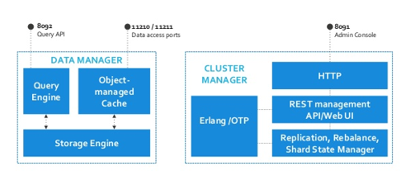
   
   *Architecture d'un serveur Couchbase*

************
Installation
************

Pour installer Couchbase sur Windows, j’ai récupéré la dernière version stable, la version 4.0 en 64 bits. 
L’installation se fait par un outil de configuration en quelques clics. A la fin de l’installation 
nous accédons à la console de Couchbase  par l’intermédiaire d’un navigateur web. La configuration 
initiale du serveur est alors possible.

Configuration du serveur :

  - Chemins vers les bases de données et vers les index (penser aux I/O et à l’architecture des grappes de disques).
  - Hostname de l’application (permet d’accéder au serveur via un nom plutôt qu’une adresse IP si configuré dans le DNS).
  - Possibilité de rejoindre un cluster déjà existant.
  - Choisir les services activés sur le serveur parmi Data, Index et Query puis allouer l’espace mémoire RAM pour chacun de ces services. Des services peuvent être dédiés à des serveurs pour équilibrer la charge globale du cluster au sein d’une architecture n-tiers.
  - Définir le mode de stockage du bucket par défaut (RAM ou Disque).
  - La quantité de mémoire alloué au bucket.
  - la gestion du cache des métadonnées.
  - Le nombre de répliques pour la sauvegarde des données.
  - Possibilité de donner une forte priorité aux accès disques aux tâches Couchbase.
  - Paramètres d’authentification (nécessaires pour la mise en place du cluster).

************
Architecture
************


Couchbase est fondé sur une architecture SNA pour Shared-Nothing Architecture. Elle consiste en une agrégation de serveurs 
derrière un ou plusieurs serveurs applicatifs frontaux.

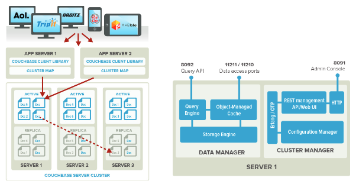
   
   *Architecture du cluster, architecture d'un serveur*
   
Les documents sont distribués uniformément au travers du cluster et stockés dans des conteneurs de documents 
appelés *buckets*. Les *buckets* sont des groupements logiques de ressources physiques au sein d’un cluster. 
Quand un *bucket* est créé, de la mémoire RAM lui est alloué pour mettre ses données en cache, et son nombre de 
réplicas est défini. Chaque bucket est découpé en 1024 partitions logiques appelés 
*vBuckets*. Ces partitions sont mappées à des serveurs du cluster, les données du mapping 
sont stockées dans le cluster map.

Chaque document ajouté à la base de données se voit attribuer un ID, qui est hashé en CRC32, puis 
il est distribué sur les serveurs de destination. Il est d’abord répliqué, puis il est mis 
en mémoire, puis stocké de façon asynchrone sur disque.
Chaque bucket est réplicable 3 fois dans un cluster. Une seule des partitions est active à la fois. 
En cas de coupure d’un serveur, l’une des deux autres répliques inactive est désignée comme active.

Le gestionnaire de données
==========================

D’un point de vu logique, les serveurs Couchbase sont constitués d’un gestionnaire de données, lui-même composé de trois éléments : 
le moteur de requêtes, le cache des objets gérés, et le moteur de stockage.
L’Object-Managed Cache stocke en mémoire les tables de hashage représentant les documents et leurs métadonnées. Le contenu lui-même des 
documents peut être ajouté aux métadonnées. Cela permet au serveur de garantir des latences très faibles pour servir les requêtes. 
Les requêtes sont journalisées dans un fichier, ce qui permet au serveur d’effectuer un warmup à partir de ce fichier en 
cas de redémarrage.

Le Storage Engine de Couchbase ne fonctionne que par ajout, il n’y a jamais de mise à jour directe. 
Les ajouts se font toujours à la fin des fichiers de façon séquentielle. Ce qui garantit des temps d’accès très rapide. Le moteur 
utilise des fichiers multiples pour le stockage et gère les accès aux documents par des pointeurs. Ces fichiers sont soit des 
fichiers de données, soit des vues, soit des index. Qui sont eux-mêmes actifs ou passifs répliqués. Les fichiers de 
données sont organisés en structure d’arbres B, un principe de stockage équilibré de données favorisant la recherche, 
l’insertion et la suppression.

La gestion du cache des métadonnées
-----------------------------------

Il est possible de définir la façon dont la mémoire des serveurs se vide. Soit en vidant uniquement 
les valeurs propres aux données et en conservant les métadonnées et les clés, soit en supprimant tout. Conserver 
les clés et les métadonnées donnera de meilleures performances à la base grâce à la persistance en mémoire 
de données précédemment utilisées, donc potentiellement réutilisables. Le choix d’éjecter toutes les données 
peut être fait si l’espace mémoire est faible sur le serveur, au détriment des performances.

Le gestionnaire de cluster
--------------------------

Le gestionnaire de cluster supervise la configuration des serveurs et leurs interactions au sein du cluster. 
Il gère la réplication et l’équilibrage de charge. Lorsqu’un serveur n’est plus joignable, le serveur 
orchestrateur de cluster notifie les autres machines et promeut les données répliquées inactives 
qui étaient actives au sein du serveur injoignable. La carte du cluster est mise à jour sur tous les 
nœuds du cluster. C’est de cette façon que Couchbase gère la reprise sur panne.

Le moteur de requêtes
---------------------

Les index primaires sont gérés par Couchbase. Les index secondaires sont définis lors de la création de documents 
de conception et des vues associées. Chaque document de conception est propre à un bucket et porte en lui les vues qui 
lui sont associées. Au sein de chaque vues sont définies les fonctions de map et de reduce. La fonction de map défini 
les attributs sur lesquels seront établis les index secondaires. Les index sont eux aussi distribués, chaque serveur 
fait son propre indexage.

Chaque requête reçue par le serveur applicatif est distribuée à tous les serveurs du cluster, les résultats 
sont agrégés avant d’être renvoyés. La construction d’une vue est incrémentale, chaque fois qu’une vue est accédée, 
elle est appliquée à tous les documents nouvellement insérés ou modifiés.

La réplication
--------------

Appelé XCDR pour Cross Datacenter Réplication, elle permet de répliquer des données entre clusters distincts, 
situés dans des zones géographiques différentes par exemple. La réplication interne au cluster et par le 
XCDR surviennent en même temps. La réplication peut se faire au niveau du bucket, pas seulement sur le cluster
en entier. La réplication supporte la réplication en continue des données, détecte les pannes de cluster pour 
mettre à jour à la topologie distante et est conçue pour optimiser la bande passante (déduplication). 

En cas de 
détection de conflit de mises à jours de documents sur des datacenter distants, le document élu sera celui ayant reçu 
le plus de mises à jour.


Interrogation
=============

Couchbase vient avec un certain nombre d’utilitaires, 

.. note:: Pour les utilisateurs de Windows: pour les appeler simplement depuis une ligne de commande, 
   il faut ajouter le chemin vers les binaires  ``C:\\Program Files\\Couchbase\\Server\\bin\\`` dans le ``PATH`` de Windows. 

Lors de l’installation de Couchbase, il est possible d’installer des jeux de données pour servir d’exemple aux tests.

L’utilitaire permettant d’effectuer des requêtes N1QL est cbq.exe. 
Une première requête d’interrogation vers notre bucket échouera s’il n’y a pas d’index sur celui-ci.

Pour créer l’index, effectuer la commande suivante :

.. code-block:: sql

   CREATE PRIMARY INDEX ON `beer-sample` USING GSI;

Une requête SELECT peut maintenant être effectuée.

.. code-block:: sql

   SELECT DISTINCT type FROM `beer-sample`;
   
La commande donnera toutes les valeurs possibles pour la propriété ``type`` des documents JSON du bucket ``beer-sample``.

**********************
Données JSON et import
**********************

La source de données
====================

Dans le cadre du projet je suis allé à la recherche de données à exploiter. J’ai retenu le choix de document au format 
JSON par commodité, en effet les systèmes NoSQL les plus documentés fonctionnant sur Windows étaient tournés vers ce 
format de données. 
J’ai recherché des sources de données selon les critères suivants :

- volume disponible (nombre d’enregistrements),
- périodicité de mise à jour,
- présence de données récentes,
- possibilité d’interroger les données par web service et/ou une API.

Après quelques recherches, j’ai découvert la base de données open data de la ville de New-York. La base de données de 
la ville de New-York est accessible au travers d’une application cloud appelée Socrata. Socrata est le nom de l’entreprise 
et du logiciel. Celui-ci est destiné aux administrations souhaitant publier des données sous forme d’open data à des 
utilisateurs d’internet sans que ceux-ci aient besoin d’une expertise particulière pour visualiser les données. 


Le contenu mis à disposition à travers Socrata par le programme Open Data de la ville de New-York est conséquent, il est réparti 
dans les catégories suivantes : Business, City Government, Education, Environment, Health, Housing & Development, Public Safety, etc.
J’ai choisi d’extraire les données disponibles dans la catégorie sécurité, liées aux collisions de véhicules à moteurs dans la 
ville de New-York. Ces données ont retenu mon attention car elles détiennent pour chaque document suffisamment 
d’information pour qu’elles puissent être analysées, le contenu de la base est volumineux (plus de 700.000 documents) 
et les documents sont mis à jour régulièrement, toutes les semaines. Environ 500 documents sont créés pour une 
journée. La base est alimentée avec des données partant du 1er juillet 2012.

Socrata permet d’interroger ses données par l’intermédiaire de SODA, qui est le nom de son API, pour Socrata Open Data API. 
Des kits de développement pour les principaux langages de programmation sont mis à disposition.

Je n’ai pas utilisé l’API SODA pour récupérer les documents de Socrata pour la ville de New-York, l’API s’installe 
facilement sous Visual Studio via l’utilitaire d’installation de package NuGet, mais elle a pour but d’interroger 
les données directement sur cette plateforme via la formation de requêtes ressemblant à SQL, appelées SoQL, 
puis à analyser les données dans l’application. Ma démarche a pour but d’exporter les données brutes, pour 
cela je n’ai pas eu besoin de l’API.

Description du document
=======================

Les documents extraits de la base de données des collisions de véhicules sont constitués des attributs suivant :

.. code-block:: json

   {
     "number_of_persons_killed" : "0",    
     "vehicle_type_code1" : "TAXI",       
     "zip_code" : "10012",             
     "vehicle_type_code2" : "TAXI",
     "location" : {                      
      "needs_recoding" : false,
      "longitude" : "-73.999917",
      "latitude" : "40.7269334"
     },
     "number_of_motorist_injured" : "1",   
     "date" : "2014-05-17T00:00:00",       
     "off_street_name" : "LAGUARDIA PLACE", 
     "time" : "0:10",                      
     "on_street_name" : "WEST HOUSTON STREET", 
     "number_of_pedestrians_injured" : "0",
     "number_of_cyclist_killed" : "0",    
     "longitude" : "-73.9999170",
     "number_of_cyclist_injured" : "0",   
     "unique_key" : "336440",            
     "borough" : "MANHATTAN",           
     "number_of_pedestrians_killed" : "0",  
     "contributing_factor_vehicle_1" : "Pavement Slippery",
     "number_of_motorist_killed" : "0",    
     "number_of_persons_injured" : "1",   
     "contributing_factor_vehicle_2" : "Unspecified",
     "latitude" : "40.7269334"
   }

Le champ ``contributing_factor_vehicle
` peut exister cinq fois, noté de 1 à 5. C’est la cause de l’accident. Le champ 
``vehicle_type_code1`` peut exister cinq fois, noté de 1 à 5. C’est le type du véhicule causant l’accident. 
Nous sommes en présence d’un document JSON portant la donnée sans référence externe. Les types et les codes sont 
des libellés portés par le document. Il n’existe pas de base donnant tous les types et codes possibles.

Création du jeu de données
==========================


Pour récupérer les données de la base des collisions de véhicule de la ville de New-York, il est possible 
d’utiliser des requêtes http auprès du web service. Concernant cette base, plusieurs web services sont disponibles, 
délivrant des fichiers XML, JSON ou CSV.
Pour appeler le web service fournissant des résultats JSON, il faut faire un GET à l'adresse
https://data.cityofnewyork.us/resource/h9gi-nx95.json

Quelques mots SoQL, des paramètres utilisés dans l’url http, permettent de filtrer les résultats lors de l’appel 
au web service. Il est également possible de passer les mots SoQL dans un seul paramètre $query.
Voici la requête qui m’a permis d’obtenir le nombre de documents dans la base :

.. code-block:: text

     https://data.cityofnewyork.us/resource/h9gi-nx95.json?$query=SELECT Count(unique_key)

Pour extraire les données j’ai conçu une application Windows WPF.

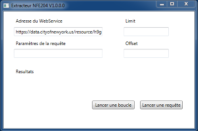
   
   *Application permettant d’appeler le web service pour extraire les données*

L’application que j’ai développée est relativement simple et mériterait d’être améliorée avec des 
tests plus poussés. Il reste à l’état de prototype, ses fonctionnalités suffisant pour récupérer 
les données. Le programme prend en paramètre l’adresse du web service et les paramètres de la requête pour 
lancer une requête simple. Pour lancer des requêtes en boucle, il faut saisir le nombre d’enregistrement 
par boucle (paramètre limit) et  le point de départ (paramètre offset).

Le programme fait un appel à l’adresse http construite en fonction des paramètres. Le résultat JSON est inséré 
dans un lecteur de flux (StreamReader) puis sauvegardé dans un fichier avec l’extension JSON.
En cas de boucle de requête, le programme s’arrête quand il n’y pas de résultats dans la réponse http. 
Dans ce cas le résultat est un tableau vide ``[]``. 

Pour extraire les 700.000 enregistrements, j’ai effectué une boucle de requêtes en partant de 0 par pas de 
10.000, en triant les résultats par clef unique ascendante. Le pas choisi permettait que le service web réponde 
dans les temps, sinon un timeout survenait, et d’avoir un export initial ne contenant pas trop de fichiers.
Il a fallu plus d'une heure pour récupérer tous les documents, les réponses http étant assez lentes depuis 
les Etats-Unis. L’export est constitué de 77 fichiers de 10.000 documents JSON. Le programme a nommé 
les fichiers en fonction du pas et du nombre d’éléments par pas, pour un format de ce type : 
``data-[nième élément]-[nième élément +pas].json``.

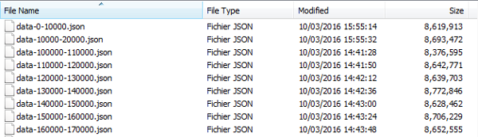
   
   *Extraction des données au format JSON sous forme de fichiers de 10 000 documents*

L’import de documents dans Couchbase ne peut se faire que de façon atomique, un fichier ne doit contenir 
qu’un seul document, contrairement à MongoDB par exemple où il est possible d’importer un tableau de documents.
J’ai donc du écrire un script python qui a extrait pour chacun de ces fichiers, chaque ligne de données 
JSON en se basant sur le champ unique_key et créé un nouveau document JSON nommé par sa clé.

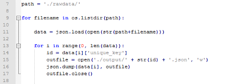
   
   *Script Python pour générer 700 000 fichiers*

À l’issue du traitement qui a duré plusieurs dizaines de minutes, plus de 700 000 documents de 1 ko ont été créés.

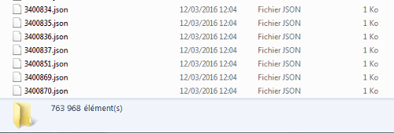
   
   *Résultat du script 763 968 fichiers créés*

   
Automatisation des exports et intégration
=========================================

Il n’existe pas de critères permettant de récupérer les nouveaux  documents JSON 
disponibles sur la base de données depuis une certaine date. En effet les documents apparaissent 
par intervalles, sans tri dans les dates. Le séquencement des clefs uniques n’est pas lié à la date de l’accident. 
Néanmoins, les numéros de clés uniques se suivent même s’il existe parfois des sauts de chiffre. Ce qui laisse place 
à un schéma d’exportation.

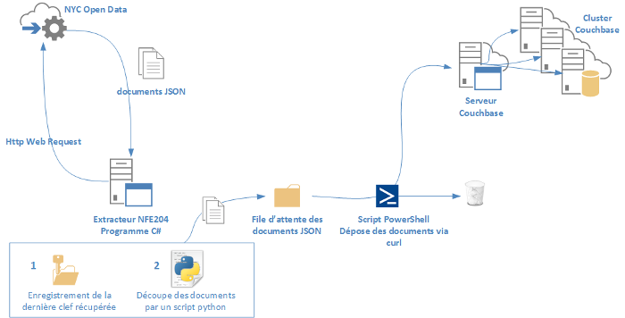
   
   *Processus d’exportation des données JSON et importation dans Couchbase*

L’automatisation va pouvoir être établie selon le processus suivant :

  1. Une tâche planifiée exécute le programme WPF, celui-ci effectue un appel au web service 
     avec pour paramètre une sélection des documents dont la clef unique est supérieure à la dernière récupérée. 
     Exemple de paramètre : ``$where unique_key > lastuniquekey &$limit=1000 &$offset=X``. 
     
     Les fichiers JSON récupérés sont stockés dans un répertoire temporaire. La clef la plus haute des documents 
     récupérés est stockée pour les prochains appels.
  2. une tâche planifiée exécute un script python qui prend chaque document JSON et le découpe en fichiers contenant un 
     seul document JSON et les dépose dans un répertoire constituant la file d’attente.
  3. Une tâche planifiée exécute un script PowerShell qui lance la commande curl vers le cluster Couchbase pour déposer 
     chaque fichier contenu dans le répertoire de file d’attente. Chaque fichier déposé est ensuite supprimé.


Insertion des données JSON
==========================

Nous allons voir dans cette partie comment importer les documents JSON dans Couchbase.
Couchbase permet d’insérer des documents par l’intermédiaire de son API Java. Un exemple :

.. code-block:: java

   JsonObject content = JsonObject.empty().put("name", "Michael");
   JsonDocument doc = JsonDocument.create("docId", content);
   JsonDocument inserted = bucket.insert(doc) ;

D’autres environnements sont supportés : .Net, PHP, Node.js, Python, Ruby.
Il est également possible de déposer des documents en utilisant REST. Il faut pour cela mettre en place un serveur 
dédié en tant que portail de synchronisation, le *Sync Gateway*. En effet, il n’est pas possible de déposer des documents 
directement en effectuant une requête http via curl vers le cluster Couchbase. Néanmoins les services REST 
sont bien proposés, mais pour effectuer des opérations de gestion sur le cluster, les buckets, les vues.

Dans le cadre du projet, je vais insérer les données récupérées initialement en effectuant un import en masse. 
Ce moyen est généralement utilisé après une installation initiale de Couchbase, ce qui est le cas ici. 
Pour insérer un grand volume de données en une seule fois, voici comment on procède. Premièrement, 
créer le bucket qui va accueillir les données. Il est possible de créer un bucket par l’interface web 
ou par ligne de commande. Voici la démarche par ligne de commande, en utilisant l’utilitaire couchbase-cli.

.. code-block:: bash

     couchbase-cli bucket-create -c localhost:8091 -u admin -p password --bucket=NYC 
       --bucket-type=couchbase --bucket-ramsize=1000 

La commande va créer un bucket nommé NYC, de type Couchbase (stocké sur disque) avec un quota de mémoire RAM alloué de 1 GB.

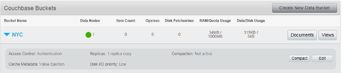
   
   *Bucket vide NYC créé par la ligne de commande*

Nous importons ensuite les données. L’import des données peut se faire depuis un fichier ZIP ou 
depuis un répertoire. La ligne de commande s’utilise par le biais de l’utilitaire ``cbdocloader``.

.. code-block:: bash
  
     cbdocloader -n localhost:8091 -u admin -p password -b NYC E:\NFE204DATA\Bulk\output
   
Les fichiers sont importés, la console web indique 2000 opérations par seconde.

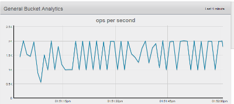
   
   *IOPS sur le bucket NYC lors de l’import*

Quelques minutes plus tard, les 763968 fichiers d’import initial sont présents dans le bucket.
   
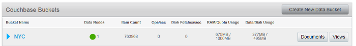
   
   *Bucket NYC contenant 763968 documents JSON*

Requêtes sur la base
====================

Notre premier import effectué, notre base est prête à l’emploi et nous pouvons commencer 
à l’utiliser. Avant tout, commençons par créer notre index, qui est obligatoire pour 
effectuer nos requêtes. On lance l’utilitaire de requête en tapant cbq en ligne de commande.

.. code-block:: sql

   CREATE PRIMARY INDEX ON NYC USING GSI;

La commande ``select count(*) from nyc`` retourne 763968, ce qui démontre la bonne exécution de la requête.

Il est également possible de passer des requêtes http en utilisant ``curl``.

.. code-block:: bash

   curl -v http://localhost:8093/query/service -d "statement=SELECT COUNT(*) FROM NYC;"

Pour effectuer des requêtes vers la base de données, il est assez commode d’utiliser dans un premier temps 
le langage propre à Couchbase, N1QL, en utilisant l’outil de requête cbq.exe. Par exemple, pour 
obtenir la liste des principaux facteurs d’accident, on saisira la requête suivante :

.. code-block:: sql

     SELECT COUNT(unique_key) AS Num, contributing_factor_vehicle_1  FROM NYC 
   GROUP BY contributing_factor_vehicle_1 ORDER BY Num DESC;

Le résultat s’affiche dans la fenêtre de l’invite de commande mais ne peut pas être exporté.


En utilisant ``curl``,  nous pouvons former des requêtes http pour récupérer nos données. Il sera 
alors possible d’ajouter une sortie vers un fichier texte.

.. code-block:: bash

   curl -v http://localhost:8093/query/service -d "statement=SELECT COUNT(unique_key) AS Num, 
   contributing_factor_vehicle_1  FROM NYC GROUP BY contributing_factor_vehicle_1 
   ORDER BY Num DESC;" > E:\output.txt

La requête curl passe en paramètre une requête SQL mais nous pouvons aussi utiliser les vues. Nous le verrons plus loin. 
A l’aide d’un convertisseur de format JSON vers CSV, il est possible d’exploiter les résultats dans un tableur. J’ai choisi 
d’utiliser un service web, la fonctionnalité de conversion étant simple et disponible. 
Dans le cadre d’une industrialisation du processus, nous préfèrerions établir notre propre programme de conversion.Une fois le document csv obtenu, nous pouvons modéliser nos résultats sont forme d’un graphe.

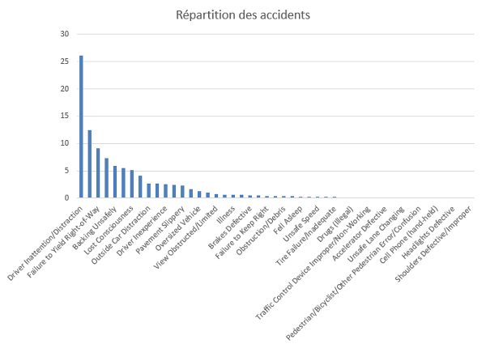
   
   *Répartition des causes d’accidents tous critères confondus, en pourcentage.*

Une première analyse montre que dans la moitié des cas, la cause de l’accident n’est 
pas précisée, j’ai donc retiré les données liées. Rapidement nous voyons que le premier facteur d’accident est 
l’inattention au volant pour un cas sur quatre. Suivent majoritairement, le non-respect du cédez le passage, la marche arrière 
sans contrôle, la perte de conscience, la distraction perçue en dehors du véhicule, l’inexpérience, la chaussée glissante, 
le véhicule trop large, la vision obstruée.

Exploiter les données sous forme de carte GPS
=============================================

Les données relatives aux collisions détiennent les coordonnées GPS des lieux de l’accident. Il devient donc possible de 
représenter les lieux des accidents sur une carte. Pour appliquer le principe, je suis allé à la recherche d’un service 
permettant de le mettre en oeuvre. Je me suis servi de l’application CartoDB, qui permet de représenter sur une carte 
des localisations en alimentant un jeu de données contenant des coordonnées GPS. L’application est gratuite, mais pour 
un nombre limité d’enregistrements dans un jeu de données. 
Pour mettre en pratique le principe, j’ai donc effectué des requêtes sur Couchbase pour récupérer les données suivantes :

- 93.000 enregistrements de la base de données, sans critère de sélection. Carte 1.
- Les collisions au 31 décembre 2015. Carte 2.
- Les collisions dans Brooklyn, en janvier 2016. Carte 3.

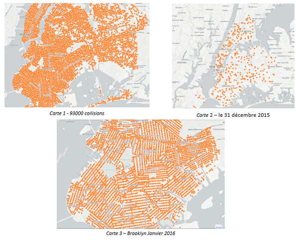
   
Avec ce type de modélisation, il devient possible de mettre en évidence un large éventail de causalité dans les collisions. Par exemple, en obtenant les données météorologiques de la ville de New-York sur les dernières années, par croisement des données issues de la base de collisions, il serait possible de montrer que certaines zones sont plus accidentogènes que d’autres en cas d’intempéries. De même, si les données relatives au trafic routier étaient récupérées, il serait possible d’analyser l’impact de la densité de trafic sur le nombre d’accidents et leur localisation.

CartoDB est un outil puissant, qui permet d’être exploité directement au sein d’un large type de serveurs web. Il permet également d’interroger des données par web service situé sur d’autres serveurs. Ses possibilités sont nombreuses et il est un exemple de mise en application des modèles de données accessibles en Open Data.

******************
Le système de vues
******************

Les vues dans Couchbase permettent à partir d’un bucket de créer un index sur la donnée en affichant les champs et informations 
souhaitées. Les vues peuvent être persistantes. Elles sont utilisées pour indexer et requêter les données, produire des listes 
de données, extraire et filtrer des données, réduire le volume de données,  ou pour effectuer des calculs.
Les vues sont propres à un bucket. Une vue ne peut pas cibler plusieurs bucket. Dans Couchbase on distingue les vues 
de développement et les vues de production. Les premières servent à concevoir une vue avant de l’appliquer au cluster, 
en utilisant des jeux de données réduits. Les mises à jour des vues se fait de façon incrémentale, il est possible de définir la façon dont la vue se met à jour en fonction de plusieurs paramètres : nombre d’éléments mis à jour, par défaut 5000, et l’intervalle en millisecondes, 5000 également. Seules les vues de productions sont mises à jour automatiquement. Il est cependant possible de forcer la mise à jour des index avec le paramètre stale.

- ``stale = ok``, donne la réponse la plus rapide sans mise à jour de l’index sur la vue,
- ``stale = false``, l’index est mis à jour en premier, les résultats sont donnés ensuite. 
- ``stale = update_after``, c’est le paramètre par défaut, l’index de la vue se met à jour après une requête sur celle-ci.

Les définitions de vues sont stockées dans des documents de conception (design document), avec les fonctions de mapReduce. 
Dans le document de conception sont stockées les options de mise à jour des vues. Les documents de conceptions sont créés 
dans l’interface graphique ou par des requêtes http via curl.

Lorsqu’une vue est créée, l’interface montre les champs disponibles sur un document, créé une fonction de map par défaut, celle qui émet la clé du document et aucune donnée. 

.. code-block:: javascript

   function (doc, meta) {
      emit(meta.id, null);
   }

Il est possible de filtrer et agréger les résultats, par défaut, pas de fonction de reduce, le stale est à false : 
mise à jour de l’index forcée.

La phase de ``Reduce``
======================

Dans Couchbase, il est possible d’écrire ses fonctions de reduce, il faut cependant prêter attention à l’option 
``rereduce`` de cette fonction. En effet lorsque que Couchbase traite un volume important de données, Couchbase fait des 
calculs préliminaires et stocke ses résultats dans une structure en arbre B. Ainsi Couchbase appliquera le reduce sur un 
premier jeu de données qu’il stockera dans l’arbre B, puis passera aux jeux de données suivants. Si plusieurs 
niveaux d’arbre B sont créés alors il faut rappeler le reduce.

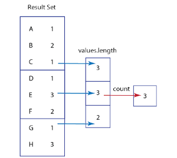
   
   *Schéma du rereduce dans Couchbase*

Il existe une fonction de count prédéfinie, mais pour appliquer le principe du MapReduce je vais le 
faire manuellement. Le résultat de la vue doit nous donner le nombre de collisions (documents) dans la base. La fonction 
de map sera la suivante :

.. code-block:: javascript

   function (doc, meta) {
     emit (1,doc.unique_key);
   }

Ici nous émettons la clef du document, propriété qui nous servira à compter son occurrence. Nous sommes sûrs que la clef existe. J’aurais pu tout aussi bien choisir l’id donné par Couchbase, doc.id ou passer tout le document.
La fonction de reduce est la suivante :

.. code-block:: javascript

   function (keys, values, rereduce) {
     if (rereduce) { //le rereduce est propre au système, comme expliqué plus haut.
       return sum(values);
     }    
     else {  
       return values.length;  
     }
   }
   
Le résultat obtenu est 763968, soit le nombre de collisions.

Nombre d'accidents mortels par quartiers
========================================

Je vais créer une vue de développement affichant le nombre d’accidents mortels par quartier. La fonction de map 
va nous servir à trier les données sur le critère accident mortel. J’émets les données avec comme clé le nom du 
quartier pour le groupement de Reduce. 
Après plusieurs tentatives où le résultat ne s’affichait pas regroupé, contrairement à CouchDB, il s’avère 
que dans le filtrage des résultats il faut cocher la case « group », en plus de  ``reduce``. La fonction de reduce 
reste inchangée, la fonction map devient :

.. code-block:: javascript

   function (doc, meta) {
     if(doc.number_of_persons_killed > 0) {
       emit (doc.borough , doc.unique_key);
     }
   }

Avec pour résultat :

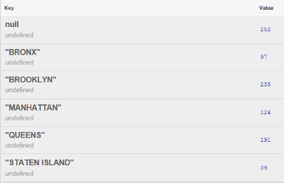
   
   *Résultat du MapReduce*

Avec N1QL, effectuer le count se fait comme en SQL.

.. code-block:: sql

   select count(*) from NYC WHERE TONUMBER(number_of_persons_killed) > 0;

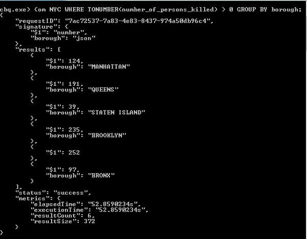
   
   *Sortie de la requête N1QL*
   
L’agrégation en N1QL

.. code-block:: sql

   select borough, count(*) from NYC WHERE TONUMBER(number_of_persons_killed) > 0 GROUP BY borough;


   
   *Sortie de la requête N1QL*


Etude et discussion des résultats
=================================

Accéder aux données pour nos deux requêtes prend environ 55 secondes en exécutant une requête directement par 
cbq.exe. Couchbase traite la commande en l'envoyant à son moteur d'execution de requête (voir annexe). Effectuer la même 
requête immédiatement après donnera le résultat avec le même coût de temps. De même, en créant une vue de développement, lorsque nous l’appliquons aux données, elle prend beaucoup de temps à se générer. Cependant, lorsque la vue est passée en production, en appuyant sur le bouton « Publish » de l’interface, le résultat de la requête sera instantané.
Pour accéder aux résultats disponibles par une vue, en dehors de l’interface web de Couchbase, nous devons utiliser l’API 
Rest via Curl, avec le format suivant : ``GET /[bucket-name]/_design/[ddoc-name]/_view/[view-name]``. Ce qui donne comme url d’accès:

.. code-block:: bash

   http://localhost:8092/NYC/_design/AccidentQuartier/_view/AccidentQuartier

La réponse est ici immédiate.
   
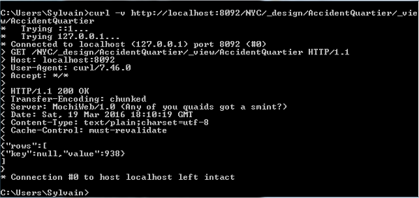
   
   *Réponse de la vue pour l’équivalent du Count*

| Un utilisant N1QL, il faut créer un index, qui se basera soit sur un index global secondaire (GSI), soit sur une vue. Seront alors utilisés les mots-clefs USING GSI ou USING VIEW à la fin de la commande CREATE INDEX. Les vues avec MapReduce ne peuvent pas être utilisées. Lorsque l’index est créé, derrière, une vue pour N1QL est établie. L’index sera créé de la façon suivante, sur les arrondissements :

.. code-block:: sql

   CREATE INDEX quartier ON NYC(borough) USING GSI;

La requête ramenant les résultats groupés par arrondissements sera légèrement plus rapide, 48 secondes au lien de 55. Ce qui n’équivaut pas les résultats des vues MapReduce d’après mes expérimentations. 

Comme nous l’avons abordé, les vues mapReduce sont pré-calculées, ce qui n’est pas le cas avec les requêtes N1QL. Les requêtes REST ont donc une réponse immédiate contrairement à celles-ci. Dans certains cas, les requêtes N1QL pourront être performantes, dans d’autres cas beaucoup moins.

Dans ce cas pourquoi utiliser N1QL ? Le langage N1QL permet d’exécuter des requêtes ad hoc sans devoir implémenter une vue. De plus le langage utilise des mots proches de SQL, de fait, pour une personne n’ayant pas connaissance des spécificités des systèmes de base de données documentaires et du paradigme clé valeur, celle-ci peut facilement interroger les données. Ces requêtes sont par ailleurs portables, puisqu’avec un connecteur ODBC, elles pourront être exécutées par un  logiciel tiers.

Les vues quant à elles permettent de délivrer les résultats avec des performances accrues. C’est grâce au pré calcul implémenté en JavaScript par les fonctions de Map et de Reduce que cela est possible. Elles ont ainsi l’avantage de proposer une structure formatée pour un service consommateur.

Nous venons de voir le panel des possibilités pour interroger les données dans Couchbase. Les différentes  requêtes permettent ainsi de récupérer des jeux de données à analyser par un programme client. Mais pour aller plus loin, comment pouvons-nous mettre en place une structure permettant la recherche d’informations avec classement dans le système documentaire ?

************************
Indexation Elasticsearch
************************


Pour intégrer un service d’indexation et de recherche de données plain text au cluster Couchbase, il est 
possible d’interfacer un serveur Elasticsearch. Dans le cadre du projet, j’ai installé les serveurs sur la même machine, 
mais évidemment l’idéal est de dédier les environnements sur des machines différentes. Elasticsearch s’intègre complètement 
dans un environnement Couchbase. En effet, le serveur Elasticsearch sera rajouté en tant que cluster distant recevant une 
réplication du cluster Couchbase. Ainsi seront envoyés vers le serveur Elasticsearch les documents contenus dans les buckets 
choisis pour être répliqués. Elasticsearch recevra toutes les mises à jour des documents contenus dans les buckets répliqués, 
il pourra ainsi les indexer et offrir un service de recherche. 


Installation Elasticsearch
==========================

Avant de procéder à l’installation d’Elasticsearch, il faut vérifier la compatibilité de 
plugin avec la version du serveur Couchbase et avec la version du serveur Elasticsearch. Dans le cadre de mon 
installation, Couchbase v4.x, il faut récupérer la version 2.2.1.2 du plugin, compatible avec la version 2.1.1 
d’Elasticsearch. Pour installer le serveur, il faut télécharger le zip contenant les fichiers de l’application, puis 
installer le serveur web, comme vu dans le cadre du cours.  Pour installer le plugin, qui est l’équivalent de la rivière 
MongoDB mais pour Couchbase, il faut lancer la commande suivante :

.. code-block:: bash

   plugin install https://github.com/couchbaselabs/elasticsearch-transport-couchbase/releases
   /download/v2.2.1.2/elasticsearch-transport-couchbase-2.2.1.2.zip


Une fois le plugin installé, il faut éditer le fichier de configuration elasticsearch.yml pour rajouter certains éléments nécessaires pour interfacer le serveur Elasticsearch avec Couchbase :

.. code-block:: xml

   couchbase.username: admin
   couchbase.password: password
   couchbase.maxConcurrentRequests: 1024
   cluster.name: ElasticSearch
   node.name: Couchbase

Les identifiants seront demandés par Couchbase pour se connecter au serveur Elasticsearch lors de la création du cluster distant. Le paramètre maxConcurrentRequests défini la limite haute des requêtes simultanées pouvant être traitées. Les deux paramètres suivants permettent de définir un nom au cluster et au nœud du serveur Elasticsearch. Dans le cas contraire des noms générés aléatoirement seraient appliqués. 

Une fois la configuration établie, j’ai démarré le serveur Elasticsearch. Des erreurs sont apparues, que je suis allé consulter dans le fichier de log situé dans le répertoire logs du répertoire d’installation du serveur. Après recherche, il s’avère que pour cette version du plugin, il faut éditer le fichier de gestion de la sécurité dans Java et d’ajouter des exceptions pour les binaires du plugin.
Le fichier à éditer se situe dans le répertoire Java indiqué comme JAVA_HOME dans les variables systèmes Windows, dans mon cas il est situé au chemin suivant :

.. code-block:: bash

   C:\Program Files\Java\jdk1.8.0_77\jre\lib\security
   
A la fin du fichier java.policy, il faut rajouter les lignes suivantes:

.. code-block:: text

   grant codeBase "file:/E:/NFE204DATA/cbelastic/plugins/transport-couchbase/*" {
     permission javax.security.auth.AuthPermission "modifyPrincipals";
     permission javax.security.auth.AuthPermission "modifyPrivateCredentials";
     permission javax.security.auth.AuthPermission "setReadOnly";
     permission java.lang.RuntimePermission "setContextClassLoader";
     permission java.net.SocketPermission "*", "listen,resolve";
     permission java.lang.reflect.ReflectPermission "suppressAccessChecks";
   };

Une fois le fichier modifié, le serveur Elasticsearch démarrera sans erreur.
Toutes les informations sont disponibles sur le dépôt GitHub: 
https://github.com/couchbaselabs/elasticsearch-transport-couchbase

Lors de l’installation du plugin pour Couchbase, un modèle par défaut permettant d’indexer les documents envoyés par Couchbase est disponible. On le déploie avec curl par la commande suivante :

.. code-block:: bash

   curl -XPUT http://192.168.0.10:9200/_template/couchbase 
   -d @E:\NFE204DATA\cbelastic\plugins\transport-couchbase\couchbase_template.json

Le système doit répondre : {"acknowledged":true}
On prépare ensuite un index sur le serveur d’indexation pour stocker les données d’un bucket qui lui seront envoyés, en écrivant le nom de bucket en minuscule. Pour le bucket NYC, la commande sera :

.. code-block:: bash

   curl -XPUT http://192.168.0.10:9200/nyc -d '{
     "settings" : {
       "number_of_shards" : 1,
       "number_of_replicas" : 0
     }
   }'

La commande prend comme options des paramètres au format JSON ou YAML, où l’on spécifie le nombre de shards et de répliques. Si cette option n’est pas incluse, alors ce seront les éléments spécifiés dans le fichier de config d’Elasticsearch qui seront pris. Il est également possible de passer par l’interface web, où l’on pourra directement saisir le nombre de shards et de réplicas disponibles.

Réplication
===========

A partir de l’interface web de Couchbase, sous l’onglet XCDR permettant de configurer la réplication de cluster, 
on ajoute une nouvelle référence en cliquant sur le bouton « create cluster reference ». Il faut saisir l’adresse IP du serveur distant, le nom du cluster, et les paramètres d’authentification. En saisissant l’adresse de la boucle locale 127.0.0.1, je ne parvenais pas à établir la connexion sur le port utilisé par ElasticSearch, le port 9091. Après recherche, la connexion ne pouvait pas s’établir par la boucle locale avec cette version de Couchbase, il fallait saisir l’adresse IP de l'ordinateur sur le réseau local.


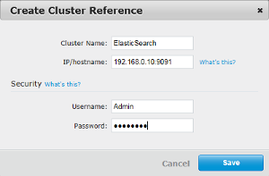
   
   *Création de la référence vers le nouveau cluster*

Une fois la connexion établie, on lance la réplication en cliquant sur le bouton « Create Replication ». Il faut saisir le bucket source et le bucket cible, qui est l’index précédemment créé sous Elasticsearch. Ensuite dans les paramètres avancés, il faut choisir la version 1 du protocole de réplication, qui établit une réplication avec le protocole REST. C’est ce qui est conseillé dans la documentation de Couchbase pour interfacer Elasticsearch. La version 2 du protocole est utilisée pour la réplication entre clusters Couchbase, celle-ci est basée sur un protocole REST mem-cached appelé XMEM mode pour des performances de réplication plus élevées.

Une fois validé, la réplication débute. Nous voyons que le déclencheur est spécifié sur l’évènement Changed et que la réplication est en cours.

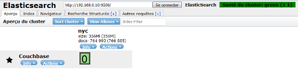
   
   *Réplication Cross Data Center en cours*

Puis sur l’interface d’Elasticsearch, nous voyons les documents répliqués arriver par lots. 
Pour finir nous avons 764 993 documents qui ont été reçus.


   
   *Index nyc du nœud Couchbase, possédant 764 993 documents, 1 shard, 0 réplique*

Afin de vérifier que l’indexeur interprète correctement les documents envoyés par Couchbase, nous pouvons aller dans les informations d’état du cluster, nous y voyons que les propriétés liées aux documents JSON du bucket NYC ont bien été récupérées. A gauche de l’interface nous voyons les champs disponibles préfixés de « doc ». Le type couchbaseDocument est créé par le plugin Elasticsearch sous la forme d’un objet possédant des propriétés, les champs du document. Le mapping est par défaut dynamique pour tous les champs de l’objet de type couchbaseDocument. Il est possible de créer des types pour différents documents contenus dans Couchbase, et d’associer un mapping spécifique pour chacun de ces types.

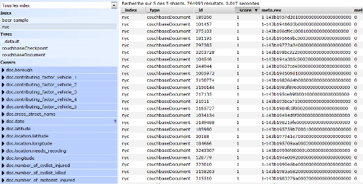
   
   *Information de l'état du cluster*

Requêtes de recherche par l'interface
=====================================

Notre réplication établie, nous pouvons commencer à exécuter des recherches par le serveur Elasticsearch. La requête {"query":{"query_string":{"query":"doc.borough:bronx"}}} retournera tous les documents trouvés selon ces critères. Cependant, seules les métadonnées des documents seront affichées, pas le contenu. Ce qui est un comportement standard. Le moteur renvoie l’Id du document qui fait partie des métadonnées. A charge de l’application client d’exécuter une requête sur la base pour récupérer les champs désirés. Dans notre cas, pour tout de même afficher le contenu des documents dans le résultat de la recherche, il faut modifier la configuration de la réplication dans le fichier de template du plugin Couchbase.
Dans le mapping entre Couchbase et Elasticsearch, il faut rajouter les champs sources disponibles. Par défaut seules les métadonnées étaient incluses, il faut rajouter doc.* dans la propriété multi-valuée includes.

.. code-block:: json

   {"_default_" : {
      "_source" : {
        "includes" : ["meta.*","doc.*"]
      },
      "properties" : {
        "meta" : {
          "type" : "object",
          "include_in_all" : false
        }
      }
    }
    }

Une fois le document édité, il est nécessaire de renvoyer le template à Elasticsearch par la 
commande vue plus haut, puis de supprimer et de recréer l’index. Cette fois, la requête de recherche ramènera bien 
le contenu des documents dans le résultat.


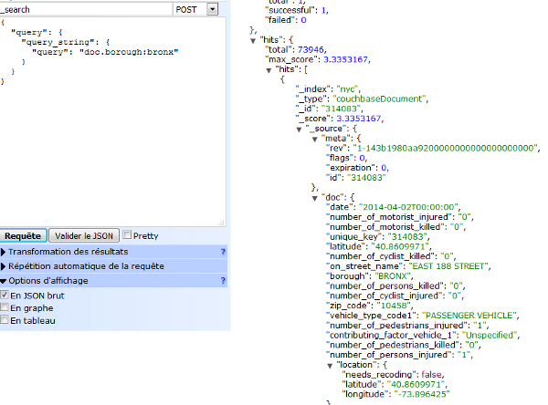
   
   *Résultat de la recherche dans l’index nyc*
   
Pour tester notre moteur de recherche nous allons effectuer une requête un peu plus complexe. 
La requête suivante permettra de rechercher les accidents mortels ayant eu lieu dans le Bronx, avec une voiture 
de sport, avec un conducteur en état d’ébriété.

.. code-block:: bash

   "query": "doc.borough:bronx AND doc.vehicle_type_code1:SPORT* AND doc.number_of_persons_killed : 
   [1 TO 10] AND doc.contributing_factor_vehicle_1: Alcohol Involvement"


Parmi les 764 993 documents nous n’obtenons qu’un seul résultat, une collision ayant eu lieu sur la rue GRAND CONCOURSE à 1h21 du matin.

Etude et discussion des résultats
=================================

Nous venons d’établir la réplication des données contenues dans Couchbase dans un serveur d’indexation permettant d’effectuer des recherches. Cette installation complète efficacement les fonctionnalités du cluster Couchbase en effet, nous avons vu qu’il était possible d’interroger Couchbase par son langage de requête N1QL ou par l’intermédiaire de vues Couchbase créées sur mesure. Ces deux possibilités sont ouvertes sur le protocole http, les vues ayant un temps de réponse très rapide mais qui nécessitent leur mise en place au préalable, au contraire des requêtes N1QL qui permettent une interrogation à la volée au détriment de la vitesse.
La mise en place du serveur Elasticsearch va concilier les deux, rapidité et flexibilité.

Reprenons l’exemple de la requête suivante : le nombre d’accidents mortels par arrondissements.
Si une vue est créée avec l’agrégation dans Couchbase, la réponse est immédiate. Alors 
qu’avec une requête N1QL, le temps de réponse sera de plus de 50 secondes. Essayons de faire la même 
requête mais au serveur Elasticsearch.
La syntaxe permettant d’ajouter une agrégation sera la suivante :

.. code-block:: json

   {
    "aggs": {
     "group_by_borough": {
            "terms": {
            "field": "doc.borough"
            }
          }
        }
     }
   
Dans la requête http au paramètre query, nous ajoutons après query_string, l’argument aggs qui contient le nom de l’agrégation et les champs sur lesquels elle est appliquée. En SQL nous aurions écrit GROUP BY Borough.


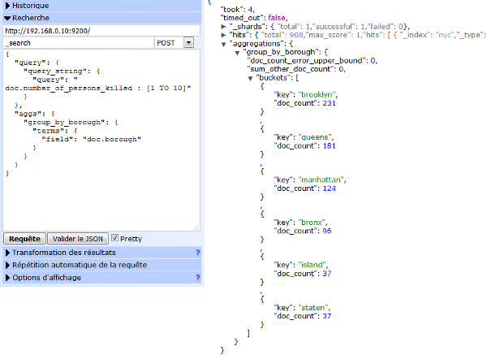
   
   *Requête de recherche avec agrégation* 
   
Dans la fenêtre de résultat nous voyons que la requête a été exécutée en 4 millisecondes. Comparé aux 55 secondes demandées 
par la requête directe N1QL, c’est plus de 10.000 fois plus rapide.

Seul bémol, les résultats diffèrent légèrement du résultat exact, pour Brooklyn le résultat attendu aurait dû être 
235 au lieu de 213. La propriété portant la valeur de l’arrondissement Staten Island a été coupé en deux termes distincts. 
Pour éviter que les termes soient coupés, il faut modifier le mapping du champ dans le fichier de configuration du plugin 
qui ici a été réglé sur dynamique. Le champ Borough a été traité comme texte et découpé en termes au lieu d’être traité 
comme une chaine de caractères. Quant à la légère différence de résultat, il faudrait très certainement pousser plus loin 
le paramétrage du moteur pour identifier la cause. Cette nécessité de paramétrage fin du moteur pour l’aligner avec 
les sources de données analysées est propre à toutes les implémentations de moteurs de recherche.

   
Mapping Elasticsearch
=====================

Nous venons de voir comment répliquer les données d’un bucket dans le serveur d’indexation. Nous avons vu que la 
configuration de la rivière de base est assez simple. C’est parce qu’un ensemble de paramètres sont inclus par défaut. 
Cependant il est possible de créer une configuration plus avancée afin de paramétrer le fonctionnement du serveur 
d’indexation selon nos souhaits. Pour illustrer les possibilités offertes par la configuration du serveur, je vais 
changer le jeu de données par un nouveau ensemble de documents qui se prêtera plus à des manipulations sur du texte.


Toujours sur la base de données Open Data de la ville de New-York, j’ai récupéré les annonces de recherche d’emploi. Je n’ai pas établi de processus spécifique pour récupérer les données, le principe a déjà été démontré au point III. 
La liste des offres d’emploi est disponible au format JSON à cette adresse :
https://nycopendata.socrata.com/City-Government/NYC-Jobs/kpav-sd4t.json

J’ai donc récupéré les annonces dans un document json appelé NYCJobs.json. Pour envoyer les données dans Couchbase, il faut découper nos documents en autant de fichiers distincts comme vu précédemment. J’ai utilisé le même script python. Il a cependant fallu l’adapter, les chaines de caractères contenues dans les annonces posaient un problème d’encodage. Il a fallu passer de l’UTF-8 à un encodage latin. Voici la ligne de script modifiée, en ayant importé la bibliothèque codecs :

.. code-block:: bash

   data = json.load(codecs.open(str(path+filename), encoding="ISO-8859-1"))

Une fois le script lancé, j’ai obtenu 2101 annonces distinctes, l’export en contenait deux fois plus mais elles étaient quasiment toutes doublées, le découpage par la propriété job_id a retiré les doublons. J’ai procédé à la création d’un nouveau bucket dans Couchbase appelé JOBS et d’un index dans elasticsearch, jobs également. L’import  dans Couchbase s’est fait par l’utilitaire cbdocloader déjà évoqué. 
   
Les documents JSON des annonces d’emplois contiennent un certain nombre de propriétés, je ne vais pas les décrire, ce n’est pas l’objectif ici. J’évoque seulement celles qui nous intéressent : 

- business_title : titre de l’annonce
- job_description : description de l’emploi

La procédure de création de la réplication vers Elasticsearch est la même. Je ne détaille pas. Je vais au contraire m’attacher à décrire les possibilités offertes par le mapping et ensuite par la configuration de l’analyseur.

Nous avons vu précédemment que dans le fichier couchbase_template.json sont spécifiés les propriétés du mapping entre les documents envoyés par Couchbase et les documents insérés dans Elasticsearch. Je vais détailler la configuration.

La propriété "template" : "*" indique que ce qui est défini après, s’applique pour tous les index. Si l’on remplace * par le nom d’un index alors le template ne s’appliquera que pour cet index en particulier. Cela permet de créer des comportements différents pour chaque réplication vers l’indexeur. 

La propriété order permet de gérer l’ordre dans lequel sont appliqué les templates lorsque ceux-ci s’appliquent sur un même index.
Le mapping se fait par types de documents, la propriété _default_ indique que le mapping sera fait pour tous les documents. Il est d’ores et déjà possible de restreindre le mapping sur les documents de Couchbase en replaçant cette valeur par couchbaseDocument.
La propriété _source indique ce qui sera conservé dans l’indexeur comme champ source disponible pour un document, c’est-à-dire non traité par l’analyseur, conservé intact afin de pouvoir le consulter. Comme nous l’avions vu, par défaut, source contient "includes" : ["meta.*"]. Ce qui signifie que seules les métadonnées des documents seront affichées dans les résultats d’une requête de recherche. Pour rajouter tous les champs dans les résultats de recherche il faut modifier cette ligne en "includes" : ["meta.*","doc.*"].

J’ai rajouté la propriété doc pour les documents Couchbase afin de pouvoir réaliser le mapping. 

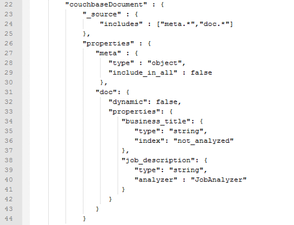
   
   *Mapping*

La propriété dynamic est passé à false pour indiquer que le mapping et manuel. Ensuite il faut spécifier les champs qui seront analysés. J’ai repris les deux champs mentionnés auparavant, business_title et job_description. Les deux sont marqués en tant que chaine de caractères. Pour business_title, la propriété index est sur not_analyzed. Cela signifie qu’aucun analyseur ne fera de traitement sur la propriété business_title. Ainsi les valeurs ne seront pas tokenisées.  C’est utile lorsque l’on souhaite qu’une chaine de caractère ne soit pas découpée pour gader son sens. 
Je souhaite regrouper toutes les offres d’emplois sur le nom du job. Si le champ est analysé, alors il sera tokensisé, dans ce cas le regroupement se fera sur chaque partie de mots, comme montré dans la capture ci-dessous : bureau, health, director etc… Ce qui n’a pas de sens. Vous remarquerez que des mots inutiles apparaissent comme des tokens : of, and, etc. Nous verrons comment gérer les stopwords ensuite.

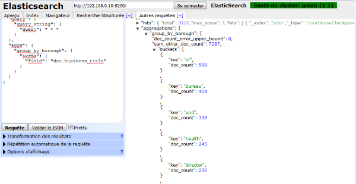
   
   *Regroupement sur des tokens* 
   
Lorsque l’on ajoute l’entrée index : not_analyzed pour le champ business_title, voici le résultat avec la même requête, après recréation de l’index.


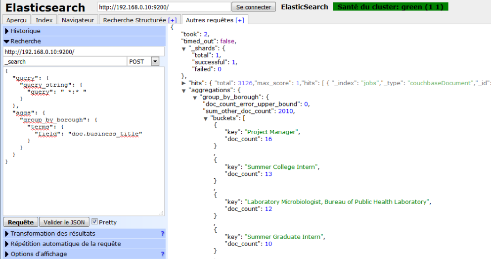
   
   *Regroupement sur la chaine complète*  

Par défaut le système retourne 10 valeurs pour un regroupement. Pour retourner plus de valeurs, il est possible de rajouter la propriété size en dessous de field, dans les termes de l’agrégation. A zéro, toutes les valeurs sont affichées.

Le mapping permet d’autres types de configuration, il est par exemple possible de spécifier ou de forcer le type d’un champ en un entier, un géocode, une date. Il est également possible aussi pour chaque propriété de dire si elle sera stockée ou non par la propriété store. Valable pour le cas où source est à false et pour des cas bien précis. Pour traiter les valeurs contenues dans les propriétés des documents, il faut créer un analyseur. Ce que nous allons voir.

Création d'un analyseur
=======================

Un analyseur peut être déclaré dans un fichier de configuration, puis associé à un index lors de la création de celui-ci 
par une requête Curl. Je déclare l’analyseur personnalisé en créant un fichier appelé JobAnalyzer.json dans le répertoire 
config. L’analyseur est spécifié au moment de la création de l’index par la commande : 

.. code-block:: bash

   curl -XPUT http://192.168.0.10:9200/jobs -d @E:\NFE204DATA\cbelastic\config\JobAnalyzer.json

La commande suivante permet de tester un analyseur d’un index en lui envoyant une chaine :

.. code-block:: bash

   curl -XGET http://192.168.0.10:9200/jobs/_analyze?analyzer=JobAnalyzer -d "this is a test"


Il existe des analyseurs par défaut, dont l’analyseur standard, english, french, etc. Il est possible de tester 
au préalable un analyseur avant d’injecter les données dans un index. Voici comment on procède par une requête Curl, 
sur l’index jobs :

.. code-block:: bash

   curl -XGET http://192.168.0.10:9200/jobs/_analyze?analyzer=standard -d "this is a test"

La console donnera 4 tokens alphanumériques :

.. code-block:: bash

   {"tokens":[{"token":"this","start_offset":0,"end_offset":4,"type":"<ALPHANUM>","position":0},
   {"token":"is","start_offset":5,"end_offset":7,"type":"<ALPHANUM>","position":1},
   {"token":"a","start_offset":8,"end_offset":9,"type":"<ALPHANUM>","position":2},
   {"token":"test","start_offset":10,"end_offset":14,"type":"<ALPHANUM>","position":3}]}

Nous voyons que des mots inutiles sont tokensisés. Changeons d’analyseur pour celui dédié au vocabulaire anglais.

.. code-block:: bash
   
   curl -XGET http://192.168.0.10:9200/jobs/_analyze?analyzer=english -d "this is a test"

La console ne donnera plus qu’un seul token alphanumérique :

.. code-block:: bash

   {"tokens":[{"token":"test","start_offset":10,"end_offset":14,"type":"<ALPHANUM>","position":3}]} 

Les mots vides ont été retirés par l’analyseur english d’Elasticsearch, pour ne garder que le terme test. Les stopwords de l’analyseur English sont les suivants :

.. code-block:: bash

   a, an, and, are, as, at, be, but, by, for, if, in, into, is, it,
   no, not, of, on, or, such, that, the, their, then, there, these,
   they, this, to, was, will, with

Il est possible de créer sa propre liste de stopwords. Le fichier texte est à déposer dans le répertoire config d’Elasticsearch avec un mot sur chaque ligne. Il faut rajouter la ligne "stopwords_path": "stopwords/CustomStopWords.txt" dans le fichier de configuration de l’analyseur.
Ayant placé le terme « test » dans une nouvelle liste de stopwords pour la langue anglaise récupérée sur le site ranks.nl, aucun token n’est créé si j’envoie la même requête. 

.. code-block:: bash

   {"tokens":[]} 


Envoyer pour analyse « this is a test for my indexer » retourne le résultat suivant :

.. code-block:: bash
 
   {"tokens":[{"token":"index","start_offset":22,"end_offset":29,"type":"<ALPHANUM>","position":6}]} 

Seul « indexer » a été tokenisé, en un terme « index ». C’est le stemming qui a normalisé le mot.


Stemming
--------

Pour mettre en place un stemming personnalisé, j’ai créé un nouvel analyseur appelé JobAnalyzerStem. Il faut retirer la propriété "type":"english" car nous définissons notre propre stemming. L’analyseur english d’elasticsearch est configuré de façon identique à celui de Lucene (en annexe la description des filtres), avec une configuration préétablie et prête à l’emploi. Ici nous en créons un nouveau pour l'exemple. Le nouvel analyseur définit une surcharge du stemmer pour forcer la substitution de mots par d’autres au travers de la propriété rules.  Il est également possible de retirer certains termes du stemmer en déclarant un nouveau filtre de type keyword_marker et en plaçant les mots dans un tableau.

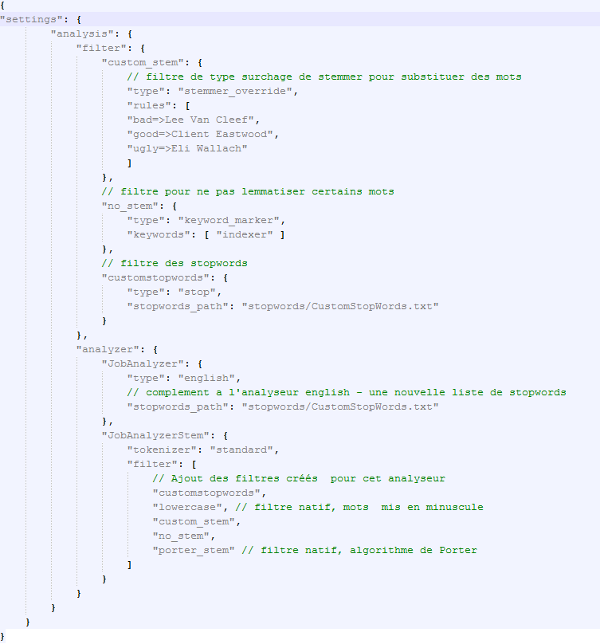
   
   *Fichier de configuration des analyseurs JobAnalyzer.json*

Les mots placés dans la propriété rules font référence au film de Sergio Leone : The Good, the Bad and the Ugly, avec pour chaque personnage, le nom de l’acteur. Le terme « indexer » qui a été lemmatisé en « index » est placé dans la liste des mots ne devant plus être transformés. L’analyse de la phrase « this is a test for the good the bad and the ugly in the indexer » produira donc les tokens suivants:

.. code-block:: json

   {"tokens":[{"token":"Client Eastwood","start_offset":23,"end_offset":27,"type":"
   <ALPHANUM>","position":6},{"token":"Lee Van Cleef","start_offset":32,"end_offset
   ":35,"type":"<ALPHANUM>","position":8},{"token":"Eli Wallach","start_offset":44,
   "end_offset":48,"type":"<ALPHANUM>","position":11},{"token":"indexer","start_off
   set":56,"end_offset":63,"type":"<ALPHANUM>","position":14}]}

Les termes bad, good et ugly ont été remplacés par le nom des acteurs par le filtre custom_stem, le terme indexer n’a pas été normalisé par le biais du filtre no_stem et les stopwords n’ont pas été tokensisés. Ce qui montre le bon fonctionnement de l’analyseur.

Mise en place de l'analyseur
----------------------------

Je vais mapper l’analyseur JobAnalyzer de type english sur le champ job_description. L’analyseur avec le stemming a été configuré pour démontrer le principe. Le premier suffit dans notre cas. La configuration d’un analyseur est un fin paramétrage qui peut nécessiter beaucoup de temps, d’essais et de compromis pour obtenir un résultat satisfaisant.

Avec la commande de création vu précédemment, je recréé l’index jobs dans elasticsearch puis je renvoie le fichier de config pour la rivière couchbase avec la modification ci-dessous :

.. code-block:: javascript

   "job_description": {
     "type": "string",
     "analyzer": "JobAnalyzer"
   }

Il devient possible d’exécuter des requêtes de recherche sur le champ job_description au travers de l’interface web d’Elasticsearch. La requête "query": "doc.job_description : this,is,a,test" retournera null. Les mots sont tous des stopwords ajoutés à l’analyseur pour ce champ. Si la requête est appliquée sur d’autres champs alors des résultats seront retournés.

La requête "query": "doc.job_description : this,is,a,test,Database,Administration" donnera des résultat sur les termes Database et Administration seulement. Il est possible d’avoir le détail du calcul du classement en ajoutant  "explain": true à la requête. Dans la capture ci-dessous, dans le nœud explanation nous voyons le calcul du score qui est composé du score de deux termes, database avec un score à 0.695 et administration avec un score à 0.161 pour le champ job_description.

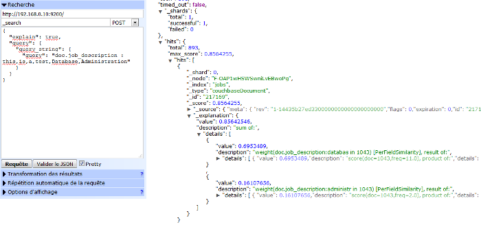
   
   *Calcul du score par l’analyseur*

Le champ description du résultat indique les résultats du classement et le calcul du poids tf-idf des termes database et administration.

Ces tests démontrent la bonne prise en compte de l’analyseur défini précédemment sur le champ job_description lors de l’indexation des données envoyées par Couchbase.

Nous avons vu que l’interface offerte par Elasticsearch offre de très bonne performances pour les requêtes de recherche avec une forte flexibilité. Pour autant cela ne remet pas en cause les services offerts nativement par Couchbase qui sont dédiés à des usages différents. C’est bien pour cette raison que le projet Couchbase propose un module d’intégration avec Elasticsearch. Couchbase s’intègre aussi avec Hadoop, Spark et Kafka. Concernant la partie recherche d’informations, il n’existe pas encore de module pour Solr, dommage, à l’issu du cours j’ai eu une préférence pour la simplicité et l’ergonomie de l’interface Solr comparé à celle d’Elasticsearch.

Annexes
=======

1. Références
-------------

Couchbase
`````````

| `Les index <http://developer.couchbase.com/documentation/server/4.1/concepts/indexing.html>`_
|
| `Plan d'execution des requêtes N1QL <http://blog.couchbase.com/sql-for-documents-n1ql-brief-introduction-to-query-planning>`_
| 
| `Créer des documents dans Couchbase par l’api <RESThttp://stackoverflow.com/questions/24528318/create-couchbase-documents-via-rest-api>`_
| 
| `Charger des fichiers JSON massivement dans Couchbase <http://blog.couchbase.com/loading-json-data-couchbase>`_
| 
| `Le langage N1QL <http://developer.couchbase.com/documentation/server/4.1/n1ql/n1ql-language-reference/index.html>`_
| 
| `Exemples N1QL <http://docs.couchbase.com/files/Couchbase-N1QL-CheatSheet.pdf>`_

Socrata
```````

| `NYC Open Data <https://nycopendata.socrata.com/>`_
| 
| `API SODA <https://dev.socrata.com/>`_
| 
| `SoQL <https://dev.socrata.com/docs/queries/>`_

Elasticsearch
`````````````

| `Mapping <https://www.elastic.co/guide/en/elasticsearch/reference/current/mapping.html>`_
| 
| `Analyse <https://www.elastic.co/guide/en/elasticsearch/reference/current/analysis.html>`_
| 
| `EnglishAnalyser <http://lucene.apache.org/core/4_7_2/analyzers-common/index.html?org/apache/lucene/analysis/en/EnglishAnalyzer.html>`_


2. Compléments
--------------

Requêtes N1QL avec curl
```````````````````````

Extraire toutes les coordonnées GPS

.. code-block:: bash

     curl -v http://localhost:8093/query/service 
       -d "statement=SELECT unique_key, latitude, longitude FROM NYC" > E:\outputGPS.txt

Extraire les coordonnées GPS à la date du 31 décembre

.. code-block:: bash

     curl -v http://localhost:8093/query/service 
      -d "statement=SELECT unique_key, latitude, longitude, date FROM NYC WHERE STR_TO_MILLIS(date) 
       BETWEEN STR_TO_MILLIS('2015-12-31') AND STR_TO_MILLIS('2016-12-31') " > E:\outputGPS31Dec.txt

Extraire les coordonnées GPS en Janvier sur Brooklyn

.. code-block:: bash
   
   curl -v http://localhost:8093/query/service 
   -d "statement=SELECT unique_key, latitude, longitude, date, borough FROM NYC WHERE 
   borough = 'BROOKLYN' AND STR_TO_MILLIS(date) BETWEEN STR_TO_MILLIS('2015-01-01') 
   AND STR_TO_MILLIS('2015-12-31') " > E:\outputGPSBrooklyn2016.txt
