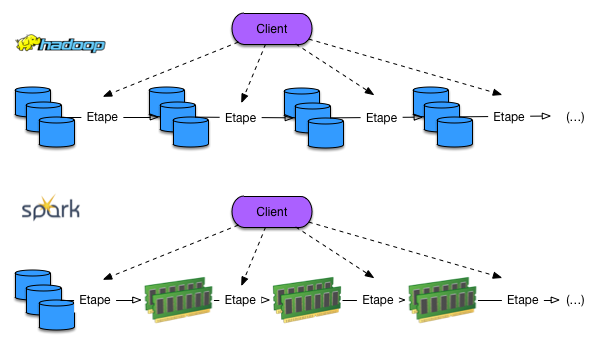
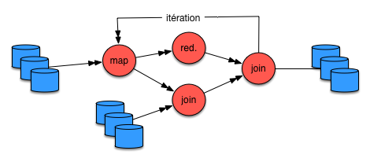

Itération dans Flink
====================

Flink propore *nativement* un opérateur d'itération qui constitue un  point fort du système.
Un système uniquement basé sur MapReduce effectue une chaîne de traitement très simple
qui ne permet pas de traiter en boucle un jeu de données jusqu'à ce qu'un
certain résultat soit atteint. Or les algorithmes qui requièrent ce type 
d'itération sont très nombreux, notamment pour le traitement des graphes et
la fouille de données. Par exemple:

  - l'algorithme de *k-means* identifie *k* groupes en ré-itérant une étape
    qui affecte chaque document à un centre, puis recalcule les centres
    en fonction du regroupement obtenu; l'agorithme cesse quand les centres
    ne bougent plus (convergence);
  - l'algorithme *PageRank* affecte un poids à chaque nœud  d'un graphe
    (voir le chapitre :ref:`chap-ranking`) et itère jusqu'à ce qu'une situation
    stable soit atteinte (les poids ne bougent plus).
    
Dans les deux cas, l'itération se poursuit jusqu'à atteindre un *point fixe*
considéré comme le résultat final. Si la convergence vers un point fixe n'est 
pas garantie, on peut remplacer le critère de convergence par un nombre
fixe d'itération, ou décider de tout autre critère d'arrêt. 

Un système comme Hadoop qui s'appuie sur un modèle d'exécution MapReduce
ne sait pas effectuer ce type d'itération, et l'implantation de ce type
d'algorithme repose donc sur un contrôle délégué à l'application cliente
(:numref:`iteration-comparison`). C'est pénible à faire car
la sortie d'une étape sert le plus souvent d'entrée à l'étape suivante, et il 
faut donc par programmation gérer des tâches de bas niveau. De plus les
performances risquent d'être sévèrement impactée par la nécessité de lire et d'écrire
sur les disques l'ensemble des données à chaque itération.

.. _iteration-comparison:

   
      Itération dans Spark/Hadoop 
      

Un système comme Spark apporte une amélioration (forte) en permettant le stockage
des résultats intermédiaires.
   
.. _iteration-flink:

   
      Itération dans Flink

Cf.  
http://flink.incubator.apache.org/docs/0.7-incubating/iterations.html
 

Description:

  * Les données en entrée sont constituées au départ du flux 
    de données initial puis de la solution de la précédente 
    itération [1] 
  * La fonction de pas est composée d’un dataflow défini 
    par l’utilisateur (Ex. un filtre, un mappage, un reduce) 
    [2]. L’itération se poursuit jusqu’à ce qu’une certaine 
    condition soit satisfaite (nombre maximum d’itérations 
    ou convergence de la solution).
  * À chaque itération l’input sera constitué du résultat 
    de l’itération précédente [3]
  * Le résultat de l’itération peut être utilisé par un 
    autre opérateur (si la chaine de traitement continue), 
    affiché ou écrit sur disque [4]

.. _Ch2_S2_1_Flink_Operateur_Iterate:
.. figure:: ./figures/Ch2_S2_1_Flink_Operateur_Iterate.PNG
      :width: 50%
      :align: center
   
      Opérateur Iterate

*Delta Iterate* : 
Cet opérateur est appliqué sur une partie des données 
à chaque itération, ce qui a pour effet d’accélérer la 
convergence des algorithmes. Il est approprié dans le 
cas d’itérations incrémentales, où la solution n’est pas 
recalculée mais mise à jour avec les nouvelles données 
(un K-Means stochastique par exemple). 

  * La solution précédente et les nouvelles données 
    sont passées dans le dataflow [1]
  * Le résultat intermédiaire permet de mettre à jour 
    la solution et sert d’input à l’itération suivante [3] 

.. _Ch2_S2_2_Flink_Operateur_Delta_Iterate:
.. figure:: ./figures/Ch2_S2_2_Flink_Operateur_Delta_Iterate.PNG
      :width: 50%
      :align: center
   
      Opérateur Delta Iterate

Contrôle de la latence
======================

Pour ne pas induire de trafic réseau inutile, les éléments d’un 
flux ne sont pas transférés un par un. Flink attend d’avoir un 
certain nombre d’éléments qu’il conserve en tampon (*buffer*) 
pour les envoyer. Cela peut causer des problèmes de latence 
lorsque la fréquence des données est faible. 

Il est possible de paramétrer un temps d’attente maximal 
sur tout le traitement ou sur un opérateur en particulier, 
en spécifiant l’argument *setBufferTimeout(timeoutMillis)*. 
Flink attendra le temps défini et transmettra le paquet 
que celui-ci soit rempli ou non.

**********************************************************************
S3: Cas Pratique : Utilisation de Flink pour récupérer le flux Twitter
**********************************************************************

3.1. Création d’un cluster Flink avec Docker
============================================

Nous avons choisi Docker pour étudier le fonctionnement 
de Flink car c’est un bon outil de virtualisation permettant 
de simuler un environnement distribué sur une machine locale.

Une image officielle de Flink existe depuis la version 1.2 
et est maintenue par la communauté Flink et les équipes 
Docker. Lors de l’exécution de la première instruction de 
création, Docker vérifie si l’image est disponible en local. 
S’il ne la trouve pas, il la télécharge à partir du 
site Docker Hub.

Il est possible de créer un cluster directement avec 
Docker-compose mais nous avons préféré télécharger l’image 
Flink officielle, créer des containers en leur affectant 
un rôle puis les connecter entre eux.

Notre cluster contient un JobManager et trois TaskManagers :

.. _Ch3_S1_1_Flink_Cluster_Docker:
.. figure:: ./figures/Ch3_S1_1_Flink_Cluster_Docker.PNG
      :width: 50%
      :align: center
   
      Schéma du cluster Flink avec Docker

Nous avons fixé les paramètres suivants pour 
chaque container :

+----------------+---------------------+--------------+--------------+--------------+------------+
| **Rôle**       | Job Manager         | Task Manager | Task Manager | Task Manager |            |
+================+=====================+==============+==============+==============+============+
| **Nom**        | flink1              | flink2       | flink3       | flink4       |            |
+----------------+---------------------+--------------+--------------+--------------+------------+
| **Adresse IP** | 192.168.99.100      |              |              |              |            |
+----------------+---------------------+--------------+--------------+--------------+------------+
|                | *Web Client*        | 8081:8081    | 8182:8081    | 8183:8081    | 8184:8081  |
+----------------+---------------------+--------------+--------------+--------------+------------+
|                | *Job Manager RPC*   | 6123:6123    |              |              |            |
+----------------+---------------------+--------------+--------------+--------------+------------+
|                | *Task Manager RPC*  |              | 61222:6122   | 61223:6122   | 61224:6122 |
+----------------+---------------------+--------------+--------------+--------------+------------+
|                | *Task Manager Data* |              | 61212:6121   | 61213:6121   | 61214:6121 |
+----------------+---------------------+--------------+--------------+--------------+------------+

Ci-dessous le code pour créer chaque container :

  * Création du job manager

::

  docker run -d --name flink1 -p 8081:8081 -p 6123:6123 
  -v /c/Users/cat_c/Documents/CNAM/nfe204/dataSwap/:/donnees 
  -e JOB_MANAGER_RPC_ADDRESS=192.168.99.100 flink jobmanager

  * Création des task managers

::

  docker run -d --name flink2 -p 8082:8081 -p 61222:6122 -p 61212:6121 
  -v /c/Users/cat_c/Documents/CNAM/nfe204/dataSwap/:/donnees 
  -e JOB_MANAGER_RPC_ADDRESS=192.168.99.100 flink taskmanager
  docker run -d --name flink3 -p 8083:8081 -p 61223:6122 -p 61213:6121 
  -v /c/Users/cat_c/Documents/CNAM/nfe204/dataSwap/:/donnees 
  -e JOB_MANAGER_RPC_ADDRESS=192.168.99.100 flink taskmanager
  docker run -d --name flink4 -p 8084:8081 -p 61224:6122 -p 61214:6121 
  -v /c/Users/cat_c/Documents/CNAM/nfe204/dataSwap/:/donnees 
  -e JOB_MANAGER_RPC_ADDRESS=192.168.99.100 flink taskmanager

Paramètres de création du JobManager :

.. csv-table:: 
   :header: Instruction, Explication
   :widths: 80, 100

   "*docker run -d*", "Le -d permet de lancer le container en 
   tâche de fonds et imprime l’Id du container"
   "*--name flink1*", "Nom du container"
   "*-p 8081:8081*", "Numéro de port de l’interface web 
   du JobManager Flink exposé sur la machine Docker"
   "*-p 6123:6123*", "Numéro de port par défaut du 
   JobManager exposé sur la machine Docker"
   "*-v /c/Users/cat_c/Documents/
   CNAM/nfe204/dataSwap/:/donnees -e*", "Répertoire 
   partagé pour faciliter la modification 
   en local des fichiers de paramétrage notamment 
   du fichier *conf/flink-conf.yaml*"
   "*JOB_MANAGER_RPC_ADDRESS=192.168.99.100*", "Adresse 
   IP du JobManager sur laquelle les 
   TaskManagers se connectent (ici c’est l’adresse 
   IP de la machine docker)"

 
Pour lancer le cluster via Docker CLI :

.. _Ch3_S1_2_Docker_Lancement_des_4_containers:
.. figure:: ./figures/Ch3_S1_2_Docker_Lancement_des_4_containers.PNG
      :width: 80%
      :align: center
   
      Lancement du cluster Flink avec la CLI Docker

Au lancement des containers, les TaskManagers se connectent au JobManager. 
Et le JobManager détecte qu’il y a trois Task Slots disponibles 
(1 Task Slot par TaskManager).

JobManager :

.. _Ch3_S1_3_Flink_Cluster_Docker_JobManager:
.. figure:: ./figures/Ch3_S1_3_Flink_Cluster_Docker_JobManager.PNG
      :width: 100%
      :align: center
   
      Lancement du JobManager dans Docker (Kitematic)

TaskManager :

.. _Ch3_S1_4_Flink_Cluster_Docker_TaskManager:
.. figure:: ./figures/Ch3_S1_4_Flink_Cluster_Docker_TaskManager.PNG
      :width: 100%
      :align: center
   
      Lancement du TaskManager avec Docker

L’interface web du JobManager (192.168.99.100 :8081) offre un tableau 
de suivi global des jobs et permet de lancer des traitements 
en cliquant sur *Submit new Job* puis sur *Add New* :

.. _Ch3_S1_4_Flink_Cluster_Docker_WebInterface:
.. figure:: ./figures/Ch3_S1_4_Flink_Cluster_Docker_WebInterface.PNG
      :width: 90%
      :align: center
   
      Interface web du JobManager

3.2. Récupération du flux Twitter
=================================

3.2.1. Création d’une application Twitter et génération des codes d’accès à l’API
---------------------------------------------------------------------------------

Pour requêter twitter, il faut avoir un compte puis 
créer une application permettant de générer les 
codes de sécurité. Cette procédure permet 
d’éviter d’exposer en dur les paramètres d’accès 
dans le code.

Il faut se connecter au site https://apps.twitter.com/
avec ses identifiants Twitter, cliquer sur 
‘Create New App’ puis compléter le formulaire :

.. _Ch3_S2_1_Twitter_CreationAppli:
.. figure:: ./figures/Ch3_S2_1_Twitter_CreationAppli.PNG
      :width: 50%
      :align: center
   
      Formulaire de création d'une application Twitter

Une fois l’application créée, on peut générer les codes d’accès :

.. _Ch3_S2_2_Twitter_ExempleClesConnexion:
.. figure:: ./figures/Ch3_S2_2_Twitter_ExempleClesConnexion.PNG
      :width: 50%
      :align: center
   
      Clés de connexion à l'API Twitter

3.2.2. Récupération d’un flux de tweets
---------------------------------------

Le code suivant permet :

* d’initialiser l’environnement d’exécution en y 
  ajoutant deux paramétrages : l’activation des 
  checkpoints (pour la reprise sur panne) et la 
  définition d’une stratégie de redémarrage :

::

     // Récupération de l’environnement d’exécution Flink
     val env = StreamExecutionEnvironment.getExecutionEnvironment
     
     // Activation du Checkpointing
     // start a checkpoint every 1000 ms
     env.enableCheckpointing(1000)
     // set mode to exactly-once (this is the default)
     env.getCheckpointConfig.setCheckpointingMode(CheckpointingMode.EXACTLY_ONCE)
    
     //Définition d’une stratégie de redémarrage
     // Faire 3 tentatives toutes les 10 secondes
     env.setRestartStrategy(RestartStrategies.fixedDelayRestart(3, 10))

* Puis de récupérer les tweets en se connectant sur 
  l’API de Stream de Tweeter grâce aux 
  différentes clés obtenues.
  
Par défaut Twitter renvoi un échantillon aléatoire de tweets 
(indépendamment de la région et de la langue). Nous 
avons décidé de cibler un peu plus le flux à l’aide de mots 
clés. La fonctionnalité Endpoint du connecteur Twitter le permet. 
Twitter renvoi alors le flux de tweets qui contiennent uniquement 
les mots clé saisis. Par exemple, si l’utilisateur souhaite isoler 
le flux qui concerne le défilé du 14 juillet, on pourra passer 
cette liste de mots [“défilé”, “14 juillet”, “parade”, “feux d’artifice”]. 
La liste des mots clé peut aussi comporter des sujets très 
différents comme [“pizza”, “Nantes”] :

::

  // Création d’un Endpoint (cf. API Twitter) pour filtrer sur nos mots clé
  class myFilterEndpoint extends TwitterSource.EndpointInitializer with Serializable {
      @Override
      def createEndpoint(): StreamingEndpoint = {
          val endpoint = new StatusesFilterEndpoint()
          endpoint.trackTerms(getTermes.asJava)
          return endpoint
      }
      
      def getTermes(): List[String] = {
        return termes.split("&").toList
      }
  }

3.2.3. Format des données récupérées
------------------------------------

L’unité de base que l’on peut récupérer via 
l’Api est le tweet. Le tweet renvoyé est au format 
JSON et contient plusieurs champs. Voici un extrait 
aléatoire de tweet (mot-clé : Macron) :

.. _Ch3_S2_3_Twitter_TweetExBrut:
.. figure:: ./figures/Ch3_S2_3_Twitter_TweetExBrut.PNG
      :width: 80%
      :align: center
   
      Echantillon de tweet

Le fichier contient plusieurs champs, il commence 
par un horodatage et se termine par un timestamp propre 
à Twitter. Les champs disponibles sont notamment le 
contenu texte du tweet lui-même (ici en gras), 
l’identification de l’utilisateur, toute la chaine 
de retweets et des réponses avec l’identification 
de leurs auteurs. Les caractéristiques des images 
ou des liens intégrés au tweet, etc.

3.2.4. Retraitement et écriture des tweets dans un fichier texte
----------------------------------------------------------------

Les données brutes contiennent des caractères 
spéciaux et des accents qui sont retranscrits en 
Unicode. Nous avons ajouté une fonction qui 
permet de convertir ces caractères en codage utf-8 :

::

  def unescapeUnicode(str: String): String = {
      return """\\u([0-9a-fA-F]{4})""".r.replaceAllIn(str, 
          m => Integer.parseInt(m.group(1), 16).toChar.toString)
  }

Par ailleurs, nous avons décidé de conserver uniquement 
le contenu textuel du tweet pour plus de lisibilité et 
réduire le poids des enregistrements (même si ce n’est 
pas vraiment un enjeu dans ce cadre). Afin de parfaire 
son nettoyage, avons ajouté une fonction qui retraite 
les caractères ‘\n’ (passage à la ligne) :

::

  // Ne conserve que le texte du tweet
  def getweet(s : String): String = {
    //val deb : Int = s.indexOf("text") + 7
    val milieu : String = s.split("\"" + "," + "\"")(2).splitAt(7)._2
    return milieu
  }
  // Retraite les ‘\n’
  def dernierNettoyage(str: String): String = {
    return str.replaceAll("\\n", " | ").replace("\\", "")
  }

Après ce retraitement, le tweet en exemple se transforme 
en une simple ligne de texte : 

    « RT @magdalakoff : Formidable @edwyplenel, qui a 
   appelé à voter Macron de toutes ses forces et “SURTOUT 
   PAS le bolivarien…” »

3.2.5. Comptage des tweets par fenêtre de temps et par mot clé
--------------------------------------------------------------

Une fois les tweets récupérés, et pour comparer la popularité 
des mots clé choisis, nous les avons comptés sur une 
fenêtre de temps exclusive (sans chevauchement) de 
durée paramétrable et avons écrit le résultat en sortie 
console et dans un fichier texte. (cf. code complet en annexe)

3.3. Fonctionnement de l’application dans Flink
===============================================

Nous avons compilé l’application et avons généré fat jar 
(incluant en plus des classes toutes les librairies nécessaires 
pour fonctionner), que nous avons chargé dans l’interface 
du JobManager.

3.3.1. Flink en local
---------------------

Cette interface illustre la soumission de Job à Flink. 
Import du .jar et renseignement du nom de la classe 
principale et des arguments. 

.. _Ch3_S3_1_Flink_enLocal_SoumissionJob:
.. figure:: ./figures/Ch3_S3_1_Flink_enLocal_SoumissionJob.PNG
      :width: 90%
      :align: center
   
      Soumission de Job à Flink

Nous pouvons suivre la progression du job en 
cliquant sur Running Jobs puis sur le job 
en cours :

.. _Ch3_S3_2_Flink_enLocal_DataFlow:
.. figure:: ./figures/Ch3_S3_2_Flink_enLocal_DataFlow.PNG
      :width: 90%
      :align: center
   
      Dataflow et suivi de la progression du Job

Flink affiche le dataflow ainsi que la progression 
du flux reçu et envoyé.

Flink affiche aussi la planification des tâches 
du dataflow sur la ligne de temps, avec l’heure 
de démarrage de chaque opérateur :  

.. _Ch3_S3_3_Flinc_enLocal_Timeline:
.. figure:: ./figures/Ch3_S3_3_Flinc_enLocal_Timeline.PNG
      :width: 70%
      :align: center
   
      Time Line des tâches

Nous avons affiché les résultats via la console et 
dans d’un fichier texte. L’interface web permet 
de visionner la sortie console (dans le 
panneau Task Managers puis l’onglet Stdout) :

.. _Ch3_S3_4_Flinc_enLocal_SortieConsole:
.. figure:: ./figures/Ch3_S3_4_Flinc_enLocal_SortieConsole.PNG
      :width: 70%
      :align: center
   
      Sortie en console des résultats

3.3.2. Erreur Flink dans Docker
-------------------------------

Nous avons tenté de charger le job en suivant 
la même procédure sur le cluster Docker mais 
l’accès des TaskManagers au serveur Blob a 
été refusé. Le serveur Blob est le serveur 
sur lequel les TaskManagers se connectent pour 
récupérer le .jar à exécuter.

.. _Ch3_S4_1_Flink_enCluster_Erreurs_Blob:
.. figure:: ./figures/Ch3_S4_1_Flink_enCluster_Erreurs_Blob.PNG
      :width: 100%
      :align: center
   
      
.. _Ch3_S4_2_Flink_enCluster_Erreurs_Blob:
.. figure:: ./figures/Ch3_S4_2_Flink_enCluster_Erreurs_Blob.PNG
      :width: 100%
      :align: center
   
      Cluster docker Erreur serveur Blob

Les messages en capture nous montrent que le JobManager initialise 
bien le traitement et démarre le planificateur de tâches et tente 
d’initialiser le workflow. Nous pensons que le problème vient 
du protocole de transfert des fichiers utilisé par Flink. Les 
contributeurs conseillent de déployer le cluster en utilisant 
Yarn -qui intégre un canal propre de transfert des fichiers- ou de 
modifier le fichier de configuration dans *conf/flink-conf.yaml*. 
Nous avons arrêté nos investigations à ce niveau.

**********
Conclusion
**********

Flink est un système certes jeune mais 
dispose déjà d’une large palette de fonctionnalités. 
Il est difficile dans un exercice de 30 pages d’aller 
en profondeur, nous avons fait le choix de l’analyse 
théorique et pratique de son API de Streaming.

Nous constatons que Flink offre de nombreux 
avantages : le traitement en temps réel des flux 
avec une grande flexibilité au niveau du fenêtrage, 
la possibilité d’affecter les événements aux bonnes 
fenêtres, la lecture de nombreux formats de données 
et la possibilité d’ajouter des formats personnalisés.

Du point de vue pratique, nous avons pu vérifier 
que Flink est un système facile à installer en local 
ou via Docker et son interface JobManager constitue 
un plus dans son utilisation en offrant un panorama 
complet de l’état du système et de l’avancement en 
temps réel des traitements, ainsi que la facilité 
de charger et le fichier .jar et les paramètres 
de l’application.

Au rang des défauts, notons une documentation 
pas toujours aisée à comprendre pour un néophyte. 
En l’occurrence, nous n’avons pas pu résoudre notre 
problème Blob server sur le cluster Docker.

Néanmoins, nous restons positifs sur son 
développement futur et sur l’élargissement 
de la communauté des contributeurs. En effet, 
Flink est de plus en plus connu et adopté grâce 
au Flink Forward (conférence annuelle réunissant 
les utilisateurs et les personnes intéressées 
par Flink) et par les évolutions des traitements 
de masse en temps réel.

.. rubric:: **Notes**

.. [#] Pour la documentation sur Zookeeper voir : http://zookeeper.apache.org/
.. [#] Les Checkpoints sont désactivés par défaut. 
       L’utilisateur peut les activer via son code avec 
       l’instruction *enableCheckpointing* ou via les paramètres 
       du cluster dans le fichier *Conf/flink-conf.yaml* 
       cf. https://ci.apache.org/projects/flink/flink-docs-release-1.2/dev/stream/checkpointing.html#enabling-and-configuring-checkpointing      

Ci-dessous les ressources principales ayant permis de comprendre et manipuler Flink :
  * https://flink.apache.org/
  * https://ci.apache.org/projects/flink/flink-docs-release-1.2/
  * https://ci.apache.org/projects/flink/flink-docs-release-1.2/concepts/programming-model.html 
  * http://b3d.bdpedia.fr/flink.html
  * https://fr.slideshare.net/sbaltagi/apacheflinkwhathowwhywhowherebyslimbaltagi-57825047
  * https://fr.slideshare.net/sbaltagi/stepbystep-introduction-to-apache-flink 

Liens Twitter
  * https://dev.twitter.com/docs
  * https://dev.twitter.com/streaming/overview

      

****************************************************
ANNEXE : Code complet et Clés de connexion pour test
****************************************************

Pour que le code fonctionne, il est nécessaire d’intégrer le 
connecteur Twitter, flink-connector-twitter_2.10-1.3.1.jar, 
téléchargeable sur ce site : 
https://mvnrepository.com/artifact/org.apache.flink/flink-connector-twitter_2.10/1.3.1
Il est également possible de compiler un Fat Jar en intégrant 
les librairies suivantes :

.. _Z_Annexe_ListeRefLib:
.. figure:: ./figures/Z_Annexe_ListeRefLib.PNG
      :width: 40%
      :align: center

     
Les Paramètres à passer à l’application :     

::

--output [Chemin complet du l’exe] ex. C:\Users\cat_c\Documents\CNAM\nfe204\SortieTweets\Flweet.dat 
--twitter-source.consumerKey oE2Bm9RBgV51LT409nDKKnBU4 
--twitter-source.consumerSecret 0LwpyrHu4JOma11r0h927nw8joTp7zVsbKiV6qRmBRwRbL6YzN 
--twitter-source.token 848889861469810688-koZaftOiHnN9uUqDznEZnVm3FqUhgt9 
--twitter-source.tokenSecret DKNsza48OaBQrxA6QMd5uqk6ZWCFYKLDaf5ihs16oa783 
--terms [mots clé] ex. macron&poutine&merkel&trump

Le code de la classe *Flweet* :

::

 package nfe;

  /**
  * Flweet (Flink + Tweet)*
  * 
  * Classe principale servant*
  * à instancier l'objet TumblingWindow*
  * et à lancer le traitement*
  */

 public class Flweet {
  
     /**
    * @param args se décompose comme suit :
    *    --output <path> : chemin d'un fichier de sortie à créer
    * 
    *    Les paramètres de connexion du compte Twitter :
    *    --twitter-source.consumerKey <key> 
    *    --twitter-source.consumerSecret <secret>
    *    --twitter-source.token <token>
    *    --twitter-source.tokenSecret <tokenSecret>]
    * 
    *    --terms term1&tem2&...&termN : les mots-clés pour lesquels on veut récupérer les tweets
    *    --fenetre : durée en seconde d'un fenêtre
    */ 
    
    public static void main(String[] args) {
       TumblingWindow t = new TumblingWindow(args);
       t.compterTweetsParFenetre();
    }
 }

Code de la classe *TumblingWindow* :

::

 package nfe
 
 import java.util.Properties
 import java.util.StringTokenizer
 import org.apache.flink.core.fs.FileSystem.WriteMode
 import org.apache.flink.api.java.utils.ParameterTool
 import org.apache.flink.streaming.api.scala._
 import org.apache.flink.streaming.api.scala.StreamExecutionEnvironment
 import org.apache.flink.streaming.api.windowing.time.Time
 import org.apache.flink.streaming.connectors.twitter.TwitterSource
 import org.apache.flink.streaming.runtime.operators.windowing.AggregatingProcessingTimeWindowOperator
 import org.apache.flink.streaming.api.windowing.windows.TimeWindow
 
 /**
 * TumblingWindow
 * 
 * Cette classe :
 *    + lit le flux de tweet avec les infos de connexion en argument
 *    + récupère les mots-clés à rechercher
 *    + calcule le nombre de tweet contenant un mot-clé, par fenetrage non recouvrant
 *    + affiche le résultat dans la console et dans un fichier, si un chemin est proposé en argument 
 */

 class TumblingWindow {
   
   var args : Array[String] = null
   
   // Constructeur : lecture des arguments passés
   def this(args: Array[String]) {
     this()
     this.args = args
   }
  
   // La procédure réalisant tout le traitement
   def compterTweetsParFenetre : Unit = {
     
    // lecture des paramètres
    val params = ParameterTool.fromArgs(args)
    
    val termes = params.get("terms")
    
    var nbseconds : Long = 10  // fenêtre de 10 secondes par défaut
    
    if (params.has("fenetre")) {
        nbseconds = params.get("fenetre").toLong
    }
    
    // l'environnement
    val env = StreamExecutionEnvironment.getExecutionEnvironment
     
    // affichage des paramètres dans l'UI
    env.getConfig.setGlobalJobParameters(params)
    //env.setParallelism(params.getInt("parallelism", 1))  
    
    // lecture des 
    if (params.has(TwitterSource.CONSUMER_KEY) &&
        params.has(TwitterSource.CONSUMER_SECRET) &&
        params.has(TwitterSource.TOKEN) &&
        params.has(TwitterSource.TOKEN_SECRET)
    ) {
      
       // creation de la source du flux, personnalisé à travers notre classe MyFilterEndpoint
       println("Récupération endpoints...")
       val source = new TwitterSource(params.getProperties)
       val epInit = new MyFilterEndpoint(termes)
       source.setCustomEndpointInitializer(epInit)
       val streamSource = env.addSource(source);
      
       // Recuperation des tweets et prétraitements
       println("Récupération des tweets...")
       val comptage = streamSource.filter(t => t.contains("created_at")) // filtrer sur les tweets uniquement
                  .map(u => u.substring(109, 249))                       // le texte du tweet débute au 109e K/re et de taille 140max => 249
                  .flatMap(v => termes.split("&").map(f => (v, f)))      // combinaison avec les mots-clés recherchés
                  .filter(x => x._1.contains(x._2))                      // ne garder que le couple (tweet, terme) où le terme est dans tweet
                  .map(y => (y._2, 1) )                                  // emission du couple (terme, 1) pour comptage
      
      // indexation sur le terme
      val paire = comptage.keyBy(0)
       
      // agrégation par fenêtrage non recouvrant
      println("Windowing...")
      val tblFenetre = paire.timeWindow(Time.seconds(nbseconds))
       
      // affichage du résultat dans la console
      val resultat = tblFenetre.sum(1).name("tumblingWindows")//.print()
      resultat.print()
      
      // si chemin fourni, écriture dans un fichier
      if (params.has("output")) {
        resultat.writeAsText(params.get("output"), WriteMode.OVERWRITE)
      } else {
        println("Printing result to stdout. Use --output to specify output path.")
      }

      env.execute("Projet NFE204 - Nadia KHELIL")
       
    } else {
      print("Les clés ou token de connexion sont invalides ")
      print("Use --twitter-source.consumerKey <key> --twitter-source.consumerSecret <secret> " +
        "--twitter-source.token <token> " +
        "--twitter-source.tokenSecret <tokenSecret> specify the authentication info."
      )
      print("<--- fin de traitement --->")

    }
    
  }
 }

Code de la classe *MyFilterEndpoint* :

::

 package nfe
 
 import scala.collection.JavaConverters._
 import org.apache.flink.streaming.connectors.twitter.TwitterSource
 import com.twitter.hbc.core.endpoint.{StatusesFilterEndpoint, StreamingEndpoint}

 /**
 * TumblingWindow
 * ==============
 * 
 * Cette classe :
 *    + récupère les mots-clés à rechercher
 *    + génère l'initialisation de la récupération des tweets
 * 
 * En paramètre : termes = le paramètre renseigné au format term1&tem2&...&termN
 */
 class MyFilterEndpoint extends TwitterSource.EndpointInitializer with Serializable {
  
   var termes : String = ""
  
   def this(termes: String) {
     this()
     this.termes = termes
   }
  
   @Override
   def createEndpoint(): StreamingEndpoint = {
       val endpoint = new StatusesFilterEndpoint()
       endpoint.trackTerms(getTermes.asJava)
       return endpoint
   }
  
   // decoupage en liste des termes
   def getTermes(): List[String] = {
     return termes.split("&").toList
   }
 }