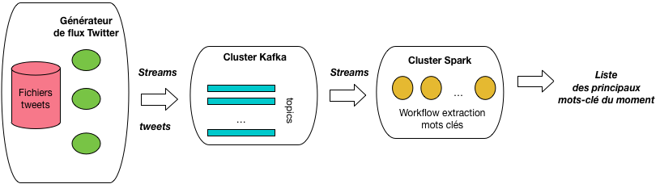

.. _chap-hackathon:
   
################
Hackathon NFE204
################

Le hackathon NFE204 est un complément au cours, dont l'objectif est 
d'effectuer un travail *collaboratif* pour mettre en place un *vrai système* distribué, en 3 heures,
dans une salle de TP.  La salle tient lieu de *data center*. Le système à mettre en place est
une application de traitement de données massives, basée sur une architecture complète comprenant
l'acquisition, le stockage, l'interrogation, le traitement et l'affichage. Ambitieux!

Bien entendu, il ne s'agit pas de tout faire en trois heures. 
Le hackathon se déroule en trois étapes:

  - Etape 1: présentation du sujet par votre enseignant préféré, constitution des groupes, répartition des rôles.
  - Etape 2: travail personnel, chez soi, pour préparer la tâche dont vous êtes responsable.
  - Etape 3: le hackathon proprement dit: le moment venu, tout est mis en place est assemblé, en 3 heures, au Cnam.

Le but n'est pas de développer, ou très peu. Il s'agit de mettre en œuvre les compétences acquises
pendant le cours, dans le cadre d'un travail en groupe. 
Normalement, tout se termine de maniere conviviale, au café le plus proche, avec les participants
et les enseignants du cours. Si rien ne marche, on peut sauter 
les 3 étapes et passer directement au café.

**************************************************
Sujet 1: gestion de flux Twitter, avec Kafka/Spark
**************************************************

Ce hackathon a pour objectif de traiter des flux massifs de *tweets* pour produire 
la liste des mots-clés les plus représentatifs. 

Architecture
============

L'architecture, illustrée par la :numref:`hackathon-2017`
s'appuie sur le couple Kafka/Spark, très en vogue à l'heure où ces lignes sont écrites. 

.. _hackathon-2017:

   
      Le sujet du hackathon Kafka/Twitter

.. note:: Nous n'avons pas vu Kafka ou l'interface *streaming* de Spark? C'est normal: 
   vous devez être en mesure d'apprendre par vous-mêmes les bases d'un nouveau
   système en valorisant ce que vous avez appris en NFE204.
   
Dans le détail, cette architecture comprend les composants suivants:

 - Une source de flux Twitter: on pourrait envisager de s'inscrire à la véritable API
   de Twitter, mais le débit est limité, sauf à payer très cher. Au lieu de cela, nous
   allons exploiter une collection de quelques millions de *tweets* qui vont être
   fournis sous forme d'un fichier, et transmis en flux par notre programme *SimFlux.py*. Plus précisément,
   *SimFlux.py* var agir comme un *producer* de données en continu, à destination
   d'un système Kafka.
 - Un gestionnaire de souscription/notification: Kafka est un système scalable
   de gestion de flux de données massives. Les flux dans Kafka sont organisés en 
   canaux de diffusion thématiques (les *topics*), avec la possibilité appréciable
   de pouvoir d'exploiter plusieurs fois un même flux, de revenir en arrière, etc.
 - Spark sera ici utilisé pour son moteur de *streaming*, consommant les flux
   de *tweets* extrait de Kafka, et produisant une information analytique. En l'occurrence
   cette information sera la liste des principaux mots-clé communs aux *tweets* sur la
   dernière période écoulée.
 - Enfin, la liste de mots-clé doit être visualisée. En allant au plus simple, on pourra la  
   placer dans un fichier HTML et l'afficher dans un navigateur. Une solution un peu plus sophistiquée
   serait de produire un nuage de mots: une courte recherche sur le Web propose de nombreux
   outils prêts à l'emploi.

Ce sont les spécifications de base. Il est très facile d'imaginer aller au-delà: produire
les mots-clé par *hashtag*, paramétrer la taille et la période des fenêtres de calcul,
grouper des *hashtags* d'après leurs mots-clé, et ainsi de suite. Mais l'objectif du hackathon est
d'abord de réaliser les spécifications ci-dessus.

Tâches et compétences
=====================

Pour réaliser ce projet, il faut constituer un groupe apte à effectuer les tâches suivantes:

  - **Gestionnaire de flux**
       - Tâches: il faut produire les flux de données, à partir du fichier des *tweets* et par adaptation
         du programme *SimFlux.py* pour en faire un *producer* Kafka.
       - Compétences: du Python, comprendre comment se connecter à Kafka et alimenter
         un *topic*.
  - **Configuration de Kafka**
       - Tâches: Installer et configurer Kafka, dans une grappe de serveurs.
       - Compétences: savoir installer sous Linux; étudier et comprendre la configuration d'une grappe Kafka.
  - **Configuration de Spark**
       - Tâches: idem que pour Kafka
       - Compétences: idem que pour Kafka
  - **Connexion Kafka/Spark**
     - Tâches: connecter le *cluster* Spark au *cluster* Kafka
     - Compétences: étudier les très nombreux exemples disponibles, comprendre comment établir
       une correspondance 1:1 entre une partition Kafka et une partition Spark.
  - **Définition du workflow**
     - Tâches: écrire le workflow qui extrait les mots-clé
     - Compétences: l'API de *streaming* de Spark
  - **Visualisation**
      - Tâches: afficher la liste des mots-clé
      - Compétences: un peu de programmation Web, un peu de HTML/Javascript au minimum.

Un groupe peut donc contenir entre 6 et 10 personnes, en considérant que la partie "visualisation"
peut être réduite au mimnimum.

Répartissez-vous les tâches et travaillez sur votre tâche en restant en contact avec le reste de votre
groupe et les enseignants NFE204. Ils essaieront de vous aider (pas trop quand même).

Pour communiquer pendant l'étape 2, nous vous proposons d'utiliser un espace *Slack* dédié au Hackathon: 
https://hackathon-nfe204.slack.com/. Et oui encore un outil à apprendre.

***********************************************************
Sujet 2: réalisation d'une BlockChain avec un système NoSQL
***********************************************************

Spécifications à venir.

