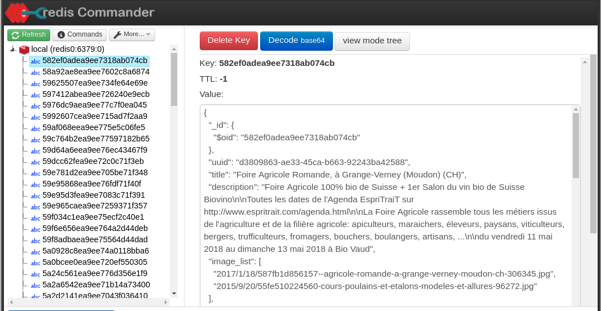
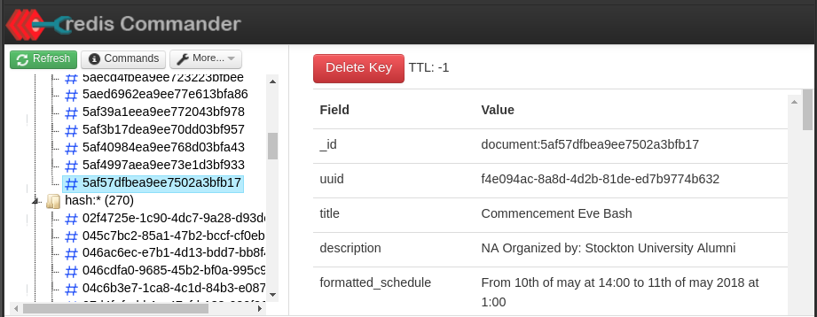
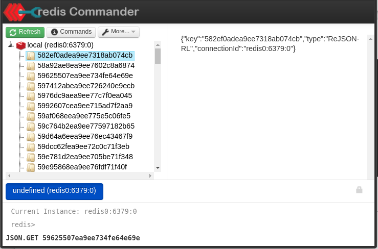
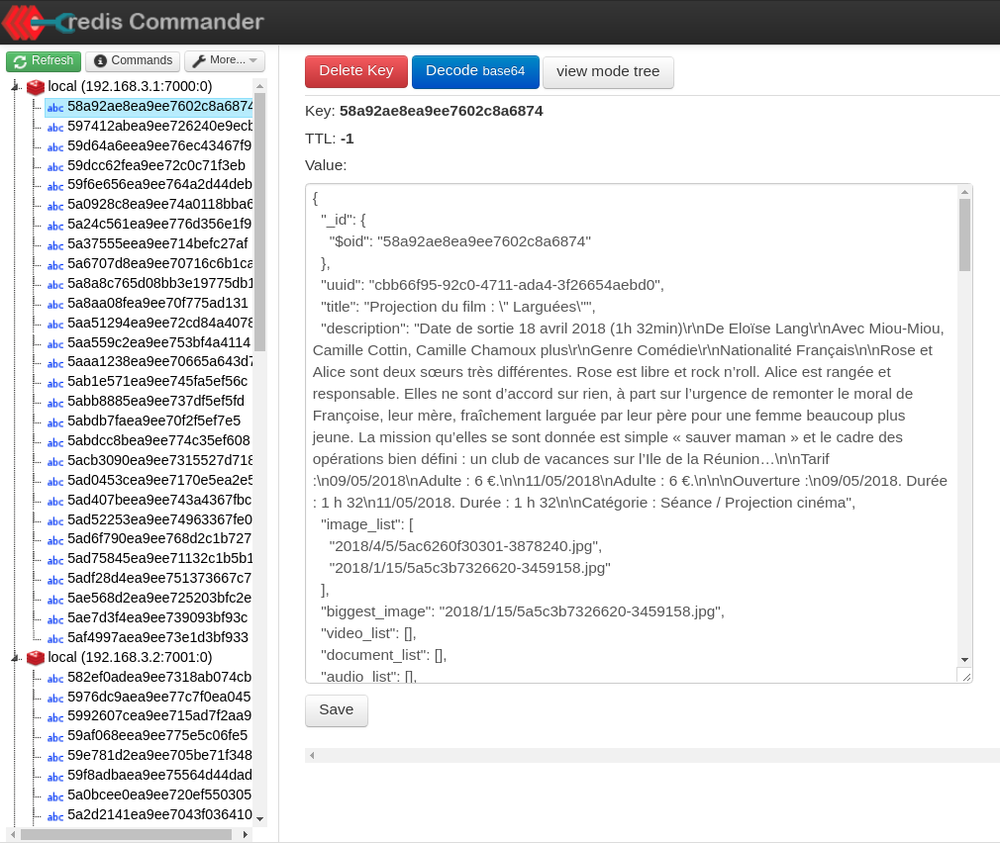
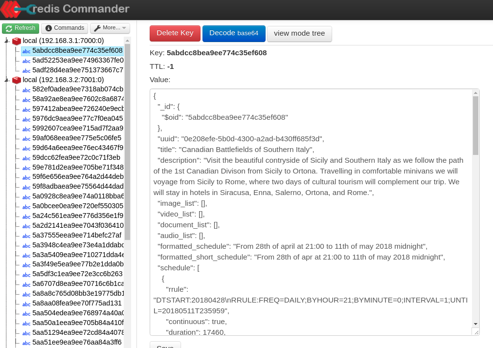
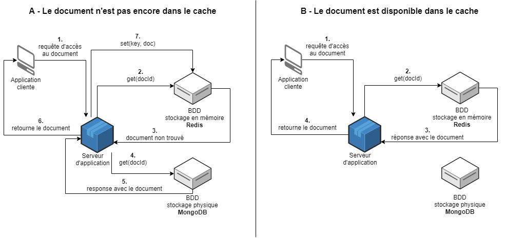

#############################
Annexe: Présentation de Redis
#############################

.. note:: Ce chapitre correspond au rapport de Sylvère Grégeois, rédigé en 2018
   pour NFE204. Merci à lui!
   

Redis est un entrepôt de données structurées open source qui a la particularité de conserver les données « en mémoire ». Le système dispose d’un certain nombre de structures de données internes simples comme les chaînes, les hashes, les listes ainsi que certaines autres structures plus complexes optimisées pour la performance d’écriture, d’accès et de calcul.

Redis est un système très complet qui sait gérer en natif la réplication, la reprise sur panne, le partitionnement, la persistance des données par sauvegardes complètes ou par lignes de log, ainsi que les transactions atomiques. Redis dispose également d’un système de publication/souscription (pub/sub) qu’il utilise en interne mais qui peut également être utilisé de manière indépendante.

Nous allons intéresser à plusieurs aspect de Redis : pour commencer nous ferons des tests simples d’insertion et d’interrogation d’une base Redis au moyen du client natif redis-cli. Nous nous intéresserons ensuite aux possibilités d’importation pour nos jeux de données. Une fois les bases acquises, nous explorerons les capacités de Redis en termes de réplication et de passage à l’échelle. Enfin, nous essayerons d’en déduire les différentes utilisations possibles de cette technologie.

Redis, site web officiel : https://redis.io/

Redis, dépôt Github: https://github.com/antirez/redis

***************
Le client Redis
***************

Redis propose sur son site web http://try.redis.io/ une console et un tutoriel interactif permettant de rapidement tester son client. Ce tutoriel rapide permet de se familiariser très vite avec les différents commandes du client en les testant directement dans une console connectée à un serveur redis.

Structures de données
=====================

a – Les valeurs simples
-----------------------

La première commande présentée est SET qui permet de stocker très simplement une valeur au moyen d’une clé :

::

    > SET ma:clé "ma valeur"
    OK

Il existe également SETNX qui permet de stocker la valeur d’une clé uniquement si cette clé n’existe pas.

Pour récupérer la valeur associée à notre clé fraîchement stockée il suffit d’utiliser GET suivi du nom de la clé :

::

    > GET ma:clé
    "ma valeur"

Il est également possible de supprimer la clé et sa valeur au moyen de la commande DEL suivi du nom de la clé :

::

    > DEL ma:clé
    (integer) 1

La valeur de retour nous indique que la clé a bien été effacée (1 dans ce cas). Si la clé n’existe pas, la valeur retournée est alors 0.

Il est également possible de stocker des entiers sur lesquels il sera ensuite possible de faire des opérations arithmétiques simples :

::

    > SET mon:entier 1
    OK
    > INCR mon:entier
    (integer) 2

INCR permet donc d’incrémenter un entier de manière atomique. Ceci nous garantit que plusieurs appels simultanés à la fonction seront exécutés de manière séquentielle et nous ne risquons pas d’incrémenter la valeur une seule fois alors que nous souhaitions l’incrémenter successivement. Utiliser INCR avec une clé inexistante stockera la valeur 1 pour cette clé. Enfin, INCRBY permet de spécifier de combien l’on souhaite incrémenter la valeur :

::

    > INCRBY mon:entier 10
    (integer) 12

b – Les listes
--------------

Redis permet également de stocker des structures de données plus complexes telles que des listes. Afin de créer une liste il suffit d’ajouter un élément à la fin de cette nouvelle liste, l’opération se charge de créer la liste :

::

    > RPUSH ma:liste  "Citron"
    (integer) 1
    > RPUSH ma:liste  "Pomme"
    (integer) 2

Ici nous remarquons que la valeur de retour correspond au nombre d’éléments présents dans la liste. Il est aussi possible d’ajouter des éléments au début de la liste grâce à LPUSH :

::

    > LPUSH ma:liste  "Fraise"
    (integer) 3

Afin d’accéder aux valeurs de la liste, on utilise LRANGE suivi de la clé et des indices de début et de fin représentés par des entiers :

::

    > LRANGE ma:liste  0 -1
    1) "Fraise"
    2) "Citron"
    3) "Pomme"

Nous souhaitons ici récupérer les éléments en commençant à l’indice 0 et en parcourant la liste jusqu’à la fin (-1).

Il est possible de récupérer la taille de la liste avec LLEN :

::

    > LLEN ma:liste
    (integer) 3

LPOP permet de supprimer le premier élément de la liste :

::

    > LPOP ma:liste
    "Fraise"

RPOP supprime le dernier élément de la liste :

::

    > RPOP ma:liste
    "Pomme"

c – Les sets
------------

Une autre structure de données proposée est le set. Ce dernier est similaire aux listes mais il ne conserve pas l’ordre des données insérées et une donnée ne peut apparaître qu’une seule fois dans un set. Les commandes principales pour ajouter et supprimer des valeurs dans un set sont SADD et SREM :

::

    > SADD mon:set "Assiette"
    > SADD mon:set "Fourchette"
    > SADD mon:set "Couteau"
    > SREM mon:set "Fourchette"

La commande SISMEMBER permet de savoir si un élément est contenu dans un set :

::

    > SISMEMBER mon:set "Assiette"
    (integer) 1
    > SISMEMBER mon:set "Fourchette"
    (integer) 0

SMEMBERS retourne tous les membres d’un set :

::

    > SIMEMBERS mon:set
    1) "Assiette"
    2) "Couteau"

Enfin, SUNION retourne les valeurs des différents sets passés en paramètres :

::

    > SADD mon:autre-set "Casserole"
    > SADD mon:autre-set "Cocotte"
    > SUNION mon:set mon:autre-set
    1) "Assiette"
    2) "Couteau"
    3) "Casserole"
    4) "Cocotte"

Redis propose également des sets ordonnés depuis sa version 1.2 grâce à la commande ZADD. Cette commande permet d’ajouter un score à chaque valeur d’un set.

::

    > ZADD mes:amis 1981 "Thomas"
    > ZADD mes:amis 1979 "Jérémie"
    > ZADD mes:amis 1986 "Céline"
    > ZADD mes:amis 1982 "Mano"
    > ZADD mes:amis 1988 "Julie"

Il est ensuite possible de récupérer les valeurs dans l’ordre grâce à ZRANGE suivi d’un indice de début et d’un indice de fin:

::

    > ZRANGE 2 4
    1) "Mano"
    2) "Céline"
    3) "Julie"

d – Les hashes
--------------

Enfin, Redis permet de stocker des hashes. Ce sont des structures plus complexes permettant de stocker sous une même clé des noms de champs associés à des valeurs, ils sont donc le candidat idéal pour stocker des objets simples :

::

    > HSET utilisateur:1 nom "Thomas Bourgier"
    > HSET utilisateur:1 email "t.bourgier@exemple.com"
    > HSET utilisateur:1 mot_de_passe "1234"

Il est également possible de stocker plusieurs champs à la fois :

::

    > HSET utilisateur:2 nom "Myriam Fois" email "m.fois@exemple.com"

Afin de récupérer les données associées à une clé, on utilise HGETALL :

::

    > HGETALL utilisateur:1
    1) "nom"
    2) "Thomas Bourgier"
    3) "email"
    4) "t.bourgier@exemple.com"
    5) "mot_de_passe"
    6) "1234"

Il est aussi possible de récupérer les données d’un seul des champs avec HGET :

::

    > HGET utilisateur:1 nom
    "Thomas Bourgier"

Il est possible d’effectuer les même opérations sur les entiers contenus dans un hash que sur les autres entiers de la base, en utilisant par exemple HINCRBY suivi du nom de la clé, du nom du champ à incrémenter et d’un entier, ou encore HDEL :

::

    > HSET utilisateur:1 visites 10
    > HINCRBY utilisateur:1 visites 1
    (integer) 11
    > HDEL utilisateur:1 visites

e – Expire
----------

EXPIRE n’est pas un type de donnée mais c’est une fonctionnalité intéressante de Redis puisqu’elle permet de donner une durée de vie à une clé. Quand cette durée est expirée, la clé est simplement supprimée de la base. Il est possible de connaître la durée de vie restante avec la commande TTL, ainsi que de prolonger ou diminuer cette durée de vie en appelant EXPIRE à nouveau :

::

    > SET ma:ressource "Je suis éphémère"
    > EXPIRE ma:ressource 120
    > TTL ma:ressource
    (integer) 118

Il existe d’autres commandes que nous ne détaillerons pas ici, en voici toutefois la liste complète de manière à vous faire une idée des possibilités du client Redis, d’autant plus que l’on peut déduire l’utilité de nombre d’entre elles en lisant simplement leur nom :

::

    DECR, DECRBY, DEL, EXISTS, EXPIRE,
    GET, GETSET, HDEL, HEXISTS, HGET, HGETALL,
    HINCRBY, HKEYS, HLEN, HMGET, HMSET, HSET,
    HVALS, INCR, INCRBY, KEYS, LINDEX, LLEN,
    LPOP, LPUSH, LRANGE, LREM, LSET, LTRIM,
    MGET, MSET, MSETNX, MULTI, PEXPIRE, RENAME,
    RENAMENX, RPOP, RPOPLPUSH, RPUSH, SADD,
    SCARD, SDIFF, SDIFFSTORE, SET, SETEX, SETNX,
    SINTER, SINTERSTORE, SISMEMBER, SMEMBERS,
    SMOVE, SORT, SPOP, SRANDMEMBER, SREM, SUNION,
    SUNIONSTORE, TTL, TYPE, ZADD, ZCARD, ZCOUNT,
    ZINCRBY, ZRANGE, ZRANGEBYSCORE, ZRANK, ZREM,
    ZREMRANGEBYSCORE, ZREVRANGE, ZSCORE

2 – Interfaces graphiques
=========================

Plusieurs clients basés sur une interface graphique existent pour administrer Redis. Ils sont répartis en trois catégories :

- Clients sous forme de service cloud, basé sur le web et payant comme Redsmin : https://redsmin.com/
- Clients lourds gratuits pour une utilisation non commerciale de type desktop comme Redis Desktop : http://redisdesktop.com/
- Clients sous forme de serveur web gratuit et open source comme Redis Commander écrit en nodejs : https://www.npmjs.org/package/redis-commander

Nous utiliserons ce dernier pour sa facilité d’installation et son accès libre sans conditions.

Il est nécessaire d’avoir installé npm et node pour pouvoir installer Redis Commander, ensuite l’installation est très simple :

::

    > npm install -g redis-commander

Puis il suffit de lancer :

::

    > redis-commander

L’interface graphique sera alors disponible à l’adresse http://localhost:8081.

Si un serveur Redis est lancé en local sur le port par défaut, Redis Commander le détecte et nous permet d’effectuer toutes les opérations nécessaires directement depuis l’interface. Une fois un serveur sélectionné, la page d’accueil nous donne les informations importantes de ce serveur : la version de Redis utilisée, le port qu’elle utilise, la version du système d’exploitation sur lequel Redis est installé, etc.

Il est ensuite possible d’ajouter des clés dans les quatre types de base : String, List, Set, Sorted Set.

Une fois la clé ajoutée, nous la retrouvons dans l’arborescence du serveur Redis située à gauche de l’interface. Ensuite, en fonction du type de clé il est possible d’effectuer les opérations communes pour ce type de clé. Ainsi si c’est une String on pourra la modifier. Si c’est une liste on pourra y ajouter des éléments, etc.

Des modules d’import et d’export sont également disponibles.

Enfin, un ligne de commande présente en bas de la page permet d’utiliser le client Redis en direct.

Un accès à la documentation de chaque commande est également disponible.

3 – Jeu de données
==================

L’un des deux services principaux de l’entreprise dans laquelle je travaille, Mapado, est la recherche d’évènements culturels ou de « choses à faire » autour de soi. Le site internet propose donc un moteur de recherche où l’on peut choisir certains critères (type d’évènement, ville, dates) ou encore faire une recherche par mots clés. Un service de géolocalisation permet également de présélectionner la ville dans le formulaire de recherche. Voici l’url principale si vous souhaitez essayer par vous-même : https://www.mapado.com.

La base de données MongoDB de Mapado contient plusieurs millions d’évènements ayant lieu partout dans le monde depuis 2012 (date de début de l’entreprise) stockés sous forme de documents que nous nommons plus précisément des « activités ». Ces activités contiennent les documents qui correspondent effectivement à des activités, mais également à d’autres typologies de documents qui partagent suffisamment de caractéristiques communes pour être également appelées des « activités », comme des lieux contenant des activités, des listes d’activités créées par nos utilisateurs, des listes d’activités générées par nos systèmes de classification, etc. Nous avons coutume de dire que dans nos bases, « tout est une activité ».

J’ai choisi de travailler sur un échantillon d’activités issues de notre base de données basée sur MongoDB.

4 – Problématique d'importation des données
===========================================

Nous allons travailler à partir d’un format JSON car MongoDB nous permet d’exporter directement dans ce format. Une question se pose alors : de quelle manière allons nous stocker les données dans Redis ?

Comme nous l’avons vu, les structures de données que Redis sait gérer sont relativement simples, c’est d’ailleurs ce qui permet à Redis d’optimiser les temps d’accès aux données. Seulement, les activités exportées depuis notre base de données MongoDB sont des documents complexes organisés sous forme de graphe avec parfois plusieurs niveaux d’imbrication. Redis ne sait pas gérer ce type de documents de manière native. Nous allons donc explorer trois possibilités qui s’offrent à nous :

- Stocker les documents sous forme de chaînes de caractères simples au format JSON.
- Stocker les documents en utilisant les types de Redis : chaque document sera stocké sous forme de HASH et son identifiant sera préfixé de la chaîne « document : ». Chaque proriété du document sera un type Redis simple (STRING ou NUMBER). Si la valeur d’une clé est complexe (objet ou liste JSON), nous stockerons sous cette clé une chaîne représentant un identifiant et nous stockerons cette valeur complexe sous une nouvelle clé Redis préfixée de « hash : » ou « list : » en fonction de son type JSON de manière à exploiter les types natifs de Redis. Nous appliquerons une fonction de stockage de manière récursive pour traiter toutes les imbrications du document. Ainsi, grâce aux identifiants il nous sera possible de reconstituer un document.
- Stocker les documents en utilisant ReJson : ce module ajoute une structure de données JSON à Redis et permet de stocker des documents complexes et d’accéder ensuite simplement aux valeurs imbriquées.

.. note::
    Redis dispose d’une fonctionnalité d’import de masse mais celle-ci est complexe à mettre en place même lorsque les données sont déjà adaptées aux structures de Redis. L’utiliser rendrait la tâche assez laborieuse surtout dans le second cas, mais sachez qu’il est possible de créer des fichiers d’import formatés pour utiliser cette interface. En voici la présentation : https://redis.io/topics/mass-insert

Afin d’importer les données, j’ai choisi d’utiliser des scripts python pour leur simplicité de mise en œuvre et de lecture dans le cadre de cette étude. Nous installerons également redis-py au moyen du gestionnaire de dépendances python pip ce qui nous permettra de communiquer avec notre serveur Redis. Pour optimiser les accès nous utiliserons les fonctionnalités de pipeline de Redis permettant d’envoyer un lot de requêtes à travers un nombre minimum d’appels réseau. Pour information, voici la page de la documentation de Redis consacrée aux pipelines : https://redis.io/topics/pipelining

5 – Mise en place du serveur Redis avec Docker et importation des données
=========================================================================

a – Serveur Redis avec docker-compose
-------------------------------------

Pour faciliter notre installation, nous utiliserons docker pour lancer un serveur Redis. Pour encore plus de simplicité nous utiliserons docker-compose qui permet de décrire des configurations docker complexes dans un fichier au format yaml plutôt que de devoir taper des lignes de commandes difficilement lisibles. Voici le fichier docker-compose.yml que nous utiliserons :

.. code-block:: yaml

    version: '2'

    services:
    redis0:
        container_name: redis0
        image: redislabs/rejson:latest
        environment:
            - ALLOW_EMPTY_PASSWORD=yes
        ports:
            - '6379:6379'
        volumes:
            - ./data/redis0:/data

Notre serveur sera donc accessible sur le port 6379 de la machine hôte et nous bénéficierons de la rapidité d’accès de la boucle locale lors des appels réseau. Notons que nous utilisons ici une image ReJson qui est en fait une image Redis qui charge en plus au lancement de Redis le module ReJson dont nous aurons besoin plus tard.

b – Scripts d’importation python
--------------------------------

Un script simple nous permet d’importer les documents sous forme de chaînes de caractères :

.. code-block:: python

    import json
    import redis

    def get_activities_from_json():
        with open('./prod.activity.json') as file:
            data = json.loads(file.read())
        return data

    def import_stringified_json():
        r = redis.StrictRedis(host='localhost', port=6379, db=0)
        pipeline = r.pipeline()
        data = get_activities_from_json()
        for document in data:
            pipeline.set(document['_id']['$oid'], json.dumps(document))
        pipeline.execute()

L’avantage de cette méthode est sa simplicité puisqu’il suffit d’itérer sur chaque document de la collection et de l’insérer comme une simple chaîne dans Redis. Nous utilisons l’id mongo comme identifiant et le pipeline pour optimiser l’opération.

L’inconvénient de cette méthode est que nous n’avons aucune possibilité d’accès aux champs de chaque document via le client Redis. On délègue donc toute la responsabilité de lire les objets au client python (ou autre) qui devra y accéder.

Ceci peut être utile si nous avons besoin de chaque document dans son intégralité à chaque lecture, cependant, si le document contient beaucoup de données, le transfert réseau sera plus long.

Voici la forme que prend la visualisation de ce type de données dans Redis Commander :

.. _redis_commander_1:

        Document importé sous forme de chaîne au format JSON

C’est de loin la solution la plus complexe puisque nous allons décomposer les documents en de multiples structures de données Redis. Voici un exemple de script qui fonctionne (notez que j’ai choisi de traiter les types MongoDB présents dans le JSON pour les normaliser, nous perdons donc l’information de type concernant certains types gérés par MongoDB comme par exemple les dates) :

.. code-block:: python

    def import_flattened_json():
        data = get_activities_from_json()

        for document in data:
            store_object_recursive(document, document['_id']['$oid'])

        pipe.execute()

    def store_object_recursive(document, redis_id):
        document_to_store = {}
        nested_objects = {}
        is_root_document = False

        if type(document) is list:
            for key, value in enumerate(document):
            if is_empty_object(value):
                continue
            handle_key_value(key, value, document_to_store, nested_objects)
        else:
            for key in document.keys():
            if key == '_id':
                is_root_document = True
            value = document[key]
            if is_empty_object(value):
                continue
            handle_key_value(key, value, document_to_store, nested_objects)

        if is_root_document == True:
            store_dict(get_redis_id(document, redis_id, True), document_to_store)
        elif type(document) is dict:
            if len(document.keys()) > 0:
            store_dict(redis_id, document_to_store)
        elif type(document) is list:
            if len(document) > 0:
            store_list(redis_id, document_to_store)

        for key in nested_objects.keys():
            doc = nested_objects[key]
            store_object_recursive(doc, key)

    def get_redis_id(value, uuid, is_document):
        if is_document == True:
            redis_id = 'document:' + uuid
        elif type(value) is dict:
            redis_id = 'hash:' + uuid
        elif type(value) is list:
            redis_id = 'list:' + uuid
        return redis_id

    def store_dict(key, document_to_store):
        for k in document_to_store.keys():
            v = document_to_store[k]
            pipe.hset(key, k, v)

    def store_list(key, document_to_store):
        for k in document_to_store.keys():
            v = document_to_store[k]
            pipe.rpush(key, v)

    def handle_key_value(key, value, document_to_store, nested_objects):
        value_type = type(value)
        if value_type is dict and len(list(value.keys())) == 1 and \
            type(value[list(value.keys())[0]]) is str and \
            list(value.keys())[0].startswith('$oid'):
            document_to_store[key] = get_redis_id(
                value[list(value.keys())[0]], value[list(value.keys())[0]], True)
        elif value_type is dict or value_type is list:
            if value_type is dict and len(list(value.keys())) == 1 and \
                type(value[list(value.keys())[0]]) is str and \
                list(value.keys())[0].startswith('$'):
            document_to_store[key] = value[list(value.keys())[0]]
            else:
            doc_uuid = str(uuid.uuid4())
            redis_id = get_redis_id(value, doc_uuid, False)
            document_to_store[key] = redis_id
            nested_objects[redis_id] = value
        else:
            document_to_store[key] = value

Il est aisé de se rendre compte que cette méthode n’est pas simple à maintenir, de plus l’attribution d’identifiants uniques auto-générés nous interdit de conserver ces identifiants si nous devons recréer la base, il faudra alors peut-être chercher une autre solution. Cependant, pour aller au bout de la démarche voici le script nous permettant de recomposer un document :

.. code-block:: python

    def get_document(field_value, field_key=None):
        if (field_value.startswith('document:') or \
            field_value.startswith('hash:')) and field_key != '_id':
            document = r.hgetall(field_value)
            for k in document.keys():
            document[k] = get_document(document[k], k)
        elif field_value.startswith('list:') and field_key != '_id':
            document = r.lrange(field_value, 0, -1)
            for k, item in enumerate(document):
            document[k] = get_document(item, k)
        else:
            document = field_value

    return document

A l’inverse, ce script de récupération est assez simple. Cependant, nous ne pouvons pas ici utiliser le pipeline puisque la récursion a besoin de lire les valeurs récupérées à chaque appel pour pouvoir fonctionner.

Si l’on n’a pas besoin de récupérer l’intégralité de chaque document, cette méthode à l’avantage de proposer un accès réseau rapide car les documents restent légers (simples HASH Redis). On pourrait également imaginer la création de modèles nous permettant d’accéder à Redis uniquement lorsque l’on accède à un champ de l’objet contenant un identifiant, un peu à la manière d’un ORM.

L’inconvénient principal de cette méthode est la complexité du script d’importation. De plus, si tous les documents d’une base de données n’ont pas été importés, il faudra trouver un moyen d’identifier les références à des documents manquants afin de rediriger les appels vers la base originale.

Autre inconvénient notable : avec ce type de gestion des données nous perdons l’une des caractéristiques importante des bases NoSQL qui est l’accès direct et extrêmement rapide à des documents structurés autonomes puisqu’il faut en quelque sorte effectuer des jointures côté client si l’on souhaite obtenir un document complet. Nous pouvons d’ores et déjà imaginer les latences réseau supplémentaires qui auraient lieu dans un système partitionné.

Cependant, cette méthode à l’avantage de nous permettre d’utiliser les opérations de HASH et de LIST de Redis pour effectuer des opérations sur les valeurs contenues dans nos documents.

Voici la forme que prend la visualisation de ce type de données dans Redis Commander :

.. _redis_commander_2:

        Document importé avec mise à plat des objets

Le stockage avec ReJson est très simple, d’autant plus qu’il est possible de le mettre en œuvre en python :

.. code-block:: python

    def import_rejson():
        data = get_activities_from_json()

        for document in data:
            r.execute_command(
                'JSON.SET', document['_id']['$oid'], '.', json.dumps(document))

.. note::
    Notons qu’il existe une librairie python « rejson » qui nous permet d’utiliser les pipelines et nous fournit des méthodes pratiques telles que jsonset().

L’intérêt principal de ReJson est qu’il est possible de récupérer directement des valeurs imbriquées :

::

    > JSON.GET ma:clé mon_champ_date
    "\"2017-07-09T16:08:39.728+0000\""

Il est également possible d’effectuer des opérations sur les champs imbriqués :

::

    > JSON.STRLEN foo .
    3
    > JSON.STRAPPEND foo . '"baz"'
    6
    > JSON.GET foo
    "\"barbaz\""
    > JSON.SET mon:doc ma_version 0
    OK
    > JSON.NUMINCRBY mon:doc ma_version . 1
    > JSON.NUMINCRBY mon:doc ma_version . 1.5
    "2.5"

Ces exemples simples nous permettent d’entrevoir toute la puissance de l’extension ReJson.

Cependant, ReJson utilise sa propre méthode de stockage et les outils d’interface graphique ne nous seront plus d’une grande aide pour visualiser nos données. Voici la forme que prend la visualisation de ce type de données dans Redis Commander :

.. _redis_commander_3:

        Document importé avec ReJson

c – Persistance des données
---------------------------

Redis est un entrepôt de données « en mémoire », ce qui signifie qu’il n’est pas par défaut pensé pour la persistance des données mais plutôt pour des accès extrêmement rapides à des données volatiles. Cependant, afin de répondre principalement au problème des reprises sur panne, il est possible d’assurer la persistance des données dans une base Redis de 2 manières.

Redis propose un système de sauvegarde périodique dans un fichier .rdb. Ces sauvegardes sont effectuées par un sous processus. La sauvegarde est configurable, il suffit de donner une périodicité (par exemple toutes les heures) et une condition impliquant le nombre de clés modifiées depuis la dernière sauvegarde (par exemple 1000). Ainsi, si l’on ajoute la ligne « save 30 100 » dans la configuration de Redis, ce dernier effectuera une sauvegarde complète toutes les 30 secondes à condition qu’au moins 100 clés aient été modifiées.

Ce système est idéal pour effectuer des sauvegardes (en copiant le fichier .rdb généré à intervalles réguliers) et très efficace dans le cadre de la reprise sur panne. Si le serveur s’arrête et que les données contenues dans le mémoire sont perdues, il suffit de relancer le serveur qui se chargera de recharger les données depuis le fichier .rdb présent. Enfin, le fichier généré est très compact.

En contrepartie, sauvegarder toute la base dans un fichier est coûteux, il est donc recommandé d’espacer les sauvegardes, ce qui rend la perte de données plus importante en cas de panne.

Redis propose aussi un système « append-only-file » incrémental sous forme de lignes de log. Chaque opération est inscrite dans un fichier à intervalle régulier. La recommandation de Redis pour la durée de l’intervalle est 1 seconde.

Ce système est plus durable car il s’agit d’un fichier qui n’est jamais complètement réécrit. En pratique cela veut dire qu’en cas de panne, même si la dernière ligne est corrompue, Redis peut réparer et utiliser le fichier lors de la reprise.

Il est possible de configurer des stratégies différentes : une synchronisation à intervalle régulier, ou à chaque requête par exemple.

Quand le fichier devient trop gros, Redis réécrit celui-ci au moyen d’un sous processus en le limitant au minimum d’opération pour arriver au dernier état de la base. Une fois le fichier recréé, il remplace l’ancien et le processus d’écriture continue.

En cas d’erreur de manipulation sur les données, si le fichier n’a pas été réécrit entre temps, il est possible de revenir à un état antérieur de la base.

En revanche, ce fichier est plus gros qu’un fichier RDB et le processus a un plus grand impact sur la performance de Redis, mais ceci reste anecdotique si l’on planifie par exemple une seule écriture AOF par seconde.

Pour plus d’informations sur la persistance des données, voici la page de la documentation officielle : https://redis.io/topics/persistence

***************************************
II – Réplication et passage à l’échelle
***************************************

1 – Réplication
===============

Comme la majorité des systèmes NoSQL actuels, Redis propose un système de réplication intégré se basant sur l’architecture maître-esclave.

a – Test simple
---------------

Pour tester cette fonctionnalité, rien de plus simple, il suffit de lancer un serveur Redis, puis d’en lancer un second en lui indiquant qu’il est l’esclave du premier (identifié par son adresse réseau et son port). Pour plus de simplicité et de concision, nous n’utiliserons pas docker pour cet exemple simple :

::

    # nous lançons ici redis-server sans paramètres
    # il se verra donc attribuer le port par défaut (6379)
    > redis-server

    # nous lançons ensuite un second serveur auquel nous
    # attribuons un port disponible et nous lui indiquons
    # qu’il est l’esclave de notre premier serveur disponible
    # sur le port 6379 (il est aussi possible de spécifier
    # ces paramètres dans le fichier de configuration de redis)
    > redis-server --port 6380 --slaveof 127.0.0.1 6379

En lançant ces deux processus au premier plan dans un terminal, nous pouvons voir les logs de chacun des deux serveurs et nous nous apercevons que la réplication commence dès que nous lançons le second serveur.

Lancement du serveur maître :

::

    # Server initialized
    * DB loaded from disk: 0.000 seconds
    * Ready to accept connections

Lancement du serveur esclave :

::

    # Server initialized
    * Ready to accept connections
    * DB loaded from disk: 0.000 seconds
    * Connecting to MASTER 127.0.0.1:6379 # (1)
    * MASTER <-> SLAVE sync started # (2)
    * Non blocking connect for SYNC fired the event.
    * Master replied to PING, replication can continue...
    * Trying a partial resynchronization \
        (request 38701d0ee72741f5110dfe32d043f47d3888b2cc:1). # (3)
    * Full resync from master: # (4) c40c4a35156bfcf02d36f08aec26fcf732a02b4c:0
    * Discarding previously cached master state.
    * MASTER <-> SLAVE sync: receiving 175 bytes from master
    * MASTER <-> SLAVE sync: Flushing old data # (5)
    * MASTER <-> SLAVE sync: Loading DB in memory # (5)
    * MASTER <-> SLAVE sync: Finished with success # (5)

Ce que nous voyons ici :
    1. L’esclave tente de se connecter au maître
    2. La connexion étant assurée la réplication commence
    3. L’esclave fait une demande de synchronisation partielle (nous y reviendrons)
    4. L’esclave demande une synchronisation complète
    5. La synchronisation a lieu et se termine correctement

Logs du serveur maître quand l’esclave est lancé :

::

    * Slave 127.0.0.1:6380 asks for synchronization # (1)
    * Partial resynchronization not accepted: Replication ID mismatch \
        (Slave asked for '38701d0ee72741f5110dfe32d043f47d3888b2cc', \
        my replication IDs are '19ca1ccd0db670ba33417554ace959476b66f466' \
        and '0000000000000000000000000000000000000000') (2)
    * Starting BGSAVE for SYNC with target: disk # (3)
    * Background saving started by pid 5777 # (3)
    * DB saved on disk # (3)
    * RDB: 0 MB of memory used by copy-on-write
    * Background saving terminated with success # (3)
    * Synchronization with slave 127.0.0.1:6380 succeeded # (4)

Ce que nous voyons ici :
    1. Le maître reçoit une demande de synchronisation de la part de l’esclave
    2. Le maître refuse la synchronisation partielle (nous y reviendrons)
    3. Le maître commence une sauvegarde complète de la base (même principe que la sauvegarde RDB vue dans la partie « persistance des données »)
    4. La synchronisation s’est terminée correctement

Maintenant que tout est prêt , nous pouvons écrire sur le maître au moyen de redis-cli :

::

    127.0.0.1:6379> set test:simple hello
    OK

Et nous retrouvons notre valeur avec un client connecté à l’esclave :

::

    127.0.0.1:6380> get test:simple
    "hello"

b – Comment fonctionne la réplication
-------------------------------------

A ce stade de l’étude, notre meilleur allié se trouve être la documentation de Redis qui nous indique les trois mécanismes principaux de la réplication :
    1. Lorsque maître et esclave sont connectés, le maître tient à jour l’esclave en lui envoyant un flux de commandes afin de répliquer les opérations effectuées sur le jeu de données du maître quasiment en temps réel.
    2. Quand la connexion entre maître et esclave est rompue ou trop longue, l’esclave se reconnecte et tente une synchronisation partielle afin de ne récupérer que la parties du flux de commandes qu’il n’a pas pu obtenir lors de la coupure.
    3. Quand une synchronisation partielle est impossible, l’esclave demande une synchronisation complète. A ce moment là, le maître va effectuer une sauvegarde de toutes ses données, l’envoyer à l’esclave, et reprendre l’envoi du flux de commande comme précédemment.

Lors du démarrage de notre esclave nous avons donc pu voir le troisième mécanisme en œuvre. Ensuite quand nous avons écrit sur le maître c’est le premier mécanisme qui a permis de répliquer les données.

Afin de mieux comprendre le second mécanisme, nous simulons un arrêt de notre esclave, nous écrivons sur le maître, puis nous relançons l’esclave.

Logs du maître lors de l’arrêt de l’esclave :

::

    # Connection with slave 127.0.0.1:6380 lost.

Ici nous écrivons sur le maître :

::

    127.0.0.1:6379> set test:simple hello
    OK

Voici ensuite les logs de l’esclave lorsque nous le relançons :

::

    * Trying a partial resynchronization \
        (request f5731385920617449b21dbdea92f42d33cfaecb4:1).
    * Successful partial resynchronization with master.

Nous voyons que l’esclave demande au maître une synchronisation partielle.

Et enfin les logs du maître procédant à la resynchronisation partielle :

::

    * Slave 127.0.0.1:6380 asks for synchronization
    * Partial resynchronization request from 127.0.0.1:6380 accepted. \
        Sending 129 bytes of backlog starting from offset 1.

Afin de savoir quelles données synchroniser lors d’une synchronisation partielle, Redis utilise un ID de réplication associé à un offset. Je vous invite à vous référer à la documentation si vous souhaitez en explorer les détails : https://redis.io/topics/replication

Quelques points notables :

- Les esclaves peuvent également avoir des esclaves auquel cas la réplication se fait en cascade.
- La réplication est asynchrone et donc non bloquante pour le maître. Dans la plupart des cas elle est également non bloquante pour les esclaves.
- La réplication peut être combinée avec les sauvegardes périodiques (RDB) et les sauvegardes incrémentales (AOF). La recommandation de Redis à ce sujet est d’activer les deux modes de sauvegarde sur les maîtres et les esclaves afin d’assurer la meilleure reprise sur panne possible.

2 – Reprise sur panne avec Sentinel
===================================

Non content de proposer un système maître / esclave robuste et facile à mettre en œuvre, Redis propose également un outil de reprise sur panne automatisé nommé Sentinel.

Une fois configuré, Sentinel, comme son nom le laisse entendre, surveille nos instances de Redis, et, en cas de panne d’un serveur maître, s’occupe d’élire un nouveau serveur maître parmi les esclaves encore disponibles. Mais cela ne s’arrête pas là car Sentinel lui même est un système distribué.

En effet, tout comme il est toujours préférable d’avoir au minimum un maître et deux esclaves pour pouvoir faire face à la majorité des pannes sans avoir à payer le prix fort, Redis recommande de mettre en place au moins trois instances de Sentinel pour surveiller chaque serveur maître de notre grappe.

.. note::
    Notons qu’il est assez complexe de simuler une grappe de serveurs maîtres / esclaves avec Docker car les adresses et les ports sont mappés par Docker et le port exposé n’est pas forcément celui que redis pense utiliser (et c’est encore plus complexe si cette grappe est gérée par Sentinel). Il est possible de forcer les instances de redis à annoncer aux maîtres et aux instances de Sentinel des ports différents via leur fichier de configuration, mais cette configuration reste assez complexe.
    Dans notre cas, nous allons tout de même utiliser docker-compose et notre réseau local afin de simuler des nœuds tout en gardant une configuration relativement simple.

a – Mise en place avec docker-compose
-------------------------------------

Afin de tester Sentinel, nous allons lancer trois instances de Redis : un maître et deux esclaves, ainsi que trois instances de Sentinel. Pour simuler leur appartenance à des nœuds  différents et afin d’éviter le mappage d’adresses de Docker, nous allons leur attribuer de vraies adresses sur notre réseau local.

Voici pour commencer la configuration de notre réseau :

.. code-block:: yaml

    Version: '2'

    networks:
        sentinel:
            driver: bridge
            ipam:
            driver: default
            config:
                - subnet: 192.168.3.0/24
                - gateway: 192.168.3.100

Nous attribuons une plage d’adresse allant de 192.168.3.0 à 192.168.3.255 que docker pourra utiliser afin de simuler un réseau en utilisant de vraies adresses sur notre réseau local.

Voici comment seront configurées nos instances maîtres / esclaves :

.. code-block:: yaml

    services:
        # master / slave
        redismaster:
            image: redislabs/rejson:latest
            volumes:
                - ./redis/conf/redismaster.conf:/data/redis.conf
            ports:
                - 6379:6379
            networks:
            sentinel:
                ipv4_address: 192.168.3.1
            entrypoint: ["redis-server", "/data/redis.conf"]

        redisslave0:
            image: redislabs/rejson:latest
            networks:
            sentinel:
                ipv4_address: 192.168.3.2
            volumes:
                - ./redis/conf/redisslave0.conf:/data/redis.conf
            ports:
                - 6380:6380
            entrypoint: ["redis-server", "/data/redis.conf"]

        redisslave1:
            image: redislabs/rejson:latest
            networks:
            sentinel:
                ipv4_address: 192.168.3.3
            volumes:
                - ./redis/conf/redisslave1.conf:/data/redis.conf
            ports:
                - 6381:6381
            entrypoint: ["redis-server", "/data/redis.conf"]

Et voici enfin la configuration de nos instances de Sentinel :

.. code-block:: yaml

    redissentinel0:
        image: redislabs/rejson:latest
        volumes:
            - ./sentinel/conf/sentinel0.conf:/etc/redis/sentinel.conf
        networks:
        sentinel:
            ipv4_address: 192.168.3.4
        ports:
            - 26379:26379
        entrypoint: ["redis-server", "/etc/redis/sentinel.conf", "--sentinel"]

    redissentinel1:
        image: redislabs/rejson:latest
        volumes:
            - ./sentinel/conf/sentinel1.conf:/etc/redis/sentinel.conf
        networks:
        sentinel:
            ipv4_address: 192.168.3.5
        ports:
            - 26380:26380
        entrypoint: ["redis-server", "/etc/redis/sentinel.conf", "--sentinel"]

    redissentinel2:
        image: redislabs/rejson:latest
        volumes:
            - ./sentinel/conf/sentinel2.conf:/etc/redis/sentinel.conf
        networks:
        sentinel:
            ipv4_address: 192.168.3.6
        ports:
            - 26381:26381
        entrypoint: ["redis-server", "/etc/redis/sentinel.conf", "--sentinel"]

Les ports utilisés par nos instances se trouvent dans des fichiers de configuration qu’il serait fastidieux de détailler ici. Ces fichiers indiquent les ports utilisés par les instances, leur dépendance éventuelle à un maître ainsi que des paramètres utiles pour la réplication et la persistance des données.

b – Tests de reprise sur panne
------------------------------

Afin de sortir un peu de l’univers des lignes de log, nous allons tester la reprise sur panne opérée par Sentinel au moyen du client redis-py. L’avantage du client redis-py est qu’il s’occupera pour nous d’interroger nos sentinels afin de nous fournir toujours, dans la limite du possible bien sûr, le nouveau maître élu par ces derniers.

Initialisons notre client via l’utilitaire ipython :

.. code-block:: python

    In [1]: from redis.sentinel import Sentinel
    In [2]: sentinel = Sentinel([('192.168.3.4', 26379), ('192.168.3.5', 26380),
        ...: ('192.168.3.6', 26381)], socket_timeout=0.1)

Nous fournissons à notre client les adresses de nos trois instances de Sentinel qui bénéficient elles aussi d’un mode distribué, de cette façon, le client python s’adressera à la première instance à laquelle il parviendra à se connecter.

Interrogeons maintenant notre sentinel afin de connaître notre instance redis-server maîtresse :

.. code-block:: python

    In [3]: sentinels.discover_master('mymaster')
    Out[3]: ('192.168.3.1', 6379)

Nous voyons ici que notre « master » est bien celui défini par notre configuration qui se trouve à l’adresse 192.168.3.1.

Voyons si nos sentinels peuvent nous indiquer la présence d’esclaves :

.. code-block:: python

    In [4]: sentinels.discover_slaves('mymaster')
    Out[4]: [('192.168.3.3', 6381), ('192.168.3.2', 6380)]

Ici aussi, Sentinel fait son travail et nous indique les adresses de nos nœuds esclaves.

Obtenons maintenant un client pour notre maître et tentons un écriture :

.. code-block:: python

    In [5]: master = sentinels.master_for('mymaster')
    In [6]: master
    Out[6]: StrictRedis<SentinelConnectionPool<service=mymaster(master)>
    In [7]: master.set('test', 'test')
    Out[7]: True
    In [8]: master.get('test')
    Out[8]: b'test'

Rien de compliqué ici, notre client interroge Sentinel et s’occupe d’instancier un client pour notre nœud maître. L’écriture est possible tout comme la lecture.

Faisons la même expérience avec un nœud esclave :

.. code-block:: python

    In [9]: slave = sentinels.slave_for('mymaster')
    In [10]: slave
    Out[10]: StrictRedis<SentinelConnectionPool<service=mymaster(slave)>
    In [11]: slave.get('test')
    Out[11]: b'test'
    In [12]: slave.set('test2', 'test2')
    ReadOnlyError: You can't write against a read only slave.

Notre client nous fourni l’esclave, un appel get nous permet de voir que la réplication a fonctionné cependant il n’est pas possible d’effectuer d’opération d’écriture sur un nœud esclave.

Nous allons maintenant simuler une panne de notre nœud maître est mettant en pause son container docker :

::

    > docker pause redismaster

Tentons à nouveau la lecture à partir de notre instance du nœud maître :

.. code-block:: python

    In [14]: master.get('test')
    Out[14]: b'test'

Aucun problème, notre instance de maître effectue le get et nous retourne la valeur de la clé demandée.

Interrogeons maintenant Sentinel pour connaître notre nouveau maître:

.. code-block:: python

    In [23]: sentinels.discover_master('mymaster')
    Out[23]: ('192.168.3.3', 6381)

Nous voyons donc que Sentinel s’est occupé d’élire un nouveau maître parmi nos esclaves et que notre client s’est occupé de changer l’adresse de destination de notre requête.

Si nous demandons à Sentinel de nous indiquer nos nœuds esclaves :

.. code-block:: python

    In [24]: sentinels.discover_slaves('mymaster')
    Out[24]: [('192.168.3.2', 6380)]

Nous pouvons voir qu’il n’en reste qu’un.

.. code-block:: python

    In [25]: slave.get('test')
    Out[25]: b'test'

Et notre instance esclave est toujours fonctionnelle.

Mettons maintenant en pause notre nouveau maître :

::

    > docker pause redisslave1

Et voyons ce que nous dit Sentinel :

.. code-block:: python

    In [27]: master.get('test')
    Out[27]: b'test'
    In [28]: sentinels.discover_master('mymaster')
    Out[28]: ('192.168.3.2', 6380)

Notre instance de master fonctionne toujours, pourtant le maître a encore changé, il s’agit maintenant de notre dernier nœud esclave.

Chose intéressante, notre instance slave fonctionne toujours elle aussi, pourtant Sentinel ne rapporte plus aucun nœud esclave :

.. code-block:: python

    In [29]: slave.get('test')
    Out[29]: b'test'
    In [30]: sentinels.discover_slaves('mymaster')
    Out[30]: []

Attention toutefois, il s’agit bien de notre maître, il est d’ailleurs possible d’effectuer des écritures :

.. code-block:: python

    In [32]: slave.set('test2', 'test2')
    Out[32]: True

Pour finir, redémarrons nos serveurs actuellement en pause :

::

    > docker unpause redisslave1
    > docker unpause redismaster

Et vérifions que Sentinel a bien été notifié :

.. code-block:: python

    In [33]: sentinels.discover_slaves('mymaster')
    Out[33]: [('192.168.3.1', 6379), ('192.168.3.3', 6381)]
    In [34]: sentinels.discover_master('mymaster')
    Out[34]: ('192.168.3.2', 6380)

Nos serveurs sont à nouveau disponibles et notre maître reste le dernier maître élu.

c – Que se passe-t-il en coulisses ?
------------------------------------

La communication entre nos sentinels et nos serveurs Redis s’effectue au moyen d’un système publication/souscription (pub/sub). Chaque sentinel publie des messages de type « hello » sur les canaux de chacun des nœuds maître/esclave. De même, chaque sentinel effectue une souscription au canaux de chacun des nœuds maître/esclave. De cette façon, il n’est pas nécessaire de fournir aux sentinels la liste des autres instances de Sentinel car ils l’obtiennent via les canaux pub/sub des instances maître/esclave. Chaque message de type « hello » contient la configuration complète du maître, ainsi, lorsqu’un sentinel détient une configuration plus ancienne que celle du dernier message reçu, il la met à jour avec la nouvelle configuration.

Si plus aucun des nœuds maître/esclave n’est disponible, chaque instance de Sentinel continue de recevoir les messages des autres instances car chacune a souscrit aux canaux des autres.

Le comportement de Sentinel est paramétrable et l’élection d’un nouveau maître en cas de panne est possible via la méthode du quorum. Le quorum par défaut est 2, ce qui signifie qu’il faut qu’au moins deux instances de Sentinel se mettent d’accord sur la panne du nœud maître afin de pouvoir commencer une reprise sur panne. Une fois que la nécessité d’une reprise sur panne a été décidée, il faut encore qu’une majorité d’instances de Sentinel autorisent la reprise sur panne, ainsi Sentinel ne permettra jamais une reprise sur panne dans une partition ou seulement une minorité de sentinels existe.

Pour plus d’information, voici la section de la documentation consacrée à Sentinel : https://redis.io/topics/sentinel

3 – Partitionnement avec Redis Cluster
======================================

A l’instar de la plupart des technologies NoSQL actuelles, Redis propose également un système de partitionnement automatisé. Redis utilise pour cela une technique de hachage nommée « hash slots » qui est en fait une variante de la technique du hachage cohérent.

Redis Cluster utilise un partitionnement multi nœuds. Le fonctionnement ressemble à celui de Cassandra avec un système de nœuds virtuels se partageant un total de 16384 hash slots. Ainsi, afin de trouver le slot dans lequel sera assigné la donnée, Redis applique la fonction HASH_SLOT = CRC16(key) mod 16384. CRC16 est un algorithme de somme de contrôle (checksum) qui, appliqué à la clé de notre donnée/document, produit un nombre dont Redis gardera le modulo de 16384 afin de connaître le slot à utiliser pour stocker la donnée.

Chaque nœud du cluster se verra attribuer un intervalle de hash slots jusqu’à couvrir l’ensemble des 16384 slots. Ce système de nœuds virtuels permet une grande flexibilité de la structure en cela qu’il est possible d’ajouter ou de retirer des nœuds de la grappe tout en déplaçant le moins de données possible d’un nœud à l’autre.

Il est ainsi possible d’ajouter et de retirer des nœuds à la volée, Redis se chargeant de la redistribution des données de manière asynchrone.

Chaque nœud peut se voir attribuer un ou plusieurs « esclaves » afin d’assurer la réplication des données et la reprise sur panne. Ici aussi il est possible d’ajouter des nœuds esclaves à la volée ou encore de convertir des maîtres en esclaves à la demande.

a – Mise en place du cluster
============================

Le minimum nécessaire pour que Redis fonctionne en mode cluster est d’avoir au moins trois nœuds maîtres. Nous allons donc mettre en place un cluster comprenant six nœuds, trois maîtres et trois esclaves. Afin de pouvoir utiliser ces instances de Redis au sein d’un cluster, certaines données de configuration sont nécessaires :

::

    port 7000
    cluster-enabled yes
    cluster-config-file nodes.conf
    cluster-node-timeout 5000
    appendonly yes

Nous allons créer un fichier redis.conf pour chaque nœud en prenant soin de spécifier un port différent pour chacun.

- Le paramètre cluster-enabled est nécessaire pour que l’instance puisse fonctionner dans le cluster.
- Le ficher de configuration spécifié en troisième ligne est généré et modifié par le système seulement. C’est dans ce fichier que chaque instance gardera les informations du cluster.
- cluster-node timeout est la durée maximale durant laquelle un nœud peut rester inaccessible avant de se trouver « en échec » et que ses esclaves n’initient une reprise sur panne.
- Enfin, appendonly permet d’activer la sauvegarde périodique par lignes de log.

Voici maintenant un extrait de notre fichier docker-compose permettant de d’instancier et de lancer nos container Redis:

.. code-block:: yaml

    version: '2'

    services:
        clusternode0:
            container_name: clusternode0
            image: redislabs/rejson:latest
            environment:
                - ALLOW_EMPTY_PASSWORD=yes
            volumes:
                - ./redis/conf/clusternode0.conf:/data/redis.conf
            ports:
                - 7000:7000
            networks:
            rediscluster:
                ipv4_address: 192.168.3.1
            entrypoint: ["redis-server", "/data/redis.conf", \
                "--loadmodule", "/usr/lib/redis/modules/rejson.so"]

Voici donc la configuration docker pour un nœud du cluster, il suffira de la dupliquer cinq fois en prenant soin de changer à chaque fois les noms de service et de container, le port et le chemin vers le fichier de configuration. Nous utiliserons la même configuration du réseau qu’avec Sentinel, il est simplement renommé ici rediscluster pour une meilleure lisibilité.

Lançons nos instances avec:

::

    > docker-compose up -d

Lançons maintenant notre cluster.

Pour cela nous aurons besoin d’installer ruby puis d’installer l’utilitaire redis-trib via son gestionnaire de paquets gem :

::

    > gem install redis

Nous pouvons maintenant lancer notre cluster à partir du dossier d’installation de redis-trib en spécifiant la commande create, le nombre de replicas par nœud ainsi que les adresses des nœuds qui composeront le cluster :

::

    > ./redis-trib.rb create --replicas 1 192.168.3.1:7000 192.168.3.2:7001 \
    192.168.3.3:7002 192.168.3.4:7003 127.0.0.1:7004 192.168.3.5:7005

L’utilitaire nous propose alors une configuration pour notre cluster :

::

    >>> Creating cluster
    >>> Performing hash slots allocation on 6 nodes...
    Using 3 masters:
    192.168.3.1:7000
    192.168.3.2:7001
    192.168.3.3:7002
    Adding replica 192.168.3.5:7004 to 192.168.3.1:7000
    Adding replica 192.168.3.6:7005 to 192.168.3.2:7001
    Adding replica 192.168.3.4:7003 to 192.168.3.3:7002
    M: e2c5b55b33580d4c1d3e9618fbc542ebfa00d8bf 192.168.3.1:7000
    slots:0-5460 (5461 slots) master
    M: d4f5e5b52a2cbebb7ca7705d197580c8d621a700 192.168.3.2:7001
    slots:5461-10922 (5462 slots) master
    M: 1e4bfc582065ed510b5bcb83ce24eaadced60cff 192.168.3.3:7002
    slots:10923-16383 (5461 slots) master
    S: 0d00e8dc71722596efde1f6beb9cffa6f778ee51 192.168.3.4:7003
    replicates 1e4bfc582065ed510b5bcb83ce24eaadced60cff
    S: 33b44b81eca5d57fece1d70909a53a78890b3e64 192.168.3.5:7004
    replicates e2c5b55b33580d4c1d3e9618fbc542ebfa00d8bf
    S: 9500032206493275611f98e522d8d671961fc1d7 192.168.3.6:7005
    replicates d4f5e5b52a2cbebb7ca7705d197580c8d621a700
    Can I set the above configuration? (type 'yes' to accept):

Comme nous pouvons le voir, le cluster utilisera les trois premiers nœuds comme maîtres et les trois restants comme esclaves. Les lignes suivantes nous indiquent les identifiants de chacun de nos nœuds dans le cluster ainsi que l’intervalle de slots couvert par chacun. Notons que le nombre de slots est équilibré entre nos nœuds. Il est possible de choisir plus finement les intervalles couverts par chaque nœud mais nous nous limiterons ici à la configuration automatique proposée par Redis par soucis de concision.

Avant de choisir « yes » pour lancer le cluster, intéressons-nous aux logs de nos instances de Redis:

::

    # Configuration loaded
    * No cluster configuration found, I'm e2c5b55b33580d4c1d3e9618fbc542ebfa00d8bf
    * Running mode=cluster, port=7000.
    # Server initialized
    * Ready to accept connections

Grâce à nos fichiers de configuration, chaque instance sait qu’elle fait partie d’un cluster et annonce son identifiant dans le cluster.

Validons maintenant la commande précédente en entrant « yes » :

::

    [OK] All nodes agree about slots configuration.
    >>> Check for open slots...
    >>> Check slots coverage...
    [OK] All 16384 slots covered.

Les 16384 slots ont été attribués. Regardons maintenant les logs d’une instance maîtresse :

::

    # IP address for this node updated to 192.168.3.1
    * Slave 192.168.3.5:7004 asks for synchronization
    [...]
    * Synchronization with slave 192.168.3.5:7004 succeeded
    # Cluster state changed: ok

Comme annoncé par l’utilitaire de création du cluster, le nœud situé à l’adresse 192.168.3.5 est devenu l’esclave de notre premier nœud maître. S’ensuit une demande synchronisation comme nous l’avons vu dans le chapitre sur la réplication. Nous voyons également que l’état du cluster a changé. Le fichier de configuration du cluster présent sur chaque nœud a donc été mis à jour, en voici son contenu :

::

    1e4bfc582065ed510b5bcb83ce24eaadced60cff 192.168.3.3:7002@17002 \
        master - 0 1530650011000 3 connected 10923-16383
    d4f5e5b52a2cbebb7ca7705d197580c8d621a700 192.168.3.2:7001@17001 \
        master - 0 1530650012063 2 connected 5461-10922
    e2c5b55b33580d4c1d3e9618fbc542ebfa00d8bf 192.168.3.1:7000@17000 \
        myself,master - 0 1530650011000 1 connected 0-5460
    0d00e8dc71722596efde1f6beb9cffa6f778ee51 192.168.3.4:7003@17003 \
        slave 1e4bfc582065ed510b5bcb83ce24eaadced60cff 0 1530650010000 4 connected
    9500032206493275611f98e522d8d671961fc1d7 192.168.3.6:7005@17005 \
        slave d4f5e5b52a2cbebb7ca7705d197580c8d621a700 0 1530650011062 6 connected
    33b44b81eca5d57fece1d70909a53a78890b3e64 192.168.3.5:7004@17004 \
        slave e2c5b55b33580d4c1d3e9618fbc542ebfa00d8bf 0 1530650012263 5 connected
    vars currentEpoch 6 lastVoteEpoch 0

Nous retrouvons ici les identifiants uniques de nos différents nœuds ainsi que leurs rôles respectifs dans le cluster. Le nœud portant le fichier de configuration s’identifie lui même via l’ajout de la mention « myself » dans la ligne le concernant.

b – Importation de données dans le cluster
==========================================

Maintenant que notre cluster est prêt, tentons d’importer nos données d’activités à nouveau en modifiant quelque peu notre script python utilisé précédemment. En effet, nous allons devoir utiliser une librairie qui sait gérer le cluster Redis, il s’agit de redis-py-cluster.

Nous utiliserons l’import sous forme de chaînes de caractères au format JSON afin d’obtenir un retour visuel dans l’interface graphique de Redis Commander :

.. code-block:: python

    #!/usr/bin/python3
    #-*- coding: utf-8 -*-
    import json
    from rediscluster import RedisCluster

    startup_nodes = [{"host": "192.168.3.1", "port": 7000},
                    {"host": "192.168.3.2", "port": 7001},
                    {"host": "192.168.3.3", "port": 7002}]

    r = RedisCluster(startup_nodes=startup_nodes,
                    max_connections=32, decode_responses=True)

    pipe = r.pipeline(transaction=False)

    def get_activities_from_json():
        with open('./prod.activity.json') as file:
            data = json.loads(file.read())
        return data

    def import_stringified_json():
        data = get_activities_from_json()
        for document in data:
            pipe.set(document['_id']['$oid'], json.dumps(document))
        pipe.execute()

.. note::
    Le pipeline ne fonctionne pas de la même manière lorsque l’on utilise la librairie redis-py-cluster. Il n’est pas possible d’envoyer en une fois le flux de commande pour qu’il soit traité de manière atomique. A la place, comme notre client python a connaissance de la topologie du cluster, il va s’occuper de réorganiser les commandes et créer un pipeline par nœud visé. Ensuite, afin de s’approcher au mieux d’un traitement parallèle sans pour autant avoir recours au multi-thread, le client envoie d’abord séquentiellement toutes les commandes aux sockets de connexion avant de lire les réponses. Il est toutefois possible de passer un paramètre pipelines_use_threads lors de l’instanciation de RedisCluster afin de bénéficier d’un vrai traitement en parallèle. Enfin, si un serveur répond MOVED pour indiquer que le slot correspondant à notre clé est sur un autre nœud, le client s’occupe de rediriger le requête à notre place.

Lançons maintenant notre script :

.. code-block:: python

    > ipython3
    In [1]: from redis_cluster import import_stringified_json
    In [2]: import_stringified_json()

Et maintenant intéressons-nous à la répartition des données :

.. _redis_commander_4:

        Répartition des données dans le cluster

Dans l’interface de Redis Commander nous voyons que notre collection a été répartie sur les différent nœuds de notre cluster. Nous avons ici inséré 100 documents et le découpage s’effectue ainsi : 28 dans le premier nœud, 35 dans le second et 37 dans le dernier. La distribution est équilibrée avec des quantités comparables.

Essayons maintenant de simuler une panne sur notre premier nœud :

::

    > docker pause clusternode0

Les nœuds du cluster remarquent la disparition du nœud et décident qu’il faut initier une reprise sur panne :

Nœud 2 :

::

    * Marking node e2c5b55b33580d4c1d3e9618fbc542ebfa00d8bf as failing (quorum reached).

Nœud 3, 4, 5 et 6 :

::

    * FAIL message received from d4f5e5b52a2cbebb7ca7705d197580c8d621a700 \
        about e2c5b55b33580d4c1d3e9618fbc542ebfa00d8bf

Puis sur le nœud 5 nous assistons a l’élection du nouveau maître, en l’occurrence lui-même :

::

    # Starting a failover election for epoch 7.
    # Failover election won: I'm the new master.

Les autres nœuds (2, 3, 4, 6) en prennent connaissance :

::

    # Failover auth granted to 33b44b81eca5d57fece1d70909a53a78890b3e64 for epoch 7

Essayons maintenant de récupérer un document qui se trouvait sur notre maître :

.. code-block:: python

    In [21]: r.get("582ef0adea9ee7318ab074cb")
    Out[21]: '{"_id": {"$oid": "582ef0adea9ee7318ab074cb"}, ...}’

Aucun problème, et voici ce qu’il se passe en coulisses :

- notre client fait un appel sur notre premier nœud qu’il n’arrive pas à joindre
- il tente ensuite la lecture sur un nœud au hasard
- Si celui-ci est le bon, la donnée est récupérée
- Sinon, il reçoit une erreur « MOVED » indiquant l’adresse du nouveau noeud puis ré exécute la requête sur ce nœud afin de récupérer la donnée.

Le scénario est le même lorsque des données auxquelles on essaie d’accéder ont changé de place après l’ajout ou la suppression de nœuds (resharding).

.. note::
    Notons que le cluster lui-même ne s’occupe pas de rediriger les requêtes lorsqu’une donnée se trouve sur un autre nœud, c’est donc au client de s’en charger et ceci impacte les performances générales puisque nous pouvons avoir jusqu’à 3 requêtes pour accéder à une donnée. Cependant, le client redis-py-cluster en profite pour mettre à jour sa carte du cluster et la prochaine requête sera adressée directement au bon nœud.

Si nous redémarrons notre nœud en pause :

::

    > docker unpause custernode0

Notre ancien nœud maître devient l’esclave de notre nouveau nœud maître :

::

    * Slave 192.168.3.1:7000 asks for synchronization

Et le reste du cluster est informé (nœuds 2, 3, 4, 6) :

::

    * Clear FAIL state for node e2c5b55b33580d4c1d3e9618fbc542ebfa00d8bf

c – Resharding du cluster
=========================

Il est possible d’effectuer un repartitionnement du cluster graĉe à l’utilitaire redis-trib que nous avons utilisé pour créer le cluster :

::

    > ./redis-trib.rb reshard 192.168.3.1:7000

Un résumé similaire à celui que nous obtenu lors du create nous est présenté puis l’utilitaire nous demande combien de slots nous souhaitons déplacer :

::

    How many slots do you want to move (from 1 to 16384)?

Le premier nœud maître contient 5461 slots, essayons d’en déplacer 5000 de manière à pouvoir facilement constater le résultat dans Redis Commander. L’utilitaire nous demande ensuite quelle sera la cible :

::

    What is the receiving node ID?

Nous lui indiquons l’id de notre second nœud maître, puis nous sommes invités à entrer les ids des nœuds sources :

::

    Please enter all the source node IDs.
     Type 'all' to use all the nodes as source nodes for the hash slots.
     Type 'done' once you entered all the source nodes IDs.
    Source node #1:

Nous indiquons donc notre premier nœud maître puis « done » et nous lançons le resharding. L’utilitaire nous propose un « resharding plan » avec la liste des slots qui seront déplacé, ici les slots allant de 0 à 4999. Nous pouvons confirmer l’opération.

::

    Moving slot 0 from 192.168.3.1:7000 to 192.168.3.2:7001:
    Moving slot 1 from 192.168.3.1:7000 to 192.168.3.2:7001:
    [...]

Une fois terminé, nous pouvons constater le résultat dans Redis Commander :

.. _redis_commander_5:

        Les noeuds du cluster après le resharding

Notre premier nœud ne contient plus que trois documents, ceux que la fonction de hachage de Redis Cluster avaient placé dans les slots allant de 5001 à 5460. Nos documents déplacés se trouvent maintenant sur notre second nœud.

Il est bien sûr possible d’automatiser le resharding en donnant tous les arguments nécessaires à la commande reshard de l’utilitaire.

d – Ajout et suppression de nœuds
=================================

Nous allons ici considérer que nous avons ajouté une nouvelle instance de Redis configurée en mode cluster à l’image de nos six instances déjà en activité. Nous lui attribuerons l’adresse 192.168.3.7 ainsi que le port 7006.

Pour ajouter ce nœud au cluster il faut à nouveau faire appel à l’utilitaire redis-trib en spécifiant en paramètres l’adresse et le port de notre nouveau nœud ainsi que ceux de l’un des nœuds existant du cluster (peut importe lequel, ils ont tous connaissance de la topologie du cluster) :

::

    > ./redis-trib.rb add-node 192.168.3.7:7006 192.168.3.1:7000
    >>> Send CLUSTER MEET to node 192.168.3.7:7006 to make it join the cluster.
    [OK] New node added correctly.

Le nœud a bien été ajouté, vérifions maintenant l’état du cluster, cette fois-ci au moyen de l’utilitaire redis-trib :

::

    > ./redis-trib.rb info 192.168.3.7:7000
    192.168.3.1:7000 (8fdd8fb5...) -> 3 keys | 461 slots | 1 slaves.
    192.168.3.7:7006 (17d8ecdb...) -> 0 keys | 0 slots | 0 slaves.
    192.168.3.3:7002 (35322ee3...) -> 37 keys | 5461 slots | 1 slaves.
    192.168.3.2:7001 (49aa5ce0...) -> 60 keys | 10462 slots | 1 slaves.
    [OK] 100 keys in 4 masters.
    0.01 keys per slot on average.

Ici nous voyons notre configuration telle que nous l’avions laissée après le resharding ainsi qu’un nœud supplémentaire avec 0 clés, 0 slots et aucun esclave.

Comme nous pouvons le constater, aucun resharding n’a eu lieu, il faudra s’en occuper manuellement.

Mais commençons par ajouter un esclave à notre nouveau nœud à l’aide d’une huitième instance de Redis que nous auront pris soin de démarrer au préalable :

::

    > ./redis-trib.rb add-node --slave --master-id \
        17d8ecdb35819c784d06ef4642482ef465e4ce46 \
        192.168.3.8:7007 192.168.3.1:7000
    >>> Send CLUSTER MEET to node 192.168.3.8:7007 to make it join the cluster.
    Waiting for the cluster to join.
    >>> Configure node as replica of 192.168.3.7:7006.
    [OK] New node added correctly.

Notre master est identifié par son id lorsque nous lançons la commande, le dernier paramètre étant toujours l’un des nœuds du cluster pris au hasard.

Procédons enfin au resharding afin de déplacer des nœuds vers notre nouveau nœud maître, cette fois-ci nous allons nous servir dans tout l’intervalle de nœuds disponibles :

::

    > ./redis-trib.rb reshard --from all --to \
        17d8ecdb35819c784d06ef4642482ef465e4ce46 \
        --slots 4000 --yes 192.168.3.1:7000

Voyons comment notre cluster est maintenant configuré :

::

    > ./redis-trib.rb info 192.168.3.7:7000
    192.168.3.1:7000 (8fdd8fb5...) -> 1 keys | 349 slots | 1 slaves.
    192.168.3.7:7006 (17d8ecdb...) -> 22 keys | 4000 slots | 1 slaves.
    192.168.3.3:7002 (35322ee3...) -> 28 keys | 4128 slots | 1 slaves.
    192.168.3.2:7001 (49aa5ce0...) -> 49 keys | 7907 slots | 1 slaves.
    [OK] 100 keys in 4 masters.

Nous voyons que 4000 slots ont été attribué à notre nouveau nœud et qu’ils ont été déplacé depuis nos trois instances existantes, l’utilitaire ayant procédé à un équilibrage automatique. Il est tout aussi facile de retirer un nœud de manière similaire avec la commande del-node.

Il est donc possible d’organiser son cluster de manière très fine et dynamique bien que la réorganisation des slots ne soit pas automatisée.

e – Limitations
===============

- Le partitionnement par hachage interdit les opération sur les intervalles de clés telles que LRANGE. Redis Cluster résoud partiellement le problème en nous permettant de spécifier des « hash tags ». Toutes les clés contenant le même « hash tag » seront ainsi stockées dans le même « hash slot » et il sera alors possible d’effectuer ce genre d’opération. Pour spécifier un hash tag, il suffit d’ajouter à la clé le pattern « {...} » en plaçant un tag entre les accolades.
- Il faut également noter que Redis Cluster utilise par défaut la réplication asynchrone afin de garantir les meilleures performances possibles mais ceci au prix de la cohérence car il est alors possible de perdre des écritures dans certains cas d’échec de nos serveurs.
- Comme nous l’avons vu plus tôt, Redis Cluster ne redirige pas les requêtes vers les nœuds contenant les données dans le cas où le client s’adresse au mauvais nœud, mais il retourne l’adresse du nœud concerné. C’est donc la responsabilité du client de garder en mémoire et de mettre à jour sa carte de la topologie du cluster afin d’envoyer les requêtes aux bons nœuds.

f – Disponibilité et communication entre les nœuds
==================================================

Il est possible d’avoir un cluster contenant jusqu’à 1000 nœuds garantissant de très bonnes performances. De part la nature « en mémoire » de Redis, on peut se représenter le cluster comme une machine possédant une très grande quantité de mémoire RAM, même si cela reste un peut réducteur puisque l’on dispose aussi d’une multiplicité de processeurs permettant de paralléliser les appels et traitements. Le cluster adopte une politique de « best effort » pour assurer le maximum d’écritures possibles en cas de partition réseau, tant que les clients restent connectés à la partition majoritaire.

Comme Sentinel, nos instances utilisent chacune un port dédié à la communication avec le reste du cluster. Il s’agit par défaut du port principal que nous avons défini dans la configuration auquel on ajoute 10000. Afin que les nœuds du cluster restent interconnectés, nos instances utilisent un protocole binaire sur un bus TCP. Toutes les informations concernant le cluster lui-même passent par ce bus via un protocole « gossip » (chaque nœud relaie l’information reçue à un nouveau nœud pris au hasard, cette technique permet de propager l’information très rapidement à tout le cluster de manière virale), et un système pub/sub similaire à celui de Sentinel sert aux communications entre maîtres et esclaves, aux reprises sur pannes automatiques ainsi qu’à celles initiées par un utilisateur.

Pour une description détaillée de Redis Cluster et des algorithmes et stratégies mis en œuvre voici la page de spécification de documentation officielle : https://redis.io/topics/cluster-spec

**********************************************
III – Quelques utilisations possibles de Redis
**********************************************

De part sa structure de données et son mode de stockage en mémoire, Redis peut être considéré comme une hashmap géante et extrêmement performante. Ses capacités de recherches limitées, l’impossibilité d’utiliser des structures imbriquées et son mode de persistance asynchrone privilégiant la performance à la cohérence des données n’en font pas un candidat idéal pour stocker des bases massives de documents structurés. En effet, une instance de Redis ne peut pas contenir plus de données que la taille de la mémoire RAM de la machine sur laquelle est est lancée, donc si le but premier est le stockage de ce type de données il faudrait un nombre considérable de serveurs pour faire tenir toutes les données en RAM surtout si l’on souhaite assurer la sécurité des données en utilisant la réplication.

Dans le panorama actuel des utilisations courantes de Redis nous trouvons :

1 – Redis comme système de cache
================================

Redis est souvent comparé à Memcached, un autre système de stockage clés/valeurs en mémoire, cependant Redis va plus loin avec un panel de structures de données plus large ainsi que des opérateurs plus puissants pour manipuler ces structures. Il existe de nombreux connecteurs Redis pour les technologies utilisant un système de cache. Par exemple, afin de remplacer le système de cache par défaut d’un framework web comme Symfony, il suffit de lancer une instance de Redis ou même un cluster et de préciser dans les paramètres de l’application que c’est Redis qui se chargera du système de cache.

.. code-block:: yaml

    framework:
        cache:
            app: cache.adapter.redis
            default_redis_provider: "redis://%redis.host%:%redis.port%"

Ce simple extrait de fichier yaml suffit à se débarrasser de toute la complexité de l’implémentation. Une fois cela fait, tout le système de cache de Symfony utilisera Redis à la place de son système par défaut . Il est également très facile d’utiliser ce cache de manière manuelle grâce au système d’injection de dépendances et au containeur de Symfony qui rendent l’instance de notre gestionnaire de cache disponible de partout dans notre projet. Ainsi, pour insérer une clé/valeur dans le cache il suffira de faire ceci :

.. code-block:: php

    $cachedItem = $this->get('cache.app')->getItem($cacheKey);
    if (false === $cachedItem->isHit()) {
        $cachedItem->set($cacheKey, 'ma valeur');
        $this->get('cache.app')->save($cachedItem);
    }

Il est également possible d’utiliser l’expiration automatique de clés ce qui peut s’avérer très pratique dans un système de cache où la politique d’expiration des données est temporelle.

Une utilisation courante de Redis consiste à placer une ou plusieurs instances « devant » notre base de données sur disque. Un bon exemple serait l’utilisation de Redis « devant » une base MongoDB: Si notre clé est trouvée dans Redis, le système profite de la vélocité de Redis et renvoie la donnée instantanément. Si la donnée n’est pas disponible, le système la récupère dans notre base mongo, l’envoie au client, puis la stocke dans Redis afin d’y accéder plus rapidement la prochaine fois. On peut encore imaginer précharger dans Redis des données très fréquemment interrogées sans attendre l’interrogation par un client afin d’améliorer encore les performances.

.. _redi_cache_1:

        Redis comme système de cache devant MongoDB

2 – Redis comme système de compteur de valeurs uniques
======================================================

Redis propose la structure de données HyperLogLog permettant de stocker des compteurs de valeurs uniques très performant. HyperLogLog est une structure ayant pour caractéristique d’utiliser des algorithmes probabilistes afin de garantir avec une marge d’erreur extrêmement faible l’unicité des valeurs. Cette approche à l’avantage d’être très peu consommatrice de mémoire et extrêmement performante.  Nous pouvons par exemple facilement compter de nombre de visiteurs connectés sur un site web et le caractère atomique des opérations sur cette donnée nous garantit une grande fiabilité malgré la concurrence des requêtes.

3 – Redis comme agent de messages (message broker)
==================================================

Nous avons vu précédemment que Redis utilise un système pub/sub pour certains aspects de la communication entre ses instances en mode distribué. Il est possible d’utiliser ce système de manière manuelle et indépendante afin de créer très facilement des programmes s’appuyant sur pub/sub à la manière de RabbitMQ. Voici un exemple simple :

Lançons un serveur Redis :

::

    > redis-server
    [...]
    11608:M 07 Jul 13:09:38.271 * Ready to accept connections

Quelques ligne dans ipython nous suffisent à tester le système :

.. code-block:: python

    In [1]: import redis
    In [2]: r = redis.StrictRedis()
    In [3]: listener = r.pubsub()
    In [4]: listener.subscribe(['nfe204'])
    In [5]: for item in listener.listen():
    ...:     print(item)
    ...:

Envoyons notre premier message au moyen du client Redis :

::

    > redis-cli
    127.0.0.1:6379> publish nfe204 "hello python"
    (integer) 1

Et voici la sortie de notre programme python :

::

    {'type': 'message', 'pattern': None, 'channel': b'nfe204', \
        'data': b'hello python'}

Nous avons donc a disposition un agent de messages assez bas niveau qui peut être utile pour prototyper un projet ou pour des utilisations très simples.

4 – Redis et les traitements analytiques
========================================

Il est possible d’utiliser Redis afin d’effectuer des traitements analytique en temps (quasi) réel, comme on peut en avoir besoin dans les moteurs de recommandation ou pour tout calcul que l’on a besoin de faire à la volée. On peut par exemple utiliser les structures de géo-localisation de Redis afin de calculer rapidement des itinéraires dans une application web.

Il est également possible d’utiliser Redis avec des entrepôts de données scalables et distribués comme Hbase, ceci accélérant drastiquement les flux de données lors des traitements analytiques.

Enfin, associé à Spark, Redis peut réduire la latence de 98 %. Il est en effet possible de stocker les RDDs de Spark dans notre base Redis et même de choisir très finement quelle structure de données interne de Redis utiliser en fonction de la structure de nos DataSets.

****************
Le mot de la fin
****************

Redis est outil multi-fonction extrêmement riche et performant. Ses multiples utilisations possibles en font aujourd’hui un incontournable de tout projet exigeant de bonnes performances lors de la manipulation de grandes quantités de données. Réplication, reprise sur panne et disponibilité sont au rendez-vous faisant de Redis un atout important dans le monde du Big Data.

Dans un contexte distribué, ses grandes performances ainsi que ses fonctionnalités de traitement séquentiel des accès concurrentiels permettent notamment de diminuer les coûts des serveurs de données basés sur du stockage physique. En effet, le nombre de serveurs Redis nécessaires pour assurer la scalabilité en termes de performances sera moins important qu’avec un système moins rapide et moins asynchrone effectuant exclusivement des lectures/écritures sur disque. Redis peut ainsi servir à « soulager » le travail des bases de données physiques relationnelles ou NoSQL.

Cependant, Redis n’est pas une solution adaptée pour stocker les données de manière durable même si la persistance est possible via différents systèmes de sauvegarde sur disque.

Sa nature de base de données « en mémoire » et ses structures internes lui permettent toutefois d’atteindre des performances jusqu’ici inégalées sur des systèmes équivalents de l’ordre de plusieurs centaines de milliers d’opérations par seconde. Cerise sur le gâteau : Redis est open source !
