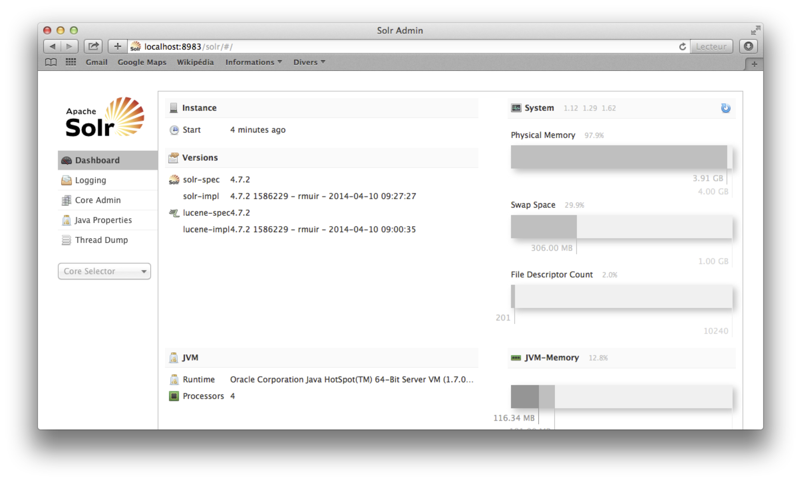
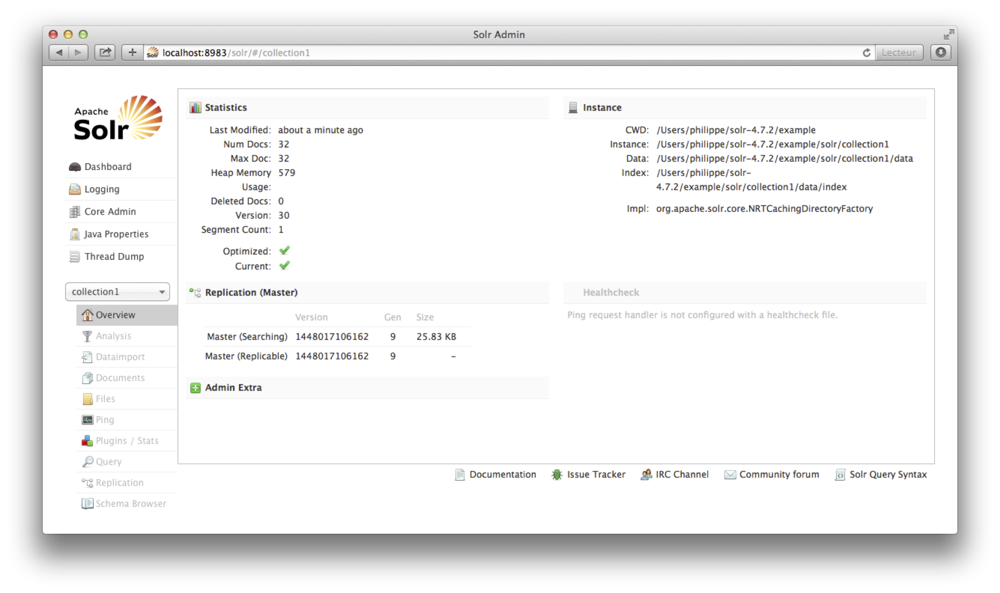
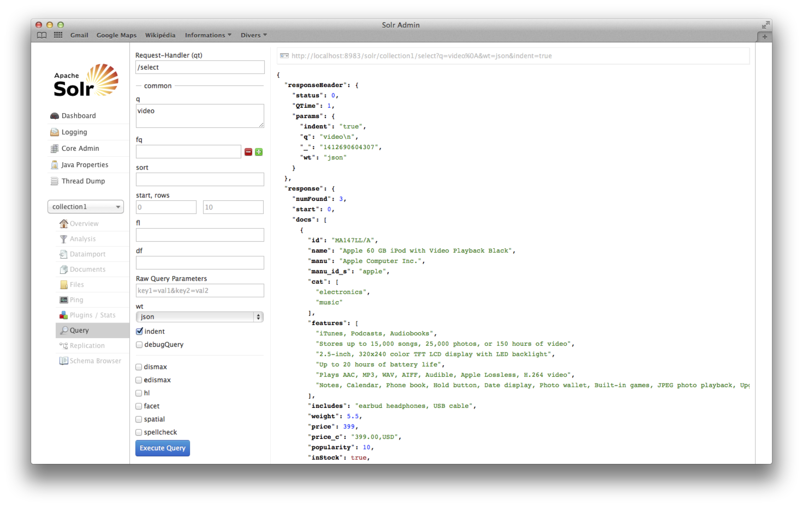
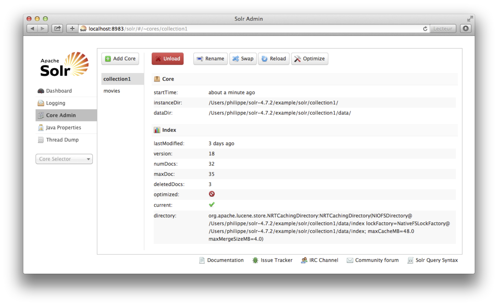
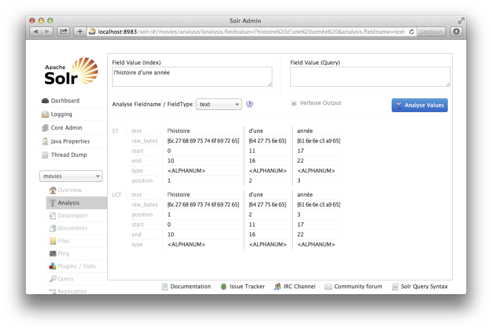
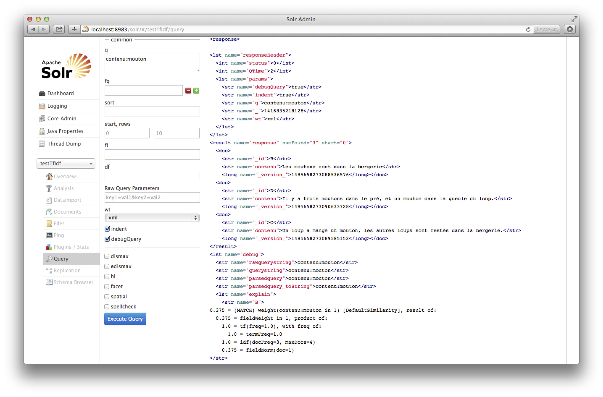

 
.. |nbsp| unicode:: 0xA0 
   :trim:
  
       
.. |oe| unicode:: 0x0153 
   :rtrim:

.. _chap-solr:

####################################
Annexe: Solr, un moteur de recherche
####################################

.. admonition:: Avertissement au lecteur

  Ce chapitre était auparavant dispensé dans le cours de Recherche
  d'information. Les systèmes ont évolué et le cours repose maintenant sur
  Elasticsearch. Cette présentation de Solr, basée sur une version un peu
  ancienne, peut permettre de comparer Elasticsearch et Solr, de comprendre
  quels sont les `invariants` du travail de concepteur de moteur de recherche.

Nous allons continuer notre découverte des systèmes d'indexation avec le moteur de recherche 
`Solr <http://lucene.apache.org/solr>`_,
un des  outils Open Source les plus répandus (avec Sphinx et ElasticSearch, sur
lequel nous reviendrons ultérieurement pour la simplicité de son modèle de passage
à l'échelle par distribution).  Solr est (comme ElasticSearch) 
basé sur
les index du système Lucene. Pour l'instant nous allons installer Solr,
indexer nos collections et les interroger. Dans un second temps nous
regarderons en interne comment fonctionne le système.

*******************************
S1: installation, mise en route
*******************************

Supports complémentaires:

  * `Présentation: <http://b3d.bdpedia.fr/files/RI-cours2.pdf>`_
  * `Vidéo de la session Solr, installation et premiers tests <http://avc.cnam.fr/univ-r_av/avc/courseaccess?id=2261>`_  

Dans cette première session nous installons Solr et testons quelques
fonctionnalités sur les exemples fournis.

Installation
============

.. Récupérez la dernière version stable de Solr depuis le site
.. http://lucene.apache.org/solr/downloads.html, décompressez

L'installation est très simple: vous avez juste besoin d'une version récente de
Java (1.7 au moins) sur votre ordinateur. Récupérez la version 4.10.2 de Solr
depuis le site http://archive.apache.org/dist/lucene/solr/ (fichier
solr-4.10.2.zip, 149 Mo), décompressez l'archive quelque part (appelons ce
quelque part ``soldir``). Rendez-vous dans ``soldir/example`` et exécutez la
commande:

.. code-block:: bash

   java -jar start.jar

Cela devrait vous permettre d'avoir une collection par défaut.
   
Solr est une application java contenue dans un serveur Web, sur le port 8983. 
Vous devriez, avec votre navigateur,
pouvoir accéder à l'URL http://localhost:8983/solr/ et obtenir
l'affichage de la figure :ref:`solr-admin`. Félicitations: Solr
est installé et prêt à l'emploi.

.. note:: Comme pour tous les systèmes présentés dans ce cours, nous ne donnons
   pas la procédure d'installation *en production*. Notre but est de découvrir
   les principes et fonctionnalités d'un moteur de recherche, pas de devenir un expert
   en administration. Nous nous limiterons à la configuration pré-définie dans le 
   sous-répertoire ``example``. Elle exécute Solr comme une *servlet* contenue dans le serveur Jetty.  

.. _solr-admin:

   
      L'interface d'administration de Solr
      
Insertion de documents
======================

Solr fournit des services REST (le format d'échange étant XML ou JSON) pour
insérer des *documents*, effectuer des requêtes, etc. Le service qui se charge
de mettre à jour un index se situe à l'URL http://localhost:8983/solr/update (si
Solr est sur votre machine locale bien sûr). La requête HTTP pour transmettre un
document XML à indexer s'attend à recevoir un document de type
``Content-type:application/xml``, avec un codage binaire pour éviter
d'interpréter un codage utf-8 comme de l'ASCII. Bref, voici la commande ``curl``
pour transmettre un fichier ``item.xml``. 

.. code-block:: bash

    curl http://localhost:8983/solr/update --data-binary @item.xml  -H 'Content-type:application/xml'

.. important:: 

  Curl est un utilitaire qui permet de ransmettre des requêtes HTTP à un service
  depuis la ligne de commande. Pour la présentation de REST et de Curl, voir le
  chapitre :ref:`chap-bddoc`.
   
Solr fournit quelques documents exemples dans ``exampledocs``, ainsi que deux utilitaires pour
les indexer.

   * ``post.jar``  est un programme java avec diverses options. L'utilisation la plus
     simple est l'insertion de documents XML locaux:
     
     .. code-block:: bash
       
       java -jar post.jar *.xml

.. java -jar post.jar *.xml
        bin/post -c gettingstarted example/exampledocs/*.xml

   * ``post.sh`` est simplement un script du *shell* (regardez
     son contenu, il tient en quelques
     lignes). Pour le même résultat, on fait: 
      
     .. code-block:: bash

        ./post.sh *.xml    
   
Vous devriez obtenir des messages de confirmation de l'insertion (c'est plus clair avec le programme java).
Vous pouvez voir les documents à l'url http://localhost:8983/solr/gettingstarted/browse.

Reportez-vous maintenant à l'interface Web, et sélectionnez le *core* ``Collection1`` dans
la barre de navigation gauche. Vous devriez obtenir l'affichage de la figure :ref:`solr-apres-insert`,
et la confirmation que des documents ont été indexés.
       
.. _solr-apres-insert:

   
      Consultation de la ``Collection1`` montrant des documents indexés.

.. note:: La notion de *core* correspond, dans ElasticSearch, 
   à la notion d'index (ce qui est quand même plus clair).

Avant de passer à la section suivante, jetez un œil au contenu (et à la structure)
des documents XML que vous venez d'indexer. En voici un, abrégé.

.. code-block:: xml
    
    <add>
     <doc>
      <field name="id">SOLR1000</field>
      <field name="name">Solr, the Enterprise Search Server</field>
      <field name="manu">Apache Software Foundation</field>
      <field name="cat">software</field>
      <field name="cat">search</field>
      <field name="features">Advanced Full-Text Search Capabilities using Lucene</field>
      <field name="features">Optimized for High Volume Web Traffic</field>
      <field name="price">0</field>
      <field name="popularity">10</field>
      <field name="inStock">true</field>
      <field name="incubationdate_dt">2006-01-17T00:00:00.000Z</field>
     </doc>
    </add>
   
Le document est constitué de *champs* (*fields*), chaque champ étant indexé séparément. Le nom
du champ est indiqué par l'attribut ``name``. Pour que ces champs soit acceptés par Solr,
il faut qu'ils aient été déclarés au préalable dans le *schéma* de l'index. Par exemple,
dans le schéma utilisé par Solr pour cet exemple initial, le champ
``price`` est déclaré comme numérique, et le champ ``features`` comme chaîne 
de caractères.  On retrouve le même principe que dans ElasticSearch: 
l'indexation se fait sur des documents structurés contenant les données
de la base sur lesquelles ont souhaite effectuer les recherches. Le fait
d'imposer un schéma pour ces documents (ce qu'ElasticSearch ne fait pas pas défaut) 
est caractéristique
d'une approche où on privilégie le contrôle et les contraintes sur la rapidité
de mise en œuvre.

.. important:: Dans ce qui suit nous allons parler des *documents Solr*  pour désigner
   la liste des champs transmise à l'index, et les distinguer des *documents applicatifs*
   contenus dans notre base de données documentaire. 

Solr peut  être vu comme une base de données spécialisée
dans la recherche d'information: on y insère des documents (Solr), conformes à un schéma,
et on peut rechercher des documents (Solr). Peut-on utiliser Solr comme base
documentaire? Pas tout à fait: nous y revenons plus loin.

Interroger un index avec Solr
=============================

Comme pour les insertions, Solr dispose d'une interface REST pour *rechercher* des documents.  
Essayez par exemple l'URL suivante (avec ``curl``, ou simplement avec votre navigateur):

.. code-block:: text

    http://localhost:8983/solr/select?q=video
  
La réponse est formattée en XML. On peut aussi demander un retour en JSON:

.. code-block:: text

    http://localhost:8983/solr/select?q=video&wt=json&indent=yes

Et, enfin, il est sans doute plus agréable d'utiliser l'interface d'administration
qui permet d'entrer des requêtes et de jouer sur tous les paramètres.

.. _solr-query:

   
      La fenêtre d'interrogation dans l'interface Web de Solr.
      
Regardez la réponse transmise par Solr. Elle comprend un en-tête donnant
quelques propriétés sur l'exécution (notamment le temps de réponse, ici très court)
et la liste des *documents (Solr)* dont Solr a considéré 
qu'ils satisfaisaient les critères.

Ces documents Solr sont constitués des valeurs de champs
insérés dans l'index. Le résultat d'une recherche est donc le *document Solr* 
initialement
inséré. Souvent, cela ne suffit pas, et il faut, à partir du document
Solr, accéder au *document applicatif* (et complet) stocké dans la base documentaire. Parmi la
liste des champs, on en trouve presque toujours un nommé ``id`` qui contient
la valeur de la clé d'accès au document dans la base documentaire. Il reste
donc à faire un ``get`` sur cette dernière.

.. important::  Les champs ramenés par une requête sont en fait ceux déclarés par le schéma
   comme étant *stockés*. Voir plus loin.

Notez que certains de ces champs (``cat`` et ``features`` par exemple) sont multivalués (ils
sont représentés par des tableaux en JSON). Reportez-vous à l'exemple du document Solr en XML
donné ci-dessus: nous avons bien indiqué plusieurs valeurs pour, par exemple, le champ ``cat``.
L'index en a tenu compte.

Solr étant un moteur de recherche, c'est dans la recherche qu'il excelle. Il existe
donc de nombreuses et puissantes options pour aller au delà de la simple recherche par
mot-clé illustrée jusqu'à présent. En voici un échantillon (vous pouvez aussi vous 
reportez à la section consacrée à ElasticSearch).

Tout d'abord, on peut effectuer une "projection" à la SQL pour ne conserver que certains champs.
Le paramètre correspondant est ``fl`` (comme *field list*). Passez par
exemple ce paramètre avec la valeur ``id,name``::

  http://localhost:8983/solr/select?q=video&fl=id,name

Une autre manière d'exploiter la structuration en champs est d'indiquer explicitement
dans quel champ on effectue une recherche. On préfixe pour cela la valeur du mot-clé
avec le nom du champ. Soit, par exemple::

  http://localhost:8983/solr/select?q=name:black
  
On peut *paginer* le résultat avec les paramètres ``start``  et ``rows``::

  http://localhost:8983/solr/select?q=video&start=1&rows=10
 
Les fonctionnalités de recherche sont proches de celles déjà vues pour 
ElasticSearch, et pour cause: les deux systèmes s'appuient sur Lucene
et son langage de base. En revanche, il n'y a pas d'équivalent sous Solr
du langage DSL d'ElasticSearch.

Exercices
=========

.. admonition:: Exercice: mise en route de Solr

   Vous devez simplement installer Solr et tester les commandes montrées dans
   la session qui précède. Il s'agit à peu près du tutorial Solr standard
   tel qu'il se trouve au début de la documentation officielle. Vous avez
   le droit de jouer avec l'interface d'interrogation pour voir quels
   documents sont recherchés en réponse à une requête.
   
******************************************
S2: construisons notre moteur de recherche
******************************************

Supports complémentaires:

  * `Présentation: Indexation avec Solr <http://b3d.bdpedia.fr/files/slindexsolr.pdf>`_
  * `Vidéo de la session Solr, indexation et schéma <http://avc.cnam.fr/univ-r_av/avc/courseaccess?id=2262>`_  
  
Nous avons donc notre base des films dans MongoDB. Nous allons indexer
cette base avec Solr. Un index dans Solr est dénommé "*core*". L'index
que nous avons utilisé jusqu'à présent est configuré par
défaut pour s'appeler ``collection1``. Nous allons configurer
un autre index nommé ``movies``.

Placez-vous dans le répertoire ``soldir/example/solr``. C'est là que se trouve
le sous-répertoire ``collection1``  avec sa configuration et les données
de l'index. Commençons par le copier (l'option ``-R`` sous Unix indique une copie
récursive).

.. code-block:: bash

   cp -R  collection1 movies
   cd movies
   
Maintenant, dans ``movies``, vous devriez avoir:

  * un fichier ``core.properties``; éditez-le et changez la propriété ``name`` en ``movies``;
  * un répertoire ``data`` qui contiendra les données de l'index; videz-le avec
  
    .. code-block:: bash
       
       rm -Rf data/*
       
  * et enfin un répertoire ``conf`` qui contient la configuration de l'index, dont le schéma; c'est là
    que nous allons travailler.
     
    .. code-block:: bash
       
         cd conf

Pour indexer notre base nous allons donner à Solr des *documents Solr* que vous pouvez récupérer
à partir du Webscope. La seule différence avec la représentation JSON complète est que
les artistes sont représentés simplement par leur nom et prénom. Voici un exemple,
qui nous donne donc les champs à indexer.

.. code-block:: javascript

    {
        "_id": "movie:57",
        "title": "Jackie Brown",
        "year": "1997",
        "genre": "crime",
        "summary": "Jackie Brown, hôtesse de l'air, arrondit ses fins de mois ()",
        "country": "USA",
        "director": "Quentin Tarantino",
        "actors": ["Robert De Niro", "Pam Grier", "Bridget Fonda","Michael Keaton","Samuel Jackson"]
    }

Commençons par définir le schéma correspondant à ce type de document.

Le schéma de l'index
====================

Le schéma de l'index donne la liste de tous les champs d'un document Solr
et peut comprendre pour chacun de très nombreuses options parmi lesquelles: 
le type du champ (numérique, entier),
la possibilité de *calculer* la valeur d'un champ à partir d'un autre,
des traitements divers à appliquer à la valeur du champ, etc. Nous allons
en étudier certaines mais pour l'instant nous commencerons avec le minimum.
Voici le *squelette* du fichier ``schema.xml`` (qui, rappelons-le,
se trouve dans ``movies/conf``   et que vous allez devoir compléter).

.. code-block:: xml

   <?xml version="1.0" encoding="UTF-8" ?>

   <schema name="example" version="1.5">
    <!--  Liste des champs de l'index -->
	<fields>
		<field name="_id" type="string" indexed="true" stored="true"
			required="true" />
		<field name="title" type="string" indexed="true" stored="true"
			required="true" />
		<field name="summary" type="text" indexed="true" stored="false"
			required="false" />
		<!-- A compléter -->

		<!-- Un champ dans lequel on concatène les autres pour une recherche "plein-texte" -->
		<field name="text" type="text" indexed="true" stored="false"
			multiValued="true" />
		<copyField source="summary" dest="text" />
		<copyField source="title" dest="text" />

        <!-- Un champ "technique" requis par Solr/Lucene -->
		<field name="_version_" type="long" indexed="true" stored="true" />
	</fields>

	<!-- La clé d'accès à un document dans l'index -->
	<uniqueKey>_id</uniqueKey>

    <!-- Configuration des types de champ -->
	<types>
		<fieldType name="string" class="solr.StrField" />
		<fieldType name="int" class="solr.IntField" />
		<fieldType name="long" class="solr.LongField" />
		<fieldType name="text" class="solr.TextField">
			<analyzer>
				<tokenizer class="solr.StandardTokenizerFactory" />
                <filter class="solr.LowerCaseFilterFactory" />
			</analyzer>
		</fieldType>
	</types>
   </schema>

Il comprend trois parties:

  * la liste des champs, dans l'élément ``fields``, complétée par l'indication du champ de recherche par défaut;
  * le champ qui identifie le document Solr, dans l'élément ``uniqueKey``;
  * la liste des *types de champ*, dans l'élément ``types``.
  
.. note:: Pour des besoins internes, tout schéma doit contenir un champ ``_version_``
   défini comme ci-dessus. 

Définition des types et de la clé
---------------------------------

Chaque type utilisé dans le schéma d'un index doit apparaître
dans un des éléments ``fieldType`` du fichier ``schema.xml``.
Nous n'allons pas passer beaucoup de temps sur les types de champ pour l'instant. Disons brièvement
que Solr fournit tout un ensemble de types pré-définis qui suffisent pour
les besoins courants, qu'un type Solr correspond à une classe Java (le
type est en fait spécifié par la classe), et qu'on peut associer 
des options à un type. Solr impose et contrôle le typage, ce que l'on
peut voir comme un avantage ou un inconvénient (y réfléchir!).

Les options indiquent d'éventuels traitements à appliquer
à chaque valeur du type avant son insertion dans l'index. Dans notre
schéma ci-dessus, nous avons par exemple un type ``text`` pour lequel
nous définissons un "analyseur" ``StandardTokenizerFactory`` qui va
se charger de "découper" le texte en "tokens" pour une recherche plein-texte.
C'est un élément très important de l'indexation qui mérite qu'on y consacre
du temps et de la réflexion, ce que nous ferons dans la prochaine section. 
Retenez pour l'instant  
que cette spécification permet d'indexer chaque mot d'un texte 
et donc d'effectuer une recherche sur n'importe quelle combinaison de mots.

L'élément  ``uniqueKey`` permet de rechercher un document dans l'index par sa clé. C'est
une opération qui s'avère le plus souvent indispensable, ne serait-ce que pour savoir qu'un
document est indexé. Même si l'élément n'est pas obligatoire à proprement parler,
le définir systématiquement semble une bonne pratique.

Définition des champs
---------------------

Examinons la définition d'un champ de l'index, en prenant l'exemple de l'identifiant.

.. code-block:: xml

     <field name="_id" type="string" indexed="true" 
             stored="true" required="true" multiValued="false" />

Les attributs de l'élément XML caractérisent le champ. Le *nom*
et le *type* sont les informations de base.  Ensuite, on
peut trouver toutes sortes d'attributs. La plupart, ayant
une valeur par défaut, sont optionnels. C'est le cas
des suivants, mais nous les avons fait figurer
en raison de leur importance.

  * ``indexed`` indique simplement que le champ peut être utilisé dans une recherche;  
  * ``stored`` indique que la *valeur* du champ est *stockée* dans l'index,
    et qu'il est donc possible de récupérer cette valeur comme résultat
    d'une recherche, *sans avoir besoin de retourner à la base principale*;
    en d'autres termes, ``stored`` permet de traiter l'index *aussi* comme une
    base de données;
  * ``required`` indique que le champ est obligatoire;
  * enfin, ``multivalued`` vaut ``true`` pour les champs ayant plusieurs
    valeurs, soit, concrètement, un *tableau* en JSON; c'est le
    cas par exemple pour le nom des acteurs.

Il faut comprendre l'impact des champs ``indexed``  et ``stored`` dont
toutes les combinaisons sont possibles.

  * ``indexed='true'``, ``stored='false'``: on pourra interroger
    le champ, mais il faudra accéder au document principal dans la  base documentaire si on veut sa valeur;
  * ``indexed='true'``, ``stored='true'``: on pourra interroger
    le champ, *et* accéder à sa valeur dans l'index;
  * ``indexed='false'``, ``stored='true'``: on ne peut pas interroger le champ, mais
    on peut récupérer sa valeur dans l'index;
  * ``indexed='false'``, ``stored='false'``: n'a pas de sens à priori; le seul intérêt
    est d'ignorer le champ s'il est fourni dans le document Solr.
    
.. important:: Vous vous posez peut-être la question: comment peut-on indexer un champ sans le stocker? 
   Et bien c'est notamment le cas pour les textes qui sont décomposés en *termes*,  chaque
   terme étant ensuite indexé indépendamment sous la forme d'une liste
   inversée. Il est alors impossible  de 
   reconstituer le texte avec les données de l'index, 
   d'où l'intérêt de conserver ce dernier dans son  intégralité, à part.

Bien entendu, le choix est une question de compromis: pour simplifier,  *stocker* une valeur
prend plus d'espace que *l'indexer*. Dans la situation la plus extrême, on dupliquerait
la base documentaire en stockant chaque document *aussi* dans l'index. Un stockage
plus important implique de moins bonnes performances.

.. note:: Y a-t-il une valeur par défaut pour les options ci-dessus? Et bien
   ce n'est pas très clair, les valeurs par défaut de  ``indexed`` et ``stored`` 
   par exemple sont *héritées* du type du champ (par exemple ``TextField``), 
   et au niveau du type on ne sait pas toujours comment c'est défini. Il semble
   donc préférable de toujours les mettre explicitement, ce qui a aussi l'avantage
   d'être lisible.

Notre squelette de schéma comprend également un champ "calculé", le champ ``text``. 
Les instructions ``copyField`` indiquent qu'au moment de l'insertion d'un document,
on va "copier" certains champs dans celui-ci.  Pourquoi? Pour deux motivations
principales:

  * le type du champ  "destination" correspond à un mode particulier d'indexation, éventuellement
    différent et complémentaire de celui du champ "origine"; par exemple le contenu d'un titre
    est indexé comme une chaîne de caractères dans le champ ``title``, et comme un texte
    "tokenisé" quand on le copie dans le champ ``text``;
  * si *toutes* les occurrences de chaînes de caractères sont concaténées
    et placées dans un même champ,
    on obtient, en prenant ce champ pour cible, une recherche plein-texte globale, une
    fonctionnalité souvent utile. 

La spécification dans notre schéma est à compléter selon votre goût.
   
Recharger le schéma
-------------------

Après tout changement de schéma, il faut *recharger* l'index. 
Pour recharger un index, à partir de l'interface d'administration, utilisez l'option
*Reload* après avoir sélectionné le *core*, comme montré sur la figure :ref:`solr-reload`.

.. _solr-reload:

     
   Rechargement d'un index après changement de schéma

Voici finalement la commande de chargement (en supposant que vous avez appelé ``solr_doc.json``
l'extrait de la base Webscope).

.. code-block:: bash

    curl 'http://localhost:8983/solr/movies/update/json?commit=true' \
        --data-binary @solr_doc.json -H 'Content-type:application/json'
   
Quand le chargement est effectué avec succès, vous devriez pouvoir
consulter les statistiques sur votre nouvel index avec l'interface Solr, 
et exécuter des requêtes. 
 
Attention, si l'index existant
ne correspond pas au nouveau schéma, le rechargement échouera. C'est une des grosses
différences entre Solr (ou un index en général)
et une base de données: il est difficile de faire évoluer un schéma.
Si le nouveau schéma est incompatible avec l'ancien, la seule solution est de reconstruire
l'index.   Voici les commandes pour supprimer tous les documents de l'index ``movies`` 
(une commande de destruction, suivie d'une commande de validation).

.. code-block:: bash

    curl http://localhost:8983/solr/movies/update  \\
        --data '<delete><query>*:*</query></delete>' -H 'Content-type:text/xml; charset=utf-8'
    curl http://localhost:8983/solr/movies/update \\
         --data '<commit/>' -H 'Content-type:text/xml; charset=utf-8'

Vous pouvez alors modifier le schéma et recharger la base.
 
Consulter l'index 
=================

Continuons notre survol des fonctionnalités de Solr avec un aperçu
de la principale: la *recherche* de documents selon certains critères.
Solr est un moteur de recherche offrant des possibilités très sophistiquées
et nous allons nous contenter des options de base dans ce qui suit. 
La manière d'effectuer une recherche (et d'obtenir des résultats) varie
en fonction de nombreux facteurs, dont:

  * la syntaxe de la requête, qui va du très structuré (requête Booléenne sur des
    champs) au très informel (une liste de mots-clés);
  * le *classement* du résultat: une des grandes différences avec une recherche
    dans une base de données (relationnelle en particulier) est qu'un moteur de recherche
    comme Solr renvoie les documents considérés comme *pertinents* (notion à définir),
    ce qui va au-delà de ceux qui correspondent exactement aux critères de recherche.
  
Dans tout ce qui suit, nous allons utiliser l'interface ``query`` de l'application Web
d'administration de Solr, accessible rappelons-le à http://localhost:8983/solr. 
C'est 
un moyen simple de tester l'interrogation. Dans le cadre d'une application complète, 
on accède à un Solr grâce à l'interface de programmation que nous ne présentons pas ici.

Le principal paramètre que nous allons utiliser est simplement nommé ``q``  pour *query*. Par défaut,
il est proposé dans l'interface avec la valeur ``*.*``  ce qui permet de ramener *tous* les documents
de l'index.

Les autres paramètres sont, en bref:

  * ``fq``: pour *filter query*, un moyen d'interroger non pas l'index entier 
    mais un résultat pré-calculé et stocké en *cache*;
  * ``sort``, pour trier le résultat;
  * ``start`` et ``row``, les paramètres classiques de pagination du résultat;
  * ``fl``  pour *field list*, indique la liste des champs (stockés) à inclure dans le résultat;
  * ``df``, le champ à interroger si non spécifié dans la requête (la valeur par défaut est indiqué
    dans la configuration et vaut en principe ``text``, le champ dans lequel 
    nous avons concaténé
    toutes nos chaînes de caractères);
  * enfin, on trouve la liste des *query parsers* disponibles; un *query parser* correspond à une syntaxe
    d'interrogation particulière.
    
Voici quelques exemples d'utilisation de ces paramètres: vous êtes invités à les tester dans votre
environnement.

  * avec ``sort=title asc``: tri du résultat sur le titre, en ordre ascendant;
  * avec ``fl=title, year``, restriction des champs dans les documents du résultat;
  * avec ``start=10, rows=9``, récupération des documents classés entre les positions 10 à 19;
  * avec ``q=Alien``, vous devriez retrouver le document Solr correspondant au film ``Alien``;
  * avec ``q=Alien`` mais ``df=summary``, vous ne devriez rien trouver;
  * avec ``q=title:Vertigo``, ``df=text``, vous devriez retrouver le film Vertigo;
  * mais avec  ``q=title:vertigo`` (en minuscules), on ne trouve rien. Solr serait-il sensible à la casse?
  * ... non car en cherchant ``scottie``, on retrouve bien Vertigo, alors que Scottie apparaît
    avec une majuscule dans le résumé du film; si vous ne comprenez pas pourquoi relisez-attentivement
    le début du chapitre, et notamment la partie sur le schéma. 
  
Vous remarquerez que le document résultat ne montre que ceux qui ont été définis dans
le schéma comme "stockés". Aussi étrange que cela paraisse (à première vue) les autres champs sont
utiles pour la recherche, mais on ne peut pas récupérer leur valeur. En revanche, il est possible
d'obtenir des informations *calculées* par Solr, sous forme de (pseudo-)champ. C'est
le cas par exemple pour le *score*, qui évalue la pertinence d'un document pour une recherche. 
Dans le paramètre ``fl``, donnez par exemple la liste ``title, year, score``. Faites
une recherche sur un mot-clé (par exemple, ``fin``) et vérifiez que le score détermine le
classement des films trouvés.
  
Par ce moyen, on peut en particulier obtenir des informations sur le pourquoi du score et
du classement: ajoutez l'expression ``[explain style=nl]`` dans la liste des champs
``fl`` et appréciez les détails affichés. Un de nos objectifs à l'avenir est de comprendre
tout ce que cela veut dire.

         
Exercices
==========

.. admonition:: Exercice: construire l'index sur les films

   Vous devez finir la configuration du schéma, en choisissant pour chaque
   champ les valeurs d'option appropriées (ne stockez pas le résumé, potentiellement
   volumineux, par exemple). Faites attention aux champs qui sont
   absents ou n'ont pas de valeurs (parfois, pas d'acteur par exemple).
   Rechargez l'index quand vous avez terminé.

.. ifconfig:: introrisolr in ('public')

   .. admonition:: Correction
  
      Le fichier est `ici <http://b3d.bdpedia.fr/files/schema.xml>`_.

************************************
S3: L'analyse de documents avec Solr
************************************

Supports complémentaires:

  * `Présentation: Analyse des textes avec Solr <http://b3d.bdpedia.fr/files/slanalysesolr.pdf>`_
  * `Vidéo de la session Solr, analyse <http://avc.cnam.fr/univ-r_av/avc/courseaccess?id=2263>`_  
  
Voyons maintenant comment on *analyse* le contenu des documents à indexer.
En présence d'un document textuel un tant soit peu complexe, on ne
peut pas se contenter de découper plus ou moins arbitrairement en mots
sans se poser quelques questions et appliquer un pré-traitement du texte.
Les effets de ce pré-traitement doivent être compris et maîtrisé: ils
influent directement sur la précision et le rappel. Quelques
exemples simples pour s'en convaincre:

 - si on cherche les documents contenant le mot "loup", on s'attend
   à trouver ceux contenant "loups", "Loup", "louve"; si on ne normalise
   pas en supprimant les majuscules et les pluriels, on va dégrader
   le rappel; le cas de "loup /  louve" illustre une transformation 
   qui dépend de la langue et nécessite une analyse approfondie du contenu;
 - inversement, si on normalise "cote", "côte", "côté" en supprimant
   les accents, on va unifier
   des mots dont le sens est différent, et on va diminuer la précision.
   
Il faut donc trouver un bon équilibre, aucune solution n'étant parfaite. 
C'est de l'art et du réglage... 
Pour résumer, l'analyse se compose de plusieurs phases: 

  * *Tokenization*: découpage du texte en "termes".
  * *Normalisation*: identification de toutes les variantes d'écritures d'un
    même terme et choix d'une règle de normalisation (que faire des majuscules? acronymes? apostrophes? accents?).     
  * *Stemming* ("racinisation"): rendre la racine des mots pour éviter le biais des 
    variations autour d'un même sens (auditer, auditeur, audition, etc.)
  *  *Stop words* ("mots vides"), quels mots garder pour représenter le contenu 
     sémantique du document?

Ce qui suit est une brève introduction, essentiellement
destinée à comprendre les outils prêts à l'emploi que nous utiliserons ensuite.  

Tokenisation et normalisation
=============================

Un *tokenizer* prend en entrée un texte (une chaîne de caractères) et 
produit une séquence
de *tokens*. Il effectue donc un traitement purement lexical, consistant 
typiquement à éliminer
les espaces blancs, la ponctuation, les liaisons, etc., et à identifier les "mots". 
Des transformations
peuvent également intervenir (suppression des accents par exemple, 
ou normalisation des acronymes - U.S.A. 
devient USA). 

La tokenization est très fortement dépendante de la langue.
Une fois la langue identifiée, on divise le texte en *tokens* ("mots"). 
ce n'est pas du tout aussi facile qu'on le dirait!

  * Dans certaines langues (Chinois, Japonais), les mots  *ne sont pas* séparés par des espaces.
  * Certaines langues s'écrivent de droite à gauche, de haut en bas.
  * Que faire (et de manière *cohérente*) des acronymes, élisions, nombres, unités, URL, email, etc.
  * Que faire des *mots composés*: les séparer en *tokens* ou les regrouper en un seul? Par exemple:
  
    # Anglais: *hostname*, *host-name* et *host name*, ...
    # Français: Le Mans, aujourd'hui, pomme de terre, ...
    # Allemand: *Levensversicherungsgesellschaftsangestellter* (employé d’une société d’assurance vie).

Pour les majuscules et la ponctuation, une solution simple est de 
normaliser systématiquement (minuscules, pas de ponctuation). Ce qui
donnerait le résultat suivant pour notre petit jeu de données.

     * :math:`d_1`: ``le loup est dans la bergerie``
     * :math:`d_2`: ``le loup et les trois petits cochons``
     * :math:`d_3`: ``les moutons sont dans la bergerie``
     * :math:`d_4`:  ``spider cochon spider cochon il peut marcher au plafond``
     * :math:`d_5`: ``un loup a mangé un mouton les autres loups sont restés dans la bergerie``
     * :math:`d_6`:  ``il y a trois moutons dans le pré et un mouton dans la gueule du loup``
     * :math:`d_7`: ``le cochon est à 12 euros le kilo le mouton à  10 euros kilo``
     * :math:`d_8`: ``les trois petits loups et le grand méchant cochon``

Stemming (racine), lemmatization
================================

La racinisation consiste à *confondre* toutes les formes d'un même mot, ou de 
mots apparentés, en une seule *racine*. Le  *stemming morphologique*
retire les pluriels, marque de genre, conjugaisons, modes, etc. 
Le *stemming lexical* fond les termes proches lexicalement: 
"politique, politicien, police (?)" ou   "université, universel, univers (?)".
Ici, le choix influe clairement sur la précision et le rappel (plus d'unification
favorise le rappel au détriment de la précision).

La racinisation 
est très dépendante de la langue et peut nécessiter une analyse linguistique
complexe.  En anglais, *geese* est le pluriel de *goose*, *mice* de *mouse*; 
les formes   masculin / féminin en français n'ont parfois rien à voir ("loup / louve")
mais aussi ("cheval / jument": parle-t-on de la même chose?) Quelques
exemples célèbres montrent les difficultés d'interprétation:

 * "Les poules du couvent couvent": où est le verbe, où est le substantif?
 * "La petite brise la glace":  idem.

Voici un résultat possible de la racinisation pour nos documents.

     * :math:`d_1`: ``le loup etre dans la bergerie``
     * :math:`d_2`: ``le loup et les trois petit cochon``
     * :math:`d_3`: ``les mouton etre dans la bergerie``
     * :math:`d_4`:  ``spider cochon spider cochon il pouvoir marcher au plafond``
     * :math:`d_5`: ``un loup avoir manger un mouton les autre loup etre rester dans la bergerie``
     * :math:`d_6`:  ``il y avoir trois mouton dans le pre et un mouton dans la gueule du loup``
     * :math:`d_7`: ``le cochon etre a 12 euro le kilo le mouton a 10 euro kilo``
     * :math:`d_8`: ``les trois petit loup et le grand mechant cochon``

Il existe des procédures spécialisées pour chaque langue. En anglais,
le "*Potter stemming*" est le plus connu.

Mots vides et autres filtres
============================

Un des filtres les plus courants consiste
à retire les mots porteurs d'une information faible
("*stop words*" ou "mots vides")  afin de limiter le stockage.

  * Les articles: *le*, *le*, *ce*, etc.
  * Les verbes "fonctionnels": *être*, *avoir*, *faire*, etc.
  * Les conjonctions: *et*, *ou*, etc.
  * et ainsi de suite. [
  
Le choix est délicat car, d'une part, ne pas supprimer
les mots vides augmente l'espace de stockage nécessaire (et ce d'autant
plus que la liste associée à un mot très fréquent est très longue),
d'autre part les éliminer peut diminuer la pertinence des 
recherches  ("pomme de terre", "Let it be", "Stade de France").

Parmi les autres filtres, citons en vrac: 

  * Majuscules / minuscules*. On peut tout mettre en minuscules, mais
    Lyonnaise des Eaux, Société Générale, Windows, etc.
  * *Acronymes*.
    CAT = *cat* ou *Caterpillar Inc.*?  M.A.A.F ou MAAF ou Mutuelle ... ?
  * *Dates, chiffres*.
    Monday 24, August, 1572 -- 24/08/1572 -- 24 août 1572;
    10000 ou 10,000.00 ou 10,000.00

Dans tous les cas, les même règles de transformation s'appliquent aux documents 
ET à la requête. Voici, au final, pour chaque document la liste
des *tokens* après application de quelques règles simples.

     * :math:`d_1`: ``loup etre bergerie``
     * :math:`d_2`: ``loup trois petit cochon``
     * :math:`d_3`: ``mouton etre bergerie``
     * :math:`d_4`:  ``spider cochon spider cochon pouvoir marcher plafond``
     * :math:`d_5`: ``loup avoir manger  mouton autre loup etre rester bergerie``
     * :math:`d_6`:  ``avoir trois mouton pre mouton gueule loup``
     * :math:`d_7`: ``cochon etre douze euro kilo mouton dix euro kilo``
     * :math:`d_8`: ``trois petit loup grand mechant cochon``

Les analyseurs Solr
===================

Un moteur de recherche comme
Solr permet d'associer à chaque *type* de champ la spécification d'une analyse à appliquer
à chaque *valeur* indexée du champ. Si vous reprenez le squelette de schéma fourni
pour notre collection *movies*, vous pouvez noter la définition d'un *analyzer*
pour les champs de type ``text``.

.. code-block:: xml

		<fieldType name="text" class="solr.TextField">
			<analyzer>
				<tokenizer class="solr.StandardTokenizerFactory" />
			    <filter class="solr.LowerCaseFilterFactory" />
			</analyzer>
		</fieldType>

Ce simple exemple montre les trois concepts qui interviennent dans la définition 
d'un analyseur:

  * le *tokenizer* effectue le traitement lexical consistant à transformer
    le texte en un ensemble de *tokens* ; 
  * les filtres (*filter*) examinent les *tokens* un par un et décident de les conserver, de les remplacer 
    par un ou plusieurs autres;
  * enfin, l'analyseur est une chaîne de traitement (*pipeline*) constituée de tokeniseurs et de filtres;
    on peut constituer ainsi des processus de transformation du texte arbitrairement complexes.

Un filtre prend une séquence de *tokens* et produit une autre séquence de *tokens*. Chaque *token*
considéré par un filtre peut être conservé tel quel, éliminé, ou remplacé par un ou plusieurs *tokens*.
Par exemple:

   * le filtre ``LowerCaseFilterFactory``  met tous les tokens en minuscules;
   * le filtre ``SynonymFilterFactory``  remplace un token par la liste de ses synonymes;
   * le filtre ``StopFilterFactory``  élimine les *stop words*.
   * le filtre ``PorterStemFilterFactory`` applique le *stemming* selon la méthode Porter
     pour les mots anglais.
    
En règle générale, le *même* *analyzer* doit être appliqué aux documents et à la requête,
pour des raisons évidentes de cohérence (si, par exemple, on retire les accents dans les documents
mais pas dans la requête, la recherche ne marchera pas ou très mal). Dans de rares cas
où des traitements différents devraient être appliqués, Solr permet la spécification
de deux analyseurs. Voici, à titre d'exemple (notez l'attribut XML ``type``), 
une spécification qui donnerait des résultats désastreux !

.. code-block:: xml

   <fieldType name="nametext" class="solr.TextField">
    <analyzer type="index">
      <tokenizer class="solr.StandardTokenizerFactory"/>
      <filter class="solr.LowerCaseFilterFactory"/>
    </analyzer>
    <analyzer type="query">
      <tokenizer class="solr.StandardTokenizerFactory"/>
      <filter class="solr.UpperCaseFilterFactory"/>
    </analyzer>
  </fieldType>

Nous laissons donc cette option de côté. 
En résumé, la spécification d'un analyseur comprend
un *tokenizer* qui transforme un flux de caractères en une séquence de "mots" (appelés
*tokens*), suivi d'une liste de filtres qui effectuent chacun des transformations de mots
selon certaines règles. Voyons maintenant dans le détail ces étapes.

Tester votre configuration
==========================

L'analyseur Solr pour un index (un *core*) se configure dans le fichier ``schema.xml``. Pour vérifier
que cette configuration convient, Solr fournit un outil extrêmement utile: un formulaire
Web dans lequel on peut saisir du texte et consulter l'analyse appliquée à ce texte et son résultat.

Accédez à l'interface Web de Solr (http://localhost:8983/solr), choisissez le *core* ``movies``
dans la barre de menu à gauche,  puis le choix ``analysis``. Vous obtenez une interface
semblable à celle de la figure :ref:`solr-analysis`.

.. _solr-analysis:

   
      Test d'un analyseur avec l'interface de Solr

Nous utilisons cet utilitaire de la manière suivante:
  
  * dans le champ *field value (index)*, on saisit un texte à analyser; 
  * dans le menu déroulant au dessous, on choisit un des champs du schéma
    de l'index; c'est donc l'analyseur de ce champ qui sera appliqué.
    
Quand on lance l'analyse, Solr montre les différentes étapes (*tokenizer*, filtres) et leurs
résultats. On peut donc visualiser tout ce qui se passe quand on fournit, dans un
document Solr, une valeur à indexer. Dans l'exemple illustré par la figure, on voit
que le texte est ``l'histoire d'une année``. Avec notre configuration de l'analyseur
les élisions (l') sont conservées, ainsi que les accents. Il apparaît donc que si l'on
cherche ``histoire`` dans l'index, rien de sera ramené.  De même, si on la malchance
d'utiliser un clavier sans accent, on ne pourra pas rechercher ``annee`` (en tout cas
l'association avec ``année`` ne sera pas trouvée). Il est probable que l'on
souhaiterait ne pas indexer ``d'une`` qui apporte peu d'information sur 
le sens de l'expression indexée.

Notre analyseur ne fait donc pas l'affaire (pour le français). À vous de jouer!

.. note:: Puisque nous appliquons le même analyseur à la création de l'index et à la requête,
   l'analyse appliquée à une valeur entrée dans ``field value (query)`` donnerait des résultats identiques.

L'interface présentée ci-dessus rend très facile la mise au point d'un analyseur. Les étapes
sont les suivantes:

  * test d'un texte court pour vérifier si une transformation souhaitée (élimination
    des accents par exemple) est obtenue ou non;
  * si l'analyseur doit être modifié, on édite le fichier ``schema.xml`` et
    on change la configuration du champ indexé;
  * il faut recharger le *core* avec la fonction disponible dans l'interface Solr (*Core admin*);
  * et on recommence autant de fois que nécessaire.

  
Exercices
=========
   
Le but de ces exercices est de configurer notre index *movies* pour que les
textes (en français) placés dans le champ ``text`` 
soient correctement analysés. Il s'agit pour l'essentiel de trouver
et d'appliquer le bon tokenizer ou le bon filtre. À vous de chercher sur le Web ou la
documentation Solr: c'est un bon moyen d'explorer au-delà du strict exercice proposé.

.. admonition:: Exercice: traitement du texte

   Réglez l'analyseur pour que les transformations suivantes soient effectuées.
   
     * suppression des élisions (*l'*, *d'*, *jusqu'*, etc.);
     * suppression des accents (plusieurs solutions: les étudier);
     * enfin ajouter un filtre de racinisation (*stemming*) adapté au français.       

   Au final, faites des tests avec le résumé de quelques films pour voir le résultat.
             
.. ifconfig:: introri in ('public')

   .. admonition:: Correction

    Le filtre à ajouter pour les élisions.
    
    .. code-block:: xml

     <filter class="solr.ElisionFilterFactory" />			    

    Filtre pour les accents (attention, cette solution transforme tout caractère ASCII "étendu"
    en l'un des caractères ASCII compris entre les codes 0 et 127. Le "ç" par exemple devient "c". 

    .. code-block:: xml
    
       <filter class="solr.ASCIIFoldingFilterFactory"/>

.. admonition:: Exercice: élimination des *stop words*

   Maintenant ajoutez à votre analyseur un filtre éliminant les *stop words*. Vous
   trouverez facilement sur le Ouaibe des fichiers de *stop words* prêts à l'emploi.
   Tous les articles, prépositions, articles, etc., devraient ne pas être indexés.
 
              
.. ifconfig:: introri in ('public')
 
    .. admonition:: Correction

     Le filtre à ajouter pour les mots vides (en utilisant le fichier fourni avec Solr!).
    
     .. code-block:: xml

         <filter class="solr.StopFilterFactory" ignoreCase="true" 
            words="lang/stopwords_fr.txt" format="snowball" />

.. admonition:: Exercice: ajout de synonymes (optionnel)

   Finalement, testez l'option de gestion des synonymes. Solr fournit un filtre des synonymes
   (``SynonymFilter``) 
   qui s'appuie sur un fichier contenant, sur chaque ligne, une liste de synonymes. Par exemple::
    
     Télévision, Télévisions, TV, TVs
   
   C'est à vous de créer ce fichier et de le référencer quand vous placer le filtre des synonymes
   dans l'analyseur. Il faut ensuite réfléchir à quelques options:
   
     * Pratique-t-on par *expansion* ou par *réduction*? Dans le cas de l'expansion, chaque
       mot est "étendu" à l'ensemble des synonymes. Cela signifie qu'un document indexé
       avec ``télévision`` le sera aussi avec TV, ce qui augmente d'autant la taille de l'index.
       Dans le cas d'une réduction, tous les synonymes sont indexés sous un unique terme-représentant.
     * Faut-il traiter de la même manière l'analyseur pour l'index et pour les requêtes? Réflechissez
       à ce qui peut se passer dans les divers cas de figure...
     * Enfin, faut-il traiter les synonymes *avant* ou *après* la racinisation?
    
    Vous trouverez bien entendu des ressources sur le Web à ce sujet. Testez, validez,
    trouvez la bonne ou la mauvaise méthode: apprenez!
    

************************
S4: Classement avec Solr
************************

Pour conclure en pratique ce chapitre sur le classement avec la similarité cosinus
basée sur le tf.idf, nous allons effectuer une mise en pratique avec Solr. L'objectif
est d'obtenir l'explication du classement effectué par Solr pour une requête donnée,
et de vérifier que nous comprenons ce qui se passe.

Mise en place de la base
========================

Pour bien interpréter les calculs, nous prenons nos 4 documents sur les loups et les
moutons (vous pouvez prendre ceux sur les cochons, ou tout exemple qui vous convient mieux).
Vous allez créer un nouvel index (*core*) dans Solr, nommé ``testTfIdf``, en suivant les mêmes instructions
que celles décrites dans le chapitre :ref:`chap-solr`  pour la mise en place de l'index
sur les films.

Le schéma est simple: les documents ont simplement un *id* et un champ
``contenu``. 

.. code-block:: xml

   <?xml version="1.0" encoding="UTF-8" ?>

   <schema name="example" version="1.5">
   <!--  Liste des champs de l'index -->
        <fields>
                <field name="_id" type="string" indexed="true" stored="true"
                        required="true" />
                <field name="contenu" type="text" indexed="true" stored="true"
                        required="false" />

                <!-- Un champ dans lequel on concatène les autres pour une recherche "plein-texte" -->
                <field name="text" type="text" indexed="true" stored="false"
                        multiValued="true" />
                <copyField source="contenu" dest="text" />

        <!-- Un champ "technique" requis par Solr/Lucene -->
                <field name="_version_" type="long" indexed="true" stored="true" />
        </fields>

        <!-- La clé d'accès à un document dans l'index -->
        <uniqueKey>_id</uniqueKey>

    <!-- Configuration des types de champ -->
        <types>
                <fieldType name="string" class="solr.StrField" />
                <fieldType name="int" class="solr.IntField" />
                <fieldType name="long" class="solr.LongField" />
               <fieldType name="text" class="solr.TextField">
                   <analyzer>
                    <tokenizer class="solr.StandardTokenizerFactory" />
                      <!-- Normalisations diverses -->
                      <filter class="solr.LowerCaseFilterFactory" />
                      <filter class="solr.ElisionFilterFactory"/>
                    <filter class="solr.PatternReplaceFilterFactory"
                        pattern="^(\p{Punct}*)(.*?)(\p{Punct}*)$" replacement="$2"/>
                    <filter class="solr.SnowballPorterFilterFactory" 
                         language="French" protected="protwords.txt"/>
                    </analyzer>
          </fieldType>
        </types>
   </schema>

Rechargez votre *core*, et insérez le document suivant, nommé ``loups.json`` 
(ou un autre, mais c'est à vous de le créer).

.. code-block:: json

    [
     {
       "_id" : "A",
       "contenu" : "Le loup est dans la bergerie" 
     } ,
     {
       "_id" : "B",
       "contenu" : "Les moutons sont dans la bergerie" 
     },
     {
       "_id" : "C",
       "contenu" : "Un loup a mangé un mouton, les autres loups sont restés dans la bergerie." 
     },
     {
       "_id" : "D",
       "contenu" : "Il y a trois moutons dans le pré, et un mouton dans la gueule du loup." 
     }
   ]

Pour rappel, voici la commande de chargement.

.. code-block:: bash

    curl 'http://localhost:8983/solr/testTfIdf/update/json?commit=true' 
             --data-binary @loups.json -H 'Content-type:application/json' 
             
Vous devriez pouvoir accéder à votre *core* avec l'interface Web, et effectuer des
requêtes comme ``contenu:loup``  pour rechercher tous les documents qui parlent
de loup(s). 

Comprendre le classement Solr
=============================

Solr nous fournit des informations sur le classement d'une requête si on ajoute le
paramètre ``debugQuery=on``. Avec l'interface Web, il suffit de cocher une case. Par ailleurs,
il est préférable pour consulter les informations de choisir le format de sortie XML.
La figure :ref:`solr-explain` montre la fenêtre d'interrogation avec les deux options
(``xml`` et ``debugQuery``) appropriées. 

.. _solr-explain:

   
      Afficher les explications de Solr sur le classement
      

Le résultat  contient alors un élément XML ``debug`` qui vous donne des informations
sur la requête et sur le classement. Voici le début de ce document:

.. code-block:: xml

    <lst name="debug">
      <str name="rawquerystring">contenu:loup</str>
      <str name="querystring">contenu:loup</str>
      <str name="parsedquery">contenu:loup</str>
      <str name="parsedquery_toString">contenu:loup</str>
      <lst name="explain">
      <str name="A">
        0.375 = (MATCH) weight(contenu:loup in 0) [DefaultSimilarity], result of:
        0.375 = fieldWeight in 0, product of:
        1.0 = tf(freq=1.0), with freq of:
        1.0 = termFreq=1.0
        1.0 = idf(docFreq=3, maxDocs=4)
        0.375 = fieldNorm(doc=0)
      </str>
    </lst_name>

C'est ici que votre sens de l'interprétation intervient: sur la base du cours, vous devriez
repérer des informations comme ``tf``, ``idf``, ``fieldNorm``, et en déduire le calcul
du score (*weight*) obtenu par Solr. Attention: Solr (Lucene en fait) applique des formules
légèrement différentes de celles que nous avons données. Par exemple, l'idf est calculé avec

.. math::

    \mathrm{idf}(t)=1 + \log\frac{|D|}{\left|\left\{1+d' \in D\,|\,n_{t,d'}>0\right\}\right|}

Vous en saurez plus en consultant les explications de la page
    - https://lucene.apache.org/core/4_0_0/core/org/apache/lucene/search/similarities/TFIDFSimilarity.html. 
    
      La documentation "officielle", par forécement très claire.
      
    - http://www.openjems.com/solr-lucene-score-tutorial/
    
      Un bon tutorial qui explique avec exemples comment le calcul est fait en pratique (avec ajustements, arrondis,
      etc., d'où une certaine difficulté à s'y retrouver)

Regroupements (*clustering*)
============================

La similarité cosinus peut être utilisée non seulement pour mesurer
la pertinence d'un document par rapport à une requête, mais aussi la
proximité des documents entre eux. Deux documents sont d'autant plus
proches que l'angle
qu'ils forment est petit. 

Sur la base de cette mesure de proximité, il est possible de développer
un algorithme de regroupement (*clustering*). Solr fournit une intégration
du moteur de regroupement Carrot (http://project.carrot2.org/). Pour avoir un aperçu 
de cette option, lancez Solr avec la commande suivante.

.. code-block:: bash

    java -Dsolr.clustering.enabled=true -jar start.jar
    
Puis, dans l'interface Web, prenez la collection ``collection1`` fournie
comme exemple de base avec Solr, dans laquelle vous avez chargé les quelques
documents XML du répertoire ``exampledocs``. Le *clustering* de Solr est configuré
par défaut pour s'appliquer au schéma de ces documents.

Dans l'interface d'administration, lancez une requête ``*.*`` après avoir
remplacé ``/select`` par ``/clustering`` dans le champ ``Request-handler``. Vous obtenez
une liste de groupes (*clusters*) dont voici un échantillon.

.. code-block:: json

    {"clusters": [
        {
          "labels": [
            "iPod"
           ],
          "score": 1.3174612693376382,
          "docs": [
            "F8V7067-APL-KIT",
            "IW-02",
            "MA147LL/A"
          ]
        },
        {
          "labels": [
            "Hard Drive"
          ],
          "score": 3.781542178548597,
          "docs": [
            "SP2514N",
            "6H500F0"
          ]
        }
      ]
     }
        
Entrer dans les détails de l'algorithme et de sa configuration nous amènerait un peu trop loin,
mais cela peut faire l'objet d'un projet pour le cours. Vous trouverez un point de départ ici:
https://cwiki.apache.org/confluence/display/solr/Result+Clustering.

Exercices
=========

.. _Ex-S4-1:
.. admonition:: Exercice `Ex-S4-1`_: pesons les loups et les moutons avec Solr

     - Reprenez les requêtes suivantes:
     
       - :math:`q_1`. "loup et pré"
       - :math:`q_2`. "loup et mouton"
       - :math:`q_3`. "bergerie"
       - :math:`q_4`. "gueule du loup"
      
       consultez le résultat donné par Solr
       pour le classement, et tentez de l'expliquer.
   
     - Au fait, quel est le poids des termes de la requête? Par défaut, il sont
       tous égaux à 1, et donc considérés comme d'importance égale.  Vous pouvez
       changer cela dans la syntaxe de la requête. Par exemple, la requête suivante
       accorde le même poids aux loups et aux cochons::
       
         loup cochon
         
       Si vous êtes surtout intéressés par les documents parlant de cochons, et accessoirement
       de loups, vous pouvez indiquer un poids plus important (que 1) pour vos cochons::
       
        loup cochon^2

      Vous êtes invités à tester cette option et son influence sur le classement.

            
****
Quiz
****
  
Répondez aux questions suivantes pour vérifier que vous avez bien compris le cours.

  * On exprime une requête avec un seul terme. Est-ce que l'idf du terme a une importance pour 
    le classement?
  * Quel est l'idf d'un terme qui apparaît dans *chaque* document de la collection (c'est le moment
    de regarder une table des logarithmes si vous ne l'avez pas en tête) ?
  * Quel est l'impact de la base du logarithme de l'idf sur le classement ?
  * Je soumets une requête :math:`t_1 t_2 \cdots t_n`. Quel est le poids de chaque terme
    dans le vecteur représentant cette requête? La normalisation de ce vecteur est elle
    importante pour le classement (justifier)? 
  * Je soumets une requête composée de deux termes: "tératologie" et "document". Lequel a le plus
    d'importance pour le classement, et comment est-ce pris en compte par le moteur de recherche?
  * Dans la figure `euclidiandistance`_, qu'obtient-on en projetant un vecteur sur chaque axe?

    .. _euclidiandistance:
    
     .. figure:: ../figures/euclidiandistance.png       
        :width: 50%
        :align: center
   
        Vecteurs dans un espace Euclidien
   
  * Je soumets une requête composée de deux termes: :math:`t_1`  et :math:`t_2`. Chaque document
    contient soit :math:`t_1`, soit :math:`t_2` mais jamais les deux ensemble. De plus il
    y a autant de documents avec :math:`t_1` que de documents avec :math:`t_2`. Quels
    sont les valeurs possibles des poids calculés par le moteur de recherche? 
    
    Même question si la requête est simplement :math:`t_1`.

  * Un document peut-il obtenir un classement élevé même s'il ne contient 
    pas tous les termes de la requête? Donner un exemple ou un contre-exemple (le plus simple
    possible).
    
     
